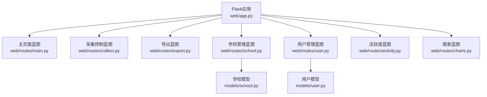
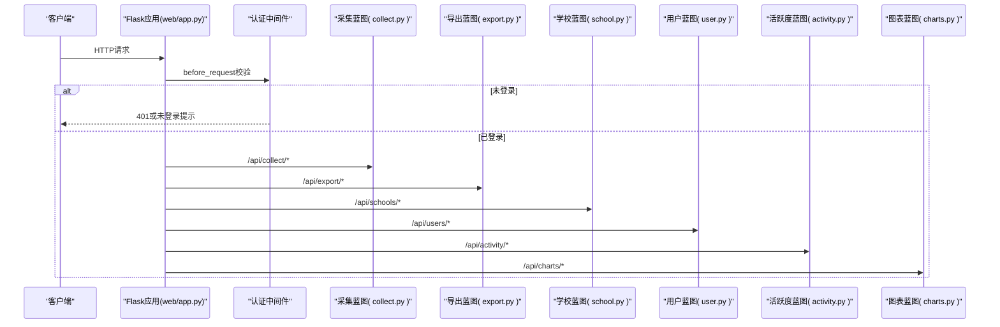
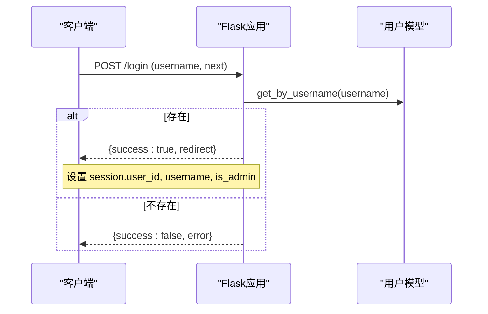
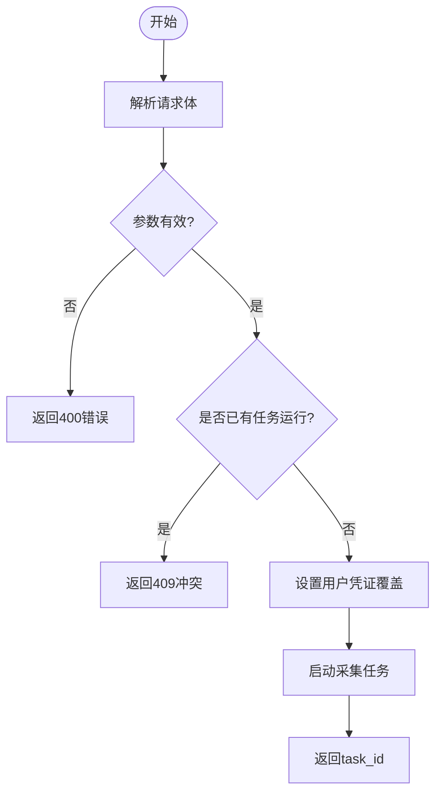
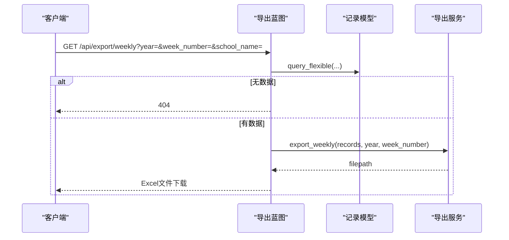
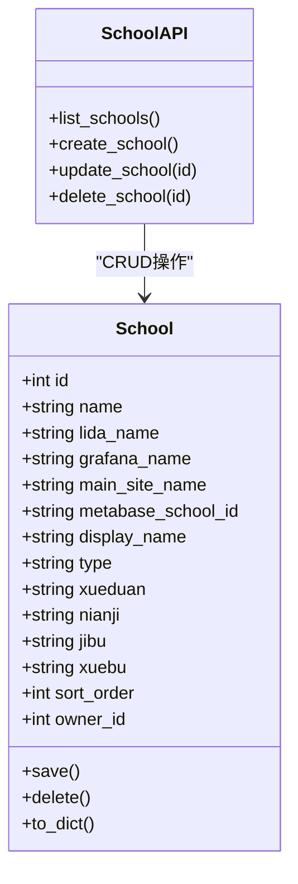
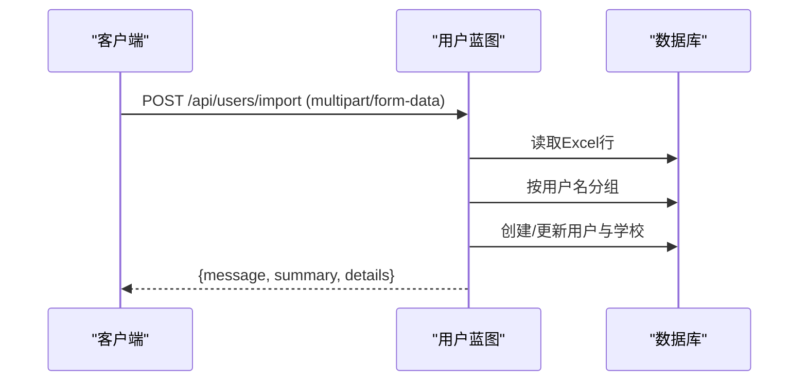
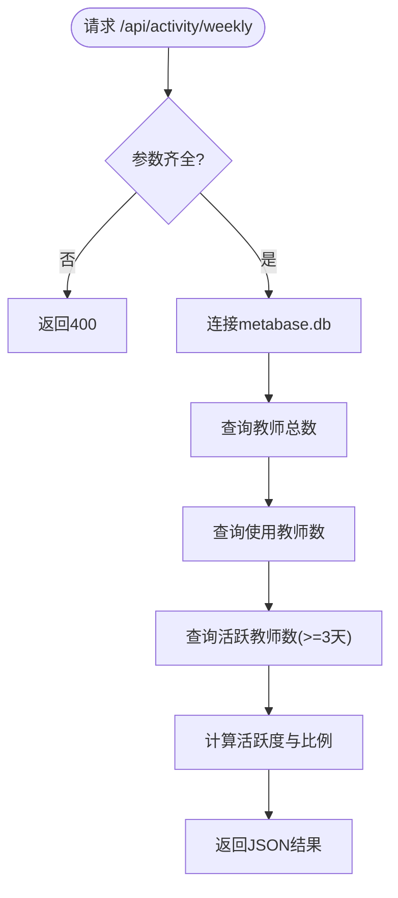
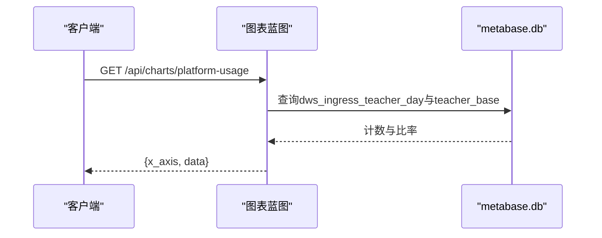
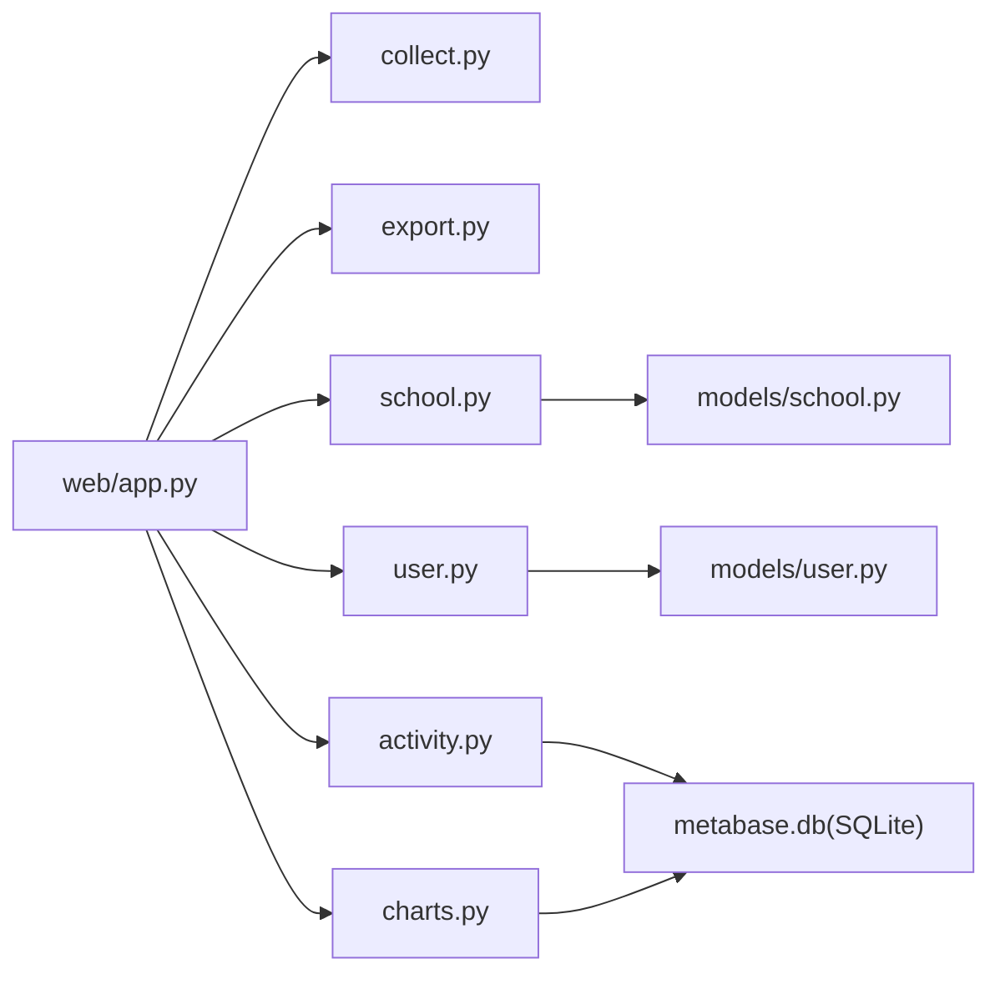

# API接口文档

<cite>
**本文引用的文件**
- [web/app.py](file://web/app.py)
- [web/routes/main.py](file://web/routes/main.py)
- [web/routes/collect.py](file://web/routes/collect.py)
- [web/routes/export.py](file://web/routes/export.py)
- [web/routes/school.py](file://web/routes/school.py)
- [web/routes/user.py](file://web/routes/user.py)
- [web/routes/activity.py](file://web/routes/activity.py)
- [web/routes/charts.py](file://web/routes/charts.py)
- [models/user.py](file://models/user.py)
- [models/school.py](file://models/school.py)
</cite>

## 目录
1. [简介](#简介)
2. [项目结构](#项目结构)
3. [核心组件](#核心组件)
4. [架构总览](#架构总览)
5. [详细组件分析](#详细组件分析)
6. [依赖关系分析](#依赖关系分析)
7. [性能与并发特性](#性能与并发特性)
8. [错误码与安全说明](#错误码与安全说明)
9. [客户端集成指南](#客户端集成指南)
10. [故障排查](#故障排查)
11. [结论](#结论)

## 简介
本文件为数据采集平台的RESTful API参考文档，覆盖以下能力：
- 采集控制接口（/api/collect/*）：任务启动、状态查询、暂停/继续、SSE进度流
- 数据导出接口（/api/export/*）：周度/月度Excel导出、预览、可选过滤
- 学校管理接口（/api/schools/*）：增删改查、权限控制
- 用户管理接口（/api/users/*）：认证授权、凭证管理、批量导入
- 活跃度查询接口（/api/activity/*）：时间范围筛选、聚合统计
- 图表数据接口（/api/charts/*）：多维度分析、可视化数据格式
- 通用认证方式、错误码定义、请求频率限制建议、安全注意事项
- 完整请求响应示例与客户端集成要点

## 项目结构
后端基于Flask蓝图组织，各功能域以独立蓝图注册到应用工厂中。认证中间件统一拦截未登录访问并返回401或重定向登录页。

**图示来源**
- [web/app.py:306-336](file://web/app.py#L306-L336)
- [web/routes/main.py:10-10](file://web/routes/main.py#L10-L10)
- [web/routes/collect.py:13-13](file://web/routes/collect.py#L13-L13)
- [web/routes/export.py:10-10](file://web/routes/export.py#L10-L10)
- [web/routes/school.py:6-6](file://web/routes/school.py#L6-L6)
- [web/routes/user.py:12-12](file://web/routes/user.py#L12-L12)
- [web/routes/activity.py:9-9](file://web/routes/activity.py#L9-L9)
- [web/routes/charts.py:17-17](file://web/routes/charts.py#L17-L17)
- [models/user.py:9-24](file://models/user.py#L9-L24)
- [models/school.py:9-27](file://models/school.py#L9-L27)

**章节来源**
- [web/app.py:306-336](file://web/app.py#L306-L336)

## 核心组件
- 认证中间件：在请求进入前检查会话，未登录时API返回401，页面跳转登录
- 蓝图路由：按功能域划分，统一前缀注册
- 模型层：User、School提供CRUD与序列化方法
- 外部数据源：活跃度与图表部分接口直连本地SQLite（metabase.db）或调用外部服务

**章节来源**
- [web/app.py:253-304](file://web/app.py#L253-L304)
- [models/user.py:95-112](file://models/user.py#L95-L112)
- [models/school.py:140-154](file://models/school.py#L140-L154)

## 架构总览
整体采用“Web前端 + Flask后端 + SQLite本地库 + 外部数据源”的架构。认证通过Session完成；采集任务由全局Collector单例驱动；导出使用openpyxl生成Excel；活跃度与图表接口直接查询本地SQLite或调用外部API。

**图示来源**
- [web/app.py:256-263](file://web/app.py#L256-L263)
- [web/routes/collect.py:22-102](file://web/routes/collect.py#L22-L102)
- [web/routes/export.py:31-124](file://web/routes/export.py#L31-L124)
- [web/routes/school.py:47-155](file://web/routes/school.py#L47-L155)
- [web/routes/user.py:21-356](file://web/routes/user.py#L21-L356)
- [web/routes/activity.py:22-173](file://web/routes/activity.py#L22-L173)
- [web/routes/charts.py:63-568](file://web/routes/charts.py#L63-L568)

## 详细组件分析

### 认证与会话
- 登录入口：GET/POST /login
  - GET：渲染登录页，支持next参数
  - POST：表单提交username与next，成功设置session并返回redirect
- 登出：GET /logout
- 鉴权策略：before_request对/api/*路径未登录返回401 JSON，其他路径重定向至/login?next=...

**图示来源**
- [web/app.py:271-287](file://web/app.py#L271-L287)
- [models/user.py:67-70](file://models/user.py#L67-L70)

**章节来源**
- [web/app.py:253-304](file://web/app.py#L253-L304)

### 采集控制接口（/api/collect/*）
- POST /api/collect/start
  - 请求体JSON字段：schools(year, week_number, start_date, end_date, platforms, record_type, month_number, data_source)
  - 校验：非空、日期格式、学校名有效性、月次格式、互斥运行
  - 行为：设置用户凭证覆盖，启动采集任务，返回task_id
- GET /api/collect/status
  - 返回running/paused/task_id/user_id
- POST /api/collect/pause
- POST /api/collect/resume
- GET /api/collect/stream
  - SSE事件流，心跳与完成事件，自动取消订阅

**图示来源**
- [web/routes/collect.py:22-102](file://web/routes/collect.py#L22-L102)

**章节来源**
- [web/routes/collect.py:22-170](file://web/routes/collect.py#L22-L170)

### 数据导出接口（/api/export/*）
- GET /api/export/weekly
  - 查询参数：year(必填), week_number, school_name, month_prefix
  - 权限：非管理员若选择不在授权范围内的学校，返回403
  - 行为：生成Excel并下载
- GET /api/export/preview
  - 同参数，返回JSON预览
- GET /api/export/monthly
  - 查询参数：year(必填), month_number, school_name
  - 行为：生成月度Excel并下载
- GET /api/export/distinct_weeks
  - 查询参数：year(必填)
  - 返回该年所有不重复周标签

**图示来源**
- [web/routes/export.py:31-62](file://web/routes/export.py#L31-L62)

**章节来源**
- [web/routes/export.py:31-124](file://web/routes/export.py#L31-L124)

### 学校管理接口（/api/schools/*）
- GET /api/schools
  - 返回当前用户可见的学校列表（管理员全部，普通用户仅分配到的）
- POST /api/schools
  - 必填字段：name, grafana_name, main_site_name
  - 行为：创建学校，非管理员自动将新学校加入assigned_schools
- PUT /api/schools/<id>
  - 权限：仅管理员或拥有者可编辑
  - 必填字段：name, grafana_name, main_site_name
- DELETE /api/schools/<id>
  - 权限：仅管理员或拥有者可删除

**图示来源**
- [models/school.py:9-27](file://models/school.py#L9-L27)
- [web/routes/school.py:47-155](file://web/routes/school.py#L47-L155)

**章节来源**
- [web/routes/school.py:47-155](file://web/routes/school.py#L47-L155)
- [models/school.py:140-165](file://models/school.py#L140-L165)

### 用户管理接口（/api/users/*）
- GET /api/users/
  - 列出所有用户（需管理员）
- GET /api/users/me
  - 获取当前用户信息（含密码字段，谨慎使用）
- PUT /api/users/me
  - 更新当前用户的凭证与密码
- POST /api/users/
  - 创建用户（需管理员）
- PUT /api/users/<id>
  - 更新用户（管理员可改任何人，普通用户只能改自己）
- DELETE /api/users/<id>
  - 删除用户（需管理员，禁止删除默认admin）
- GET /api/users/import-template
  - 下载导入模板Excel（需管理员）
- POST /api/users/import
  - 批量导入用户及学校信息（需管理员）

**图示来源**
- [web/routes/user.py:226-339](file://web/routes/user.py#L226-L339)

**章节来源**
- [web/routes/user.py:21-356](file://web/routes/user.py#L21-L356)
- [models/user.py:95-112](file://models/user.py#L95-L112)

### 活跃度查询接口（/api/activity/*）
- GET /api/activity/schools
  - 返回启用的学校列表（来自teacher_base）
- GET /api/activity/weekly
  - 查询参数：start_date, end_date, school_name（均必填）
  - 返回：total_teachers, used_teachers, active_teachers, activity_rate, weekly_ratio
- GET /api/activity/monthly
  - 查询参数：start_date, end_date, school_name（均必填）
  - 返回：total_teachers, daily_active, daily_ratio, weekly_active, weekly_ratio, monthly_active, monthly_ratio

**图示来源**
- [web/routes/activity.py:48-101](file://web/routes/activity.py#L48-L101)

**章节来源**
- [web/routes/activity.py:22-173](file://web/routes/activity.py#L22-L173)

### 图表数据接口（/api/charts/*）
- GET /api/charts/options
  - 返回筛选器选项：学校列表（按类型分组）、学段、年级、学科
- GET /api/charts/platform-usage
  - 查询参数：start_date, end_date, school_id, stage, grade, subject
  - 返回：x_axis, data（每项包含label, numerator, denominator, rate）
- GET /api/charts/multi-school-usage
  - 查询参数：start_date, end_date, stage, grade, subject, school_id
  - 返回：rows（每校total_teachers, active_teachers, usage_rate, rate_value等）

**图示来源**
- [web/routes/charts.py:323-347](file://web/routes/charts.py#L323-L347)
- [web/routes/charts.py:451-562](file://web/routes/charts.py#L451-L562)

**章节来源**
- [web/routes/charts.py:63-568](file://web/routes/charts.py#L63-L568)

## 依赖关系分析
- 蓝图注册与URL前缀
  - /api/collect -> collect_bp
  - /api/export -> export_bp
  - /api/schools -> school_bp
  - /api/users -> user_bp
  - /api/activity -> activity_bp
  - /api/charts -> charts_bp
- 模型依赖
  - 学校与用户模型提供持久化与序列化
- 外部数据源
  - 活跃度与图表接口依赖本地SQLite（metabase.db）
  - 图表模块级对比可能调用外部Grafana/SLS或Metabase API

**图示来源**
- [web/app.py:327-333](file://web/app.py#L327-L333)
- [web/routes/activity.py:12-19](file://web/routes/activity.py#L12-L19)
- [web/routes/charts.py:30-37](file://web/routes/charts.py#L30-L37)

**章节来源**
- [web/app.py:327-333](file://web/app.py#L327-L333)

## 性能与并发特性
- 采集任务为全局单例，同一时刻仅允许一个任务运行，避免并发冲突
- SSE进度流为每个客户端独立订阅，服务端周期性心跳防止连接超时
- 导出Excel使用内存工作簿构建后发送，注意大文件时的内存占用
- 活跃度与图表接口涉及多表聚合查询，建议在数据库层面建立合适索引以提升性能

[本节为通用指导，无需具体文件引用]

## 错误码与安全说明
- 常见HTTP状态码
  - 200：成功
  - 201：创建成功
  - 204：删除成功（无响应体）
  - 400：请求参数错误或格式无效
  - 401：未登录
  - 403：权限不足（非管理员访问受限资源）
  - 404：资源不存在
  - 409：资源冲突（如已有任务正在执行）
  - 500：服务器内部错误
- 安全考虑
  - 认证基于Session，敏感字段（如密码）仅在必要时返回
  - 学校与用户操作具备权限校验，普通用户仅能访问自身数据
  - 对外部数据源的访问应配置网络白名单与超时保护
  - 建议在生产环境启用HTTPS与CSRF防护

**章节来源**
- [web/app.py:256-263](file://web/app.py#L256-L263)
- [web/routes/collect.py:64-101](file://web/routes/collect.py#L64-L101)
- [web/routes/export.py:44-52](file://web/routes/export.py#L44-L52)
- [web/routes/school.py:105-151](file://web/routes/school.py#L105-L151)
- [web/routes/user.py:15-18](file://web/routes/user.py#L15-L18)

## 客户端集成指南
- 认证流程
  - 先调用POST /login，成功后保存服务端Set-Cookie中的会话
  - 后续请求携带Cookie即可访问/api/*
- 采集任务
  - 启动任务后轮询GET /api/collect/status或使用GET /api/collect/stream进行SSE实时进度
  - 支持暂停/继续控制
- 数据导出
  - 使用GET /api/export/weekly或monthly下载Excel，或先调用preview预览再决定导出
- 学校与用户管理
  - 遵循权限控制，普通用户无法访问管理员专属接口
- 活跃度与图表
  - 严格传入时间范围与学校标识，确保数据准确性

[本节为通用指导，无需具体文件引用]

## 故障排查
- 未登录访问API返回401
  - 检查登录流程是否正确，确认Cookie是否随请求发送
- 采集任务启动失败
  - 检查请求体字段完整性与日期格式，确认学校名称是否存在
  - 若返回409，表示已有任务运行，等待完成或重试
- 导出接口返回404
  - 确认查询条件正确且存在对应数据
- 活跃度与图表接口报错
  - 检查metabase.db是否存在并可读
  - 核对时间范围与学校ID匹配性

**章节来源**
- [web/app.py:256-263](file://web/app.py#L256-L263)
- [web/routes/collect.py:22-102](file://web/routes/collect.py#L22-L102)
- [web/routes/export.py:31-62](file://web/routes/export.py#L31-L62)
- [web/routes/activity.py:22-46](file://web/routes/activity.py#L22-L46)
- [web/routes/charts.py:30-37](file://web/routes/charts.py#L30-L37)

## 结论
本API文档覆盖了数据采集平台的核心接口，包括采集控制、数据导出、学校与用户管理、活跃度与图表分析。通过统一的认证中间件与蓝图组织，系统具备良好的扩展性与安全性。生产部署时应关注并发控制、数据安全与性能优化。