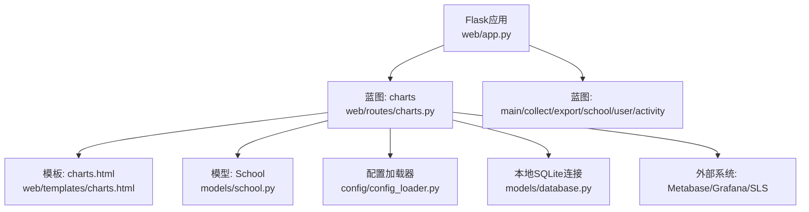
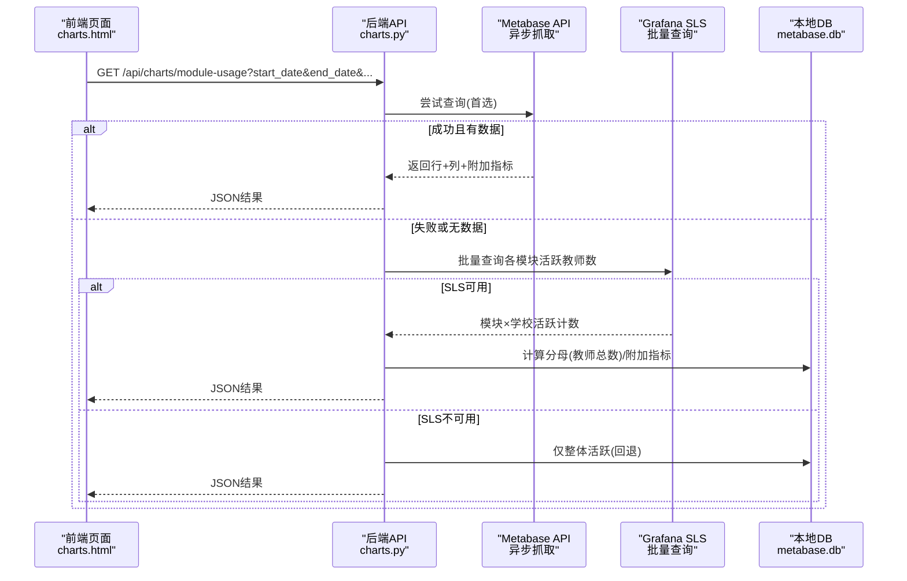
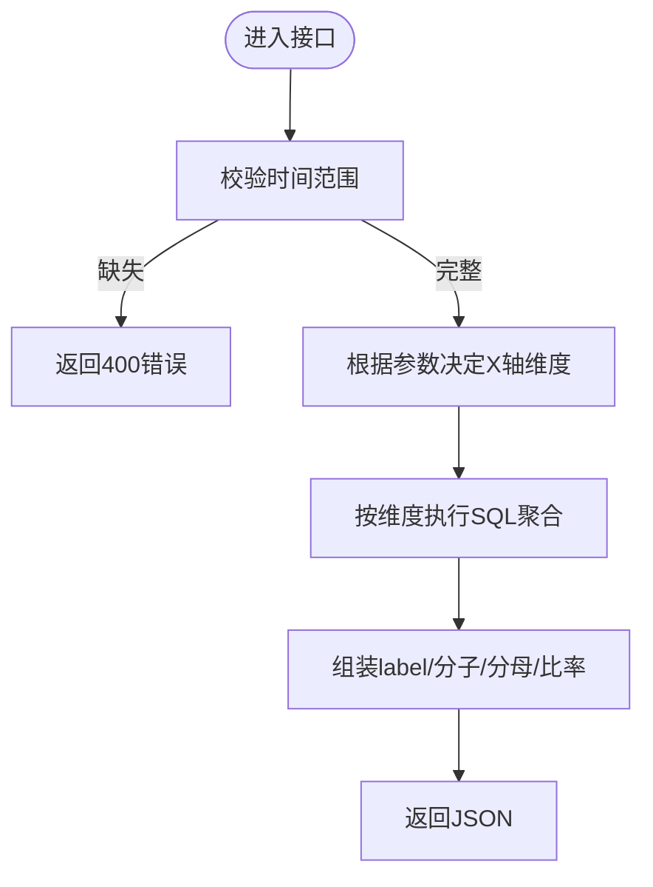
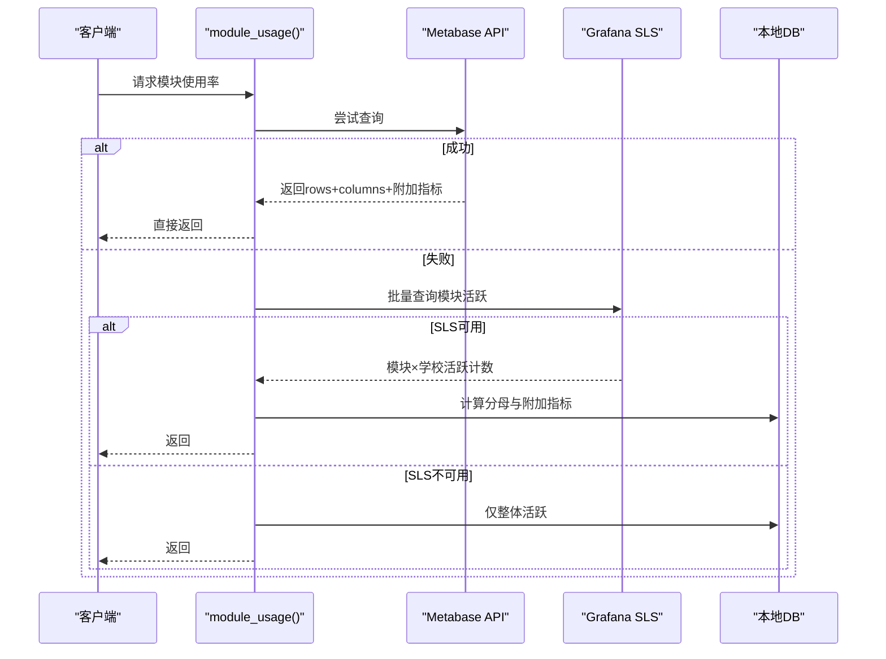
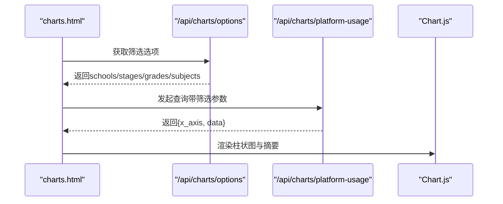
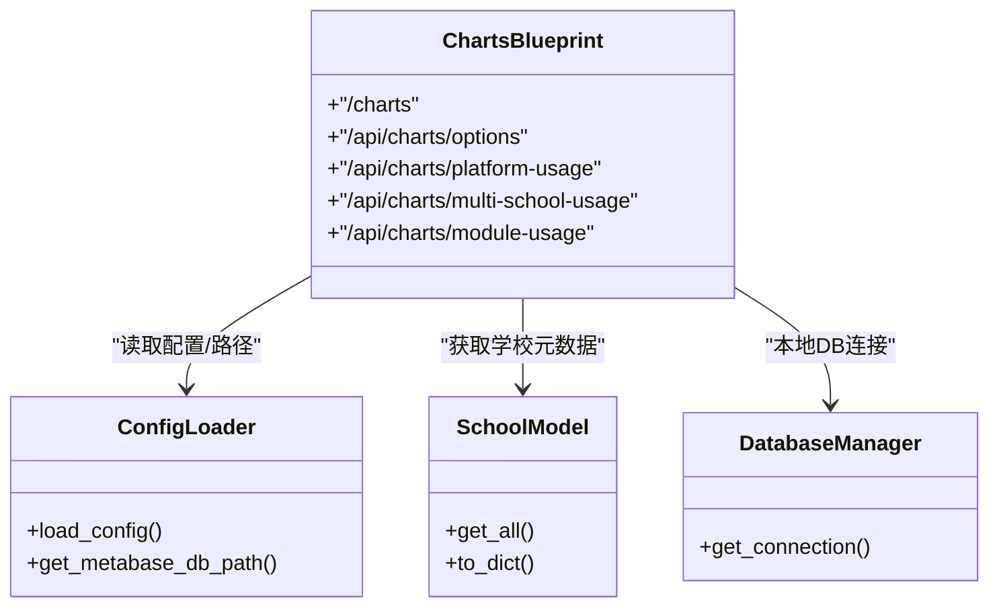

# 图表分析API

<cite>
**本文引用的文件**   
- [web/app.py](file://web/app.py)
- [web/routes/charts.py](file://web/routes/charts.py)
- [web/templates/charts.html](file://web/templates/charts.html)
- [web/static/js/app.js](file://web/static/js/app.js)
- [models/database.py](file://models/database.py)
- [models/school.py](file://models/school.py)
- [config/config_loader.py](file://config/config_loader.py)
</cite>

## 目录
1. [简介](#简介)
2. [项目结构](#项目结构)
3. [核心组件](#核心组件)
4. [架构总览](#架构总览)
5. [详细组件分析](#详细组件分析)
6. [依赖关系分析](#依赖关系分析)
7. [性能考虑](#性能考虑)
8. [故障排查指南](#故障排查指南)
9. [结论](#结论)
10. [附录](#附录)

## 简介
本文件为“图表分析”模块的完整API文档，覆盖以下能力：
- 多维度使用率查询（按学校、学段、年级、学科）
- 多校对比与模块级使用率（支持8个业务模块）
- 数据源优先级与回退策略（Metabase API → Grafana SLS → 本地数据库）
- 前端渲染集成（Chart.js 柱状图）、筛选器联动、X轴维度自适应
- 附加指标填充（作业次数、人均作业次数、日/周/月活比例）
- 认证与鉴权（登录态校验）
- 配置加载与外部系统对接（Grafana/SLS、Metabase DB路径）

说明：
- 当前实现以“平台使用率”和“多校模块使用率”为主，未提供独立的折线图、饼图、热力图等专用接口；但返回的数据结构可被前端灵活用于多种可视化。
- 实时推送（WebSocket）未在代码中实现，本节给出概念性建议与扩展方案。

## 项目结构
图表相关的路由与页面组织如下：
- Flask应用工厂注册蓝图并启用认证中间件
- charts蓝图提供图表页面与REST接口
- 模板charts.html负责前端交互与Chart.js渲染
- 模型层school.py与database.py提供本地元数据与连接管理
- 配置加载器config_loader.py提供外部系统凭证与路径解析

图示来源
- [web/app.py:306-336](file://web/app.py#L306-L336)
- [web/routes/charts.py:17-18](file://web/routes/charts.py#L17-L18)
- [web/templates/charts.html:1-10](file://web/templates/charts.html#L1-L10)
- [models/school.py:1-20](file://models/school.py#L1-L20)
- [config/config_loader.py:1-20](file://config/config_loader.py#L1-L20)
- [models/database.py:24-48](file://models/database.py#L24-L48)

章节来源
- [web/app.py:306-336](file://web/app.py#L306-L336)
- [web/routes/charts.py:17-18](file://web/routes/charts.py#L17-L18)

## 核心组件
- 图表蓝图与路由
  - /charts：图表页面入口
  - /api/charts/options：获取筛选选项（学校、学段、年级、学科）
  - /api/charts/platform-usage：平台使用率（按学校/学段/年级/学科）
  - /comparison：多校对比页面
  - /api/charts/multi-school-usage：多校使用率对比
  - /api/charts/module-usage：多校8模块使用率（含附加指标）
- 数据源与回退
  - 首选：Metabase API（通过异步抓取卡片数据）
  - 回退1：Grafana SLS批量查询（按模块聚合活跃教师数）
  - 回退2：本地metabase.db整体统计
- 前端渲染
  - Chart.js 柱状图，动态X轴维度（学校/学段/年级/学科）
  - 筛选器联动（学校→学段→年级→学科）
  - 顶部摘要（平均/最高/最低/Top5）

章节来源
- [web/routes/charts.py:63-120](file://web/routes/charts.py#L63-L120)
- [web/routes/charts.py:323-348](file://web/routes/charts.py#L323-L348)
- [web/routes/charts.py:451-563](file://web/routes/charts.py#L451-L563)
- [web/routes/charts.py:1125-1293](file://web/routes/charts.py#L1125-L1293)
- [web/templates/charts.html:150-395](file://web/templates/charts.html#L150-L395)

## 架构总览
下图展示一次“多校模块使用率”请求的端到端流程，包括数据源选择与回退逻辑。

图示来源
- [web/routes/charts.py:1125-1293](file://web/routes/charts.py#L1125-L1293)
- [web/routes/charts.py:593-727](file://web/routes/charts.py#L593-L727)
- [web/routes/charts.py:1056-1123](file://web/routes/charts.py#L1056-L1123)
- [web/routes/charts.py:729-1014](file://web/routes/charts.py#L729-L1014)

## 详细组件分析

### 通用筛选选项接口
- 路径与方法
  - GET /api/charts/options
- 功能
  - 返回所有筛选器的可选项：学校列表（按类型分组）、学段、年级、学科
- 响应字段
  - schools: 学校数组（name, display_name, type, id）
  - schools_by_type: 按类型分组的学校
  - stages: 学段集合
  - grades: 年级集合
  - subjects: 学科集合
- 错误处理
  - 异常时返回HTTP 500与错误信息

章节来源
- [web/routes/charts.py:70-120](file://web/routes/charts.py#L70-L120)

### 平台使用率接口（柱状图）
- 路径与方法
  - GET /api/charts/platform-usage
- 请求参数
  - start_date: 开始日期（必填，YYYY-MM-DD）
  - end_date: 结束日期（必填，YYYY-MM-DD）
  - school_id: 学校ID（可选）
  - stage: 学段（可选）
  - grade: 年级（可选）
  - subject: 学科（可选）
- X轴维度决定规则
  - 若指定grade → 按“学科”
  - 否则若指定stage → 按“年级”
  - 否则若指定school_id → 按“学段”
  - 否则 → 按“学校”
- 响应字段
  - x_axis: 当前X轴维度（school/grade/subject/stage）
  - data: 数组，每项包含 label、numerator、denominator、rate
- 错误处理
  - 缺少时间范围 → HTTP 400
  - 其他异常 → HTTP 500

图示来源
- [web/routes/charts.py:124-132](file://web/routes/charts.py#L124-L132)
- [web/routes/charts.py:323-348](file://web/routes/charts.py#L323-L348)
- [web/routes/charts.py:138-321](file://web/routes/charts.py#L138-L321)

章节来源
- [web/routes/charts.py:124-132](file://web/routes/charts.py#L124-L132)
- [web/routes/charts.py:323-348](file://web/routes/charts.py#L323-L348)
- [web/routes/charts.py:138-321](file://web/routes/charts.py#L138-L321)

### 多校使用率对比接口
- 路径与方法
  - GET /api/charts/multi-school-usage
- 请求参数
  - start_date, end_date（必填）
  - stage, grade, subject（可选）
  - school_id（可选，单校过滤）
- 响应字段
  - rows: 每所学校一条记录，包含 school、school_id、total_teachers、active_teachers、usage_rate、rate_value
  - total_schools: 学校数量
- 错误处理
  - 缺少时间范围 → HTTP 400
  - 其他异常 → HTTP 500

章节来源
- [web/routes/charts.py:451-563](file://web/routes/charts.py#L451-L563)

### 多校8模块使用率接口（含附加指标）
- 路径与方法
  - GET /api/charts/module-usage
- 请求参数
  - start_date, end_date（必填，YYYY-MM-DD）
  - stage, grade, subject（可选）
  - school_id（可选）
  - types（可选，逗号分隔的类型名称，同时匹配type与display_name）
- 数据源优先级
  - 首选：Metabase API（异步抓取卡片数据，返回13列：总体、内部员工、个备、集备、组卷、手阅、学情分析、错题本 + 作业次数、人均作业次数、日活/周活/月活比例）
  - 回退1：Grafana SLS批量查询（按模块聚合活跃教师数）
  - 回退2：本地metabase.db整体活跃（仅overall有值，其余模块显示“-”）
- 响应字段
  - columns: 列名数组（13列）
  - rows: 每所学校一行，包含 school、display_name、type、school_id、total_teachers、values（字符串百分比或“-”）、rate_values（数值）
  - total_schools: 学校数量
  - source: 数据来源标识（metabase-api / sls / metabase）
- 附加指标填充
  - 作业次数优先从外部API获取，失败则回退至本地monthly_records
  - 人均作业次数=作业次数/总教师数
  - 日/周/月活比例可从D21卡片计算或从本地DB估算

图示来源
- [web/routes/charts.py:1125-1293](file://web/routes/charts.py#L1125-L1293)
- [web/routes/charts.py:593-727](file://web/routes/charts.py#L593-L727)
- [web/routes/charts.py:1056-1123](file://web/routes/charts.py#L1056-L1123)
- [web/routes/charts.py:729-1014](file://web/routes/charts.py#L729-L1014)

章节来源
- [web/routes/charts.py:1125-1293](file://web/routes/charts.py#L1125-L1293)
- [web/routes/charts.py:593-727](file://web/routes/charts.py#L593-L727)
- [web/routes/charts.py:1056-1123](file://web/routes/charts.py#L1056-L1123)
- [web/routes/charts.py:729-1014](file://web/routes/charts.py#L729-L1014)

### 前端集成与渲染（Chart.js）
- 页面入口
  - GET /charts 渲染 charts.html
- 初始化流程
  - 加载筛选选项（/api/charts/options）
  - 默认设置当月起止日期
  - 监听学校/学段变化，联动年级/学科下拉框
- 查询流程
  - 点击查询按钮 → 调用 /api/charts/platform-usage
  - 根据返回的x_axis与data更新图表与摘要
- 图表样式与交互
  - 柱状图，颜色循环分配，标签仅在Top5/Bottom5显示
  - Tooltip显示使用率、使用人数、总人数
  - 摘要区域显示平均/最高/最低/Top5

图示来源
- [web/templates/charts.html:150-395](file://web/templates/charts.html#L150-L395)
- [web/routes/charts.py:70-120](file://web/routes/charts.py#L70-L120)
- [web/routes/charts.py:323-348](file://web/routes/charts.py#L323-L348)

章节来源
- [web/templates/charts.html:150-395](file://web/templates/charts.html#L150-L395)

### 认证与鉴权
- 全局认证中间件
  - 非公开路由需登录态，未登录将重定向到登录页或返回401
- 登录/登出
  - GET /login：渲染登录表单
  - POST /login：提交用户名，成功后写入session并重定向
  - GET /logout：清除session

章节来源
- [web/app.py:253-304](file://web/app.py#L253-L304)

## 依赖关系分析
- 蓝图注册
  - app.py注册charts蓝图，挂载在根路径下
- 数据访问
  - charts.py通过config_loader.get_metabase_db_path()定位metabase.db
  - models.database提供本地app.db连接上下文管理器
  - models.school提供学校元数据（名称、类型、显示名等）
- 外部系统
  - Grafana SLS凭据支持环境变量与配置文件两种方式
  - Metabase API通过异步抓取卡片数据（复用现有爬虫工具）

图示来源
- [web/app.py:306-336](file://web/app.py#L306-L336)
- [web/routes/charts.py:17-18](file://web/routes/charts.py#L17-L18)
- [config/config_loader.py:122-147](file://config/config_loader.py#L122-L147)
- [models/school.py:82-165](file://models/school.py#L82-L165)
- [models/database.py:24-48](file://models/database.py#L24-L48)

章节来源
- [web/app.py:306-336](file://web/app.py#L306-L336)
- [config/config_loader.py:122-147](file://config/config_loader.py#L122-L147)
- [models/school.py:82-165](file://models/school.py#L82-L165)
- [models/database.py:24-48](file://models/database.py#L24-L48)

## 性能考虑
- 数据源优先级
  - 优先使用Metabase API减少本地DB压力；失败再回退到SLS或本地DB
- 批量查询
  - SLS批量查询合并多个模块的请求，降低网络往返
- 附加指标填充
  - 作业次数优先走外部API，失败回退本地月度记录，避免重复IO
- 前端优化
  - 大列表仅显示Top5/Bottom5标签，减少渲染开销
  - 图表销毁重建避免内存泄漏

[本节为通用指导，不直接分析具体文件]

## 故障排查指南
- 常见错误
  - 时间范围缺失：返回400错误，检查start_date与end_date格式
  - 日期格式错误：返回400错误，确保YYYY-MM-DD
  - 外部系统不可用：自动回退，查看日志中的警告信息
- 认证问题
  - 未登录访问API：返回401或未授权重定向
- 配置问题
  - Grafana凭据缺失：SLS批量查询跳过，回退到本地DB
  - Metabase DB路径不存在：抛出FileNotFoundError

章节来源
- [web/routes/charts.py:1143-1151](file://web/routes/charts.py#L1143-L1151)
- [web/app.py:253-304](file://web/app.py#L253-L304)
- [config/config_loader.py:122-147](file://config/config_loader.py#L122-L147)

## 结论
该图表分析模块提供了完善的多维度使用率查询与多校对比能力，具备健壮的数据源回退机制与友好的前端渲染体验。建议在后续迭代中：
- 增加折线图、饼图、热力图等专用接口（如需要）
- 引入WebSocket实现实时增量更新
- 增加缓存层（Redis）提升高频查询性能
- 完善主题切换与国际化支持

[本节为总结性内容，不直接分析具体文件]

## 附录

### API定义速查表
- GET /api/charts/options
  - 返回筛选选项（学校、学段、年级、学科）
- GET /api/charts/platform-usage
  - 请求参数：start_date, end_date, school_id, stage, grade, subject
  - 响应：{x_axis, data[]}
- GET /api/charts/multi-school-usage
  - 请求参数：start_date, end_date, stage, grade, subject, school_id
  - 响应：{rows[], total_schools}
- GET /api/charts/module-usage
  - 请求参数：start_date, end_date, stage, grade, subject, school_id, types
  - 响应：{columns[], rows[], total_schools, source}

章节来源
- [web/routes/charts.py:70-120](file://web/routes/charts.py#L70-L120)
- [web/routes/charts.py:323-348](file://web/routes/charts.py#L323-L348)
- [web/routes/charts.py:451-563](file://web/routes/charts.py#L451-L563)
- [web/routes/charts.py:1125-1293](file://web/routes/charts.py#L1125-L1293)

### 前端组件集成要点
- 依赖库
  - Chart.js 4.x 与 datalabels 插件
- 数据绑定
  - labels ← data[].label
  - rates ← data[].rate
  - tooltip ← numerator/denominator
- 交互事件
  - 学校/学段/年级/学科变更触发重新查询
  - 查询按钮禁用状态与加载动画

章节来源
- [web/templates/charts.html:150-395](file://web/templates/charts.html#L150-L395)

### 实时推送（概念性建议）
- WebSocket连接
  - 建立长连接，订阅“图表数据更新”事件
- 增量更新
  - 服务端推送差异数据（新增/修改/删除），前端局部刷新
- 断线重连
  - 指数退避重试，保持会话状态

[本节为概念性内容，不直接分析具体文件]