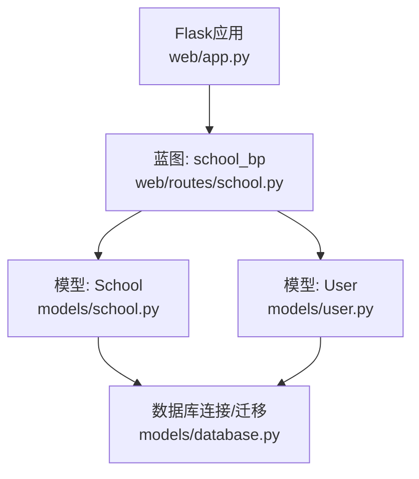
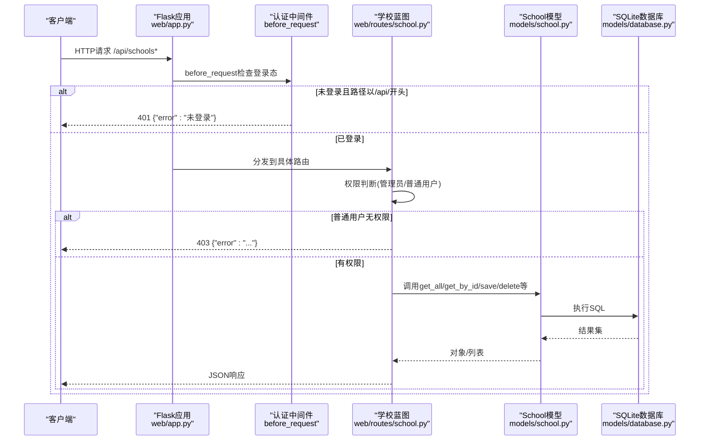
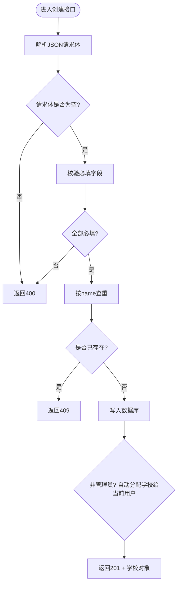
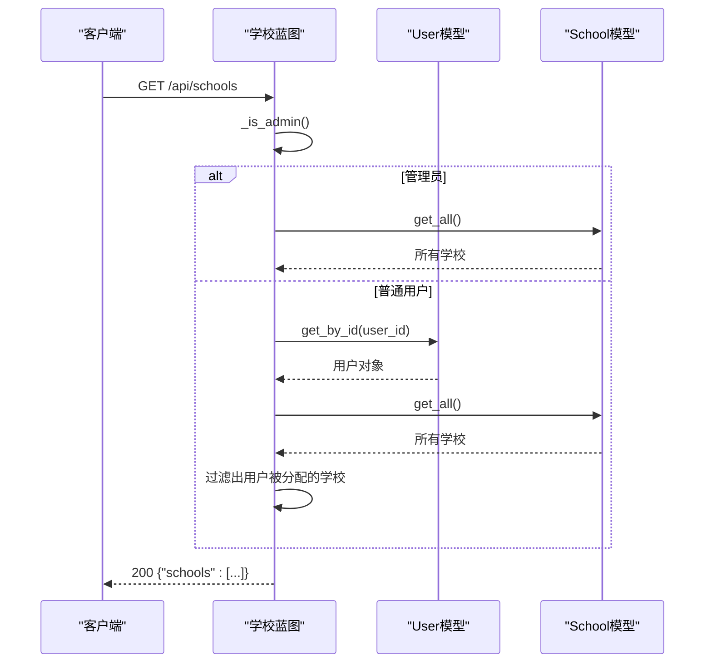
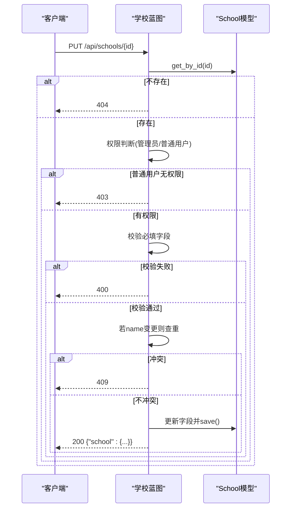
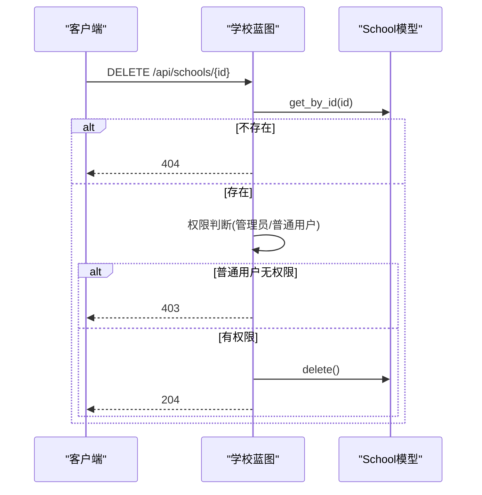
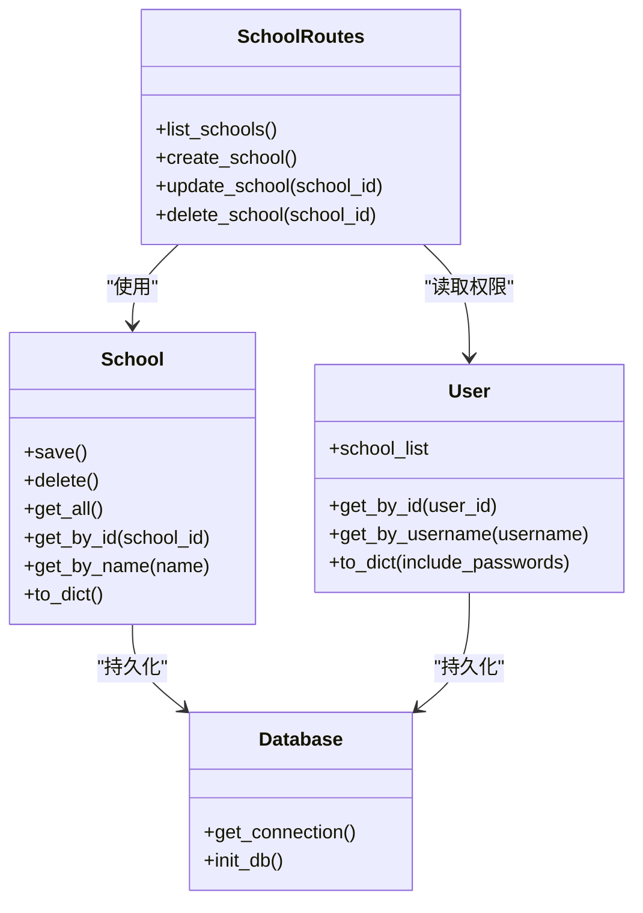

# 学校管理API

<cite>
**本文引用的文件**
- [web/app.py](file://middle-platform-data-collector-master/middle-platform-data-collector-master/web/app.py)
- [web/routes/school.py](file://middle-platform-data-collector-master/middle-platform-data-collector-master/web/routes/school.py)
- [models/school.py](file://middle-platform-data-collector-master/middle-platform-data-collector-master/models/school.py)
- [models/user.py](file://middle-platform-data-collector-master/middle-platform-data-collector-master/models/user.py)
- [models/database.py](file://middle-platform-data-collector-master/middle-platform-data-collector-master/models/database.py)
</cite>

## 目录
1. [简介](#简介)
2. [项目结构](#项目结构)
3. [核心组件](#核心组件)
4. [架构总览](#架构总览)
5. [详细接口说明](#详细接口说明)
6. [依赖关系分析](#依赖关系分析)
7. [性能与扩展建议](#性能与扩展建议)
8. [故障排查指南](#故障排查指南)
9. [结论](#结论)
10. [附录：字段定义与校验规则](#附录字段定义与校验规则)

## 简介
本文件为“学校管理”模块的API文档，覆盖以下RESTful端点：
- POST /api/schools：创建新学校
- GET /api/schools：获取学校列表（受权限控制）
- GET /api/schools/{id}：获取学校详情（当前代码未实现该路由）
- PUT /api/schools/{id}：更新学校信息
- DELETE /api/schools/{id}：删除学校

同时说明：
- 学校实体字段定义、数据验证规则与业务约束
- 批量操作能力现状与建议
- 权限控制机制（管理员与普通用户）
- 请求/响应示例、错误处理规范
- 数据库操作日志与最佳实践

## 项目结构
学校管理相关代码主要分布在以下位置：
- Web应用入口与蓝图注册：web/app.py
- 学校CRUD路由：web/routes/school.py
- 学校数据模型与持久化：models/school.py
- 用户模型与认证上下文：models/user.py
- 数据库初始化与迁移：models/database.py

图表来源
- [web/app.py:306-336](file://middle-platform-data-collector-master/middle-platform-data-collector-master/web/app.py#L306-L336)
- [web/routes/school.py:1-155](file://middle-platform-data-collector-master/middle-platform-data-collector-master/web/routes/school.py#L1-L155)
- [models/school.py:1-165](file://middle-platform-data-collector-master/middle-platform-data-collector-master/models/school.py#L1-L165)
- [models/user.py:1-113](file://middle-platform-data-collector-master/middle-platform-data-collector-master/models/user.py#L1-L113)
- [models/database.py:201-372](file://middle-platform-data-collector-master/middle-platform-data-collector-master/models/database.py#L201-L372)

章节来源
- [web/app.py:306-336](file://middle-platform-data-collector-master/middle-platform-data-collector-master/web/app.py#L306-L336)

## 核心组件
- 路由层：提供RESTful端点，负责参数校验、权限判断、调用模型并返回JSON。
- 模型层：封装SQLite读写逻辑，提供按ID/名称查询、保存、删除等方法。
- 认证与授权：基于会话的用户登录态与管理员标记；普通用户仅能访问被分配的学校资源。
- 数据库层：统一连接管理、表结构初始化与增量迁移。

章节来源
- [web/routes/school.py:1-155](file://middle-platform-data-collector-master/middle-platform-data-collector-master/web/routes/school.py#L1-L155)
- [models/school.py:1-165](file://middle-platform-data-collector-master/middle-platform-data-collector-master/models/school.py#L1-L165)
- [models/user.py:1-113](file://middle-platform-data-collector-master/middle-platform-data-collector-master/models/user.py#L1-L113)
- [models/database.py:201-372](file://middle-platform-data-collector-master/middle-platform-data-collector-master/models/database.py#L201-L372)

## 架构总览
下图展示了从HTTP请求到数据库操作的完整链路，以及权限检查的关键分支。

图表来源
- [web/app.py:253-293](file://middle-platform-data-collector-master/middle-platform-data-collector-master/web/app.py#L253-L293)
- [web/routes/school.py:40-155](file://middle-platform-data-collector-master/middle-platform-data-collector-master/web/routes/school.py#L40-L155)
- [models/school.py:28-165](file://middle-platform-data-collector-master/middle-platform-data-collector-master/models/school.py#L28-L165)
- [models/database.py:24-48](file://middle-platform-data-collector-master/middle-platform-data-collector-master/models/database.py#L24-L48)

## 详细接口说明

### 通用约定
- 基础路径：/api/schools
- 内容类型：application/json
- 认证方式：基于会话的登录态（通过浏览器或携带Cookie的请求）
- 成功响应：JSON对象，包含数据字段
- 失败响应：JSON对象，包含error字段及HTTP状态码

### 1) 创建学校
- 方法：POST
- 路径：/api/schools
- 权限：管理员可创建任意学校；普通用户创建后自动获得该学校的编辑权限
- 请求体字段（部分可选）：
  - name（必填）
  - grafana_name（必填）
  - main_site_name（必填）
  - lida_name（可选，默认同name）
  - metabase_school_id（可选）
  - xueduan/nianji/jibu/xuebu（可选）
  - sort_order（可选，仅在更新时生效）
- 校验规则：
  - 必填字段为空将返回400
  - name唯一性校验，重复将返回409
- 响应：
  - 201 Created：{"school": {...}}
  - 400 Bad Request：{"error": "..."}
  - 409 Conflict：{"error": "学校 'xxx' 已存在"}

图表来源
- [web/routes/school.py:53-96](file://middle-platform-data-collector-master/middle-platform-data-collector-master/web/routes/school.py#L53-L96)
- [models/school.py:28-76](file://middle-platform-data-collector-master/middle-platform-data-collector-master/models/school.py#L28-L76)

章节来源
- [web/routes/school.py:53-96](file://middle-platform-data-collector-master/middle-platform-data-collector-master/web/routes/school.py#L53-L96)
- [models/school.py:28-76](file://middle-platform-data-collector-master/middle-platform-data-collector-master/models/school.py#L28-L76)

### 2) 获取学校列表
- 方法：GET
- 路径：/api/schools
- 权限：
  - 管理员：返回所有学校
  - 普通用户：仅返回其被分配的学校集合
- 响应：
  - 200 OK：{"schools": [...]}

图表来源
- [web/routes/school.py:40-50](file://middle-platform-data-collector-master/middle-platform-data-collector-master/web/routes/school.py#L40-L50)
- [models/user.py:25-31](file://middle-platform-data-collector-master/middle-platform-data-collector-master/models/user.py#L25-L31)
- [models/school.py:82-89](file://middle-platform-data-collector-master/middle-platform-data-collector-master/models/school.py#L82-L89)

章节来源
- [web/routes/school.py:47-50](file://middle-platform-data-collector-master/middle-platform-data-collector-master/web/routes/school.py#L47-L50)

### 3) 获取学校详情
- 方法：GET
- 路径：/api/schools/{id}
- 状态：当前代码未实现该路由
- 建议：参考现有路由模式实现，复用权限判断与序列化逻辑

章节来源
- [web/routes/school.py:1-155](file://middle-platform-data-collector-master/middle-platform-data-collector-master/web/routes/school.py#L1-L155)

### 4) 更新学校信息
- 方法：PUT
- 路径：/api/schools/{id}
- 权限：
  - 管理员：可更新任意学校
  - 普通用户：仅能更新自己被分配的学校
- 请求体字段：
  - name/grafana_name/main_site_name（必填）
  - lida_name/metabase_school_id/xueduan/nianji/jibu/xuebu（可选）
  - sort_order（可选）
- 校验规则：
  - 必填字段为空将返回400
  - 若修改name，需进行唯一性校验，重复将返回409
- 响应：
  - 200 OK：{"school": {...}}
  - 400 Bad Request：{"error": "..."}
  - 403 Forbidden：{"error": "只能编辑分配给您的学校"}
  - 404 Not Found：{"error": "学校不存在"}
  - 409 Conflict：{"error": "学校 'xxx' 已存在"}

图表来源
- [web/routes/school.py:99-139](file://middle-platform-data-collector-master/middle-platform-data-collector-master/web/routes/school.py#L99-L139)
- [models/school.py:28-76](file://middle-platform-data-collector-master/middle-platform-data-collector-master/models/school.py#L28-L76)

章节来源
- [web/routes/school.py:99-139](file://middle-platform-data-collector-master/middle-platform-data-collector-master/web/routes/school.py#L99-L139)

### 5) 删除学校
- 方法：DELETE
- 路径：/api/schools/{id}
- 权限：
  - 管理员：可删除任意学校
  - 普通用户：仅能删除自己被分配的学校
- 响应：
  - 204 No Content：删除成功
  - 403 Forbidden：{"error": "只能删除分配给您的学校"}
  - 404 Not Found：{"error": "学校不存在"}

图表来源
- [web/routes/school.py:142-154](file://middle-platform-data-collector-master/middle-platform-data-collector-master/web/routes/school.py#L142-L154)
- [models/school.py:77-81](file://middle-platform-data-collector-master/middle-platform-data-collector-master/models/school.py#L77-L81)

章节来源
- [web/routes/school.py:142-154](file://middle-platform-data-collector-master/middle-platform-data-collector-master/web/routes/school.py#L142-L154)

### 6) 批量操作接口
- 现状：当前代码未提供批量创建/批量更新的专用端点
- 建议方案：
  - 新增POST /api/schools/batch-create：接收数组，逐项校验并插入，支持事务回滚
  - 新增PATCH /api/schools/batch-update：接收{ id: { fields } }映射，逐项校验并更新
  - 幂等性与去重策略：基于name的唯一键，避免重复插入
  - 权限控制：管理员可批量操作所有学校；普通用户仅能操作其被分配的学校
  - 错误聚合：返回每个条目的处理结果与错误信息，便于前端提示

[本节为概念性建议，不涉及具体源码]

## 依赖关系分析
- 路由依赖模型：
  - web/routes/school.py 依赖 models/school.py 与 models/user.py
- 模型依赖数据库：
  - models/school.py 与 models/user.py 均通过 models/database.py 提供的连接上下文执行SQL
- 应用装配：
  - web/app.py 注册蓝图并设置认证中间件

图表来源
- [models/school.py:28-165](file://middle-platform-data-collector-master/middle-platform-data-collector-master/models/school.py#L28-L165)
- [models/user.py:25-113](file://middle-platform-data-collector-master/middle-platform-data-collector-master/models/user.py#L25-L113)
- [models/database.py:24-48](file://middle-platform-data-collector-master/middle-platform-data-collector-master/models/database.py#L24-L48)
- [web/routes/school.py:47-154](file://middle-platform-data-collector-master/middle-platform-data-collector-master/web/routes/school.py#L47-L154)

章节来源
- [web/app.py:306-336](file://middle-platform-data-collector-master/middle-platform-data-collector-master/web/app.py#L306-L336)
- [web/routes/school.py:47-154](file://middle-platform-data-collector-master/middle-platform-data-collector-master/web/routes/school.py#L47-L154)
- [models/school.py:28-165](file://middle-platform-data-collector-master/middle-platform-data-collector-master/models/school.py#L28-L165)
- [models/user.py:25-113](file://middle-platform-data-collector-master/middle-platform-data-collector-master/models/user.py#L25-L113)
- [models/database.py:24-48](file://middle-platform-data-collector-master/middle-platform-data-collector-master/models/database.py#L24-L48)

## 性能与扩展建议
- 连接池与并发：当前使用SQLite WAL模式，适合轻量并发场景；高并发应迁移至PostgreSQL/MySQL
- 索引优化：对频繁查询字段（如name、owner_id）建立索引
- 分页与过滤：列表接口增加分页参数与按类型/学段筛选
- 缓存策略：对只读列表进行短期缓存，降低数据库压力
- 批量接口：引入事务与批量写入，减少往返开销

[本节为通用建议，不涉及具体源码]

## 故障排查指南
- 未登录访问API：
  - 现象：返回401 {"error":"未登录"}
  - 原因：会话中缺少user_id
  - 处理：先调用登录接口，确保Cookie有效
- 权限不足：
  - 现象：返回403 {"error":"只能编辑/删除分配给您的学校"}
  - 原因：普通用户尝试操作未被分配的学校
  - 处理：在用户管理中为其分配相应学校
- 数据冲突：
  - 现象：返回409 {"error":"学校 'xxx' 已存在"}
  - 原因：name唯一性冲突
  - 处理：更换唯一名称或更新已有记录
- 资源不存在：
  - 现象：返回404 {"error":"学校不存在"}
  - 原因：目标ID不存在
  - 处理：确认ID正确性或重新创建
- 数据库异常：
  - 现象：服务启动时报错或数据不一致
  - 原因：表结构缺失或迁移失败
  - 处理：检查models/database.py中的初始化与迁移逻辑，确保首次启动导入config.yaml中的学校配置

章节来源
- [web/app.py:253-293](file://middle-platform-data-collector-master/middle-platform-data-collector-master/web/app.py#L253-L293)
- [web/routes/school.py:53-154](file://middle-platform-data-collector-master/middle-platform-data-collector-master/web/routes/school.py#L53-L154)
- [models/database.py:143-198](file://middle-platform-data-collector-master/middle-platform-data-collector-master/models/database.py#L143-L198)

## 结论
学校管理API提供了基础的CRUD能力与基于会话的权限控制，满足多角色协作场景。当前未实现“获取学校详情”与“批量操作”接口，建议优先补齐以提升易用性与运维效率。结合数据库迁移与默认管理员初始化，系统具备良好的可扩展性与可维护性。

[本节为总结性内容，不涉及具体源码]

## 附录：字段定义与校验规则

### 学校实体字段定义
- name：字符串，必填，唯一标识
- lida_name：字符串，必填，用于第三方平台关联
- grafana_name：字符串，必填，用于Grafana关联
- main_site_name：字符串，必填，用于主站关联
- metabase_school_id：字符串，可选，Metabase数字ID
- display_name：字符串，可选，前端展示简称（由模型默认回填）
- type：字符串，可选，“直营校”或“托管校”
- xueduan/nianji/jibu/xuebu：字符串，可选，组织维度标签
- sort_order：整数，可选，排序权重
- owner_id：整数，可选，创建者用户ID（由模型与迁移保证）
- created_at/updated_at：时间戳，由模型自动生成

章节来源
- [models/school.py:9-27](file://middle-platform-data-collector-master/middle-platform-data-collector-master/models/school.py#L9-L27)
- [models/school.py:140-154](file://middle-platform-data-collector-master/middle-platform-data-collector-master/models/school.py#L140-L154)
- [models/database.py:240-253](file://middle-platform-data-collector-master/middle-platform-data-collector-master/models/database.py#L240-L253)

### 数据验证规则与业务约束
- 必填校验：name、grafana_name、main_site_name
- 唯一性约束：name全局唯一
- 权限约束：
  - 管理员：全量读写
  - 普通用户：仅能访问/编辑/删除其被分配的学校
- 自动分配：普通用户创建学校后，自动加入其assigned_schools列表

章节来源
- [web/routes/school.py:53-96](file://middle-platform-data-collector-master/middle-platform-data-collector-master/web/routes/school.py#L53-L96)
- [models/user.py:25-31](file://middle-platform-data-collector-master/middle-platform-data-collector-master/models/user.py#L25-L31)

### 请求/响应示例（文本描述）
- 创建学校
  - 请求：POST /api/schools，Content-Type: application/json
  - 请求体：包含name、grafana_name、main_site_name等字段
  - 成功响应：201，{"school": {...}}
  - 失败响应：400/409，{"error": "..."}
- 获取列表
  - 请求：GET /api/schools
  - 成功响应：200，{"schools": [...]}
- 更新学校
  - 请求：PUT /api/schools/{id}
  - 成功响应：200，{"school": {...}}
  - 失败响应：400/403/404/409，{"error": "..."}
- 删除学校
  - 请求：DELETE /api/schools/{id}
  - 成功响应：204
  - 失败响应：403/404，{"error": "..."}

[本节为示例说明，不涉及具体源码]

### 数据库操作日志
- 应用日志：
  - 位置：logs/app.log
  - 级别：INFO及以上
  - 格式：时间戳、模块名、级别、消息
- 数据库迁移日志：
  - 首次启动会从config.yaml导入学校数据（若数据库为空）
  - 迁移过程会记录警告与成功信息

章节来源
- [web/app.py:14-24](file://middle-platform-data-collector-master/middle-platform-data-collector-master/web/app.py#L14-L24)
- [models/database.py:143-198](file://middle-platform-data-collector-master/middle-platform-data-collector-master/models/database.py#L143-L198)

### 学校配置项最佳实践
- 命名规范：
  - name保持简洁唯一，避免特殊字符
  - grafana_name/main_site_name/lida_name与第三方平台保持一致
- 分类与排序：
  - 使用type区分直营/托管，便于统计与展示
  - 合理设置sort_order，提升列表可读性
- 权限管理：
  - 为普通用户精确分配assigned_schools，遵循最小权限原则
- 数据一致性：
  - 更新name前进行唯一性校验，避免冲突
  - 批量操作建议使用事务，确保原子性

[本节为通用建议，不涉及具体源码]