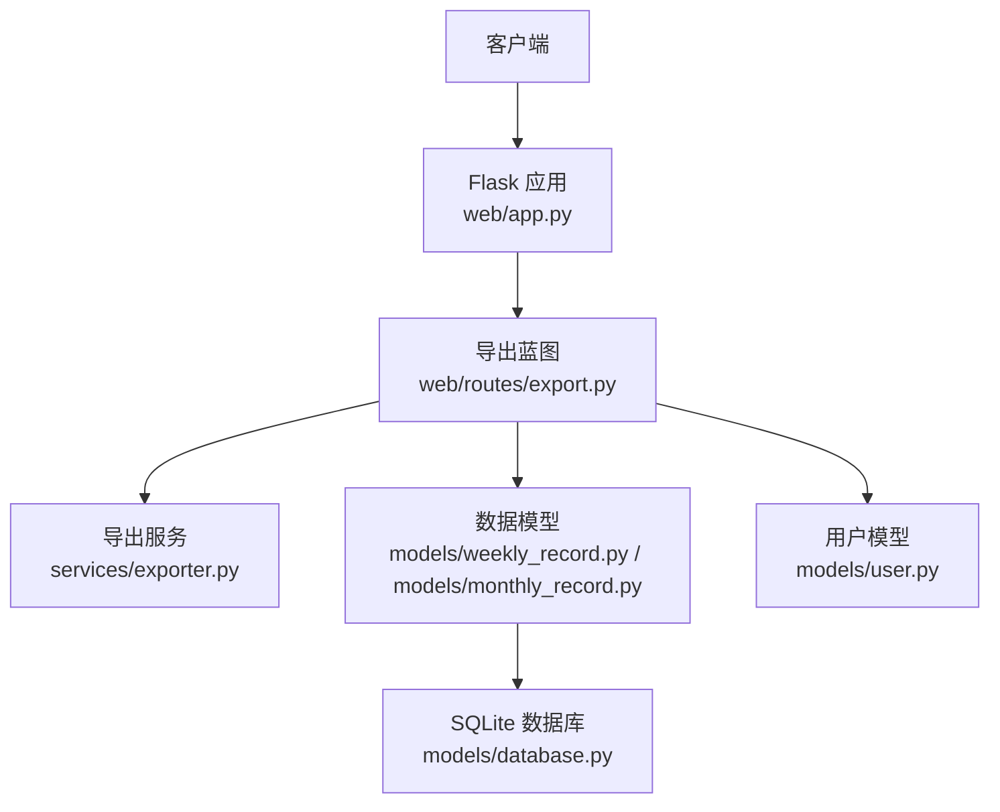
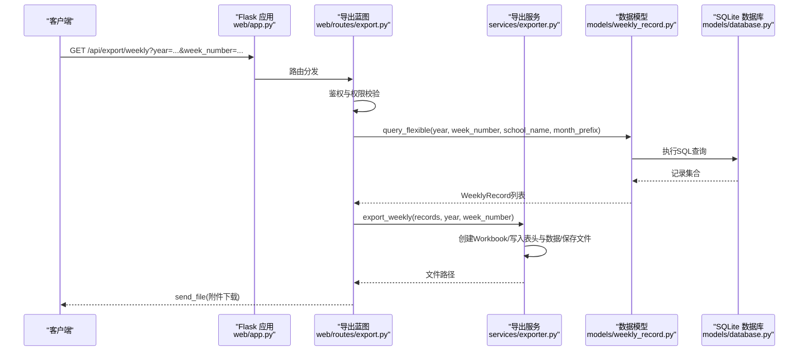
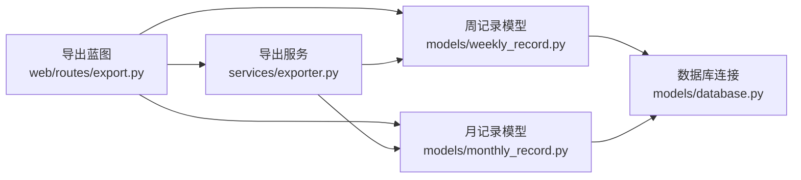

# 数据导出API

<cite>
**本文引用的文件**   
- [web/routes/export.py](file://middle-platform-data-collector-master/web/routes/export.py)
- [services/exporter.py](file://middle-platform-data-collector-master/services/exporter.py)
- [web/app.py](file://middle-platform-data-collector-master/web/app.py)
- [models/weekly_record.py](file://middle-platform-data-collector-master/models/weekly_record.py)
- [models/monthly_record.py](file://middle-platform-data-collector-master/models/monthly_record.py)
- [models/user.py](file://middle-platform-data-collector-master/models/user.py)
- [models/database.py](file://middle-platform-data-collector-master/models/database.py)
</cite>

## 目录
1. [简介](#简介)
2. [项目结构](#项目结构)
3. [核心组件](#核心组件)
4. [架构总览](#架构总览)
5. [详细组件分析](#详细组件分析)
6. [依赖关系分析](#依赖关系分析)
7. [性能与并发](#性能与并发)
8. [故障排查指南](#故障排查指南)
9. [结论](#结论)
10. [附录：接口规范与示例](#附录接口规范与示例)

## 简介
本文件为“数据导出”相关HTTP接口的完整技术文档，覆盖周度与月度数据的Excel导出、预览与辅助查询能力。文档包含：
- HTTP端点定义、请求参数、权限控制与错误码
- Excel文件结构与字段说明（含双行合并表头）
- 下载URL模式与响应头设置
- 异步处理现状与扩展建议（当前实现为同步导出）
- 高级功能建议（模板定制、自定义字段、过滤等）
- 文件大小限制与并发限制的技术建议
- 完整的请求/响应示例与前端下载实现要点

## 项目结构
导出功能由以下模块协作完成：
- Web路由层：接收请求、鉴权、参数校验、调用服务并返回文件或JSON
- 导出服务层：生成Excel工作簿与工作表、写入样式与数据、落盘
- 数据模型层：提供灵活查询与字典序列化
- 应用工厂：注册蓝图、统一鉴权中间件

图表来源
- [web/app.py:306-337](file://middle-platform-data-collector-master/web/app.py#L306-L337)
- [web/routes/export.py:1-124](file://middle-platform-data-collector-master/web/routes/export.py#L1-L124)
- [services/exporter.py:1-362](file://middle-platform-data-collector-master/services/exporter.py#L1-L362)
- [models/weekly_record.py:1-163](file://middle-platform-data-collector-master/models/weekly_record.py#L1-L163)
- [models/monthly_record.py:1-200](file://middle-platform-data-collector-master/models/monthly_record.py#L1-L200)
- [models/database.py:201-372](file://middle-platform-data-collector-master/models/database.py#L201-L372)

章节来源
- [web/app.py:306-337](file://middle-platform-data-collector-master/web/app.py#L306-L337)
- [web/routes/export.py:1-124](file://middle-platform-data-collector-master/web/routes/export.py#L1-L124)

## 核心组件
- 导出蓝图与路由：提供周度导出、月度导出、数据预览、周标签枚举等接口
- 导出服务：基于openpyxl构建Excel，支持单Sheet与多Sheet（按周分组）两种模式
- 数据模型：提供灵活查询方法，支持按年份、周次/月次、学校名称筛选
- 鉴权与权限：全局登录检查；非管理员仅能访问其被分配的学校范围

章节来源
- [web/routes/export.py:1-124](file://middle-platform-data-collector-master/web/routes/export.py#L1-L124)
- [services/exporter.py:1-362](file://middle-platform-data-collector-master/services/exporter.py#L1-L362)
- [models/weekly_record.py:86-134](file://middle-platform-data-collector-master/models/weekly_record.py#L86-L134)
- [models/monthly_record.py:118-132](file://middle-platform-data-collector-master/models/monthly_record.py#L118-L132)
- [models/user.py:25-31](file://middle-platform-data-collector-master/models/user.py#L25-L31)
- [web/app.py:253-304](file://middle-platform-data-collector-master/web/app.py#L253-L304)

## 架构总览
导出流程时序（以周度导出为例）：

图表来源
- [web/app.py:306-337](file://middle-platform-data-collector-master/web/app.py#L306-L337)
- [web/routes/export.py:31-62](file://middle-platform-data-collector-master/web/routes/export.py#L31-L62)
- [services/exporter.py:64-140](file://middle-platform-data-collector-master/services/exporter.py#L64-L140)
- [models/weekly_record.py:86-103](file://middle-platform-data-collector-master/models/weekly_record.py#L86-L103)
- [models/database.py:24-48](file://middle-platform-data-collector-master/models/database.py#L24-L48)

## 详细组件分析

### 导出蓝图与路由（web/routes/export.py）
- 已登录鉴权：通过全局before_request拦截未登录的/api/*请求
- 权限控制：非管理员若指定school_name不在其assigned_schools范围内，返回403
- 主要端点：
  - GET /api/export/weekly：导出周度数据为Excel
  - GET /api/export/monthly：导出月度数据为Excel
  - GET /api/export/preview：预览周度数据（JSON）
  - GET /api/export/distinct_weeks：获取某年已有周标签列表

请求参数
- weekly
  - year: 整数，必填
  - week_number: 字符串，可选；与month_prefix二选一
  - school_name: 字符串，可选；受权限约束
  - month_prefix: 字符串，可选；用于模糊匹配周标签前缀
- monthly
  - year: 整数，必填
  - month_number: 字符串，可选
  - school_name: 字符串，可选；受权限约束
- preview
  - 同weekly参数
- distinct_weeks
  - year: 整数，必填

响应
- 成功：
  - weekly/monthly：返回Excel二进制流（附件下载）
  - preview：返回{"records": [...]}
  - distinct_weeks：返回{"weeks": [...]}
- 失败：
  - 400：缺少必要参数
  - 403：无权访问该学校数据
  - 404：没有找到对应数据

章节来源
- [web/routes/export.py:1-124](file://middle-platform-data-collector-master/web/routes/export.py#L1-L124)
- [web/app.py:253-304](file://middle-platform-data-collector-master/web/app.py#L253-L304)
- [models/user.py:25-31](file://middle-platform-data-collector-master/models/user.py#L25-L31)

### 导出服务（services/exporter.py）
- 输出目录：data/exports（自动创建）
- 文件名规则：
  - 周度：_build_export_name(year, period) + "_时间戳.xlsx"
  - 月度：_build_export_name(year, period) + "_时间戳.xlsx"
  - 周度范围（多Sheet）：weekly_{year}_{首尾周标签拼接}_{时间戳}.xlsx
- 样式：标题行合并居中、蓝色主题表头、细边框、列宽预设
- 导出函数：
  - export_weekly：单Sheet，按HEADERS顺序写入
  - export_weekly_range：多Sheet，每个周一个Sheet
  - export_monthly：双行合并表头，按MONTHLY_HEADERS_ROW1/ROW2组织

章节来源
- [services/exporter.py:1-362](file://middle-platform-data-collector-master/services/exporter.py#L1-L362)

### 数据模型（models/weekly_record.py / models/monthly_record.py）
- 灵活查询：
  - WeeklyRecord.query_flexible：支持year必选，week_number或month_prefix二选一，school_name可选
  - MonthlyRecord.query_flexible：支持year必选，month_number可选，school_name可选
- 序列化为字典：to_dict()用于预览接口返回

章节来源
- [models/weekly_record.py:86-134](file://middle-platform-data-collector-master/models/weekly_record.py#L86-L134)
- [models/monthly_record.py:118-132](file://middle-platform-data-collector-master/models/monthly_record.py#L118-L132)

### 应用工厂与鉴权（web/app.py）
- 蓝图注册：export_bp挂载到/api/export
- 全局鉴权：
  - 未登录时，/api/*返回401 JSON
  - 其他页面重定向至/login?next=...

章节来源
- [web/app.py:306-337](file://middle-platform-data-collector-master/web/app.py#L306-L337)
- [web/app.py:253-304](file://middle-platform-data-collector-master/web/app.py#L253-L304)

## 依赖关系分析
- 路由层依赖：
  - Flask Blueprint、request、session、send_file
  - 数据模型：WeeklyRecord、MonthlyRecord
  - 导出服务：export_weekly、export_monthly、_build_export_name
- 导出服务依赖：
  - openpyxl（Workbook、样式、列字母工具）
  - 数据模型：读取字段值写入单元格
- 数据模型依赖：
  - SQLite连接上下文管理器get_connection
  - 数据库初始化与迁移逻辑在init_db中

图表来源
- [web/routes/export.py:1-124](file://middle-platform-data-collector-master/web/routes/export.py#L1-L124)
- [services/exporter.py:1-362](file://middle-platform-data-collector-master/services/exporter.py#L1-L362)
- [models/weekly_record.py:1-163](file://middle-platform-data-collector-master/models/weekly_record.py#L1-L163)
- [models/monthly_record.py:1-200](file://middle-platform-data-collector-master/models/monthly_record.py#L1-L200)
- [models/database.py:24-48](file://middle-platform-data-collector-master/models/database.py#L24-L48)

## 性能与并发
- 当前实现为同步导出：请求线程内完成查询、生成Excel、落盘与发送文件
- 大文件处理：
  - 使用send_file直接返回文件流，浏览器侧可正常下载
  - 建议在反向代理层配置超时与缓冲策略，避免长连接中断
- 并发导出限制：
  - 当前无显式限流；在高并发下可能产生磁盘IO压力与内存峰值
  - 建议引入任务队列（如Celery/RQ）将导出转为异步任务，并提供进度查询接口
- 文件大小限制：
  - 当前未做大小限制；建议根据业务场景设置最大导出行数或文件大小阈值，超限返回友好提示

[本节为通用建议，不直接分析具体代码文件]

## 故障排查指南
- 401 未登录：确认已通过/login建立会话，且请求路径为/api/*
- 403 无权访问：检查当前用户的assigned_schools是否包含请求的school_name
- 404 无数据：确认year必填，且week_number/month_number/school_name组合存在数据
- 预览为空：非管理员传入不在其范围内的school_name会返回空records
- 下载失败：检查服务器磁盘空间、data/exports目录权限、反向代理超时设置

章节来源
- [web/app.py:253-304](file://middle-platform-data-collector-master/web/app.py#L253-L304)
- [web/routes/export.py:31-124](file://middle-platform-data-collector-master/web/routes/export.py#L31-L124)

## 结论
现有导出API提供了周度与月度数据的Excel导出与预览能力，具备基础权限控制与灵活的查询条件。为满足大规模并发与长时间导出需求，建议引入异步任务与进度跟踪机制，并在网关层完善超时与限流策略。同时可扩展模板定制、字段选择与更丰富的过滤条件，以提升用户体验与系统灵活性。

[本节为总结性内容，不直接分析具体代码文件]

## 附录：接口规范与示例

### 接口清单
- GET /api/export/weekly
  - 作用：导出周度数据为Excel
  - 参数：year(必填), week_number(可选), school_name(可选), month_prefix(可选)
  - 响应：Excel附件下载
- GET /api/export/monthly
  - 作用：导出月度数据为Excel
  - 参数：year(必填), month_number(可选), school_name(可选)
  - 响应：Excel附件下载
- GET /api/export/preview
  - 作用：预览周度数据（JSON）
  - 参数：同weekly
  - 响应：{"records": [...]}
- GET /api/export/distinct_weeks
  - 作用：获取某年已有周标签
  - 参数：year(必填)
  - 响应：{"weeks": [...]}

章节来源
- [web/routes/export.py:31-124](file://middle-platform-data-collector-master/web/routes/export.py#L31-L124)

### 请求示例
- 周度导出
  - URL: /api/export/weekly?year=2024&week_number=第1周
  - 或按月份前缀: /api/export/weekly?year=2024&month_prefix=2024-01
  - 带学校筛选: &school_name=示例中学
- 月度导出
  - URL: /api/export/monthly?year=2024&month_number=2024-01
- 预览
  - URL: /api/export/preview?year=2024&week_number=第1周
- 周标签枚举
  - URL: /api/export/distinct_weeks?year=2024

章节来源
- [web/routes/export.py:31-124](file://middle-platform-data-collector-master/web/routes/export.py#L31-L124)

### 响应示例
- 成功下载：HTTP 200，Content-Type为application/octet-stream（由send_file设置），附带附件下载行为
- 预览JSON：
  - {"records": [{"school_name":"...","year":2024,"week_number":"第1周", ...}]}
- 周标签：
  - {"weeks":["第1周","第2周",...]}
- 错误：
  - 400: {"error":"请提供 year 参数"}
  - 403: {"error":"无权访问该学校数据"}
  - 404: {"error":"没有找到对应数据"}

章节来源
- [web/routes/export.py:31-124](file://middle-platform-data-collector-master/web/routes/export.py#L31-L124)

### Excel文件结构与字段规范
- 周度导出（单Sheet）
  - 工作表名：{year}年{week_number或“全部”}（长度截断至31）
  - 标题行：合并居中显示“{year}年{week_number或“全部”}数据统计”
  - 表头（共12列）：
    - 学校名称、周次、整体使用率、整体集备、级部集备、学部集备、作业次数、本周活跃教师、本周使用总教师、本周整体活跃度、周活教师比例、日期
  - 数据行：从第3行开始，逐行写入各字段值
  - 日期格式：YYYY-MM-DD HH:MM（优先取collected_at，兼容T分隔符）
- 周度范围导出（多Sheet）
  - 每个周一个Sheet，命名同周度导出
  - 每Sheet表头与数据行结构与单Sheet一致
- 月度导出（双行合并表头）
  - 工作表名：{year}年{month_number或“全部”}
  - 第一行表头（合并）：学校名称、月次、平台使用率(4)、集备(4)、组卷(4)、活跃度占比(3)、作业次数、日期
  - 第二行子表头：
    - 平台使用率：整体、高中、初中、小学
    - 集备：整体、高中、初中、小学
    - 组卷：整体、高中、初中、小学
    - 活跃度占比：日活、周活、月活
  - 数据行：从第4行开始，按上述列顺序写入

章节来源
- [services/exporter.py:64-140](file://middle-platform-data-collector-master/services/exporter.py#L64-L140)
- [services/exporter.py:143-212](file://middle-platform-data-collector-master/services/exporter.py#L143-L212)
- [services/exporter.py:236-362](file://middle-platform-data-collector-master/services/exporter.py#L236-L362)

### 下载实现要点（前端）
- 使用fetch或XMLHttpRequest发起GET请求，设置responseType为blob
- 从响应头或后端返回的文件名构造下载链接，触发浏览器下载
- 注意处理网络异常与超时，必要时增加重试与进度提示

[本节为通用实现建议，不直接分析具体代码文件]

### 高级功能建议（待扩展）
- 异步导出与进度跟踪
  - 引入任务队列，提交导出任务后返回task_id
  - 新增GET /api/export/tasks/{task_id}/status查询进度
  - 完成后通过回调或轮询通知前端下载
- 模板定制与自定义字段
  - 新增POST /api/export/templates定义模板（列顺序、合并规则、样式）
  - 导出接口支持template_id参数选择模板
- 自定义字段选择
  - 新增fields参数（逗号分隔字段名），服务端动态构建列
- 数据过滤增强
  - 支持多学校批量筛选、时间段范围、平台维度过滤等

[本节为概念性扩展建议，不直接分析具体代码文件]