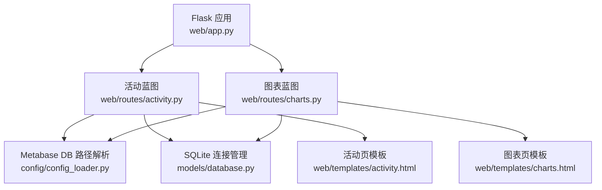
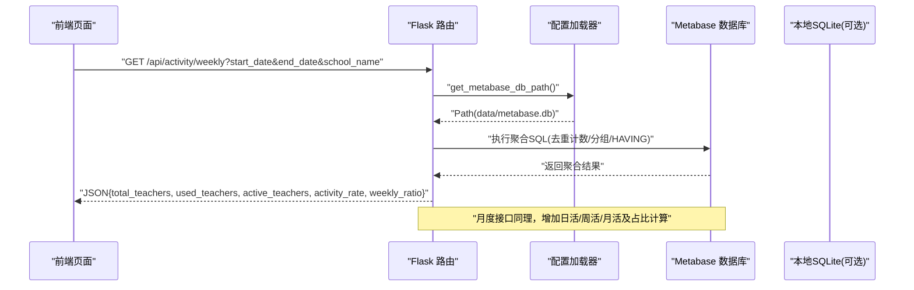
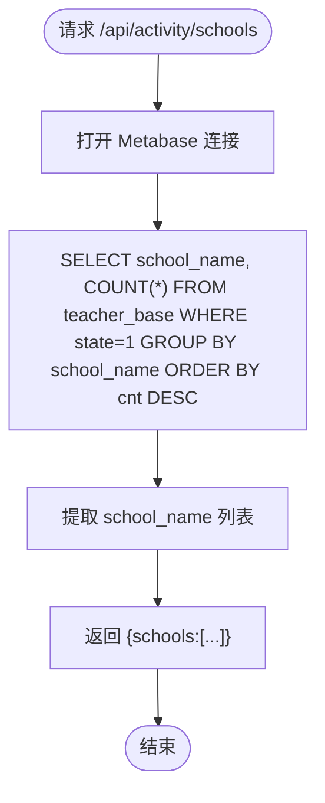
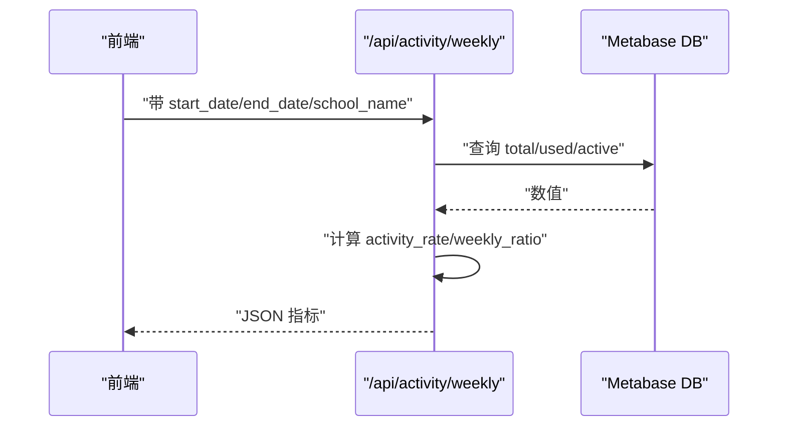
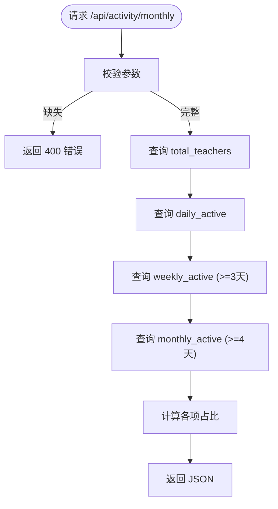
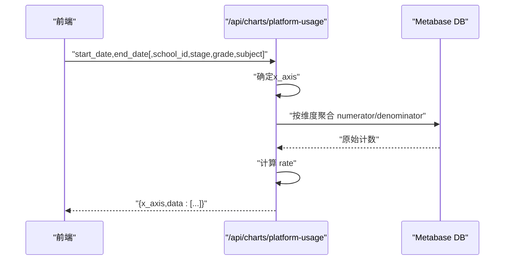
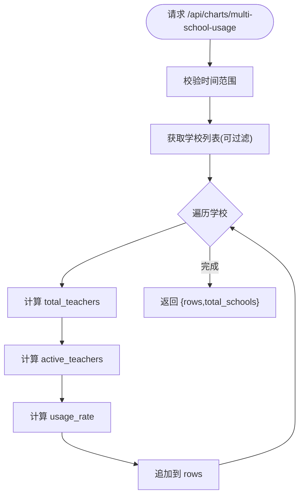
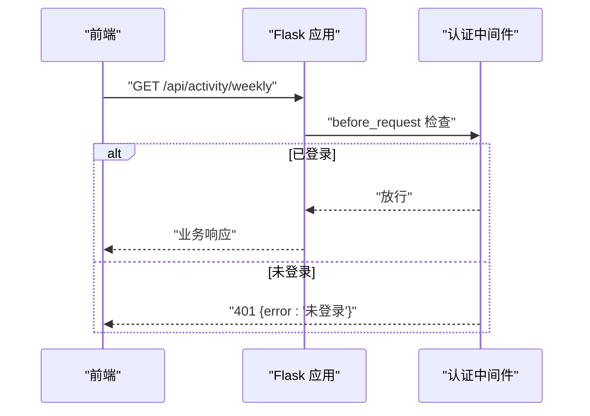
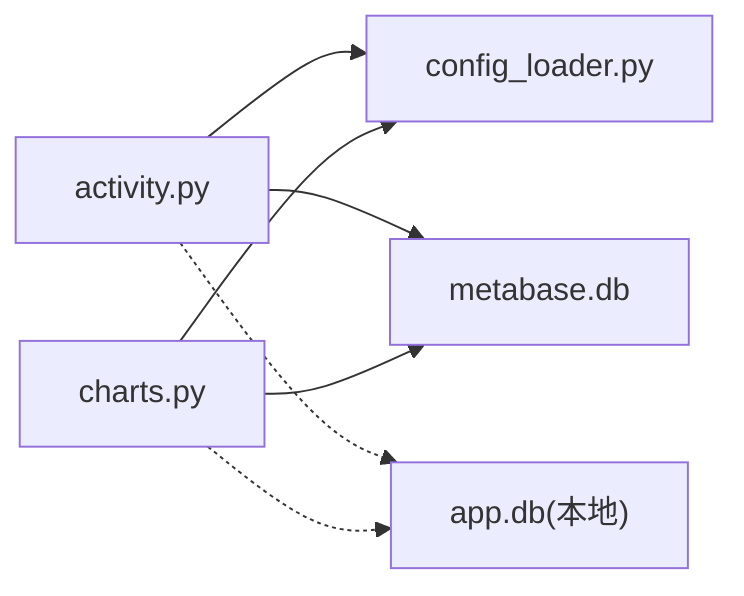

# 活跃度查询API

<cite>
**本文引用的文件**   
- [web/routes/activity.py](file://middle-platform-data-collector-master/web/routes/activity.py)
- [web/app.py](file://middle-platform-data-collector-master/web/app.py)
- [config/config_loader.py](file://middle-platform-data-collector-master/config/config_loader.py)
- [models/database.py](file://middle-platform-data-collector-master/models/database.py)
- [web/templates/activity.html](file://middle-platform-data-collector-master/web/templates/activity.html)
- [web/routes/charts.py](file://middle-platform-data-collector-master/web/routes/charts.py)
- [web/templates/charts.html](file://middle-platform-data-collector-master/web/templates/charts.html)
- [models/monthly_record.py](file://middle-platform-data-collector-master/models/monthly_record.py)
- [models/weekly_record.py](file://middle-platform-data-collector-master/models/weekly_record.py)
</cite>

## 目录
1. [简介](#简介)
2. [项目结构](#项目结构)
3. [核心组件](#核心组件)
4. [架构总览](#架构总览)
5. [详细组件分析](#详细组件分析)
6. [依赖关系分析](#依赖关系分析)
7. [性能与扩展建议](#性能与扩展建议)
8. [故障排查指南](#故障排查指南)
9. [结论](#结论)
10. [附录：接口规范与示例](#附录接口规范与示例)

## 简介
本文件为“活跃度查询”相关后端接口的权威文档，覆盖按时间范围、学校、学段/年级/学科等多维度的活跃度统计与对比分析。当前实现提供：
- 周活跃统计（按教师访问天数阈值）
- 月活跃统计（日活/周活/月活及占比）
- 平台使用率多维对比（按学校/学段/年级/学科）
- 多校使用率对比（支持按类型筛选）

同时说明数据口径、指标定义、返回格式、前端集成方式，并给出可扩展的趋势分析、同比环比、异常检测与预测等能力建议。

## 项目结构
活跃度相关功能主要位于 Web 层蓝图与模板中，并通过配置模块定位 Metabase 数据库路径进行查询。

**图示来源**
- [web/app.py:306-336](file://middle-platform-data-collector-master/web/app.py#L306-L336)
- [web/routes/activity.py:1-20](file://middle-platform-data-collector-master/web/routes/activity.py#L1-L20)
- [web/routes/charts.py:1-40](file://middle-platform-data-collector-master/web/routes/charts.py#L1-L40)
- [config/config_loader.py:122-147](file://middle-platform-data-collector-master/config/config_loader.py#L122-L147)
- [models/database.py:24-48](file://middle-platform-data-collector-master/models/database.py#L24-L48)
- [web/templates/activity.html:1-40](file://middle-platform-data-collector-master/web/templates/activity.html#L1-L40)
- [web/templates/charts.html:1-40](file://middle-platform-data-collector-master/web/templates/charts.html#L1-L40)

**章节来源**
- [web/app.py:306-336](file://middle-platform-data-collector-master/web/app.py#L306-L336)
- [web/routes/activity.py:1-20](file://middle-platform-data-collector-master/web/routes/activity.py#L1-L20)
- [web/routes/charts.py:1-40](file://middle-platform-data-collector-master/web/routes/charts.py#L1-L40)
- [config/config_loader.py:122-147](file://middle-platform-data-collector-master/config/config_loader.py#L122-L147)
- [models/database.py:24-48](file://middle-platform-data-collector-master/models/database.py#L24-L48)
- [web/templates/activity.html:1-40](file://middle-platform-data-collector-master/web/templates/activity.html#L1-L40)
- [web/templates/charts.html:1-40](file://middle-platform-data-collector-master/web/templates/charts.html#L1-L40)

## 核心组件
- 活动蓝图（activity_bp）：提供学校列表、周活跃、月活跃三个端点
- 图表蓝图（charts_bp）：提供平台使用率多维对比、多校使用率对比等端点
- 配置加载器（config_loader）：解析 Metabase 数据库路径
- 数据库模型（database.py）：本地 SQLite 连接管理与表结构初始化（活跃度接口直接读取 Metabase 库）

关键职责划分：
- 路由层负责参数校验、SQL 组装、结果序列化
- 配置层负责外部数据源路径解析
- 模板层负责前端交互与可视化渲染

**章节来源**
- [web/routes/activity.py:22-173](file://middle-platform-data-collector-master/web/routes/activity.py#L22-L173)
- [web/routes/charts.py:323-563](file://middle-platform-data-collector-master/web/routes/charts.py#L323-L563)
- [config/config_loader.py:122-147](file://middle-platform-data-collector-master/config/config_loader.py#L122-L147)
- [models/database.py:202-372](file://middle-platform-data-collector-master/models/database.py#L202-L372)

## 架构总览
活跃度查询采用“Web 路由 + SQLite 直连 Metabase 库”的轻量架构。请求经 Flask 路由进入后，通过配置获取 Metabase.db 路径，建立连接执行聚合 SQL，返回 JSON。

**图示来源**
- [web/routes/activity.py:48-101](file://middle-platform-data-collector-master/web/routes/activity.py#L48-L101)
- [web/routes/activity.py:104-173](file://middle-platform-data-collector-master/web/routes/activity.py#L104-L173)
- [config/config_loader.py:122-147](file://middle-platform-data-collector-master/config/config_loader.py#L122-L147)

## 详细组件分析

### 活跃度看板页面与基础数据
- 页面入口：/activity
- 学校下拉选项：/api/activity/schools（从 teacher_base 取启用学校并按人数排序）

**图示来源**
- [web/routes/activity.py:28-46](file://middle-platform-data-collector-master/web/routes/activity.py#L28-L46)

**章节来源**
- [web/routes/activity.py:22-46](file://middle-platform-data-collector-master/web/routes/activity.py#L22-L46)
- [web/templates/activity.html:341-359](file://middle-platform-data-collector-master/web/templates/activity.html#L341-L359)

### 周活跃统计接口
- 端点：GET /api/activity/weekly
- 必填参数：
  - start_date：开始日期，格式 YYYY-MM-DD
  - end_date：结束日期，格式 YYYY-MM-DD
  - school_name：学校名称（精确匹配）
- 返回字段：
  - total_teachers：该学校启用教师总数
  - used_teachers：时间范围内有访问记录的去重教师数
  - active_teachers：访问天数≥3天的去重教师数
  - activity_rate：整体活跃度 = active_teachers / used_teachers × 100%
  - weekly_ratio：周活比例 = active_teachers / total_teachers × 100%
- 数据粒度：按天聚合（dws_ingress_teacher_day.stat_date），按用户去重；阈值≥3天判定为周活
- 错误处理：缺少参数返回 400；数据库不存在抛出 FileNotFoundError

**图示来源**
- [web/routes/activity.py:48-101](file://middle-platform-data-collector-master/web/routes/activity.py#L48-L101)

**章节来源**
- [web/routes/activity.py:48-101](file://middle-platform-data-collector-master/web/routes/activity.py#L48-L101)
- [web/templates/activity.html:361-387](file://middle-platform-data-collector-master/web/templates/activity.html#L361-L387)

### 月活跃统计接口
- 端点：GET /api/activity/monthly
- 必填参数：
  - start_date：YYYY-MM-DD
  - end_date：YYYY-MM-DD
  - school_name：学校名称
- 返回字段：
  - total_teachers：启用教师总数
  - daily_active：时间范围内有访问记录的去重教师数
  - daily_ratio：日活占比 = daily_active / total_teachers × 100%
  - weekly_active：访问天数≥3天的去重教师数
  - weekly_ratio：周活占比 = weekly_active / total_teachers × 100%
  - monthly_active：访问天数≥4天的去重教师数
  - monthly_ratio：月活占比 = monthly_active / total_teachers × 100%
- 数据口径：基于 dws_ingress_teacher_day 的 stat_date 与 pv_count>0 过滤；按用户去重并按 distinct 天数阈值区分日/周/月活

**图示来源**
- [web/routes/activity.py:104-173](file://middle-platform-data-collector-master/web/routes/activity.py#L104-L173)

**章节来源**
- [web/routes/activity.py:104-173](file://middle-platform-data-collector-master/web/routes/activity.py#L104-L173)
- [web/templates/activity.html:389-418](file://middle-platform-data-collector-master/web/templates/activity.html#L389-L418)

### 平台使用率多维对比接口
- 端点：GET /api/charts/platform-usage
- 必填参数：
  - start_date：YYYY-MM-DD
  - end_date：YYYY-MM-DD
- 可选参数：
  - school_id：学校ID（用于限定单校或作为X轴维度之一）
  - stage：学段（高中/初中/小学）
  - grade：年级（如高一/七年级/一年级等）
  - subject：学科
- X轴维度自动推断规则：
  - 仅选择 school_id → X轴=学校
  - 选择 stage → X轴=学段
  - 选择 grade → X轴=年级
  - 选择 subject → X轴=学科
- 返回结构：
  - x_axis：当前X轴维度
  - data：数组，每项包含 label、numerator（分子）、denominator（分母）、rate（百分比）
- 数据口径：
  - 分子：在时间范围内访问过平台的去重教师数（host 过滤、排除特定学校名、用户ID有效性检查）
  - 分母：teacher_base 中符合条件的启用教师数
  - 学段/年级/学科通过逗号分隔字段的模糊匹配进行筛选

**图示来源**
- [web/routes/charts.py:323-347](file://middle-platform-data-collector-master/web/routes/charts.py#L323-L347)
- [web/routes/charts.py:138-321](file://middle-platform-data-collector-master/web/routes/charts.py#L138-L321)

**章节来源**
- [web/routes/charts.py:323-347](file://middle-platform-data-collector-master/web/routes/charts.py#L323-L347)
- [web/routes/charts.py:138-321](file://middle-platform-data-collector-master/web/routes/charts.py#L138-L321)
- [web/templates/charts.html:342-371](file://middle-platform-data-collector-master/web/templates/charts.html#L342-L371)

### 多校使用率对比接口
- 端点：GET /api/charts/multi-school-usage
- 必填参数：
  - start_date：YYYY-MM-DD
  - end_date：YYYY-MM-DD
- 可选参数：
  - stage：学段
  - grade：年级
  - subject：学科
  - school_id：限制某所学校
- 返回结构：
  - rows：每所学校一条记录，包含 school、school_id、total_teachers、active_teachers、usage_rate（字符串百分比）、rate_value（数值）
  - total_schools：返回的学校数量
- 数据口径：
  - 分子：时间范围内访问过的去重教师数（含学段/年级/学科过滤）
  - 分母：teacher_base 中启用且符合筛选的教师数
  - 若 total_teachers=0 则跳过该校

**图示来源**
- [web/routes/charts.py:451-563](file://middle-platform-data-collector-master/web/routes/charts.py#L451-L563)

**章节来源**
- [web/routes/charts.py:451-563](file://middle-platform-data-collector-master/web/routes/charts.py#L451-L563)

### 认证与安全
- 全局认证中间件：对 /api/* 未登录请求返回 401
- 登录/登出：/login GET/POST、/logout
- 上下文注入：current_user 注入模板

**图示来源**
- [web/app.py:253-293](file://middle-platform-data-collector-master/web/app.py#L253-L293)

**章节来源**
- [web/app.py:253-293](file://middle-platform-data-collector-master/web/app.py#L253-L293)

## 依赖关系分析
- 路由层依赖配置加载器以定位 Metabase 数据库路径
- 活动与图表蓝图均直接操作 Metabase 库（SQLite 文件）
- 本地 SQLite（app.db）主要用于采集任务与历史记录的持久化，活跃度接口不直接写入本地库

**图示来源**
- [web/routes/activity.py:12-19](file://middle-platform-data-collector-master/web/routes/activity.py#L12-L19)
- [web/routes/charts.py:30-37](file://middle-platform-data-collector-master/web/routes/charts.py#L30-L37)
- [config/config_loader.py:122-147](file://middle-platform-data-collector-master/config/config_loader.py#L122-L147)

**章节来源**
- [web/routes/activity.py:12-19](file://middle-platform-data-collector-master/web/routes/activity.py#L12-L19)
- [web/routes/charts.py:30-37](file://middle-platform-data-collector-master/web/routes/charts.py#L30-L37)
- [config/config_loader.py:122-147](file://middle-platform-data-collector-master/config/config_loader.py#L122-L147)

## 性能与扩展建议
- 缓存机制
  - 学校列表与筛选选项可短期缓存（例如 5-10 分钟），减少频繁读取 teacher_base
  - 活跃度聚合结果可按“学校+时间范围”做键值缓存，避免重复计算
- 查询优化
  - 针对 dws_ingress_teacher_day 的 stat_date、tianli_school_id、tianli_user_id 建立索引
  - 将 LIKE 匹配改为结构化字段或预聚合表，降低字符串匹配开销
- 大数据量处理
  - 分页与游标：对多校对比结果进行分页返回
  - 异步并发：多校并行查询（注意限流与超时控制）
  - 物化视图：将常用聚合结果沉淀为物化视图或汇总表
- 监控与限流
  - 记录接口耗时、错误率、QPS
  - 设置速率限制（如 IP 级或用户级）
  - 资源使用监控（CPU/内存/IO）与告警

[本节为通用建议，无需代码来源]

## 故障排查指南
- 常见错误
  - 缺少参数：返回 400，提示“缺少参数”或“时间范围为必填项”
  - 未登录：/api/* 返回 401 “未登录”
  - 数据库不存在：抛出 FileNotFoundError，需检查 METABASE_DB_PATH 或 config.yaml 中的 database.metabase_db_path
- 排查步骤
  - 确认浏览器控制台网络请求参数是否正确
  - 检查 Metabase 数据库路径是否有效
  - 查看服务端日志（logs/app.log）定位具体异常堆栈
  - 验证 teacher_base 与 dws_ingress_teacher_day 表结构与数据完整性

**章节来源**
- [web/routes/activity.py:54-56](file://middle-platform-data-collector-master/web/routes/activity.py#L54-L56)
- [web/routes/charts.py:332-334](file://middle-platform-data-collector-master/web/routes/charts.py#L332-L334)
- [web/app.py:256-263](file://middle-platform-data-collector-master/web/app.py#L256-L263)
- [config/config_loader.py:122-147](file://middle-platform-data-collector-master/config/config_loader.py#L122-L147)

## 结论
当前活跃度查询接口提供了按时间与学校的多维度聚合能力，满足日常看板与对比分析需求。建议在现有基础上引入缓存、索引与分页等优化策略，并逐步扩展趋势分析、同比环比、异常检测与预测等高级能力，以提升系统性能与分析深度。

[本节为总结性内容，无需代码来源]

## 附录：接口规范与示例

### 接口清单
- 学校列表
  - 方法：GET
  - 路径：/api/activity/schools
  - 返回：{ schools: string[] }
- 周活跃统计
  - 方法：GET
  - 路径：/api/activity/weekly
  - 参数：start_date, end_date, school_name
  - 返回：{ total_teachers, used_teachers, active_teachers, activity_rate, weekly_ratio }
- 月活跃统计
  - 方法：GET
  - 路径：/api/activity/monthly
  - 参数：start_date, end_date, school_name
  - 返回：{ total_teachers, daily_active, daily_ratio, weekly_active, weekly_ratio, monthly_active, monthly_ratio }
- 平台使用率多维对比
  - 方法：GET
  - 路径：/api/charts/platform-usage
  - 参数：start_date, end_date[, school_id, stage, grade, subject]
  - 返回：{ x_axis, data: [{ label, numerator, denominator, rate }] }
- 多校使用率对比
  - 方法：GET
  - 路径：/api/charts/multi-school-usage
  - 参数：start_date, end_date[, stage, grade, subject, school_id]
  - 返回：{ rows: [{ school, school_id, total_teachers, active_teachers, usage_rate, rate_value }], total_schools }

### 时间格式与筛选条件
- 时间格式：YYYY-MM-DD
- 筛选条件：
  - school_name：精确匹配
  - school_id：数字ID
  - stage：高中/初中/小学
  - grade：各学段对应年级
  - subject：学科（来自 teacher_base.subject_names）

### 返回数据结构与指标定义
- 活跃度指标
  - 周活：时间范围内访问天数≥3天的去重教师数
  - 月活：时间范围内访问天数≥4天的去重教师数
  - 日活：时间范围内有访问记录的去重教师数
  - 占比：对应活跃人数除以启用教师总数（或活跃/使用）×100%
- 数据粒度：按天聚合，按用户去重；过滤 host、无效用户ID与特定学校名

### 前端集成指南
- 活动页
  - 加载学校列表：/api/activity/schools
  - 查询周活跃：拼接 URL 参数调用 /api/activity/weekly
  - 查询月活跃：拼接 URL 参数调用 /api/activity/monthly
- 图表页
  - 加载筛选选项：/api/charts/options
  - 查询平台使用率：/api/charts/platform-usage
  - 渲染 Chart.js 柱状图，展示 label/rate/tooltip

**章节来源**
- [web/templates/activity.html:341-418](file://middle-platform-data-collector-master/web/templates/activity.html#L341-L418)
- [web/templates/charts.html:342-395](file://middle-platform-data-collector-master/web/templates/charts.html#L342-L395)

### 示例请求与响应
- 周活跃示例
  - 请求：GET /api/activity/weekly?start_date=2026-06-08&end_date=2026-06-11&school_name=保山市第一中学
  - 响应：{ total_teachers: 120, used_teachers: 85, active_teachers: 42, activity_rate: 49.4, weekly_ratio: 35.0 }
- 月活跃示例
  - 请求：GET /api/activity/monthly?start_date=2026-06-01&end_date=2026-06-11&school_name=保山市第一中学
  - 响应：{ total_teachers: 120, daily_active: 60, daily_ratio: 50.0, weekly_active: 42, weekly_ratio: 35.0, monthly_active: 30, monthly_ratio: 25.0 }
- 平台使用率示例
  - 请求：GET /api/charts/platform-usage?start_date=2026-06-01&end_date=2026-06-11&school_id=12345
  - 响应：{ x_axis: "school", data: [{ label: "A校", numerator: 80, denominator: 100, rate: 80.0 }, ...] }

[示例为说明用途，实际数值以接口返回为准]

### 趋势分析、同比环比、异常检测与预测（扩展建议）
- 趋势分析
  - 基于历史周/月活跃序列绘制折线图，支持滑动窗口平滑
- 同比环比
  - 同比：与去年同期同周期比较
  - 环比：与上一周期比较
- 异常检测
  - 基于移动平均与标准差阈值识别异常波动
- 预测算法
  - 简单线性回归或指数平滑用于短期预测
- 实现建议
  - 新增 /api/activity/trend 与 /api/activity/comparison 端点
  - 复用现有聚合逻辑，增加时间窗口与对比维度
  - 结合本地 monthly_records/weekly_records 进行回退与补充

[本节为概念性扩展，无需代码来源]