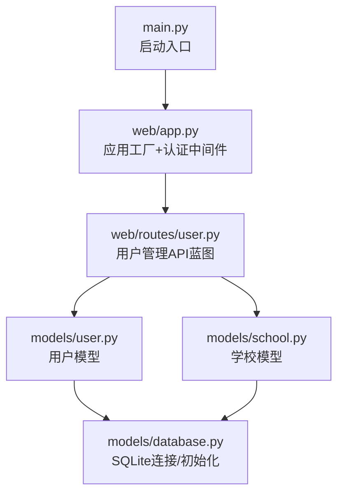
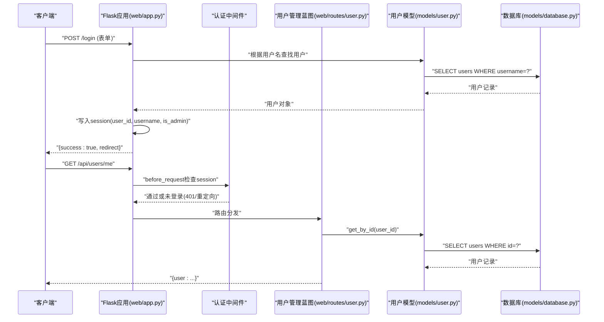
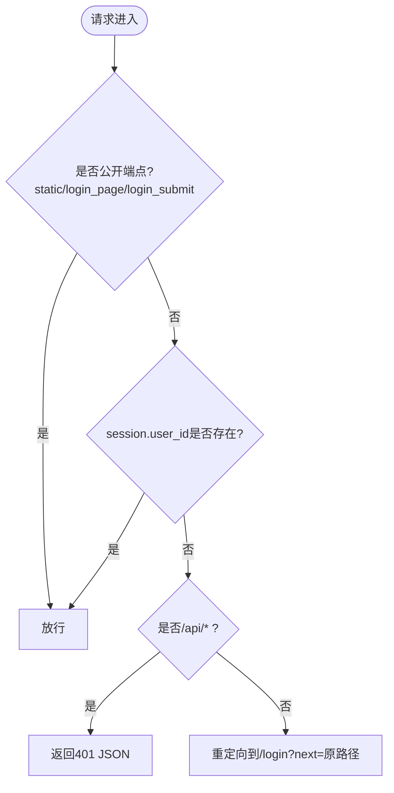
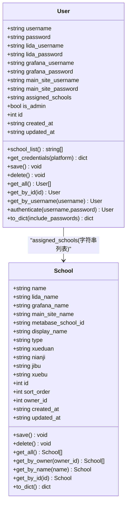
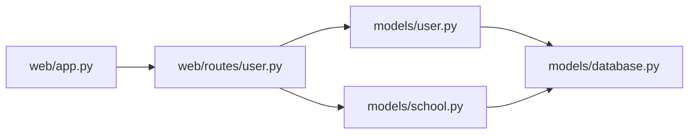

# 用户管理API

<cite>
**本文引用的文件**   
- [web/app.py](file://middle-platform-data-collector-master/middle-platform-data-collector-master/web/app.py)
- [web/routes/user.py](file://middle-platform-data-collector-master/middle-platform-data-collector-master/web/routes/user.py)
- [models/user.py](file://middle-platform-data-collector-master/middle-platform-data-collector-master/models/user.py)
- [models/database.py](file://middle-platform-data-collector-master/middle-platform-data-collector-master/models/database.py)
- [models/school.py](file://middle-platform-data-collector-master/middle-platform-data-collector-master/models/school.py)
- [main.py](file://middle-platform-data-collector-master/middle-platform-data-collector-master/main.py)
</cite>

## 目录
1. [简介](#简介)
2. [项目结构](#项目结构)
3. [核心组件](#核心组件)
4. [架构总览](#架构总览)
5. [详细组件分析](#详细组件分析)
6. [依赖关系分析](#依赖关系分析)
7. [性能与安全考量](#性能与安全考量)
8. [故障排查指南](#故障排查指南)
9. [结论](#结论)
10. [附录：错误码与最佳实践](#附录错误码与最佳实践)

## 简介
本文件为用户管理子系统的完整API文档，覆盖以下范围：
- 认证相关端点：登录、登出、会话校验（通过全局中间件）
- 用户管理接口：创建、查询、更新、删除、批量导入模板下载与导入
- 权限模型：管理员与普通用户的角色定义、资源访问控制、操作权限矩阵
- 凭证管理：多平台用户名/密码存储与覆盖策略（Lida、Grafana、主站）
- 会话与鉴权：基于Flask Session的认证流程与鉴权中间件
- 安全特性：敏感信息字段输出控制、默认管理员初始化、数据隔离（按学校）
- 客户端集成示例与流程图、错误码说明与安全建议

## 项目结构
用户管理相关的代码主要分布在以下模块：
- web/app.py：应用工厂、认证中间件、登录/登出页面与提交处理
- web/routes/user.py：用户管理API蓝图（CRUD、批量导入等）
- models/user.py：用户数据模型与数据库交互
- models/database.py：SQLite连接、表结构初始化与迁移、默认管理员创建
- models/school.py：学校数据模型（用于用户-学校关联）
- main.py：服务启动入口（开发/生产模式）

图表来源
- [main.py:10-42](file://middle-platform-data-collector-master/middle-platform-data-collector-master/main.py#L10-L42)
- [web/app.py:306-337](file://middle-platform-data-collector-master/middle-platform-data-collector-master/web/app.py#L306-L337)
- [web/routes/user.py:1-356](file://middle-platform-data-collector-master/middle-platform-data-collector-master/web/routes/user.py#L1-L356)
- [models/user.py:1-113](file://middle-platform-data-collector-master/middle-platform-data-collector-master/models/user.py#L1-L113)
- [models/school.py:1-165](file://middle-platform-data-collector-master/middle-platform-data-collector-master/models/school.py#L1-L165)
- [models/database.py:201-372](file://middle-platform-data-collector-master/middle-platform-data-collector-master/models/database.py#L201-L372)

章节来源
- [main.py:10-42](file://middle-platform-data-collector-master/middle-platform-data-collector-master/main.py#L10-L42)
- [web/app.py:306-337](file://middle-platform-data-collector-master/middle-platform-data-collector-master/web/app.py#L306-L337)

## 核心组件
- 认证中间件：在请求进入前检查会话状态，未登录时拦截并返回401或重定向到登录页
- 用户管理蓝图：提供用户列表、当前用户信息、个人修改、管理员创建/更新/删除、批量导入等功能
- 用户模型：封装用户数据的增删改查、凭据获取、序列化输出（可选包含敏感字段）
- 数据库层：SQLite持久化、表结构初始化、默认管理员账户创建

章节来源
- [web/app.py:253-304](file://middle-platform-data-collector-master/middle-platform-data-collector-master/web/app.py#L253-L304)
- [web/routes/user.py:15-356](file://middle-platform-data-collector-master/middle-platform-data-collector-master/web/routes/user.py#L15-L356)
- [models/user.py:9-113](file://middle-platform-data-collector-master/middle-platform-data-collector-master/models/user.py#L9-L113)
- [models/database.py:201-372](file://middle-platform-data-collector-master/middle-platform-data-collector-master/models/database.py#L201-L372)

## 架构总览
系统采用Flask蓝图模块化设计，认证逻辑集中在应用层中间件，用户管理API以REST风格暴露。数据持久化使用SQLite，用户与学校为独立模型，用户可分配多个学校，普通用户仅能访问其被分配的学校数据。

图表来源
- [web/app.py:253-304](file://middle-platform-data-collector-master/middle-platform-data-collector-master/web/app.py#L253-L304)
- [web/routes/user.py:21-36](file://middle-platform-data-collector-master/middle-platform-data-collector-master/web/routes/user.py#L21-L36)
- [models/user.py:60-77](file://middle-platform-data-collector-master/middle-platform-data-collector-master/models/user.py#L60-L77)
- [models/database.py:24-48](file://middle-platform-data-collector-master/middle-platform-data-collector-master/models/database.py#L24-L48)

## 详细组件分析

### 认证与会话管理
- 登录页面：GET /login，渲染登录表单，支持next参数进行登录后跳转
- 登录提交：POST /login，接收表单username与next，验证用户存在后写入session
- 登出：GET /logout，清空session并重定向至登录页
- 会话校验：before_request中间件对非公开端点进行鉴权，未登录时：
  - API请求返回401 JSON
  - 页面请求重定向到/login?next=原路径

图表来源
- [web/app.py:253-304](file://middle-platform-data-collector-master/middle-platform-data-collector-master/web/app.py#L253-L304)

章节来源
- [web/app.py:253-304](file://middle-platform-data-collector-master/middle-platform-data-collector-master/web/app.py#L253-L304)

### 用户管理API

#### 通用约定
- 基础路径：/api/users
- 认证要求：除登录/登出外，所有API均需已登录；管理员操作需is_admin=true
- 请求体：JSON格式，字段见各接口说明
- 响应体：统一JSON结构，包含message或error字段

#### 接口清单

- 列出所有用户
  - 方法：GET
  - 路径：/api/users/
  - 权限：管理员
  - 响应：{users: [...]}，每个用户包含to_dict(include_passwords=True)字段

- 获取当前用户信息
  - 方法：GET
  - 路径：/api/users/me
  - 权限：已登录用户
  - 响应：{user: to_dict(include_passwords=True)}

- 更新当前用户信息
  - 方法：PUT
  - 路径：/api/users/me
  - 权限：已登录用户
  - 请求体字段：lida_username/lida_password、grafana_username/grafana_password、main_site_username/main_site_password、password
  - 行为：仅允许修改自身凭证与登录密码
  - 响应：{message, user: to_dict()}

- 创建用户
  - 方法：POST
  - 路径：/api/users/
  - 权限：管理员
  - 请求体字段：username(必填)、password、lida_*、grafana_*、main_site_*、assigned_schools、is_admin
  - 响应：{message, user: to_dict()}, HTTP 201

- 更新指定用户
  - 方法：PUT
  - 路径：/api/users/<int:user_id>
  - 权限：管理员可改任何人；普通用户只能改自己
  - 请求体字段：username/password/assigned_schools/is_admin（管理员）、任意凭证字段（所有人）
  - 响应：{message, user: to_dict()}

- 删除用户
  - 方法：DELETE
  - 路径：/api/users/<int:user_id>
  - 权限：管理员
  - 保护：不允许删除默认管理员账号
  - 响应：{message}

- 下载批量导入模板
  - 方法：GET
  - 路径：/api/users/import-template
  - 权限：管理员
  - 响应：Excel文件流（.xlsx），含表头与示例行及填写说明

- 批量导入用户与学校
  - 方法：POST
  - 路径：/api/users/import
  - 权限：管理员
  - 请求体：multipart/form-data，字段file为.xlsx文件
  - 解析规则：按列映射用户名、学校名称、Metabase学校ID、Grafana名称、主站名称、学段、年级
  - 行为：
    - 按用户名分组，不存在则创建用户（无密码、非管理员）
    - 设置用户assigned_schools为学校名列表
    - 学校存在则更新，否则新增，owner_id为当前登录用户
  - 响应：{message, summary, details, warnings?}

章节来源
- [web/routes/user.py:21-356](file://middle-platform-data-collector-master/middle-platform-data-collector-master/web/routes/user.py#L21-L356)

### 用户模型与数据流

图表来源
- [models/user.py:9-113](file://middle-platform-data-collector-master/middle-platform-data-collector-master/models/user.py#L9-L113)
- [models/school.py:9-165](file://middle-platform-data-collector-master/middle-platform-data-collector-master/models/school.py#L9-L165)

章节来源
- [models/user.py:9-113](file://middle-platform-data-collector-master/middle-platform-data-collector-master/models/user.py#L9-L113)
- [models/school.py:9-165](file://middle-platform-data-collector-master/middle-platform-data-collector-master/models/school.py#L9-L165)

### 权限模型与资源访问控制
- 角色定义
  - 管理员：is_admin=true，可创建/更新/删除用户、下载导入模板、执行批量导入
  - 普通用户：仅能查看与修改自身凭证与登录密码，无法访问管理员功能
- 资源访问控制
  - 用户列表：仅管理员可访问
  - 当前用户信息：已登录用户可访问
  - 更新指定用户：管理员可改任何人；普通用户仅能改自己
  - 删除用户：仅管理员，且禁止删除默认管理员账号
- 操作权限矩阵
  - 管理员：全部用户管理操作
  - 普通用户：仅“获取当前用户”、“更新当前用户”

章节来源
- [web/routes/user.py:15-135](file://middle-platform-data-collector-master/middle-platform-data-collector-master/web/routes/user.py#L15-L135)

### 凭证管理机制
- 支持的第三方平台：Lida、Grafana、主站
- 存储字段：每平台分别有username与password字段
- 获取策略：User.get_credentials(platform)返回对应平台的凭据字典
- 覆盖策略：
  - 普通用户可通过/api/users/me更新自身凭证字段
  - 管理员可通过/api/users/<id>更新任何用户的凭证字段
- 输出控制：to_dict默认不包含明文密码，仅在include_passwords=true时返回

章节来源
- [models/user.py:32-39](file://middle-platform-data-collector-master/middle-platform-data-collector-master/models/user.py#L32-L39)
- [models/user.py:95-112](file://middle-platform-data-collector-master/middle-platform-data-collector-master/models/user.py#L95-L112)
- [web/routes/user.py:38-68](file://middle-platform-data-collector-master/middle-platform-data-collector-master/web/routes/user.py#L38-L68)
- [web/routes/user.py:102-135](file://middle-platform-data-collector-master/middle-platform-data-collector-master/web/routes/user.py#L102-L135)

### 用户数据隐私与安全
- 敏感字段输出控制：to_dict默认不返回密码，避免泄露
- 默认管理员初始化：首次启动时若users为空，自动创建admin/admin123
- 数据隔离：普通用户仅能访问其assigned_schools范围内的数据（在其他业务模块中体现）

章节来源
- [models/user.py:95-112](file://middle-platform-data-collector-master/middle-platform-data-collector-master/models/user.py#L95-L112)
- [models/database.py:363-372](file://middle-platform-data-collector-master/middle-platform-data-collector-master/models/database.py#L363-L372)

### 客户端集成示例（概念性）
- 登录流程
  - 前端调用POST /login，携带username与next
  - 成功后保存服务端设置的Cookie（Flask Session）
  - 后续请求自动附带Cookie完成鉴权
- 获取当前用户
  - GET /api/users/me，若未登录返回401
- 更新个人信息
  - PUT /api/users/me，发送JSON包含要更新的字段
- 管理员操作
  - 先以管理员身份登录，再调用创建/更新/删除/导入等接口

[本节为概念性说明，不直接分析具体文件]

## 依赖关系分析

图表来源
- [web/app.py:306-337](file://middle-platform-data-collector-master/middle-platform-data-collector-master/web/app.py#L306-L337)
- [web/routes/user.py:1-356](file://middle-platform-data-collector-master/middle-platform-data-collector-master/web/routes/user.py#L1-L356)
- [models/user.py:1-113](file://middle-platform-data-collector-master/middle-platform-data-collector-master/models/user.py#L1-L113)
- [models/school.py:1-165](file://middle-platform-data-collector-master/middle-platform-data-collector-master/models/school.py#L1-L165)
- [models/database.py:201-372](file://middle-platform-data-collector-master/middle-platform-data-collector-master/models/database.py#L201-L372)

章节来源
- [web/app.py:306-337](file://middle-platform-data-collector-master/middle-platform-data-collector-master/web/app.py#L306-L337)
- [web/routes/user.py:1-356](file://middle-platform-data-collector-master/middle-platform-data-collector-master/web/routes/user.py#L1-L356)

## 性能与安全考量
- 性能
  - SQLite WAL模式提升并发读性能
  - 批量导入使用只读加载工作簿，减少内存占用
  - 用户列表排序优化（管理员优先）
- 安全
  - 会话校验中间件统一拦截未授权访问
  - 敏感字段输出控制，避免无意泄露
  - 默认管理员密码应尽快修改
  - 建议在HTTPS环境下运行，确保Cookie安全传输
  - 建议引入密码哈希与加盐存储（当前为明文比较）
  - 建议增加审计日志记录关键操作（创建/更新/删除用户、批量导入）

[本节为通用指导，不直接分析具体文件]

## 故障排查指南
- 未登录访问API
  - 现象：返回401 JSON
  - 原因：会话缺失或过期
  - 解决：先调用登录接口，确保Cookie有效
- 权限不足
  - 现象：返回403
  - 原因：普通用户尝试修改他人或执行管理员操作
  - 解决：使用管理员账号或仅修改自身信息
- 用户名重复
  - 现象：创建用户返回409
  - 原因：目标用户名已存在
  - 解决：更换用户名或更新现有用户
- 批量导入失败
  - 现象：返回400并附带details/warnings
  - 原因：文件格式错误或数据行无效
  - 解决：参考模板列顺序与必填项，修正后再上传

章节来源
- [web/app.py:253-304](file://middle-platform-data-collector-master/middle-platform-data-collector-master/web/app.py#L253-L304)
- [web/routes/user.py:71-135](file://middle-platform-data-collector-master/middle-platform-data-collector-master/web/routes/user.py#L71-L135)
- [web/routes/user.py:226-339](file://middle-platform-data-collector-master/middle-platform-data-collector-master/web/routes/user.py#L226-L339)

## 结论
本用户管理子系统提供了完整的认证与会话管理、用户CRUD、批量导入以及基于角色的访问控制。通过统一的中间件鉴权与敏感字段输出控制，系统在易用性与安全性之间取得平衡。建议在生产环境中启用HTTPS、改进密码存储策略并完善审计日志，以提升整体安全水位。

[本节为总结性内容，不直接分析具体文件]

## 附录：错误码与最佳实践

### 错误码定义
- 400 请求体错误或参数缺失
  - 常见场景：缺少username、文件格式错误、无有效数据行
- 401 未登录
  - 常见场景：访问受保护API但未携带有效会话
- 403 权限不足
  - 常见场景：普通用户尝试修改他人或执行管理员操作
- 404 资源不存在
  - 常见场景：用户ID不存在
- 409 冲突
  - 常见场景：创建用户时用户名已存在

章节来源
- [web/routes/user.py:71-135](file://middle-platform-data-collector-master/middle-platform-data-collector-master/web/routes/user.py#L71-L135)
- [web/routes/user.py:226-339](file://middle-platform-data-collector-master/middle-platform-data-collector-master/web/routes/user.py#L226-L339)

### 安全最佳实践建议
- 强制HTTPS与Secure Cookie
- 实现密码哈希与加盐存储（如bcrypt）
- 引入Token机制（JWT）替代纯Session，便于分布式部署
- 增加操作审计日志（谁在何时做了什么）
- 限制批量导入文件大小与行数，防止资源耗尽
- 定期轮换默认管理员密码并最小化管理员数量

[本节为通用指导，不直接分析具体文件]