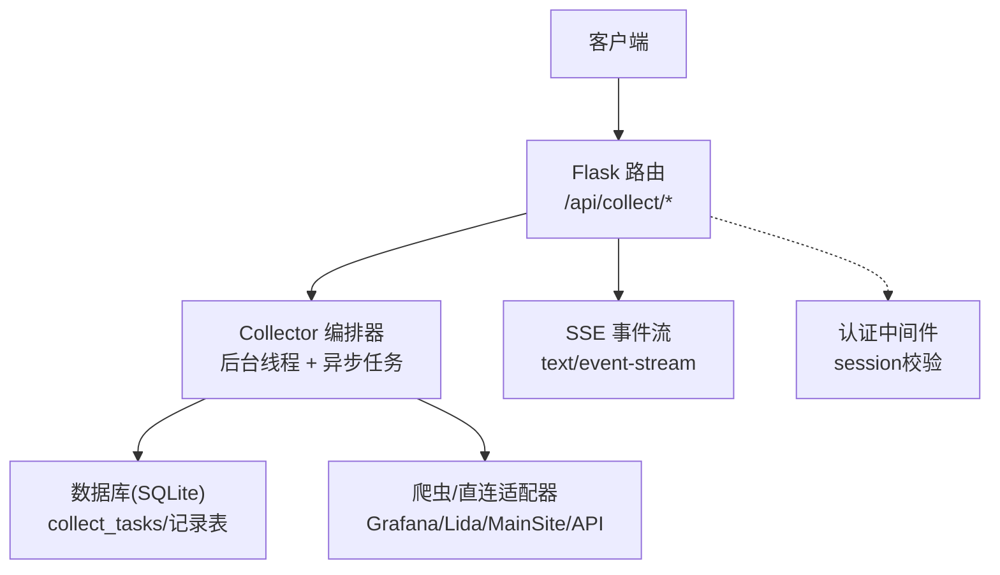
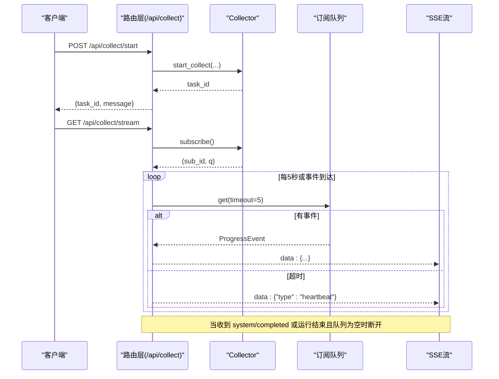
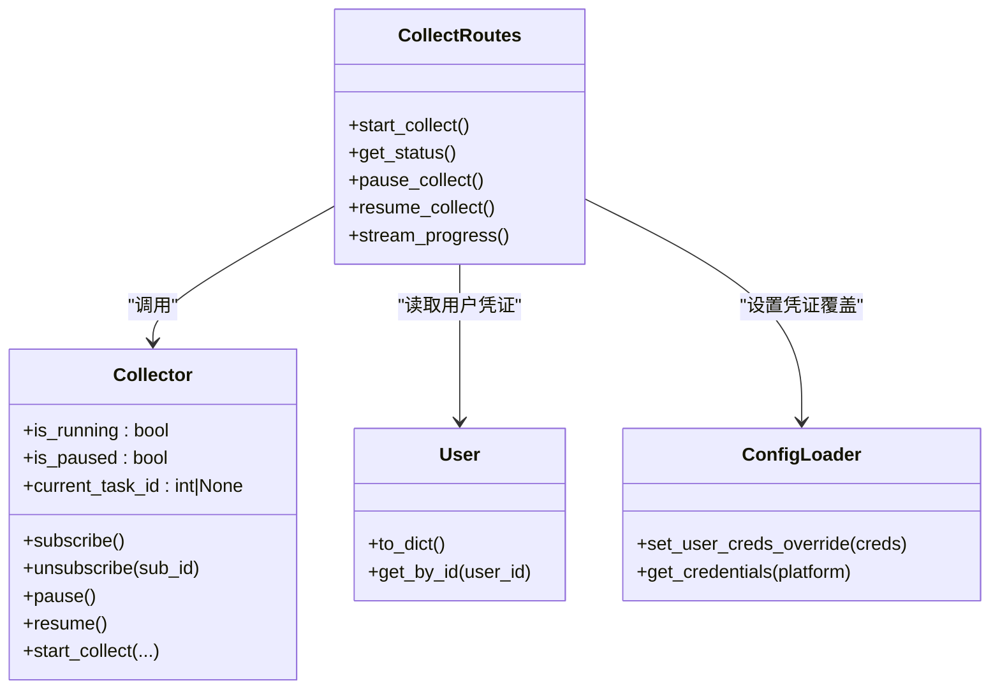

# 采集控制API

<cite>
**本文引用的文件列表**
- [web/routes/collect.py](file://middle-platform-data-collector-master/web/routes/collect.py)
- [services/collector.py](file://middle-platform-data-collector-master/services/collector.py)
- [web/app.py](file://middle-platform-data-collector-master/web/app.py)
- [main.py](file://middle-platform-data-collector-master/main.py)
- [models/user.py](file://middle-platform-data-collector-master/models/user.py)
- [config/config_loader.py](file://middle-platform-data-collector-master/config/config_loader.py)
</cite>

## 目录
1. [简介](#简介)
2. [项目结构](#项目结构)
3. [核心组件](#核心组件)
4. [架构总览](#架构总览)
5. [详细接口说明](#详细接口说明)
6. [依赖关系分析](#依赖关系分析)
7. [性能与并发特性](#性能与并发特性)
8. [故障排查指南](#故障排查指南)
9. [结论](#结论)
10. [附录：客户端集成示例](#附录客户端集成示例)

## 简介
本文件为“数据采集系统”的采集控制API文档，覆盖以下能力：
- 启动采集任务：POST /api/collect/start
- 查询运行状态：GET /api/collect/status
- 暂停/恢复任务：POST /api/collect/pause、POST /api/collect/resume
- SSE实时进度流：GET /api/collect/stream（事件格式、心跳机制、连接管理）

同时包含认证要求、错误码定义、请求响应示例以及Python/JavaScript客户端集成建议。

## 项目结构
与采集控制API相关的代码主要位于以下模块：
- Web路由层：web/routes/collect.py
- 采集编排器：services/collector.py
- 应用工厂与认证中间件：web/app.py
- 进程入口：main.py
- 用户模型与凭证覆盖：models/user.py、config/config_loader.py

图表来源
- [web/routes/collect.py:1-170](file://middle-platform-data-collector-master/web/routes/collect.py#L1-L170)
- [services/collector.py:65-176](file://middle-platform-data-collector-master/services/collector.py#L65-L176)
- [web/app.py:306-336](file://middle-platform-data-collector-master/web/app.py#L306-L336)

章节来源
- [web/routes/collect.py:1-170](file://middle-platform-data-collector-master/web/routes/collect.py#L1-L170)
- [services/collector.py:65-176](file://middle-platform-data-collector-master/services/collector.py#L65-L176)
- [web/app.py:306-336](file://middle-platform-data-collector-master/web/app.py#L306-L336)
- [main.py:10-41](file://middle-platform-data-collector-master/main.py#L10-L41)

## 核心组件
- 路由蓝图 collect_bp：提供 /start、/status、/pause、/resume、/stream 五个端点
- Collector 编排器：维护全局单例，负责任务生命周期、暂停/继续、SSE订阅广播、异步采集调度
- 认证中间件：基于 session 的用户登录态校验，未登录对 /api/* 返回 401
- 配置加载器：支持用户级凭证覆盖，优先使用当前登录用户的平台账号

章节来源
- [web/routes/collect.py:13-16](file://middle-platform-data-collector-master/web/routes/collect.py#L13-L16)
- [services/collector.py:65-131](file://middle-platform-data-collector-master/services/collector.py#L65-L131)
- [web/app.py:253-304](file://middle-platform-data-collector-master/web/app.py#L253-L304)
- [config/config_loader.py:99-119](file://middle-platform-data-collector-master/config/config_loader.py#L99-L119)

## 架构总览
采集控制API采用“同步路由 + 后台线程 + 异步协程”的分层设计：
- 路由层只做参数校验、鉴权、状态查询和SSE订阅建立
- Collector 在独立线程中创建事件循环执行异步采集逻辑
- 通过队列+订阅者模式向多个SSE客户端推送进度事件
- 支持按平台顺序与并行策略，自动降级（API失败回退浏览器）

图表来源
- [web/routes/collect.py:22-169](file://middle-platform-data-collector-master/web/routes/collect.py#L22-L169)
- [services/collector.py:102-131](file://middle-platform-data-collector-master/services/collector.py#L102-L131)

## 详细接口说明

### 通用约定
- 基础路径：/api/collect
- 内容类型：JSON 请求体默认 application/json
- 认证：需要已登录（基于 session），未登录将返回 401
- 字符编码：UTF-8

章节来源
- [web/app.py:256-263](file://middle-platform-data-collector-master/web/app.py#L256-L263)

---

### 启动采集任务
- 方法：POST
- 路径：/api/collect/start
- 功能：根据学校、时间范围、平台等参数启动一次采集任务，返回任务ID

请求体字段与验证规则
- schools: string[]，必填，至少一个；值必须存在于系统学校列表中
- year: number，可选，默认当前年
- week_number: string，必填，周次或月次标识
- start_date: string，必填，格式 YYYY-MM-DD
- end_date: string，必填，格式 YYYY-MM-DD
- platforms: string[]，可选，指定要采集的平台集合；为空表示全部
- record_type: string，可选，默认 weekly；取值 weekly 或 monthly
- month_number: string，可选；当 record_type=monthly 时若提供，需为中文月份（一月~十二月）
- data_source: string，可选，默认 grafana；grafana 表示走爬虫/直连，database 表示用数据库直查替代 Grafana

成功响应
- 200 OK
- 响应体包含 task_id、message、record_type、data_source

错误码
- 400 参数错误：缺少必填项、日期格式错误、未知学校、月度月次格式非法
- 409 冲突：已有任务在执行

示例（请求）
- 请求体示例（JSON）
  - {
      "schools": ["示例学校A", "示例学校B"],
      "year": 2025,
      "week_number": "W12",
      "start_date": "2025-03-17",
      "end_date": "2025-03-23",
      "platforms": ["grafana", "lida", "main_site"],
      "record_type": "weekly",
      "month_number": "",
      "data_source": "grafana"
    }

示例（响应）
- 200 OK
  - {
      "task_id": 123,
      "message": "采集任务已启动",
      "record_type": "weekly",
      "data_source": "grafana"
    }

章节来源
- [web/routes/collect.py:22-101](file://middle-platform-data-collector-master/web/routes/collect.py#L22-L101)
- [services/collector.py:133-176](file://middle-platform-data-collector-master/services/collector.py#L133-L176)

---

### 查询采集状态
- 方法：GET
- 路径：/api/collect/status
- 功能：返回当前采集任务的运行状态、是否暂停、当前任务ID和用户ID

响应字段
- running: boolean，是否有任务正在运行
- paused: boolean，是否处于暂停状态
- task_id: integer|null，当前任务ID
- user_id: integer|null，当前任务关联用户ID

示例（响应）
- 200 OK
  - {
      "running": true,
      "paused": false,
      "task_id": 123,
      "user_id": 10
    }

章节来源
- [web/routes/collect.py:104-112](file://middle-platform-data-collector-master/web/routes/collect.py#L104-L112)
- [services/collector.py:86-100](file://middle-platform-data-collector-master/services/collector.py#L86-L100)

---

### 暂停采集任务
- 方法：POST
- 路径：/api/collect/pause
- 功能：暂停当前正在运行的采集任务

行为与错误码
- 若无运行中的任务：400 错误
- 若已在暂停状态：返回提示消息
- 正常暂停：返回成功消息

示例（响应）
- 200 OK
  - {
      "message": "采集已暂停"
    }

章节来源
- [web/routes/collect.py:115-123](file://middle-platform-data-collector-master/web/routes/collect.py#L115-L123)
- [services/collector.py:119-124](file://middle-platform-data-collector-master/services/collector.py#L119-L124)

---

### 恢复采集任务
- 方法：POST
- 路径：/api/collect/resume
- 功能：恢复已暂停的采集任务

行为与错误码
- 若无运行中的任务：400 错误
- 若未处于暂停状态：返回提示消息
- 正常恢复：返回成功消息

示例（响应）
- 200 OK
  - {
      "message": "采集已继续"
    }

章节来源
- [web/routes/collect.py:126-134](file://middle-platform-data-collector-master/web/routes/collect.py#L126-L134)
- [services/collector.py:126-131](file://middle-platform-data-collector-master/services/collector.py#L126-L131)

---

### SSE 实时进度流
- 方法：GET
- 路径：/api/collect/stream
- 功能：以 Server-Sent Events 方式持续推送采集进度事件，每个客户端独立订阅

事件格式
- 文本事件，MIME: text/event-stream
- 每条数据行以 data: 前缀开头，内容为 JSON 字符串
- 普通事件对象字段：
  - school: string，学校名称
  - platform: string，平台名（如 lida、grafana、main_site、system）
  - status: string，状态（pending/running/completed/failed）
  - message: string，描述信息
  - elapsed_seconds: number?，可选，耗时秒数
- 心跳事件：
  - type: "heartbeat"
  - 其他字段可省略

连接管理与断线重连
- 服务端每约5秒从队列取一次事件，无事件则发送心跳
- 当收到 platform="system" 且 status="completed" 的事件，或检测到运行结束且队列为空时，服务端会发送最终完成事件并关闭流
- 客户端应在 onclose/onerror 时实现指数退避重连

示例（事件片段）
- data: {"school":"示例学校A","platform":"grafana","status":"running","message":"正在采集Grafana数据..."}
- data: {"school":"示例学校A","platform":"grafana","status":"completed","message":"Grafana采集完成(API)","elapsed_seconds":3.2}
- data: {"type":"heartbeat"}
- data: {"school":"","platform":"system","status":"completed","message":"采集完成"}

章节来源
- [web/routes/collect.py:137-169](file://middle-platform-data-collector-master/web/routes/collect.py#L137-L169)
- [services/collector.py:39-63](file://middle-platform-data-collector-master/services/collector.py#L39-L63)

## 依赖关系分析
- 路由层依赖 Collector 单例进行任务控制与SSE订阅
- Collector 依赖配置加载器获取学校信息与凭证覆盖
- 认证中间件拦截 /api/* 未登录请求，统一返回 401
- 启动入口 main.py 注册蓝图并选择开发/生产服务器

图表来源
- [web/routes/collect.py:13-169](file://middle-platform-data-collector-master/web/routes/collect.py#L13-L169)
- [services/collector.py:65-176](file://middle-platform-data-collector-master/services/collector.py#L65-L176)
- [models/user.py:1-113](file://middle-platform-data-collector-master/models/user.py#L1-L113)
- [config/config_loader.py:99-119](file://middle-platform-data-collector-master/config/config_loader.py#L99-L119)

章节来源
- [web/app.py:306-336](file://middle-platform-data-collector-master/web/app.py#L306-L336)
- [main.py:10-41](file://middle-platform-data-collector-master/main.py#L10-L41)

## 性能与并发特性
- 后台线程：start_collect 在新线程中运行，避免阻塞Web请求
- 异步采集：内部使用 asyncio 并发调度各平台采集，提升吞吐
- 暂停/继续：基于 Event 信号量，不影响已提交的任务，仅阻塞后续步骤
- SSE 多订阅：每个客户端拥有独立队列，互不干扰
- 资源复用：主站平台在API与浏览器模式间共享上下文，减少重复登录开销

[本节为通用性能讨论，无需特定文件引用]

## 故障排查指南
常见问题与定位要点
- 401 未登录：检查前端是否先访问 /login 并完成登录，确保携带有效 session
- 400 参数错误：核对 schools 是否为空、日期格式是否为 YYYY-MM-DD、月度模式下 month_number 是否为“一月~十二月”之一
- 409 冲突：已有任务在执行，等待完成后再发起新任务
- SSE 长时间无事件：确认后端是否仍在运行，检查心跳事件是否正常接收
- 采集失败：查看对应平台的错误消息与日志，必要时切换到 database 模式绕过外部依赖

章节来源
- [web/app.py:256-263](file://middle-platform-data-collector-master/web/app.py#L256-L263)
- [web/routes/collect.py:22-101](file://middle-platform-data-collector-master/web/routes/collect.py#L22-L101)
- [services/collector.py:154-176](file://middle-platform-data-collector-master/services/collector.py#L154-L176)

## 结论
采集控制API提供了完整的任务生命周期管理能力，结合SSE可实现实时可视化监控。通过用户级凭证覆盖与多平台自动降级策略，系统在稳定性与可用性方面具备良好保障。建议在客户端侧做好幂等重试、心跳处理与断线重连，以获得更健壮的集成体验。

[本节为总结性内容，无需特定文件引用]

## 附录：客户端集成示例

### JavaScript 集成要点
- 启动任务后，再连接 /api/collect/stream
- 监听 onmessage，解析 data 字段；忽略 type=heartbeat 的心跳事件
- 当收到 platform=system 且 status=completed 时，关闭 EventSource
- 在 onerror/onclose 时实现指数退避重连

参考实现位置
- [web/templates/collect.html:439-524](file://middle-platform-data-collector-master/web/templates/collect.html#L439-L524)

### Python 集成要点
- 使用 requests 调用 /api/collect/start 获取 task_id
- 使用 httpx 或 aiohttp 的 SSE 客户端库连接 /api/collect/stream
- 处理心跳与完成事件，合理设置超时与重连策略

[本节为通用集成指导，无需特定文件引用]