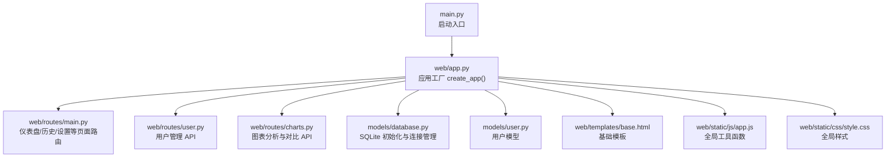
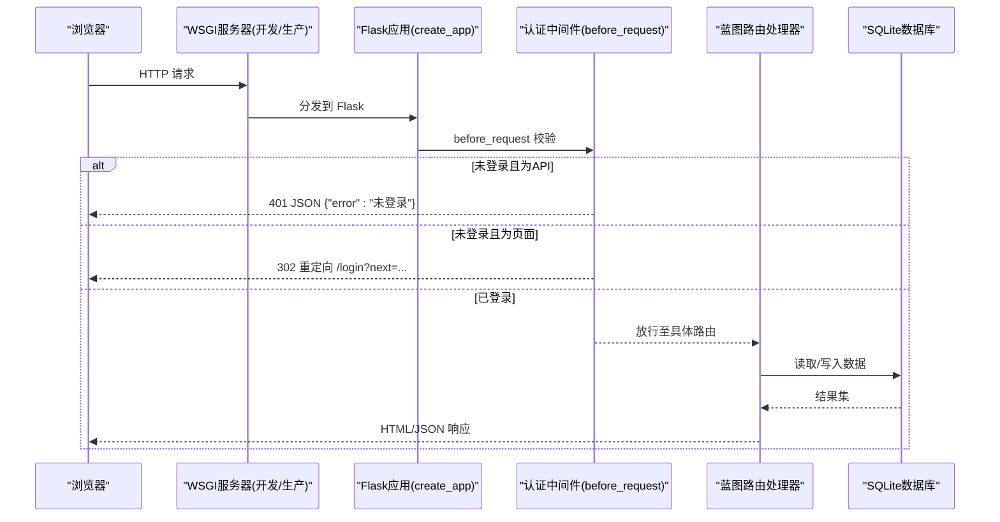
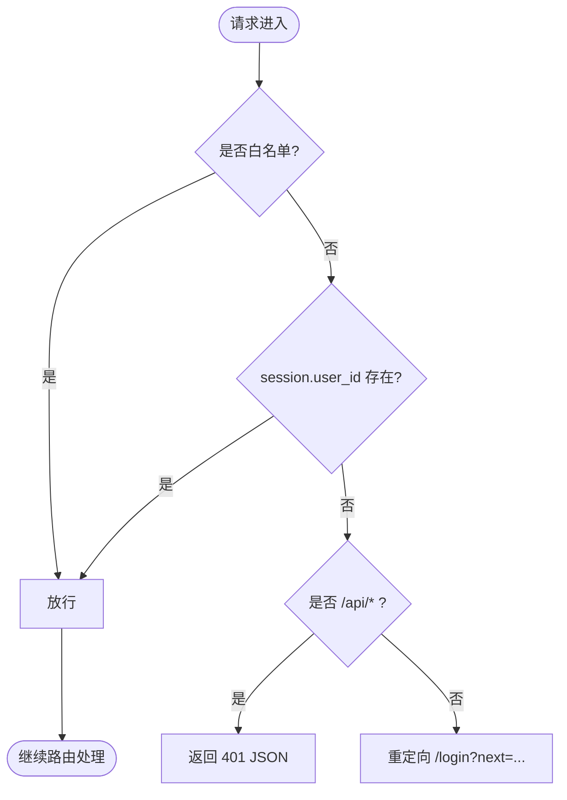
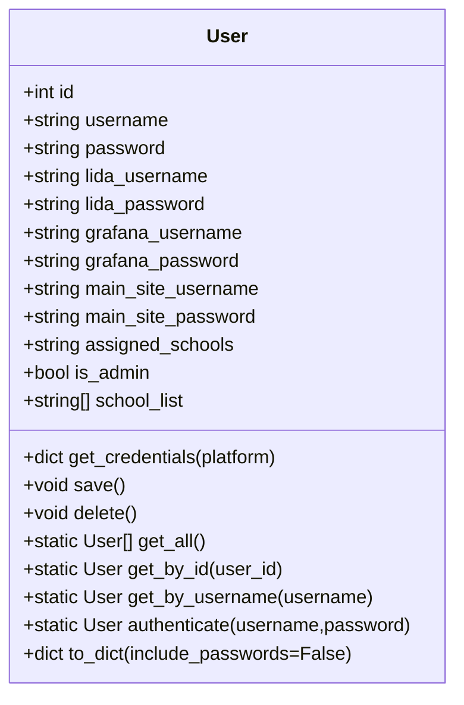
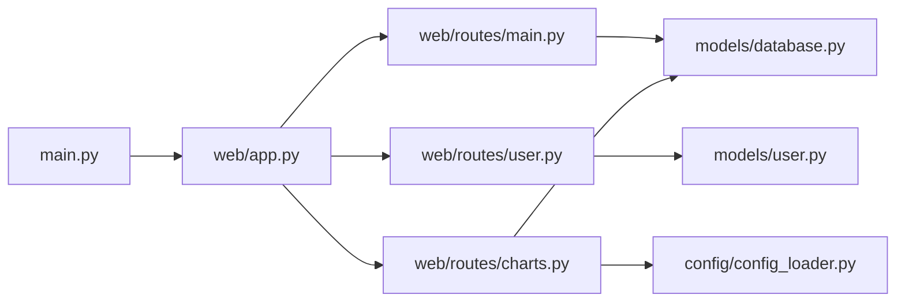

# Web应用

<cite>
**本文引用的文件**   
- [main.py](file://main.py)
- [web/app.py](file://web/app.py)
- [web/routes/main.py](file://web/routes/main.py)
- [web/routes/user.py](file://web/routes/user.py)
- [web/routes/charts.py](file://web/routes/charts.py)
- [models/database.py](file://models/database.py)
- [models/user.py](file://models/user.py)
- [web/templates/base.html](file://web/templates/base.html)
- [web/static/js/app.js](file://web/static/js/app.js)
- [web/static/css/style.css](file://web/static/css/style.css)
</cite>

## 目录
1. [简介](#简介)
2. [项目结构](#项目结构)
3. [核心组件](#核心组件)
4. [架构总览](#架构总览)
5. [详细组件分析](#详细组件分析)
6. [依赖关系分析](#依赖关系分析)
7. [性能与扩展性](#性能与扩展性)
8. [故障排查指南](#故障排查指南)
9. [结论](#结论)
10. [附录：API 路由文档](#附录api-路由文档)

## 简介
本技术文档面向开发者，系统化阐述该 Flask Web 应用的架构与实现细节，重点覆盖：
- 应用工厂模式与蓝图路由组织
- 中间件（请求前置校验）处理流程
- 用户认证系统：Session 管理、权限控制、密码存储现状与建议
- 实时监控与 SSE 事件推送机制的现状说明
- 模板引擎与静态资源组织、响应式样式设计
- 前端交互逻辑、表单验证与错误提示体验
- API 路由文档、请求/响应格式与错误码约定
- 扩展与自定义指南

## 项目结构
本项目采用“应用工厂 + 蓝图”的模块化组织方式。Web 层位于 web 目录下，包含路由、模板与静态资源；数据模型位于 models 目录；启动入口在根目录 main.py。

图示来源
- [main.py:1-42](file://main.py#L1-L42)
- [web/app.py:306-336](file://web/app.py#L306-L336)
- [web/routes/main.py:1-143](file://web/routes/main.py#L1-L143)
- [web/routes/user.py:1-356](file://web/routes/user.py#L1-L356)
- [web/routes/charts.py:1-120](file://web/routes/charts.py#L1-L120)
- [models/database.py:201-372](file://models/database.py#L201-L372)
- [models/user.py:1-113](file://models/user.py#L1-L113)
- [web/templates/base.html:1-44](file://web/templates/base.html#L1-L44)
- [web/static/js/app.js:1-23](file://web/static/js/app.js#L1-L23)
- [web/static/css/style.css:1-120](file://web/static/css/style.css#L1-L120)

章节来源
- [main.py:1-42](file://main.py#L1-L42)
- [web/app.py:306-336](file://web/app.py#L306-L336)

## 核心组件
- 应用工厂 create_app：负责日志、Flask 实例化、模板与静态目录配置、数据库初始化、蓝图注册、认证中间件注入。
- 蓝图路由：按功能域拆分，如 main、user、charts 等，统一通过 url_prefix 或根路径挂载。
- 认证中间件：before_request 钩子对非公开接口进行登录态检查，区分 API 与页面跳转。
- 数据模型：User 提供用户 CRUD、凭据获取、序列化方法；database 提供 SQLite 连接上下文与表结构迁移。
- 模板与静态资源：base.html 作为布局基座，CSS/JS 集中管理，支持响应式与毛玻璃风格。

章节来源
- [web/app.py:14-336](file://web/app.py#L14-L336)
- [web/routes/main.py:1-143](file://web/routes/main.py#L1-L143)
- [web/routes/user.py:1-356](file://web/routes/user.py#L1-L356)
- [web/routes/charts.py:1-120](file://web/routes/charts.py#L1-L120)
- [models/database.py:201-372](file://models/database.py#L201-L372)
- [models/user.py:1-113](file://models/user.py#L1-L113)
- [web/templates/base.html:1-44](file://web/templates/base.html#L1-L44)
- [web/static/js/app.js:1-23](file://web/static/js/app.js#L1-L23)
- [web/static/css/style.css:1-120](file://web/static/css/style.css#L1-L120)

## 架构总览
整体采用前后端分离程度较低的 SSR 架构：后端使用 Jinja2 渲染页面，同时暴露 RESTful API 供前端异步交互。认证基于 Session，权限控制以 is_admin 标记为主。

图示来源
- [web/app.py:253-304](file://web/app.py#L253-L304)
- [web/app.py:306-336](file://web/app.py#L306-L336)
- [models/database.py:24-48](file://models/database.py#L24-L48)

## 详细组件分析

### 应用工厂与蓝图组织
- 应用工厂职责：
  - 初始化日志输出到 logs 目录
  - 创建 Flask 实例并配置模板与静态目录
  - 初始化数据库（建表、迁移、默认管理员）
  - 注册各蓝图（main、collect、export、school、user、activity、charts）
  - 注入认证中间件与上下文处理器
- 蓝图组织：
  - main_bp：首页、采集页、历史记录、用户管理入口、个人设置、仪表盘数据 API
  - user_bp：用户列表、当前用户信息、更新、创建、删除、批量导入模板与导入
  - charts_bp：图表筛选选项、平台使用率、多校对比、模块级使用率查询（含 Metabase API 与 SLS 回退）

章节来源
- [web/app.py:306-336](file://web/app.py#L306-L336)
- [web/routes/main.py:1-143](file://web/routes/main.py#L1-L143)
- [web/routes/user.py:1-356](file://web/routes/user.py#L1-L356)
- [web/routes/charts.py:1-120](file://web/routes/charts.py#L1-L120)

### 认证中间件与权限控制
- 中间件策略：
  - 白名单端点：static、login_page、login_submit 不鉴权
  - 未登录时：
    - API 请求返回 401 JSON
    - 页面请求重定向到 /login?next=原路径
- 登录流程：
  - GET /login 渲染内嵌登录模板
  - POST /login 提交用户名，校验后写入 session[user_id, username, is_admin]
  - /logout 清空 session 并重定向到 /login
- 上下文注入：
  - 所有模板可访问 current_user（若已登录），用于导航栏显示与管理员徽章

图示来源
- [web/app.py:253-304](file://web/app.py#L253-L304)

章节来源
- [web/app.py:253-304](file://web/app.py#L253-L304)

### 用户模型与密码存储
- User 模型：
  - 字段包括用户名、密码、第三方平台凭据、分配学校、管理员标记、时间戳等
  - 提供 save/delete/get_all/get_by_id/get_by_username/to_dict 等方法
  - authenticate 方法用于比对用户名与明文密码
- 密码存储现状：
  - 数据库中 password 字段为明文存储
  - 建议在生产环境引入安全哈希（如 bcrypt/argon2）并在保存前进行加密

图示来源
- [models/user.py:1-113](file://models/user.py#L1-L113)

章节来源
- [models/user.py:1-113](file://models/user.py#L1-L113)

### 数据库与迁移
- 连接管理：
  - get_connection 提供上下文管理器，自动开启事务、异常回滚、关闭连接
  - 启用 WAL 模式与外键约束
- 表结构与迁移：
  - init_db 负责建表与增量迁移（添加缺失列、默认值填充）
  - 首次启动从 config.yaml 导入学校数据（若 users/schools 为空）
  - 创建默认管理员账户（admin/admin123）

章节来源
- [models/database.py:24-48](file://models/database.py#L24-L48)
- [models/database.py:201-372](file://models/database.py#L201-L372)

### 模板引擎与静态资源
- 模板：
  - base.html 定义导航、用户信息、版本标识与内容块
  - 其他页面模板继承 base.html，按需填充 title/head/content/scripts
- 静态资源：
  - CSS 集中于 style.css，提供响应式布局、毛玻璃效果、表格与按钮样式
  - JS 集中于 app.js，提供日期格式化与 Toast 提示工具函数

章节来源
- [web/templates/base.html:1-44](file://web/templates/base.html#L1-L44)
- [web/static/css/style.css:1-120](file://web/static/css/style.css#L1-L120)
- [web/static/js/app.js:1-23](file://web/static/js/app.js#L1-L23)

### 实时监控系统与 SSE 事件推送
- 现状说明：
  - 代码库中未发现 Server-Sent Events（SSE）相关实现
  - 数据采集进度与状态主要通过轮询 API 或页面刷新展示
- 建议方案（概念性指导）：
  - 后端新增 /api/stream 端点，使用 Flask 流式响应发送 event: progress/data/error
  - 前端使用 EventSource 订阅，维护任务状态机（pending/running/completed/failed）
  - 结合 collect_tasks 表记录任务进度，避免重复计算

[本节为概念性说明，不涉及具体源码，故无“章节来源”]

### 前端交互与用户体验
- 登录页：
  - 内嵌模板渲染表单，使用 fetch 提交 /login，成功后根据 next 参数跳转
  - 失败时 alert 提示错误信息
- 全局工具：
  - formatDate 用于日期格式化
  - showToast 用于消息提示（成功/错误/信息）
- 表单验证与反馈：
  - 前端使用 required 属性与禁用按钮防止重复提交
  - 后端对必填字段进行校验并返回结构化错误信息

章节来源
- [web/app.py:27-250](file://web/app.py#L27-L250)
- [web/static/js/app.js:1-23](file://web/static/js/app.js#L1-L23)

## 依赖关系分析
- 启动依赖：
  - main.py 调用 create_app，并根据参数选择开发或生产服务器
- 运行时依赖：
  - Flask、waitress（生产）、openpyxl（Excel 导入导出）、requests（外部 API 调用）、sqlite3（本地数据库）
- 模块耦合：
  - routes 依赖 models 与 config_loader
  - database 模块被多个模型共享
  - 认证中间件与上下文处理器贯穿所有路由

图示来源
- [main.py:1-42](file://main.py#L1-L42)
- [web/app.py:306-336](file://web/app.py#L306-L336)
- [web/routes/main.py:1-143](file://web/routes/main.py#L1-L143)
- [web/routes/user.py:1-356](file://web/routes/user.py#L1-L356)
- [web/routes/charts.py:1-120](file://web/routes/charts.py#L1-L120)
- [models/database.py:201-372](file://models/database.py#L201-L372)
- [models/user.py:1-113](file://models/user.py#L1-L113)

章节来源
- [main.py:1-42](file://main.py#L1-L42)
- [web/app.py:306-336](file://web/app.py#L306-L336)

## 性能与扩展性
- 数据库：
  - SQLite WAL 模式提升并发读性能
  - 建议对高频查询字段建立索引（如 weekly_records.school_name、year、week_number）
- 服务器：
  - 生产建议使用 waitress 多线程服务
  - 如需更高并发，考虑 gunicorn/uwsgi + Nginx 反向代理
- 缓存：
  - 对频繁读取的配置与字典数据增加内存缓存（如 functools.lru_cache）
- 扩展点：
  - 新增蓝图只需在 create_app 中注册
  - 新增 API 遵循统一错误码与 JSON 响应格式

[本节为通用建议，不涉及具体源码，故无“章节来源”]

## 故障排查指南
- 登录问题：
  - 确认 session.secret_key 已配置
  - 检查 before_request 白名单是否包含新页面
- 权限不足：
  - 确认 is_admin 标志是否正确设置
  - 检查用户更新接口中的权限分支逻辑
- 数据库异常：
  - 查看 logs/app.log 中的错误堆栈
  - 确认 data/app.db 文件权限与磁盘空间
- Excel 导入失败：
  - 确认上传文件格式为 .xlsx
  - 检查表头与示例行是否符合模板规范

章节来源
- [web/app.py:253-304](file://web/app.py#L253-L304)
- [web/routes/user.py:226-339](file://web/routes/user.py#L226-L339)
- [models/database.py:24-48](file://models/database.py#L24-L48)

## 结论
本项目采用清晰的工厂+蓝图架构，具备完善的认证中间件与用户管理功能。当前密码存储为明文，建议尽快升级为安全哈希。实时监控尚未实现 SSE，可通过流式事件增强用户体验。模板与静态资源组织良好，便于后续扩展与维护。

[本节为总结性内容，不涉及具体源码，故无“章节来源”]

## 附录：API 路由文档

### 认证相关
- GET /login
  - 描述：渲染登录页面
  - 响应：HTML
- POST /login
  - 描述：提交用户名进行登录
  - 请求体：application/x-www-form-urlencoded
    - username: string（必填）
    - next: string（可选，登录后跳转地址）
  - 成功响应：
    - { success: true, redirect: string }
  - 失败响应：
    - { success: false, error: string }
- GET /logout
  - 描述：退出登录，清空 session
  - 响应：302 重定向到 /login

章节来源
- [web/app.py:265-292](file://web/app.py#L265-L292)

### 仪表盘与页面路由
- GET /
  - 描述：仪表盘首页
  - 响应：HTML
- GET /collect
  - 描述：数据采集页面
  - 响应：HTML
- GET /history
  - 描述：历史记录页面
  - 响应：HTML
- GET /users
  - 描述：用户管理页面（仅管理员）
  - 响应：HTML 或 302 重定向
- GET /settings
  - 描述：个人设置页面
  - 响应：HTML

章节来源
- [web/routes/main.py:41-143](file://web/routes/main.py#L41-L143)

### 仪表盘数据 API
- GET /api/dashboard
  - 描述：获取仪表盘数据（周度/月度）
  - 查询参数：
    - type: weekly | monthly（默认 weekly）
  - 成功响应：
    - { records: array, schools: array, type: string }
  - 错误码：
    - 401：未登录
    - 403：权限不足（部分场景）

章节来源
- [web/routes/main.py:87-105](file://web/routes/main.py#L87-L105)

### 月度历史 API
- GET /api/history/monthly
  - 描述：查询月度历史记录
  - 查询参数：
    - year: integer（默认当前年）
    - month_number: string（可选）
    - school_name: string（可选）
  - 成功响应：
    - { records: array }
  - 错误码：
    - 401：未登录
    - 403：非管理员访问受限学校

章节来源
- [web/routes/main.py:108-128](file://web/routes/main.py#L108-L128)

### 用户管理 API
- GET /api/users/
  - 描述：列出所有用户（需管理员）
  - 成功响应：
    - { users: array }
  - 错误码：
    - 401：未登录
    - 403：需要管理员权限
- GET /api/users/me
  - 描述：获取当前用户信息
  - 成功响应：
    - { user: object }
  - 错误码：
    - 401：未登录
    - 404：用户不存在
- PUT /api/users/me
  - 描述：更新当前用户凭证或个人信息
  - 请求体：JSON
    - 可选字段：lida_username, lida_password, grafana_username, grafana_password, main_site_username, main_site_password, password
  - 成功响应：
    - { message: string, user: object }
  - 错误码：
    - 400：请求体为空
    - 401：未登录
    - 404：用户不存在
- POST /api/users/
  - 描述：创建新用户（需管理员）
  - 请求体：JSON
    - username: string（必填）
    - password: string（可选）
    - 其他字段同更新接口
  - 成功响应：
    - { message: string, user: object }, 201
  - 错误码：
    - 400：用户名为必填
    - 409：用户名已存在
    - 403：需要管理员权限
- PUT /api/users/:user_id
  - 描述：更新指定用户（管理员可改任何人，普通用户只能改自己）
  - 请求体：JSON
    - 管理员可修改：username, password, assigned_schools, is_admin
    - 所有人可修改：各平台凭据字段
  - 成功响应：
    - { message: string, user: object }
  - 错误码：
    - 400：请求体为空
    - 403：权限不足
    - 404：用户不存在
- DELETE /api/users/:user_id
  - 描述：删除用户（需管理员，不能删除默认 admin）
  - 成功响应：
    - { message: string }
  - 错误码：
    - 400：不能删除默认管理员
    - 403：需要管理员权限
    - 404：用户不存在
- GET /api/users/import-template
  - 描述：下载导入模板 Excel（需管理员）
  - 响应：application/vnd.openxmlformats-officedocument.spreadsheetml.sheet
- POST /api/users/import
  - 描述：批量导入用户及学校信息（需管理员）
  - 请求体：multipart/form-data
    - file: Excel 文件（.xlsx）
  - 成功响应：
    - { message: string, summary: object, details: object, warnings?: array }
  - 错误码：
    - 400：文件格式错误或无有效数据行
    - 403：需要管理员权限

章节来源
- [web/routes/user.py:15-356](file://web/routes/user.py#L15-L356)

### 图表与分析 API
- GET /charts
  - 描述：图表分析页面
  - 响应：HTML
- GET /api/charts/options
  - 描述：获取筛选器可选项（学校、学段、年级、学科）
  - 成功响应：
    - { schools: array, schools_by_type: object, stages: array, grades: array, subjects: array }
- GET /api/charts/platform-usage
  - 描述：平台使用率查询
  - 查询参数：
    - start_date: string（必填）
    - end_date: string（必填）
    - school_id: string（可选）
    - stage: string（可选）
    - grade: string（可选）
    - subject: string（可选）
  - 成功响应：
    - { x_axis: string, data: array }
  - 错误码：
    - 400：时间范围为必填项
    - 500：内部错误
- GET /api/charts/multi-school-usage
  - 描述：多校使用率对比
  - 查询参数：
    - start_date: string（必填）
    - end_date: string（必填）
    - stage: string（可选）
    - grade: string（可选）
    - subject: string（可选）
    - school_id: string（可选）
  - 成功响应：
    - { rows: array, total_schools: number }
  - 错误码：
    - 400：时间范围为必填项
    - 500：内部错误
- GET /comparison
  - 描述：多校使用率对比页面
  - 响应：HTML

章节来源
- [web/routes/charts.py:63-120](file://web/routes/charts.py#L63-L120)
- [web/routes/charts.py:323-347](file://web/routes/charts.py#L323-L347)
- [web/routes/charts.py:451-562](file://web/routes/charts.py#L451-L562)
- [web/routes/charts.py:565-568](file://web/routes/charts.py#L565-L568)

### 错误码约定
- 200：成功
- 201：创建成功
- 400：请求参数错误
- 401：未登录
- 403：权限不足
- 404：资源不存在
- 500：服务器内部错误

[本节为通用约定，不涉及具体源码，故无“章节来源”]