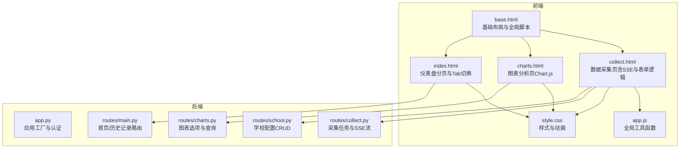
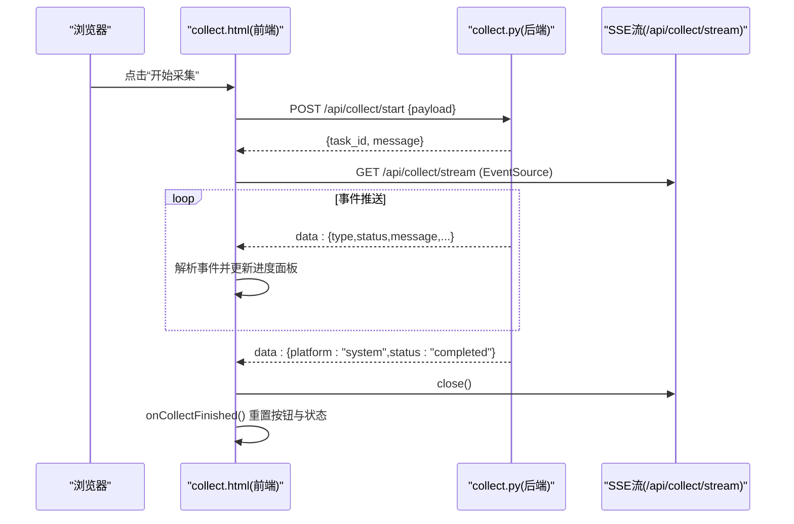
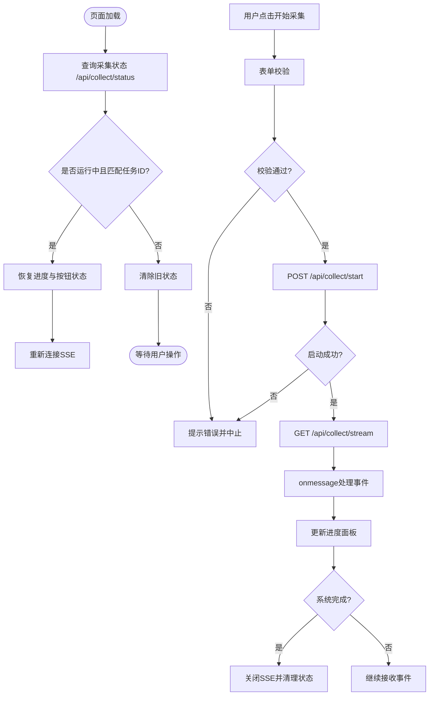
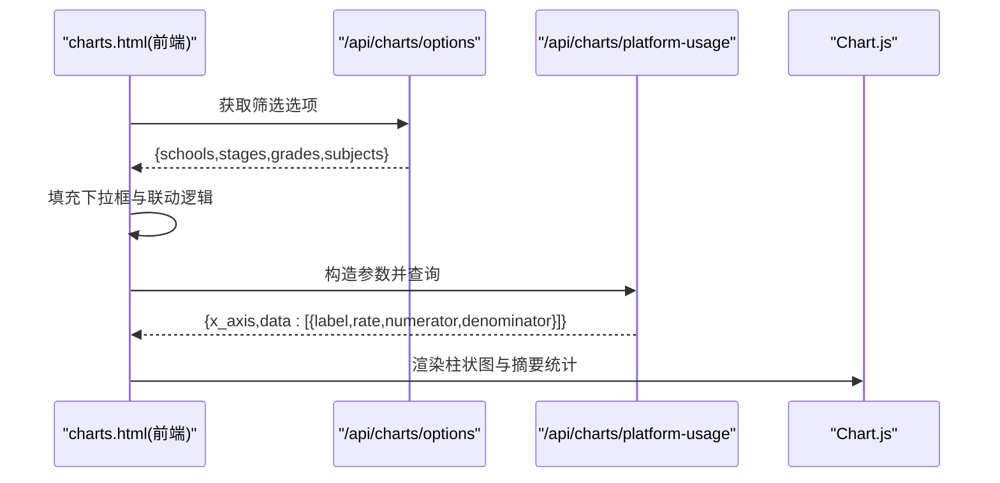
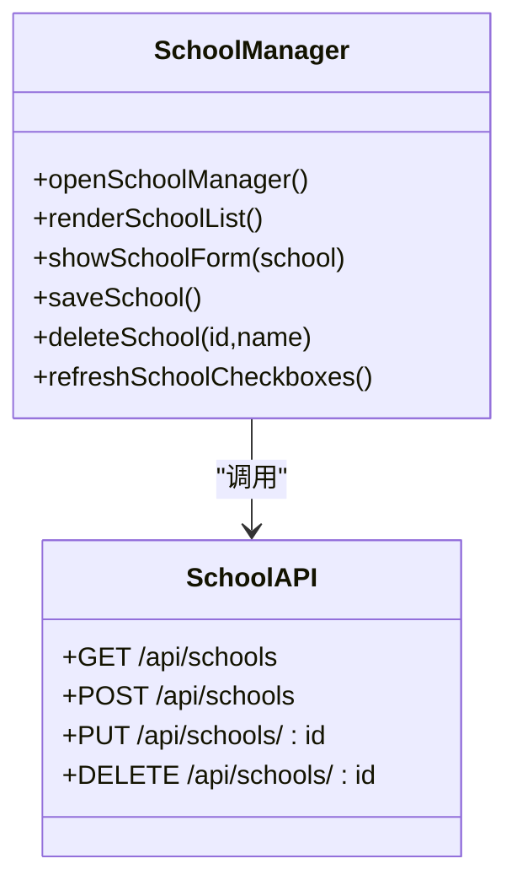
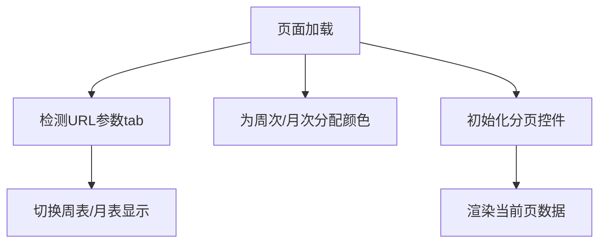
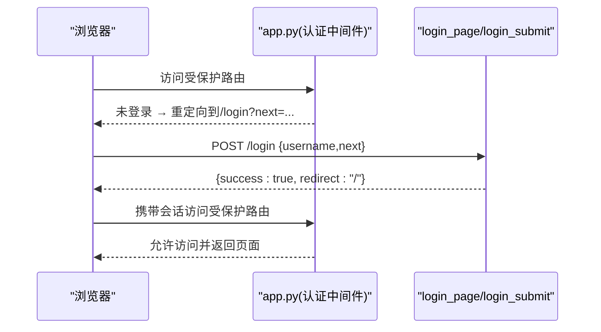
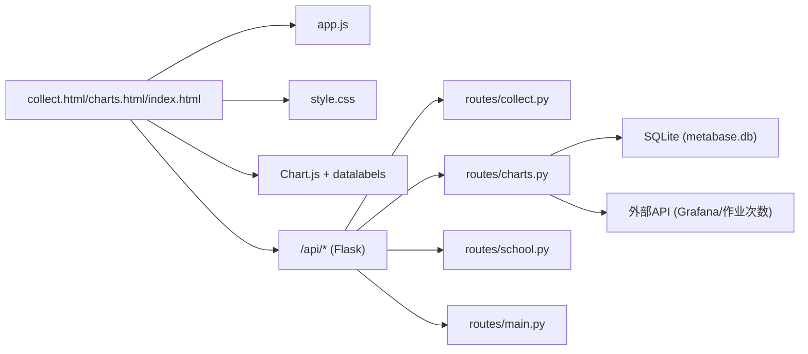

# JavaScript交互

<cite>
**本文引用的文件**   
- [web/static/js/app.js](file://web/static/js/app.js)
- [web/templates/base.html](file://web/templates/base.html)
- [web/templates/collect.html](file://web/templates/collect.html)
- [web/templates/charts.html](file://web/templates/charts.html)
- [web/templates/index.html](file://web/templates/index.html)
- [web/static/css/style.css](file://web/static/css/style.css)
- [web/app.py](file://web/app.py)
- [web/routes/collect.py](file://web/routes/collect.py)
- [web/routes/charts.py](file://web/routes/charts.py)
- [web/routes/school.py](file://web/routes/school.py)
- [web/routes/main.py](file://web/routes/main.py)
</cite>

## 目录
1. [简介](#简介)
2. [项目结构](#项目结构)
3. [核心组件](#核心组件)
4. [架构总览](#架构总览)
5. [详细组件分析](#详细组件分析)
6. [依赖分析](#依赖分析)
7. [性能考虑](#性能考虑)
8. [故障排查指南](#故障排查指南)
9. [结论](#结论)
10. [附录](#附录)

## 简介
本技术文档聚焦前端JavaScript交互系统，围绕以下主题展开：
- SSE（Server-Sent Events）实现原理与实时进度推送机制
- 事件监听与事件驱动编程模式
- 表单验证、异步请求处理流程、错误处理与用户反馈
- DOM操作最佳实践、事件委托策略、动画效果实现
- WebSocket连接建立过程（概念说明）、数据绑定方式、状态管理设计思路
- JavaScript模块化开发、代码分割优化、运行时性能监控实践经验

本项目采用Flask作为后端，前端以HTML模板+原生JavaScript为主，通过REST API与SSE进行前后端通信。采集任务启动后，前端使用EventSource订阅服务端推送的进度事件，并在页面中实时更新采集状态与耗时信息。图表分析页使用Chart.js渲染柱状图，支持多维度筛选与动态更新。

## 项目结构
前端资源组织方式：
- 静态脚本：web/static/js/app.js（全局工具函数）
- 样式：web/static/css/style.css（统一UI风格与动画）
- 模板：web/templates/*.html（页面结构与内联脚本）
- 路由与API：web/routes/*.py（Flask蓝图）
- 应用入口：web/app.py（注册蓝图、认证中间件等）

图示来源
- [web/templates/base.html:1-44](file://web/templates/base.html#L1-L44)
- [web/templates/collect.html:1-776](file://web/templates/collect.html#L1-L776)
- [web/templates/charts.html:1-400](file://web/templates/charts.html#L1-L400)
- [web/templates/index.html:1-292](file://web/templates/index.html#L1-L292)
- [web/static/js/app.js:1-23](file://web/static/js/app.js#L1-L23)
- [web/static/css/style.css:1-800](file://web/static/css/style.css#L1-L800)
- [web/app.py:306-337](file://web/app.py#L306-L337)
- [web/routes/collect.py:1-170](file://web/routes/collect.py#L1-L170)
- [web/routes/charts.py:1-800](file://web/routes/charts.py#L1-L800)
- [web/routes/school.py:1-155](file://web/routes/school.py#L1-L155)
- [web/routes/main.py:1-143](file://web/routes/main.py#L1-L143)

章节来源
- [web/templates/base.html:1-44](file://web/templates/base.html#L1-L44)
- [web/static/js/app.js:1-23](file://web/static/js/app.js#L1-L23)
- [web/static/css/style.css:1-800](file://web/static/css/style.css#L1-L800)
- [web/app.py:306-337](file://web/app.py#L306-L337)

## 核心组件
- 全局工具函数（app.js）
  - 提供日期格式化与Toast提示，用于统一用户反馈与时间显示。
- 数据采集页（collect.html）
  - 表单参数构建与校验；启动采集任务（POST /api/collect/start）；建立SSE连接（GET /api/collect/stream）；根据事件类型更新进度面板；保存/恢复页面状态（sessionStorage）。
- 图表分析页（charts.html）
  - 初始化筛选器选项（GET /api/charts/options）；按维度查询平台使用率（GET /api/charts/platform-usage）；使用Chart.js渲染并展示摘要统计。
- 仪表盘（index.html）
  - Tab切换（周表/月表）；表格分页；颜色标记周次；从后端获取数据（GET /api/dashboard）。
- 学校管理（school.py + collect.html）
  - 列表/新增/编辑/删除学校（/api/schools），前端弹窗渲染与表单提交。

章节来源
- [web/static/js/app.js:1-23](file://web/static/js/app.js#L1-L23)
- [web/templates/collect.html:218-776](file://web/templates/collect.html#L218-L776)
- [web/templates/charts.html:150-395](file://web/templates/charts.html#L150-L395)
- [web/templates/index.html:202-292](file://web/templates/index.html#L202-L292)
- [web/routes/school.py:1-155](file://web/routes/school.py#L1-L155)

## 架构总览
前后端交互的关键路径：
- 登录认证：Flask before_request拦截未登录访问，返回重定向或401 JSON。
- 采集任务：前端POST启动任务→后端创建任务并返回task_id→前端建立SSE连接→后端持续推送事件（包含心跳与完成信号）→前端更新UI并关闭连接。
- 图表查询：前端GET筛选选项→前端构造查询参数→后端聚合计算→返回JSON→前端渲染图表。

图示来源
- [web/templates/collect.html:385-547](file://web/templates/collect.html#L385-L547)
- [web/routes/collect.py:22-169](file://web/routes/collect.py#L22-L169)

章节来源
- [web/app.py:253-304](file://web/app.py#L253-L304)
- [web/routes/collect.py:22-169](file://web/routes/collect.py#L22-L169)
- [web/templates/collect.html:385-547](file://web/templates/collect.html#L385-L547)

## 详细组件分析

### 数据采集与SSE进度推送
- 表单验证
  - 必填校验：至少选择一个学校；周表需选择或输入周次；日期范围必须有效。
  - 模式切换时自动填充日期（周表/月表），同步月份与周次/月次字段。
- 异步请求流程
  - 先POST启动任务，成功后再建立SSE连接，确保订阅到正确的采集器实例。
  - 使用fetch发起请求，统一错误处理与按钮状态恢复。
- SSE事件处理
  - 心跳事件忽略；运行中/完成/失败事件分别渲染不同样式与图标。
  - 同平台running项替换避免转圈图标残留；完成后关闭连接并清理状态。
- 状态持久化
  - 使用sessionStorage保存当前任务ID、进度HTML、运行标志与模式，便于刷新后恢复。
  - 页面加载时查询后端状态，若为同一任务则恢复进度并重连SSE。

图示来源
- [web/templates/collect.html:218-626](file://web/templates/collect.html#L218-L626)
- [web/routes/collect.py:104-169](file://web/routes/collect.py#L104-L169)

章节来源
- [web/templates/collect.html:218-626](file://web/templates/collect.html#L218-L626)
- [web/routes/collect.py:22-169](file://web/routes/collect.py#L22-L169)

### 图表分析与数据可视化
- 筛选器初始化
  - 页面加载时获取选项（学校、学段、年级、学科），动态填充下拉框。
  - 学段变化时联动年级选项（高中/初中/小学映射）。
- 查询与渲染
  - 构造URLSearchParams传递筛选条件，调用/api/charts/platform-usage。
  - 根据返回数据生成标签、比率、分子分母，使用Chart.js绘制柱状图。
  - 计算平均/最高/最低使用率，展示Top5学校（当X轴为学校且数据量较大时）。
- 空态与错误处理
  - 无数据时隐藏图表区域并显示占位文本；网络异常时弹出提示。

图示来源
- [web/templates/charts.html:150-395](file://web/templates/charts.html#L150-L395)
- [web/routes/charts.py:70-347](file://web/routes/charts.py#L70-L347)

章节来源
- [web/templates/charts.html:150-395](file://web/templates/charts.html#L150-L395)
- [web/routes/charts.py:70-347](file://web/routes/charts.py#L70-L347)

### 学校管理与权限控制
- 列表与CRUD
  - 管理员可查看所有学校；普通用户仅可见分配的学校。
  - 新增/编辑/删除学校，前端弹窗渲染表单与表格。
- 权限校验
  - 后端在创建/更新/删除前检查用户角色与归属，防止越权操作。
- 前端交互
  - 打开弹窗时拉取最新列表；保存或删除后刷新列表与复选框组。

图示来源
- [web/templates/collect.html:628-773](file://web/templates/collect.html#L628-L773)
- [web/routes/school.py:1-155](file://web/routes/school.py#L1-L155)

章节来源
- [web/templates/collect.html:628-773](file://web/templates/collect.html#L628-L773)
- [web/routes/school.py:1-155](file://web/routes/school.py#L1-L155)

### 仪表盘与分页
- Tab切换
  - URL参数tab=monthly时默认切换到月表视图。
- 分页实现
  - 基于DOM行数量进行客户端分页，显示当前页码与导航按钮。
- 颜色标记
  - 为周次/月次胶囊分配颜色，提升可读性。

图示来源
- [web/templates/index.html:202-292](file://web/templates/index.html#L202-L292)

章节来源
- [web/templates/index.html:202-292](file://web/templates/index.html#L202-L292)

### 认证与全局布局
- 认证中间件
  - 未登录访问受保护路由时重定向至登录页或返回401 JSON。
- 全局布局
  - base.html注入导航栏、用户信息与全局脚本引用。
- 登录流程
  - 登录页内嵌脚本，提交用户名并处理响应，成功后跳转。

图示来源
- [web/app.py:253-304](file://web/app.py#L253-L304)
- [web/app.py:265-292](file://web/app.py#L265-L292)

章节来源
- [web/app.py:253-304](file://web/app.py#L253-L304)
- [web/templates/base.html:1-44](file://web/templates/base.html#L1-L44)

## 依赖分析
- 前端依赖
  - Chart.js与datalabels插件（CDN引入）
  - 全局样式与动画（style.css）
  - 全局工具函数（app.js）
- 后端依赖
  - Flask蓝图与模板渲染
  - SQLite数据库（Metabase导出库）
  - 外部服务（Grafana SLS、作业次数API）

图示来源
- [web/templates/charts.html:4-6](file://web/templates/charts.html#L4-L6)
- [web/static/js/app.js:1-23](file://web/static/js/app.js#L1-L23)
- [web/static/css/style.css:1-800](file://web/static/css/style.css#L1-L800)
- [web/routes/charts.py:30-38](file://web/routes/charts.py#L30-L38)
- [web/routes/charts.py:729-800](file://web/routes/charts.py#L729-L800)

章节来源
- [web/templates/charts.html:4-6](file://web/templates/charts.html#L4-L6)
- [web/static/js/app.js:1-23](file://web/static/js/app.js#L1-L23)
- [web/static/css/style.css:1-800](file://web/static/css/style.css#L1-L800)
- [web/routes/charts.py:30-38](file://web/routes/charts.py#L30-L38)
- [web/routes/charts.py:729-800](file://web/routes/charts.py#L729-L800)

## 性能考虑
- 减少不必要的DOM操作
  - 使用replaceChild替换已有进度项，避免重复插入与滚动抖动。
- 合理的事件节流
  - SSE心跳间隔5秒，避免频繁刷新UI；仅在状态变更时更新DOM。
- 图表渲染优化
  - 大数据量时仅显示Top/Bottom标签，降低Canvas绘制压力。
- 缓存与复用
  - 学校列表缓存于内存变量，避免重复请求；sessionStorage持久化关键状态。
- 网络层优化
  - 使用fetch的Promise链与async/await简化错误处理；统一超时与重试策略（可扩展）。

[本节为通用指导，不直接分析具体文件]

## 故障排查指南
- SSE连接断开
  - onerror回调中关闭连接并轮询状态，若后端已停止则清理状态。
- 任务冲突
  - 后端is_running互斥检查，重复启动返回409；前端提示等待完成。
- 表单校验失败
  - 前端alert提示必填项缺失；按钮保持可用状态以便修正。
- 图表查询失败
  - 捕获网络异常并提示；按钮恢复初始文案。
- 权限不足
  - 非管理员尝试编辑/删除其他学校返回403；前端提示相应错误。

章节来源
- [web/templates/collect.html:537-547](file://web/templates/collect.html#L537-L547)
- [web/routes/collect.py:64-66](file://web/routes/collect.py#L64-L66)
- [web/templates/charts.html:360-371](file://web/templates/charts.html#L360-L371)
- [web/routes/school.py:105-108](file://web/routes/school.py#L105-L108)

## 结论
本系统通过简洁的前端原生JS与Flask后端协作，实现了稳定的数据采集任务调度与实时进度推送。SSE的使用确保了低延迟的状态同步，结合sessionStorage实现了良好的用户体验。图表分析模块利用Chart.js提供了直观的数据可视化，并通过灵活的筛选器满足多维度分析需求。整体架构清晰、职责分明，具备良好的可维护性与扩展性。

[本节为总结性内容，不直接分析具体文件]

## 附录

### SSE实现原理与实时进度推送
- 原理
  - 客户端使用EventSource建立长连接，服务端以text/event-stream格式持续推送事件。
  - 心跳事件用于保活，完成事件用于终止连接。
- 关键点
  - 先POST启动任务，再连接SSE，确保事件路由正确。
  - 同平台running项替换避免UI闪烁。
  - 错误处理与兜底退出保证连接稳定性。

章节来源
- [web/templates/collect.html:429-547](file://web/templates/collect.html#L429-L547)
- [web/routes/collect.py:137-169](file://web/routes/collect.py#L137-L169)

### 事件监听与事件驱动编程模式
- 事件监听
  - DOMContentLoaded绑定表单提交与字段变化事件。
  - EventSource.onmessage处理进度事件。
- 事件驱动
  - 将业务逻辑封装为独立函数（如switchMode、listenProgress），通过事件触发执行。
  - 状态变更驱动UI更新，保持数据与视图一致性。

章节来源
- [web/templates/collect.html:218-231](file://web/templates/collect.html#L218-L231)
- [web/templates/collect.html:467-547](file://web/templates/collect.html#L467-L547)

### 表单验证与异步请求处理
- 表单验证
  - 必填项校验、日期范围合法性、周次/月次格式校验。
- 异步请求
  - fetch发起POST/GET请求，统一错误处理与按钮状态恢复。
  - async/await简化异步流程，提高可读性。

章节来源
- [web/templates/collect.html:385-465](file://web/templates/collect.html#L385-L465)
- [web/templates/charts.html:342-371](file://web/templates/charts.html#L342-L371)

### 错误处理与用户反馈
- 错误处理
  - 网络异常、后端返回错误、权限不足等场景统一提示。
- 用户反馈
  - Toast提示、进度条状态、按钮禁用/启用状态。

章节来源
- [web/static/js/app.js:10-22](file://web/static/js/app.js#L10-L22)
- [web/templates/collect.html:447-465](file://web/templates/collect.html#L447-L465)
- [web/templates/charts.html:360-371](file://web/templates/charts.html#L360-L371)

### DOM操作最佳实践
- 最小化重排重绘
  - 使用innerHTML批量更新，避免多次append。
- 元素复用
  - replaceChild替换已有节点，减少DOM树操作。
- 事件委托
  - 对动态生成的元素使用事件委托，提高性能与可维护性。

章节来源
- [web/templates/collect.html:494-516](file://web/templates/collect.html#L494-L516)

### 动画效果的实现方法
- CSS动画
  - @keyframes定义旋转与淡入淡出效果。
  - 过渡属性提升交互体验。
- 动态类名
  - 通过classList切换激活状态，配合CSS实现视觉反馈。

章节来源
- [web/templates/collect.html:5-13](file://web/templates/collect.html#L5-L13)
- [web/static/css/style.css:405-407](file://web/static/css/style.css#L405-L407)

### WebSocket连接建立过程（概念说明）
- 建立步骤
  - 客户端new WebSocket(url)，监听onopen/onmessage/onclose/onerror。
  - 服务端接受连接并维护会话状态。
- 适用场景
  - 双向实时通信（如聊天室、协同编辑）。
- 与SSE对比
  - SSE单向推送，适合进度通知；WebSocket双向，适合复杂交互。

[本节为概念性内容，不直接分析具体文件]

### 数据绑定的实现方式
- 手动绑定
  - 通过DOM API读取表单值并组装payload。
- 状态驱动
  - 使用sessionStorage保存状态，页面加载时恢复。
- 模板渲染
  - 后端渲染模板时注入数据，前端按需更新。

章节来源
- [web/templates/collect.html:398-405](file://web/templates/collect.html#L398-L405)
- [web/templates/collect.html:561-626](file://web/templates/collect.html#L561-L626)

### 状态管理的设计思路
- 局部状态
  - activeCollectMode、currentSource等变量管理页面状态。
- 持久化状态
  - sessionStorage保存任务ID、进度HTML、运行标志与模式。
- 状态恢复
  - 页面加载时查询后端状态，决定是否恢复进度与重连SSE。

章节来源
- [web/templates/collect.html:233-237](file://web/templates/collect.html#L233-L237)
- [web/templates/collect.html:561-626](file://web/templates/collect.html#L561-L626)

### JavaScript模块化开发与代码分割优化
- 模块化建议
  - 将功能拆分为独立模块（如formValidator、sseClient、chartRenderer）。
  - 使用ES模块语法import/export组织代码。
- 代码分割
  - 按需加载大型库（如Chart.js），减少首屏体积。
  - 使用懒加载与路由级分割提升性能。

[本节为通用指导，不直接分析具体文件]

### 运行时性能监控
- 指标收集
  - 记录关键操作耗时（如SSE连接建立、图表渲染）。
- 错误上报
  - 捕获未处理异常并上报到日志服务。
- 性能分析
  - 使用浏览器开发者工具分析重排重绘与内存占用。

[本节为通用指导，不直接分析具体文件]