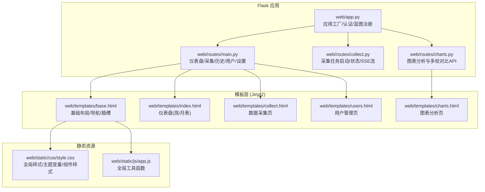
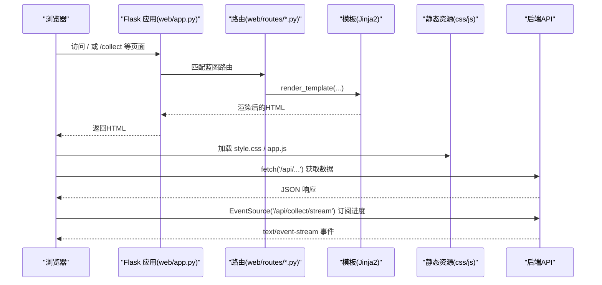
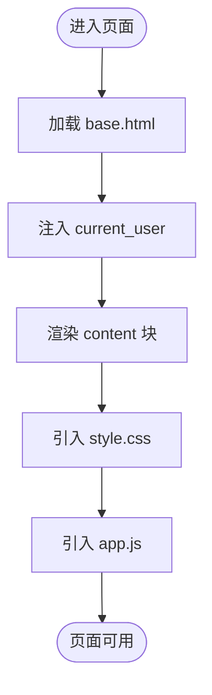
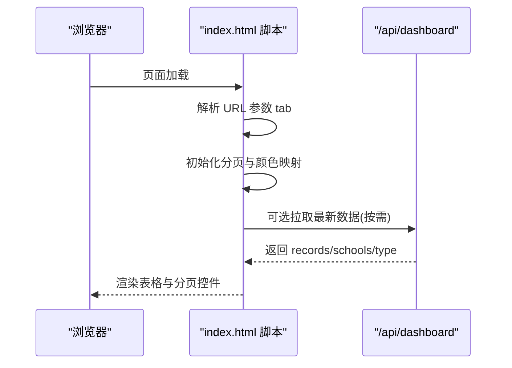
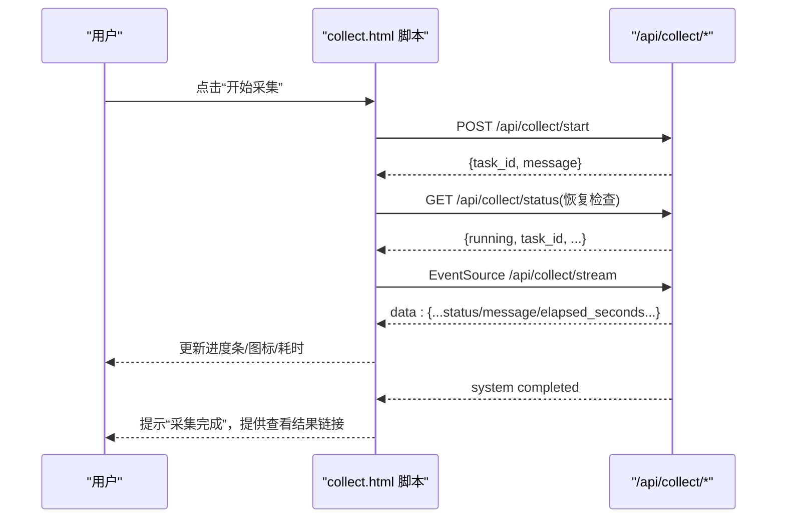
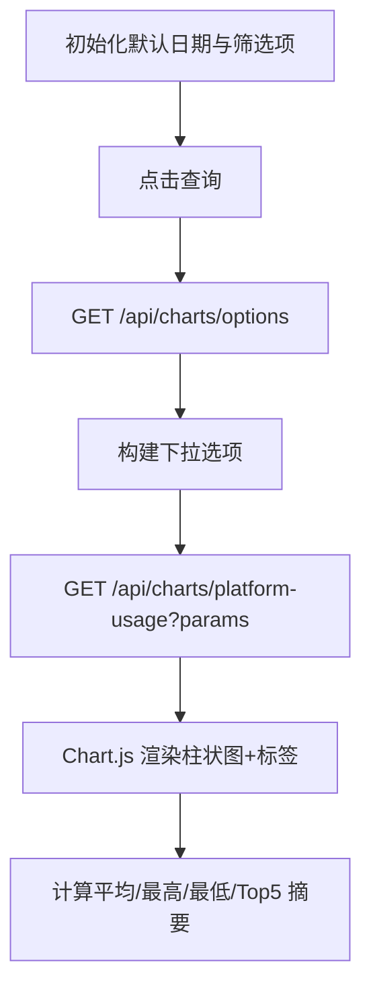
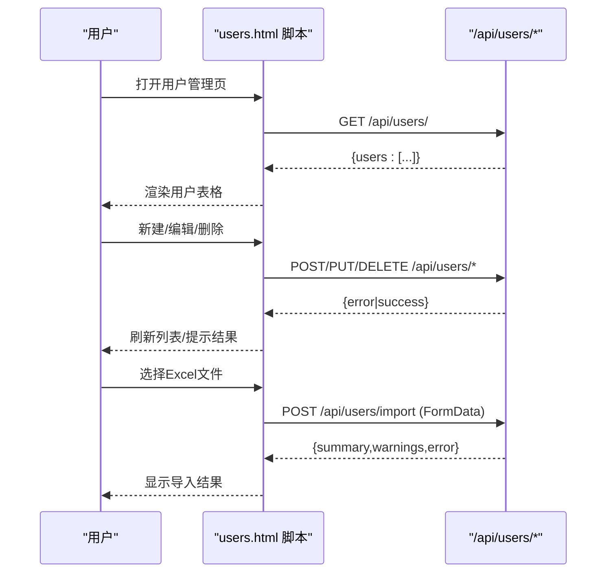
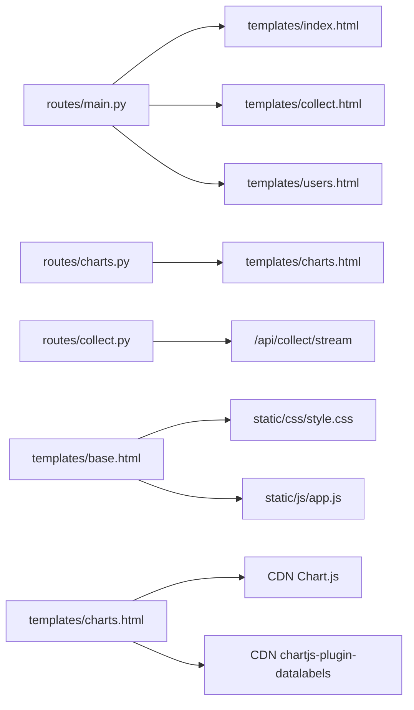

# 前端界面

<cite>
**本文引用的文件**   
- [web/app.py](file://web/app.py)
- [web/templates/base.html](file://web/templates/base.html)
- [web/static/css/style.css](file://web/static/css/style.css)
- [web/static/js/app.js](file://web/static/js/app.js)
- [web/templates/index.html](file://web/templates/index.html)
- [web/templates/collect.html](file://web/templates/collect.html)
- [web/templates/charts.html](file://web/templates/charts.html)
- [web/templates/users.html](file://web/templates/users.html)
- [web/routes/main.py](file://web/routes/main.py)
- [web/routes/collect.py](file://web/routes/collect.py)
- [web/routes/charts.py](file://web/routes/charts.py)
</cite>

## 目录
1. [简介](#简介)
2. [项目结构](#项目结构)
3. [核心组件](#核心组件)
4. [架构总览](#架构总览)
5. [详细组件分析](#详细组件分析)
6. [依赖关系分析](#依赖关系分析)
7. [性能与可维护性](#性能与可维护性)
8. [故障排查指南](#故障排查指南)
9. [结论](#结论)

## 简介
本技术文档聚焦于前端界面系统，涵盖以下方面：
- HTML 模板结构与 Jinja2 模板引擎使用（继承、块、上下文注入）
- CSS 样式组织、响应式设计与主题定制方法
- JavaScript 交互逻辑、表单验证、异步请求处理与错误提示体验
- 静态资源管理、CDN 使用与浏览器兼容性策略
- 前端性能优化、代码重构与可维护性提升的最佳实践

## 项目结构
前端相关资源位于 web 目录下，采用“页面模板 + 全局样式 + 全局脚本”的轻量组织方式，配合 Flask 蓝图路由提供页面渲染与数据接口。

**图示来源**
- [web/app.py:306-336](file://web/app.py#L306-L336)
- [web/routes/main.py:41-143](file://web/routes/main.py#L41-L143)
- [web/routes/collect.py:22-170](file://web/routes/collect.py#L22-L170)
- [web/routes/charts.py:63-120](file://web/routes/charts.py#L63-L120)
- [web/templates/base.html:1-44](file://web/templates/base.html#L1-L44)
- [web/static/css/style.css:1-120](file://web/static/css/style.css#L1-L120)
- [web/static/js/app.js:1-23](file://web/static/js/app.js#L1-L23)

**章节来源**
- [web/app.py:306-336](file://web/app.py#L306-L336)
- [web/routes/main.py:41-143](file://web/routes/main.py#L41-L143)
- [web/templates/base.html:1-44](file://web/templates/base.html#L1-L44)
- [web/static/css/style.css:1-120](file://web/static/css/style.css#L1-L120)
- [web/static/js/app.js:1-23](file://web/static/js/app.js#L1-L23)

## 核心组件
- 应用入口与认证中间件：负责模板与静态资源路径配置、登录态校验、上下文注入。
- 模板基座 base.html：定义全局导航、内容插槽、全局样式与脚本引入。
- 页面模板：index.html（仪表盘）、collect.html（数据采集）、charts.html（图表分析）、users.html（用户管理）。
- 全局样式 style.css：基于 CSS 变量的主题系统、毛玻璃风格、表格/卡片/按钮等通用组件样式。
- 全局脚本 app.js：日期格式化与 Toast 提示等通用工具。

**章节来源**
- [web/app.py:253-304](file://web/app.py#L253-L304)
- [web/templates/base.html:1-44](file://web/templates/base.html#L1-L44)
- [web/static/css/style.css:1-120](file://web/static/css/style.css#L1-L120)
- [web/static/js/app.js:1-23](file://web/static/js/app.js#L1-L23)

## 架构总览
前端通过 Flask 渲染 Jinja2 模板，页面内嵌少量业务脚本；复杂交互通过 fetch 调用后端 API，部分实时进度通过 SSE 推送。

**图示来源**
- [web/app.py:306-336](file://web/app.py#L306-L336)
- [web/routes/main.py:41-143](file://web/routes/main.py#L41-L143)
- [web/routes/collect.py:137-170](file://web/routes/collect.py#L137-L170)
- [web/templates/base.html:7-8](file://web/templates/base.html#L7-L8)
- [web/templates/base.html:41-42](file://web/templates/base.html#L41-L42)

## 详细组件分析

### 模板系统与 Jinja2 使用
- 模板继承与插槽
  - base.html 定义 title/head/content/scripts 四个插槽，子模板通过 extends 继承并填充对应块。
  - 导航栏根据当前路径动态高亮，并根据 current_user 显示管理员菜单与退出链接。
- 上下文注入
  - 通过 context_processor 将 current_user 注入所有模板，便于在模板中判断权限与展示用户名。
- 登录模板
  - 登录页以字符串模板直接渲染，包含最小化表单与内联脚本，提交后跳转 next 参数指定页面。

**图示来源**
- [web/app.py:294-304](file://web/app.py#L294-L304)
- [web/templates/base.html:1-44](file://web/templates/base.html#L1-L44)

**章节来源**
- [web/app.py:253-304](file://web/app.py#L253-L304)
- [web/templates/base.html:1-44](file://web/templates/base.html#L1-L44)
- [web/app.py:265-293](file://web/app.py#L265-L293)

### 仪表盘页面（index.html）
- 功能要点
  - 周表/月表双 Tab 切换，URL 参数支持 tab=monthly 直达。
  - 学校维度统计卡片，按预设色板着色。
  - 表格分页（前端分页），周次/月次标签颜色映射。
- 交互逻辑
  - DOMContentLoaded 初始化分页与颜色映射。
  - switchDashTab 控制 Tab 显隐。
  - initPagination/renderPage/goPage 实现本地分页。

**图示来源**
- [web/templates/index.html:203-292](file://web/templates/index.html#L203-L292)
- [web/routes/main.py:87-106](file://web/routes/main.py#L87-L106)

**章节来源**
- [web/templates/index.html:1-292](file://web/templates/index.html#L1-L292)
- [web/routes/main.py:41-106](file://web/routes/main.py#L41-L106)

### 数据采集页面（collect.html）
- 功能要点
  - 周表/月表模式切换，自动填充日期范围。
  - 数据源切换（Grafana/数据库直查）。
  - 学校多选与弹窗管理（新增/编辑/删除）。
  - 采集任务启动、暂停/继续、SSE 实时进度、完成提示。
- 关键流程
  - startCollect 组装 payload，POST /api/collect/start，成功后连接 /api/collect/stream。
  - listenProgress 处理 SSE 事件，更新进度面板，完成后关闭连接并提示查看结果。
  - restorePageState 恢复上次会话中的运行任务与进度。

**图示来源**
- [web/templates/collect.html:385-547](file://web/templates/collect.html#L385-L547)
- [web/routes/collect.py:22-170](file://web/routes/collect.py#L22-L170)

**章节来源**
- [web/templates/collect.html:1-776](file://web/templates/collect.html#L1-L776)
- [web/routes/collect.py:22-170](file://web/routes/collect.py#L22-L170)

### 图表分析页面（charts.html）
- 功能要点
  - 筛选器：时间范围、学校、学段、年级、学科，联动下拉框。
  - 图表库：Chart.js + datalabels，通过 CDN 引入。
  - 查询接口：/api/charts/options 与 /api/charts/platform-usage。
- 交互逻辑
  - initDefaults 设置默认本月起止日期。
  - fillSelect/resetSelect/onSchoolChange/onStageChange 构建筛选选项与级联。
  - queryChart 发起查询，renderChart 绘制柱状图与摘要信息。

**图示来源**
- [web/templates/charts.html:150-395](file://web/templates/charts.html#L150-L395)
- [web/routes/charts.py:70-120](file://web/routes/charts.py#L70-L120)
- [web/routes/charts.py:323-347](file://web/routes/charts.py#L323-L347)

**章节来源**
- [web/templates/charts.html:1-400](file://web/templates/charts.html#L1-L400)
- [web/routes/charts.py:63-120](file://web/routes/charts.py#L63-L120)
- [web/routes/charts.py:323-347](file://web/routes/charts.py#L323-L347)

### 用户管理页面（users.html）
- 功能要点
  - 用户列表加载、新建/编辑/删除用户。
  - 批量导入 Excel（.xlsx），拖拽上传与结果反馈。
  - 密码字段可见性切换。
- 交互逻辑
  - loadUsers 拉取用户列表并渲染。
  - saveUser/deleteUser 调用 /api/users/* 接口。
  - doImport 使用 FormData 上传文件，解析后端返回的 summary/warnings。

**图示来源**
- [web/templates/users.html:154-400](file://web/templates/users.html#L154-L400)

**章节来源**
- [web/templates/users.html:1-400](file://web/templates/users.html#L1-L400)

## 依赖关系分析
- 模板与路由
  - main.py 渲染 index/collect/history/users/settings 模板，charts.py 渲染 charts 模板。
  - collect.py 提供采集任务相关 API（start/status/pause/resume/stream）。
- 静态资源
  - base.html 通过 url_for('static', ...) 引入 style.css 与 app.js。
- 外部依赖
  - charts.html 通过 CDN 引入 Chart.js 与 datalabels 插件。

**图示来源**
- [web/routes/main.py:41-143](file://web/routes/main.py#L41-L143)
- [web/routes/charts.py:63-120](file://web/routes/charts.py#L63-L120)
- [web/routes/collect.py:137-170](file://web/routes/collect.py#L137-L170)
- [web/templates/base.html:7-8](file://web/templates/base.html#L7-L8)
- [web/templates/base.html:41-42](file://web/templates/base.html#L41-L42)
- [web/templates/charts.html:4-6](file://web/templates/charts.html#L4-L6)

**章节来源**
- [web/routes/main.py:41-143](file://web/routes/main.py#L41-L143)
- [web/routes/charts.py:63-120](file://web/routes/charts.py#L63-L120)
- [web/routes/collect.py:137-170](file://web/routes/collect.py#L137-L170)
- [web/templates/base.html:7-8](file://web/templates/base.html#L7-L8)
- [web/templates/base.html:41-42](file://web/templates/base.html#L41-L42)
- [web/templates/charts.html:4-6](file://web/templates/charts.html#L4-L6)

## 性能与可维护性

### 样式组织与主题定制
- 使用 :root 变量集中管理色彩、阴影、圆角、过渡等，便于统一主题与快速定制。
- 毛玻璃效果（backdrop-filter）用于导航、卡片、模态框，增强视觉层次。
- 建议
  - 将常用组件样式拆分为独立模块文件，按功能域组织。
  - 对大型页面使用 CSS 作用域或命名空间避免冲突。

**章节来源**
- [web/static/css/style.css:1-120](file://web/static/css/style.css#L1-L120)

### 响应式设计
- 使用 viewport meta 与相对单位，结合网格布局与弹性布局适配不同屏幕。
- 表格横向滚动容器与固定表头提升大数据量可读性。
- 建议
  - 针对移动端优化导航折叠与操作区域尺寸。
  - 减少大背景图与复杂渐变，降低重绘开销。

**章节来源**
- [web/static/css/style.css:44-170](file://web/static/css/style.css#L44-L170)

### 静态资源管理与 CDN
- 通过 url_for('static', ...) 引入本地资源，确保缓存与版本可控。
- 图表库通过 CDN 引入，注意添加 integrity 与 fallback 策略。
- 建议
  - 为静态资源启用强缓存与版本号（如 ?v=xxx）。
  - 对关键第三方库增加本地回退与预加载。

**章节来源**
- [web/templates/base.html:7-8](file://web/templates/base.html#L7-L8)
- [web/templates/base.html:41-42](file://web/templates/base.html#L41-L42)
- [web/templates/charts.html:4-6](file://web/templates/charts.html#L4-L6)

### 浏览器兼容性
- 使用现代特性（backdrop-filter、appearance:none、:has()）时，需考虑兼容性与降级方案。
- 建议
  - 对不支持的特性提供回退样式与行为。
  - 在目标浏览器矩阵下测试关键交互（SSE、fetch、EventSource）。

**章节来源**
- [web/static/css/style.css:68-120](file://web/static/css/style.css#L68-L120)

### 交互与用户体验
- 表单验证：前端必填校验与格式校验，失败即时提示。
- 异步请求：统一错误处理与网络异常提示，按钮禁用防重复提交。
- 进度反馈：SSE 实时更新采集进度，完成提示与快捷跳转。
- 建议
  - 抽象统一的请求封装与错误提示组件（Toast）。
  - 对长耗时操作提供取消与重试机制。

**章节来源**
- [web/static/js/app.js:10-22](file://web/static/js/app.js#L10-L22)
- [web/templates/collect.html:385-547](file://web/templates/collect.html#L385-L547)

### 代码重构与可维护性
- 将页面内联脚本逐步迁移至独立模块，按功能划分（采集、图表、用户管理）。
- 抽取通用 UI 组件（模态框、分页、筛选器）为可复用片段。
- 建立前端单元测试与 E2E 用例，覆盖关键交互路径。

[本节为通用建议，不直接分析具体文件]

## 故障排查指南
- 登录问题
  - 未登录访问受保护页面会被重定向到 /login?next=...；API 请求返回 401。
  - 检查 session 是否包含 user_id/is_admin，确认 before_request 拦截逻辑。
- 采集任务
  - 若已有任务运行，再次启动会返回冲突错误；可通过 status 接口检查 running/task_id。
  - SSE 断线后自动尝试恢复，若长时间无心跳，前端会主动轮询状态并清理旧进度。
- 图表查询
  - 时间范围为必填项；缺少必要参数会返回错误。
  - 若 Metabase DB 不存在或连接失败，后端返回 500 错误信息。

**章节来源**
- [web/app.py:256-264](file://web/app.py#L256-L264)
- [web/routes/collect.py:64-102](file://web/routes/collect.py#L64-L102)
- [web/routes/collect.py:104-113](file://web/routes/collect.py#L104-L113)
- [web/routes/charts.py:323-347](file://web/routes/charts.py#L323-L347)

## 结论
该前端界面系统采用简洁的模板继承与全局样式/脚本组织方式，配合 Flask 蓝图提供清晰的页面与 API 边界。通过 CSS 变量实现主题定制，利用 SSE 实现采集进度实时反馈，整体具备良好的可维护性与扩展性。后续可在组件化、模块化与兼容性方面持续优化，以提升性能与用户体验。