# 样式设计

<cite>
**本文引用的文件**
- [web/static/css/style.css](file://middle-platform-data-collector-master/web/static/css/style.css)
- [web/templates/base.html](file://middle-platform-data-collector-master/web/templates/base.html)
</cite>

## 目录
1. [简介](#简介)
2. [项目结构](#项目结构)
3. [核心组件](#核心组件)
4. [架构总览](#架构总览)
5. [详细组件分析](#详细组件分析)
6. [依赖关系分析](#依赖关系分析)
7. [性能考量](#性能考量)
8. [故障排查指南](#故障排查指南)
9. [结论](#结论)
10. [附录](#附录)

## 简介
本设计文档面向前端样式系统，围绕 CSS 架构组织、样式模块划分原则与响应式策略展开，并详细说明导航栏视觉设计、按钮与表单规范、卡片布局与网格系统、颜色方案与字体排版、间距与对齐统一原则。同时覆盖媒体查询使用、移动端适配细节、浏览器兼容性处理、CSS 变量使用、预处理器集成建议以及样式性能优化最佳实践。

## 项目结构
样式系统采用单文件集中式管理，所有样式集中在一个主样式表中，模板通过静态资源路径引入。整体结构清晰、易于维护，适合中小型项目的快速迭代。

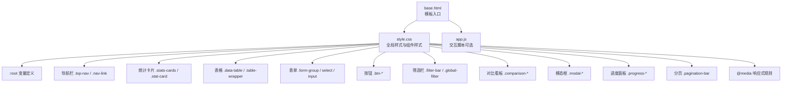

图表来源
- [web/templates/base.html:1-44](file://middle-platform-data-collector-master/web/templates/base.html#L1-L44)
- [web/static/css/style.css:1-1133](file://middle-platform-data-collector-master/web/static/css/style.css#L1-L1133)

章节来源
- [web/templates/base.html:1-44](file://middle-platform-data-collector-master/web/templates/base.html#L1-L44)
- [web/static/css/style.css:1-1133](file://middle-platform-data-collector-master/web/static/css/style.css#L1-L1133)

## 核心组件
- 设计令牌（Design Tokens）：通过 :root 变量统一管理导航高度、主色、语义色、文字层级、表面与边框、阴影、圆角、过渡等，确保全站点一致性与可配置性。
- 导航栏：固定顶部、毛玻璃背景、品牌区、链接区、版本标签、用户信息区；支持悬停与激活态动效。
- 页面主体：包含页头、统计卡片、分区区块、数据表格、筛选栏、分页、模态框、进度面板、Toast 提示等。
- 多校对比看板：横向滚动表格、首列固定、热力色阶、结果统计栏、加载覆盖层、面板头部与内容区。
- 表单与控件：输入框、选择器、密码可见切换、开关控件、复选组、操作按钮组、消息框等。
- 状态与徽章：成功/警告/失败/信息态的徽章与单元格高亮。
- 响应式：针对小屏设备对筛选栏进行堆叠布局调整。

章节来源
- [web/static/css/style.css:5-42](file://middle-platform-data-collector-master/web/static/css/style.css#L5-L42)
- [web/static/css/style.css:68-164](file://middle-platform-data-collector-master/web/static/css/style.css#L68-L164)
- [web/static/css/style.css:194-226](file://middle-platform-data-collector-master/web/static/css/style.css#L194-L226)
- [web/static/css/style.css:236-314](file://middle-platform-data-collector-master/web/static/css/style.css#L236-L314)
- [web/static/css/style.css:332-354](file://middle-platform-data-collector-master/web/static/css/style.css#L332-L354)
- [web/static/css/style.css:367-423](file://middle-platform-data-collector-master/web/static/css/style.css#L367-L423)
- [web/static/css/style.css:427-434](file://middle-platform-data-collector-master/web/static/css/style.css#L427-L434)
- [web/static/css/style.css:464-469](file://middle-platform-data-collector-master/web/static/css/style.css#L464-L469)
- [web/static/css/style.css:964-1133](file://middle-platform-data-collector-master/web/static/css/style.css#L964-L1133)

## 架构总览
样式系统以“设计令牌 + 组件化类名”的方式组织，遵循原子到复合的层次：
- 基础层：CSS 变量、重置、全局排版与滚动条定制。
- 布局层：导航、主体容器、网格与栅格（auto-fill/minmax）。
- 组件层：卡片、表格、表单、按钮、筛选栏、模态框、进度、分页、Toast。
- 业务层：多校对比看板、学校管理增强、凭证区块、密码可见切换等。
- 响应式层：媒体查询与移动端适配。

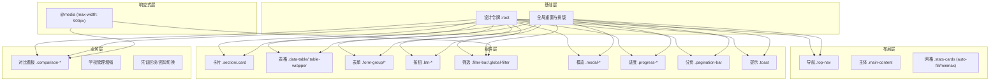

图表来源
- [web/static/css/style.css:5-42](file://middle-platform-data-collector-master/web/static/css/style.css#L5-L42)
- [web/static/css/style.css:68-164](file://middle-platform-data-collector-master/web/static/css/style.css#L68-L164)
- [web/static/css/style.css:194-226](file://middle-platform-data-collector-master/web/static/css/style.css#L194-L226)
- [web/static/css/style.css:236-314](file://middle-platform-data-collector-master/web/static/css/style.css#L236-L314)
- [web/static/css/style.css:332-354](file://middle-platform-data-collector-master/web/static/css/style.css#L332-L354)
- [web/static/css/style.css:367-423](file://middle-platform-data-collector-master/web/static/css/style.css#L367-L423)
- [web/static/css/style.css:427-434](file://middle-platform-data-collector-master/web/static/css/style.css#L427-L434)
- [web/static/css/style.css:464-469](file://middle-platform-data-collector-master/web/static/css/style.css#L464-L469)
- [web/static/css/style.css:964-1133](file://middle-platform-data-collector-master/web/static/css/style.css#L964-L1133)

## 详细组件分析

### 导航栏视觉设计
- 结构与定位：固定顶部，使用 backdrop-filter 实现毛玻璃效果，底部边框与阴影随交互变化。
- 品牌区：图标渐变背景、悬停缩放与阴影增强；文本标题使用较粗字重与紧凑字距。
- 链接区：胶囊形按钮风格，悬停轻微上移与背景高亮，激活态带下划线渐变指示条。
- 用户区：用户名、管理员徽章、退出链接，颜色与尺寸遵循全局文字层级。
- 动画与过渡：统一的 ease 曲线与时长，保证流畅一致的微交互。

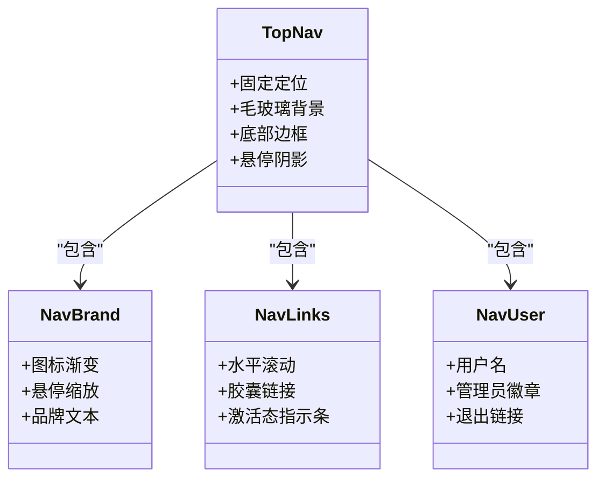

图表来源
- [web/static/css/style.css:68-164](file://middle-platform-data-collector-master/web/static/css/style.css#L68-L164)

章节来源
- [web/static/css/style.css:68-164](file://middle-platform-data-collector-master/web/static/css/style.css#L68-L164)

### 按钮与表单元素样式规范
- 按钮族：主按钮、次要按钮、成功/危险/警告变体、块级按钮、小型按钮、图标按钮、关闭按钮；统一圆角、阴影与过渡。
- 表单控件：输入框、选择器、日期选择器、密码输入框；聚焦态使用主色描边与柔光阴影；选择器自定义下拉箭头。
- 复选与开关：复选组卡片化，选中态高亮；开关控件使用滑动圆点动画。
- 辅助元素：必填标记、提示文本、操作按钮组、消息框（成功/错误）、密码可见切换按钮。

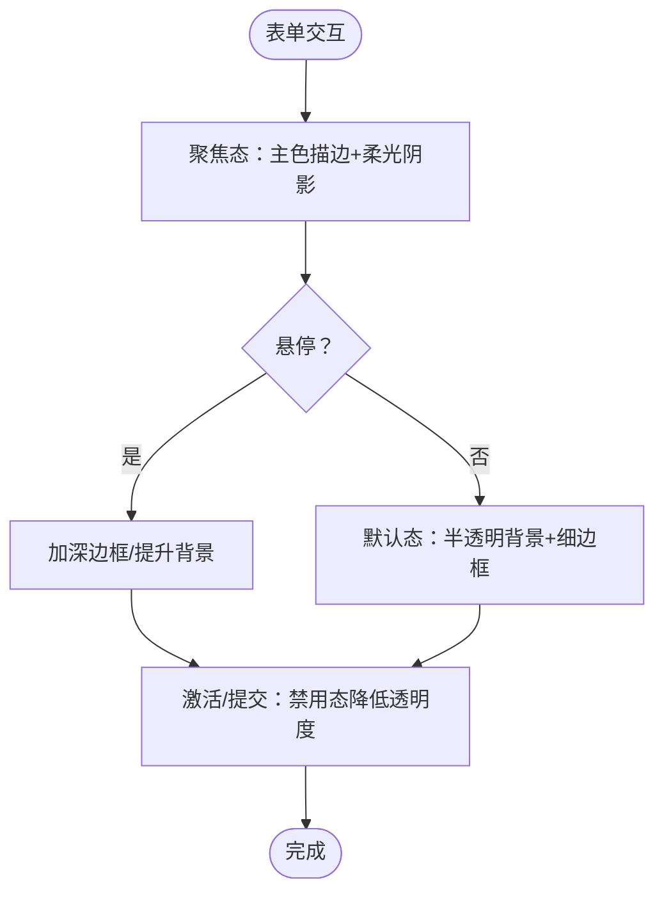

图表来源
- [web/static/css/style.css:332-354](file://middle-platform-data-collector-master/web/static/css/style.css#L332-L354)
- [web/static/css/style.css:367-423](file://middle-platform-data-collector-master/web/static/css/style.css#L367-L423)
- [web/static/css/style.css:706-726](file://middle-platform-data-collector-master/web/static/css/style.css#L706-L726)
- [web/static/css/style.css:761-804](file://middle-platform-data-collector-master/web/static/css/style.css#L761-L804)
- [web/static/css/style.css:860-903](file://middle-platform-data-collector-master/web/static/css/style.css#L860-L903)
- [web/static/css/style.css:931-962](file://middle-platform-data-collector-master/web/static/css/style.css#L931-L962)

章节来源
- [web/static/css/style.css:332-354](file://middle-platform-data-collector-master/web/static/css/style.css#L332-L354)
- [web/static/css/style.css:367-423](file://middle-platform-data-collector-master/web/static/css/style.css#L367-L423)
- [web/static/css/style.css:706-726](file://middle-platform-data-collector-master/web/static/css/style.css#L706-L726)
- [web/static/css/style.css:761-804](file://middle-platform-data-collector-master/web/static/css/style.css#L761-L804)
- [web/static/css/style.css:860-903](file://middle-platform-data-collector-master/web/static/css/style.css#L860-L903)
- [web/static/css/style.css:931-962](file://middle-platform-data-collector-master/web/static/css/style.css#L931-L962)

### 卡片布局与网格系统
- 统计卡片：使用 grid auto-fill 与 minmax 实现自适应列数，卡片具备毛玻璃背景、左侧主题色条与悬停浮起效果。
- 通用卡片：统一的 surface 背景、边框、圆角与阴影，便于在不同区域复用。
- 分区区块：section 容器用于分组展示，配合页头与内边距形成清晰的视觉层次。

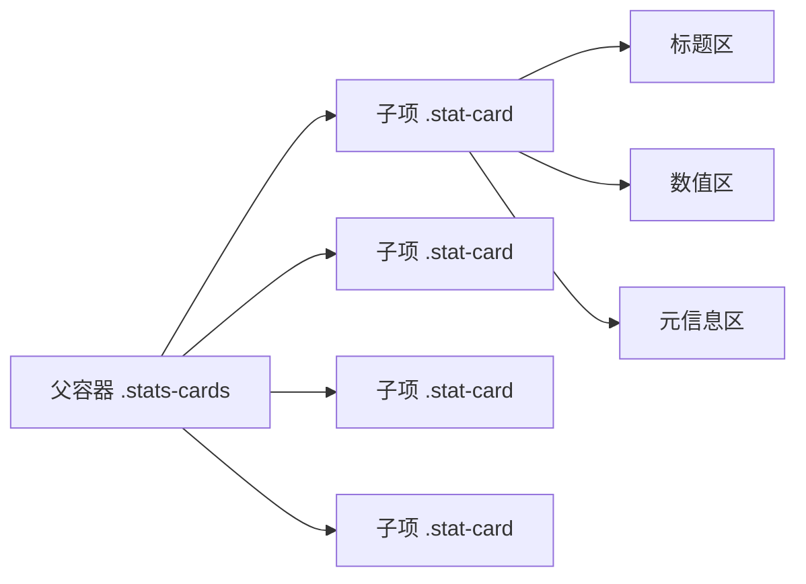

图表来源
- [web/static/css/style.css:194-226](file://middle-platform-data-collector-master/web/static/css/style.css#L194-L226)
- [web/static/css/style.css:228-235](file://middle-platform-data-collector-master/web/static/css/style.css#L228-L235)
- [web/static/css/style.css:679-689](file://middle-platform-data-collector-master/web/static/css/style.css#L679-L689)

章节来源
- [web/static/css/style.css:194-226](file://middle-platform-data-collector-master/web/static/css/style.css#L194-L226)
- [web/static/css/style.css:228-235](file://middle-platform-data-collector-master/web/static/css/style.css#L228-L235)
- [web/static/css/style.css:679-689](file://middle-platform-data-collector-master/web/static/css/style.css#L679-L689)

### 表格系统与数据展示
- 表头：sticky 置顶、渐变底线、毛玻璃背景，确保长列表滚动时表头可见。
- 表体：斑马纹、行悬停高亮与轻微位移，数字列右对齐或居中，学校名列左侧彩色指示条与换行控制。
- 月度/周度差异：月度紧凑模式减小字号与内边距，周度表格居中对齐；首列与时间列允许换行。
- 对比看板：横向滚动容器、首列 sticky 固定、斑马纹与悬停高亮、使用率热力色阶（高/中/低/零/未知）。

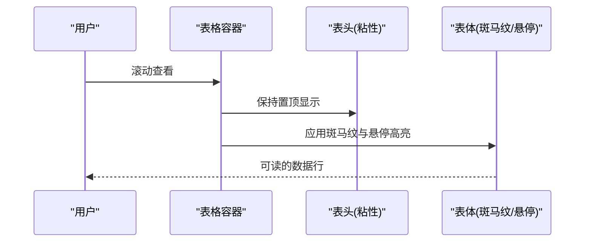

图表来源
- [web/static/css/style.css:236-314](file://middle-platform-data-collector-master/web/static/css/style.css#L236-L314)
- [web/static/css/style.css:546-624](file://middle-platform-data-collector-master/web/static/css/style.css#L546-L624)
- [web/static/css/style.css:1019-1073](file://middle-platform-data-collector-master/web/static/css/style.css#L1019-L1073)

章节来源
- [web/static/css/style.css:236-314](file://middle-platform-data-collector-master/web/static/css/style.css#L236-L314)
- [web/static/css/style.css:546-624](file://middle-platform-data-collector-master/web/static/css/style.css#L546-L624)
- [web/static/css/style.css:1019-1073](file://middle-platform-data-collector-master/web/static/css/style.css#L1019-L1073)

### 筛选栏与全局过滤
- 筛选栏：卡片化容器、flex 布局、各字段 label 与输入/选择器统一样式，聚焦态主色描边与柔光阴影。
- 全局过滤：对比看板专用，字段最小宽度限制，查询按钮固定高度与禁用态处理。
- 响应式：在小屏幕下垂直堆叠字段，提升可用性。

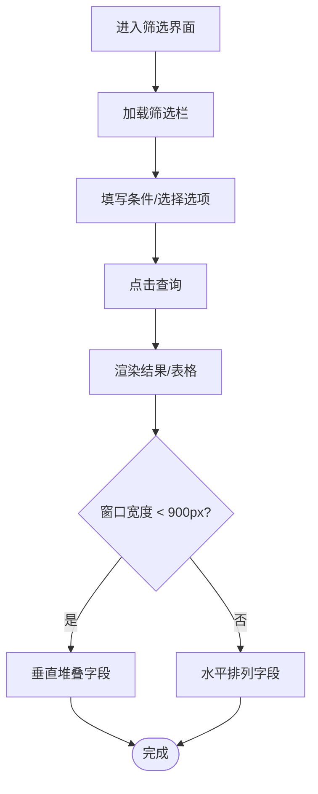

图表来源
- [web/static/css/style.css:414-423](file://middle-platform-data-collector-master/web/static/css/style.css#L414-L423)
- [web/static/css/style.css:968-1010](file://middle-platform-data-collector-master/web/static/css/style.css#L968-L1010)
- [web/static/css/style.css:1128-1133](file://middle-platform-data-collector-master/web/static/css/style.css#L1128-L1133)

章节来源
- [web/static/css/style.css:414-423](file://middle-platform-data-collector-master/web/static/css/style.css#L414-L423)
- [web/static/css/style.css:968-1010](file://middle-platform-data-collector-master/web/static/css/style.css#L968-L1010)
- [web/static/css/style.css:1128-1133](file://middle-platform-data-collector-master/web/static/css/style.css#L1128-L1133)

### 模态框与弹窗
- 遮罩与卡片：全屏遮罩、毛玻璃背景、卡片圆角与阴影、滑入动画。
- 头部与底部：标题与关闭按钮、底部操作按钮组对齐与最小宽度。
- 内容区：可滚动区域，适配不同内容长度。

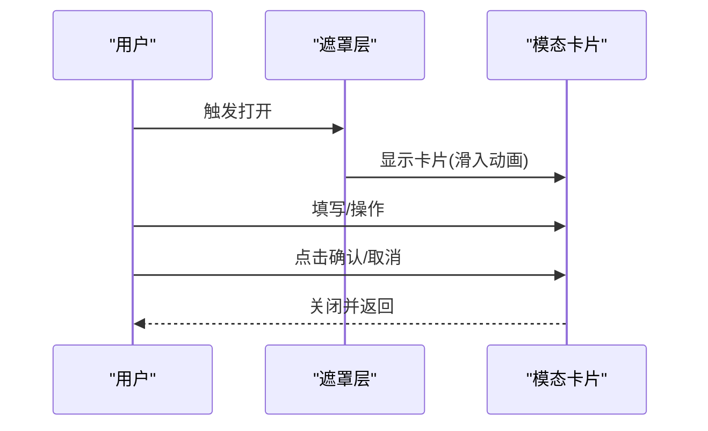

图表来源
- [web/static/css/style.css:427-434](file://middle-platform-data-collector-master/web/static/css/style.css#L427-L434)
- [web/static/css/style.css:691-704](file://middle-platform-data-collector-master/web/static/css/style.css#L691-L704)

章节来源
- [web/static/css/style.css:427-434](file://middle-platform-data-collector-master/web/static/css/style.css#L427-L434)
- [web/static/css/style.css:691-704](file://middle-platform-data-collector-master/web/static/css/style.css#L691-L704)

### 进度面板与状态反馈
- 进度项：运行/完成/失败/待处理状态，左侧色条与背景区分，完成态汇总提示。
- 暂停/恢复：按钮样式与禁用态处理。
- Toast 提示：右上角滑入通知，成功/错误/信息态配色与边框。

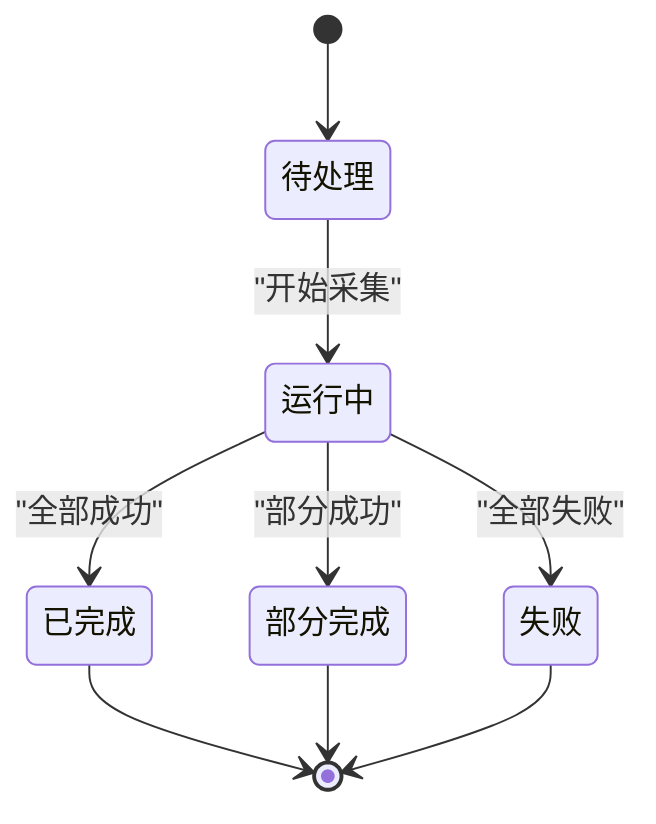

图表来源
- [web/static/css/style.css:394-412](file://middle-platform-data-collector-master/web/static/css/style.css#L394-L412)
- [web/static/css/style.css:464-469](file://middle-platform-data-collector-master/web/static/css/style.css#L464-L469)

章节来源
- [web/static/css/style.css:394-412](file://middle-platform-data-collector-master/web/static/css/style.css#L394-L412)
- [web/static/css/style.css:464-469](file://middle-platform-data-collector-master/web/static/css/style.css#L464-L469)

### 颜色方案与字体排版
- 颜色体系：主色与悬停态、成功/警告/危险/信息语义色及其浅色背景与边框；文字四级层级；表面与边框透明度；阴影层级；圆角等级。
- 字体排版：Inter 优先，回退至系统字体栈；中文友好字体链；行高与字距微调；数字列使用 tabular-nums 对齐。
- 背景与滚动条：渐变背景、固定背景附着；滚动条细窄且圆角，选中高亮使用主色浅透。

章节来源
- [web/static/css/style.css:5-42](file://middle-platform-data-collector-master/web/static/css/style.css#L5-L42)
- [web/static/css/style.css:47-66](file://middle-platform-data-collector-master/web/static/css/style.css#L47-L66)
- [web/static/css/style.css:272-277](file://middle-platform-data-collector-master/web/static/css/style.css#L272-L277)

### 间距与对齐的统一原则
- 间距：组件内边距与外边距遵循统一尺度，卡片与分区区块保持一致的 padding 与 margin。
- 对齐：表格数字列右对齐或居中，学校名列左对齐；筛选栏与按钮组使用 flex 对齐与 gap 控制。
- 文本：标题使用较大字号与更紧密字距，正文使用较小字号与宽松行高，确保可读性。

章节来源
- [web/static/css/style.css:166-177](file://middle-platform-data-collector-master/web/static/css/style.css#L166-L177)
- [web/static/css/style.css:236-314](file://middle-platform-data-collector-master/web/static/css/style.css#L236-L314)
- [web/static/css/style.css:414-423](file://middle-platform-data-collector-master/web/static/css/style.css#L414-L423)

### 响应式设计与移动端适配
- 媒体查询：在 900px 断点下将全局筛选栏改为纵向堆叠，字段最大宽度设为 100%。
- 表格横向滚动：对比看板表格设置最小宽度，外层容器启用横向滚动，首列 sticky 固定。
- 导航链接：水平溢出隐藏并自定义滚动条，避免在小屏破坏布局。

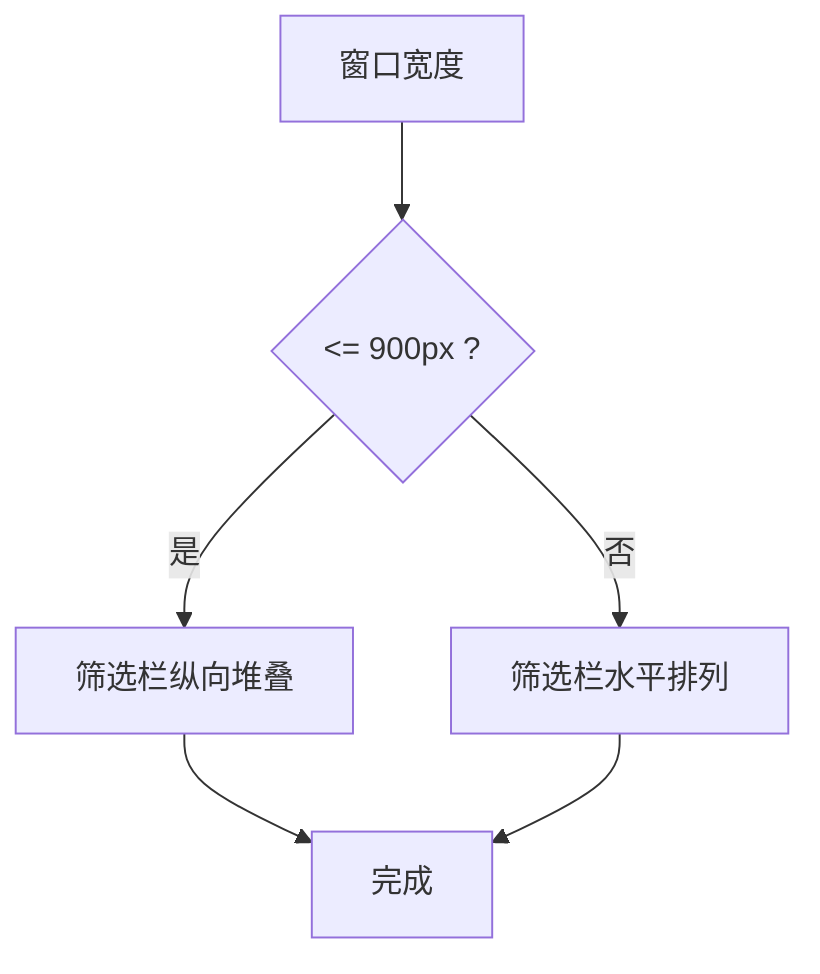

图表来源
- [web/static/css/style.css:1128-1133](file://middle-platform-data-collector-master/web/static/css/style.css#L1128-L1133)
- [web/static/css/style.css:1013-1017](file://middle-platform-data-collector-master/web/static/css/style.css#L1013-L1017)
- [web/static/css/style.css:96-106](file://middle-platform-data-collector-master/web/static/css/style.css#L96-L106)

章节来源
- [web/static/css/style.css:1128-1133](file://middle-platform-data-collector-master/web/static/css/style.css#L1128-L1133)
- [web/static/css/style.css:1013-1017](file://middle-platform-data-collector-master/web/static/css/style.css#L1013-L1017)
- [web/static/css/style.css:96-106](file://middle-platform-data-collector-master/web/static/css/style.css#L96-L106)

### 浏览器兼容性与降级策略
- 毛玻璃效果：使用 backdrop-filter 与 -webkit-backdrop-filter 双写，提供 WebKit 前缀兼容。
- 滚动条样式：仅对 WebKit 生效，其他浏览器保留默认滚动条。
- 选择器与特性：使用现代 CSS 特性（如 has 伪类），在不支持的浏览器中退化为基本样式。
- 平滑滚动：html scroll-behavior 为 smooth，旧浏览器忽略该属性不影响功能。

章节来源
- [web/static/css/style.css:72-73](file://middle-platform-data-collector-master/web/static/css/style.css#L72-L73)
- [web/static/css/style.css:62-66](file://middle-platform-data-collector-master/web/static/css/style.css#L62-L66)
- [web/static/css/style.css:45](file://middle-platform-data-collector-master/web/static/css/style.css#L45)

### CSS 变量与预处理器的集成建议
- CSS 变量：当前已广泛使用 :root 变量，涵盖颜色、阴影、圆角、过渡等，便于主题切换与一致性维护。
- 预处理器建议：若未来需要嵌套、函数与混入，可考虑 Sass/SCSS 或 Less；构建流程可使用 PostCSS 自动添加前缀与压缩。
- 命名约定：组件类名采用 BEM 或类似约定，避免冲突与提高可读性。

章节来源
- [web/static/css/style.css:5-42](file://middle-platform-data-collector-master/web/static/css/style.css#L5-L42)

### 样式性能优化最佳实践
- 减少重绘重排：避免频繁改变布局属性，尽量使用 transform 与 opacity 做动画。
- 合理使用 backdrop-filter：仅在必要区域使用，避免大面积使用导致性能下降。
- 表格优化：sticky 表头与首列固定可减少滚动时的计算量；斑马纹与悬停高亮使用轻量背景色。
- 资源加载：样式文件由模板统一引入，确保缓存命中；按需加载额外样式（如页面特定样式）。

章节来源
- [web/static/css/style.css:72-73](file://middle-platform-data-collector-master/web/static/css/style.css#L72-L73)
- [web/static/css/style.css:244-254](file://middle-platform-data-collector-master/web/static/css/style.css#L244-L254)
- [web/static/css/style.css:1024-1032](file://middle-platform-data-collector-master/web/static/css/style.css#L1024-L1032)
- [web/templates/base.html:7](file://middle-platform-data-collector-master/web/templates/base.html#L7)

## 依赖关系分析
- 模板依赖样式：base.html 通过静态资源路径引入 style.css，确保所有页面共享同一套样式。
- 样式内部依赖：组件样式普遍依赖 :root 变量，形成松耦合、高内聚的结构。
- 无循环依赖：样式文件独立，不相互引用，避免循环依赖风险。

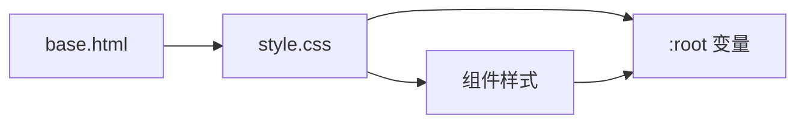

图表来源
- [web/templates/base.html:7](file://middle-platform-data-collector-master/web/templates/base.html#L7)
- [web/static/css/style.css:5-42](file://middle-platform-data-collector-master/web/static/css/style.css#L5-L42)

章节来源
- [web/templates/base.html:7](file://middle-platform-data-collector-master/web/templates/base.html#L7)
- [web/static/css/style.css:5-42](file://middle-platform-data-collector-master/web/static/css/style.css#L5-L42)

## 性能考量
- 动画与过渡：统一使用 cubic-bezier 缓动与短时长，避免卡顿。
- 背景与滤镜：渐变背景固定附着，减少滚动时的重绘；毛玻璃效果谨慎使用。
- 表格与滚动：sticky 与横向滚动结合，提升大数据展示体验。
- 资源体积：单文件样式便于缓存，后续可按需拆分以提升首屏加载速度。

## 故障排查指南
- 毛玻璃不生效：检查浏览器是否支持 backdrop-filter，必要时提供降级背景。
- 选择器下拉箭头异常：确认自定义 SVG 背景与 padding-right 设置是否正确。
- 表格列错位：检查 sticky 定位与 z-index 层级，确保表头与首列正确置顶/固定。
- 响应式布局错乱：验证媒体查询断点与 flex 方向设置，确保小屏下字段堆叠。

章节来源
- [web/static/css/style.css:72-73](file://middle-platform-data-collector-master/web/static/css/style.css#L72-L73)
- [web/static/css/style.css:378-382](file://middle-platform-data-collector-master/web/static/css/style.css#L378-L382)
- [web/static/css/style.css:244-254](file://middle-platform-data-collector-master/web/static/css/style.css#L244-L254)
- [web/static/css/style.css:1128-1133](file://middle-platform-data-collector-master/web/static/css/style.css#L1128-L1133)

## 结论
本样式系统以设计令牌为核心，通过组件化类名与响应式策略实现了统一的视觉语言与良好的用户体验。导航栏、按钮与表单、卡片与网格、表格与对比看板等关键组件均具备一致的交互与视觉规范。建议在后续迭代中引入预处理器与构建工具，进一步优化样式组织与性能表现。

## 附录
- 模板入口与样式引入路径参考：
  - [web/templates/base.html:7](file://middle-platform-data-collector-master/web/templates/base.html#L7)
- 全局变量与基础样式参考：
  - [web/static/css/style.css:5-42](file://middle-platform-data-collector-master/web/static/css/style.css#L5-L42)
- 导航栏样式参考：
  - [web/static/css/style.css:68-164](file://middle-platform-data-collector-master/web/static/css/style.css#L68-L164)
- 表格与对比看板样式参考：
  - [web/static/css/style.css:236-314](file://middle-platform-data-collector-master/web/static/css/style.css#L236-L314)
  - [web/static/css/style.css:1019-1073](file://middle-platform-data-collector-master/web/static/css/style.css#L1019-L1073)
- 响应式媒体查询参考：
  - [web/static/css/style.css:1128-1133](file://middle-platform-data-collector-master/web/static/css/style.css#L1128-L1133)