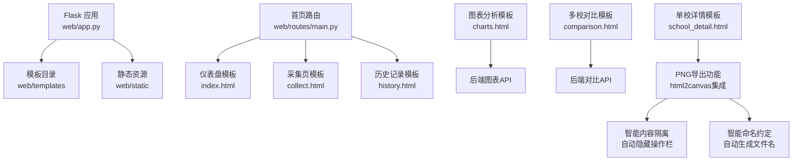
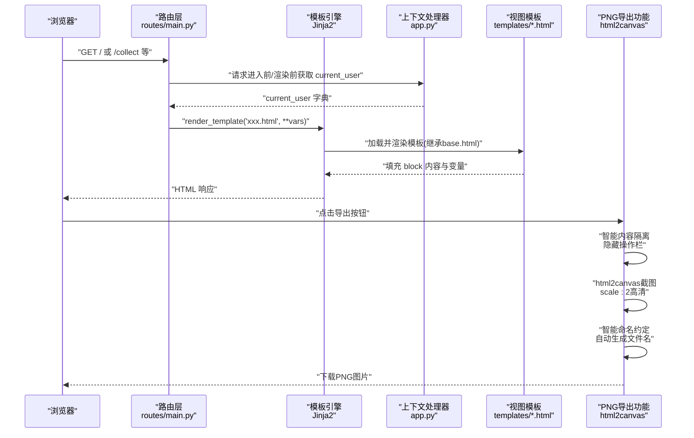
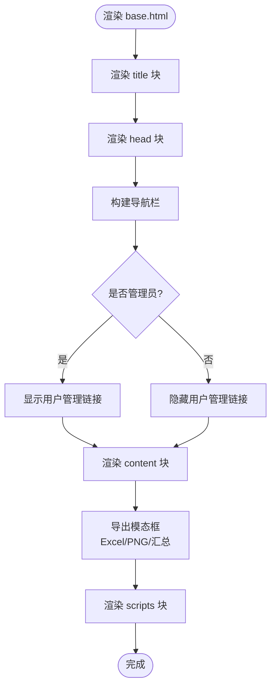
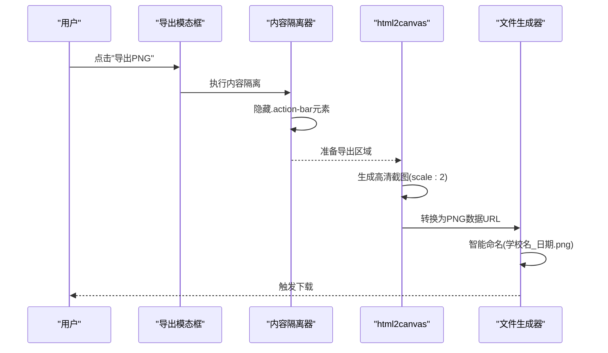
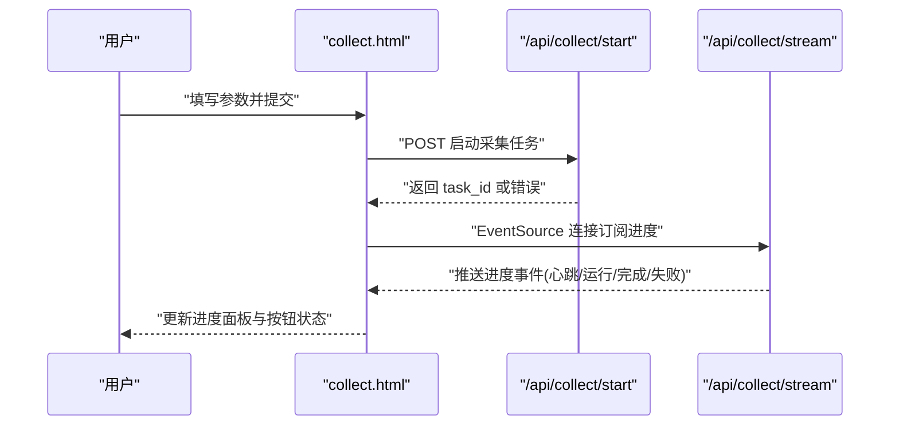
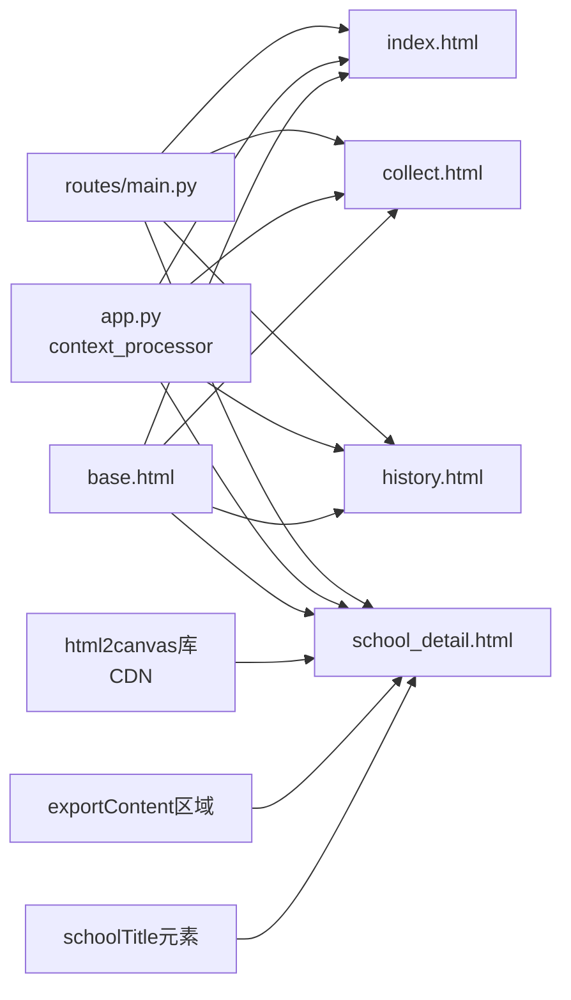

# 模板系统

<cite>
**本文引用的文件**   
- [web/app.py](file://web/app.py)
- [web/routes/main.py](file://web/routes/main.py)
- [web/templates/base.html](file://web/templates/base.html)
- [web/templates/index.html](file://web/templates/index.html)
- [web/templates/collect.html](file://web/templates/collect.html)
- [web/templates/history.html](file://web/templates/history.html)
- [web/templates/charts.html](file://web/templates/charts.html)
- [web/templates/comparison.html](file://web/templates/comparison.html)
- [web/templates/school_detail.html](file://web/templates/school_detail.html)
- [web/static/css/style.css](file://web/static/css/style.css)
- [web/static/js/app.js](file://web/static/js/app.js)
</cite>

## 更新摘要
**变更内容**   
- 新增PNG导出功能模块，支持图表和页面内容的截图导出
- 集成html2canvas库实现前端截图功能
- 添加智能内容隔离机制，自动隐藏操作栏等非导出元素
- 实现智能命名约定，根据页面内容自动生成文件名
- 增强导出模态框，支持多种导出格式选择

## 目录
1. [简介](#简介)
2. [项目结构](#项目结构)
3. [核心组件](#核心组件)
4. [架构总览](#架构总览)
5. [详细组件分析](#详细组件分析)
6. [依赖关系分析](#依赖关系分析)
7. [性能考虑](#性能考虑)
8. [故障排查指南](#故障排查指南)
9. [结论](#结论)
10. [附录](#附录)

## 简介
本技术文档聚焦于基于 Flask + Jinja2 的模板系统，系统性说明以下主题：
- Jinja2 模板引擎的使用方式与最佳实践
- 模板继承机制与块（block）组织
- base.html 基础模板的设计理念与导航栏动态生成逻辑
- 用户权限控制在模板中的应用（管理员可见项、当前用户信息注入）
- 各页面模板的结构特点、内容块定义与继承关系
- **新增：PNG导出功能实现，包括html2canvas集成、智能内容隔离、自动命名约定**
- 模板变量传递机制、过滤器使用、宏（macro）定义与复用策略
- 模板调试技巧、性能优化建议与安全最佳实践

## 项目结构
模板位于 web/templates 目录下，由 Flask 应用工厂在启动时注册模板文件夹。路由层通过 render_template 将数据传递给具体模板；认证上下文处理器将当前用户信息注入到所有模板中。**新增的PNG导出功能通过base.html中的统一导出模态框实现，支持多页面复用。**

**图示来源**
- [web/app.py:306-336](file://web/app.py#L306-L336)
- [web/routes/main.py:41-54](file://web/routes/main.py#L41-L54)
- [web/templates/base.html:330-370](file://web/templates/base.html#L330-L370)
- [web/templates/school_detail.html:198-269](file://web/templates/school_detail.html#L198-L269)

**章节来源**
- [web/app.py:306-336](file://web/app.py#L306-L336)
- [web/routes/main.py:41-54](file://web/routes/main.py#L41-L54)

## 核心组件
- 基础模板 base.html：提供全局 HTML 骨架、导航栏、块占位符（title/head/content/scripts），并集成静态资源引用。**新增统一的导出模态框和PNG导出功能。**
- 页面模板：
  - index.html：仪表盘，展示周表/月表概览与分页。
  - collect.html：数据采集表单与进度面板，支持 SSE 实时反馈。
  - history.html：历史记录查询与导出。
  - charts.html：图表分析，使用 Chart.js 可视化平台使用率。
  - comparison.html：多校对比，分区分组表格与汇总行。
  - **school_detail.html：单校详情分析，支持完整的PNG导出功能。**
- 认证上下文：通过 context_processor 将 current_user 注入所有模板，用于导航栏权限控制与用户信息显示。
- **新增：PNG导出功能模块**
  - html2canvas库集成，支持高质量截图
  - 智能内容隔离，自动隐藏操作栏等非导出元素
  - 智能命名约定，根据页面内容自动生成描述性文件名
  - 统一的导出模态框界面，支持多种导出格式

**章节来源**
- [web/templates/base.html:1-44](file://web/templates/base.html#L1-L44)
- [web/templates/index.html:1-292](file://web/templates/index.html#L1-L292)
- [web/templates/collect.html:1-776](file://web/templates/collect.html#L1-L776)
- [web/templates/history.html:1-475](file://web/templates/history.html#L1-L475)
- [web/templates/charts.html:1-400](file://web/templates/charts.html#L1-L400)
- [web/templates/comparison.html:1-800](file://web/templates/comparison.html#L1-L800)
- [web/templates/school_detail.html:1-932](file://web/templates/school_detail.html#L1-L932)
- [web/app.py:294-303](file://web/app.py#L294-L303)

## 架构总览
Jinja2 渲染流程从路由开始，经 Flask 上下文处理器注入用户信息，最终渲染为 HTML 返回给浏览器。**新增的PNG导出功能在前端通过html2canvas库实现，无需后端参与，提高了响应速度和用户体验。**

**图示来源**
- [web/app.py:294-303](file://web/app.py#L294-L303)
- [web/routes/main.py:41-54](file://web/routes/main.py#L41-L54)
- [web/templates/base.html:330-370](file://web/templates/base.html#L330-L370)
- [web/templates/school_detail.html:269-270](file://web/templates/school_detail.html#L269-L270)

## 详细组件分析

### 基础模板 base.html 与设计理念
- 设计目标
  - 统一布局与样式入口，减少重复代码
  - 通过块（block）实现"局部覆盖"，便于页面扩展
  - 导航栏根据当前路径高亮，并根据用户权限动态显示管理入口
  - **新增：统一的导出功能入口，支持多页面复用**
- 关键块
  - title：页面标题
  - head：额外头部资源（如 charts.html 引入 Chart.js）
  - content：页面主体内容
  - scripts：页面脚本（如 index.html 的分页逻辑）
- 导航栏动态生成
  - 依据 request.path 判断 active 状态
  - 管理员可见"用户管理"链接
  - 右上角显示用户名、管理员徽章与退出链接
- 静态资源
  - 通过 url_for('static', ...) 引用 CSS/JS，避免硬编码路径
- **新增：导出功能模块**
  - 统一的导出模态框，支持Excel、PNG、汇总报表三种格式
  - 智能导出动作处理，根据页面类型自动适配
  - 错误处理和用户友好的提示信息

**图示来源**
- [web/templates/base.html:1-44](file://web/templates/base.html#L1-L44)
- [web/templates/base.html:132-180](file://web/templates/base.html#L132-L180)

**章节来源**
- [web/templates/base.html:1-44](file://web/templates/base.html#L1-L44)
- [web/templates/base.html:132-180](file://web/templates/base.html#L132-L180)

### PNG导出功能详解

#### 功能特性
- **html2canvas集成**：使用CDN引入html2canvas库，支持高质量截图
- **智能内容隔离**：自动隐藏.action-bar类元素，确保导出内容纯净
- **高清输出**：设置scale: 2参数，生成2倍分辨率的高质量图片
- **智能命名约定**：根据页面内容自动生成描述性文件名
- **跨域支持**：启用useCORS选项，支持跨域资源截图
- **错误处理**：完善的异常捕获和用户友好提示

#### 实现机制

**图示来源**
- [web/templates/base.html:330-370](file://web/templates/base.html#L330-L370)

#### 智能命名约定
- 文件名格式：`单校详情_{学校名称}_{日期}.png`
- 动态获取学校名称：从`#schoolTitle`元素提取
- 日期格式化：使用ISO格式的前10位（YYYY-MM-DD）
- 默认值处理：当无法获取学校名称时使用"report"作为后备

#### 内容隔离策略
- 自动识别并隐藏`.action-bar`类元素
- 导出完成后恢复被隐藏元素的显示状态
- 支持异步操作的错误恢复机制

**章节来源**
- [web/templates/base.html:330-370](file://web/templates/base.html#L330-L370)
- [web/templates/school_detail.html:198-269](file://web/templates/school_detail.html#L198-L269)
- [web/templates/school_detail.html:269-270](file://web/templates/school_detail.html#L269-L270)

### 仪表盘模板 index.html
- 继承关系
  - extends "base.html"
  - 覆盖 title、content、scripts 三个块
- 数据绑定
  - schools、records、monthly_records、current_year 由路由传入
- 过滤与计算
  - 使用 selectattr 按学校名称筛选记录
  - 对月度活跃度进行异常判定（日活>周活>月活）
- 前端交互
  - 周表/月表 Tab 切换
  - 客户端分页（每页固定条数）
  - 颜色映射与时间格式化

**章节来源**
- [web/templates/index.html:1-292](file://web/templates/index.html#L1-L292)
- [web/routes/main.py:41-54](file://web/routes/main.py#L41-L54)

### 数据采集模板 collect.html
- 继承关系
  - extends "base.html"
  - 覆盖 title、content、scripts 三个块
- 表单与参数
  - 年份、月份、周次/月次选择
  - 日期范围自动填充（周表/月表模式）
  - 学校多选框，受用户权限限制（仅显示可访问学校）
- 采集流程
  - 提交后 POST 启动任务，再连接 EventSource 订阅进度
  - 进度项包含图标、标签、耗时；完成后提示查看结果
  - 页面状态持久化（sessionStorage）以恢复运行中的任务
- 学校管理弹窗
  - 打开弹窗拉取学校列表，支持新增/编辑/删除
  - 保存后刷新复选框列表

**图示来源**
- [web/templates/collect.html:1-776](file://web/templates/collect.html#L1-L776)

**章节来源**
- [web/templates/collect.html:1-776](file://web/templates/collect.html#L1-L776)

### 历史记录模板 history.html
- 继承关系
  - extends "base.html"
  - 覆盖 title、content、scripts 三个块
- 筛选与查询
  - 周表：年份、月份、周次（含自定义）、学校
  - 月表：年份、月次、学校
  - 调用预览接口渲染表格，支持分页与展开详情
- 导出功能
  - 周表/月表分别导出 Excel（通过后端下载接口）

**章节来源**
- [web/templates/history.html:1-475](file://web/templates/history.html#L1-L475)
- [web/routes/main.py:75-84](file://web/routes/main.py#L75-L84)

### 图表分析模板 charts.html
- 继承关系
  - extends "base.html"
  - 覆盖 title、head、content、scripts 四个块
- 外部库
  - 在 head 块中引入 Chart.js 与 datalabels 插件
- 交互与可视化
  - 筛选条件：开始/结束日期、学校、学段、年级、学科
  - 查询后渲染柱状图，显示使用率、人数、总数
  - 顶部摘要统计（平均、最高、最低、Top5）

**章节来源**
- [web/templates/charts.html:1-400](file://web/templates/charts.html#L1-L400)

### 多校对比模板 comparison.html
- 继承关系
  - extends "base.html"
  - 覆盖 title、head、content、scripts 四个块
- 界面特性
  - 搜索型下拉框、类型筛选（直营/测试/托管）
  - 分区滚动表格（每个区块自带表头）
  - 汇总区（平均行、最高/最低行）始终可见
  - 可折叠详情列（学情分析、错题本）
- 数据导出
  - 前端生成 CSV 下载

**章节来源**
- [web/templates/comparison.html:1-800](file://web/templates/comparison.html#L1-L800)

### 单校详情模板 school_detail.html
- 继承关系
  - extends "base.html"
  - 覆盖 title、head、content、scripts 四个块
- **PNG导出功能支持**
  - 完整的exportContent区域，包含所有需要导出的内容
  - schoolTitle元素用于智能命名
  - action-bar区域自动隐藏，确保导出内容纯净
  - html2canvas库集成，支持高质量截图
- 界面特性
  - 全局筛选栏，支持多维度数据筛选
  - KPI卡片展示关键指标
  - 周期趋势分析和业务板块拆解
  - 短板预警功能，低于均值的指标自动高亮
- 数据可视化
  - 使用Chart.js渲染趋势图和模块分析图
  - 支持同比环比分析
  - 交互式图表，支持缩放和悬停查看详情

**章节来源**
- [web/templates/school_detail.html:1-932](file://web/templates/school_detail.html#L1-L932)

### 用户权限控制在模板中的应用
- 上下文注入
  - 通过 context_processor 将 current_user 注入所有模板
  - 未登录时 current_user 为 None
- 导航栏权限
  - 管理员才显示"用户管理"链接
  - 右上角显示用户名与管理徽章
- 页面级权限
  - 用户管理页面（/users）仅在管理员访问时渲染，否则重定向至首页

**章节来源**
- [web/app.py:294-303](file://web/app.py#L294-L303)
- [web/templates/base.html:23-35](file://web/templates/base.html#L23-L35)
- [web/routes/main.py:131-136](file://web/routes/main.py#L131-L136)

## 依赖关系分析
- 模板与路由
  - routes/main.py 负责将数据模型与配置数据组装为模板变量
  - 模板通过 Jinja2 语法渲染数据与逻辑
- 模板与静态资源
  - base.html 通过 url_for 引入 CSS/JS，确保路径正确
- 模板与认证
  - app.py 的 context_processor 在所有模板中可用 current_user
- **新增：PNG导出功能依赖**
  - html2canvas库通过CDN引入，支持前端截图
  - 依赖页面的DOM结构和CSS样式
  - 需要正确的DOM ID和class命名规范

**图示来源**
- [web/routes/main.py:41-54](file://web/routes/main.py#L41-L54)
- [web/app.py:294-303](file://web/app.py#L294-L303)
- [web/templates/base.html:1-44](file://web/templates/base.html#L1-L44)
- [web/templates/school_detail.html:198-270](file://web/templates/school_detail.html#L198-L270)

**章节来源**
- [web/routes/main.py:41-54](file://web/routes/main.py#L41-L54)
- [web/app.py:294-303](file://web/app.py#L294-L303)
- [web/templates/base.html:1-44](file://web/templates/base.html#L1-L44)

## 性能考虑
- 模板渲染
  - 启用 TEMPLATES_AUTO_RELOAD 便于开发阶段实时更新（生产环境应关闭）
  - 尽量在路由层完成数据聚合与过滤，减少模板内复杂循环与计算
- 前端交互
  - 大表格采用客户端分页与按需渲染，避免一次性渲染过多 DOM
  - 使用 EventSource 流式更新进度，降低轮询开销
- 资源加载
  - 静态资源通过 url_for 管理版本与缓存
  - 第三方库按需引入（如 charts.html 仅在该页面加载 Chart.js）
- **PNG导出功能性能优化**
  - html2canvas库通过CDN引入，利用浏览器缓存
  - scale: 2参数平衡质量与性能
  - useCORS: true支持跨域资源，避免重复加载
  - 异步处理，不阻塞主线程
  - 智能内容隔离，减少不必要的DOM操作

**章节来源**
- [web/app.py:306-314](file://web/app.py#L306-L314)
- [web/templates/index.html:202-292](file://web/templates/index.html#L202-L292)
- [web/templates/collect.html:467-547](file://web/templates/collect.html#L467-L547)
- [web/templates/charts.html:4-7](file://web/templates/charts.html#L4-L7)
- [web/templates/base.html:351-356](file://web/templates/base.html#L351-L356)

## 故障排查指南
- 模板未找到或路径错误
  - 检查 create_app 中 template_folder 配置是否正确
  - 确认模板文件名与 render_template 调用一致
- 变量未生效
  - 确认路由层是否将变量传入模板
  - 检查 context_processor 是否正确注入 current_user
- 权限问题
  - 未登录将被重定向到登录页；API 返回 401
  - 非管理员访问 /users 会被重定向
- 登录流程
  - 登录页使用 render_template_string 渲染内嵌模板，注意 next_url 传递与跳转
- **PNG导出功能故障排查**
  - html2canvas库加载失败：检查网络连接和CDN可用性
  - 导出内容为空白：确认exportContent区域存在且包含有效内容
  - 文件名不正确：检查schoolTitle元素是否存在且有文本内容
  - 截图质量差：调整scale参数或检查页面缩放设置
  - 跨域资源问题：确保useCORS: true已启用

**章节来源**
- [web/app.py:306-314](file://web/app.py#L306-L314)
- [web/app.py:256-292](file://web/app.py#L256-L292)
- [web/routes/main.py:131-136](file://web/routes/main.py#L131-L136)
- [web/templates/base.html:346-365](file://web/templates/base.html#L346-L365)

## 结论
该模板系统以 base.html 为核心，结合 Jinja2 的继承与块机制，实现了统一的页面结构与灵活的局部定制。通过上下文处理器注入用户信息，模板层即可安全地实现导航与内容的权限控制。**新增的PNG导出功能进一步增强了系统的实用性，通过html2canvas集成、智能内容隔离和自动命名约定，为用户提供了便捷的图表导出能力。**配合路由层的数据准备与前端交互优化，整体具备良好的可维护性与可扩展性。建议在后续迭代中引入宏（macro）进一步复用通用片段，并完善过滤器与单元测试以提升稳定性。

## 附录

### 模板变量传递机制
- 路由层通过 render_template 将数据字典传给模板
- 上下文处理器在每个请求中将 current_user 注入到模板
- 示例路径
  - 仪表盘：[web/routes/main.py:41-54](file://web/routes/main.py#L41-L54)
  - 上下文注入：[web/app.py:294-303](file://web/app.py#L294-L303)

### 过滤器使用方法
- 内置过滤器
  - replace：字符串替换（如去除百分号）
  - float：字符串转浮点
  - selectattr：按属性筛选集合
- 使用位置
  - 仪表盘月度指标异常检测与数值处理
  - 历史记录的格式化与空值处理

**章节来源**
- [web/templates/index.html:92-118](file://web/templates/index.html#L92-L118)
- [web/templates/history.html:170-215](file://web/templates/history.html#L170-L215)

### 宏（macro）的定义与复用
- 现状
  - 当前模板未显式定义 macro，但可通过  导入外部宏文件
- 建议
  - 将重复的卡片、表格行、状态徽章等封装为宏
  - 在 base.html 或独立 macros.html 中集中管理，提高复用度与维护性

### PNG导出功能技术规范
- **html2canvas配置**
  - scale: 2（高清输出）
  - useCORS: true（跨域支持）
  - backgroundColor: '#ffffff'（白色背景）
  - logging: false（禁用日志）
- **DOM结构要求**
  - exportContent：导出内容容器
  - schoolTitle：学校名称元素（用于智能命名）
  - action-bar：操作栏元素（自动隐藏）
- **命名约定**
  - 格式：单校详情_{学校名}_{日期}.png
  - 日期格式：YYYY-MM-DD
  - 默认值：report（当无法获取学校名时）

### 模板安全最佳实践
- 输出自动转义
  - Jinja2 默认开启自动转义，避免 XSS 风险
- 谨慎使用 safe 过滤器
  - 仅在明确信任的内容上使用，防止注入攻击
- 最小权限原则
  - 模板仅展示必要信息，敏感字段不在模板中直接输出
- 输入校验前置
  - 路由层对用户输入进行严格校验，模板只负责展示