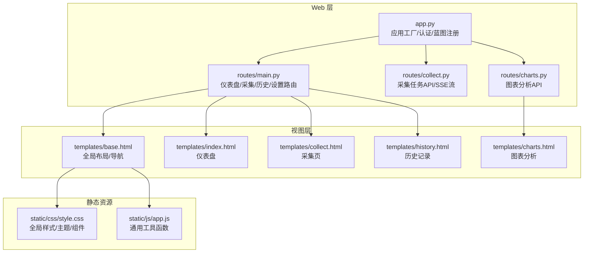
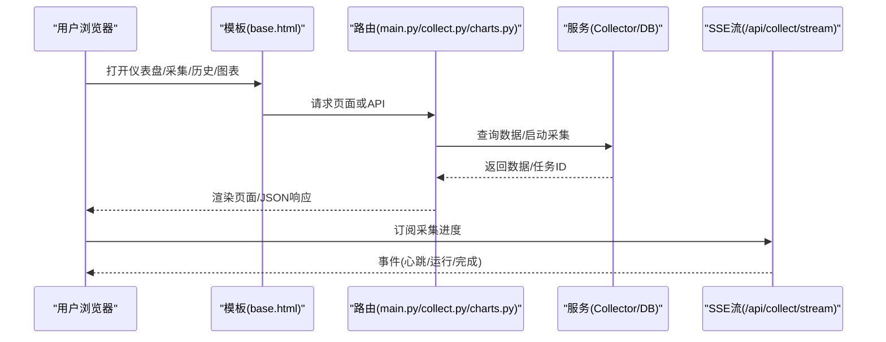
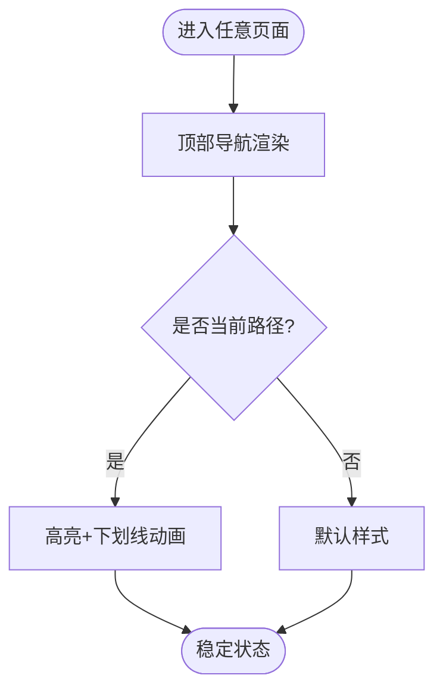
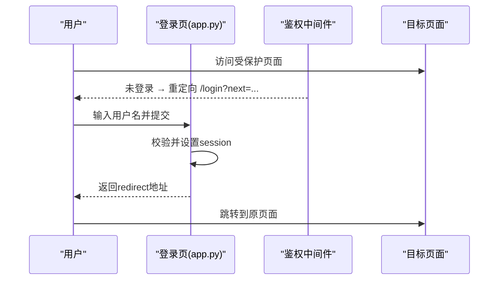
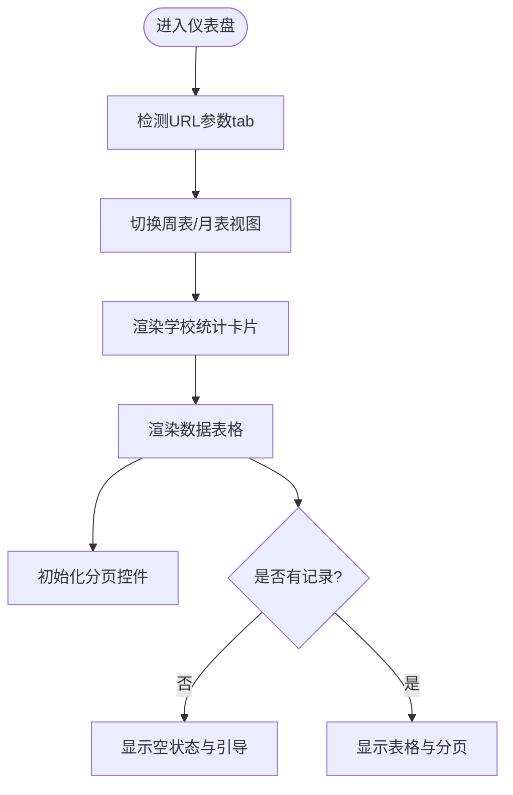
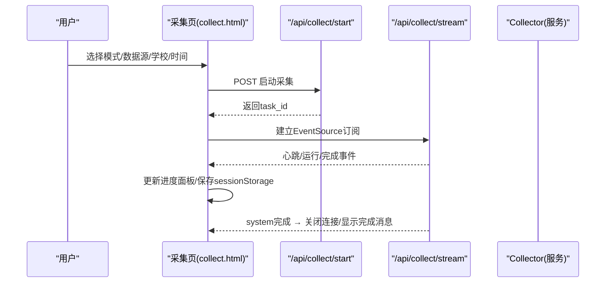
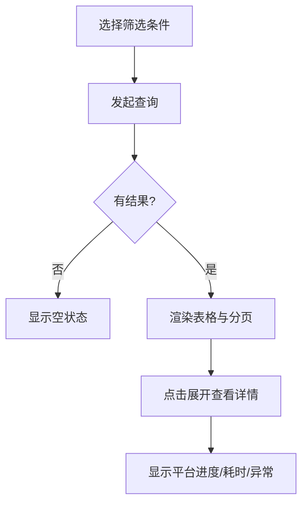
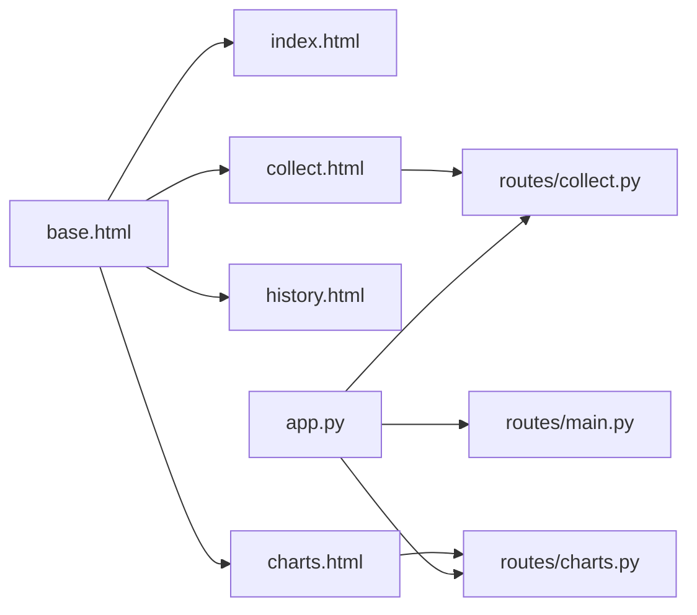

# 用户体验设计

<cite>
**本文引用的文件**
- [web/app.py](file://web/app.py)
- [web/static/css/style.css](file://web/static/css/style.css)
- [web/static/js/app.js](file://web/static/js/app.js)
- [web/templates/base.html](file://web/templates/base.html)
- [web/templates/index.html](file://web/templates/index.html)
- [web/templates/collect.html](file://web/templates/collect.html)
- [web/templates/history.html](file://web/templates/history.html)
- [web/templates/charts.html](file://web/templates/charts.html)
- [web/routes/main.py](file://web/routes/main.py)
- [web/routes/collect.py](file://web/routes/collect.py)
- [web/routes/charts.py](file://web/routes/charts.py)
</cite>

## 目录
1. [引言](#引言)
2. [项目结构](#项目结构)
3. [核心组件](#核心组件)
4. [架构总览](#架构总览)
5. [详细组件分析](#详细组件分析)
6. [依赖关系分析](#依赖关系分析)
7. [性能考量](#性能考量)
8. [故障排查指南](#故障排查指南)
9. [结论](#结论)
10. [附录](#附录)

## 引言
本设计文档面向数据采集平台的前端用户体验，围绕整体设计理念、信息架构组织原则、用户流程优化策略展开，重点覆盖导航易用性、操作反馈及时性、错误提示友好性、加载与空状态处理、数据可视化呈现、无障碍访问支持、键盘与触屏适配、体验测试方法、性能监控体系、行为分析与A/B测试思路、满意度评估与持续改进策略。文档基于仓库中实际前端模板、样式与脚本以及后端路由实现进行系统化梳理与可视化说明，确保读者既能把握全局，又能落地到具体代码位置。

## 项目结构
前端采用“模板 + 静态资源”的轻量方案：Flask 渲染 HTML 模板，CSS/JS 作为静态资源提供；页面通过蓝图路由挂载，统一认证中间件保护受保护页面与 API。



图示来源
- [web/app.py:306-336](file://web/app.py#L306-L336)
- [web/routes/main.py:41-84](file://web/routes/main.py#L41-L84)
- [web/routes/collect.py:22-169](file://web/routes/collect.py#L22-L169)
- [web/routes/charts.py:63-66](file://web/routes/charts.py#L63-L66)
- [web/templates/base.html:11-36](file://web/templates/base.html#L11-L36)
- [web/templates/index.html:1-20](file://web/templates/index.html#L1-L20)
- [web/templates/collect.html:62-84](file://web/templates/collect.html#L62-L84)
- [web/templates/history.html:4-12](file://web/templates/history.html#L4-L12)
- [web/templates/charts.html:90-106](file://web/templates/charts.html#L90-L106)
- [web/static/css/style.css:1-42](file://web/static/css/style.css#L1-L42)
- [web/static/js/app.js:1-23](file://web/static/js/app.js#L1-L23)

章节来源
- [web/app.py:306-336](file://web/app.py#L306-L336)
- [web/templates/base.html:11-36](file://web/templates/base.html#L11-L36)
- [web/static/css/style.css:1-42](file://web/static/css/style.css#L1-L42)
- [web/static/js/app.js:1-23](file://web/static/js/app.js#L1-L23)

## 核心组件
- 全局布局与导航（base.html）：固定顶部导航、品牌标识、主导航链接、版本与用户信息区，配合 CSS 变量构建一致的视觉语言。
- 仪表盘（index.html）：周表/月表双 Tab 切换、统计卡片、数据表格与分页、异常状态高亮。
- 数据采集（collect.html）：模式切换（周表/月表）、数据源切换（Grafana/数据库直查）、表单联动与预览、进度面板与 SSE 实时推送、学校管理弹窗。
- 历史记录（history.html）：筛选栏、结果计数、可展开详情面板、分页导出。
- 图表分析（charts.html）：多维筛选器、动态 X 轴维度、Chart.js 柱状图展示、Top/Bottom 标签显示与摘要统计。
- 全局样式（style.css）：玻璃拟态风格、语义化色彩、按钮/表格/模态框/进度条等组件样式。
- 通用工具（app.js）：日期格式化、Toast 提示。

章节来源
- [web/templates/base.html:11-36](file://web/templates/base.html#L11-L36)
- [web/templates/index.html:10-13](file://web/templates/index.html#L10-L13)
- [web/templates/collect.html:66-83](file://web/templates/collect.html#L66-L83)
- [web/templates/history.html:9-12](file://web/templates/history.html#L9-L12)
- [web/templates/charts.html:97-146](file://web/templates/charts.html#L97-L146)
- [web/static/css/style.css:68-163](file://web/static/css/style.css#L68-L163)
- [web/static/js/app.js:3-22](file://web/static/js/app.js#L3-L22)

## 架构总览
前端以模板渲染为主，交互逻辑集中在各页面脚本中；后端通过蓝图提供页面与 API，认证中间件统一鉴权，SSE 为采集进度提供实时推送。



图示来源
- [web/templates/base.html:11-36](file://web/templates/base.html#L11-L36)
- [web/routes/main.py:41-84](file://web/routes/main.py#L41-L84)
- [web/routes/collect.py:22-169](file://web/routes/collect.py#L22-L169)
- [web/routes/charts.py:323-347](file://web/routes/charts.py#L323-L347)

## 详细组件分析

### 导航系统（易用性与一致性）
- 固定顶部导航，毛玻璃背景与滚动阴影增强层级感；当前页面高亮与图标透明度变化提升定位清晰度。
- 导航项按功能域划分：仪表盘、数据采集、历史记录、图表分析、多校对比、活跃统计、用户管理（管理员可见）、个人设置。
- 用户信息与退出入口置于右侧，便于快速识别与操作。



图示来源
- [web/templates/base.html:16-27](file://web/templates/base.html#L16-L27)
- [web/static/css/style.css:68-163](file://web/static/css/style.css#L68-L163)

章节来源
- [web/templates/base.html:16-27](file://web/templates/base.html#L16-L27)
- [web/static/css/style.css:68-163](file://web/static/css/style.css#L68-L163)

### 登录与鉴权（安全与友好提示）
- 登录页内嵌于 app.py，使用 fetch 提交用户名并处理成功跳转与失败提示；未登录访问受保护页面时重定向至登录页并携带 next 参数。
- 登录后注入 current_user 上下文，模板根据权限渲染导航项。



图示来源
- [web/app.py:253-303](file://web/app.py#L253-L303)
- [web/app.py:265-287](file://web/app.py#L265-L287)

章节来源
- [web/app.py:253-303](file://web/app.py#L253-L303)
- [web/app.py:265-287](file://web/app.py#L265-L287)

### 仪表盘（信息架构与数据呈现）
- 双 Tab 切换（周表/月表），URL 参数控制初始 Tab；统计卡片按学校配色区分，异常指标高亮。
- 表格支持分页，数字列右对齐，学校名左侧色条辅助识别；空状态引导至采集入口。



图示来源
- [web/templates/index.html:215-235](file://web/templates/index.html#L215-L235)
- [web/templates/index.html:244-289](file://web/templates/index.html#L244-L289)
- [web/templates/index.html:79-81](file://web/templates/index.html#L79-L81)

章节来源
- [web/templates/index.html:10-13](file://web/templates/index.html#L10-L13)
- [web/templates/index.html:215-235](file://web/templates/index.html#L215-L235)
- [web/templates/index.html:244-289](file://web/templates/index.html#L244-L289)

### 数据采集（流程优化与实时反馈）
- 模式切换：周表/月表表单字段联动，自动填充日期范围，周次/月次预览文本即时更新。
- 数据源切换：Grafana/数据库直查，按钮状态随模式与运行状态同步。
- 启动采集：POST 启动任务后连接 SSE，进度项按平台/学校去重替换，避免转圈残留；完成后显示总结与跳转。
- 状态保持：刷新后恢复进度与按钮状态，跨用户任务冲突提示。



图示来源
- [web/templates/collect.html:385-465](file://web/templates/collect.html#L385-L465)
- [web/templates/collect.html:467-547](file://web/templates/collect.html#L467-L547)
- [web/routes/collect.py:22-102](file://web/routes/collect.py#L22-L102)
- [web/routes/collect.py:137-169](file://web/routes/collect.py#L137-L169)

章节来源
- [web/templates/collect.html:239-282](file://web/templates/collect.html#L239-L282)
- [web/templates/collect.html:385-465](file://web/templates/collect.html#L385-L465)
- [web/templates/collect.html:467-547](file://web/templates/collect.html#L467-L547)
- [web/routes/collect.py:22-102](file://web/routes/collect.py#L22-L102)
- [web/routes/collect.py:137-169](file://web/routes/collect.py#L137-L169)

### 历史记录（筛选与可展开详情）
- 周表/月表筛选栏，支持年份、月份/月次、学校等条件组合；结果计数与分页。
- 行内展开查看平台级进度与耗时，异常状态提示清晰。



图示来源
- [web/templates/history.html:15-93](file://web/templates/history.html#L15-L93)
- [web/templates/history.html:170-215](file://web/templates/history.html#L170-L215)
- [web/templates/history.html:252-266](file://web/templates/history.html#L252-L266)

章节来源
- [web/templates/history.html:15-93](file://web/templates/history.html#L15-L93)
- [web/templates/history.html:170-215](file://web/templates/history.html#L170-L215)
- [web/templates/history.html:252-266](file://web/templates/history.html#L252-L266)

### 图表分析（可视化与交互）
- 多维筛选器：学校、学段、年级、学科，X 轴维度由后端根据筛选条件决定。
- Chart.js 柱状图：颜色映射、Top/Bottom 标签智能显示、Tooltip 包含使用率/人数/总数。
- 摘要统计：平均/最高/最低使用率及前5名单。

```mermaid
sequenceDiagram
participant U as "用户"
participant CH as "图表页(charts.html)"
participant OPT as "/api/charts/options"
participant DATA as "/api/charts/platform-usage"
participant JS as "Chart.js"
U->>CH : 打开图表页
CH->>OPT : 获取筛选选项
OPT-->>CH : 返回学校/学段/年级/学科列表
U->>CH : 配置筛选条件
CH->>DATA : 查询使用率数据
DATA-->>CH : 返回x_axis与data
CH->>JS : 渲染柱状图与摘要
```

图示来源
- [web/templates/charts.html:151-194](file://web/templates/charts.html#L151-L194)
- [web/templates/charts.html:210-340](file://web/templates/charts.html#L210-L340)
- [web/routes/charts.py:70-119](file://web/routes/charts.py#L70-L119)
- [web/routes/charts.py:323-347](file://web/routes/charts.py#L323-L347)

章节来源
- [web/templates/charts.html:151-194](file://web/templates/charts.html#L151-L194)
- [web/templates/charts.html:210-340](file://web/templates/charts.html#L210-L340)
- [web/routes/charts.py:70-119](file://web/routes/charts.py#L70-L119)
- [web/routes/charts.py:323-347](file://web/routes/charts.py#L323-L347)

### 全局样式与组件（视觉一致性与可维护性）
- CSS 变量定义主题色、阴影、圆角、过渡曲线，保证全局一致性。
- 组件类：按钮、表格、模态框、进度条、筛选栏、分页、空状态、Toast 等，统一交互与视觉。

章节来源
- [web/static/css/style.css:1-42](file://web/static/css/style.css#L1-L42)
- [web/static/css/style.css:332-354](file://web/static/css/style.css#L332-L354)
- [web/static/css/style.css:427-434](file://web/static/css/style.css#L427-L434)
- [web/static/css/style.css:464-469](file://web/static/css/style.css#L464-L469)

### 通用工具（及时反馈与便捷操作）
- Toast 提示：创建元素、自动消失、类型化样式。
- 日期格式化：统一输出格式，减少重复逻辑。

章节来源
- [web/static/js/app.js:3-22](file://web/static/js/app.js#L3-L22)

## 依赖关系分析
- 页面模板依赖 base.html 提供的导航与全局样式/脚本。
- 路由模块负责页面渲染与 API 数据返回，认证中间件在 app.py 中集中处理。
- 采集页通过 SSE 与 Collector 服务通信，状态保存在 sessionStorage 以支持刷新恢复。



图示来源
- [web/templates/base.html:11-36](file://web/templates/base.html#L11-L36)
- [web/app.py:306-336](file://web/app.py#L306-L336)
- [web/routes/main.py:41-84](file://web/routes/main.py#L41-L84)
- [web/routes/collect.py:22-169](file://web/routes/collect.py#L22-L169)
- [web/routes/charts.py:63-66](file://web/routes/charts.py#L63-L66)

章节来源
- [web/templates/base.html:11-36](file://web/templates/base.html#L11-L36)
- [web/app.py:306-336](file://web/app.py#L306-L336)
- [web/routes/main.py:41-84](file://web/routes/main.py#L41-L84)
- [web/routes/collect.py:22-169](file://web/routes/collect.py#L22-L169)
- [web/routes/charts.py:63-66](file://web/routes/charts.py#L63-L66)

## 性能考量
- 首屏渲染：模板预渲染关键数据，减少首次交互等待；分页与按需加载降低 DOM 压力。
- 实时推送：SSE 心跳机制保障连接存活，事件去重替换避免重复渲染。
- 图表渲染：仅对必要数据点显示标签，限制最大柱宽，避免大量数据时的卡顿。
- 样式性能：CSS 变量与 backdrop-filter 适度使用，注意移动端兼容性。

[本节为通用指导，不直接分析具体文件]

## 故障排查指南
- 登录失败：检查用户名是否存在、网络错误提示；确认 session 设置与重定向 next 参数。
- 采集任务冲突：后端互斥检查防止并发启动；前端检测到其他用户任务时给出提示。
- SSE 断连：前端在 onerror 中轮询状态，若已停止则清理状态并恢复按钮。
- 图表无数据：检查时间范围必填、筛选条件有效性；后端返回错误信息需在前端提示。

章节来源
- [web/app.py:265-287](file://web/app.py#L265-L287)
- [web/routes/collect.py:64-66](file://web/routes/collect.py#L64-L66)
- [web/templates/collect.html:537-547](file://web/templates/collect.html#L537-L547)
- [web/routes/charts.py:332-334](file://web/routes/charts.py#L332-L334)

## 结论
本设计文档从整体理念到细节实现，系统梳理了数据采集平台的前端用户体验设计。通过统一的导航与信息架构、实时的操作反馈与友好的错误提示、完善的加载与空状态处理、直观的数据可视化呈现，以及可扩展的无障碍与适配策略，为用户提供了高效、稳定、易用的操作体验。结合体验测试、性能监控与数据分析，平台具备持续改进与迭代的能力。

[本节为总结性内容，不直接分析具体文件]

## 附录

### 无障碍访问支持方案
- 语义化标签与标题层级：页面使用 h1/h2/h3 明确层级，导航与表单使用 label 关联。
- 键盘可达性：所有交互元素可通过 Tab 聚焦，Enter/Space 触发操作；模态框提供关闭键位支持。
- 焦点管理：打开模态框时将焦点移至内部，关闭后恢复；进度面板滚动保持可视区域。
- 对比度与可读性：遵循语义色与文字层级，确保明暗对比满足 WCAG 标准。

章节来源
- [web/templates/base.html:16-27](file://web/templates/base.html#L16-L27)
- [web/templates/collect.html:206-215](file://web/templates/collect.html#L206-L215)
- [web/static/css/style.css:23-42](file://web/static/css/style.css#L23-L42)

### 键盘导航实现细节
- 导航链接支持键盘切换，当前路径高亮；分页按钮禁用态不可聚焦。
- 表单字段顺序符合阅读顺序，必填项标注清晰。
- 模态框 ESC 关闭，焦点陷阱避免跳出。

章节来源
- [web/templates/base.html:16-27](file://web/templates/base.html#L16-L27)
- [web/static/css/style.css:625-664](file://web/static/css/style.css#L625-L664)
- [web/templates/collect.html:206-215](file://web/templates/collect.html#L206-L215)

### 触屏设备适配策略
- 触摸目标尺寸充足，按钮与复选框易于点击。
- 横向滚动区域隐藏滚动条，使用遮罩渐变提示可滚动。
- 字体大小与行高适配小屏，避免误触与遮挡。

章节来源
- [web/static/css/style.css:96-106](file://web/static/css/style.css#L96-L106)
- [web/static/css/style.css:386-392](file://web/static/css/style.css#L386-L392)
- [web/static/css/style.css:47-60](file://web/static/css/style.css#L47-L60)

### 用户体验测试方法论
- 可用性测试：任务完成率、错误率、任务时长、主观满意度评分。
- 眼动与热力图：关注关键操作路径与热点区域。
- A/B 测试：针对关键界面（如采集启动按钮文案、进度提示样式）进行对照实验。

[本节为通用指导，不直接分析具体文件]

### 性能指标监控体系
- 前端性能：首屏加载时间、交互响应时间、长任务占比、内存占用。
- 网络性能：API 请求成功率、SSE 连接稳定性、重试与超时策略。
- 业务指标：采集任务成功率、平均耗时、异常率。

[本节为通用指导，不直接分析具体文件]

### 用户行为分析数据收集
- 埋点策略：页面浏览、按钮点击、表单提交、错误弹窗、SSE 事件。
- 隐私合规：匿名化用户标识，最小化数据收集，提供退出选项。
- 数据看板：关键漏斗与转化路径可视化。

[本节为通用指导，不直接分析具体文件]

### A/B 测试设计与实施
- 假设驱动：明确待验证假设（如缩短提示文案提升转化率）。
- 分组随机：流量均匀分配，样本量足够。
- 指标评估：主要指标显著性检验，次要指标观察。
- 迭代发布：胜出方案灰度上线，逐步全量。

[本节为通用指导，不直接分析具体文件]

### 用户满意度评估方法
- NPS/CSAT 问卷：定期发放，收集主观反馈。
- 用户访谈：深度了解痛点与期望。
- 客服工单分析：高频问题归类与优先级排序。

[本节为通用指导，不直接分析具体文件]

### 持续改进的迭代策略
- 需求池管理：来自用户反馈、数据分析、竞品研究的需求入库。
- 敏捷迭代：短周期交付，快速验证，持续优化。
- 质量门禁：自动化测试、代码审查、性能回归。

[本节为通用指导，不直接分析具体文件]