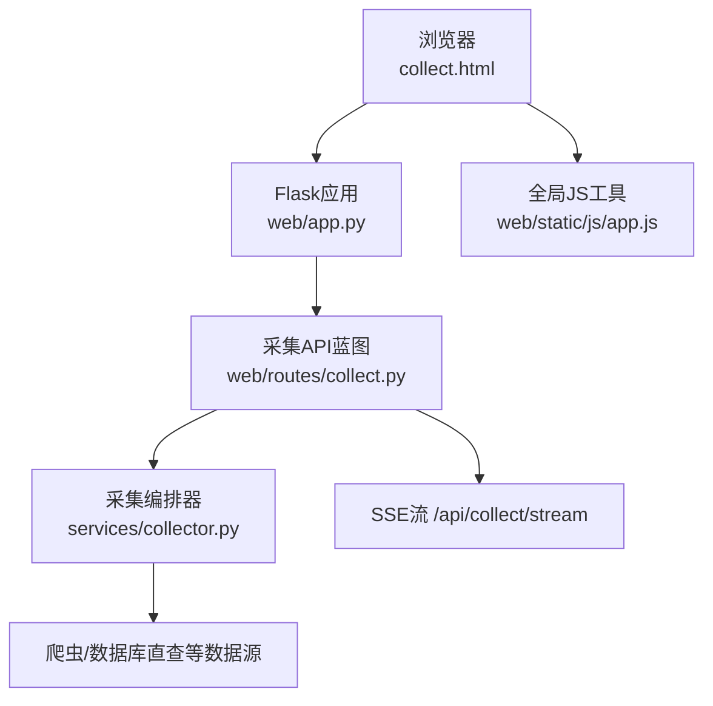
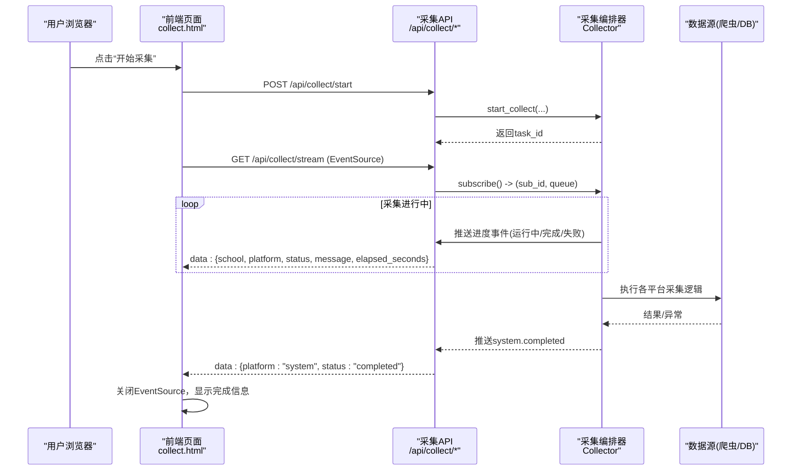
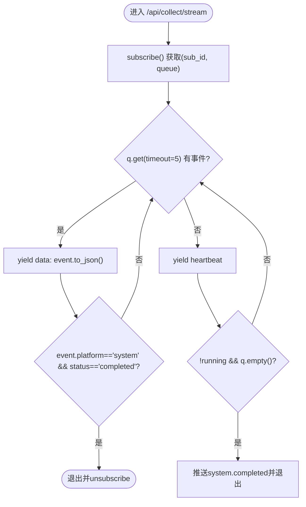
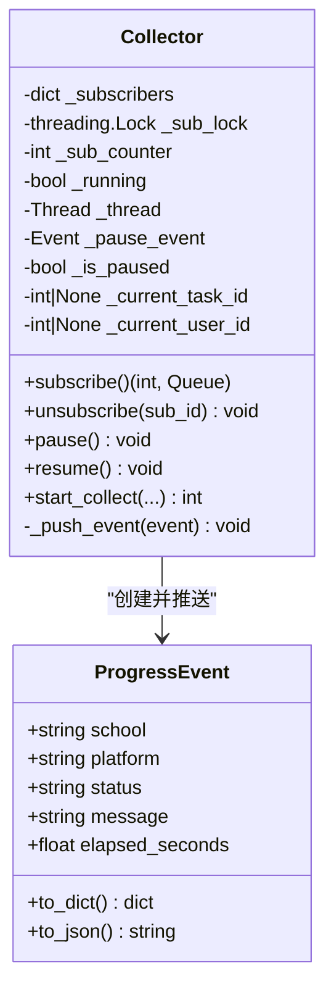
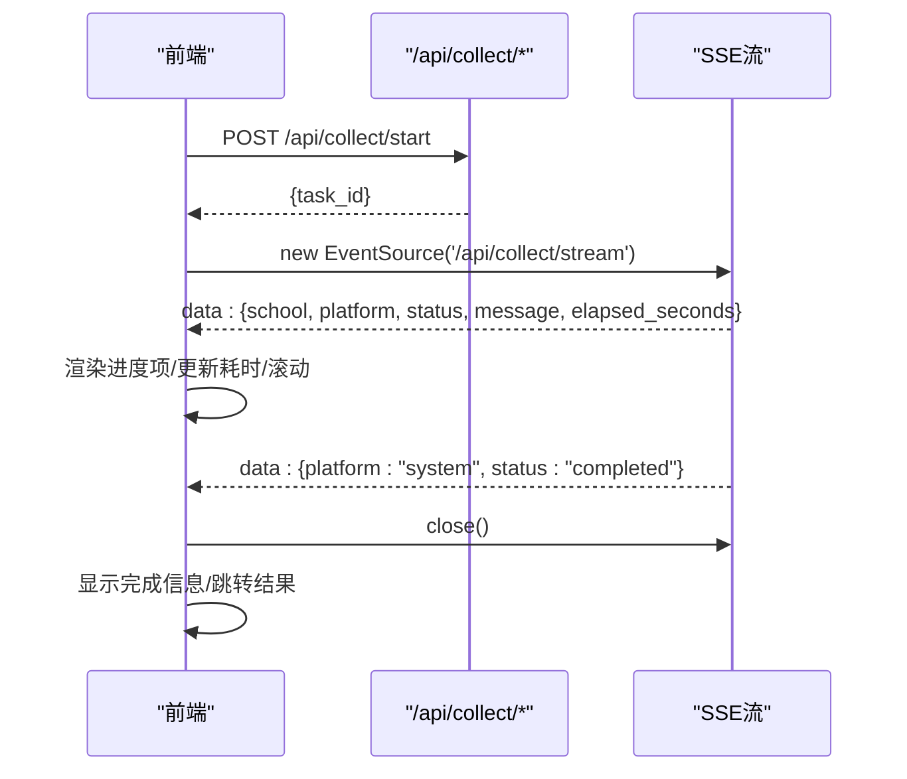
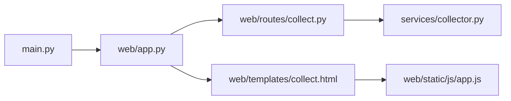

# 实时监控

<cite>
**本文引用的文件**   
- [main.py](file://main.py)
- [web/app.py](file://web/app.py)
- [web/routes/collect.py](file://web/routes/collect.py)
- [services/collector.py](file://services/collector.py)
- [web/templates/collect.html](file://web/templates/collect.html)
- [web/static/js/app.js](file://web/static/js/app.js)
</cite>

## 目录
1. [简介](#简介)
2. [项目结构](#项目结构)
3. [核心组件](#核心组件)
4. [架构总览](#架构总览)
5. [详细组件分析](#详细组件分析)
6. [依赖关系分析](#依赖关系分析)
7. [性能考虑](#性能考虑)
8. [故障排查指南](#故障排查指南)
9. [结论](#结论)
10. [附录](#附录)

## 简介
本技术文档围绕“实时监控系统”的SSE（Server-Sent Events）实现，系统性阐述事件流建立与维护、客户端连接管理、进度事件推送机制（采集任务状态更新、错误信息实时通知、完成状态同步）、前端JavaScript事件监听与DOM动态更新、断线重连与错误恢复、性能优化策略、调试工具使用、监控指标定义与故障排查方法。目标是帮助读者快速理解并高效维护该系统的实时能力。

## 项目结构
系统采用Flask作为Web框架，通过蓝图组织路由；采集编排器位于服务层，负责多平台异步采集与进度广播；前端模板页面提供数据采集表单与实时进度面板，并通过EventSource订阅SSE流。

图表来源
- [web/app.py:306-336](file://web/app.py#L306-L336)
- [web/routes/collect.py:137-169](file://web/routes/collect.py#L137-L169)
- [services/collector.py:65-131](file://services/collector.py#L65-L131)
- [web/templates/collect.html:467-547](file://web/templates/collect.html#L467-L547)
- [web/static/js/app.js:1-23](file://web/static/js/app.js#L1-L23)

章节来源
- [web/app.py:306-336](file://web/app.py#L306-L336)
- [web/routes/collect.py:137-169](file://web/routes/collect.py#L137-L169)
- [services/collector.py:65-131](file://services/collector.py#L65-L131)
- [web/templates/collect.html:467-547](file://web/templates/collect.html#L467-L547)
- [web/static/js/app.js:1-23](file://web/static/js/app.js#L1-L23)

## 核心组件
- Flask应用工厂：初始化日志、注册蓝图、配置模板与静态资源、注入认证中间件。
- 采集API蓝图：启动采集任务、查询状态、暂停/继续、提供SSE进度流。
- 采集编排器：后台线程+异步事件循环驱动多平台采集；基于队列的pub/sub广播进度事件；支持暂停/继续与任务生命周期管理。
- 前端采集页：表单参数校验、启动任务、创建EventSource订阅SSE、渲染进度项、处理心跳与完成信号、断线恢复。
- 全局JS工具：日期格式化、Toast提示等通用函数。

章节来源
- [web/app.py:306-336](file://web/app.py#L306-L336)
- [web/routes/collect.py:22-169](file://web/routes/collect.py#L22-L169)
- [services/collector.py:65-131](file://services/collector.py#L65-L131)
- [web/templates/collect.html:467-547](file://web/templates/collect.html#L467-L547)
- [web/static/js/app.js:1-23](file://web/static/js/app.js#L1-L23)

## 架构总览
下图展示从用户操作到SSE事件到达前端的完整链路，包括任务启动、进度广播、心跳保活与完成收尾。

图表来源
- [web/routes/collect.py:137-169](file://web/routes/collect.py#L137-L169)
- [services/collector.py:133-212](file://services/collector.py#L133-L212)
- [web/templates/collect.html:467-547](file://web/templates/collect.html#L467-L547)

## 详细组件分析

### SSE 事件流与连接管理
- 事件流端点：/api/collect/stream
  - 每个客户端独立订阅，后端为每个订阅分配专属队列，避免事件串扰。
  - 响应类型为text/event-stream，禁用缓存与代理缓冲，确保低延迟。
  - 每5秒超时读取队列，若为空则发送心跳事件type=heartbeat，保持长连接活跃。
  - 当采集器已完成且队列为空时，兜底推送system.completed并退出。
- 连接生命周期：
  - 前端在POST成功后再创建EventSource，保证订阅到正确的采集器实例。
  - onerror触发时关闭旧连接，并轮询/api/collect/status判断是否仍在运行，决定是否恢复UI或结束流程。
  - 收到system.completed后主动关闭EventSource，释放服务端订阅。

图表来源
- [web/routes/collect.py:137-169](file://web/routes/collect.py#L137-L169)
- [services/collector.py:102-117](file://services/collector.py#L102-L117)

章节来源
- [web/routes/collect.py:137-169](file://web/routes/collect.py#L137-L169)
- [services/collector.py:102-117](file://services/collector.py#L102-L117)

### 进度事件推送机制
- 事件模型：ProgressEvent包含学校、平台、状态（pending/running/completed/failed）、消息、耗时等字段，统一序列化为JSON。
- 推送路径：
  - 采集编排器在各阶段调用_push_event将事件入队。
  - SSE流消费队列并转发给前端。
- 关键语义：
  - running：表示某平台正在采集。
  - completed：表示该平台采集完成，附带elapsed_seconds。
  - failed：表示该平台采集失败，message携带错误摘要。
  - pending：用于暂停等待场景。
  - system.completed：表示整体任务完成，前端据此关闭连接并跳转结果页。

图表来源
- [services/collector.py:39-63](file://services/collector.py#L39-L63)
- [services/collector.py:65-131](file://services/collector.py#L65-L131)

章节来源
- [services/collector.py:39-63](file://services/collector.py#L39-L63)
- [services/collector.py:65-131](file://services/collector.py#L65-L131)

### 前端事件监听与界面实时更新
- 启动流程：
  - 收集表单参数，POST至/api/collect/start，成功后保存task_id并创建EventSource订阅SSE。
- 事件处理：
  - onmessage解析data，忽略heartbeat；根据status选择图标与样式；按school::platform键值去重替换已有条目，避免转圈残留。
  - 追加elapsed_seconds显示；滚动到底部；写入sessionStorage持久化进度。
  - 收到system.completed时关闭EventSource，显示完成提示并可跳转到结果页。
- 错误恢复：
  - onerror关闭旧连接，轮询/api/collect/status判断是否仍在运行，决定恢复按钮状态或结束流程。
- 页面状态恢复：
  - 页面加载时查询/api/collect/status，如存在同task_id的运行任务，则恢复进度面板、按钮状态并重连SSE。

图表来源
- [web/templates/collect.html:467-547](file://web/templates/collect.html#L467-L547)
- [web/templates/collect.html:582-618](file://web/templates/collect.html#L582-L618)

章节来源
- [web/templates/collect.html:467-547](file://web/templates/collect.html#L467-L547)
- [web/templates/collect.html:582-618](file://web/templates/collect.html#L582-L618)

### 连接断线重连与错误恢复
- 前端侧：
  - onerror立即关闭旧EventSource，避免重复订阅。
  - 轮询/api/collect/status，若不再运行则视为任务结束，否则保留当前状态等待后续事件。
- 服务端侧：
  - SSE流在finally中调用unsubscribe清理订阅，防止内存泄漏。
  - 心跳保活避免中间设备（Nginx/CDN）因空闲断开连接。

章节来源
- [web/routes/collect.py:137-169](file://web/routes/collect.py#L137-L169)
- [web/templates/collect.html:537-547](file://web/templates/collect.html#L537-L547)

### 性能优化策略
- 服务端：
  - 每个客户端独立队列，避免广播风暴；短超时+心跳降低阻塞时间。
  - 禁用缓存与代理缓冲，减少网络层延迟。
  - 采集编排器使用后台线程+异步事件循环，提升并发度。
- 前端：
  - 基于itemKey去重替换，减少DOM节点数量与重排开销。
  - 仅滚动到底部一次，避免频繁布局抖动。
  - 心跳事件被忽略，不产生UI更新。

章节来源
- [web/routes/collect.py:137-169](file://web/routes/collect.py#L137-L169)
- [web/templates/collect.html:467-547](file://web/templates/collect.html#L467-L547)
- [services/collector.py:133-212](file://services/collector.py#L133-L212)

## 依赖关系分析
- 入口与装配：
  - main.py负责启动Flask应用，生产环境优先使用waitress多线程WSGI服务器。
  - web/app.py创建应用、注册蓝图、初始化数据库、注入认证中间件。
- 路由与服务：
  - web/routes/collect.py暴露采集相关API，内部持有全局Collector单例。
  - services/collector.py实现采集编排、进度广播、暂停/继续控制。
- 前端交互：
  - web/templates/collect.html承载采集表单与进度面板，使用EventSource订阅SSE。
  - web/static/js/app.js提供通用工具函数。

图表来源
- [main.py:10-41](file://main.py#L10-L41)
- [web/app.py:306-336](file://web/app.py#L306-L336)
- [web/routes/collect.py:1-21](file://web/routes/collect.py#L1-L21)
- [services/collector.py:65-131](file://services/collector.py#L65-L131)
- [web/templates/collect.html:1-20](file://web/templates/collect.html#L1-L20)
- [web/static/js/app.js:1-23](file://web/static/js/app.js#L1-L23)

章节来源
- [main.py:10-41](file://main.py#L10-L41)
- [web/app.py:306-336](file://web/app.py#L306-L336)
- [web/routes/collect.py:1-21](file://web/routes/collect.py#L1-L21)
- [services/collector.py:65-131](file://services/collector.py#L65-L131)
- [web/templates/collect.html:1-20](file://web/templates/collect.html#L1-L20)
- [web/static/js/app.js:1-23](file://web/static/js/app.js#L1-L23)

## 性能考虑
- 连接与事件：
  - 合理设置心跳间隔，平衡连接存活与带宽消耗。
  - 对大体积事件进行精简，避免频繁传输冗余字段。
- 采集调度：
  - 平台间串行、平台内可并行，注意外部系统限频与登录态复用。
  - 数据库直查模式可减少浏览器开销，适合大批量统计。
- UI渲染：
  - 使用key去重替换而非全量重建，减少重绘。
  - 批量更新时合并多次写入，降低layout thrashing。

[本节为通用指导，无需源码引用]

## 故障排查指南
- 常见问题定位：
  - 无事件到达：检查/api/collect/status是否running；确认SSE流是否被代理层拦截（需禁用缓冲）。
  - 重复进度项：确认前端itemKey唯一性，避免同名学校+平台导致覆盖冲突。
  - 长时间无心跳：检查后端队列是否阻塞、是否有未退出的订阅。
- 调试建议：
  - 浏览器开发者工具Network面板查看SSE流与心跳。
  - 服务端日志查看采集阶段与异常堆栈。
  - 使用/api/collect/status轮询辅助判断任务生命周期。
- 监控指标定义：
  - 连接数：当前SSE订阅数（可通过Collector._subscribers长度估算）。
  - 事件吞吐：单位时间内推送的事件条数。
  - 端到端延迟：从事件入队到前端onmessage的时间差（可在事件中加入时间戳）。
  - 任务耗时：system.completed中的elapsed_seconds。
  - 错误率：failed事件占比。

章节来源
- [web/routes/collect.py:104-112](file://web/routes/collect.py#L104-L112)
- [web/templates/collect.html:537-547](file://web/templates/collect.html#L537-L547)
- [services/collector.py:102-117](file://services/collector.py#L102-L117)

## 结论
本系统通过SSE实现了轻量、可靠的实时进度推送方案：后端以队列解耦采集与分发，前端以EventSource稳定接收并增量更新UI。结合心跳保活、断线恢复与完善的错误语义，既保证了用户体验，也便于运维监控与问题定位。建议在后续迭代中引入事件时间戳、连接健康探针与更细粒度的指标上报，进一步提升可观测性与稳定性。

[本节为总结性内容，无需源码引用]

## 附录
- 关键API说明：
  - POST /api/collect/start：启动采集任务，返回task_id。
  - GET /api/collect/status：查询当前采集状态。
  - POST /api/collect/pause：暂停采集。
  - POST /api/collect/resume：继续采集。
  - GET /api/collect/stream：SSE进度流。
- 事件字段约定：
  - school：学校名称（可为空，system事件为空）。
  - platform：平台标识（lida/grafana/main_site/system/all）。
  - status：pending/running/completed/failed。
  - message：人类可读的消息。
  - elapsed_seconds：可选，累计耗时（秒）。
  - type：可选，heartbeat类型心跳。

章节来源
- [web/routes/collect.py:22-169](file://web/routes/collect.py#L22-L169)
- [services/collector.py:39-63](file://services/collector.py#L39-L63)