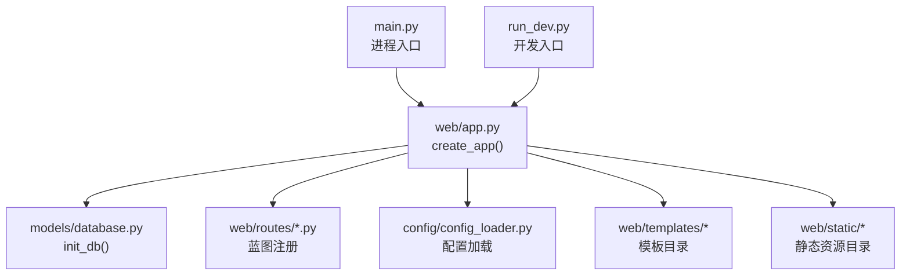
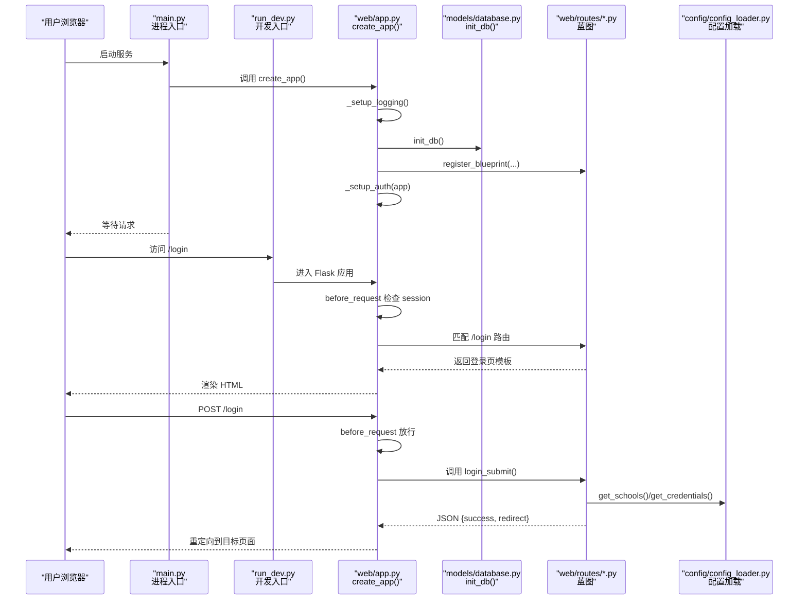
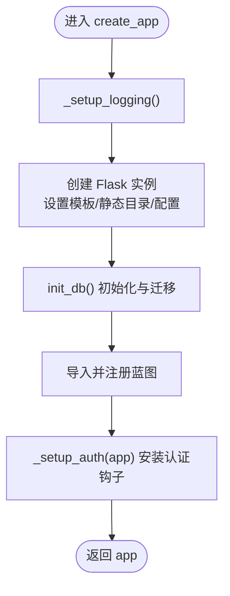
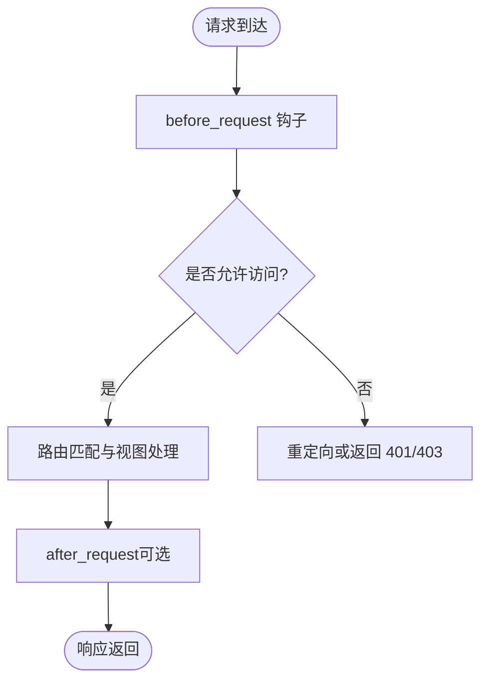
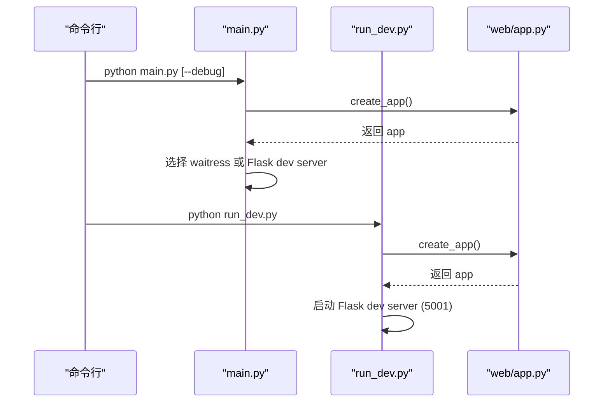
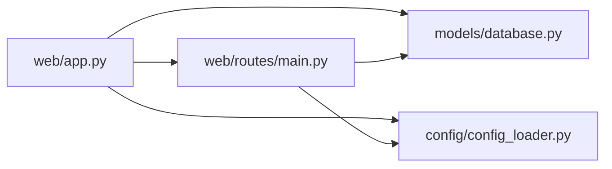

# 应用架构

<cite>
**本文引用的文件**   
- [main.py](file://main.py)
- [web/app.py](file://web/app.py)
- [run_dev.py](file://run_dev.py)
- [config/config_loader.py](file://config/config_loader.py)
- [models/database.py](file://models/database.py)
- [models/user.py](file://models/user.py)
- [web/routes/main.py](file://web/routes/main.py)
</cite>

## 目录
1. [简介](#简介)
2. [项目结构](#项目结构)
3. [核心组件](#核心组件)
4. [架构总览](#架构总览)
5. [详细组件分析](#详细组件分析)
6. [依赖关系分析](#依赖关系分析)
7. [性能考虑](#性能考虑)
8. [故障排查指南](#故障排查指南)
9. [结论](#结论)
10. [附录](#附录)

## 简介
本技术文档围绕 Flask 应用工厂模式，系统阐述 create_app 的实现原理与运行流程，涵盖应用初始化、配置设置、蓝图注册、认证中间件、模板与静态资源加载机制、日志系统、错误处理策略、开发/生产环境差异、启动流程、依赖注入模式、模块化设计最佳实践，以及扩展开发与自定义中间件方法、性能优化建议。目标是帮助读者快速理解并安全扩展该数据采集系统的 Web 层。

## 项目结构
本项目采用“按功能域分层 + 蓝图模块化”的组织方式：
- web/app.py：应用工厂 create_app，负责日志、Flask 实例化、数据库初始化、蓝图注册、认证钩子等。
- main.py / run_dev.py：进程入口，选择开发或生产服务器。
- config/config_loader.py：配置文件加载与校验、凭证覆盖、路径解析。
- models/*：数据模型与数据库初始化（SQLite）。
- web/routes/*：基于蓝图的模块路由。
- web/templates / web/static：模板与静态资源。

图示来源
- [main.py:1-42](file://main.py#L1-L42)
- [web/app.py:306-336](file://web/app.py#L306-L336)
- [run_dev.py:1-15](file://run_dev.py#L1-L15)
- [models/database.py:201-372](file://models/database.py#L201-L372)
- [config/config_loader.py:1-147](file://config/config_loader.py#L1-147)

章节来源
- [main.py:1-42](file://main.py#L1-L42)
- [web/app.py:306-336](file://web/app.py#L306-L336)
- [run_dev.py:1-15](file://run_dev.py#L1-L15)

## 核心组件
- 应用工厂 create_app
  - 初始化日志系统，创建 Flask 实例，设置模板与静态目录，配置密钥与模板自动重载。
  - 调用数据库初始化 init_db，确保表结构与增量迁移完成。
  - 导入并注册各功能蓝图（主页面、采集、导出、学校、用户、活动、图表），支持 URL 前缀隔离 API。
  - 安装认证 before_request 钩子、登录/登出路由、上下文处理器注入当前用户信息。
- 进程入口
  - main.py：根据命令行参数选择开发模式（Flask dev server）或生产模式（waitress WSGI）。
  - run_dev.py：固定端口 5001 的开发入口，便于避免冲突。
- 配置加载器
  - 提供 YAML 配置加载、必填字段校验、缓存、用户级凭证覆盖、Metabase 数据库路径解析等能力。
- 数据库与模型
  - SQLite 连接管理、WAL 模式、外键约束、表结构创建与增量迁移、默认管理员账户创建、首次从配置导入学校数据。
  - User 数据类封装用户属性、权限、凭据获取、持久化操作。
- 蓝图与路由
  - 以 Blueprint 组织路由，首页/仪表盘/历史记录等逻辑集中在 web/routes/main.py，体现高内聚低耦合。

章节来源
- [web/app.py:14-336](file://web/app.py#L14-L336)
- [main.py:10-41](file://main.py#L10-L41)
- [run_dev.py:1-15](file://run_dev.py#L1-L15)
- [config/config_loader.py:1-147](file://config/config_loader.py#L1-147)
- [models/database.py:201-372](file://models/database.py#L201-L372)
- [models/user.py:1-113](file://models/user.py#L1-L113)
- [web/routes/main.py:1-143](file://web/routes/main.py#L1-L143)

## 架构总览
下图展示应用启动到请求处理的端到端流程，包括工厂初始化、蓝图注册、认证拦截、模板渲染与 API 响应。

图示来源
- [main.py:10-41](file://main.py#L10-L41)
- [run_dev.py:1-15](file://run_dev.py#L1-L15)
- [web/app.py:306-336](file://web/app.py#L306-L336)
- [models/database.py:201-372](file://models/database.py#L201-L372)
- [config/config_loader.py:1-147](file://config/config_loader.py#L1-147)
- [web/routes/main.py:1-143](file://web/routes/main.py#L1-L143)

## 详细组件分析

### 应用工厂 create_app 实现原理
- 日志系统
  - 在应用启动时创建 logs 目录，配置根日志器输出到 app.log 与控制台，统一格式。
- Flask 实例化
  - 指定模板目录与静态目录为 web/templates 与 web/static；设置 SECRET_KEY 与 TEMPLATES_AUTO_RELOAD。
- 数据库初始化
  - 调用 init_db 执行建表与增量迁移，必要时导入初始数据（如默认管理员、学校列表）。
- 蓝图注册
  - 将多个功能模块以 Blueprint 形式注册，API 使用 url_prefix 进行命名空间隔离。
- 认证与上下文注入
  - 通过 before_request 对非公开路由进行会话校验；提供登录/登出路由；使用 context_processor 向模板注入 current_user。

图示来源
- [web/app.py:14-336](file://web/app.py#L14-L336)

章节来源
- [web/app.py:14-336](file://web/app.py#L14-L336)

### 应用生命周期管理与中间件顺序
- 生命周期阶段
  - 应用构建期：日志、实例化、配置、数据库初始化、蓝图注册、钩子安装。
  - 请求期：before_request -> 路由匹配 -> 视图函数 -> after_request（未显式注册则无额外处理）。
- 中间件/钩子顺序
  - before_request 优先于所有路由处理，用于统一鉴权与前置校验。
  - context_processor 在模板渲染前注入全局变量。
  - 若需更细粒度的请求/响应拦截，可在 create_app 中追加 @app.before_first_request（已弃用，建议使用应用上下文初始化）、@app.after_request 等。

图示来源
- [web/app.py:253-304](file://web/app.py#L253-L304)

章节来源
- [web/app.py:253-304](file://web/app.py#L253-L304)

### 模板与静态资源加载机制
- 模板目录
  - 通过 Flask 构造参数 template_folder 指向 web/templates，支持 render_template 与 render_template_string。
- 静态资源
  - static_folder 指向 web/static，可通过 url_for('static', filename='...') 引用 CSS/JS。
- 模板自动重载
  - TEMPLATES_AUTO_RELOAD=True 便于开发阶段即时生效。

章节来源
- [web/app.py:306-315](file://web/app.py#L306-L315)

### 日志系统配置
- 日志级别与格式
  - INFO 级别，包含时间、模块名、级别与消息体。
- 输出目标
  - 同时写入 logs/app.log 与控制台，便于调试与审计。
- 可扩展性
  - 可按环境切换 Handler（例如生产仅文件输出），或引入第三方库（structlog、loguru）增强结构化日志。

章节来源
- [web/app.py:14-25](file://web/app.py#L14-L25)

### 错误处理策略
- 认证错误
  - 未登录时对 /api/* 返回 JSON 401，其他页面重定向至 /login?next=...。
- 通用异常
  - 当前未注册全局错误处理器，建议在 create_app 中添加 @app.errorhandler(Exception) 统一捕获并返回友好响应。
- 建议
  - 区分业务异常与系统异常，记录堆栈，对外只暴露必要信息。

章节来源
- [web/app.py:256-292](file://web/app.py#L256-L292)

### 开发环境与生产环境的差异
- 开发环境
  - run_dev.py 使用 Flask dev server，开启 debug 与线程，端口 5001。
  - main.py 当检测到 --debug 参数时使用 Flask dev server，端口 5000。
- 生产环境
  - main.py 优先使用 waitress WSGI 服务器，多线程、稳定可靠；未安装时回退到 Flask dev server。
- 配置差异
  - 建议通过环境变量或配置文件控制 SECRET_KEY、DEBUG、日志级别、数据库路径等。

章节来源
- [main.py:10-41](file://main.py#L10-L41)
- [run_dev.py:1-15](file://run_dev.py#L1-L15)

### 启动流程
- 入口选择
  - 直接运行 main.py：根据参数选择开发/生产服务器。
  - 运行 run_dev.py：固定开发模式。
- 关键步骤
  - 调用 create_app 完成应用装配；随后启动对应 WSGI/Dev Server。

图示来源
- [main.py:10-41](file://main.py#L10-L41)
- [run_dev.py:1-15](file://run_dev.py#L1-L15)
- [web/app.py:306-336](file://web/app.py#L306-L336)

章节来源
- [main.py:10-41](file://main.py#L10-L41)
- [run_dev.py:1-15](file://run_dev.py#L1-L15)

### 依赖注入模式与模块化设计
- 依赖注入现状
  - 当前主要使用模块级导入与函数调用（如 from models.user import User），未在应用上下文中集中注册服务实例。
- 改进建议
  - 在 create_app 中集中创建共享对象（数据库连接池、HTTP 客户端、配置对象），并通过 app.config 或 g 对象注入到视图与模型。
  - 使用工厂函数或类封装外部依赖（如爬虫、导出器），在视图层按需获取，降低耦合度。
- 模块化最佳实践
  - 蓝图按领域划分，保持路由与业务逻辑内聚；跨模块共享逻辑放入 services 或 utils。
  - 配置与环境相关项集中管理，避免硬编码。

章节来源
- [web/app.py:316-335](file://web/app.py#L316-L335)
- [web/routes/main.py:1-143](file://web/routes/main.py#L1-L143)

### 扩展开发指导
- 新增蓝图
  - 在 web/routes 下新建模块，定义 Blueprint 并在 create_app 中 register_blueprint。
- 新增配置项
  - 在 config/config_loader.py 的 load_config/_validate 中增加校验与默认值，并提供便捷读取函数。
- 新增数据模型
  - 在 models 下新增数据类，并在 database.py 的 init_db 中维护表结构与迁移逻辑。
- 新增 API
  - 在对应蓝图文件中添加路由，遵循 RESTful 风格，返回 JSON 响应。

章节来源
- [web/app.py:316-335](file://web/app.py#L316-L335)
- [config/config_loader.py:21-74](file://config/config_loader.py#L21-L74)
- [models/database.py:201-372](file://models/database.py#L201-L372)

### 自定义中间件开发方法
- 基于 Flask 钩子
  - before_request：统一鉴权、限流、请求体预处理。
  - after_request：统一响应头、CORS、耗时统计。
  - teardown_appcontext：资源清理、事务回滚。
- 基于 WSGI 中间件
  - 在 main.py 中将 app 包裹在自定义 WSGI 中间件中，实现跨框架的横切关注点（如指标上报、链路追踪）。
- 示例思路
  - 在 create_app 中注册 @app.after_request 计算请求耗时并写入日志；或在 WSGI 层包装计时与异常收集。

章节来源
- [web/app.py:253-304](file://web/app.py#L253-L304)
- [main.py:20-37](file://main.py#L20-L37)

### 性能优化建议
- 数据库
  - 启用 WAL 模式与外键约束，减少锁竞争；对高频查询字段建立索引（SQLite 可用 PRAGMA 或迁移脚本）。
  - 批量写入时使用事务包裹，减少提交次数。
- 应用层
  - 避免在 before_request 中进行昂贵 I/O；将热点数据缓存到内存或 Redis。
  - 模板渲染尽量复用上下文，减少重复查询。
- 部署层
  - 生产使用 waitress 或多进程部署（gunicorn/uwsgi），合理设置线程/进程数。
  - 静态资源交由反向代理（Nginx/Caddy）缓存与压缩。

章节来源
- [models/database.py:24-48](file://models/database.py#L24-L48)
- [main.py:20-37](file://main.py#L20-L37)

## 依赖关系分析
- 模块耦合
  - web/app.py 作为装配中心，依赖 models/database.py、config/config_loader.py 与各蓝图模块。
  - 路由模块依赖模型与配置加载器，形成“路由 -> 模型/配置”的单向依赖。
- 潜在循环依赖
  - 当前未发现明显循环导入；但应避免在模块顶层进行重型初始化，必要时延迟导入。
- 外部依赖
  - Flask、waitress、PyYAML、sqlite3（标准库）。

图示来源
- [web/app.py:306-336](file://web/app.py#L306-L336)
- [web/routes/main.py:1-143](file://web/routes/main.py#L1-L143)
- [models/database.py:201-372](file://models/database.py#L201-L372)
- [config/config_loader.py:1-147](file://config/config_loader.py#L1-147)

章节来源
- [web/app.py:306-336](file://web/app.py#L306-L336)
- [web/routes/main.py:1-143](file://web/routes/main.py#L1-L143)
- [models/database.py:201-372](file://models/database.py#L201-L372)
- [config/config_loader.py:1-147](file://config/config_loader.py#L1-147)

## 性能考虑
- 数据库层面
  - 使用 WAL 提升并发读性能；对频繁过滤字段（如 school_name、year、week_number）建立索引。
  - 批量插入/更新使用事务，减少磁盘同步开销。
- 应用层面
  - 将配置与热点字典缓存到内存；避免在请求路径中执行阻塞 I/O。
  - 模板渲染前预取必要数据，减少 N+1 查询。
- 部署层面
  - 生产使用 waitress/gunicorn 多进程；静态资源由反向代理缓存；开启 gzip 压缩。

[本节为通用性能建议，不直接分析具体文件]

## 故障排查指南
- 无法登录
  - 检查 before_request 是否放行 /login 与 /api/*；确认 session 是否被正确设置。
- 模板未更新
  - 确认 TEMPLATES_AUTO_RELOAD 是否为 True；检查模板路径是否正确。
- 数据库异常
  - 查看 logs/app.log 中的 SQL 错误；确认 data/app.db 可写；检查迁移脚本是否成功执行。
- 配置缺失
  - 确认 config.yaml 存在且包含必填字段；使用 load_config(force_reload=True) 强制刷新缓存。

章节来源
- [web/app.py:256-292](file://web/app.py#L256-L292)
- [web/app.py:306-315](file://web/app.py#L306-L315)
- [models/database.py:201-372](file://models/database.py#L201-L372)
- [config/config_loader.py:21-36](file://config/config_loader.py#L21-L36)

## 结论
本项目通过应用工厂模式实现了清晰的初始化流程与模块化路由组织，结合 SQLite 与轻量配置加载器，满足数据采集系统的 Web 需求。建议在后续迭代中完善全局错误处理、引入统一的依赖注入机制、加强生产环境监控与日志结构化，以提升可维护性与稳定性。

[本节为总结性内容，不直接分析具体文件]

## 附录
- 常用命令
  - 开发模式：python run_dev.py
  - 生产模式：python main.py
  - 调试模式：python main.py --debug
- 关键路径
  - 应用工厂：web/app.py:create_app
  - 数据库初始化：models/database.py:init_db
  - 配置加载：config/config_loader.py:load_config

[本节为补充说明，不直接分析具体文件]