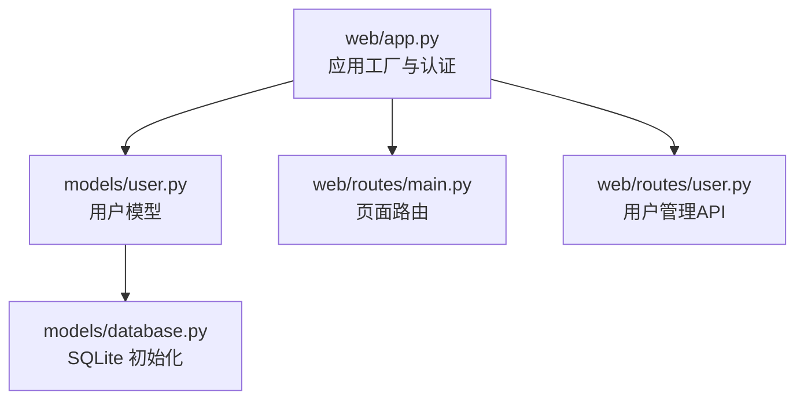
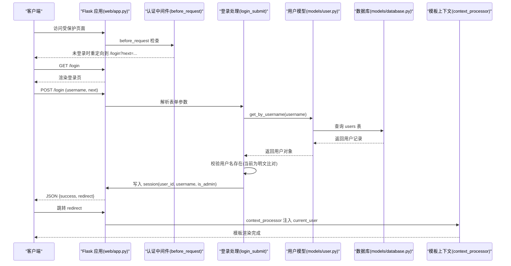
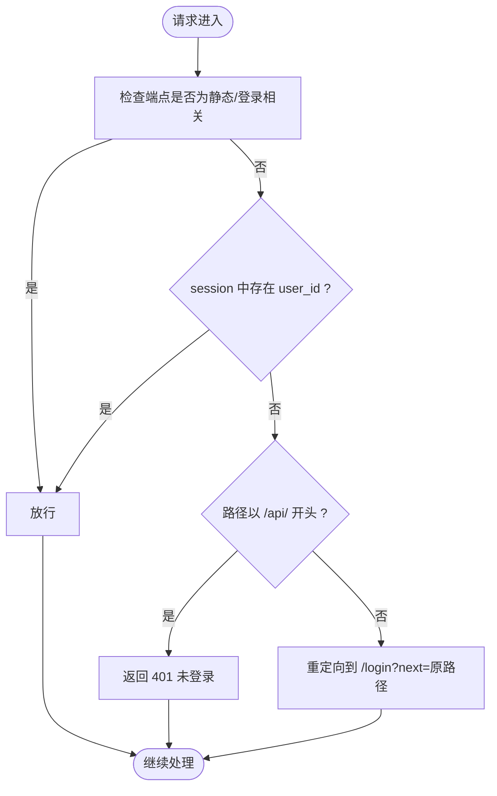
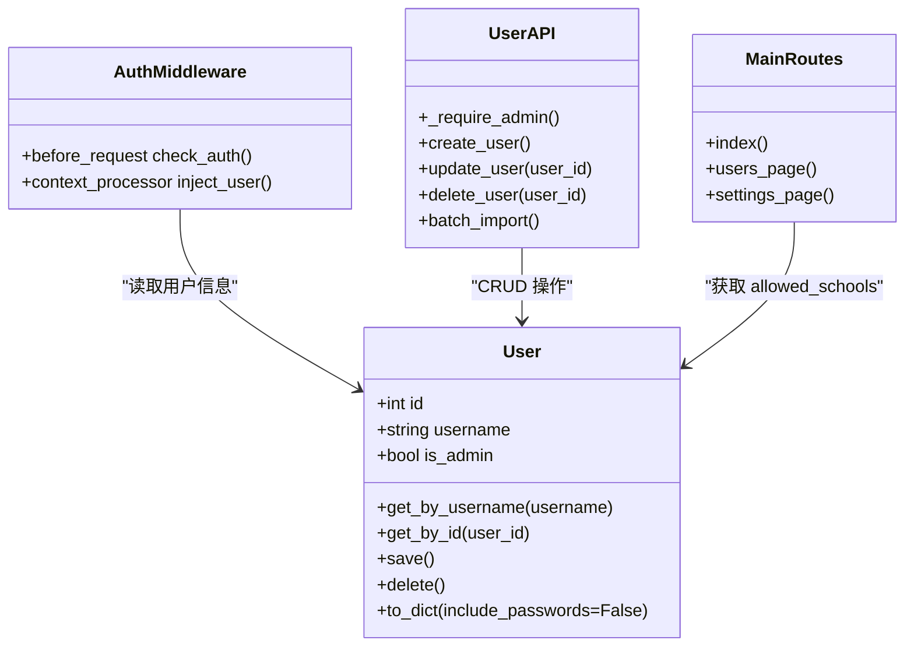
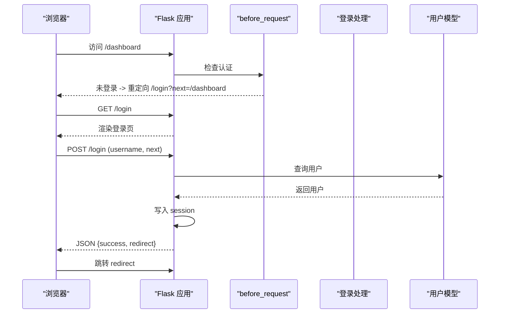
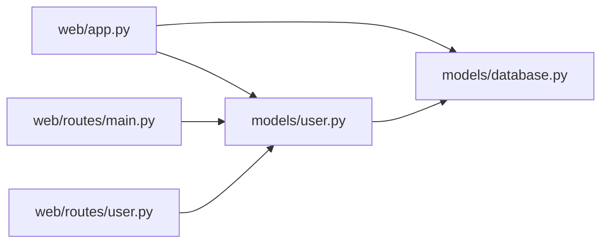

# 用户认证

<cite>
**本文引用的文件**   
- [web/app.py](file://middle-platform-data-collector-master/web/app.py)
- [models/user.py](file://middle-platform-data-collector-master/models/user.py)
- [models/database.py](file://middle-platform-data-collector-master/models/database.py)
- [web/routes/main.py](file://middle-platform-data-collector-master/web/routes/main.py)
- [web/routes/user.py](file://middle-platform-data-collector-master/web/routes/user.py)
</cite>

## 目录
1. [简介](#简介)
2. [项目结构](#项目结构)
3. [核心组件](#核心组件)
4. [架构总览](#架构总览)
5. [详细组件分析](#详细组件分析)
6. [依赖关系分析](#依赖关系分析)
7. [性能与安全考量](#性能与安全考量)
8. [故障排查指南](#故障排查指南)
9. [结论](#结论)

## 简介
本技术文档聚焦于系统“用户认证”子系统，围绕以下目标展开：
- Session 管理机制：会话创建、存储与销毁的完整流程
- 密码加密存储方案现状与改进建议
- 用户权限控制模型：管理员与普通用户的差异
- 登录拦截器实现：before_request 钩子、未登录重定向逻辑
- 用户信息上下文注入与模板展示
- 登出功能实现
- 安全最佳实践：CSRF 防护与会话劫持防护

## 项目结构
认证相关代码主要分布在应用工厂与路由模块中：
- web/app.py：Flask 应用工厂、认证初始化（before_request、登录/登出、上下文注入）
- models/user.py：用户数据模型与数据库交互
- models/database.py：SQLite 初始化、默认管理员账户创建
- web/routes/main.py：页面路由与基于角色的数据可见性过滤
- web/routes/user.py：用户管理 API（含管理员校验）

图表来源
- [web/app.py:306-336](file://middle-platform-data-collector-master/web/app.py#L306-L336)
- [models/user.py:1-113](file://middle-platform-data-collector-master/models/user.py#L1-L113)
- [models/database.py:201-372](file://middle-platform-data-collector-master/models/database.py#L201-L372)
- [web/routes/main.py:1-143](file://middle-platform-data-collector-master/web/routes/main.py#L1-L143)
- [web/routes/user.py:1-356](file://middle-platform-data-collector-master/web/routes/user.py#L1-L356)

章节来源
- [web/app.py:306-336](file://middle-platform-data-collector-master/web/app.py#L306-L336)
- [models/database.py:201-372](file://middle-platform-data-collector-master/models/database.py#L201-L372)

## 核心组件
- 认证中间件（before_request）：在请求进入业务路由前检查 session 是否包含 user_id；若缺失则根据路径类型返回 401 或重定向到登录页并携带 next 参数。
- 登录接口：GET /login 渲染登录页，POST /login 提交用户名进行验证，成功后写入 session 中的 user_id、username、is_admin。
- 登出接口：/logout 清空 session 并重定向至登录页。
- 上下文注入：通过 context_processor 将当前用户信息注入模板变量 current_user，供前端模板统一展示。
- 用户模型：提供按用户名查询、按 ID 查询、保存/删除等方法；authenticate 方法用于比对用户名与明文密码。
- 权限控制：在用户管理 API 中使用 _require_admin 校验 is_admin；在页面路由中依据 is_admin 决定数据可见范围。

章节来源
- [web/app.py:253-303](file://middle-platform-data-collector-master/web/app.py#L253-L303)
- [models/user.py:54-77](file://middle-platform-data-collector-master/models/user.py#L54-L77)
- [web/routes/user.py:15-18](file://middle-platform-data-collector-master/web/routes/user.py#L15-L18)
- [web/routes/main.py:13-24](file://middle-platform-data-collector-master/web/routes/main.py#L13-L24)

## 架构总览
下图展示了认证相关的整体调用链与数据流：

图表来源
- [web/app.py:256-292](file://middle-platform-data-collector-master/web/app.py#L256-L292)
- [models/user.py:67-77](file://middle-platform-data-collector-master/models/user.py#L67-L77)
- [models/database.py:284-298](file://middle-platform-data-collector-master/models/database.py#L284-L298)

## 详细组件分析

### 会话管理机制（创建、存储、销毁）
- 会话创建
  - 登录成功时，服务端在 session 中写入 user_id、username、is_admin。
  - 后续请求由 before_request 钩子读取 session.get("user_id") 判断是否已登录。
- 会话存储
  - 使用 Flask 内置的签名 Cookie 会话机制（依赖 SECRET_KEY）。
  - 注意：SECRET_KEY 目前为固定字符串，生产环境需改为强随机值。
- 会话销毁
  - 登出接口调用 session.clear() 清空所有会话数据，并重定向到登录页。

图表来源
- [web/app.py:256-263](file://middle-platform-data-collector-master/web/app.py#L256-L263)

章节来源
- [web/app.py:256-292](file://middle-platform-data-collector-master/web/app.py#L256-L292)

### 密码加密存储方案
- 现状
  - 用户模型 authenticate 方法直接比较用户名与明文密码。
  - 数据库 users 表中 password 字段为文本类型，无额外哈希列。
  - 首次启动时创建默认管理员账户，密码为明文。
- 风险
  - 明文存储与比对存在严重安全风险，易被泄露与滥用。
- 改进建议
  - 引入安全的密码哈希算法（如 bcrypt/argon2），在保存与登录时分别执行哈希与比对。
  - 新增 password_hash 字段，迁移现有明文密码为哈希值。
  - 禁止在 to_dict 输出中包含任何敏感字段。

章节来源
- [models/user.py:73-77](file://middle-platform-data-collector-master/models/user.py#L73-L77)
- [models/database.py:363-369](file://middle-platform-data-collector-master/models/database.py#L363-L369)

### 用户权限控制模型（管理员 vs 普通用户）
- 角色标识
  - 用户模型包含 is_admin 布尔字段，登录后写入 session["is_admin"]。
- 管理员能力
  - 可访问用户管理页面与 API（创建、更新、删除用户，批量导入等）。
  - 可查看所有学校与记录数据。
- 普通用户能力
  - 仅能修改自身平台凭证与密码。
  - 仅能查看 assigned_schools 范围内的学校与记录。
- 权限校验
  - 用户管理 API 使用 _require_admin 快速返回 403。
  - 页面路由根据 is_admin 决定是否允许访问特定页面。

图表来源
- [models/user.py:1-113](file://middle-platform-data-collector-master/models/user.py#L1-L113)
- [web/app.py:294-303](file://middle-platform-data-collector-master/web/app.py#L294-L303)
- [web/routes/user.py:15-18](file://middle-platform-data-collector-master/web/routes/user.py#L15-L18)
- [web/routes/main.py:13-24](file://middle-platform-data-collector-master/web/routes/main.py#L13-L24)

章节来源
- [web/routes/user.py:15-18](file://middle-platform-data-collector-master/web/routes/user.py#L15-L18)
- [web/routes/main.py:13-24](file://middle-platform-data-collector-master/web/routes/main.py#L13-L24)

### 登录拦截器与未登录重定向逻辑
- before_request 钩子
  - 对 static、login_page、login_submit 端点放行。
  - 若 session 缺少 user_id：
    - 对于 /api/* 请求返回 401 JSON。
    - 其他请求重定向到 /login?next=原路径。
- 登录页与提交
  - GET /login 渲染登录模板，支持 error 与 next 参数。
  - POST /login 接收 username 与 next，校验用户存在后写入 session 并返回 JSON。
- 未登录重定向
  - 前端收到 success 响应后跳转到 redirect 地址。

图表来源
- [web/app.py:256-287](file://middle-platform-data-collector-master/web/app.py#L256-L287)

章节来源
- [web/app.py:256-287](file://middle-platform-data-collector-master/web/app.py#L256-L287)

### 用户信息上下文注入与模板展示
- 通过 context_processor 在每个请求中注入 current_user。
- 若 session 中有 user_id，则加载用户对象并转换为字典；否则注入 None。
- 模板可直接使用 {{ current_user }} 显示用户名、是否管理员等信息。

章节来源
- [web/app.py:294-303](file://middle-platform-data-collector-master/web/app.py#L294-L303)

### 登出功能实现
- /logout 路由清空 session 并重定向到 /login。
- 前端可在退出按钮处调用该路由完成登出。

章节来源
- [web/app.py:289-292](file://middle-platform-data-collector-master/web/app.py#L289-L292)

## 依赖关系分析
- 应用层依赖
  - web/app.py 依赖 models.user.User 进行用户查询与转换。
  - web/routes.main 与 web.routes.user 均依赖 models.user.User 与 models.database.init_db。
- 数据层依赖
  - models.user.User 通过 models.database.get_connection 访问 SQLite。
- 配置依赖
  - web/app.py 设置 SECRET_KEY 用于签名会话。

图表来源
- [web/app.py:306-336](file://middle-platform-data-collector-master/web/app.py#L306-L336)
- [models/user.py:1-113](file://middle-platform-data-collector-master/models/user.py#L1-L113)
- [models/database.py:201-372](file://middle-platform-data-collector-master/models/database.py#L201-L372)
- [web/routes/main.py:1-143](file://middle-platform-data-collector-master/web/routes/main.py#L1-L143)
- [web/routes/user.py:1-356](file://middle-platform-data-collector-master/web/routes/user.py#L1-L356)

章节来源
- [web/app.py:306-336](file://middle-platform-data-collector-master/web/app.py#L306-L336)
- [models/user.py:1-113](file://middle-platform-data-collector-master/models/user.py#L1-L113)
- [models/database.py:201-372](file://middle-platform-data-collector-master/models/database.py#L201-L372)

## 性能与安全考量
- 性能
  - 登录流程涉及一次数据库查询，复杂度 O(1)。
  - 每次请求的 before_request 仅做轻量 session 读取，开销极低。
- 安全
  - 当前密码为明文存储与比对，存在高风险，应尽快升级为哈希存储。
  - SECRET_KEY 为固定字符串，需替换为高强度随机值，防止会话伪造。
  - CSRF 防护：当前未启用 CSRF 令牌，建议在表单提交与 API 中引入 CSRF Token 或使用 SameSite Cookie 策略。
  - 会话劫持防护：
    - 启用 HTTPS，设置 Secure Cookie。
    - 设置 HttpOnly Cookie，避免前端脚本读取。
    - 定期轮换 SECRET_KEY，并在必要时强制失效旧会话。
    - 对敏感操作增加二次确认或验证码。

[本节为通用指导，不直接分析具体文件]

## 故障排查指南
- 无法登录
  - 检查用户名是否存在；当前实现仅校验用户名存在，不校验密码。
  - 确认 session 是否成功写入 user_id、username、is_admin。
- 访问受限页面被重定向
  - 确认 before_request 是否正确放行静态资源与登录端点。
  - 检查 next 参数是否正确拼接。
- 管理员功能不可用
  - 确认 session["is_admin"] 是否为真。
  - 检查用户管理 API 的 _require_admin 是否返回 403。
- 默认管理员问题
  - 首次启动会创建默认管理员账户，请确保初始密码安全并及时修改。

章节来源
- [web/app.py:256-292](file://middle-platform-data-collector-master/web/app.py#L256-L292)
- [web/routes/user.py:15-18](file://middle-platform-data-collector-master/web/routes/user.py#L15-L18)
- [models/database.py:363-369](file://middle-platform-data-collector-master/models/database.py#L363-L369)

## 结论
本系统的认证模块实现了基础的会话管理与权限控制，具备登录、登出、上下文注入与基本的前后端分离式鉴权。然而，密码明文存储与固定密钥存在显著安全隐患，建议优先实施密码哈希与密钥轮换，并完善 CSRF 与会话安全策略，以提升整体安全性与合规性。