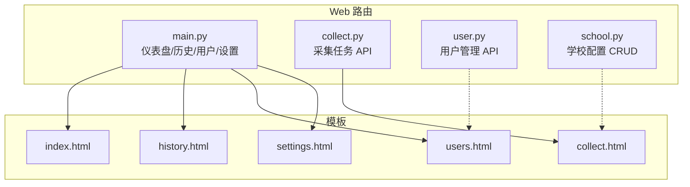
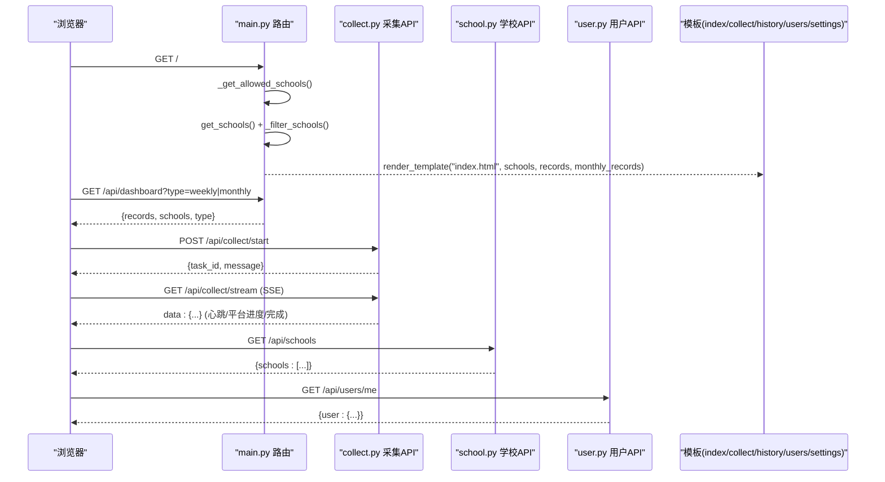
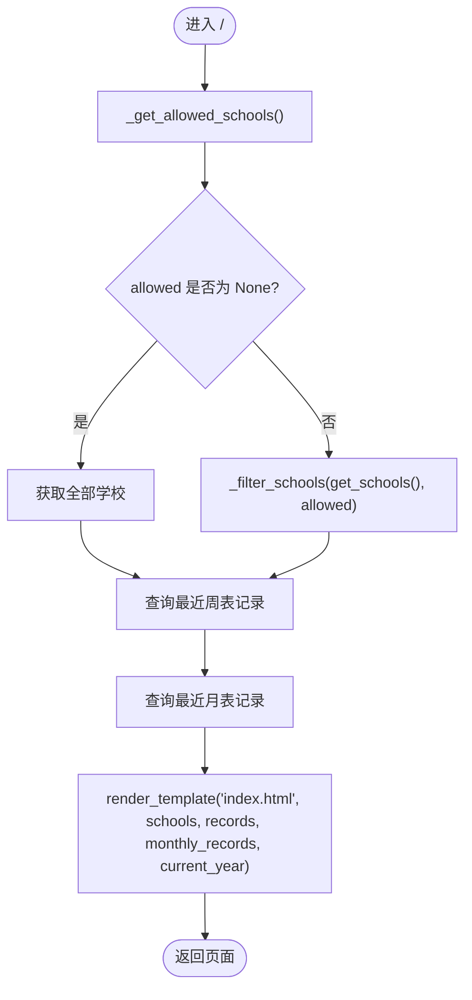
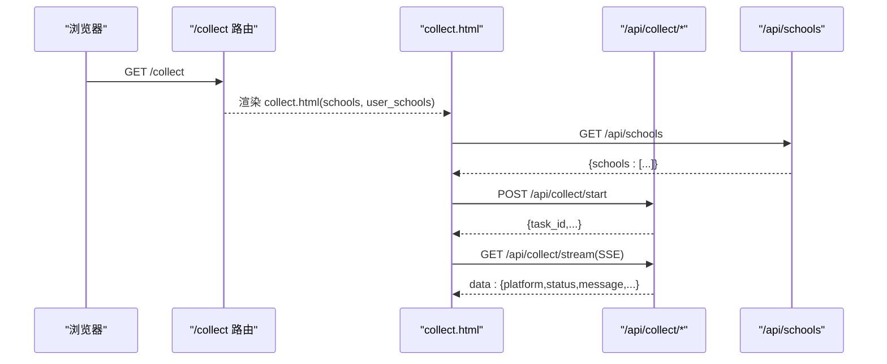
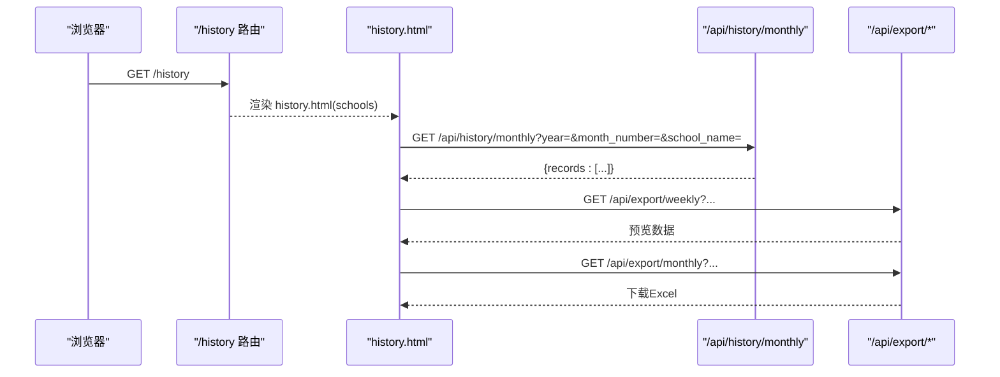
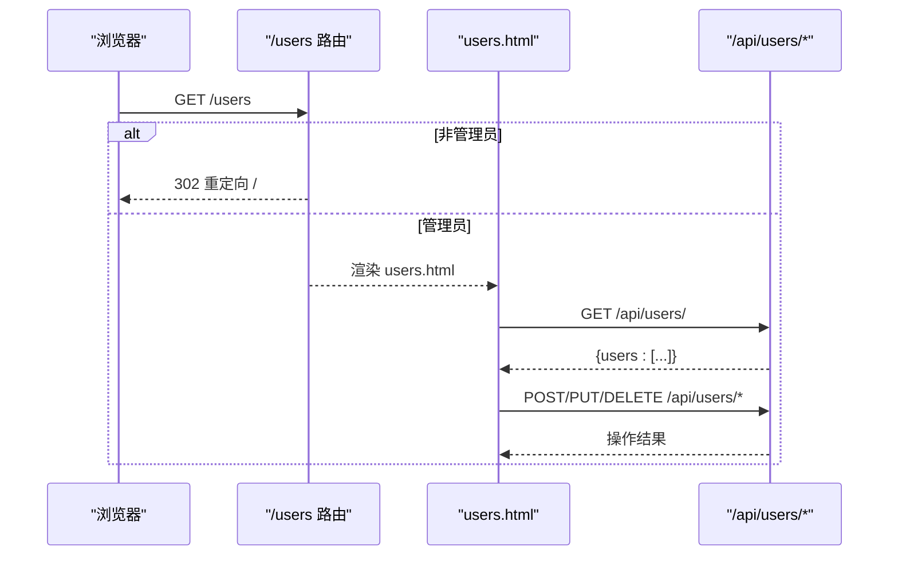
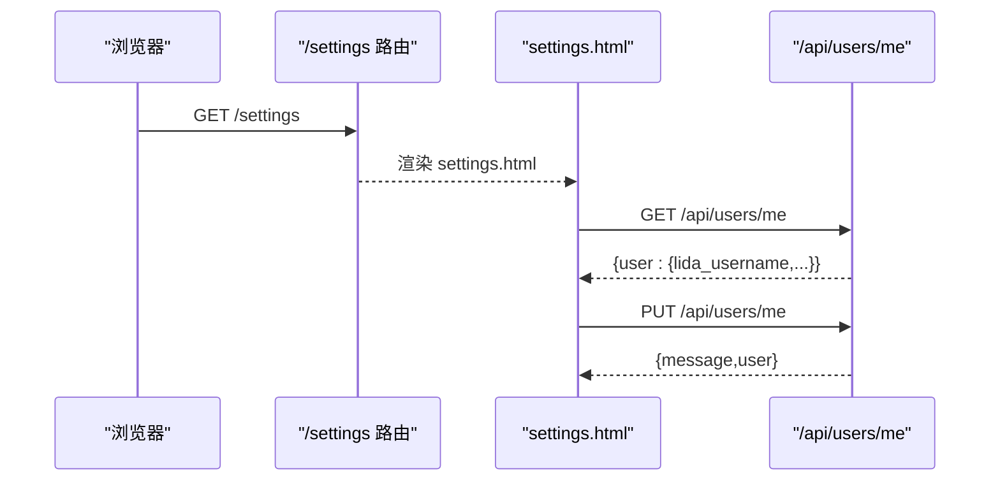
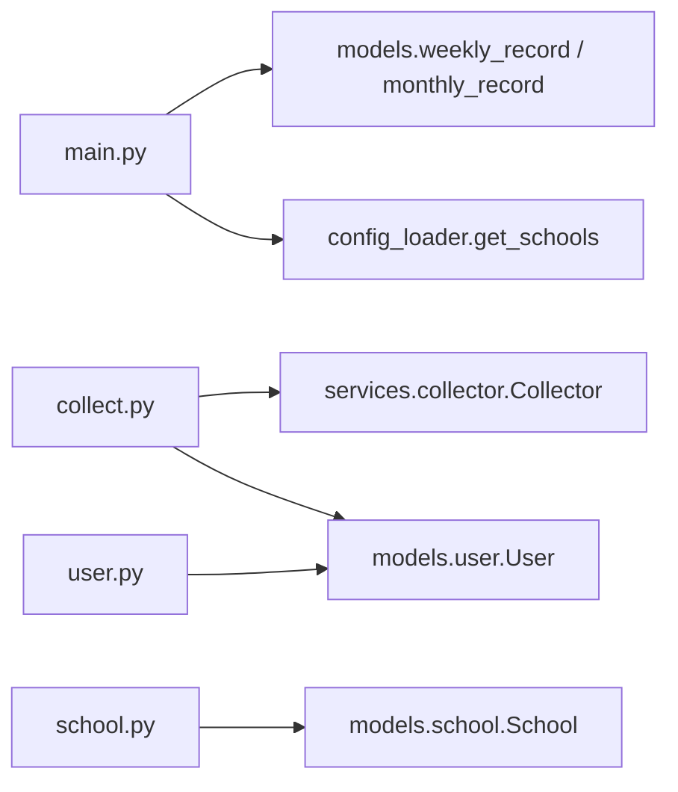

# 主要页面路由

<cite>
**本文引用的文件**   
- [web/routes/main.py](file://web/routes/main.py)
- [web/routes/collect.py](file://web/routes/collect.py)
- [web/routes/user.py](file://web/routes/user.py)
- [web/routes/school.py](file://web/routes/school.py)
- [web/templates/index.html](file://web/templates/index.html)
- [web/templates/collect.html](file://web/templates/collect.html)
- [web/templates/history.html](file://web/templates/history.html)
- [web/templates/users.html](file://web/templates/users.html)
- [web/templates/settings.html](file://web/templates/settings.html)
</cite>

## 更新摘要
**所做更改**   
- 增强了仪表盘 API (/api/dashboard)，支持周表和月表数据的灵活切换与过滤
- 优化了历史记录查询功能，支持动态记录类型切换和学校特定数据过滤
- 改进了权限控制机制，确保用户只能访问其被授权的学校数据
- 更新了模板渲染逻辑，支持更丰富的筛选条件和数据展示

## 目录
1. [简介](#简介)
2. [项目结构](#项目结构)
3. [核心组件](#核心组件)
4. [架构总览](#架构总览)
5. [详细组件分析](#详细组件分析)
6. [依赖关系分析](#依赖关系分析)
7. [性能考虑](#性能考虑)
8. [故障排查指南](#故障排查指南)
9. [结论](#结论)
10. [附录：API 接口说明](#附录api-接口说明)

## 简介
本技术文档聚焦"主要页面路由模块"，覆盖仪表盘首页、数据采集页、历史记录页、用户管理页与个人设置页的路由实现。重点阐述：
- 权限控制机制（管理员与普通用户的访问控制）
- 学校数据过滤（_get_allowed_schools 与 _filter_schools 的作用）
- 模板渲染的数据传递（schools、records 等变量）
- 关键 API 接口（如 /dashboard、/history/monthly）的请求参数、响应格式与错误处理
- 实际使用场景与调用流程

**更新** 本次更新重点增强了仪表盘 API 的灵活性，支持周表和月表数据的动态切换，以及更精细的学校数据过滤能力。

## 项目结构
围绕 Web 层，主要路由以 Flask Blueprint 组织，按功能拆分到 routes 目录；模板位于 templates 目录；前端通过 AJAX/SSE 与后端交互。

**图表来源**
- [web/routes/main.py:1-133](file://web/routes/main.py#L1-L133)
- [web/routes/collect.py:1-170](file://web/routes/collect.py#L1-L170)
- [web/routes/user.py:1-356](file://web/routes/user.py#L1-L356)
- [web/routes/school.py:1-256](file://web/routes/school.py#L1-L256)
- [web/templates/index.html:1-1016](file://web/templates/index.html#L1-L1016)
- [web/templates/collect.html:1-776](file://web/templates/collect.html#L1-L776)
- [web/templates/history.html:1-475](file://web/templates/history.html#L1-L475)
- [web/templates/users.html:1-400](file://web/templates/users.html#L1-L400)
- [web/templates/settings.html:1-146](file://web/templates/settings.html#L1-L146)

## 核心组件
- 仪表盘与历史路由（main.py）
  - 提供首页、采集入口、历史记录、用户管理、个人设置页面路由
  - 内置学校可见性过滤逻辑与记录过滤逻辑
  - **新增** 增强的仪表盘 API，支持周表和月表数据的灵活切换
- 采集任务路由（collect.py）
  - 启动/暂停/继续/状态查询/进度流（SSE）
- 用户管理路由（user.py）
  - 用户列表、当前用户信息、更新、创建、删除、批量导入
- 学校配置路由（school.py）
  - 学校列表、新增、编辑、删除（含权限校验）

## 架构总览
整体采用"路由蓝图 + 模板渲染 + JSON API + SSE 实时推送"的架构。页面请求由 main.py 路由负责渲染模板并注入数据；采集任务由 collect.py 驱动后台服务并通过 SSE 向前端推送进度；用户与学校管理通过 user.py 与 school.py 暴露 RESTful API。

**图表来源**
- [web/routes/main.py:41-133](file://web/routes/main.py#L41-L133)
- [web/routes/collect.py:22-170](file://web/routes/collect.py#L22-L170)
- [web/routes/school.py:63-256](file://web/routes/school.py#L63-L256)
- [web/routes/user.py:21-356](file://web/routes/user.py#L21-L356)
- [web/templates/index.html:1-1016](file://web/templates/index.html#L1-L1016)
- [web/templates/collect.html:1-776](file://web/templates/collect.html#L1-L776)

## 详细组件分析

### 仪表盘首页（/）
- 路由职责
  - 计算当前用户可见学校集合
  - 获取最近周表与月表记录并按学校过滤
  - 渲染 index.html，传入 schools、records、monthly_records、current_year
- 权限与数据过滤
  - _get_allowed_schools：管理员返回 None（表示全部），普通用户返回 assigned_schools 列表
  - _filter_schools：当 allowed 为 None 时返回全部学校，否则仅保留允许的学校
  - _filter_records：对记录按 school_name 进行同策略过滤
- 模板渲染
  - index.html 使用 schools 渲染统计卡片与表格行，records 与 monthly_records 分别用于周表与月表展示

**图表来源**
- [web/routes/main.py:13-74](file://web/routes/main.py#L13-L74)
- [web/templates/index.html:1-1016](file://web/templates/index.html#L1-L1016)

**章节来源**
- [web/routes/main.py:13-74](file://web/routes/main.py#L13-L74)
- [web/templates/index.html:1-1016](file://web/templates/index.html#L1-L1016)

### 数据采集页（/collect）
- 路由职责
  - 根据权限过滤学校列表，渲染 collect.html
  - 将 user_schools 传递给前端，用于限制勾选范围
- 前端交互
  - 支持周表/月表模式切换、数据源选择（Grafana/数据库直查）
  - 提交表单至 /api/collect/start，成功后连接 /api/collect/stream 接收 SSE 进度事件
  - 页面内嵌学校管理弹窗，调用 /api/schools 进行增删改查

**图表来源**
- [web/routes/main.py:47-62](file://web/routes/main.py#L47-L62)
- [web/routes/collect.py:22-170](file://web/routes/collect.py#L22-L170)
- [web/routes/school.py:63-256](file://web/routes/school.py#L63-L256)
- [web/templates/collect.html:1-776](file://web/templates/collect.html#L1-L776)

**章节来源**
- [web/routes/main.py:47-62](file://web/routes/main.py#L47-L62)
- [web/routes/collect.py:22-170](file://web/routes/collect.py#L22-L170)
- [web/routes/school.py:63-256](file://web/routes/school.py#L63-L256)
- [web/templates/collect.html:1-776](file://web/templates/collect.html#L1-L776)

### 历史记录页（/history）
- 路由职责
  - 根据权限过滤学校列表，渲染 history.html
- 前端交互
  - 周表查询：构建筛选条件后调用导出预览接口（/api/export/preview）
  - 月表查询：调用 /api/history/monthly 获取月度记录
  - 导出 Excel：分别调用 /api/export/weekly 与 /api/export/monthly
  - **新增** 支持动态记录类型切换和灵活的筛选条件

**图表来源**
- [web/routes/main.py:65-74](file://web/routes/main.py#L65-L74)
- [web/routes/main.py:98-118](file://web/routes/main.py#L98-L118)
- [web/templates/history.html:1-475](file://web/templates/history.html#L1-L475)

**章节来源**
- [web/routes/main.py:65-74](file://web/routes/main.py#L65-L74)
- [web/routes/main.py:98-118](file://web/routes/main.py#L98-L118)
- [web/templates/history.html:1-475](file://web/templates/history.html#L1-L475)

### 用户管理页（/users）
- 路由职责
  - 仅管理员可访问，非管理员重定向至首页
  - 渲染 users.html，前端通过 /api/users/* 完成用户管理与批量导入
- 权限控制
  - 页面级：session.is_admin 检查
  - API 级：_require_admin 统一拦截

**图表来源**
- [web/routes/main.py:121-126](file://web/routes/main.py#L121-L126)
- [web/routes/user.py:15-356](file://web/routes/user.py#L15-L356)
- [web/templates/users.html:1-400](file://web/templates/users.html#L1-L400)

**章节来源**
- [web/routes/main.py:121-126](file://web/routes/main.py#L121-L126)
- [web/routes/user.py:15-356](file://web/routes/user.py#L15-L356)
- [web/templates/users.html:1-400](file://web/templates/users.html#L1-L400)

### 个人设置页（/settings）
- 路由职责
  - 渲染 settings.html，前端通过 /api/users/me 读取与更新凭证
- 权限控制
  - 页面级无额外限制
  - API 级：未登录返回 401；更新字段受角色与字段白名单约束

**图表来源**
- [web/routes/main.py:129-133](file://web/routes/main.py#L129-L133)
- [web/routes/user.py:27-68](file://web/routes/user.py#L27-L68)
- [web/templates/settings.html:1-146](file://web/templates/settings.html#L1-L146)

**章节来源**
- [web/routes/main.py:129-133](file://web/routes/main.py#L129-L133)
- [web/routes/user.py:27-68](file://web/routes/user.py#L27-L68)
- [web/templates/settings.html:1-146](file://web/templates/settings.html#L1-L146)

## 依赖关系分析
- 路由间耦合
  - main.py 依赖模型（WeeklyRecord、MonthlyRecord）、配置加载器（get_schools）与模板
  - collect.py 依赖 Collector 单例与 User 模型，用于设置用户凭证覆盖
  - user.py 与 school.py 提供独立的管理能力，被前端模板直接调用
- 外部依赖
  - openpyxl（用户导入模板生成与解析）
  - requests（图表模块中对外部 API 的调用，不在本次重点）
- 潜在循环依赖
  - main.py 在 _get_allowed_schools 中动态 from models.user import User，避免顶层循环导入

**图表来源**
- [web/routes/main.py:1-10](file://web/routes/main.py#L1-L10)
- [web/routes/collect.py:1-16](file://web/routes/collect.py#L1-L16)
- [web/routes/user.py:1-12](file://web/routes/user.py#L1-L12)
- [web/routes/school.py:1-6](file://web/routes/school.py#L1-L6)

**章节来源**
- [web/routes/main.py:1-10](file://web/routes/main.py#L1-L10)
- [web/routes/collect.py:1-16](file://web/routes/collect.py#L1-L16)
- [web/routes/user.py:1-12](file://web/routes/user.py#L1-L12)
- [web/routes/school.py:1-6](file://web/routes/school.py#L1-L6)

## 性能考虑
- 学校过滤与记录过滤在内存中进行，适合中小规模数据；若学校或记录量较大，建议在后端增加分页与索引优化
- SSE 长连接需合理设置超时与心跳，避免资源泄露
- 批量导入使用 openpyxl 只读模式，减少内存占用
- **新增** 仪表盘 API 支持缓存策略，减少重复查询的性能开销

## 故障排查指南
- 权限相关
  - 访问 /users 被重定向：确认 session.is_admin 是否设置
  - 修改他人用户信息返回 403：确认当前用户是否管理员或目标用户为自己
- 采集任务
  - 启动失败提示"已有采集任务正在执行"：等待任务完成或暂停/恢复后再试
  - SSE 断开：前端会轮询 /api/collect/status 判断任务状态，必要时重新订阅
- 学校数据不可见
  - 普通用户看不到某些学校：检查 assigned_schools 与 _get_allowed_schools 返回值
- **新增** 仪表盘数据问题
  - 周表/月表数据切换异常：检查 type 参数是否正确传递
  - 学校过滤不生效：确认用户权限配置与 _filter_schools 函数逻辑

**章节来源**
- [web/routes/main.py:121-133](file://web/routes/main.py#L121-L133)
- [web/routes/user.py:102-356](file://web/routes/user.py#L102-L356)
- [web/routes/collect.py:64-170](file://web/routes/collect.py#L64-L170)

## 结论
该路由模块以清晰的蓝图划分职责，结合会话权限与学校分配实现细粒度数据隔离；通过模板渲染与 JSON API 分离前后端关注点，并以 SSE 提供实时采集反馈。整体设计易于扩展与维护。

**更新** 本次增强显著提升了仪表盘 API 的灵活性和用户体验，支持更丰富的数据查询和过滤选项。

## 附录：API 接口说明

### 仪表盘数据 API（/api/dashboard）
- 方法：GET
- 请求参数
  - type：weekly | monthly（默认 weekly）
  - 支持灵活的记录类型切换
- 响应格式
  - records：记录数组（周表或月表）
  - schools：当前用户可见学校列表
  - type：返回类型标识
- 错误处理
  - 正常返回 JSON；异常由框架统一处理
- **新增** 支持动态记录类型切换和更精细的学校数据过滤

**章节来源**
- [web/routes/main.py:77-95](file://web/routes/main.py#L77-L95)

### 月度历史记录 API（/api/history/monthly）
- 方法：GET
- 请求参数
  - year：年份（整数，默认当前年）
  - month_number：月次（中文月份，可选）
  - school_name：学校名称（可选）
- 响应格式
  - records：月度记录数组
- 错误处理
  - 非管理员选择了不在其范围内的学校：返回空 records
  - 其他异常由框架统一处理
- **新增** 增强的学校特定数据过滤能力

**章节来源**
- [web/routes/main.py:98-118](file://web/routes/main.py#L98-L118)

### 采集任务 API（/api/collect/*）
- 启动任务：POST /api/collect/start
  - 请求体：包含 schools、year、week_number 或 month_number、start_date、end_date、record_type、data_source 等
  - 响应：{task_id, message, record_type, data_source}
  - 错误：400（参数缺失/格式错误）、409（任务冲突）
- 状态查询：GET /api/collect/status
  - 响应：{running, paused, task_id, user_id}
- 暂停/继续：POST /api/collect/pause、/api/collect/resume
  - 响应：消息体
- 进度流：GET /api/collect/stream（SSE）
  - 事件：data: {type:'heartbeat'|平台事件}
  - 完成标志：platform='system' 且 status='completed'

**章节来源**
- [web/routes/collect.py:22-170](file://web/routes/collect.py#L22-L170)

### 用户管理 API（/api/users/*）
- 列表：GET /api/users/
- 当前用户：GET /api/users/me
- 更新当前用户：PUT /api/users/me
- 创建用户：POST /api/users/（管理员）
- 更新用户：PUT /api/users/<id>（管理员或本人）
- 删除用户：DELETE /api/users/<id>（管理员）
- 批量导入：POST /api/users/import（管理员）
- 下载模板：GET /api/users/import-template（管理员）

**章节来源**
- [web/routes/user.py:21-356](file://web/routes/user.py#L21-L356)

### 学校配置 API（/api/schools/*）
- 列表：GET /api/schools
- 新增：POST /api/schools
- 更新：PUT /api/schools/<id>
- 删除：DELETE /api/schools/<id>
- **新增** 批量更新负责人和优先级功能

**章节来源**
- [web/routes/school.py:63-256](file://web/routes/school.py#L63-L256)