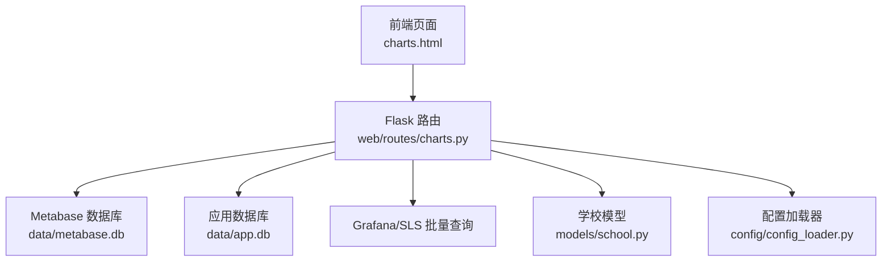
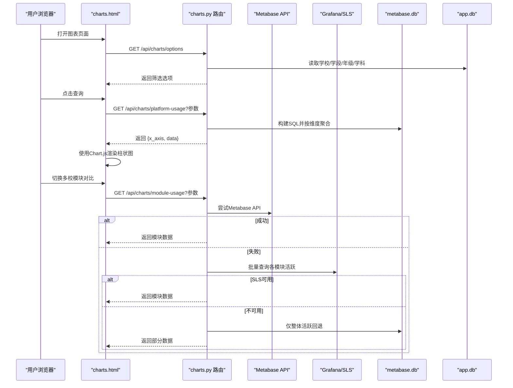
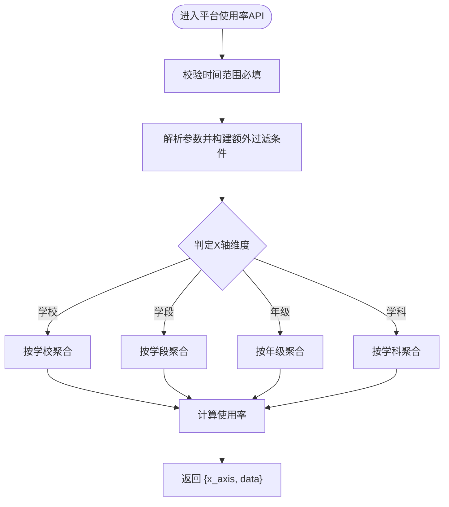
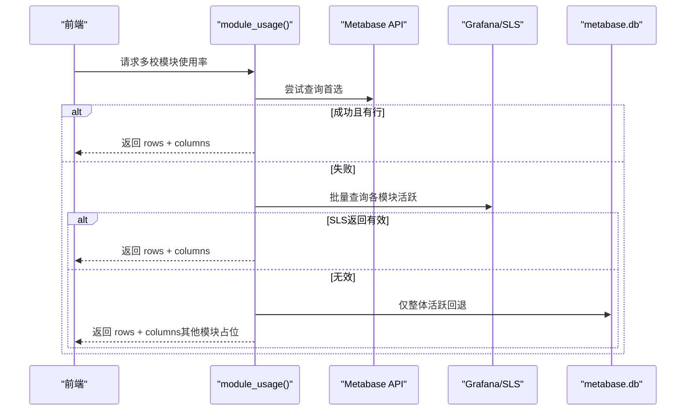
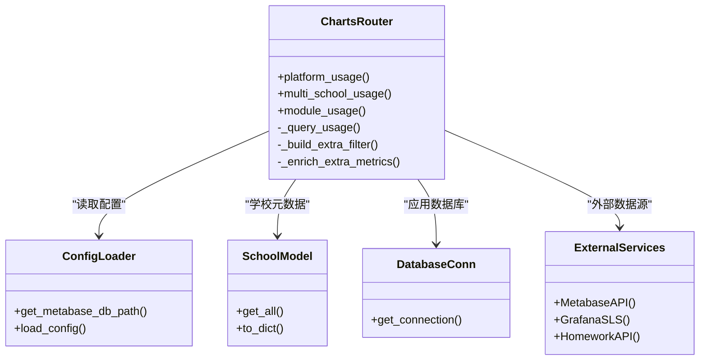

# 图表分析路由

<cite>
**本文引用的文件**   
- [web/routes/charts.py](file://web/routes/charts.py)
- [web/routes/activity.py](file://web/routes/activity.py)
- [models/database.py](file://models/database.py)
- [models/school.py](file://models/school.py)
- [config/config_loader.py](file://config/config_loader.py)
- [web/templates/charts.html](file://web/templates/charts.html)
- [web/static/js/app.js](file://web/static/js/app.js)
</cite>

## 目录
1. [简介](#简介)
2. [项目结构](#项目结构)
3. [核心组件](#核心组件)
4. [架构总览](#架构总览)
5. [详细组件分析](#详细组件分析)
6. [依赖关系分析](#依赖关系分析)
7. [性能考虑](#性能考虑)
8. [故障排查指南](#故障排查指南)
9. [结论](#结论)
10. [附录：API 接口文档](#附录api-接口文档)

## 简介
本技术文档围绕“图表分析路由”展开，聚焦多维度数据分析与可视化能力。系统支持按学校、学段、年级、学科等维度聚合平台使用率；提供多校模块级使用率对比（含8个功能模块）；并给出折线图、柱状图、饼图等动态图表的数据格式规范。同时说明实时数据更新机制（增量/全量）、数据预处理与格式化流程、以及性能优化建议（预计算、缓存、查询优化）。

## 项目结构
图表分析相关代码主要位于 web/routes/charts.py，配合前端模板 charts.html 与工具脚本 app.js；数据源来自本地 SQLite（应用数据库）与 Metabase 导出库（metabase.db），并在条件允许时回退到 Grafana SLS 批量查询。

图示来源
- [web/routes/charts.py:1-120](file://web/routes/charts.py#L1-L120)
- [web/templates/charts.html:1-120](file://web/templates/charts.html#L1-L120)
- [models/school.py:1-120](file://models/school.py#L1-L120)
- [config/config_loader.py:120-147](file://config/config_loader.py#L120-L147)

章节来源
- [web/routes/charts.py:1-120](file://web/routes/charts.py#L1-L120)
- [web/templates/charts.html:1-120](file://web/templates/charts.html#L1-L120)
- [models/school.py:1-120](file://models/school.py#L1-L120)
- [config/config_loader.py:120-147](file://config/config_loader.py#L120-L147)

## 核心组件
- 筛选选项获取：返回学校列表（按类型分组）、学段、年级、学科可选项。
- 平台使用率聚合：根据 X 轴维度（学校/学段/年级/学科）动态生成 SQL，计算分子（活跃教师数）与分母（总教师数），输出百分比。
- 多校模块使用率对比：优先从 Metabase API 拉取模块数据，失败则回退至 Grafana SLS 批量查询或 Metabase DB 整体活跃。
- 附加指标填充：作业次数、人均作业次数、日活/周活/月活比例等。
- 前端渲染：基于 Chart.js 的柱状图展示，支持标签显示策略与摘要统计。

章节来源
- [web/routes/charts.py:68-120](file://web/routes/charts.py#L68-L120)
- [web/routes/charts.py:122-348](file://web/routes/charts.py#L122-L348)
- [web/routes/charts.py:350-563](file://web/routes/charts.py#L350-L563)
- [web/routes/charts.py:571-1293](file://web/routes/charts.py#L571-L1293)
- [web/templates/charts.html:150-400](file://web/templates/charts.html#L150-L400)

## 架构总览
下图展示了图表分析请求的处理路径与数据源选择策略。

图示来源
- [web/routes/charts.py:323-348](file://web/routes/charts.py#L323-L348)
- [web/routes/charts.py:1125-1293](file://web/routes/charts.py#L1125-L1293)
- [web/templates/charts.html:342-395](file://web/templates/charts.html#L342-L395)

## 详细组件分析

### 筛选选项组件
- 功能：返回所有筛选器的可选项，包括学校（按类型分组）、学段、年级、学科。
- 数据来源：
  - 学校：本地 schools 表（通过 School.get_all）。
  - 学段/年级/学科：metabase.db 中 teacher_base 表的 stage_names/grade_names/subject_names 字段，逗号分隔字符串需拆分去重。
- 关键逻辑：
  - 将数据库中的“高中部”等后缀统一为 UI 值“高中”，并提供反向映射用于查询。
  - 对逗号分隔字段采用 LIKE 模式匹配进行过滤。

章节来源
- [web/routes/charts.py:68-120](file://web/routes/charts.py#L68-L120)
- [models/school.py:82-118](file://models/school.py#L82-L118)
- [config/config_loader.py:122-147](file://config/config_loader.py#L122-L147)

### 平台使用率聚合（按维度）
- 输入参数：start_date、end_date、school_id、stage、grade、subject。
- X 轴维度判定：
  - 若指定 grade → 按“学科”维度
  - 否则若指定 stage → 按“年级”维度
  - 否则若指定 school_id → 按“学段”维度
  - 否则 → 按“学校”维度
- 数据处理：
  - 分子：时间范围内访问过平台的去重教师数（dws_ingress_teacher_day）。
  - 分母：teacher_base 中符合条件的教师总数。
  - 百分比：rate = round(分子/分母*100, 1)。
- 结果格式：
  - x_axis: 当前X轴维度标识
  - data: 数组，每项包含 label、numerator、denominator、rate。

图示来源
- [web/routes/charts.py:122-348](file://web/routes/charts.py#L122-L348)

章节来源
- [web/routes/charts.py:122-348](file://web/routes/charts.py#L122-L348)

### 多校模块使用率对比（8 模块）
- 数据源优先级：
  1) Metabase API（与 Lida 数据一致）
  2) Grafana SLS 批量查询（一次HTTP合并多个模块）
  3) metabase.db 整体活跃回退（仅 overall 有值）
- 模块定义：overall、internal、gebei、jibei、zujuan、shouyue、xueqing、cuoti。
- 附加指标：
  - 作业次数：优先调用外部作业次数 API，失败回退本地 monthly_records。
  - 人均作业次数：作业次数/总教师数。
  - 日活/周活/月活比例：从 D21 卡片或 metabase.db 计算。
- 返回格式：
  - columns: 列名（13列）
  - rows: 每所学校一行，包含 values（百分比字符串）、rate_values（数值）、type、display_name、school_id 等。
  - total_schools: 学校数量
  - source: 数据来源（metabase-api / sls / metabase）

图示来源
- [web/routes/charts.py:1125-1293](file://web/routes/charts.py#L1125-L1293)

章节来源
- [web/routes/charts.py:350-563](file://web/routes/charts.py#L350-L563)
- [web/routes/charts.py:571-1293](file://web/routes/charts.py#L571-L1293)

### 前端图表渲染（Chart.js）
- 图表类型：默认柱状图，支持数据标签与 Tooltip。
- 交互：
  - 日期范围默认当月首尾。
  - 学校/学段/年级/学科联动下拉框。
  - 当学校维度项较多时，仅显示 Top5 与 Bottom5 的标签。
- 摘要统计：平均使用率、最高/最低及对应项、总项数；学校维度额外显示前5排名。

章节来源
- [web/templates/charts.html:150-400](file://web/templates/charts.html#L150-L400)
- [web/static/js/app.js:1-23](file://web/static/js/app.js#L1-L23)

## 依赖关系分析
- 路由层（charts.py）依赖：
  - 配置加载器（config_loader.py）：获取 Metabase DB 路径、凭证等。
  - 学校模型（models/school.py）：获取学校元数据与类型分组。
  - 数据库连接（models/database.py）：应用数据库连接上下文管理。
  - 外部服务：Metabase API、Grafana SLS、作业次数 API。
- 数据源：
  - 应用数据库（app.db）：存储采集记录、任务、学校、用户等。
  - Metabase 导出库（metabase.db）：teacher_base、dws_ingress_teacher_day 等事实表。
  - Grafana SLS：日志服务，按 URL 前缀区分模块。

图示来源
- [web/routes/charts.py:1-120](file://web/routes/charts.py#L1-L120)
- [config/config_loader.py:120-147](file://config/config_loader.py#L120-L147)
- [models/school.py:1-120](file://models/school.py#L1-L120)
- [models/database.py:24-48](file://models/database.py#L24-L48)

章节来源
- [web/routes/charts.py:1-120](file://web/routes/charts.py#L1-L120)
- [config/config_loader.py:120-147](file://config/config_loader.py#L120-L147)
- [models/school.py:1-120](file://models/school.py#L1-L120)
- [models/database.py:24-48](file://models/database.py#L24-L48)

## 性能考虑
- 数据预计算
  - 针对高频维度（如按学校的使用率）可建立物化视图或定时汇总表，减少实时聚合开销。
  - 对附加指标（作业次数、活跃比例）可离线批处理并缓存结果。
- 缓存策略
  - 对 /api/charts/options 等静态选项做短期缓存（例如 5-10 分钟），降低频繁查询 teacher_base 的负担。
  - 对 module-usage 的结果可按时间窗口缓存，避免重复跨源请求。
- 查询优化技巧
  - 在 dws_ingress_teacher_day 上建立 (stat_date, tianli_school_id, tianli_user_id) 复合索引，加速时间范围与去重计数。
  - 对 teacher_base 的 stage_names/grade_names/subject_names 字段，若数据量大，建议引入规范化表或倒排索引以替代 LIKE 模糊匹配。
  - 使用 SLS 批量查询合并多个模块的请求，减少 HTTP 往返。
- 资源控制
  - 对外部 API（作业次数、Metabase、SLS）设置合理超时与重试策略，避免阻塞主线程。
  - 对大结果集分页或限制返回行数，前端按需加载。

[本节为通用性能建议，不直接分析具体文件]

## 故障排查指南
- 常见错误
  - 时间范围为必填项：检查 start_date/end_date 是否传入且格式正确。
  - 日期格式错误：确保 YYYY-MM-DD 格式。
  - 无数据：确认时间范围内存在访问记录，或检查学校/维度过滤条件。
- 数据源问题
  - Metabase DB 不存在：检查 METABASE_DB_PATH 环境变量或 config.yaml 的 database.metabase_db_path。
  - Grafana 未配置有效凭证：检查 GRAFANA_API_TOKEN 或 GRAFANA_USERNAME/PASSWORD，或 config.yaml 中的 credentials.grafana。
  - SLS 批量查询失败：查看日志警告，确认网络连通性与鉴权。
- 回退路径
  - 当 Metabase API 失败时，自动回退到 SLS 或 metabase.db；若均不可用，仅整体活跃有值，其他模块显示占位符。

章节来源
- [web/routes/charts.py:323-348](file://web/routes/charts.py#L323-L348)
- [web/routes/charts.py:1125-1293](file://web/routes/charts.py#L1125-L1293)
- [config/config_loader.py:122-147](file://config/config_loader.py#L122-L147)

## 结论
图表分析路由提供了灵活的多维度使用率分析与多校模块对比能力，具备健壮的数据源回退机制与完善的附加指标计算。通过合理的预计算、缓存与索引优化，可在大规模数据场景下保持良好性能。前端以 Chart.js 实现直观可视化，满足日常运营与分析需求。

[本节为总结性内容，不直接分析具体文件]

## 附录：API 接口文档

### 筛选选项
- 端点：GET /api/charts/options
- 描述：返回筛选器可选项（学校按类型分组、学段、年级、学科）。
- 响应字段：
  - schools: 学校列表（name、display_name、type、id）
  - schools_by_type: 按类型分组的学校
  - stages: 学段列表
  - grades: 年级列表
  - subjects: 学科列表

章节来源
- [web/routes/charts.py:68-120](file://web/routes/charts.py#L68-L120)

### 平台使用率
- 端点：GET /api/charts/platform-usage
- 查询参数：
  - start_date: 开始日期（YYYY-MM-DD，必填）
  - end_date: 结束日期（YYYY-MM-DD，必填）
  - school_id: 学校ID（可选）
  - stage: 学段（可选）
  - grade: 年级（可选）
  - subject: 学科（可选）
- 响应字段：
  - x_axis: 当前X轴维度（school/stage/grade/subject）
  - data: 数组，每项包含 label、numerator、denominator、rate

章节来源
- [web/routes/charts.py:323-348](file://web/routes/charts.py#L323-L348)

### 多校使用率对比（整体）
- 端点：GET /api/charts/multi-school-usage
- 查询参数：
  - start_date、end_date（必填）
  - stage、grade、subject（可选）
  - school_id（可选）
- 响应字段：
  - rows: 每所学校包含 school、school_id、total_teachers、active_teachers、usage_rate、rate_value
  - total_schools: 学校数量

章节来源
- [web/routes/charts.py:451-563](file://web/routes/charts.py#L451-L563)

### 多校模块使用率对比（8 模块）
- 端点：GET /api/charts/module-usage
- 查询参数：
  - start_date、end_date（必填）
  - stage、grade、subject（可选）
  - school_id（可选）
  - types: 按类型过滤（逗号分隔的类型名称）
- 响应字段：
  - columns: 列名（13列）
  - rows: 每所学校一行，包含 school、display_name、type、school_id、total_teachers、values（百分比字符串数组）、rate_values（数值数组）
  - total_schools: 学校数量
  - source: 数据来源（metabase-api / sls / metabase）

章节来源
- [web/routes/charts.py:1125-1293](file://web/routes/charts.py#L1125-L1293)

### 活跃统计（辅助）
- 端点：
  - GET /api/activity/schools：返回启用学校列表
  - GET /api/activity/weekly：周活跃统计（total_teachers、used_teachers、active_teachers、activity_rate、weekly_ratio）
  - GET /api/activity/monthly：月活跃统计（daily/weekly/monthly active 与比率）
- 查询参数：start_date、end_date、school_name（必填）

章节来源
- [web/routes/activity.py:28-173](file://web/routes/activity.py#L28-L173)

### 数据源配置
- Metabase DB 路径优先级：
  1) 环境变量 METABASE_DB_PATH
  2) config.yaml 的 database.metabase_db_path
  3) 默认 data/metabase.db
- Grafana 认证优先级：
  1) 环境变量 GRAFANA_API_TOKEN
  2) GRAFANA_USERNAME + GRAFANA_PASSWORD
  3) config.yaml 的 credentials.grafana.api_token 或 username/password

章节来源
- [config/config_loader.py:122-147](file://config/config_loader.py#L122-L147)
- [web/routes/charts.py:1016-1054](file://web/routes/charts.py#L1016-L1054)