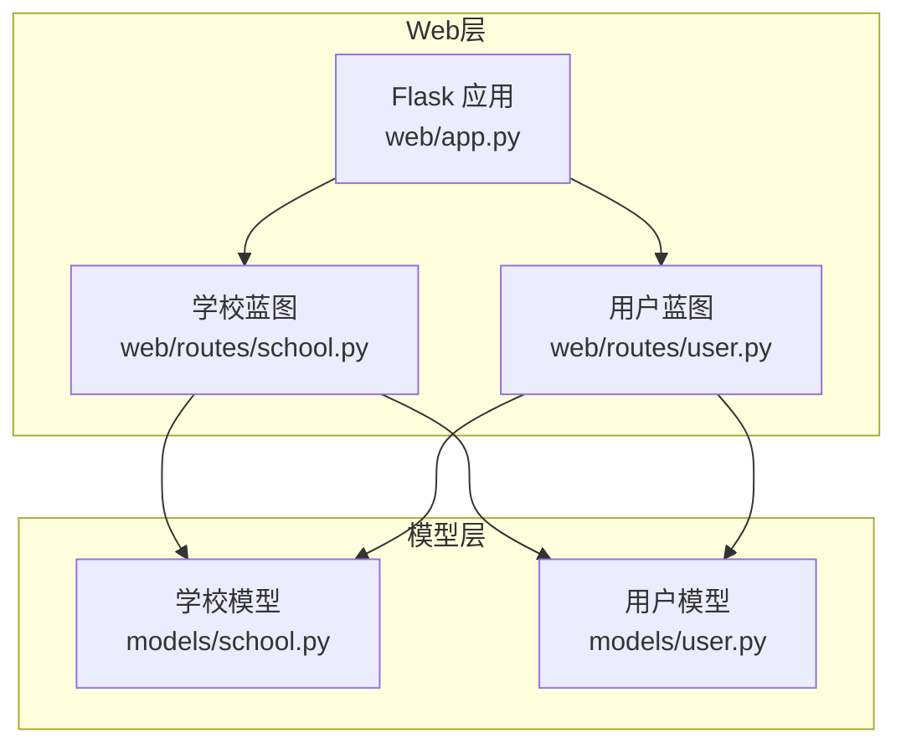
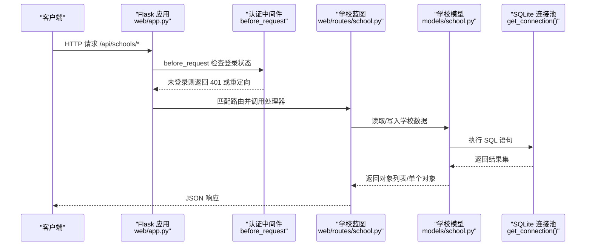
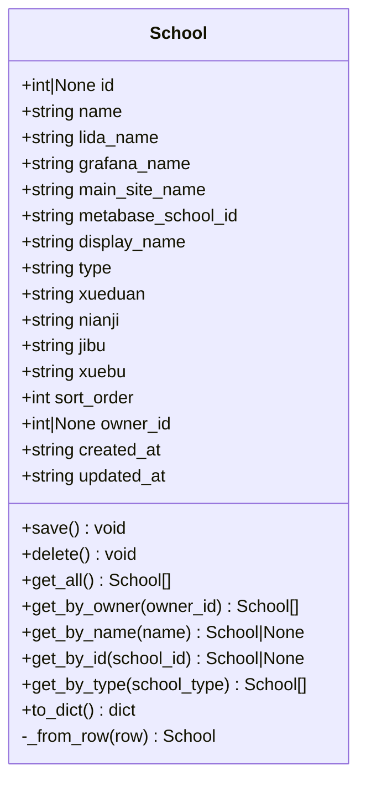
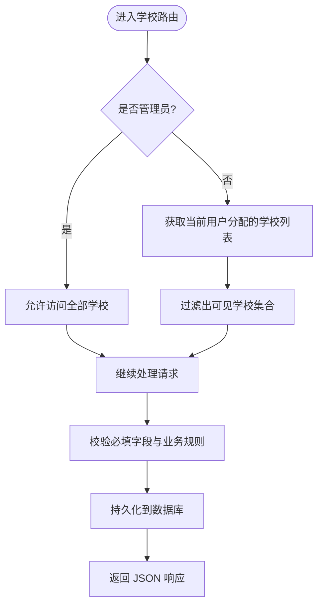
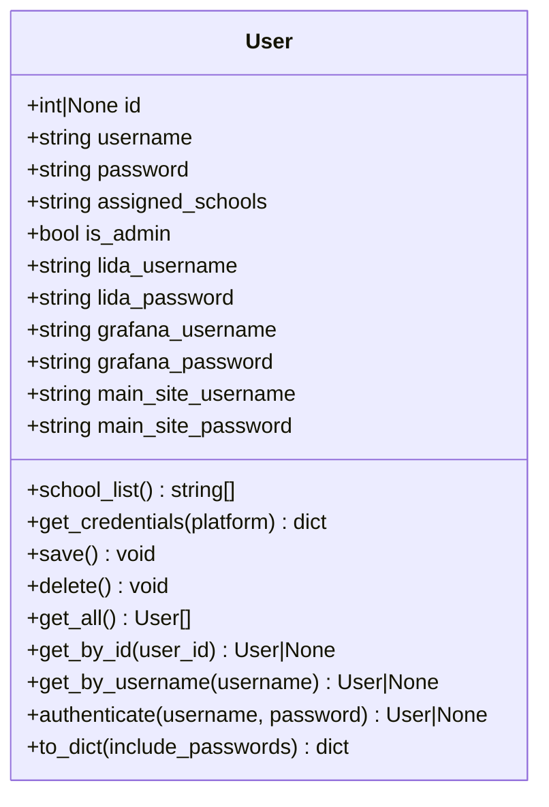
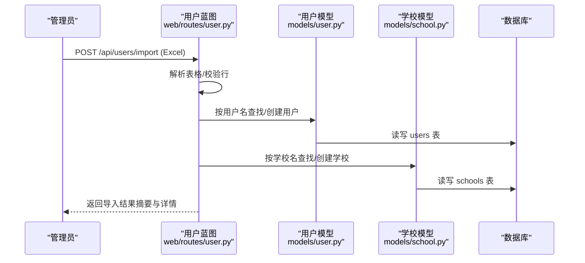
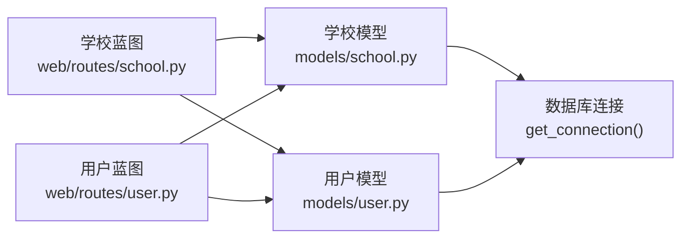

# 学校管理路由

<cite>
**本文引用的文件**   
- [web/app.py](file://middle-platform-data-collector-master/web/app.py)
- [web/routes/school.py](file://middle-platform-data-collector-master/web/routes/school.py)
- [models/school.py](file://middle-platform-data-collector-master/models/school.py)
- [models/user.py](file://middle-platform-data-collector-master/models/user.py)
- [web/routes/user.py](file://middle-platform-data-collector-master/web/routes/user.py)
</cite>

## 目录
1. [简介](#简介)
2. [项目结构](#项目结构)
3. [核心组件](#核心组件)
4. [架构总览](#架构总览)
5. [详细组件分析](#详细组件分析)
6. [依赖关系分析](#依赖关系分析)
7. [性能考虑](#性能考虑)
8. [故障排查指南](#故障排查指南)
9. [结论](#结论)
10. [附录：RESTful API 接口文档](#附录restful-api-接口文档)

## 简介
本技术文档围绕“学校管理”相关的路由与数据模型，系统阐述学校配置的增删改查（CRUD）实现、配置校验机制、批量操作支持、学校与用户的关联与权限隔离，以及完整的 RESTful API 规范。同时给出数据迁移与版本兼容性的建议，帮助开发者与维护者快速理解并扩展该模块。

## 项目结构
学校管理功能采用 Flask Blueprint 分层组织：
- 应用工厂与蓝图注册位于 web/app.py
- 学校资源路由位于 web/routes/school.py
- 用户资源路由位于 web/routes/user.py（包含批量导入能力）
- 数据模型位于 models/school.py 与 models/user.py

图表来源
- [web/app.py:306-336](file://middle-platform-data-collector-master/web/app.py#L306-L336)
- [web/routes/school.py:1-10](file://middle-platform-data-collector-master/web/routes/school.py#L1-L10)
- [web/routes/user.py:112-140](file://middle-platform-data-collector-master/web/routes/user.py#L112-L140)
- [models/school.py:1-20](file://middle-platform-data-collector-master/models/school.py#L1-L20)
- [models/user.py:1-20](file://middle-platform-data-collector-master/models/user.py#L1-L20)

章节来源
- [web/app.py:306-336](file://middle-platform-data-collector-master/web/app.py#L306-L336)

## 核心组件
- 学校模型 School：封装学校数据的持久化、查询与序列化，提供按名称/ID/类型/所有者等查询方法，以及保存/删除逻辑。
- 学校路由 school_bp：暴露 /api/schools 的 RESTful 接口，负责请求校验、权限控制、业务规则处理与响应构造。
- 用户模型 User：封装用户信息、平台凭证与学校分配字段，提供认证与序列化方法。
- 用户路由 user_bp：提供用户管理与批量导入接口，支持通过 Excel 批量创建/更新用户及其学校。

章节来源
- [models/school.py:28-81](file://middle-platform-data-collector-master/models/school.py#L28-L81)
- [web/routes/school.py:47-96](file://middle-platform-data-collector-master/web/routes/school.py#L47-L96)
- [models/user.py:25-31](file://middle-platform-data-collector-master/models/user.py#L25-L31)
- [web/routes/user.py:226-339](file://middle-platform-data-collector-master/web/routes/user.py#L226-L339)

## 架构总览
整体流程遵循“请求进入 -> 认证鉴权 -> 路由处理 -> 模型操作 -> 数据库持久化 -> 返回响应”的标准模式。学校与用户之间存在“多对多”语义（通过逗号分隔字符串进行映射），管理员拥有全局权限，普通用户仅能访问被分配的学校。

图表来源
- [web/app.py:253-292](file://middle-platform-data-collector-master/web/app.py#L253-L292)
- [web/routes/school.py:47-96](file://middle-platform-data-collector-master/web/routes/school.py#L47-L96)
- [models/school.py:28-81](file://middle-platform-data-collector-master/models/school.py#L28-L81)

## 详细组件分析

### 学校模型 School
- 数据结构：包含 name、lida_name、grafana_name、main_site_name、metabase_school_id、display_name、type、xueduan、nianji、jibu、xuebu、id、sort_order、owner_id、created_at、updated_at 等字段。
- 持久化：
  - save()：根据 id 是否存在决定 UPDATE 或 INSERT；INSERT 使用 ON CONFLICT(name) DO UPDATE 实现幂等插入。
  - delete()：按 id 删除记录。
- 查询：
  - get_all()：按 sort_order、name 排序获取全部。
  - get_by_owner(owner_id)：按 owner_id 过滤。
  - get_by_name(name)、get_by_id(school_id)：精确查找。
  - get_by_type(school_type)：按 type 筛选。
- 序列化：to_dict() 输出兼容旧 YAML 字典的结构；_from_row(row) 将行映射为对象。

图表来源
- [models/school.py:9-165](file://middle-platform-data-collector-master/models/school.py#L9-L165)

章节来源
- [models/school.py:28-81](file://middle-platform-data-collector-master/models/school.py#L28-L81)
- [models/school.py:82-165](file://middle-platform-data-collector-master/models/school.py#L82-L165)

### 学校路由 school_bp
- 路由前缀：/api/schools（在 app.py 中注册）
- 关键方法：
  - GET /api/schools：列出当前用户可见的学校（管理员返回全部）。
  - POST /api/schools：新增学校，必填字段校验、重复名校验、自动将新学校加入当前用户的 assigned_schools。
  - PUT /api/schools/<school_id>：更新学校，必填字段校验、改名冲突校验、非管理员权限校验。
  - DELETE /api/schools/<school_id>：删除学校，非管理员权限校验。
- 权限与数据隔离：
  - _is_admin()：基于 session["is_admin"] 判断管理员。
  - _current_user_id()：从 session 获取当前用户 ID。
  - _get_user_school_names()：非管理员时返回其被分配的学校名列表。
  - _get_visible_schools()：根据权限过滤可访问学校集合。

图表来源
- [web/routes/school.py:18-45](file://middle-platform-data-collector-master/web/routes/school.py#L18-L45)
- [web/routes/school.py:53-96](file://middle-platform-data-collector-master/web/routes/school.py#L53-L96)
- [web/routes/school.py:99-139](file://middle-platform-data-collector-master/web/routes/school.py#L99-L139)
- [web/routes/school.py:142-154](file://middle-platform-data-collector-master/web/routes/school.py#L142-L154)

章节来源
- [web/routes/school.py:47-96](file://middle-platform-data-collector-master/web/routes/school.py#L47-L96)
- [web/routes/school.py:99-139](file://middle-platform-data-collector-master/web/routes/school.py#L99-L139)
- [web/routes/school.py:142-154](file://middle-platform-data-collector-master/web/routes/school.py#L142-L154)

### 用户模型 User
- 关键字段：username、password、assigned_schools（逗号分隔）、is_admin、各平台用户名/密码等。
- 辅助属性与方法：
  - school_list：解析 assigned_schools 为学校名列表。
  - to_dict(include_passwords=False)：对外暴露安全视图。
  - authenticate(username, password)：简单口令认证。
  - save()/delete()：用户持久化。

图表来源
- [models/user.py:9-113](file://middle-platform-data-collector-master/models/user.py#L9-L113)

章节来源
- [models/user.py:25-31](file://middle-platform-data-collector-master/models/user.py#L25-L31)
- [models/user.py:41-93](file://middle-platform-data-collector-master/models/user.py#L41-L93)

### 批量导入（用户及学校）
- 入口：POST /api/users/import（需管理员权限）
- 模板下载：GET /api/users/import-template（需管理员权限）
- 处理流程：
  - 解析 Excel，提取有效数据行
  - 按用户名分组，存在则复用，不存在则新建用户
  - 为用户设置 assigned_schools（逗号分隔）
  - 对每所学校：若已存在则更新，否则新增
  - 返回汇总与明细

图表来源
- [web/routes/user.py:226-339](file://middle-platform-data-collector-master/web/routes/user.py#L226-L339)
- [models/user.py:41-93](file://middle-platform-data-collector-master/models/user.py#L41-L93)
- [models/school.py:28-81](file://middle-platform-data-collector-master/models/school.py#L28-L81)

章节来源
- [web/routes/user.py:226-339](file://middle-platform-data-collector-master/web/routes/user.py#L226-L339)

## 依赖关系分析
- 路由与模型耦合：
  - school_bp 依赖 School 与 User 模型完成数据访问与权限判定。
  - user_bp 依赖 School 与 User 模型完成批量导入与用户管理。
- 外部依赖：
  - SQLite 连接通过 models/database.get_connection() 提供（上下文管理器）。
  - Flask 会话用于身份与权限传递。

图表来源
- [web/routes/school.py:1-10](file://middle-platform-data-collector-master/web/routes/school.py#L1-L10)
- [web/routes/user.py:112-140](file://middle-platform-data-collector-master/web/routes/user.py#L112-L140)
- [models/school.py:1-20](file://middle-platform-data-collector-master/models/school.py#L1-L20)
- [models/user.py:1-20](file://middle-platform-data-collector-master/models/user.py#L1-L20)

章节来源
- [web/app.py:306-336](file://middle-platform-data-collector-master/web/app.py#L306-L336)

## 性能考虑
- 查询排序：学校列表默认按 sort_order、name 排序，适合前端展示顺序稳定。
- 幂等插入：使用 ON CONFLICT(name) DO UPDATE 避免重复插入带来的额外开销。
- 批量导入：建议在大数据量场景下分批提交，减少单次事务压力。
- 索引建议：为 schools.name、schools.owner_id、users.username 建立索引以提升查询性能。

[本节为通用指导，不直接分析具体文件]

## 故障排查指南
- 常见错误码与含义：
  - 400：请求体为空或必填字段缺失
  - 401：未登录（API 访问）
  - 403：无权编辑/删除指定学校
  - 404：学校不存在
  - 409：学校名称重复
- 定位步骤：
  - 确认登录状态与会话字段（user_id、is_admin）是否正确注入
  - 检查必填字段与格式是否符合要求
  - 查看数据库约束冲突（如 name 唯一性）
  - 核对用户 assigned_schools 字段是否包含目标学校名

章节来源
- [web/app.py:253-292](file://middle-platform-data-collector-master/web/app.py#L253-L292)
- [web/routes/school.py:53-96](file://middle-platform-data-collector-master/web/routes/school.py#L53-L96)
- [web/routes/school.py:99-139](file://middle-platform-data-collector-master/web/routes/school.py#L99-L139)
- [web/routes/school.py:142-154](file://middle-platform-data-collector-master/web/routes/school.py#L142-L154)

## 结论
学校管理模块以清晰的蓝图与模型分层实现了 CRUD、权限控制与数据隔离，并通过批量导入提升运维效率。建议在生产环境完善索引、日志与审计，并对敏感字段进行加密存储与传输保护。

[本节为总结性内容，不直接分析具体文件]

## 附录：RESTful API 接口文档

### 学校管理（/api/schools）
- 基础说明
  - 所有接口均需登录（未登录返回 401）
  - 管理员可访问全部学校；普通用户仅能访问被分配的学校
  - 必填字段：name、grafana_name、main_site_name

- 接口列表
  - 获取学校列表
    - 方法：GET
    - URL：/api/schools
    - 参数：无
    - 响应：{ "schools": [ {...}, ... ] }
    - 状态码：200

  - 新增学校
    - 方法：POST
    - URL：/api/schools
    - 请求体：JSON，包含必填字段 name、grafana_name、main_site_name；可选字段 lida_name、metabase_school_id、display_name、type、xueduan、nianji、jibu、xuebu、sort_order
    - 行为：若 name 已存在返回 409；成功自动将新学校加入当前用户的 assigned_schools
    - 响应：{ "school": {...} }
    - 状态码：201

  - 更新学校
    - 方法：PUT
    - URL：/api/schools/{school_id}
    - 路径参数：school_id（整数）
    - 请求体：JSON，包含必填字段 name、grafana_name、main_site_name；可选字段同上；支持更新 sort_order
    - 行为：若修改 name 且冲突返回 409；非管理员仅能编辑分配给自己的学校
    - 响应：{ "school": {...} }
    - 状态码：200

  - 删除学校
    - 方法：DELETE
    - URL：/api/schools/{school_id}
    - 路径参数：school_id（整数）
    - 行为：非管理员仅能删除分配给自己的学校
    - 响应：空体
    - 状态码：204

- 字段说明（学校）
  - name：学校唯一标识（必填）
  - lida_name：Lida 平台对应名称
  - grafana_name：Grafana 平台对应名称（必填）
  - main_site_name：主站平台对应名称（必填）
  - metabase_school_id：Metabase 学校 ID
  - display_name：显示名称（可为空，默认回退到 name）
  - type：类型（直营校/托管校）
  - xueduan/nianji/jibu/xuebu：学段/年级/学部/校区
  - sort_order：排序权重
  - owner_id：创建者用户 ID
  - created_at/updated_at：时间戳

章节来源
- [web/routes/school.py:47-96](file://middle-platform-data-collector-master/web/routes/school.py#L47-L96)
- [web/routes/school.py:99-139](file://middle-platform-data-collector-master/web/routes/school.py#L99-L139)
- [web/routes/school.py:142-154](file://middle-platform-data-collector-master/web/routes/school.py#L142-L154)
- [models/school.py:140-165](file://middle-platform-data-collector-master/models/school.py#L140-L165)

### 用户与批量导入（/api/users）
- 基础说明
  - 批量导入与模板下载需要管理员权限
  - 用户字段包含账号、密码与各平台凭证，assigned_schools 为逗号分隔的学校名列表

- 接口列表
  - 下载导入模板
    - 方法：GET
    - URL：/api/users/import-template
    - 权限：管理员
    - 响应：Excel 文件（.xlsx）
    - 状态码：200

  - 批量导入
    - 方法：POST
    - URL：/api/users/import
    - 权限：管理员
    - 请求体：multipart/form-data，上传 Excel 文件
    - 处理：按用户名分组，创建/更新用户，创建/更新学校，设置 assigned_schools
    - 响应：{ "message", "summary", "details", "warnings?" }
    - 状态码：200

章节来源
- [web/routes/user.py:151-223](file://middle-platform-data-collector-master/web/routes/user.py#L151-L223)
- [web/routes/user.py:226-339](file://middle-platform-data-collector-master/web/routes/user.py#L226-L339)

### 数据迁移与版本兼容性
- 现有实现要点
  - 学校表使用 ON CONFLICT(name) DO UPDATE 保证幂等插入
  - 用户 assigned_schools 使用逗号分隔存储，兼容多种中文标点分隔符
- 建议的迁移策略
  - 引入显式多对多关系表（例如 school_user），替代逗号分隔字符串，便于扩展与查询
  - 为常用查询字段添加索引（schools.name、schools.owner_id、users.username）
  - 增加软删除字段（deleted_at）与审计字段（created_by、updated_by）
  - 对敏感字段（密码、平台凭证）实施加密存储与最小化暴露
  - 为 API 增加版本号（如 /api/v1/schools），确保向后兼容

[本节为通用建议，不直接分析具体文件]