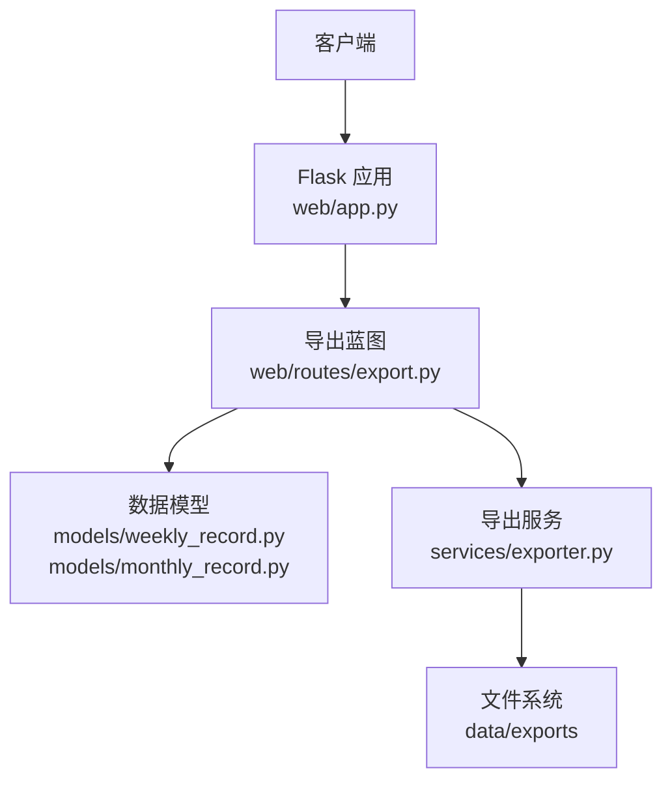
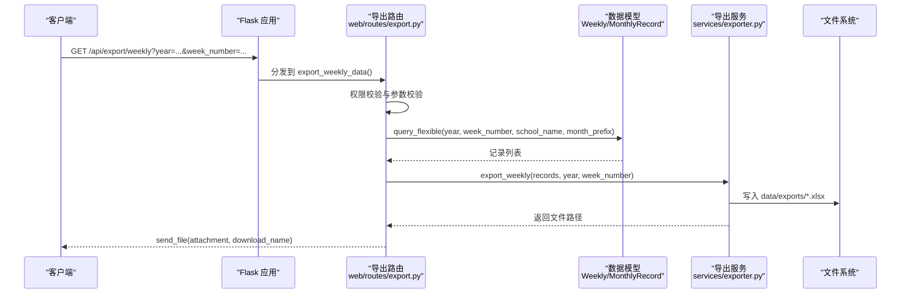
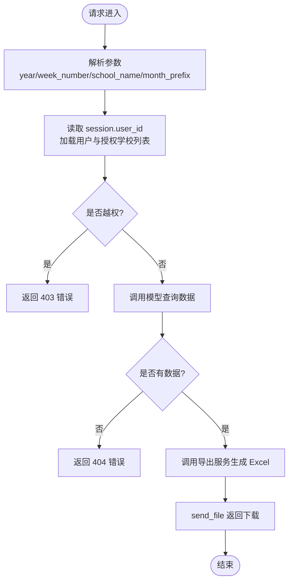
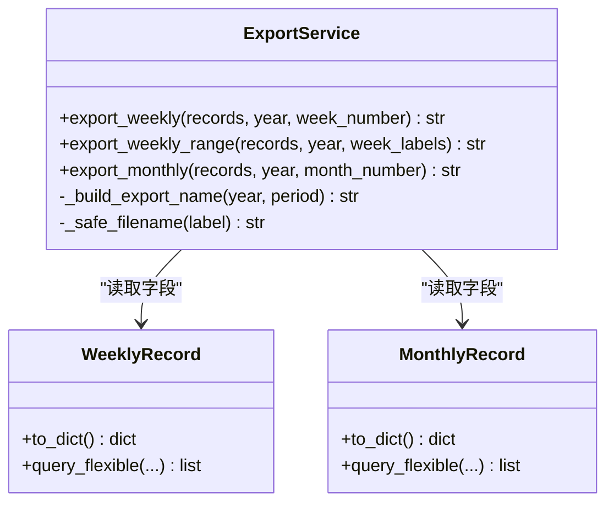
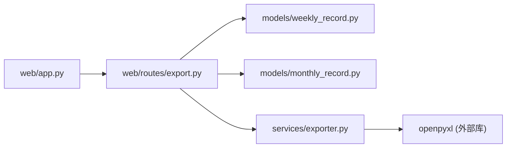

# 数据导出路由

<cite>
**本文引用的文件**   
- [web/routes/export.py](file://web/routes/export.py)
- [services/exporter.py](file://services/exporter.py)
- [web/app.py](file://web/app.py)
- [models/weekly_record.py](file://models/weekly_record.py)
- [models/monthly_record.py](file://models/monthly_record.py)
- [models/user.py](file://models/user.py)
- [requirements.txt](file://requirements.txt)
</cite>

## 目录
1. [简介](#简介)
2. [项目结构](#项目结构)
3. [核心组件](#核心组件)
4. [架构总览](#架构总览)
5. [详细组件分析](#详细组件分析)
6. [依赖关系分析](#依赖关系分析)
7. [性能与内存优化](#性能与内存优化)
8. [故障排查指南](#故障排查指南)
9. [结论](#结论)
10. [附录：API 接口规范](#附录api-接口规范)

## 简介
本技术文档聚焦于“数据导出路由”的实现，围绕 Excel 文件导出的原理、OpenPyXL 的使用方式、数据格式化策略、权限控制与筛选机制、文件生成流程（含内存管理与下载链接管理）进行系统化说明。同时提供完整的 API 接口规范，涵盖导出参数、预览与下载等能力，并对批量导出、定时导出等高级功能给出实现建议与扩展路径。

## 项目结构
导出相关代码主要分布在以下位置：
- Web 层：Flask Blueprint 定义导出路由，负责请求解析、权限校验、结果返回
- 服务层：Excel 导出服务，封装 OpenPyXL 的 Workbook 创建、样式设置、行列写入与保存
- 模型层：周度与月度记录的数据类及查询方法，支撑导出前的数据筛选
- 应用入口：注册蓝图并挂载到 /api/export 前缀下

图表来源
- [web/app.py:306-336](file://web/app.py#L306-L336)
- [web/routes/export.py:1-124](file://web/routes/export.py#L1-L124)
- [services/exporter.py:1-362](file://services/exporter.py#L1-L362)
- [models/weekly_record.py:1-163](file://models/weekly_record.py#L1-L163)
- [models/monthly_record.py:1-200](file://models/monthly_record.py#L1-L200)

章节来源
- [web/app.py:306-336](file://web/app.py#L306-L336)
- [web/routes/export.py:1-124](file://web/routes/export.py#L1-L124)

## 核心组件
- 导出蓝图与路由
  - 周度导出：/api/export/weekly
  - 月度导出：/api/export/monthly
  - 数据预览：/api/export/preview
  - 周标签枚举：/api/export/distinct_weeks
- 导出服务
  - 周度导出：export_weekly
  - 周度范围导出（多 Sheet）：export_weekly_range
  - 月度导出：export_monthly
- 数据模型
  - WeeklyRecord：灵活查询、去重周标签查询
  - MonthlyRecord：灵活查询、去重月次查询
- 用户与权限
  - User：按用户分配学校列表过滤导出数据

章节来源
- [web/routes/export.py:31-124](file://web/routes/export.py#L31-L124)
- [services/exporter.py:64-362](file://services/exporter.py#L64-L362)
- [models/weekly_record.py:86-134](file://models/weekly_record.py#L86-L134)
- [models/monthly_record.py:118-163](file://models/monthly_record.py#L118-L163)
- [models/user.py:25-31](file://models/user.py#L25-L31)

## 架构总览
导出流程从 HTTP 请求进入，经蓝图路由完成参数校验与权限控制，调用导出服务生成 Excel 文件并返回下载响应。

图表来源
- [web/app.py:327-329](file://web/app.py#L327-L329)
- [web/routes/export.py:31-62](file://web/routes/export.py#L31-L62)
- [services/exporter.py:64-140](file://services/exporter.py#L64-L140)
- [models/weekly_record.py:86-103](file://models/weekly_record.py#L86-L103)

## 详细组件分析

### 导出路由（web/routes/export.py）
- 职责
  - 解析查询参数（year、week_number、school_name、month_prefix、month_number）
  - 基于会话中的 user_id 获取当前用户可访问的学校集合，执行行级权限过滤
  - 调用模型查询数据，若无数据返回 404；否则调用导出服务生成文件并返回下载
  - 提供 /preview 接口以 JSON 形式返回数据用于前端预览
  - 提供 /distinct_weeks 接口返回指定年份的不重复周标签
- 关键逻辑
  - 非管理员若选择不在其授权范围内的学校，直接拒绝或返回空集
  - 文件名构建使用统一工具函数，确保合法字符
  - 通过 send_file 以附件形式返回，download_name 由导出名拼接 .xlsx

图表来源
- [web/routes/export.py:17-62](file://web/routes/export.py#L17-L62)

章节来源
- [web/routes/export.py:17-124](file://web/routes/export.py#L17-L124)

### 导出服务（services/exporter.py）
- 职责
  - 使用 OpenPyXL 创建 Workbook 与工作表
  - 定义表头与样式（字体、对齐、边框、填充色），支持合并单元格与多级表头
  - 将模型对象字段映射为列值，逐行写入
  - 调整列宽并保存到 data/exports 目录，返回文件路径
- 关键实现
  - 周度导出：单 Sheet，标题行合并，标准表头与样式
  - 周度范围导出：按周次分组，每周一个 Sheet
  - 月度导出：双行合并表头，子列样式区分，数据行写入与列宽设置
  - 文件名构建：_build_export_name 与 _safe_filename 保证命名安全与可读性

图表来源
- [services/exporter.py:48-362](file://services/exporter.py#L48-L362)
- [models/weekly_record.py:10-31](file://models/weekly_record.py#L10-L31)
- [models/monthly_record.py:9-45](file://models/monthly_record.py#L9-L45)

章节来源
- [services/exporter.py:64-362](file://services/exporter.py#L64-L362)

### 数据模型（models/weekly_record.py, models/monthly_record.py）
- 职责
  - 定义数据类字段，提供 save、to_dict 等方法
  - 提供灵活查询方法，支持按年、周/月、学校组合条件检索
  - 提供去重查询（周标签、月次）供前端下拉选择
- 关键点
  - 查询按采集时间倒序排列，便于最新数据优先展示
  - to_dict 用于预览接口返回 JSON

章节来源
- [models/weekly_record.py:86-134](file://models/weekly_record.py#L86-L134)
- [models/monthly_record.py:118-163](file://models/monthly_record.py#L118-L163)

### 用户与权限（models/user.py）
- 职责
  - 提供 school_list 属性，解析 assigned_schools 得到授权学校列表
  - 导出路由据此对数据进行二次过滤，防止越权访问
- 关键点
  - 管理员不受限制；普通用户仅能访问其被分配的学校

章节来源
- [models/user.py:25-31](file://models/user.py#L25-L31)

## 依赖关系分析
- 外部库
  - openpyxl：Excel 文件生成与样式设置
  - flask：Web 框架与蓝图、请求处理、文件发送
- 内部模块
  - web/app.py 注册蓝图，挂载到 /api/export
  - routes/export.py 依赖 models 与 services/exporter.py
  - services/exporter.py 依赖 models 与 openpyxl

图表来源
- [web/app.py:327-329](file://web/app.py#L327-L329)
- [web/routes/export.py:1-10](file://web/routes/export.py#L1-L10)
- [services/exporter.py:1-12](file://services/exporter.py#L1-L12)
- [requirements.txt:1-7](file://requirements.txt#L1-L7)

章节来源
- [requirements.txt:1-7](file://requirements.txt#L1-L7)

## 性能与内存优化
- 当前实现特征
  - 在内存中构建 Workbook，逐行写入单元格，最后一次性保存到磁盘
  - 适用于中小规模数据集；当数据量较大时，内存占用与生成时间会线性增长
- 优化建议
  - 流式写入：考虑使用 openpyxl 的 write_only 模式减少内存峰值
  - 分批导出：对超大结果集分批次写入不同 Sheet 或拆分多个文件
  - 异步任务：将导出放入后台线程或任务队列，避免阻塞请求线程
  - 缓存与复用：预计算样式对象，减少重复创建开销
  - 清理策略：定期清理 data/exports 下的历史文件，避免磁盘膨胀

[本节为通用指导，不直接分析具体文件]

## 故障排查指南
- 常见错误
  - 缺少必要参数：如未提供 year，返回 400
  - 无匹配数据：查询结果为空，返回 404
  - 越权访问：非管理员选择了不在授权范围内的学校，返回 403
- 定位步骤
  - 检查请求参数是否正确
  - 确认用户登录状态与会话信息
  - 查看数据模型查询条件与结果数量
  - 检查 data/exports 目录是否存在且可写
  - 观察浏览器网络面板的响应体与状态码

章节来源
- [web/routes/export.py:31-124](file://web/routes/export.py#L31-L124)

## 结论
该导出系统采用清晰的三层结构：路由层负责鉴权与参数校验，服务层封装 OpenPyXL 的导出逻辑，模型层提供灵活查询。整体实现简洁直观，适合中小规模数据的即时导出。对于大规模数据与高并发场景，建议引入异步任务与流式写入以提升性能与稳定性。

[本节为总结性内容，不直接分析具体文件]

## 附录：API 接口规范

- 基础信息
  - 前缀：/api/export
  - 认证：需登录（session.user_id），未登录将返回 401 或未跳转至登录页
  - 权限：非管理员仅能访问其授权学校的数据

- 周度导出
  - 端点：GET /api/export/weekly
  - 参数
    - year: 整数，必填
    - week_number: 字符串，可选
    - school_name: 字符串，可选
    - month_prefix: 字符串，可选（按周次前缀模糊匹配）
  - 成功响应：二进制 Excel 文件（附件下载）
  - 失败响应
    - 400：缺少 year
    - 403：越权访问
    - 404：无匹配数据

- 月度导出
  - 端点：GET /api/export/monthly
  - 参数
    - year: 整数，必填
    - month_number: 字符串，可选
    - school_name: 字符串，可选
  - 成功响应：二进制 Excel 文件（附件下载）
  - 失败响应
    - 400：缺少 year
    - 403：越权访问
    - 404：无匹配数据

- 数据预览
  - 端点：GET /api/export/preview
  - 参数：同周度导出（year、week_number、school_name、month_prefix）
  - 成功响应：JSON，包含 records 数组（每条记录为字典）
  - 失败响应
    - 400：缺少 year
    - 403：越权访问（返回空 records）

- 周标签枚举
  - 端点：GET /api/export/distinct_weeks
  - 参数
    - year: 整数，必填
  - 成功响应：JSON，包含 weeks 数组（不重复周标签）
  - 失败响应
    - 400：缺少 year

- 进度查询与文件获取
  - 当前导出为同步返回下载，不提供独立的进度查询接口
  - 如需异步导出与进度查询，可在后端增加任务队列与 SSE/轮询接口（见“高级功能”）

章节来源
- [web/routes/export.py:31-124](file://web/routes/export.py#L31-L124)
- [web/app.py:327-329](file://web/app.py#L327-L329)

## 高级功能说明

- 批量导出
  - 现有能力
    - 周度范围导出：export_weekly_range 支持按周次列表生成多 Sheet 文件
  - 扩展建议
    - 新增 /api/export/batch 接口，接收周次或月次列表，在服务层分组后调用对应导出函数
    - 大文件拆分：按学校或时间段拆分为多个文件，打包为 ZIP 返回

- 定时导出
  - 实现思路
    - 使用系统定时任务（如 cron）或应用内调度器（APScheduler）触发导出
    - 将导出任务持久化到 collect_tasks 表，支持状态跟踪与结果汇总
    - 结合 SSE 或轮询接口暴露任务进度与结果下载链接
  - 注意事项
    - 资源隔离：避免与在线请求共享同一进程资源
    - 失败重试与告警：对异常任务进行重试与通知

- 模板定制
  - 当前样式集中定义于导出服务中（字体、颜色、对齐、边框）
  - 可扩展为配置驱动的模板：允许用户自定义列顺序、可见字段、样式主题
  - 注意：保持向后兼容，默认模板不变

- 异步处理与流式输出
  - 当前导出为同步阻塞，建议在后台线程或任务队列中执行
  - 文件生成完成后，返回任务 ID 与下载链接；前端通过轮询或 SSE 获取进度
  - 流式输出：在大型文件场景下，可采用分块传输或服务器端流式写入

[本节为概念性扩展建议，不直接分析具体文件]