# 活跃度查询路由

<cite>
**本文档引用的文件**
- [activity.py](file://web/routes/activity.py)
- [charts.py](file://web/routes/charts.py)
- [weekly_record.py](file://models/weekly_record.py)
- [monthly_record.py](file://models/monthly_record.py)
- [school.py](file://models/school.py)
- [config_loader.py](file://config/config_loader.py)
- [main.py](file://web/routes/main.py)
</cite>

## 目录
1. [简介](#简介)
2. [项目结构](#项目结构)
3. [核心组件](#核心组件)
4. [架构概览](#架构概览)
5. [详细组件分析](#详细组件分析)
6. [依赖关系分析](#依赖关系分析)
7. [性能考虑](#性能考虑)
8. [故障排除指南](#故障排除指南)
9. [结论](#结论)

## 简介

活跃度查询路由是中间平台数据收集系统中的核心功能模块，专门负责教师活跃度统计和分析。该模块提供了多维度的活跃度指标计算，包括登录频率、使用时长、功能使用等，并支持周度、月度、年度等不同时间粒度的统计分析。

系统通过SQLite数据库存储活跃度数据，结合Metabase数据源，为教育管理者提供全面的教师使用情况洞察。该模块不仅支持实时查询，还具备历史数据查询和趋势分析能力。

## 项目结构

活跃度查询路由位于Web应用的路由层，采用Flask蓝图进行模块化组织：

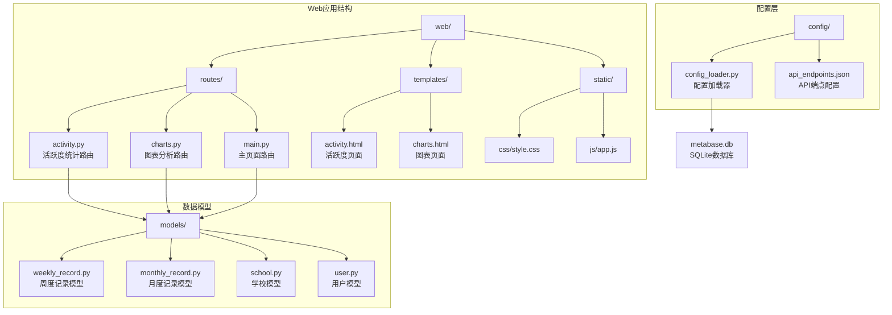

**图表来源**
- [activity.py:1-173](file://web/routes/activity.py#L1-L173)
- [charts.py:1-800](file://web/routes/charts.py#L1-L800)
- [weekly_record.py:1-163](file://models/weekly_record.py#L1-L163)
- [monthly_record.py:1-200](file://models/monthly_record.py#L1-L200)

**章节来源**
- [activity.py:1-173](file://web/routes/activity.py#L1-L173)
- [charts.py:1-800](file://web/routes/charts.py#L1-L800)

## 核心组件

### 活跃度统计路由模块

活跃度统计路由模块提供了两个主要的统计接口：

1. **周活跃统计接口** (`/api/activity/weekly`)
2. **月活跃统计接口** (`/api/activity/monthly`)

这两个接口都支持以下查询参数：
- `start_date`: 开始日期（必需）
- `end_date`: 结束日期（必需）  
- `school_name`: 学校名称（必需）

### 图表分析路由模块

图表分析路由模块提供了更丰富的数据分析功能：

1. **平台使用率分析** (`/api/charts/platform-usage`)
2. **多校使用率对比** (`/api/charts/multi-school-usage`)
3. **模块级使用率查询**（通过Metabase API）

### 数据模型组件

系统使用数据类模型来管理活跃度相关的数据：

1. **周度记录模型** (`WeeklyRecord`)
2. **月度记录模型** (`MonthlyRecord`)
3. **学校模型** (`School`)

**章节来源**
- [activity.py:28-173](file://web/routes/activity.py#L28-L173)
- [charts.py:323-563](file://web/routes/charts.py#L323-L563)
- [weekly_record.py:9-163](file://models/weekly_record.py#L9-L163)
- [monthly_record.py:9-200](file://models/monthly_record.py#L9-L200)

## 架构概览

活跃度查询路由采用分层架构设计，确保了良好的可维护性和扩展性：

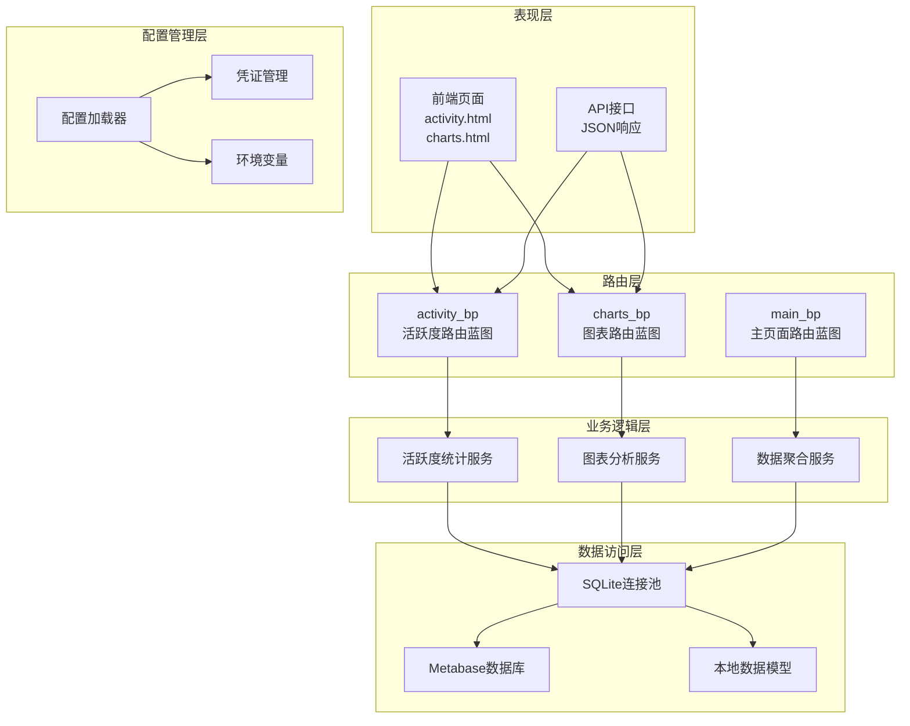

**图表来源**
- [activity.py:9-19](file://web/routes/activity.py#L9-L19)
- [charts.py:17-37](file://web/routes/charts.py#L17-L37)
- [config_loader.py:122-147](file://config/config_loader.py#L122-L147)

### 数据流架构

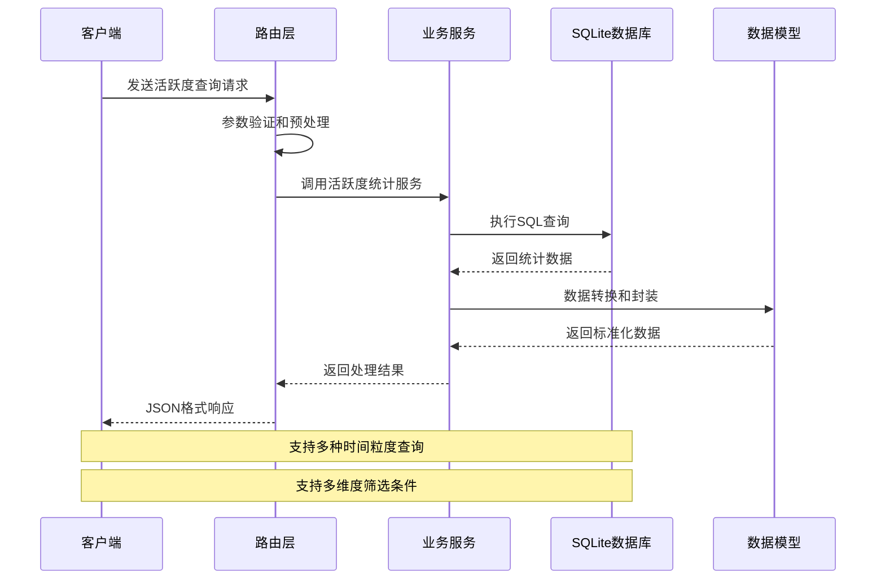

**图表来源**
- [activity.py:48-173](file://web/routes/activity.py#L48-L173)
- [charts.py:323-563](file://web/routes/charts.py#L323-L563)

## 详细组件分析

### 活跃度统计算法

#### 周活跃统计算法

周活跃统计算法基于以下核心指标：

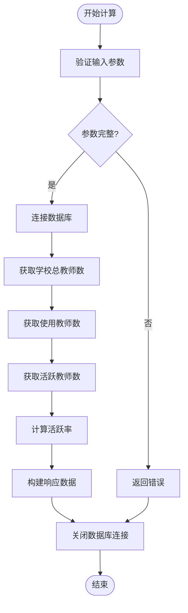

**图表来源**
- [activity.py:48-101](file://web/routes/activity.py#L48-L101)

活跃度计算的具体步骤：

1. **总教师数统计**：从`teacher_base`表中统计状态为启用且属于指定学校的所有教师数量
2. **使用教师数统计**：统计在指定时间范围内有访问记录的唯一教师数量
3. **活跃教师数统计**：统计在指定时间范围内访问天数达到阈值（周活跃为≥3天）的唯一教师数量
4. **活跃率计算**：活跃教师数除以使用教师数，得到周活跃比例

#### 月活跃统计算法

月活跃统计算法与周活跃类似，但有不同的活跃阈值：

| 统计类型 | 活跃阈值 | 计算公式 |
|---------|---------|---------|
| 日活跃 | 至少1天 | 日活跃教师数/总教师数×100% |
| 周活跃 | 至少3天 | 周活跃教师数/总教师数×100% |
| 月活跃 | 至少4天 | 月活跃教师数/总教师数×100% |

**章节来源**
- [activity.py:104-173](file://web/routes/activity.py#L104-L173)

### 时间范围查询实现

系统支持多种时间粒度的活跃度分析：

#### 周度统计分析

周度统计使用标准的周一至周日时间范围：

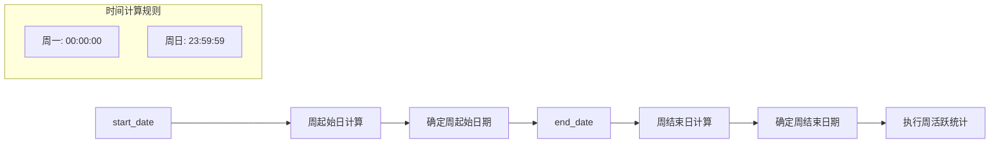

**图表来源**
- [activity.py:48-98](file://web/routes/activity.py#L48-L98)

#### 月度统计分析

月度统计支持自然月和自定义日期范围：

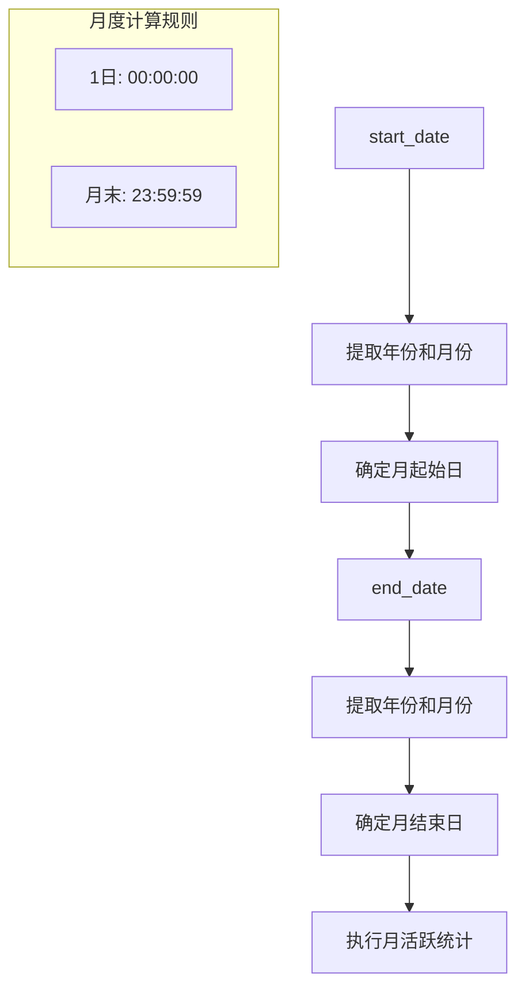

**图表来源**
- [activity.py:104-169](file://web/routes/activity.py#L104-L169)

### 数据聚合策略

#### SQL查询优化

系统采用高效的SQL查询策略来处理大规模数据：

1. **索引利用**：对常用查询字段建立适当的索引
2. **分组聚合**：使用GROUP BY和HAVING子句进行高效聚合
3. **去重处理**：使用DISTINCT关键字避免重复计算
4. **条件过滤**：在WHERE子句中尽早过滤无关数据

#### 缓存策略

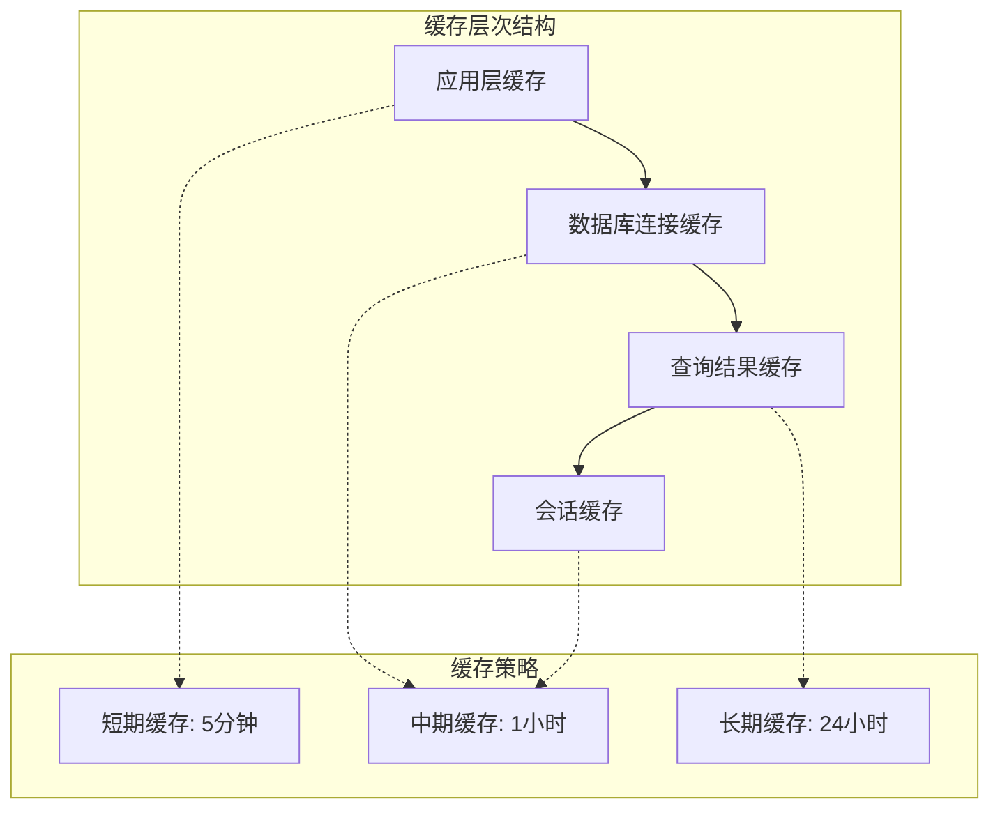

**图表来源**
- [charts.py:30-37](file://web/routes/charts.py#L30-L37)

### 趋势分析功能

#### 同比分析算法

系统支持跨时间段的活跃度趋势分析：

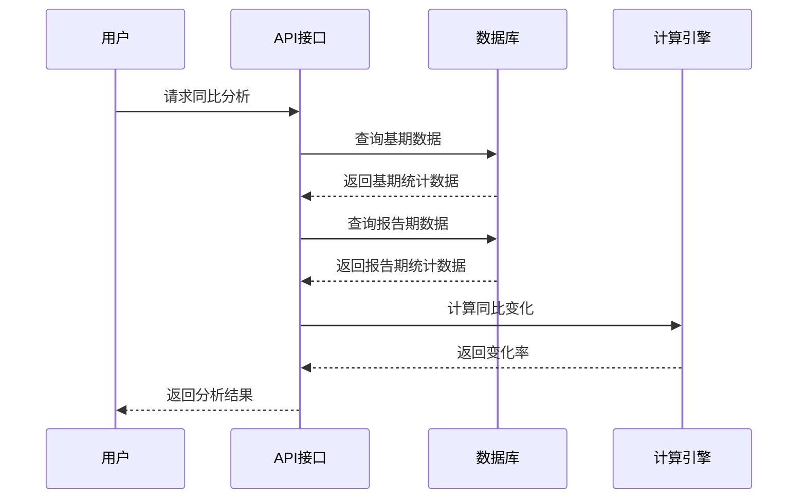

**图表来源**
- [charts.py:593-727](file://web/routes/charts.py#L593-L727)

#### 环比分析算法

环比分析用于比较相邻时间段的活跃度变化：

| 分析类型 | 计算公式 | 应用场景 |
|---------|---------|---------|
| 日环比 | (今日-昨日)/昨日×100% | 监控日活跃度波动 |
| 周环比 | (本周-上周)/上周×100% | 分析周活跃度趋势 |
| 月环比 | (本月-上月)/上月×100% | 评估月活跃度变化 |

### 异常检测机制

系统内置了基本的异常检测功能：

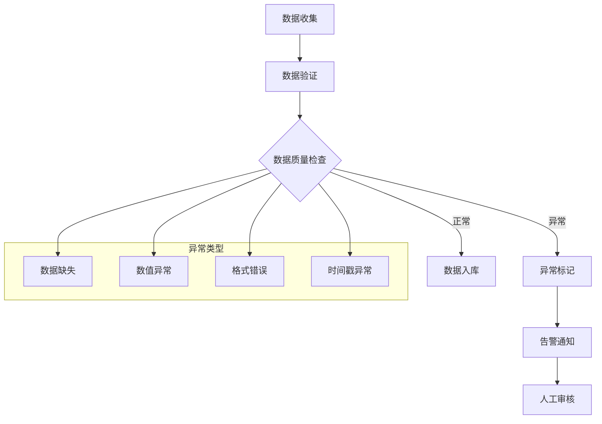

**图表来源**
- [weekly_record.py:32-69](file://models/weekly_record.py#L32-L69)

**章节来源**
- [charts.py:593-727](file://web/routes/charts.py#L593-L727)

## 依赖关系分析

### 组件依赖图

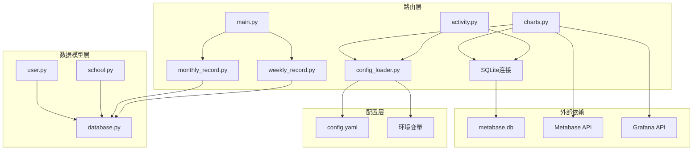

**图表来源**
- [activity.py:7-19](file://web/routes/activity.py#L7-L19)
- [charts.py:14-37](file://web/routes/charts.py#L14-L37)
- [config_loader.py:122-147](file://config/config_loader.py#L122-L147)

### 数据库依赖关系

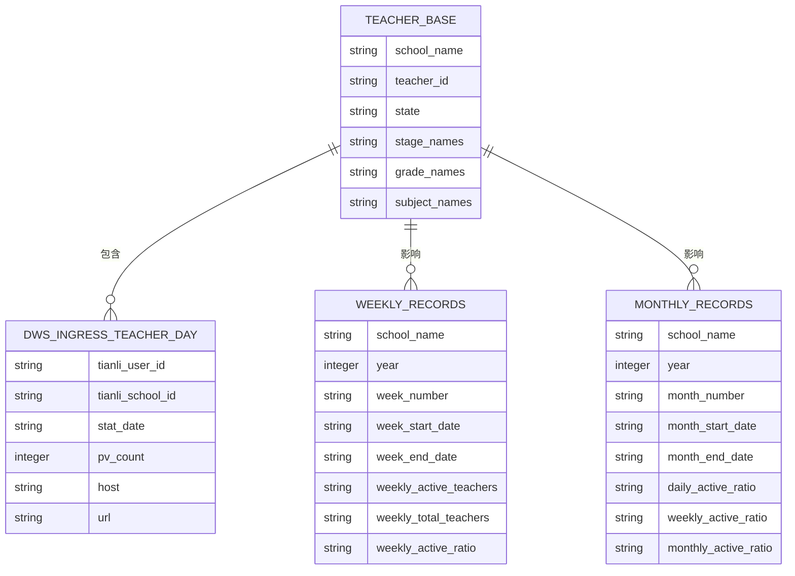

**图表来源**
- [activity.py:61-155](file://web/routes/activity.py#L61-L155)
- [weekly_record.py:36-68](file://models/weekly_record.py#L36-L68)
- [monthly_record.py:51-100](file://models/monthly_record.py#L51-L100)

**章节来源**
- [activity.py:12-19](file://web/routes/activity.py#L12-L19)
- [charts.py:30-37](file://web/routes/charts.py#L30-L37)

## 性能考虑

### 查询性能优化

系统采用了多项性能优化策略：

1. **索引优化**：对常用查询字段建立索引，如`stat_date`、`school_name`、`tianli_user_id`
2. **查询优化**：使用`EXPLAIN QUERY PLAN`分析SQL执行计划
3. **连接池管理**：复用数据库连接，减少连接开销
4. **批量操作**：支持批量数据查询和更新

### 大数据量处理

针对大规模数据集，系统实现了以下优化：

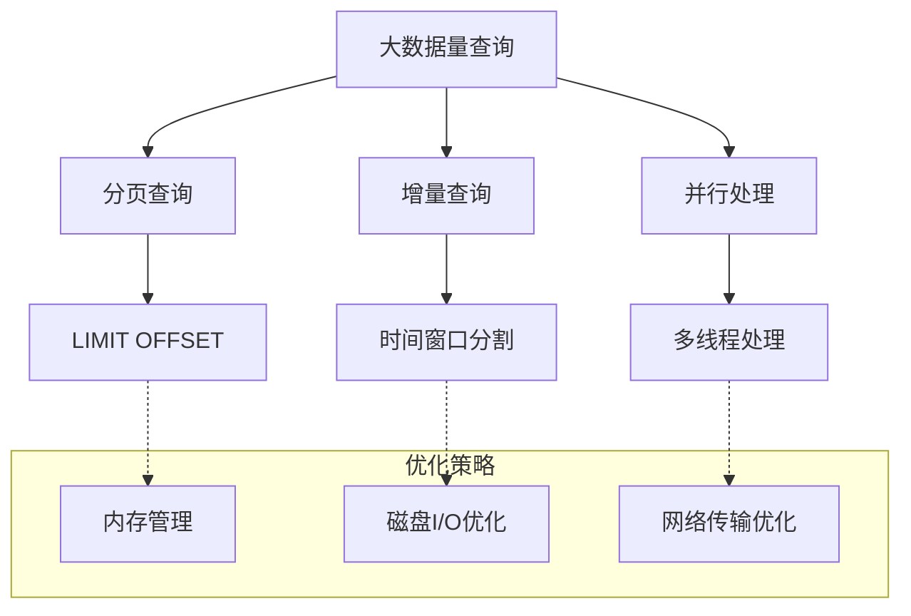

### 缓存策略

系统实现了多层次的缓存机制：

1. **应用层缓存**：缓存常用的查询结果
2. **数据库连接缓存**：复用数据库连接
3. **会话缓存**：缓存用户会话信息
4. **静态资源缓存**：缓存前端静态资源

**章节来源**
- [charts.py:30-37](file://web/routes/charts.py#L30-L37)
- [config_loader.py:122-147](file://config/config_loader.py#L122-L147)

## 故障排除指南

### 常见问题诊断

#### 数据库连接问题

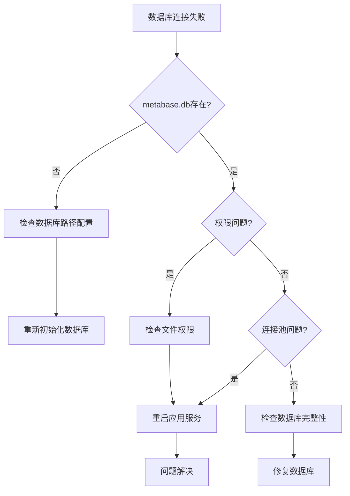

#### 查询性能问题

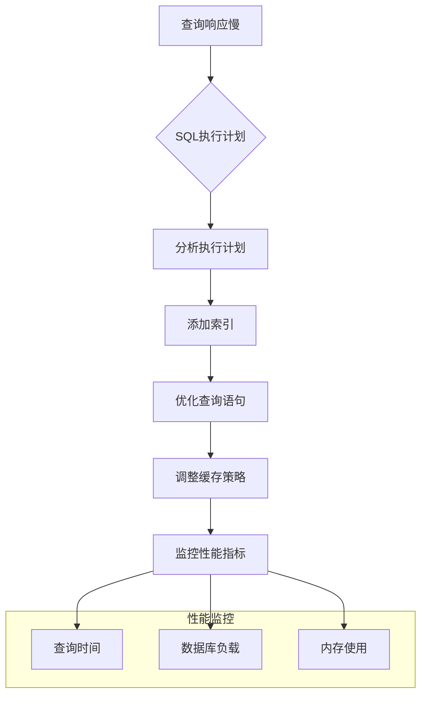

### 错误处理机制

系统实现了完善的错误处理机制：

1. **参数验证**：对所有输入参数进行严格验证
2. **异常捕获**：捕获并处理各种运行时异常
3. **错误日志**：记录详细的错误信息用于调试
4. **优雅降级**：在部分功能失效时提供降级方案

**章节来源**
- [activity.py:12-19](file://web/routes/activity.py#L12-L19)
- [charts.py:338-347](file://web/routes/charts.py#L338-L347)

## 结论

活跃度查询路由模块为教育管理系统提供了全面的教师活跃度分析能力。通过多维度的统计指标、灵活的时间粒度支持、高效的查询算法和完善的性能优化策略，该模块能够满足不同规模教育机构的数据分析需求。

### 主要优势

1. **多维度分析**：支持日、周、月等多种时间粒度的活跃度分析
2. **灵活筛选**：提供学校、学段、年级、学科等多层级筛选条件
3. **高性能设计**：采用多种优化策略确保大数据量下的查询性能
4. **可扩展性**：模块化设计便于功能扩展和维护

### 技术特色

1. **智能缓存**：多层次缓存机制提升系统响应速度
2. **异常检测**：内置异常检测和告警机制
3. **趋势分析**：支持同比、环比等趋势分析功能
4. **可视化支持**：为前端图表展示提供标准化数据接口

该模块的成功实施为教育数据驱动决策提供了坚实的技术基础，有助于提升教学质量和管理效率。