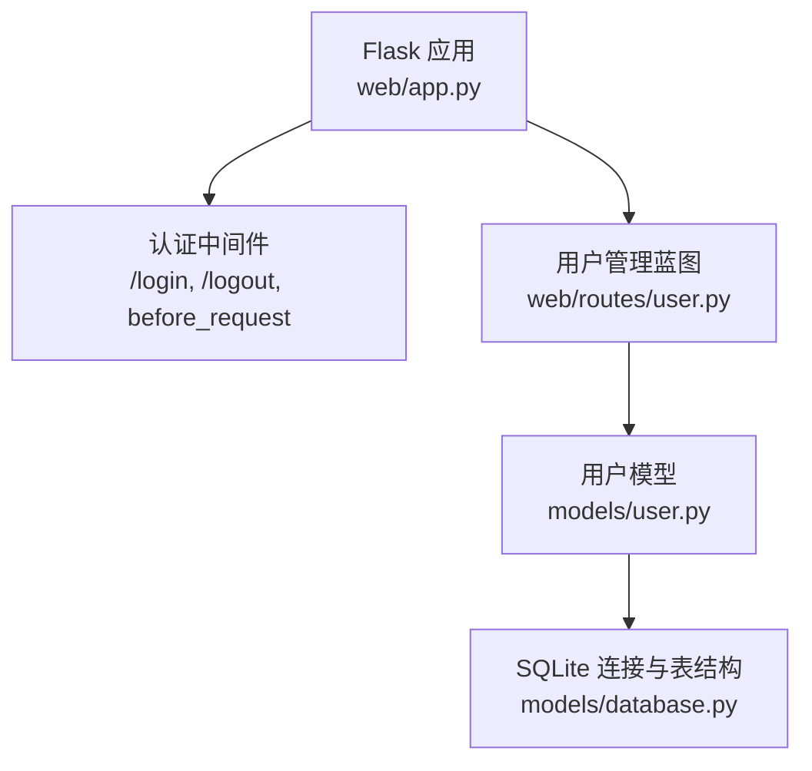
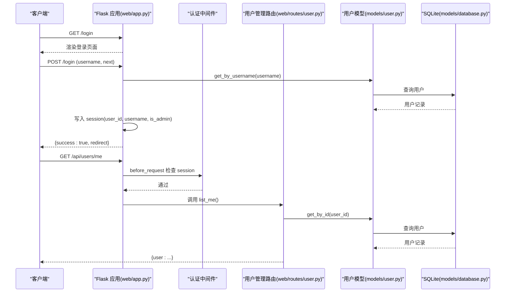
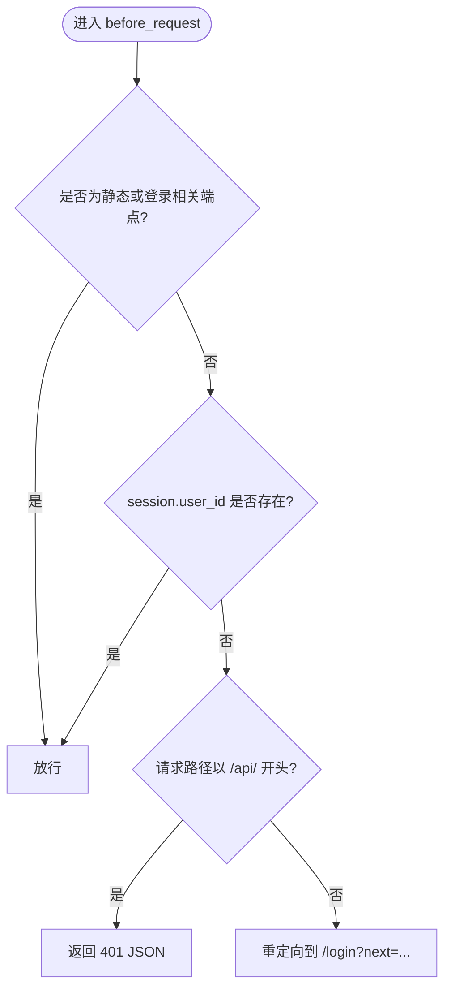
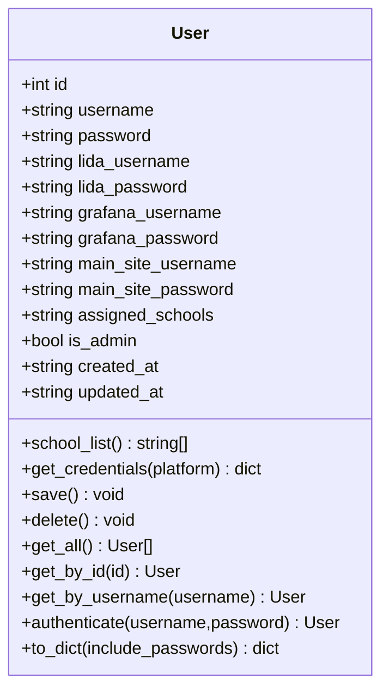
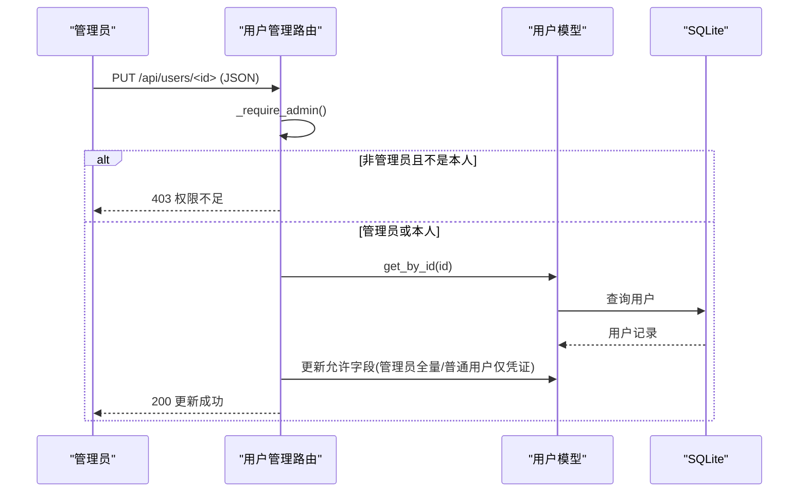
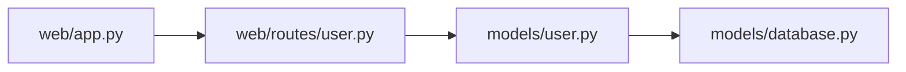

# 用户管理路由

<cite>
**本文引用的文件**   
- [web/app.py](file://middle-platform-data-collector-master/web/app.py)
- [web/routes/user.py](file://middle-platform-data-collector-master/web/routes/user.py)
- [models/user.py](file://middle-platform-data-collector-master/models/user.py)
- [models/database.py](file://middle-platform-data-collector-master/models/database.py)
</cite>

## 目录
1. [简介](#简介)
2. [项目结构](#项目结构)
3. [核心组件](#核心组件)
4. [架构总览](#架构总览)
5. [详细组件分析](#详细组件分析)
6. [依赖关系分析](#依赖关系分析)
7. [性能与可扩展性](#性能与可扩展性)
8. [故障排查指南](#故障排查指南)
9. [结论](#结论)
10. [附录：API 接口文档](#附录api-接口文档)

## 简介
本技术文档聚焦于“用户管理路由”的实现，覆盖认证、授权、会话管理、角色权限差异、凭证存储与安全策略，并提供完整的用户管理 API 文档。系统基于 Flask 蓝图组织路由，使用 SQLite 持久化用户数据，通过 Session 维护登录状态，并在请求前进行统一的鉴权拦截。

## 项目结构
与用户管理相关的代码主要分布在以下位置：
- Web 应用入口与认证中间件：web/app.py
- 用户管理路由（CRUD、批量导入等）：web/routes/user.py
- 用户模型与数据库访问：models/user.py
- 数据库初始化与默认管理员创建：models/database.py

图表来源
- [web/app.py:253-304](file://middle-platform-data-collector-master/web/app.py#L253-L304)
- [web/routes/user.py:1-356](file://middle-platform-data-collector-master/web/routes/user.py#L1-L356)
- [models/user.py:1-113](file://middle-platform-data-collector-master/models/user.py#L1-L113)
- [models/database.py:284-372](file://middle-platform-data-collector-master/models/database.py#L284-L372)

章节来源
- [web/app.py:306-337](file://middle-platform-data-collector-master/web/app.py#L306-L337)
- [web/routes/user.py:1-356](file://middle-platform-data-collector-master/web/routes/user.py#L1-L356)
- [models/user.py:1-113](file://middle-platform-data-collector-master/models/user.py#L1-L113)
- [models/database.py:201-372](file://middle-platform-data-collector-master/models/database.py#L201-L372)

## 核心组件
- 认证与授权中间件
  - 在每次请求前检查是否已登录；对未登录的 API 请求返回 401，对页面请求重定向到登录页并携带 next 参数。
  - 提供登录页面与登录提交处理，成功后写入 session 中的 user_id、username、is_admin。
  - 提供登出清理 session。
- 用户管理路由
  - 提供用户列表、当前用户信息、更新当前用户、创建用户、更新用户、删除用户、下载导入模板、批量导入等功能。
  - 通过 _require_admin 辅助函数校验管理员权限。
- 用户模型
  - 封装用户数据的增删改查、凭据获取、序列化输出等方法。
  - 提供 authenticate 静态方法用于用户名+密码验证（当前为明文比对）。
- 数据库层
  - 定义 users 表结构与字段，包含用户名、密码、平台凭据、分配学校、管理员标志、时间戳等。
  - 首次启动时若 users 表为空，则插入默认管理员账户。

章节来源
- [web/app.py:253-304](file://middle-platform-data-collector-master/web/app.py#L253-L304)
- [web/routes/user.py:15-135](file://middle-platform-data-collector-master/web/routes/user.py#L15-L135)
- [models/user.py:41-93](file://middle-platform-data-collector-master/models/user.py#L41-L93)
- [models/database.py:284-372](file://middle-platform-data-collector-master/models/database.py#L284-L372)

## 架构总览
下图展示了从浏览器发起登录到后端鉴权、再到用户管理的整体流程。

图表来源
- [web/app.py:253-304](file://middle-platform-data-collector-master/web/app.py#L253-L304)
- [web/routes/user.py:21-36](file://middle-platform-data-collector-master/web/routes/user.py#L21-L36)
- [models/user.py:61-70](file://middle-platform-data-collector-master/models/user.py#L61-L70)
- [models/database.py:284-298](file://middle-platform-data-collector-master/models/database.py#L284-L298)

## 详细组件分析

### 认证与会话管理
- 登录流程
  - 前端提交表单至 /login，后端根据用户名查找用户，成功则将 user_id、username、is_admin 写入 session，并返回重定向地址。
  - 失败时返回错误信息供前端提示。
- 会话校验
  - before_request 对所有非静态、非登录页面请求进行检查，未登录时：
    - 对 /api/* 返回 401 JSON 错误
    - 对其他路径重定向到 /login?next=原路径
- 登出
  - 清空 session 并重定向到登录页。

图表来源
- [web/app.py:253-293](file://middle-platform-data-collector-master/web/app.py#L253-L293)

章节来源
- [web/app.py:253-304](file://middle-platform-data-collector-master/web/app.py#L253-L304)

### 用户模型与数据持久化
- 用户实体
  - 包含用户名、密码、多平台凭据（lida/grafana/main_site）、分配学校、管理员标志、时间戳等。
  - 提供 to_dict(include_passwords=False) 控制敏感字段输出。
- 数据库操作
  - save/delete/get_all/get_by_id/get_by_username 均通过 models.database.get_connection 上下文管理器执行 SQL。
  - users 表包含唯一用户名约束与多个平台凭据字段。
- 认证方法
  - authenticate(username, password) 当前实现为直接比较明文密码。

图表来源
- [models/user.py:9-113](file://middle-platform-data-collector-master/models/user.py#L9-L113)

章节来源
- [models/user.py:1-113](file://middle-platform-data-collector-master/models/user.py#L1-L113)
- [models/database.py:284-298](file://middle-platform-data-collector-master/models/database.py#L284-L298)

### 用户管理路由与权限控制
- 管理员权限检查
  - _require_admin 读取 session.is_admin，非管理员返回 403。
- 普通用户 vs 管理员
  - 普通用户仅能修改自身凭证字段（如 lida/grafana/main_site 的用户名和密码），以及自己的密码。
  - 管理员可修改任意用户的用户名、密码、assigned_schools、is_admin 等所有字段。
- 批量导入
  - 支持 Excel 模板下载与上传，解析后按用户名分组，自动创建用户与学校记录，并设置 assigned_schools。
- 删除保护
  - 禁止删除默认管理员账号（username == "admin"）。

图表来源
- [web/routes/user.py:102-135](file://middle-platform-data-collector-master/web/routes/user.py#L102-L135)
- [models/user.py:41-49](file://middle-platform-data-collector-master/models/user.py#L41-L49)

章节来源
- [web/routes/user.py:15-135](file://middle-platform-data-collector-master/web/routes/user.py#L15-L135)
- [web/routes/user.py:342-356](file://middle-platform-data-collector-master/web/routes/user.py#L342-L356)

### 安全现状与改进建议
- 密码存储
  - 当前将密码以明文形式存入数据库，存在安全风险。建议改为加盐哈希（例如 bcrypt/argon2）。
- 认证比对
  - authenticate 使用明文比较，应替换为哈希比对。
- 会话安全
  - SECRET_KEY 硬编码在配置中，生产环境需使用强随机密钥并通过环境变量注入。
  - 建议启用 Secure、HttpOnly、SameSite Cookie 属性，限制跨站请求。
- CSRF 防护
  - 当前登录表单使用 form 提交，但未见 CSRF Token 机制。建议引入 CSRF 保护（如 flask-wtf 的 CSRFProtect）。
- 暴力破解防护
  - 缺少登录尝试次数限制与锁定策略。建议增加速率限制与账户锁定。
- 最小权限原则
  - 普通用户不应看到其他用户详情或敏感字段；当前部分接口返回 include_passwords=True，需谨慎暴露。

章节来源
- [web/app.py:306-314](file://middle-platform-data-collector-master/web/app.py#L306-L314)
- [models/user.py:72-77](file://middle-platform-data-collector-master/models/user.py#L72-L77)
- [models/database.py:363-370](file://middle-platform-data-collector-master/models/database.py#L363-L370)
- [web/routes/user.py:21-36](file://middle-platform-data-collector-master/web/routes/user.py#L21-L36)

## 依赖关系分析
- 模块耦合
  - web/app.py 注册蓝图并注入认证中间件，依赖 models.user 与 models.database。
  - web/routes/user.py 依赖 models.user 与 models.school（后者在本仓库中存在但未在此处展开）。
  - models.user 依赖 models.database 提供的 get_connection。
- 外部依赖
  - Flask、openpyxl（Excel 导入导出）、sqlite3（内置）。

图表来源
- [web/app.py:319-335](file://middle-platform-data-collector-master/web/app.py#L319-L335)
- [web/routes/user.py:9-12](file://middle-platform-data-collector-master/web/routes/user.py#L9-L12)
- [models/user.py:6](file://middle-platform-data-collector-master/models/user.py#L6)

章节来源
- [web/app.py:306-337](file://middle-platform-data-collector-master/web/app.py#L306-L337)
- [web/routes/user.py:1-12](file://middle-platform-data-collector-master/web/routes/user.py#L1-L12)
- [models/user.py:1-10](file://middle-platform-data-collector-master/models/user.py#L1-L10)

## 性能与可扩展性
- 数据库
  - 使用 SQLite WAL 模式提升并发读性能；users 表 username 有唯一索引，查询效率良好。
- 会话
  - 默认基于服务端 Session，适合小规模部署；大规模场景可考虑 Redis 作为会话存储。
- 扩展点
  - 可在 before_request 中加入更细粒度的权限中间件（如基于角色的访问控制 RBAC）。
  - 可将凭据加密逻辑下沉到模型层，统一处理。

[本节为通用指导，不直接分析具体文件]

## 故障排查指南
- 无法登录
  - 检查用户名是否存在；确认 session 是否正确写入 user_id、is_admin。
  - 查看登录页面返回的错误消息。
- 权限不足
  - 确认当前 session.is_admin 是否为真；普通用户只能修改自身凭证。
- 批量导入失败
  - 检查上传文件格式是否为 .xlsx；确保必填列不为空；注意示例行需删除。
- 默认管理员被误删
  - 系统禁止删除 username == "admin" 的记录；如需重置，请通过数据库恢复。

章节来源
- [web/app.py:271-293](file://middle-platform-data-collector-master/web/app.py#L271-L293)
- [web/routes/user.py:102-135](file://middle-platform-data-collector-master/web/routes/user.py#L102-L135)
- [web/routes/user.py:226-339](file://middle-platform-data-collector-master/web/routes/user.py#L226-L339)
- [web/routes/user.py:342-356](file://middle-platform-data-collector-master/web/routes/user.py#L342-L356)

## 结论
当前用户管理路由实现了基础的认证、会话与权限控制，满足内部工具的使用需求。但在密码存储、CSRF 防护、暴力破解防护等方面存在明显安全隐患，建议尽快实施加固措施，以提升系统的整体安全性与合规性。

[本节为总结性内容，不直接分析具体文件]

## 附录：API 接口文档

说明
- 基础路径：/api/users
- 认证方式：Cookie Session（由 /login 登录后建立）
- 响应格式：JSON（除模板下载外）

接口清单
- 获取用户列表
  - 方法：GET
  - 路径：/api/users/
  - 权限：管理员
  - 响应：{ users: [...] }
  - 备注：返回包含敏感字段的完整用户信息，谨慎使用

- 获取当前用户信息
  - 方法：GET
  - 路径：/api/users/me
  - 权限：已登录用户
  - 响应：{ user: {...} }

- 更新当前用户信息
  - 方法：PUT
  - 路径：/api/users/me
  - 权限：已登录用户
  - 请求体：JSON，支持字段包括 lida_username、lida_password、grafana_username、grafana_password、main_site_username、main_site_password、password
  - 响应：{ message, user }

- 创建用户
  - 方法：POST
  - 路径：/api/users/
  - 权限：管理员
  - 请求体：JSON，必需 username，可选 password、各平台凭据、assigned_schools、is_admin
  - 响应：{ message, user }，状态码 201

- 更新用户
  - 方法：PUT
  - 路径：/api/users/<user_id>
  - 权限：管理员或本人（本人仅可改凭证字段）
  - 请求体：JSON，管理员可改 username/password/assigned_schools/is_admin；所有人可改各平台凭据字段
  - 响应：{ message, user }

- 删除用户
  - 方法：DELETE
  - 路径：/api/users/<user_id>
  - 权限：管理员
  - 响应：{ message }
  - 备注：禁止删除默认管理员（username == "admin"）

- 下载导入模板
  - 方法：GET
  - 路径：/api/users/import-template
  - 权限：管理员
  - 响应：Excel 文件（.xlsx）

- 批量导入用户及学校
  - 方法：POST
  - 路径：/api/users/import
  - 权限：管理员
  - 请求体：multipart/form-data，字段 file（.xlsx）
  - 响应：{ message, summary, details, warnings? }

- 登录页面
  - 方法：GET
  - 路径：/login
  - 说明：渲染登录表单，支持 next 参数

- 登录提交
  - 方法：POST
  - 路径：/login
  - 请求体：application/x-www-form-urlencoded，字段 username、next
  - 响应：{ success, error?, redirect? }

- 登出
  - 方法：GET
  - 路径：/logout
  - 说明：清空 session 并重定向到 /login

章节来源
- [web/routes/user.py:21-356](file://middle-platform-data-collector-master/web/routes/user.py#L21-L356)
- [web/app.py:265-293](file://middle-platform-data-collector-master/web/app.py#L265-L293)