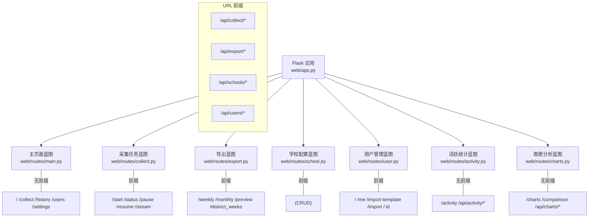
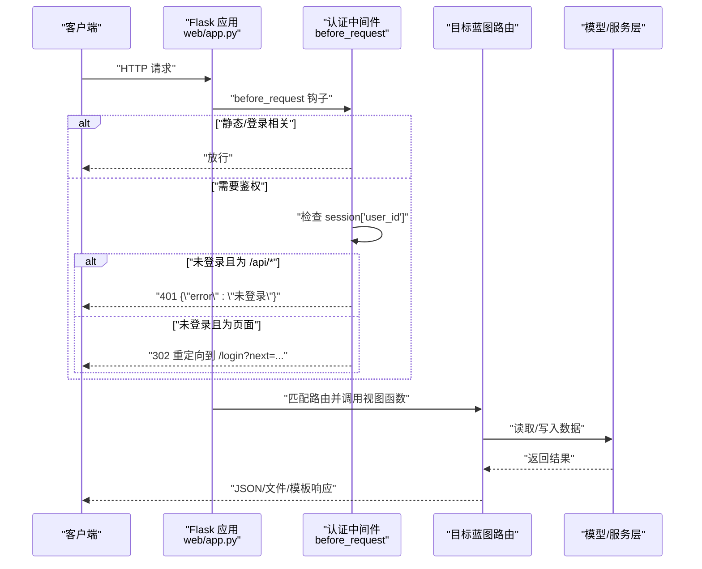
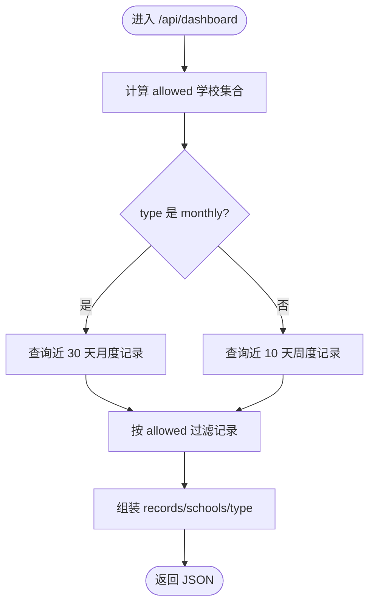
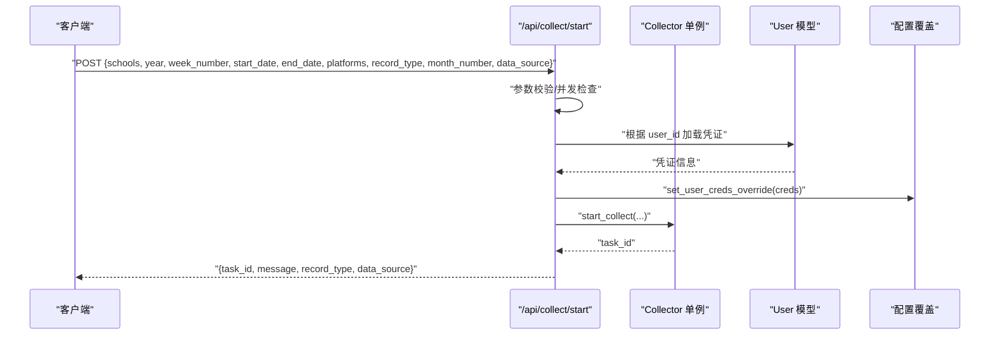
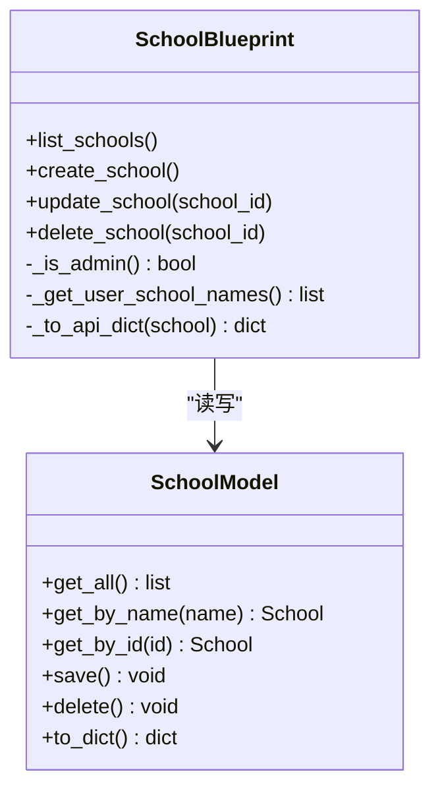
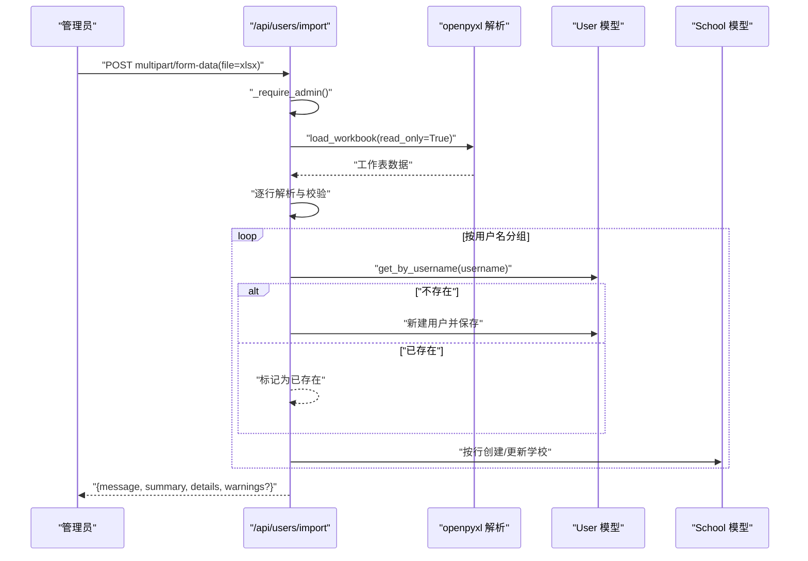
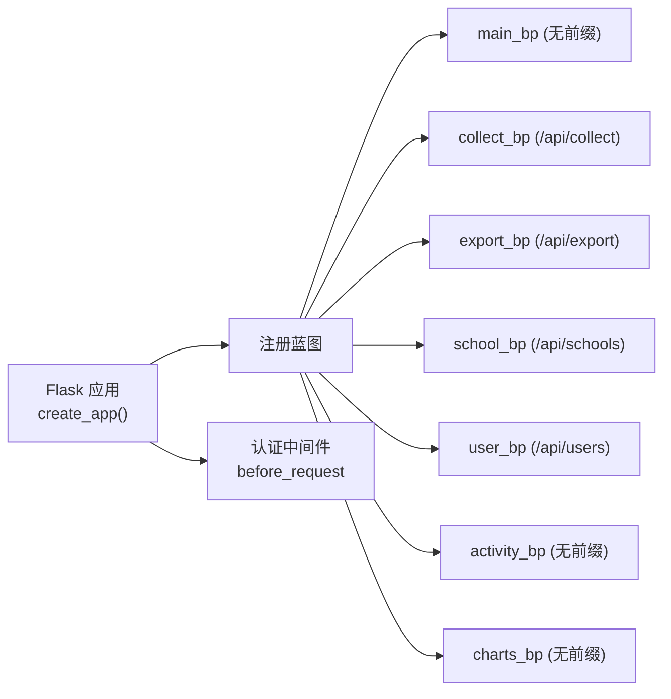

# 路由系统

<cite>
**本文引用的文件**   
- [web/app.py](file://web/app.py)
- [web/routes/main.py](file://web/routes/main.py)
- [web/routes/collect.py](file://web/routes/collect.py)
- [web/routes/export.py](file://web/routes/export.py)
- [web/routes/school.py](file://web/routes/school.py)
- [web/routes/user.py](file://web/routes/user.py)
- [web/routes/activity.py](file://web/routes/activity.py)
- [web/routes/charts.py](file://web/routes/charts.py)
</cite>

## 目录
1. [简介](#简介)
2. [项目结构](#项目结构)
3. [核心组件](#核心组件)
4. [架构总览](#架构总览)
5. [详细组件分析](#详细组件分析)
6. [依赖关系分析](#依赖关系分析)
7. [性能与扩展性](#性能与扩展性)
8. [故障排查指南](#故障排查指南)
9. [结论](#结论)
10. [附录：API 规范与最佳实践](#附录api-规范与最佳实践)

## 简介
本技术文档围绕 Flask 蓝图路由系统，系统化梳理各蓝图的职责划分、URL 前缀组织、路由装饰器使用方式，并总结 RESTful API 设计规范、请求参数校验、响应格式标准化策略。同时说明认证中间件执行流程、权限检查实现、统一错误处理思路，并结合现有代码给出 API 版本控制、请求限流、缓存策略的落地建议。最后提供路由测试、调试技巧与性能监控的实践建议。

## 项目结构
应用采用“按功能域拆分蓝图”的组织方式，所有业务路由集中在 web/routes 下，通过工厂函数在 web/app.py 中注册蓝图并挂载 URL 前缀。认证与上下文注入在应用启动阶段完成。



图示来源
- [web/app.py:306-337](file://web/app.py#L306-L337)
- [web/routes/main.py:10-143](file://web/routes/main.py#L10-L143)
- [web/routes/collect.py:13-170](file://web/routes/collect.py#L13-L170)
- [web/routes/export.py:10-124](file://web/routes/export.py#L10-L124)
- [web/routes/school.py:6-155](file://web/routes/school.py#L6-L155)
- [web/routes/user.py:12-356](file://web/routes/user.py#L12-L356)
- [web/routes/activity.py:9-173](file://web/routes/activity.py#L9-L173)
- [web/routes/charts.py:17-800](file://web/routes/charts.py#L17-L800)

章节来源
- [web/app.py:306-337](file://web/app.py#L306-L337)

## 核心组件
- 蓝图与 URL 前缀
  - main_bp：首页、仪表盘、历史记录等页面与少量 API（无前缀）
  - collect_bp：采集任务生命周期控制与 SSE 进度流（前缀 /api/collect）
  - export_bp：数据导出与预览（前缀 /api/export）
  - school_bp：学校配置 CRUD（前缀 /api/schools）
  - user_bp：用户管理与批量导入（前缀 /api/users）
  - activity_bp：活跃统计页面与 API（无前缀）
  - charts_bp：图表分析与多校对比（无前缀）

- 认证与权限
  - before_request 全局鉴权：未登录访问 /api/* 返回 401 JSON；其他路径重定向到登录页
  - 管理员权限：部分接口通过 session["is_admin"] 判断，拒绝非管理员操作
  - 资源级权限：如学校编辑/删除需校验当前用户是否拥有该学校

- 请求参数校验与响应格式
  - 统一使用 request.get_json()/request.args 获取参数并进行必填项校验
  - 成功响应多为 {"message": "...", ...} 或 {"records": [...]} 等结构化 JSON
  - 失败响应包含 {"error": "..."} 字段，并附带合适的 HTTP 状态码

章节来源
- [web/app.py:253-304](file://web/app.py#L253-L304)
- [web/routes/main.py:10-143](file://web/routes/main.py#L10-L143)
- [web/routes/collect.py:22-170](file://web/routes/collect.py#L22-L170)
- [web/routes/export.py:17-124](file://web/routes/export.py#L17-L124)
- [web/routes/school.py:18-155](file://web/routes/school.py#L18-L155)
- [web/routes/user.py:15-356](file://web/routes/user.py#L15-L356)

## 架构总览
下图展示请求从进入应用到蓝图路由处理的整体流程，包括认证中间件、权限检查、业务逻辑与响应返回。



图示来源
- [web/app.py:253-304](file://web/app.py#L253-L304)
- [web/routes/main.py:41-143](file://web/routes/main.py#L41-L143)
- [web/routes/collect.py:22-170](file://web/routes/collect.py#L22-L170)
- [web/routes/export.py:31-124](file://web/routes/export.py#L31-L124)
- [web/routes/school.py:47-155](file://web/routes/school.py#L47-L155)
- [web/routes/user.py:21-356](file://web/routes/user.py#L21-L356)

## 详细组件分析

### 主页面与仪表盘（main_bp）
- 职责
  - 渲染首页、采集页、历史记录页、用户管理页、设置页
  - 提供仪表盘数据 API（周/月记录聚合）
- URL 前缀
  - 无前缀
- 关键路由
  - GET / → 仪表盘
  - GET /collect → 数据采集页
  - GET /history → 历史记录页
  - GET /api/dashboard?type=weekly|monthly → 仪表盘数据
  - GET /api/history/monthly?year=&month_number=&school_name= → 月度历史
  - GET /users → 用户管理（仅管理员）
  - GET /settings → 个人设置
- 权限与过滤
  - 根据 session 中的 is_admin 与 assigned_schools 进行数据可见性过滤
- 响应格式
  - 页面渲染返回 HTML
  - API 返回 {"records":[...], "schools":[...], "type":"weekly|monthly"} 等



图示来源
- [web/routes/main.py:87-128](file://web/routes/main.py#L87-L128)

章节来源
- [web/routes/main.py:10-143](file://web/routes/main.py#L10-L143)

### 采集任务（collect_bp）
- 职责
  - 启动/暂停/恢复采集任务
  - 查询任务状态
  - 通过 SSE 推送实时进度
- URL 前缀
  - /api/collect
- 关键路由
  - POST /api/collect/start → 启动采集（含参数校验与并发限制）
  - GET /api/collect/status → 任务状态
  - POST /api/collect/pause → 暂停
  - POST /api/collect/resume → 继续
  - GET /api/collect/stream → SSE 进度流
- 参数校验
  - 必填项：schools、week_number、start_date、end_date
  - 日期格式校验、学校存在性校验、月度模式月次枚举校验
  - 并发限制：已有任务运行则拒绝新任务
- 响应格式
  - 成功：{"task_id": "...", "message": "...", "record_type": "...", "data_source": "..."}
  - 失败：{"error": "..."} + 对应状态码
- SSE 设计
  - 每个客户端独立订阅队列，心跳事件与完成事件兜底退出



图示来源
- [web/routes/collect.py:22-102](file://web/routes/collect.py#L22-L102)

章节来源
- [web/routes/collect.py:13-170](file://web/routes/collect.py#L13-L170)

### 数据导出（export_bp）
- 职责
  - 导出周度/月度数据为 Excel
  - 提供数据预览（JSON）
  - 查询某年已存在的周标签集合
- URL 前缀
  - /api/export
- 关键路由
  - GET /api/export/weekly?year=&week_number=&school_name=&month_prefix=
  - GET /api/export/monthly?year=&month_number=&school_name=
  - GET /api/export/preview?year=&week_number=&school_name=&month_prefix=
  - GET /api/export/distinct_weeks?year=
- 权限与过滤
  - 非管理员若选择不在其范围内的学校，返回空或 403
- 响应格式
  - 导出：返回文件下载
  - 预览：{"records": [...]}
  - 周标签：{"weeks": [...]}

```mermaid
flowchart TD
S(["GET /api/export/weekly"]) --> ParseArgs["解析 year/week_number/school_name/month_prefix"]
ParseArgs --> CheckYear{"year 是否为空?"}
CheckYear --> |是| Err400["返回 400 {\"error\":\"请提供 year 参数\"}"]
CheckYear --> |否| CheckPerm["权限与范围校验"]
CheckPerm --> |无权| Err403["返回 403 {\"error\":\"无权访问该学校数据\"}"]
CheckPerm --> Query["查询 WeeklyRecord 记录"]
Query --> Filter["按 allowed 二次过滤"]
Filter --> Empty{"是否有记录?"}
Empty --> |否| Err404["返回 404 {\"error\":\"没有找到对应数据\"}"]
Empty --> |是| Export["生成 Excel 并返回下载"]
```

图示来源
- [web/routes/export.py:31-62](file://web/routes/export.py#L31-L62)

章节来源
- [web/routes/export.py:10-124](file://web/routes/export.py#L10-L124)

### 学校配置（school_bp）
- 职责
  - 学校信息的增删改查
  - 创建时自动将学校加入当前用户的 assigned_schools（非管理员）
- URL 前缀
  - /api/schools
- 关键路由
  - GET /api/schools → 列表（受权限过滤）
  - POST /api/schools → 新增（必填 name/grafana_name/main_site_name）
  - PUT /api/schools/:id → 更新（权限校验）
  - DELETE /api/schools/:id → 删除（权限校验）
- 权限与校验
  - 非管理员只能编辑/删除分配给自身的学校
  - 名称唯一性校验
- 响应格式
  - 成功：{"school": {...}} 或 204 无内容
  - 失败：{"error": "..."} + 状态码



图示来源
- [web/routes/school.py:6-155](file://web/routes/school.py#L6-L155)

章节来源
- [web/routes/school.py:6-155](file://web/routes/school.py#L6-L155)

### 用户管理（user_bp）
- 职责
  - 用户 CRUD、个人信息修改、批量导入（Excel）
  - 管理员专用能力：创建/删除用户、修改角色与分配学校
- URL 前缀
  - /api/users
- 关键路由
  - GET /api/users → 列出所有用户（管理员）
  - GET /api/users/me → 当前用户信息
  - PUT /api/users/me → 修改当前用户凭证与密码
  - POST /api/users → 创建用户（管理员）
  - PUT /api/users/:id → 更新用户（管理员可改任何人，普通用户仅自己）
  - DELETE /api/users/:id → 删除用户（管理员）
  - GET /api/users/import-template → 下载导入模板
  - POST /api/users/import → 批量导入用户及学校
- 权限与校验
  - _require_admin 辅助函数用于管理员保护
  - 用户名唯一性校验
  - 批量导入对行数据进行逐行校验并汇总错误
- 响应格式
  - 成功：{"message": "...", "user": {...}} 或 201/204
  - 失败：{"error": "..."} + 状态码



图示来源
- [web/routes/user.py:226-339](file://web/routes/user.py#L226-L339)

章节来源
- [web/routes/user.py:12-356](file://web/routes/user.py#L12-L356)

### 活跃统计（activity_bp）
- 职责
  - 活跃统计页面与 API
  - 直接连接 Metabase 本地 SQLite 数据库进行统计
- URL 前缀
  - 无前缀
- 关键路由
  - GET /activity → 页面
  - GET /api/activity/schools → 启用学校列表
  - GET /api/activity/weekly?start_date=&end_date=&school_name= → 周活跃统计
  - GET /api/activity/monthly?start_date=&end_date=&school_name= → 月活跃统计
- 数据源
  - sqlite3 直连 metabase.db，注意异常与连接释放

章节来源
- [web/routes/activity.py:9-173](file://web/routes/activity.py#L9-L173)

### 图表分析（charts_bp）
- 职责
  - 图表页面与多校使用率对比
  - 支持按学段/年级/学科筛选，动态决定 X 轴维度
  - 模块级使用率可通过 Grafana SLS 或 Metabase API 回退
- URL 前缀
  - 无前缀
- 关键路由
  - GET /charts → 页面
  - GET /api/charts/options → 筛选项（学校/学段/年级/学科）
  - GET /api/charts/platform-usage → 平台使用率
  - GET /api/charts/multi-school-usage → 多校使用率对比
  - GET /comparison → 对比页面
- 复杂逻辑
  - 动态 SQL 构建与参数化查询
  - 多数据源回退（SLS/Metabase API/本地 monthly_records）

章节来源
- [web/routes/charts.py:17-800](file://web/routes/charts.py#L17-L800)

## 依赖关系分析
- 蓝图注册与 URL 前缀
  - 在 create_app 中集中注册蓝图，并对 API 类蓝图统一挂载 /api/* 前缀
- 认证中间件
  - before_request 对所有非静态/登录路径进行鉴权
- 模板与静态资源
  - 模板文件夹与静态文件夹在应用初始化时指定



图示来源
- [web/app.py:306-337](file://web/app.py#L306-L337)

章节来源
- [web/app.py:306-337]

## 性能与扩展性
- 并发与背压
  - 采集任务使用全局单例与队列，避免重复启动；SSE 长连接需关注服务器并发上限与内存占用
- 数据库连接
  - 活跃统计与图表分析直连 SQLite，建议在高频查询场景引入连接池或缓存层
- 外部依赖
  - 图表模块级使用率涉及 Grafana SLS 与 Metabase API，应增加超时与重试策略
- 可扩展点
  - 可在 before_request 后接入限流中间件（如基于 IP/用户 ID 的令牌桶）
  - 对只读 API 增加 Redis 缓存（带失效策略）
  - 对导出大文件考虑异步任务与回调通知

[本节为通用指导，不直接分析具体文件]

## 故障排查指南
- 常见错误定位
  - 401 未登录：检查 session 是否有效、登录接口是否正常
  - 403 权限不足：确认 is_admin 标志与 assigned_schools 是否正确
  - 400 参数错误：核对必填字段与格式（日期、月次枚举）
  - 404 资源不存在：检查 ID 是否存在
  - 409 冲突：采集任务正在运行或学校/用户名重复
- 日志与调试
  - 应用日志输出至 logs/app.log，结合 Python logging 查看
  - SSE 客户端侧监听心跳与完成事件，便于定位断连问题
- 数据库连接
  - 活跃统计与图表分析直连 SQLite，确保文件路径正确且未被占用

章节来源
- [web/app.py:14-25](file://web/app.py#L14-L25)
- [web/routes/collect.py:137-170](file://web/routes/collect.py#L137-L170)
- [web/routes/activity.py:12-46](file://web/routes/activity.py#L12-L46)
- [web/routes/charts.py:30-37](file://web/routes/charts.py#L30-L37)

## 结论
本项目以蓝图为核心组织路由，配合统一的认证中间件与清晰的权限控制，形成了较为规范的 Web 服务架构。API 层面遵循 RESTful 风格，参数校验与错误响应相对统一。后续可在限流、缓存、异步导出与更完善的 API 版本控制方面进一步增强，以提升系统的稳定性与可维护性。

[本节为总结性内容，不直接分析具体文件]

## 附录：API 规范与最佳实践

### RESTful 设计规范
- 资源命名
  - 使用名词复数表示资源集合，如 /api/users、/api/schools
- 方法语义
  - GET 读取、POST 创建、PUT 全量更新、DELETE 删除
- 状态码
  - 200/201/204 成功；400 参数错误；401 未登录；403 权限不足；404 不存在；409 冲突；500 服务端错误
- 响应体
  - 成功：{message, data} 或 {records:[...]}
  - 失败：{error:"..."}

章节来源
- [web/routes/user.py:21-135](file://web/routes/user.py#L21-L135)
- [web/routes/school.py:47-155](file://web/routes/school.py#L47-L155)
- [web/routes/export.py:31-124](file://web/routes/export.py#L31-L124)

### 请求参数验证
- 必填项校验
  - 采集任务：schools、week_number、start_date、end_date
  - 导出：year 必填
  - 学校：name/grafana_name/main_site_name 必填
- 格式校验
  - 日期 ISO 格式、月次枚举（一月~十二月）
- 业务校验
  - 学校存在性、用户名唯一性、时间范围有效性

章节来源
- [web/routes/collect.py:22-62](file://web/routes/collect.py#L22-L62)
- [web/routes/export.py:31-46](file://web/routes/export.py#L31-L46)
- [web/routes/school.py:53-66](file://web/routes/school.py#L53-L66)

### 响应格式标准化
- 统一 JSON 结构
  - 成功：{message, data} 或 {records:[...]}
  - 失败：{error:"..."}
- 文件下载
  - send_file 返回附件，文件名规范化

章节来源
- [web/routes/export.py:54-62](file://web/routes/export.py#L54-L62)
- [web/routes/user.py:218-223](file://web/routes/user.py#L218-L223)

### 路由中间件执行流程
- before_request 顺序
  - 跳过静态与登录相关端点
  - 未登录且为 /api/* → 401 JSON
  - 未登录且为页面 → 302 重定向到 /login?next=...
- 上下文注入
  - context_processor 向模板注入 current_user

章节来源
- [web/app.py:253-304](file://web/app.py#L253-L304)

### 权限检查实现
- 管理员保护
  - _require_admin 辅助函数
- 资源级权限
  - 学校编辑/删除需校验当前用户是否拥有该学校
  - 用户更新：普通用户仅能修改自身凭证

章节来源
- [web/routes/user.py:15-19](file://web/routes/user.py#L15-L19)
- [web/routes/school.py:105-108](file://web/routes/school.py#L105-L108)
- [web/routes/user.py:108-111](file://web/routes/user.py#L108-L111)

### 统一错误处理策略
- 参数错误 → 400 + {error}
- 未登录 → 401 + {error}
- 权限不足 → 403 + {error}
- 资源不存在 → 404 + {error}
- 冲突（并发/重复） → 409 + {error}
- 服务端异常 → 500 + {error}

章节来源
- [web/routes/collect.py:100-102](file://web/routes/collect.py#L100-L102)
- [web/routes/school.py:66-67](file://web/routes/school.py#L66-L67)
- [web/routes/export.py:44-46](file://web/routes/export.py#L44-L46)

### API 版本控制建议
- URL 前缀版本化
  - 例如 /api/v1/users、/api/v1/schools
- 向后兼容
  - 新增字段保持可选，废弃字段保留一段时间并打日志
- 变更公告
  - 在 /api/version 或文档站点发布变更说明

[本节为通用指导，不直接分析具体文件]

### 请求限流建议
- 基于 IP/用户 ID 的令牌桶或滑动窗口
- 针对敏感接口（/api/users/import、/api/collect/start）加强限流
- 限流失败返回 429 + {error:"请求过于频繁"}

[本节为通用指导，不直接分析具体文件]

### 缓存策略建议
- 只读 API 缓存
  - 如 /api/charts/options、/api/activity/schools
- 缓存键设计
  - 包含筛选条件与用户可见范围
- 失效策略
  - 写操作后主动失效或 TTL 过期

[本节为通用指导，不直接分析具体文件]

### 路由测试最佳实践
- 单元测试
  - 使用 Flask Test Client 构造请求，断言状态码与响应体结构
- 集成测试
  - 准备最小数据集（用户/学校），覆盖权限分支与边界条件
- 并发测试
  - 对采集任务并发启动与暂停/恢复进行压力测试

[本节为通用指导，不直接分析具体文件]

### 调试技巧
- 开启 TEMPLATES_AUTO_RELOAD 以便开发期模板热更新
- 查看 logs/app.log 定位异常堆栈
- SSE 客户端侧打印心跳与完成事件，便于定位断连

章节来源
- [web/app.py:313-314](file://web/app.py#L313-L314)
- [web/app.py:14-25](file://web/app.py#L14-L25)
- [web/routes/collect.py:137-170](file://web/routes/collect.py#L137-L170)

### 性能监控建议
- 指标采集
  - 接口耗时、QPS、错误率、SSE 连接数
- 慢查询定位
  - 对 SQLite 查询添加必要索引（teacher_base、dws_ingress_teacher_day）
- 外部依赖监控
  - Grafana SLS/Metabase API 超时与成功率

[本节为通用指导，不直接分析具体文件]