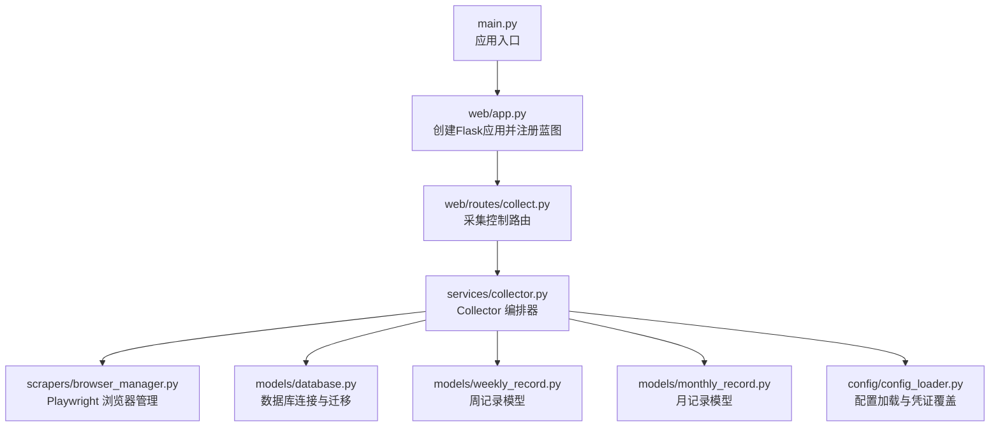
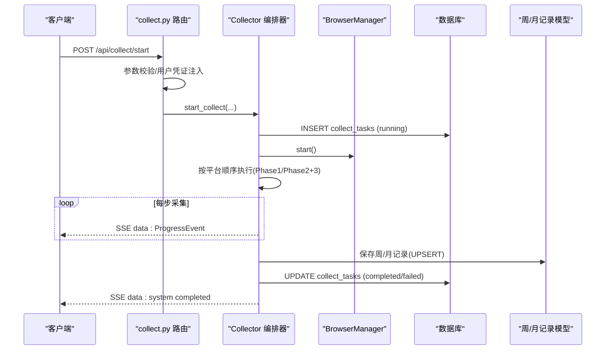
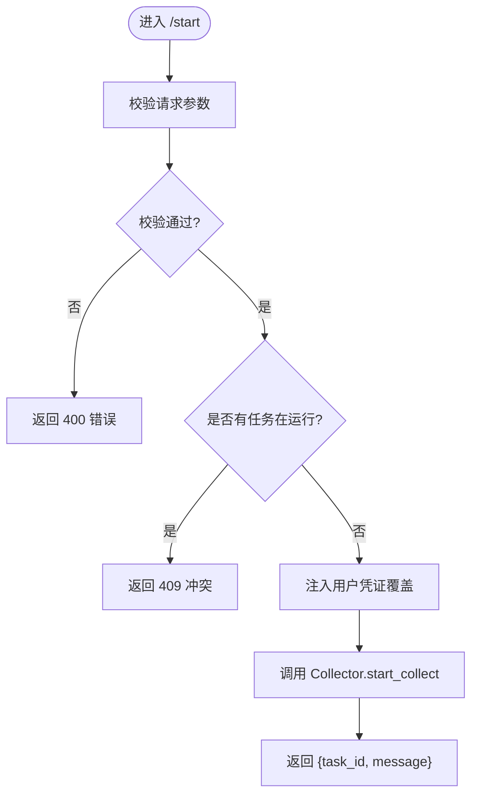
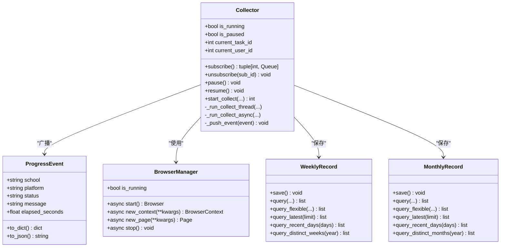
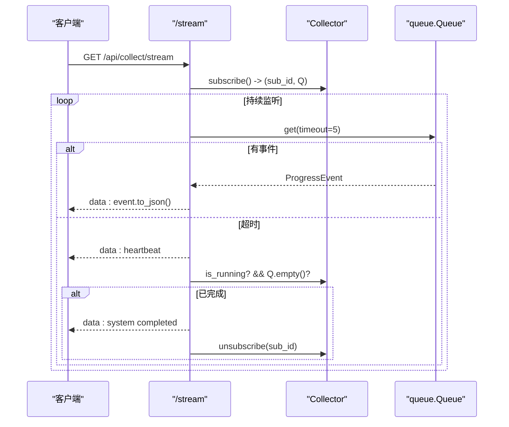
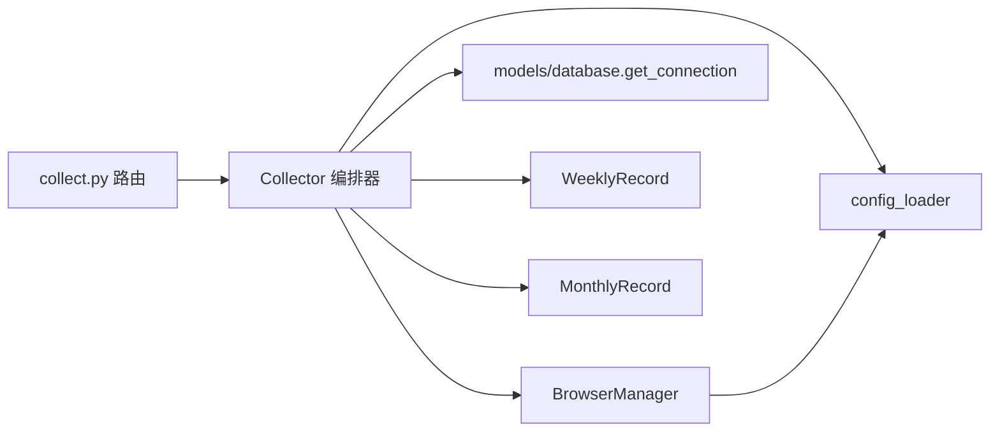

# 采集控制路由

<cite>
**本文引用的文件**   
- [web/routes/collect.py](file://web/routes/collect.py)
- [services/collector.py](file://services/collector.py)
- [web/app.py](file://web/app.py)
- [main.py](file://main.py)
- [models/database.py](file://models/database.py)
- [models/weekly_record.py](file://models/weekly_record.py)
- [models/monthly_record.py](file://models/monthly_record.py)
- [scrapers/browser_manager.py](file://scrapers/browser_manager.py)
- [config/config_loader.py](file://config/config_loader.py)
- [scrapers/retry.py](file://scrapers/retry.py)
</cite>

## 目录
1. [简介](#简介)
2. [项目结构](#项目结构)
3. [核心组件](#核心组件)
4. [架构总览](#架构总览)
5. [详细组件分析](#详细组件分析)
6. [依赖关系分析](#依赖关系分析)
7. [性能考虑](#性能考虑)
8. [故障排查指南](#故障排查指南)
9. [结论](#结论)
10. [附录：API 接口文档](#附录api-接口文档)

## 简介
本技术文档聚焦“数据采集控制路由”，围绕以下目标展开：
- 采集任务生命周期管理：启动、暂停、恢复、停止等接口的行为与约束。
- 实时进度监控：基于 SSE（Server-Sent Events）的推送机制与事件语义。
- 并发控制策略：平台优先的并行/串行执行模型，资源限制与上下文复用。
- 错误处理与重试：网络异常、浏览器自动化失败等场景的处理与降级策略。
- API 接口规范：请求参数校验、响应格式、错误码定义。
- 性能优化建议与故障排查指南。

## 项目结构
与采集控制路由直接相关的代码组织如下：
- Web 层：Flask 蓝图注册与认证中间件，采集相关路由位于 web/routes/collect.py。
- 服务层：Collector 编排器负责任务调度、并发控制、SSE 广播、结果落库。
- 数据层：SQLite 数据库初始化与表结构维护；周/月记录模型。
- 爬虫层：Playwright 浏览器管理器与可选 API 直连采集器（按配置启用）。
- 配置层：YAML 配置加载、用户凭证覆盖、学校配置读取。

**图表来源** 
- [main.py:1-42](file://main.py#L1-L42)
- [web/app.py:306-337](file://web/app.py#L306-L337)
- [web/routes/collect.py:1-170](file://web/routes/collect.py#L1-L170)
- [services/collector.py:65-176](file://services/collector.py#L65-L176)
- [scrapers/browser_manager.py:1-76](file://scrapers/browser_manager.py#L1-L76)
- [models/database.py:201-372](file://models/database.py#L201-L372)
- [models/weekly_record.py:1-163](file://models/weekly_record.py#L1-L163)
- [models/monthly_record.py:1-200](file://models/monthly_record.py#L1-L200)
- [config/config_loader.py:1-147](file://config/config_loader.py#L1-L147)

**章节来源**
- [main.py:1-42](file://main.py#L1-L42)
- [web/app.py:306-337](file://web/app.py#L306-L337)

## 核心组件
- 采集控制路由（collect_bp）
  - 提供 /start、/status、/pause、/resume、/stream 等接口。
  - 负责请求参数校验、用户凭证注入、调用 Collector 启动任务、SSE 订阅。
- 采集编排器（Collector）
  - 单例全局对象，维护运行状态、暂停信号、SSE 订阅者队列。
  - 后台线程 + asyncio 事件循环驱动异步采集流程。
  - 支持多平台（Grafana、Metabase/Lida、主站）按平台优先顺序执行，部分阶段并行。
  - 将进度事件广播到所有 SSE 客户端，最终汇总写入数据库。
- 浏览器管理器（BrowserManager）
  - 管理 Playwright 实例生命周期，支持无头模式、超时、视口设置。
- 配置加载器（config_loader）
  - 加载 YAML 配置，校验必填字段，支持用户级凭证覆盖。
- 数据模型与数据库
  - SQLite 连接管理、表结构初始化与增量迁移。
  - 周/月记录模型提供 UPSERT 保存与查询方法。

**章节来源**
- [web/routes/collect.py:1-170](file://web/routes/collect.py#L1-L170)
- [services/collector.py:65-176](file://services/collector.py#L65-L176)
- [scrapers/browser_manager.py:1-76](file://scrapers/browser_manager.py#L1-L76)
- [config/config_loader.py:1-147](file://config/config_loader.py#L1-L147)
- [models/database.py:201-372](file://models/database.py#L201-L372)
- [models/weekly_record.py:1-163](file://models/weekly_record.py#L1-L163)
- [models/monthly_record.py:1-200](file://models/monthly_record.py#L1-L200)

## 架构总览
采集控制路由通过 Flask 蓝图暴露 REST 接口，后端由 Collector 编排器驱动异步采集流程，结合浏览器或 API 直连方式获取数据，并通过 SSE 向客户端推送实时进度。

**图表来源** 
- [web/routes/collect.py:22-102](file://web/routes/collect.py#L22-L102)
- [services/collector.py:133-212](file://services/collector.py#L133-L212)
- [services/collector.py:214-862](file://services/collector.py#L214-L862)
- [models/database.py:201-372](file://models/database.py#L201-L372)
- [models/weekly_record.py:32-68](file://models/weekly_record.py#L32-L68)
- [models/monthly_record.py:47-100](file://models/monthly_record.py#L47-L100)
- [scrapers/browser_manager.py:18-35](file://scrapers/browser_manager.py#L18-L35)

## 详细组件分析

### 采集控制路由（collect_bp）
- 启动采集（POST /api/collect/start）
  - 参数校验：学校列表、周次/月次、时间范围、日期格式、月度月次枚举、互斥检查（是否已有任务在运行）。
  - 用户凭证注入：从会话中读取 user_id，构造平台用户名/密码覆盖，调用配置加载器的覆盖函数。
  - 调用 Collector.start_collect 返回 task_id。
- 状态查询（GET /api/collect/status）
  - 返回 is_running、is_paused、current_task_id、current_user_id。
- 暂停（POST /api/collect/pause）
  - 若未运行则报错；已暂停则提示；否则设置暂停信号。
- 恢复（POST /api/collect/resume）
  - 若未运行则报错；未暂停则提示；否则清除暂停信号。
- SSE 流（GET /api/collect/stream）
  - 为每个客户端分配独立队列，轮询事件并推送；心跳检测；完成时退出并取消订阅。

**图表来源** 
- [web/routes/collect.py:22-102](file://web/routes/collect.py#L22-L102)

**章节来源**
- [web/routes/collect.py:22-170](file://web/routes/collect.py#L22-L170)

### 采集编排器（Collector）
- 生命周期与并发
  - 使用 threading.Event 实现暂停/继续；后台线程启动 asyncio.run 执行异步采集。
  - 平台优先策略：Phase1（Grafana 或数据库直查），Phase2+3（Metabase/Lida 与主站并行，各平台内学校顺序执行）。
  - 共享浏览器上下文：主站 API 与浏览器共用 context，避免重复登录导致会话被杀。
- 进度事件与 SSE
  - ProgressEvent 封装 school/platform/status/message/elapsed_seconds。
  - _push_event 将事件放入所有订阅者的 queue.Queue；/stream 端点消费队列并以 text/event-stream 推送。
- 结果持久化
  - 根据 record_type 选择 WeeklyRecord 或 MonthlyRecord，计算部分字段（如整体活跃度），保存后更新 collect_tasks 状态。
- 错误处理与降级
  - Grafana/主站：先尝试 API 直连，失败或空数据自动降级到浏览器模式。
  - Metabase/Lida：纯 API 模式，失败记录错误并推送 failed 事件。
  - 异常捕获：外层 try/except 记录日志并更新任务状态为 failed。

**图表来源** 
- [services/collector.py:39-176](file://services/collector.py#L39-L176)
- [services/collector.py:214-862](file://services/collector.py#L214-L862)
- [scrapers/browser_manager.py:11-76](file://scrapers/browser_manager.py#L11-L76)
- [models/weekly_record.py:9-163](file://models/weekly_record.py#L9-L163)
- [models/monthly_record.py:9-200](file://models/monthly_record.py#L9-L200)

**章节来源**
- [services/collector.py:65-176](file://services/collector.py#L65-L176)
- [services/collector.py:214-862](file://services/collector.py#L214-L862)

### SSE 进度监控
- 订阅与发布
  - subscribe/unsubscribe 管理订阅者字典与计数器，线程安全。
  - _push_event 遍历所有订阅队列 put 事件。
- 客户端消费
  - /stream 使用 stream_with_context 生成器，每 5 秒阻塞取事件；队列为空时发送心跳；当系统 completed 或运行结束且队列为空时终止。
- 事件语义
  - platform 可为 lida/grafana/main_site/system/all。
  - status 包括 pending/running/completed/failed。
  - 包含 elapsed_seconds 用于前端展示耗时。

**图表来源** 
- [web/routes/collect.py:137-170](file://web/routes/collect.py#L137-L170)
- [services/collector.py:102-132](file://services/collector.py#L102-L132)
- [services/collector.py:857-862](file://services/collector.py#L857-L862)

**章节来源**
- [web/routes/collect.py:137-170](file://web/routes/collect.py#L137-L170)
- [services/collector.py:102-132](file://services/collector.py#L102-L132)
- [services/collector.py:857-862](file://services/collector.py#L857-L862)

### 并发控制与资源限制
- 平台优先与并行
  - Phase1：Grafana 或数据库直查，逐校顺序执行。
  - Phase2+3：Metabase/Lida 与主站并行；各平台内部逐校顺序执行，避免竞争。
- 浏览器上下文复用
  - 主站 API 与浏览器共享同一 BrowserContext，减少登录次数，避免 Cloud 会话被杀。
- 暂停/继续
  - 在每个学校开始采集前检查 pause_event，等待恢复后再继续。
- 资源清理
  - finally 块确保关闭浏览器、重置运行状态、清空当前任务标识。

**章节来源**
- [services/collector.py:631-730](file://services/collector.py#L631-L730)
- [services/collector.py:838-862](file://services/collector.py#L838-L862)

### 错误处理与重试机制
- 通用重试装饰器（with_retry）
  - 支持同步/异步函数，指数退避，可配置最大尝试次数与可重试异常类型。
  - 适用于网络异常（TimeoutError、ConnectionError、OSError）等场景。
- 采集流程中的降级与容错
  - Grafana/主站：API 失败或空数据自动降级到浏览器模式。
  - Metabase/Lida：API 不可用或异常时记录错误并推送 failed 事件。
  - 异常捕获：外层 try/except 记录日志并更新任务状态为 failed。
- 注意
  - 当前采集主流程未直接使用 with_retry 装饰器，但提供了通用能力供扩展。

**章节来源**
- [scrapers/retry.py:1-82](file://scrapers/retry.py#L1-L82)
- [services/collector.py:337-406](file://services/collector.py#L337-L406)
- [services/collector.py:551-630](file://services/collector.py#L551-L630)
- [services/collector.py:838-862](file://services/collector.py#L838-L862)

### 数据持久化与模型
- 数据库初始化与迁移
  - 创建 weekly_records、monthly_records、collect_tasks、schools、users 等表。
  - 增量迁移：添加缺失列（platform_elapsed、data_source、record_type 等）。
- 记录保存
  - WeeklyRecord/MonthlyRecord.save 使用 UPSERT，避免重复插入。
  - 根据 errors 列表判定 success/partial/failed，并记录 error_message。
- 数据来源标记
  - 当 data_source="database" 时，记录 data_source 字段以区分数据来源。

**章节来源**
- [models/database.py:201-372](file://models/database.py#L201-L372)
- [models/weekly_record.py:32-68](file://models/weekly_record.py#L32-L68)
- [models/monthly_record.py:47-100](file://models/monthly_record.py#L47-L100)
- [services/collector.py:732-837](file://services/collector.py#L732-L837)

## 依赖关系分析
- 路由依赖 Collector 单例，Collector 依赖 BrowserManager、配置加载器、数据模型与数据库连接。
- 浏览器管理器依赖配置加载器获取浏览器参数。
- 配置加载器提供学校配置与用户凭证覆盖。
- 数据模型依赖数据库连接上下文管理器。

**图表来源** 
- [web/routes/collect.py:1-170](file://web/routes/collect.py#L1-L170)
- [services/collector.py:65-176](file://services/collector.py#L65-L176)
- [scrapers/browser_manager.py:1-76](file://scrapers/browser_manager.py#L1-L76)
- [config/config_loader.py:1-147](file://config/config_loader.py#L1-L147)
- [models/database.py:24-48](file://models/database.py#L24-L48)
- [models/weekly_record.py:1-163](file://models/weekly_record.py#L1-L163)
- [models/monthly_record.py:1-200](file://models/monthly_record.py#L1-L200)

**章节来源**
- [web/routes/collect.py:1-170](file://web/routes/collect.py#L1-L170)
- [services/collector.py:65-176](file://services/collector.py#L65-L176)
- [scrapers/browser_manager.py:1-76](file://scrapers/browser_manager.py#L1-L76)
- [config/config_loader.py:1-147](file://config/config_loader.py#L1-L147)
- [models/database.py:24-48](file://models/database.py#L24-L48)
- [models/weekly_record.py:1-163](file://models/weekly_record.py#L1-L163)
- [models/monthly_record.py:1-200](file://models/monthly_record.py#L1-L200)

## 性能考虑
- 浏览器模式优化
  - 无头模式默认开启，设置标准视口提升渲染稳定性。
  - 主站 API 与浏览器共享 BrowserContext，减少登录开销。
- 并发策略
  - 平台间并行（Lida 与主站），平台内顺序执行，降低竞争与资源争用。
- 网络与 IO
  - 使用 asyncio 事件循环，非阻塞 IO；必要时可使用 with_retry 进行指数退避重试。
- 数据库
  - SQLite WAL 模式提升并发读性能；UPSERT 避免重复写入。
- 前端体验
  - SSE 心跳机制保障长连接健康；及时取消订阅释放资源。

[本节为通用指导，不直接分析具体文件]

## 故障排查指南
- 常见问题
  - 启动失败：检查配置文件是否存在与必填字段是否完整；确认学校名称是否在数据库中。
  - 任务无法启动：确认没有正在运行的任务；查看 /status 接口返回。
  - SSE 无事件：检查 /stream 连接是否建立；确认 Collector 是否处于 running 状态。
  - 浏览器异常：查看 logs/app.log；确认 headless/slow_mo/default_timeout 配置合理。
  - API 直连失败：确认 aiohttp 等依赖安装；检查 credentials 配置；观察是否触发降级到浏览器。
- 定位步骤
  - 查看 collect_tasks 表状态与 result_summary。
  - 查看 weekly_records/monthly_records 的 status 与 error_message。
  - 检查浏览器上下文是否成功创建与关闭。
  - 使用 with_retry 对关键网络调用增加重试逻辑。

**章节来源**
- [web/app.py:14-24](file://web/app.py#L14-24)
- [models/database.py:201-372](file://models/database.py#L201-L372)
- [services/collector.py:838-862](file://services/collector.py#L838-L862)
- [scrapers/retry.py:1-82](file://scrapers/retry.py#L1-L82)

## 结论
采集控制路由通过清晰的职责分层与稳健的并发控制，实现了跨平台的稳定数据采集。SSE 实时推送提升了用户体验，API 直连与浏览器降级的组合增强了鲁棒性。建议在后续迭代中引入更细粒度的重试策略与指标监控，进一步提升系统的可靠性与可观测性。

[本节为总结，不直接分析具体文件]

## 附录：API 接口文档

- 启动采集
  - 路径：POST /api/collect/start
  - 请求体字段：
    - schools: 字符串数组，至少一个学校名称。
    - year: 整数，年份。
    - week_number: 字符串，周次或月次标签。
    - start_date: 字符串，YYYY-MM-DD。
    - end_date: 字符串，YYYY-MM-DD。
    - platforms: 字符串数组，可选，指定平台列表（grafana/lida/main_site）。
    - record_type: 字符串，weekly 或 monthly。
    - month_number: 字符串，月度模式下使用“一月”~“十二月”。
    - data_source: 字符串，grafana 或 database。
  - 成功响应：{task_id, message, record_type, data_source}
  - 错误码：
    - 400：参数校验失败（缺少必填项、日期格式错误、未知学校、无效月次）。
    - 409：已有任务在运行或运行时抛出 RuntimeError。

- 获取状态
  - 路径：GET /api/collect/status
  - 响应：{running, paused, task_id, user_id}

- 暂停采集
  - 路径：POST /api/collect/pause
  - 成功响应：{message}
  - 错误码：
    - 400：没有正在执行的采集任务。

- 恢复采集
  - 路径：POST /api/collect/resume
  - 成功响应：{message}
  - 错误码：
    - 400：没有正在执行的采集任务。

- SSE 进度流
  - 路径：GET /api/collect/stream
  - 内容类型：text/event-stream
  - 事件格式：data: {school, platform, status, message[, elapsed_seconds]}
  - 特殊事件：
    - type: heartbeat（心跳）
    - platform: system, status: completed（采集完成）

**章节来源**
- [web/routes/collect.py:22-170](file://web/routes/collect.py#L22-L170)