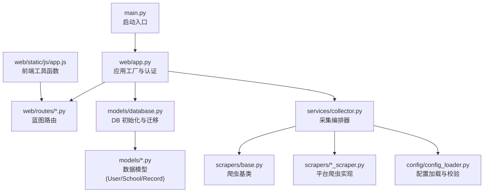
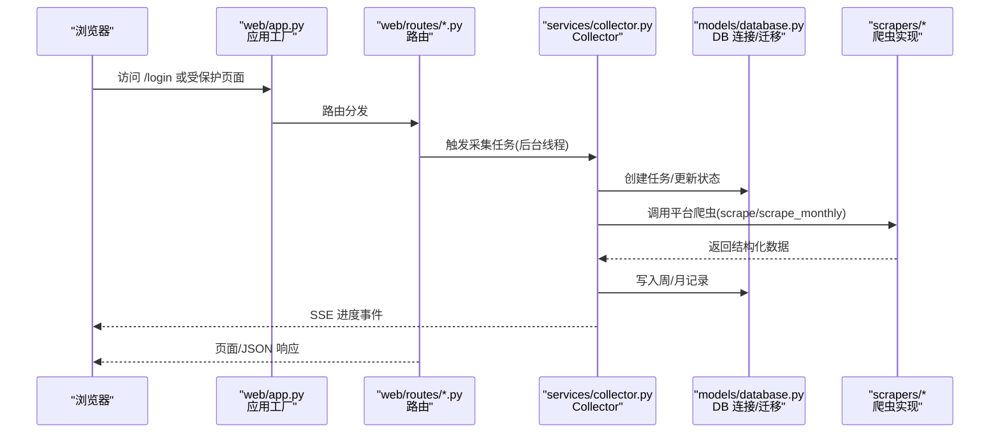
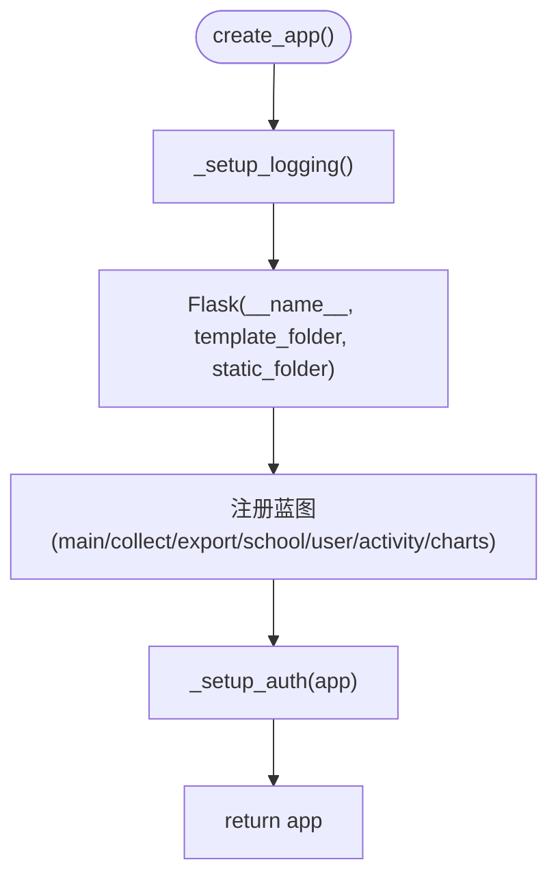
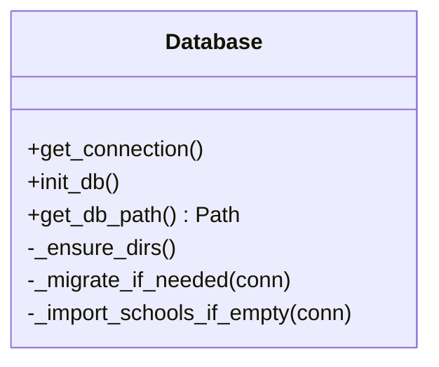
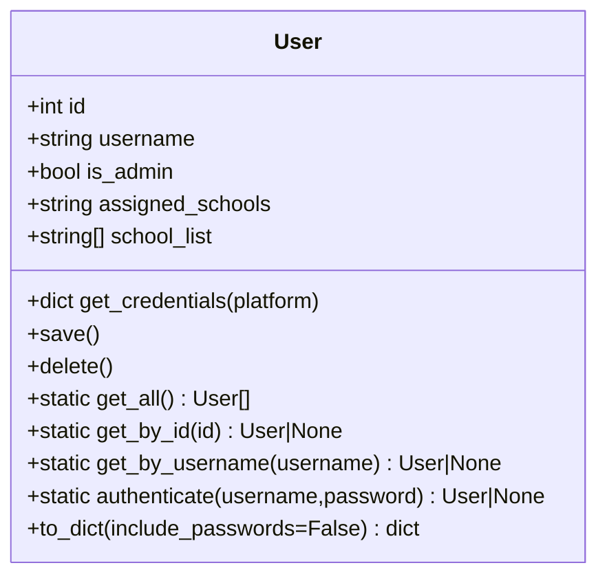
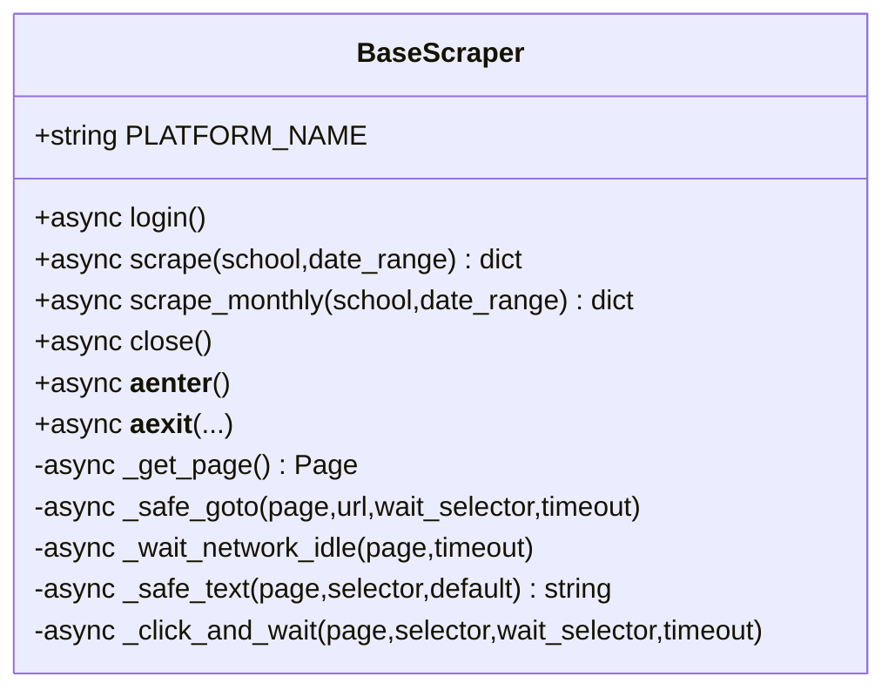
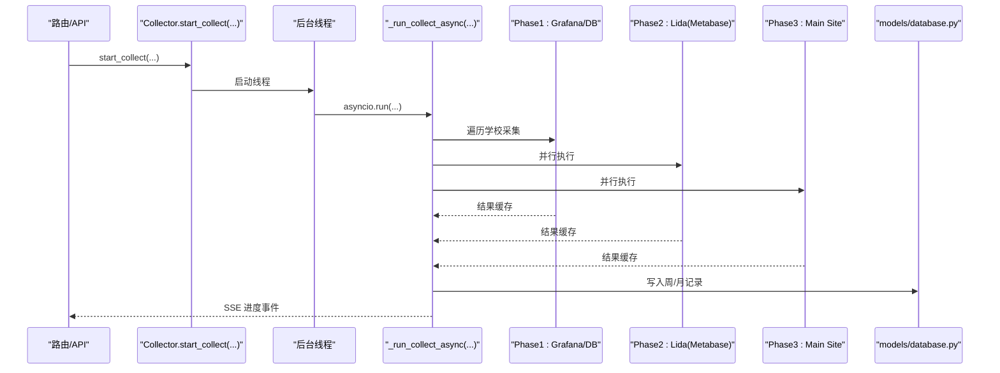
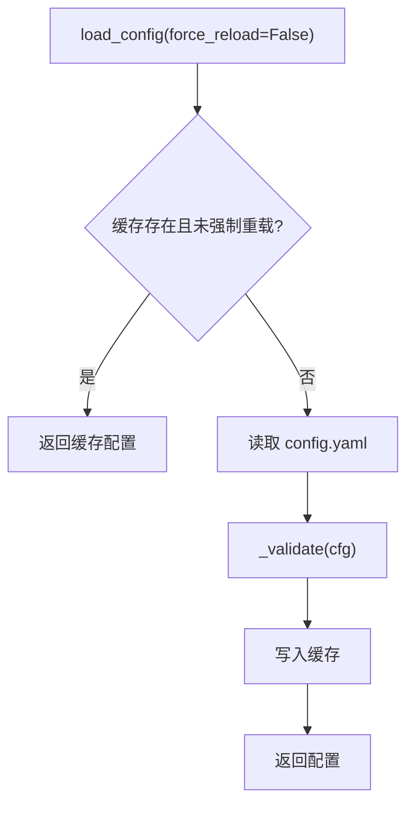
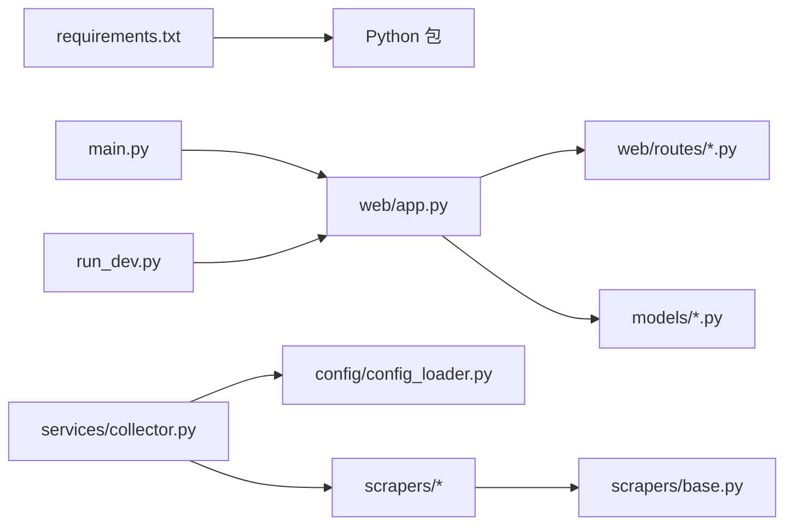

# 代码规范与约定

<cite>
**本文引用的文件**   
- [main.py](file://main.py)
- [run_dev.py](file://run_dev.py)
- [requirements.txt](file://requirements.txt)
- [.gitignore](file://.gitignore)
- [web/app.py](file://web/app.py)
- [models/database.py](file://models/database.py)
- [models/user.py](file://models/user.py)
- [scrapers/base.py](file://scrapers/base.py)
- [services/collector.py](file://services/collector.py)
- [config/config_loader.py](file://config/config_loader.py)
- [web/routes/main.py](file://web/routes/main.py)
- [web/static/js/app.js](file://web/static/js/app.js)
</cite>

## 目录
1. [引言](#引言)
2. [项目结构](#项目结构)
3. [核心组件](#核心组件)
4. [架构总览](#架构总览)
5. [详细组件分析](#详细组件分析)
6. [依赖分析](#依赖分析)
7. [性能考虑](#性能考虑)
8. [故障排查指南](#故障排查指南)
9. [结论](#结论)
10. [附录](#附录)

## 引言
本文件为“教育平台数据自动采集系统”的代码规范与命名约定标准，覆盖 Python 代码风格（PEP8）、函数与类命名、文件组织、模块导入顺序、异常处理模式、日志记录规范、数据库模型设计规范、API 接口设计原则、前端代码组织方式、注释与文档字符串格式、重构指导原则、代码质量检查工具配置（flake8、pylint）以及 Git 提交信息规范、分支命名约定与代码审查流程。所有规范均基于仓库现有实现提炼并给出可执行的落地建议。

## 项目结构
本项目采用分层+按功能域组织的目录结构：
- web：Flask 应用工厂、蓝图路由、模板与静态资源
- models：SQLite 连接管理、表结构初始化与 ORM 式数据模型
- scrapers：浏览器自动化与 API 直连爬虫抽象与实现
- services：采集编排器、任务调度与进度事件广播
- config：配置文件加载与校验、用户凭证覆盖机制
- tools：辅助脚本与测试入口
- logs/data：运行时日志与持久化数据

图表来源
- [main.py:1-42](file://main.py#L1-L42)
- [web/app.py:1-337](file://web/app.py#L1-L337)
- [models/database.py:1-372](file://models/database.py#L1-L372)
- [services/collector.py:1-862](file://services/collector.py#L1-L862)
- [scrapers/base.py:1-104](file://scrapers/base.py#L1-L104)
- [config/config_loader.py:1-147](file://config/config_loader.py#L1-L147)
- [web/static/js/app.js:1-23](file://web/static/js/app.js#L1-L23)

章节来源
- [main.py:1-42](file://main.py#L1-L42)
- [run_dev.py:1-15](file://run_dev.py#L1-L15)
- [requirements.txt:1-7](file://requirements.txt#L1-L7)
- [.gitignore:1-48](file://.gitignore#L1-L48)

## 核心组件
- 应用工厂与认证：集中创建 Flask 应用、注册蓝图、统一鉴权中间件与登录页渲染。
- 数据采集编排器：串联多平台爬虫（Grafana/Metabase/主站），支持 API 直连优先与浏览器降级，异步并发与暂停/继续控制，SSE 进度事件广播。
- 数据库层：SQLite 连接上下文、WAL 模式、外键约束、增量迁移、默认管理员与学校数据导入。
- 爬虫基类：Playwright 异步页面生命周期管理、通用导航/等待/点击封装。
- 配置加载：YAML 配置校验、缓存、用户级凭证覆盖、Metabase DB 路径解析。
- 路由层：仪表盘、采集、导出、学校、用户、活动、图表等蓝图。
- 前端：基础模板、静态 JS/CSS、登录表单交互。

章节来源
- [web/app.py:1-337](file://web/app.py#L1-L337)
- [services/collector.py:1-862](file://services/collector.py#L1-L862)
- [models/database.py:1-372](file://models/database.py#L1-L372)
- [scrapers/base.py:1-104](file://scrapers/base.py#L1-L104)
- [config/config_loader.py:1-147](file://config/config_loader.py#L1-L147)
- [web/routes/main.py:1-143](file://web/routes/main.py#L1-L143)
- [web/static/js/app.js:1-23](file://web/static/js/app.js#L1-L23)

## 架构总览
整体采用“Web 服务 + 采集编排 + 多源爬虫 + SQLite 存储”的架构。请求进入 Flask 路由后，通过编排器协调各平台采集器，结果落库并通过 SSE 推送进度；登录态与会话由应用工厂统一管理。

图表来源
- [web/app.py:1-337](file://web/app.py#L1-L337)
- [web/routes/main.py:1-143](file://web/routes/main.py#L1-L143)
- [services/collector.py:1-862](file://services/collector.py#L1-L862)
- [models/database.py:1-372](file://models/database.py#L1-L372)
- [scrapers/base.py:1-104](file://scrapers/base.py#L1-L104)

## 详细组件分析

### 应用工厂与认证（web/app.py）
- 职责：初始化日志、创建 Flask 实例、注册蓝图、注入认证中间件与上下文处理器。
- 关键约定：
  - 使用工厂函数 create_app 返回应用实例，避免全局副作用。
  - 统一 before_request 鉴权逻辑，区分静态资源与登录页。
  - 模板与静态目录通过绝对路径注册，便于部署。
  - SECRET_KEY 与 TEMPLATES_AUTO_RELOAD 在工厂中设置。

图表来源
- [web/app.py:1-337](file://web/app.py#L1-L337)

章节来源
- [web/app.py:1-337](file://web/app.py#L1-L337)

### 数据库模型与迁移（models/database.py）
- 职责：SQLite 连接上下文、WAL 模式、外键开启、表结构初始化与增量迁移、默认管理员与学校数据导入。
- 关键约定：
  - 使用 contextmanager 获取连接，确保事务与关闭。
  - 使用 executescript 批量建表，结合 PRAGMA table_info 做增量迁移。
  - 首次启动从配置导入学校数据到数据库。
  - 提供 get_db_path 用于外部读取数据库位置。

图表来源
- [models/database.py:1-372](file://models/database.py#L1-L372)

章节来源
- [models/database.py:1-372](file://models/database.py#L1-L372)

### 用户模型（models/user.py）
- 职责：用户实体、凭据聚合、CRUD、权限字段、序列化输出。
- 关键约定：
  - 使用 dataclass 定义模型，提供 to_dict 安全输出。
  - 提供 authenticate 静态方法用于登录验证。
  - assigned_schools 以分隔符字符串存储，提供 school_list 属性解析。

图表来源
- [models/user.py:1-113](file://models/user.py#L1-L113)

章节来源
- [models/user.py:1-113](file://models/user.py#L1-L113)

### 爬虫基类（scrapers/base.py）
- 职责：Playwright 异步页面生命周期管理、共享 BrowserContext 复用、通用导航/等待/点击封装。
- 关键约定：
  - 使用 async with 语义管理资源。
  - _safe_goto/_wait_network_idle/_safe_text/_click_and_wait 作为通用能力。
  - 子类必须实现 login 与 scrape/scrape_monthly。

图表来源
- [scrapers/base.py:1-104](file://scrapers/base.py#L1-L104)

章节来源
- [scrapers/base.py:1-104](file://scrapers/base.py#L1-L104)

### 采集编排器（services/collector.py）
- 职责：跨平台采集编排、API 直连优先与浏览器降级、并行/串行阶段控制、暂停/继续、SSE 进度事件、结果合并与落库。
- 关键约定：
  - 使用 threading.Thread + asyncio.run 将异步采集放入后台线程执行。
  - 通过 queue.Queue 向订阅者推送 ProgressEvent。
  - 支持 record_type='weekly'/'monthly' 与 data_source='grafana'/'database'。
  - 对 Grafana/Lida/Main Site 分别定义采集函数，按平台阶段执行。

图表来源
- [services/collector.py:1-862](file://services/collector.py#L1-L862)
- [models/database.py:1-372](file://models/database.py#L1-L372)

章节来源
- [services/collector.py:1-862](file://services/collector.py#L1-L862)

### 配置加载（config/config_loader.py）
- 职责：YAML 配置加载与校验、缓存、用户级凭证覆盖、Metabase DB 路径解析。
- 关键约定：
  - load_config 带缓存与强制重载参数。
  - _validate 校验必填项与类型。
  - get_credentials 支持用户覆盖。
  - get_metabase_db_path 优先级：环境变量 > 配置 > 默认值。

图表来源
- [config/config_loader.py:1-147](file://config/config_loader.py#L1-L147)

章节来源
- [config/config_loader.py:1-147](file://config/config_loader.py#L1-L147)

### 路由与前端（web/routes/main.py, web/static/js/app.js）
- 路由：首页、采集、历史、用户管理、设置等页面与对应 JSON API。
- 前端：基础日期格式化与 Toast 提示工具函数。

章节来源
- [web/routes/main.py:1-143](file://web/routes/main.py#L1-L143)
- [web/static/js/app.js:1-23](file://web/static/js/app.js#L1-L23)

## 依赖分析
- 运行期依赖：playwright、flask、pyyaml、openpyxl、aiohttp、waitress。
- 可选依赖：api_grafana/api_lida/api_main_site 在 collector 中以 try/except 动态导入，失败时回退浏览器模式。
- 内部依赖关系：
  - main.py/run_dev.py 调用 web.app.create_app。
  - web/app.py 注册蓝图并依赖 models.database.init_db。
  - services/collector 依赖 config.config_loader、models.*、scrapers.*。
  - scrapers.base 依赖 playwright.async_api 与 browser_manager。

图表来源
- [requirements.txt:1-7](file://requirements.txt#L1-L7)
- [main.py:1-42](file://main.py#L1-L42)
- [run_dev.py:1-15](file://run_dev.py#L1-L15)
- [web/app.py:1-337](file://web/app.py#L1-L337)
- [services/collector.py:1-862](file://services/collector.py#L1-L862)
- [scrapers/base.py:1-104](file://scrapers/base.py#L1-L104)
- [config/config_loader.py:1-147](file://config/config_loader.py#L1-L147)

章节来源
- [requirements.txt:1-7](file://requirements.txt#L1-L7)
- [main.py:1-42](file://main.py#L1-L42)
- [run_dev.py:1-15](file://run_dev.py#L1-L15)
- [web/app.py:1-337](file://web/app.py#L1-L337)
- [services/collector.py:1-862](file://services/collector.py#L1-L862)
- [scrapers/base.py:1-104](file://scrapers/base.py#L1-L104)
- [config/config_loader.py:1-147](file://config/config_loader.py#L1-L147)

## 性能考虑
- 数据库：启用 WAL 模式与外键约束，减少锁竞争并确保一致性。
- 采集：API 直连优先，失败自动降级至浏览器；同平台内学校顺序执行，跨平台并行执行；共享 BrowserContext 减少重复登录开销。
- 并发：后台线程 + asyncio 事件循环，避免阻塞 Web 进程。
- 资源清理：每个平台采集完成后显式关闭浏览器上下文与页面，防止内存泄漏。

[本节为通用性能讨论，不直接分析具体文件]

## 故障排查指南
- 登录问题：检查 before_request 鉴权逻辑与 session 是否包含 user_id；确认用户是否存在于 users 表。
- 采集失败：查看 collector 的错误缓存与 SSE 事件；确认 API 可用性与浏览器环境；核对学校配置与 Metabase 映射。
- 数据库迁移：关注 init_db 中的增量迁移逻辑与警告日志；必要时手动检查表结构与列名。
- 配置错误：load_config 会抛出 FileNotFoundError/ValueError，检查 config.yaml 必填字段与路径。

章节来源
- [web/app.py:1-337](file://web/app.py#L1-L337)
- [services/collector.py:1-862](file://services/collector.py#L1-L862)
- [models/database.py:1-372](file://models/database.py#L1-L372)
- [config/config_loader.py:1-147](file://config/config_loader.py#L1-L147)

## 结论
本项目遵循清晰的工厂模式与分层组织，采集编排器实现了高可用的多平台数据汇聚策略。通过统一的日志、迁移与配置机制，系统在可维护性与可扩展性方面具备良好基础。后续可在代码规范、质量检查与协作流程上进一步标准化，以提升团队效率与稳定性。

[本节为总结，不直接分析具体文件]

## 附录

### Python 代码风格与命名约定
- 遵循 PEP8：缩进 4 空格、行宽不超过 120 字符、空行与空格使用一致。
- 模块与包：全小写加下划线（如 web/app.py、services/collector.py）。
- 类：大驼峰（如 BaseScraper、Collector、User）。
- 函数与方法：小写下划线（如 get_connection、start_collect）。
- 常量：全大写加下划线（如 PLATFORM_NAME、SECRET_KEY）。
- 私有成员：单下划线前缀（如 _config_cache、_subscribers）。
- 类型注解：广泛使用 typing 与内置泛型（如 list[str]、dict | None）。

章节来源
- [scrapers/base.py:1-104](file://scrapers/base.py#L1-L104)
- [services/collector.py:1-862](file://services/collector.py#L1-L862)
- [models/user.py:1-113](file://models/user.py#L1-L113)
- [web/app.py:1-337](file://web/app.py#L1-L337)

### 模块导入顺序
- 标准库（sys、os、logging、pathlib、datetime、json、queue、threading、asyncio）。
- 第三方库（flask、playwright、yaml、sqlite3）。
- 本地模块（config、models、scrapers、services）。
- 示例参考：
  - [web/app.py:1-337](file://web/app.py#L1-L337)
  - [services/collector.py:1-862](file://services/collector.py#L1-L862)
  - [models/database.py:1-372](file://models/database.py#L1-L372)

### 异常处理模式
- 对外暴露明确错误消息（如 JSON 响应中的 error 字段）。
- 内部捕获并记录日志，避免崩溃传播。
- 采集流程中收集 errors_cache 并在最终记录中汇总。
- 参考：
  - [web/app.py:1-337](file://web/app.py#L1-L337)
  - [services/collector.py:1-862](file://services/collector.py#L1-L862)
  - [scrapers/base.py:1-104](file://scrapers/base.py#L1-L104)

### 日志记录规范
- 使用 logging.getLogger(__name__) 获取模块级 logger。
- 统一格式：时间戳、模块名、级别、消息。
- 文件与控制台双输出，logs 目录存放 app.log。
- 参考：
  - [web/app.py:1-337](file://web/app.py#L1-L337)
  - [models/database.py:1-372](file://models/database.py#L1-L372)
  - [services/collector.py:1-862](file://services/collector.py#L1-L862)

### 数据库模型设计规范
- 使用 SQLite + WAL + 外键约束。
- 表结构集中初始化，配合增量迁移添加缺失列。
- 提供 contextmanager 获取连接，保证事务与资源释放。
- 参考：
  - [models/database.py:1-372](file://models/database.py#L1-L372)

### API 接口设计原则
- RESTful 风格，蓝图按功能域划分（/api/collect、/api/export、/api/schools、/api/users）。
- 统一鉴权中间件，未登录返回 401 JSON。
- 分页与过滤参数清晰，返回结构化 JSON。
- 参考：
  - [web/app.py:1-337](file://web/app.py#L1-L337)
  - [web/routes/main.py:1-143](file://web/routes/main.py#L1-L143)

### 前端代码组织方式
- 模板位于 web/templates，静态资源位于 web/static/{css,js}。
- 公共 JS 工具函数集中管理（如 formatDate、showToast）。
- 登录表单使用 fetch 与 JSON 响应交互。
- 参考：
  - [web/static/js/app.js:1-23](file://web/static/js/app.js#L1-L23)
  - [web/app.py:1-337](file://web/app.py#L1-L337)

### 注释与文档字符串格式
- 模块级 docstring 说明用途与策略。
- 类与方法使用三引号文档字符串描述参数、返回值与行为。
- 复杂逻辑处增加行内注释解释决策点。
- 参考：
  - [services/collector.py:1-862](file://services/collector.py#L1-L862)
  - [scrapers/base.py:1-104](file://scrapers/base.py#L1-L104)
  - [config/config_loader.py:1-147](file://config/config_loader.py#L1-L147)

### 代码重构指导原则
- 单一职责：路由只负责请求分发，业务逻辑下沉至 services。
- 依赖注入：通过构造函数传入依赖（如 BrowserManager）。
- 幂等与可重试：对外部依赖调用增加重试与降级策略。
- 可观测性：完善日志与指标，便于定位问题。
- 参考：
  - [services/collector.py:1-862](file://services/collector.py#L1-L862)
  - [scrapers/base.py:1-104](file://scrapers/base.py#L1-L104)

### 代码质量检查工具配置
- flake8 规则建议：
  - max-line-length=120
  - ignore=E203,W503
  - per-file-ignores 针对生成文件或特定模块放宽限制
- pylint 规则建议：
  - disable=C0114,C0115（模块/类 docstring 非强制）
  - max-line-length=120
  - good-names=i,j,k,r,e,f,_
- 集成建议：
  - pre-commit 钩子运行 flake8/pylint
  - CI 流水线加入 lint 与单元测试
- 参考：
  - [requirements.txt:1-7](file://requirements.txt#L1-L7)

### Git 提交信息规范
- 格式：<type>(<scope>): <subject>
- type：feat、fix、docs、style、refactor、test、chore
- scope：模块或功能域（如 web、services、models、scrapers）
- subject：简洁明了，动词开头，不超过 72 字符
- 示例：
  - feat(web): 新增用户管理页面
  - fix(services): 修复 Grafana 采集超时问题
  - refactor(models): 优化数据库迁移逻辑

### 分支命名约定
- feature/<功能描述>：新功能开发
- fix/<问题描述>：缺陷修复
- docs/<变更描述>：文档更新
- refactor/<变更描述>：重构
- test/<变更描述>：测试相关
- chore/<变更描述>：构建/依赖/工具链

### 代码审查流程
- 提交前自测：本地运行 lint、单元测试与基本冒烟测试。
- Pull Request：描述变更动机、影响范围与测试方法。
- 审查要点：可读性、健壮性、性能、安全性、向后兼容。
- 合并要求：至少一名 reviewer 批准，CI 全部通过。