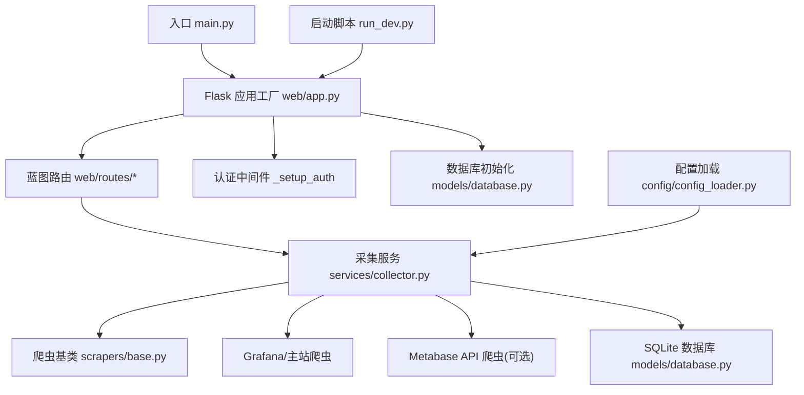
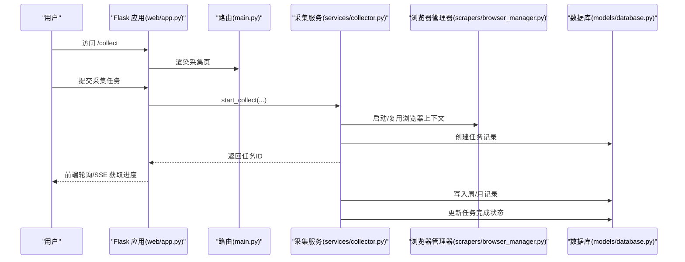
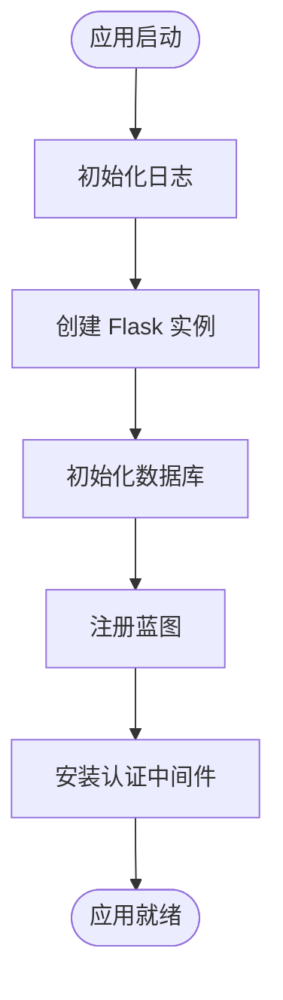
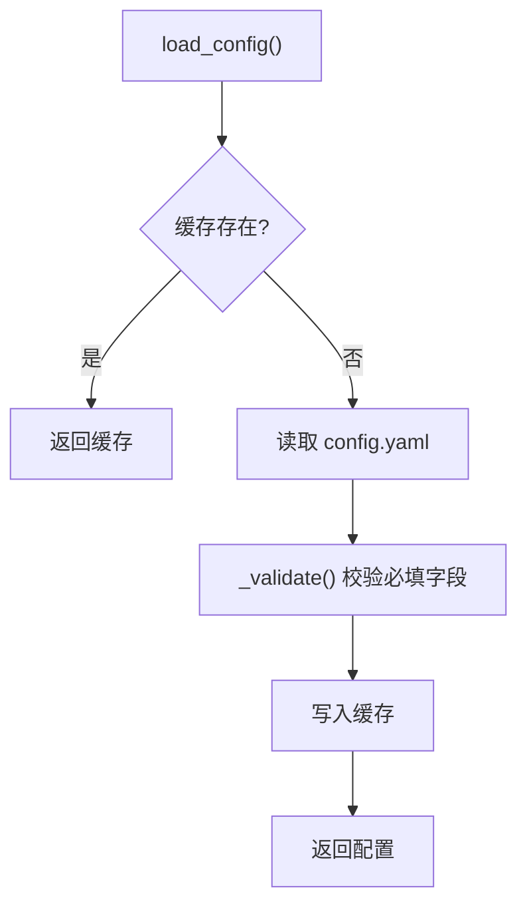
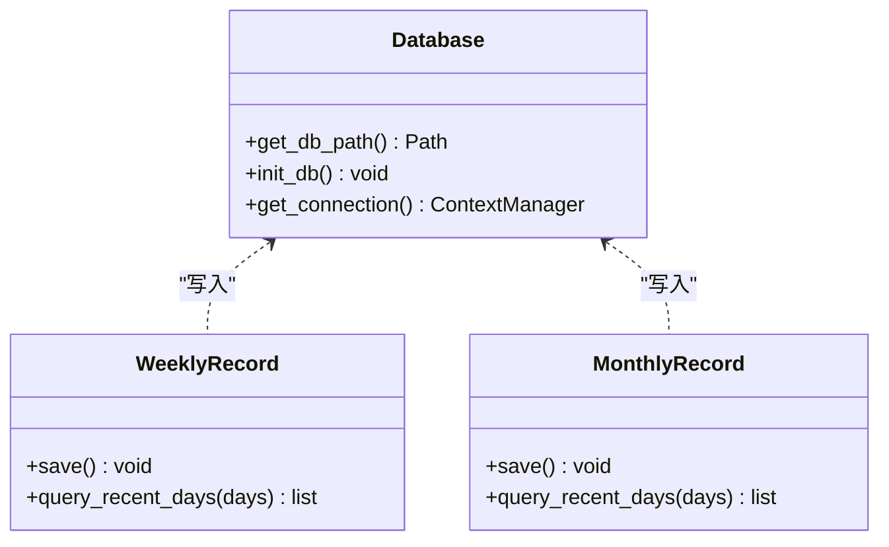
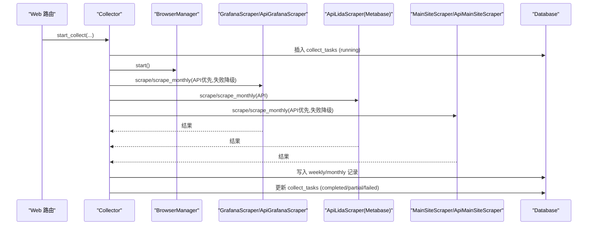
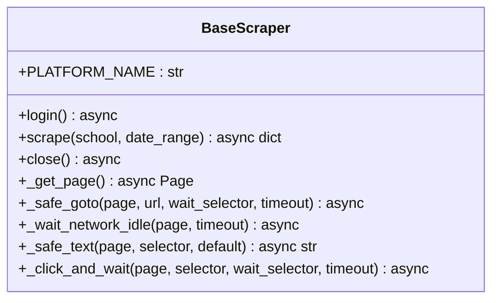
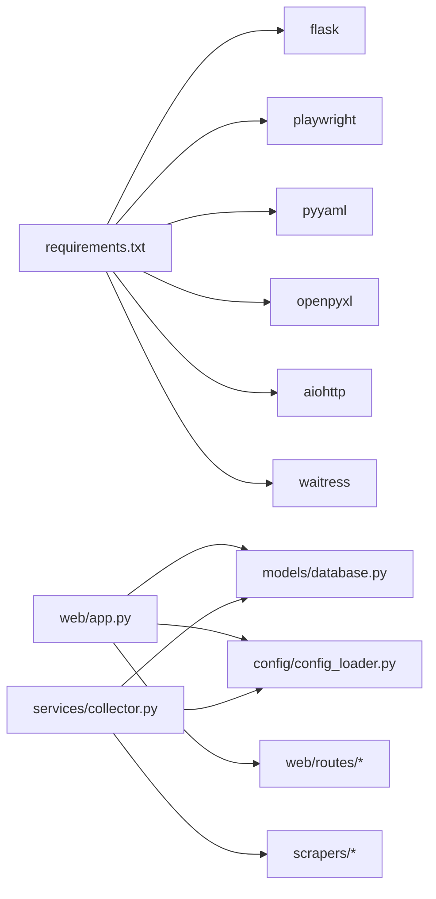

# 开发指南

<cite>
**本文引用的文件**   
- [main.py](file://middle-platform-data-collector-master/main.py)
- [run_dev.py](file://middle-platform-data-collector-master/run_dev.py)
- [requirements.txt](file://middle-platform-data-collector-master/requirements.txt)
- [web/app.py](file://middle-platform-data-collector-master/web/app.py)
- [config/config_loader.py](file://middle-platform-data-collector-master/config/config_loader.py)
- [models/database.py](file://middle-platform-data-collector-master/models/database.py)
- [services/collector.py](file://middle-platform-data-collector-master/services/collector.py)
- [scrapers/base.py](file://middle-platform-data-collector-master/scrapers/base.py)
- [web/routes/main.py](file://middle-platform-data-collector-master/web/routes/main.py)
- [.gitignore](file://middle-platform-data-collector-master/.gitignore)
</cite>

## 目录
1. [简介](#简介)
2. [项目结构](#项目结构)
3. [核心组件](#核心组件)
4. [架构总览](#架构总览)
5. [详细组件分析](#详细组件分析)
6. [依赖关系分析](#依赖关系分析)
7. [性能与稳定性](#性能与稳定性)
8. [故障排查指南](#故障排查指南)
9. [结论](#结论)
10. [附录：开发与贡献规范](#附录开发与贡献规范)

## 简介
本指南面向项目开发者，覆盖从环境搭建、调试与测试，到代码规范、Git工作流、新功能开发流程、代码审查标准、文档更新要求、调试与性能分析工具、插件与API扩展、持续集成与发布流程等全链路内容。目标是帮助贡献者快速上手并高质量地参与开发。

## 项目结构
本项目采用分层+按功能域组织的结构：
- web: Flask 应用工厂、蓝图路由、模板与静态资源
- services: 采集编排器（串联多平台爬虫）
- scrapers: 浏览器与可选 API 爬虫实现
- models: SQLite 数据库连接、表结构与模型
- config: 配置加载与校验
- tools: 辅助脚本（登录、测试、数据探索等）
- data/logs: 运行时数据与日志

图表来源
- [main.py:1-42](file://middle-platform-data-collector-master/main.py#L1-L42)
- [web/app.py:306-337](file://middle-platform-data-collector-master/web/app.py#L306-L337)
- [models/database.py:201-372](file://middle-platform-data-collector-master/models/database.py#L201-L372)
- [services/collector.py:1-120](file://middle-platform-data-collector-master/services/collector.py#L1-L120)
- [scrapers/base.py:12-73](file://middle-platform-data-collector-master/scrapers/base.py#L12-L73)
- [config/config_loader.py:21-36](file://middle-platform-data-collector-master/config/config_loader.py#L21-L36)
- [run_dev.py:1-15](file://middle-platform-data-collector-master/run_dev.py#L1-L15)

章节来源
- [main.py:1-42](file://middle-platform-data-collector-master/main.py#L1-L42)
- [web/app.py:306-337](file://middle-platform-data-collector-master/web/app.py#L306-L337)
- [models/database.py:201-372](file://middle-platform-data-collector-master/models/database.py#L201-L372)
- [config/config_loader.py:21-36](file://middle-platform-data-collector-master/config/config_loader.py#L21-L36)
- [run_dev.py:1-15](file://middle-platform-data-collector-master/run_dev.py#L1-L15)

## 核心组件
- 应用入口与运行模式
  - 生产模式使用 waitress WSGI 服务器；开发模式使用 Flask 内置服务器并支持热重载
  - 提供独立开发启动脚本以避开端口冲突
- Web 层
  - 应用工厂集中创建 Flask 实例、注册蓝图、初始化日志与数据库
  - 内置基于会话的认证中间件，保护 /api/* 接口与页面跳转
- 数据采集编排器
  - 支持 API 直连优先、失败自动降级到浏览器模式
  - 支持周表与月表两种记录类型，支持暂停/继续与进度事件广播
- 爬虫抽象与实现
  - 统一异步基类封装上下文/页面生命周期与安全导航方法
  - Grafana/主站浏览器爬虫；Metabase 通过 API 获取数据
- 配置与数据库
  - YAML 配置加载与必填字段校验，用户级凭证覆盖机制
  - SQLite 连接管理、迁移与默认管理员账户初始化

章节来源
- [main.py:10-41](file://middle-platform-data-collector-master/main.py#L10-L41)
- [run_dev.py:1-15](file://middle-platform-data-collector-master/run_dev.py#L1-L15)
- [web/app.py:14-337](file://middle-platform-data-collector-master/web/app.py#L14-L337)
- [services/collector.py:65-176](file://middle-platform-data-collector-master/services/collector.py#L65-L176)
- [scrapers/base.py:12-73](file://middle-platform-data-collector-master/scrapers/base.py#L12-L73)
- [config/config_loader.py:21-147](file://middle-platform-data-collector-master/config/config_loader.py#L21-L147)
- [models/database.py:201-372](file://middle-platform-data-collector-master/models/database.py#L201-L372)

## 架构总览
系统由 Web 层、采集编排层、爬虫层与持久化层组成。Web 层负责请求处理与鉴权；采集编排层协调多平台数据源，选择最优路径（API 优先，失败回退浏览器）；爬虫层封装各平台交互细节；持久化层使用 SQLite 存储采集结果与任务状态。

图表来源
- [web/app.py:306-337](file://middle-platform-data-collector-master/web/app.py#L306-L337)
- [web/routes/main.py:57-72](file://middle-platform-data-collector-master/web/routes/main.py#L57-L72)
- [services/collector.py:133-176](file://middle-platform-data-collector-master/services/collector.py#L133-L176)
- [models/database.py:201-372](file://middle-platform-data-collector-master/models/database.py#L201-L372)

## 详细组件分析

### 应用工厂与认证中间件
- 职责
  - 初始化日志、创建 Flask 实例、注册蓝图、初始化数据库
  - 在请求前拦截未登录访问，对 /api/* 返回 401 JSON，对页面重定向至登录页
  - 注入当前用户信息到模板上下文
- 关键点
  - SECRET_KEY 用于会话签名
  - 模板自动重载便于开发
  - 蓝图按模块拆分路由，便于扩展

图表来源
- [web/app.py:14-337](file://middle-platform-data-collector-master/web/app.py#L14-L337)

章节来源
- [web/app.py:14-337](file://middle-platform-data-collector-master/web/app.py#L14-L337)

### 配置加载与校验
- 职责
  - 加载 YAML 配置文件，缓存结果，强制校验必填字段
  - 提供学校信息与凭证读取接口，支持用户级凭证覆盖
  - 解析 Metabase 数据库路径优先级：环境变量 > 配置文件 > 默认值
- 关键点
  - 首次启动时若 schools 为空，可从 YAML 导入到数据库
  - credentials 中 lida/grafana/main_site 为必填，grafana 的 api_token 可选

图表来源
- [config/config_loader.py:21-36](file://middle-platform-data-collector-master/config/config_loader.py#L21-L36)
- [config/config_loader.py:39-74](file://middle-platform-data-collector-master/config/config_loader.py#L39-L74)
- [config/config_loader.py:122-147](file://middle-platform-data-collector-master/config/config_loader.py#L122-L147)

章节来源
- [config/config_loader.py:21-147](file://middle-platform-data-collector-master/config/config_loader.py#L21-L147)

### 数据库与模型
- 职责
  - 管理 SQLite 连接、启用 WAL 与外键约束
  - 定义表结构并执行增量迁移（添加列、类型转换等）
  - 首次启动创建默认管理员账户，必要时从 YAML 导入学校数据
- 关键点
  - get_connection 作为上下文管理器保证事务与连接释放
  - 迁移逻辑兼容旧版本数据结构

图表来源
- [models/database.py:24-48](file://middle-platform-data-collector-master/models/database.py#L24-L48)
- [models/database.py:201-372](file://middle-platform-data-collector-master/models/database.py#L201-L372)

章节来源
- [models/database.py:24-48](file://middle-platform-data-collector-master/models/database.py#L24-L48)
- [models/database.py:201-372](file://middle-platform-data-collector-master/models/database.py#L201-L372)

### 采集编排器（Collector）
- 职责
  - 编排多平台采集：Grafana/Metabase/主站，支持 API 优先与浏览器降级
  - 支持周表与月表，支持暂停/继续、进度事件广播、耗时统计
  - 后台线程运行异步采集逻辑，避免阻塞 Web 进程
- 关键流程
  - 创建任务记录 -> 并行/串行执行各平台采集 -> 合并结果 -> 写入记录 -> 更新任务状态
  - 主站共享浏览器上下文以避免重复登录导致会话被顶替

图表来源
- [services/collector.py:133-176](file://middle-platform-data-collector-master/services/collector.py#L133-L176)
- [services/collector.py:214-270](file://middle-platform-data-collector-master/services/collector.py#L214-L270)
- [services/collector.py:337-406](file://middle-platform-data-collector-master/services/collector.py#L337-L406)
- [services/collector.py:407-550](file://middle-platform-data-collector-master/services/collector.py#L407-L550)
- [services/collector.py:551-630](file://middle-platform-data-collector-master/services/collector.py#L551-L630)
- [services/collector.py:732-800](file://middle-platform-data-collector-master/services/collector.py#L732-L800)

章节来源
- [services/collector.py:65-176](file://middle-platform-data-collector-master/services/collector.py#L65-L176)
- [services/collector.py:214-270](file://middle-platform-data-collector-master/services/collector.py#L214-L270)
- [services/collector.py:337-406](file://middle-platform-data-collector-master/services/collector.py#L337-L406)
- [services/collector.py:407-550](file://middle-platform-data-collector-master/services/collector.py#L407-L550)
- [services/collector.py:551-630](file://middle-platform-data-collector-master/services/collector.py#L551-L630)
- [services/collector.py:732-800](file://middle-platform-data-collector-master/services/collector.py#L732-L800)

### 爬虫抽象基类
- 职责
  - 统一异步页面/上下文生命周期管理
  - 提供安全导航、等待网络空闲、文本提取、点击等待等通用方法
- 关键点
  - 支持外部共享上下文（避免重复登录）
  - 关闭时区分是否共享上下文，仅关闭自有上下文

图表来源
- [scrapers/base.py:12-104](file://middle-platform-data-collector-master/scrapers/base.py#L12-L104)

章节来源
- [scrapers/base.py:12-104](file://middle-platform-data-collector-master/scrapers/base.py#L12-L104)

### 首页与仪表盘路由
- 职责
  - 渲染首页、采集页、历史记录页
  - 提供仪表盘数据 API，支持按周/月查询
  - 根据用户权限过滤可见学校与记录
- 关键点
  - 非管理员仅能查看分配的学校范围
  - 月度历史支持按年、月份、学校名灵活查询

章节来源
- [web/routes/main.py:1-143](file://middle-platform-data-collector-master/web/routes/main.py#L1-L143)

## 依赖关系分析
- 外部依赖
  - playwright: 浏览器自动化
  - flask: Web 框架
  - pyyaml: 配置解析
  - openpyxl: Excel 导出
  - aiohttp: 可选 API 直连能力
  - waitress: 生产 WSGI 服务器
- 内部依赖
  - web/app.py 依赖 models/database.py、config/config_loader.py、web/routes/*
  - services/collector.py 依赖 config/config_loader.py、models/*、scrapers/*
  - scrapers/* 依赖 BrowserManager 与 Playwright

图表来源
- [requirements.txt:1-7](file://middle-platform-data-collector-master/requirements.txt#L1-L7)
- [web/app.py:306-337](file://middle-platform-data-collector-master/web/app.py#L306-L337)
- [services/collector.py:1-35](file://middle-platform-data-collector-master/services/collector.py#L1-L35)

章节来源
- [requirements.txt:1-7](file://middle-platform-data-collector-master/requirements.txt#L1-L7)

## 性能与稳定性
- 并发与异步
  - 采集编排器使用 asyncio 并发执行各平台采集，提升吞吐
  - 主站共享浏览器上下文减少登录开销与会话冲突
- 数据库
  - 启用 WAL 模式提高并发读写性能
  - 增量迁移确保升级平滑
- 错误降级
  - API 失败自动降级到浏览器模式，增强鲁棒性
- 建议
  - 合理设置浏览器超时与网络空闲等待时间
  - 控制并发度，避免目标站点限流或触发风控
  - 定期清理临时上下文与页面，防止内存泄漏

[本节为通用指导，不直接分析具体文件]

## 故障排查指南
- 常见问题定位
  - 未登录访问 /api/* 将返回 401 JSON；页面将被重定向到登录页
  - 采集任务状态包括 pending/running/completed/partial/failed，可在 collect_tasks 表中查看
  - 日志输出到 logs/app.log，包含采集阶段、错误信息与耗时
- 调试技巧
  - 使用开发启动脚本 run_dev.py 开启热重载与调试模式
  - 在 Collector 中通过 pause/resume 控制采集节奏，结合进度事件观察
  - 检查 config.yaml 必填字段与用户级凭证覆盖是否正确
- 数据库问题
  - 确认 data/app.db 是否存在且可写
  - 首次启动会创建默认管理员账户，如需修改请在数据库中操作
- 浏览器相关问题
  - 确认 Playwright 已正确安装并可用
  - 主站 Cloud 登录共享上下文，避免重复登录导致会话被顶替

章节来源
- [web/app.py:253-304](file://middle-platform-data-collector-master/web/app.py#L253-L304)
- [services/collector.py:119-132](file://middle-platform-data-collector-master/services/collector.py#L119-L132)
- [models/database.py:201-372](file://middle-platform-data-collector-master/models/database.py#L201-L372)
- [run_dev.py:1-15](file://middle-platform-data-collector-master/run_dev.py#L1-L15)

## 结论
本项目以 Flask 为 Web 层，结合异步采集编排器与多平台爬虫，实现了教育平台数据的自动化采集与可视化展示。通过 API 优先与浏览器降级的策略，系统在稳定性与性能之间取得良好平衡。遵循本指南的开发与贡献规范，可进一步提升协作效率与代码质量。

[本节为总结，不直接分析具体文件]

## 附录：开发与贡献规范

### 开发环境搭建
- 基础环境
  - Python 3.10+（建议使用虚拟环境）
  - 安装依赖：pip install -r requirements.txt
  - 安装 Playwright 浏览器：python -m playwright install
- 配置文件
  - 复制示例配置为 config/config.yaml，填写 credentials 与 browser 等必填项
  - 首次启动会自动初始化数据库与默认管理员账户
- 启动方式
  - 开发模式：python run_dev.py（端口 5001，避免冲突）
  - 生产模式：python main.py（默认端口 5000，使用 waitress）

章节来源
- [requirements.txt:1-7](file://middle-platform-data-collector-master/requirements.txt#L1-L7)
- [config/config_loader.py:21-36](file://middle-platform-data-collector-master/config/config_loader.py#L21-L36)
- [run_dev.py:1-15](file://middle-platform-data-collector-master/run_dev.py#L1-L15)
- [main.py:10-41](file://middle-platform-data-collector-master/main.py#L10-L41)

### IDE 与调试工具
- VS Code
  - 安装 Python 扩展、Jinja2 模板语法提示
  - 配置断点调试：运行配置指向 run_dev.py 或 main.py
- PyCharm
  - 配置解释器与虚拟环境
  - 使用 Flask 运行配置，开启热重载
- 日志与监控
  - 查看 logs/app.log 了解采集过程与错误堆栈
  - 在 Collector 中使用 pause/resume 配合前端进度观察

章节来源
- [web/app.py:14-25](file://middle-platform-data-collector-master/web/app.py#L14-L25)
- [run_dev.py:1-15](file://middle-platform-data-collector-master/run_dev.py#L1-L15)

### 代码规范与命名约定
- Python
  - 遵循 PEP8，使用黑盒格式化（black）与类型提示
  - 模块级常量使用 UPPER_CASE，函数/变量使用 snake_case
- 前端
  - JS/CSS 保持简洁，避免内联样式，模板使用 Jinja2 语法
- 注释与文档
  - 关键函数与类需有 docstring，说明参数、返回值与异常
  - 对外部依赖与配置项进行必要说明

[本节为通用规范，不直接分析具体文件]

### Git 工作流与分支管理
- 分支策略
  - main：稳定分支，仅接受经过审查的合并
  - develop：集成分支，日常开发合并
  - feature/*：新功能分支
  - fix/*：修复分支
  - release/*：发布准备分支
- 提交规范
  - 使用语义化提交信息（feat/fix/docs/chore 等）
  - 每次提交聚焦单一变更，附带必要说明
- 合并与评审
  - 通过 Pull Request 合并，至少一名维护者审查
  - CI 通过后才能合并到目标分支

[本节为通用流程，不直接分析具体文件]

### 单元测试与集成测试
- 单元测试
  - 使用 pytest，针对配置加载、数据库迁移、模型序列化等进行测试
  - 覆盖率建议不低于 70%，关键路径（如采集编排）应更高
- 集成测试
  - 模拟浏览器与 API 调用，验证端到端采集流程
  - 使用 mock 替代真实第三方服务，确保测试稳定性
- 测试数据与环境
  - 使用独立的测试数据库与配置，避免污染开发数据
  - 测试完成后清理临时文件与下载数据

[本节为通用测试指导，不直接分析具体文件]

### 新功能开发流程
- 需求分析与设计
  - 明确输入输出、边界条件与异常处理
  - 评估是否需要新增爬虫或 API 适配器
- 编码与自测
  - 在 feature/* 分支上实现，编写单测与集成用例
  - 本地验证采集流程与 UI 交互
- 提交与评审
  - 提交变更并发起 PR，附上变更说明与截图
  - 根据评审意见修改，直至通过

[本节为通用流程，不直接分析具体文件]

### 代码审查标准
- 可读性与可维护性
  - 函数长度适中，逻辑清晰，避免深层嵌套
  - 使用有意义的变量与函数名，减少魔法数字
- 安全性
  - 敏感配置不入库，使用环境变量或配置文件
  - 对用户输入进行校验与转义
- 性能与健壮性
  - 避免不必要的循环与 IO，合理使用缓存
  - 捕获并记录异常，提供降级策略

[本节为通用标准，不直接分析具体文件]

### 文档更新要求
- 代码变更需同步更新相关文档与注释
- 新增功能需在 README 或 Wiki 中补充使用说明
- 配置项变更需提供示例与校验说明

[本节为通用要求，不直接分析具体文件]

### 调试技巧与工具使用
- 浏览器调试
  - 在 BaseScraper 中增加断点，观察页面元素与网络请求
  - 使用 headless=false 模式手动复现问题
- 性能分析
  - 使用 cProfile 分析采集耗时热点
  - 关注数据库查询与网络请求瓶颈
- 内存泄漏检测
  - 定期检查浏览器上下文与页面对象的生命周期
  - 使用 memory_profiler 跟踪内存增长

[本节为通用指导，不直接分析具体文件]

### 插件开发与 API 扩展
- 新增爬虫
  - 继承 BaseScraper，实现 login 与 scrape 方法
  - 在 Collector 中注册新平台，支持 API 优先与浏览器降级
- 新增路由与视图
  - 在 web/routes 下新增蓝图，注册到应用工厂
  - 遵循认证中间件规则，保护敏感接口
- 第三方集成
  - 通过 config_loader 读取凭据，支持用户级覆盖
  - 使用 aiohttp 实现异步 HTTP 客户端，注意重试与超时

章节来源
- [scrapers/base.py:12-104](file://middle-platform-data-collector-master/scrapers/base.py#L12-L104)
- [services/collector.py:214-270](file://middle-platform-data-collector-master/services/collector.py#L214-L270)
- [web/app.py:306-337](file://middle-platform-data-collector-master/web/app.py#L306-L337)
- [config/config_loader.py:109-119](file://middle-platform-data-collector-master/config/config_loader.py#L109-L119)

### 持续集成与自动化测试
- CI 流水线
  - 构建环境：安装依赖与 Playwright 浏览器
  - 运行测试：pytest 执行单测与集成用例
  - 生成覆盖率报告，阈值不达标则失败
- 发布流程
  - 打标签并发布制品
  - 更新部署配置与文档

[本节为通用流程，不直接分析具体文件]

### 贡献者质量保证标准
- 代码质量
  - 通过 lint 与格式化检查
  - 单测与集成用例齐全，覆盖率达标
- 稳定性与兼容性
  - 兼容现有数据模型与 API 契约
  - 提供向后兼容的迁移方案
- 文档与沟通
  - 提交信息清晰，变更说明完整
  - 及时响应评审意见，确保交付质量

[本节为通用标准，不直接分析具体文件]