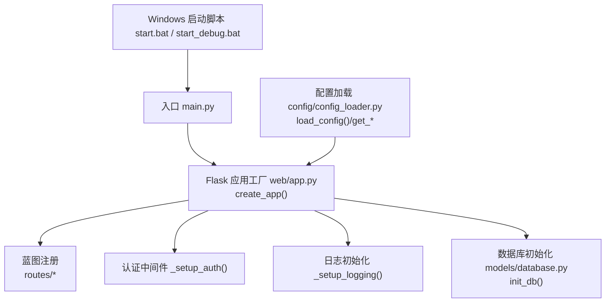
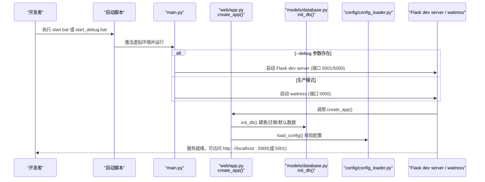
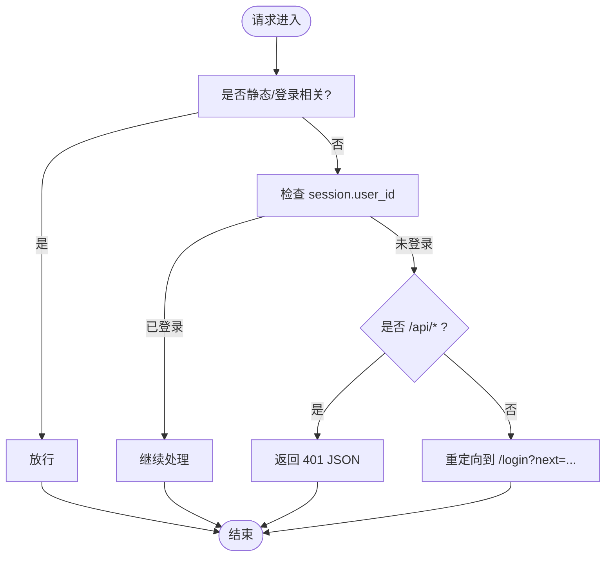

# 开发环境搭建

<cite>
**本文引用的文件**   
- [requirements.txt](file://middle-platform-data-collector-master/requirements.txt)
- [main.py](file://middle-platform-data-collector-master/main.py)
- [run_dev.py](file://middle-platform-data-collector-master/run_dev.py)
- [web/app.py](file://middle-platform-data-collector-master/web/app.py)
- [config/config_loader.py](file://middle-platform-data-collector-master/config/config_loader.py)
- [models/database.py](file://middle-platform-data-collector-master/models/database.py)
- [start.bat](file://middle-platform-data-collector-master/start.bat)
- [start_debug.bat](file://middle-platform-data-collector-master/start_debug.bat)
- [config/config.yaml.example](file://middle-platform-data-collector-master/config/config.yaml.example)
</cite>

## 目录
1. [简介](#简介)
2. [项目结构](#项目结构)
3. [核心组件](#核心组件)
4. [架构总览](#架构总览)
5. [详细组件分析](#详细组件分析)
6. [依赖关系分析](#依赖关系分析)
7. [性能与并发特性](#性能与并发特性)
8. [常见问题排查](#常见问题排查)
9. [结论](#结论)
10. [附录：环境变量与配置项](#附录：环境变量与配置项)

## 简介
本指南面向开发者，提供从 Python 环境准备、依赖安装、Playwright 浏览器驱动配置，到 IDE 推荐设置、调试器配置与断点技巧，再到开发服务器启动、端口与环境变量配置、数据库初始化、配置文件模板准备的完整流程。同时包含常见环境问题（如浏览器驱动下载失败、端口冲突）的解决方案，以及热重载开发与实时调试的最佳实践。

## 项目结构
本项目采用 Flask 作为 Web 框架，SQLite 作为本地数据库，使用 Playwright 进行浏览器自动化采集。应用通过工厂模式创建 Flask 实例，注册多个蓝图路由；数据库在首次启动时自动初始化表结构与默认管理员账户；配置文件采用 YAML 格式并通过加载器校验与缓存。

图表来源
- [main.py:10-41](file://middle-platform-data-collector-master/main.py#L10-L41)
- [web/app.py:306-336](file://middle-platform-data-collector-master/web/app.py#L306-L336)
- [models/database.py:201-372](file://middle-platform-data-collector-master/models/database.py#L201-L372)
- [config/config_loader.py:21-36](file://middle-platform-data-collector-master/config/config_loader.py#L21-L36)
- [start.bat:1-11](file://middle-platform-data-collector-master/start.bat#L1-L11)
- [start_debug.bat:1-8](file://middle-platform-data-collector-master/start_debug.bat#L1-L8)

章节来源
- [main.py:10-41](file://middle-platform-data-collector-master/main.py#L10-L41)
- [web/app.py:306-336](file://middle-platform-data-collector-master/web/app.py#L306-L336)
- [models/database.py:201-372](file://middle-platform-data-collector-master/models/database.py#L201-L372)
- [config/config_loader.py:21-36](file://middle-platform-data-collector-master/config/config_loader.py#L21-L36)
- [start.bat:1-11](file://middle-platform-data-collector-master/start.bat#L1-L11)
- [start_debug.bat:1-8](file://middle-platform-data-collector-master/start_debug.bat#L1-L8)

## 核心组件
- 应用入口与运行模式
  - 生产模式：使用 waitress WSGI 服务器，多线程、稳定，适合部署。
  - 开发模式：使用 Flask 内置服务器，支持热重载与调试。
- Flask 应用工厂
  - 统一初始化日志、注册蓝图、启用认证中间件、初始化数据库。
- 配置加载器
  - 读取并校验 YAML 配置，提供浏览器与平台凭证访问接口，支持用户级覆盖。
- 数据库初始化
  - 自动建表、增量迁移、导入默认管理员与学校数据。

章节来源
- [main.py:10-41](file://middle-platform-data-collector-master/main.py#L10-L41)
- [web/app.py:306-336](file://middle-platform-data-collector-master/web/app.py#L306-L336)
- [config/config_loader.py:21-36](file://middle-platform-data-collector-master/config/config_loader.py#L21-L36)
- [models/database.py:201-372](file://middle-platform-data-collector-master/models/database.py#L201-L372)

## 架构总览
下图展示了开发/生产两种运行路径、Flask 应用生命周期关键步骤与外部依赖的关系。

图表来源
- [start.bat:1-11](file://middle-platform-data-collector-master/start.bat#L1-L11)
- [start_debug.bat:1-8](file://middle-platform-data-collector-master/start_debug.bat#L1-L8)
- [main.py:10-41](file://middle-platform-data-collector-master/main.py#L10-L41)
- [web/app.py:306-336](file://middle-platform-data-collector-master/web/app.py#L306-L336)
- [models/database.py:201-372](file://middle-platform-data-collector-master/models/database.py#L201-L372)
- [config/config_loader.py:21-36](file://middle-platform-data-collector-master/config/config_loader.py#L21-L36)

## 详细组件分析

### 运行模式与服务器选择
- 开发模式
  - 通过命令行参数触发，使用 Flask 内置服务器，开启 debug 与线程化，便于热重载与调试。
  - 专用开发入口 run_dev.py 固定使用 5001 端口，避免与其他服务冲突。
- 生产模式
  - 使用 waitress 作为 WSGI 服务器，多线程处理请求，具备更好的稳定性与 Windows 原生支持。
  - 若未安装 waitress，将回退到 Flask 开发服务器。

章节来源
- [main.py:10-41](file://middle-platform-data-collector-master/main.py#L10-L41)
- [run_dev.py:1-15](file://middle-platform-data-collector-master/run_dev.py#L1-L15)

### Flask 应用工厂与蓝图注册
- 应用工厂负责：
  - 初始化日志输出到 logs 目录与控制台。
  - 创建 Flask 实例并设置模板与静态资源目录。
  - 注册各功能模块蓝图（首页、采集、导出、学校、用户、活动、图表）。
  - 启用认证中间件，对非公开路由进行登录检查。
- 模板热重载
  - 启用 TEMPLATES_AUTO_RELOAD，确保模板修改即时生效。

章节来源
- [web/app.py:14-25](file://middle-platform-data-collector-master/web/app.py#L14-L25)
- [web/app.py:306-336](file://middle-platform-data-collector-master/web/app.py#L306-L336)

### 认证中间件与登录流程
- before_request 钩子拦截请求，跳过静态资源与登录页面。
- 未登录时对 API 返回 401，对页面跳转至登录页并携带 next 参数。
- 登录成功后写入 session，注入当前用户信息到模板上下文。

图表来源
- [web/app.py:253-304](file://middle-platform-data-collector-master/web/app.py#L253-L304)

### 配置加载与校验
- 配置文件路径与示例
  - 实际配置文件：config/config.yaml
  - 示例模板：config/config.yaml.example
- 加载流程
  - 优先使用内存缓存，支持强制刷新。
  - 若缺少配置文件，抛出明确错误提示复制示例模板。
- 校验规则
  - browser 字段提供 headless、slow_mo、default_timeout 默认值。
  - credentials 必须包含 lida、grafana、main_site 三个平台，且必填 url 与用户名密码（grafana 可选 token）。
  - metabase 为可选平台，若存在则校验必填字段。
- 用户级凭证覆盖
  - 支持运行时设置用户级别覆盖，优先于全局配置。

章节来源
- [config/config_loader.py:21-36](file://middle-platform-data-collector-master/config/config_loader.py#L21-L36)
- [config/config_loader.py:39-74](file://middle-platform-data-collector-master/config/config_loader.py#L39-L74)
- [config/config_loader.py:99-119](file://middle-platform-data-collector-master/config/config_loader.py#L99-L119)

### 数据库初始化与迁移
- 初始化职责
  - 确保 data 目录存在。
  - 连接 SQLite，启用 WAL 模式与外键约束。
  - 执行建表语句，包含 weekly_records、monthly_records、collect_tasks、schools、users。
  - 增量迁移：为已有表添加缺失列，兼容历史版本。
  - 默认管理员：若 users 表为空，插入默认管理员账号。
  - 首次导入：若 schools 表为空，尝试从 config.yaml 导入学校数据。
- 连接管理
  - 使用上下文管理器保证事务提交与异常回滚。

章节来源
- [models/database.py:16-48](file://middle-platform-data-collector-master/models/database.py#L16-L48)
- [models/database.py:201-372](file://middle-platform-data-collector-master/models/database.py#L201-L372)

### 启动脚本与开发入口
- Windows 批处理脚本
  - start.bat：激活虚拟环境后以生产模式运行 main.py。
  - start_debug.bat：以 --debug 参数启动，进入开发模式。
- 开发专用入口
  - run_dev.py：固定端口 5001，便于与 AirPlay 或其他服务共存。

章节来源
- [start.bat:1-11](file://middle-platform-data-collector-master/start.bat#L1-L11)
- [start_debug.bat:1-8](file://middle-platform-data-collector-master/start_debug.bat#L1-L8)
- [run_dev.py:1-15](file://middle-platform-data-collector-master/run_dev.py#L1-L15)

## 依赖关系分析
- Python 包依赖
  - playwright：浏览器自动化与驱动管理。
  - flask：Web 框架与路由、模板渲染。
  - pyyaml：YAML 配置解析。
  - openpyxl：Excel 读写（用于导出等场景）。
  - aiohttp：异步 HTTP 客户端（采集任务可能使用）。
  - waitress：WSGI 服务器（生产模式）。
- 依赖安装
  - 在项目根目录执行依赖安装命令，随后按 Playwright 指引安装浏览器驱动。

章节来源
- [requirements.txt:1-7](file://middle-platform-data-collector-master/requirements.txt#L1-L7)

## 性能与并发特性
- 生产模式
  - waitress 多线程处理，提升并发能力与稳定性。
- 开发模式
  - Flask 内置服务器单进程多线程，适合调试与热重载。
- 数据库
  - SQLite 启用 WAL 模式，提高并发读性能与减少锁竞争。

章节来源
- [main.py:20-37](file://middle-platform-data-collector-master/main.py#L20-L37)
- [models/database.py:24-48](file://middle-platform-data-collector-master/models/database.py#L24-L48)

## 常见问题排查
- 浏览器驱动下载失败
  - 现象：首次运行 Playwright 时无法下载 Chromium/Firefox/WebKit 驱动。
  - 解决：
    - 手动安装驱动：在项目根目录执行 Playwright 安装命令。
    - 代理与镜像：配置网络代理或使用国内镜像加速下载。
    - 离线安装：提前下载驱动包并指定路径。
- 端口冲突
  - 现象：启动时报端口占用错误。
  - 解决：
    - 修改端口：使用 run_dev.py 的 5001 端口，或在 main.py 中调整 host/port。
    - 释放端口：关闭占用该端口的进程。
- 配置文件缺失或校验失败
  - 现象：启动时报“配置文件不存在”或“credentials 缺少平台”。
  - 解决：
    - 复制示例模板：将 config/config.yaml.example 复制为 config/config.yaml 并填写真实信息。
    - 校验必填字段：确保每个平台的 url、username、password 正确。
- 数据库权限或路径问题
  - 现象：无法写入 data 目录或 app.db。
  - 解决：
    - 赋予当前用户对 data 目录的写权限。
    - 检查磁盘空间与路径是否存在。
- 默认管理员登录
  - 说明：首次启动会创建默认管理员账号，可在登录后修改密码。

章节来源
- [config/config_loader.py:27-36](file://middle-platform-data-collector-master/config/config_loader.py#L27-L36)
- [config/config_loader.py:39-74](file://middle-platform-data-collector-master/config/config_loader.py#L39-L74)
- [models/database.py:363-372](file://middle-platform-data-collector-master/models/database.py#L363-L372)
- [run_dev.py:1-15](file://middle-platform-data-collector-master/run_dev.py#L1-L15)
- [main.py:10-41](file://middle-platform-data-collector-master/main.py#L10-L41)

## 结论
通过以上步骤，您可以完成从环境准备、依赖安装、浏览器驱动配置到应用启动与调试的全流程。建议在生产环境使用 waitress 与稳定的网络代理，开发环境使用 Flask 内置服务器与热重载以提升效率。遇到常见问题时，参考本文排查清单快速定位与解决。

## 附录：环境变量与配置项
- 环境变量
  - METABASE_DB_PATH：覆盖 Metabase 数据库路径，优先级高于配置文件。
- 配置文件 key 说明
  - browser.headless：是否无头模式。
  - browser.slow_mo：浏览器操作延迟（毫秒），便于调试。
  - browser.default_timeout：默认超时时间（毫秒）。
  - credentials.lida/grafana/main_site：各平台登录信息与 URL。
  - database.metabase_db_path：Metabase 数据库路径（当环境变量未设置时生效）。

章节来源
- [config/config_loader.py:122-147](file://middle-platform-data-collector-master/config/config_loader.py#L122-L147)
- [config/config_loader.py:39-74](file://middle-platform-data-collector-master/config/config_loader.py#L39-L74)