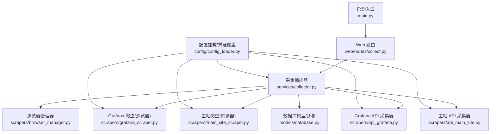
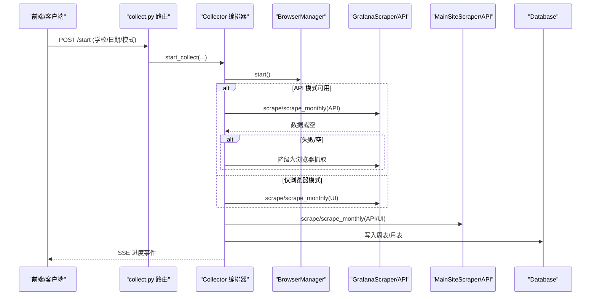
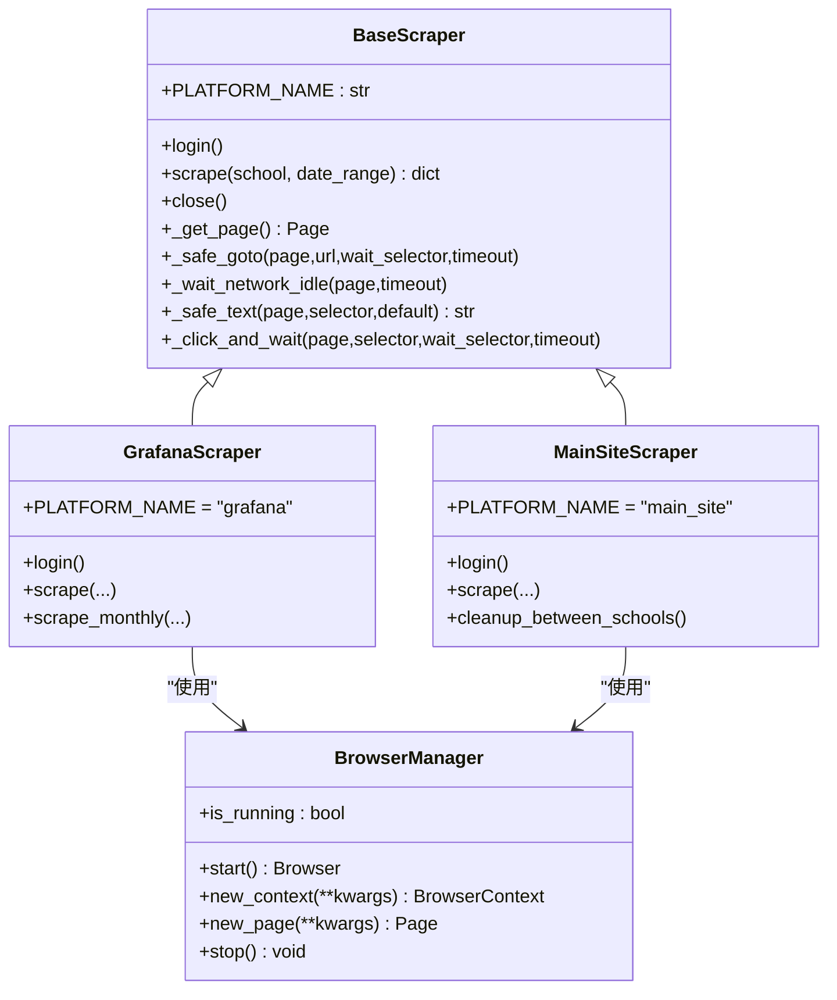
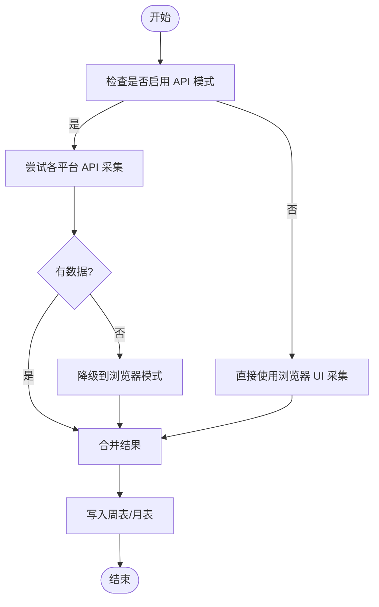
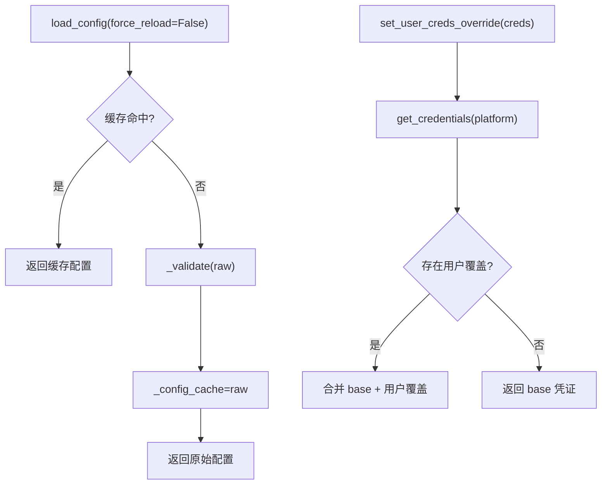
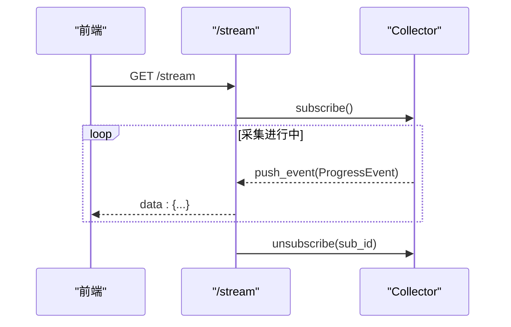
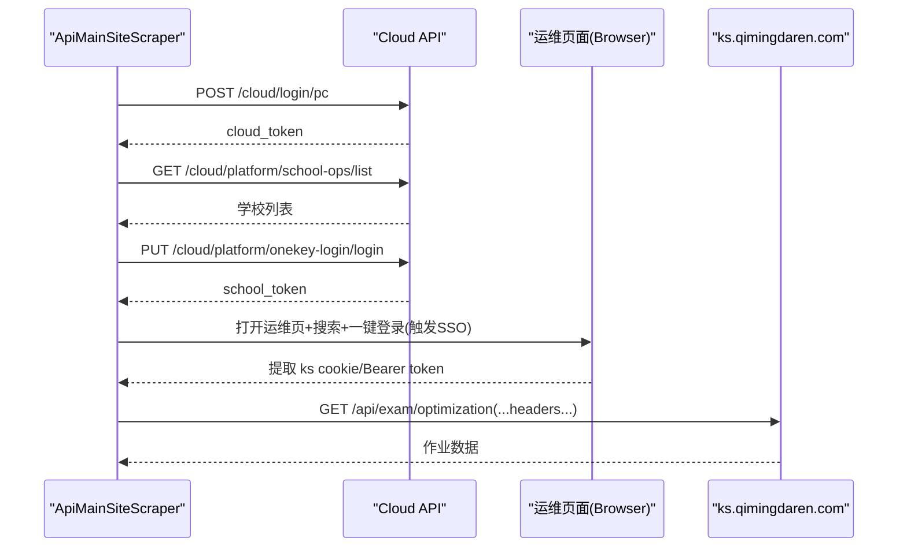
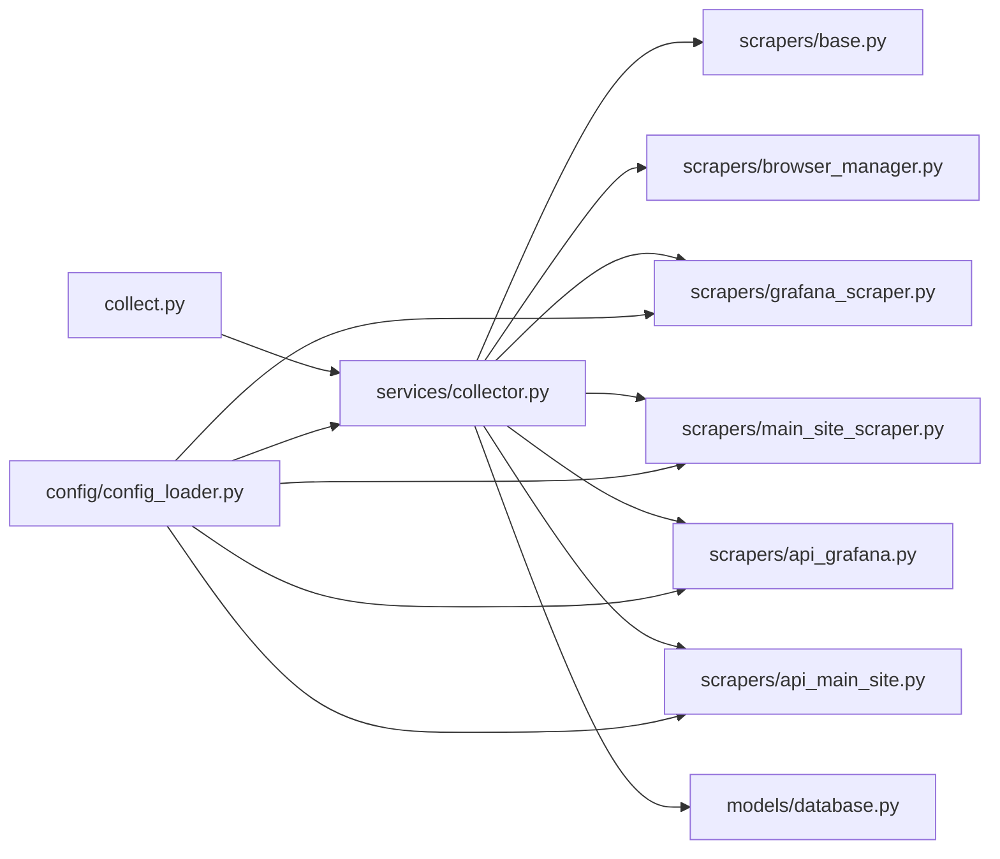

# 插件开发指南

<cite>
**本文引用的文件**   
- [main.py](file://main.py)
- [config_loader.py](file://config/config_loader.py)
- [collector.py](file://services/collector.py)
- [base.py](file://scrapers/base.py)
- [browser_manager.py](file://scrapers/browser_manager.py)
- [grafana_scraper.py](file://scrapers/grafana_scraper.py)
- [api_grafana.py](file://scrapers/api_grafana.py)
- [main_site_scraper.py](file://scrapers/main_site_scraper.py)
- [api_main_site.py](file://scrapers/api_main_site.py)
- [collect.py](file://web/routes/collect.py)
- [database.py](file://models/database.py)
</cite>

## 目录
1. [引言](#引言)
2. [项目结构](#项目结构)
3. [核心组件](#核心组件)
4. [架构总览](#架构总览)
5. [详细组件分析](#详细组件分析)
6. [依赖关系分析](#依赖关系分析)
7. [性能与稳定性](#性能与稳定性)
8. [故障排查指南](#故障排查指南)
9. [结论](#结论)
10. [附录：新平台接入清单](#附录新平台接入清单)

## 引言
本指南面向扩展开发者，提供“爬虫插件”的完整开发方法与实践。围绕基于 BaseScraper 抽象类的继承实现、服务层编排器 Collector 的扩展点、配置系统与用户凭证覆盖机制、事件监听与中间件式钩子、第三方系统集成（外部 API 调用封装、消息队列集成思路）、以及打包发布、版本兼容、依赖冲突解决、调试技巧、性能优化与错误处理最佳实践进行系统化说明。

## 项目结构
系统采用分层组织：Web 路由层暴露采集任务控制接口；服务层负责多平台采集编排与结果落库；爬虫层按平台拆分，支持浏览器模式与 HTTP API 直连模式；配置与模型层提供动态加载与数据持久化。

图表来源
- [main.py:1-42](file://main.py#L1-L42)
- [collect.py:1-170](file://web/routes/collect.py#L1-L170)
- [collector.py:1-862](file://services/collector.py#L1-L862)
- [browser_manager.py:1-76](file://scrapers/browser_manager.py#L1-L76)
- [grafana_scraper.py:1-800](file://scrapers/grafana_scraper.py#L1-L800)
- [api_grafana.py:1-800](file://scrapers/api_grafana.py#L1-L800)
- [main_site_scraper.py:1-800](file://scrapers/main_site_scraper.py#L1-L800)
- [api_main_site.py:1-800](file://scrapers/api_main_site.py#L1-L800)
- [database.py:1-372](file://models/database.py#L1-L372)
- [config_loader.py:1-147](file://config/config_loader.py#L1-L147)

章节来源
- [main.py:1-42](file://main.py#L1-L42)
- [collect.py:1-170](file://web/routes/collect.py#L1-L170)

## 核心组件
- 启动入口 main.py：根据参数选择 Flask 开发服务器或 Waitress 生产服务器。
- Web 路由 collect.py：提供启动/暂停/继续/状态/SSE 进度流等接口，并注入用户级凭证覆盖。
- 配置加载 config_loader.py：YAML 配置校验、缓存、学校配置读取、浏览器配置、用户凭证覆盖、Metabase DB 路径解析。
- 采集编排器 services/collector.py：异步编排多平台采集，API 优先+浏览器降级，SSE 进度广播，周表/月表记录写入。
- 浏览器管理 scrapers/browser_manager.py：Playwright 生命周期管理，上下文隔离与默认超时设置。
- 抽象基类 scrapers/base.py：统一页面获取、登录/采集抽象、通用辅助方法、资源清理。
- 平台爬虫：
  - Grafana 浏览器版 scrapers/grafana_scraper.py：登录、导航、时间/学校变量设置、面板提取、比例值兜底策略。
  - 主站浏览器版 scrapers/main_site_scraper.py：登录、运维页导航、搜索、一键登录、考试管理筛选与作业次数提取。
  - Grafana API 版 scrapers/api_grafana.py：通过 /api/ds/query 直接查询面板数据，含学校 ID 映射与回退逻辑。
  - 主站 API 版 scrapers/api_main_site.py：Cloud 登录、学校列表、一键登录、ks cookie/Bearer token 获取与作业查询。
- 数据模型 models/database.py：SQLite 初始化、增量迁移、默认管理员与学校导入。

章节来源
- [config_loader.py:1-147](file://config/config_loader.py#L1-L147)
- [collector.py:1-862](file://services/collector.py#L1-L862)
- [base.py:1-104](file://scrapers/base.py#L1-L104)
- [browser_manager.py:1-76](file://scrapers/browser_manager.py#L1-L76)
- [grafana_scraper.py:1-800](file://scrapers/grafana_scraper.py#L1-L800)
- [main_site_scraper.py:1-800](file://scrapers/main_site_scraper.py#L1-L800)
- [api_grafana.py:1-800](file://scrapers/api_grafana.py#L1-L800)
- [api_main_site.py:1-800](file://scrapers/api_main_site.py#L1-L800)
- [database.py:1-372](file://models/database.py#L1-L372)

## 架构总览
下图展示从 Web 请求到多平台采集、再到结果落库与 SSE 推送的整体流程。

图表来源
- [collect.py:1-170](file://web/routes/collect.py#L1-L170)
- [collector.py:1-862](file://services/collector.py#L1-L862)
- [browser_manager.py:1-76](file://scrapers/browser_manager.py#L1-L76)
- [grafana_scraper.py:1-800](file://scrapers/grafana_scraper.py#L1-L800)
- [api_grafana.py:1-800](file://scrapers/api_grafana.py#L1-L800)
- [main_site_scraper.py:1-800](file://scrapers/main_site_scraper.py#L1-L800)
- [api_main_site.py:1-800](file://scrapers/api_main_site.py#L1-L800)
- [database.py:1-372](file://models/database.py#L1-L372)

## 详细组件分析

### 爬虫插件基类与浏览器管理
- BaseScraper 抽象类定义：
  - 统一页面生命周期：_get_page、close、__aenter__/__aexit__。
  - 抽象方法：login、scrape（及 scrape_monthly）。
  - 通用辅助：_safe_goto、_wait_network_idle、_safe_text、_click_and_wait。
- BrowserManager：
  - 启动 Chromium、创建 Context/Page、默认超时与视口策略、清理存储。

图表来源
- [base.py:1-104](file://scrapers/base.py#L1-L104)
- [browser_manager.py:1-76](file://scrapers/browser_manager.py#L1-L76)
- [grafana_scraper.py:1-800](file://scrapers/grafana_scraper.py#L1-L800)
- [main_site_scraper.py:1-800](file://scrapers/main_site_scraper.py#L1-L800)

章节来源
- [base.py:1-104](file://scrapers/base.py#L1-L104)
- [browser_manager.py:1-76](file://scrapers/browser_manager.py#L1-L76)

### 服务层扩展：Collector 编排器
- 关键能力：
  - 后台线程 + asyncio 运行异步采集。
  - 平台优先级：API 优先，失败自动降级浏览器。
  - 并行阶段：Lida(Metabase)+主站并行；Grafana 串行。
  - 进度事件：ProgressEvent 通过订阅队列推送到 SSE。
  - 记录类型：weekly/monthly，字段合并与异常标记。
- 扩展点建议：
  - 新增平台：在 _run_collect_async 中增加对应采集函数，注册到并行阶段。
  - 自定义数据处理管道：在合并结果后、落库前插入转换步骤。
  - 中间件式钩子：在关键节点（开始/结束/失败）追加日志或指标上报。

图表来源
- [collector.py:1-862](file://services/collector.py#L1-L862)

章节来源
- [collector.py:1-862](file://services/collector.py#L1-L862)

### 配置系统与用户凭证覆盖
- 配置加载：
  - YAML 校验必填项（browser、credentials、可选 metabase）。
  - 缓存避免重复 IO。
  - get_schools/get_school 从数据库读取学校信息。
- 用户凭证覆盖：
  - set_user_creds_override 设置运行时覆盖。
  - get_credentials 优先返回用户覆盖的 username/password。
- Metabase DB 路径解析：环境变量 > config.yaml > 默认 data/metabase.db。

图表来源
- [config_loader.py:1-147](file://config/config_loader.py#L1-L147)

章节来源
- [config_loader.py:1-147](file://config/config_loader.py#L1-L147)

### 事件监听与 SSE 进度流
- Collector 维护订阅者字典与队列，subscribe/unsubscribe 管理 SSE 客户端。
- ProgressEvent 携带学校、平台、状态、消息、耗时等字段。
- collect.py 的 /stream 端点以 text/event-stream 推送事件，心跳保活。

图表来源
- [collector.py:1-862](file://services/collector.py#L1-L862)
- [collect.py:1-170](file://web/routes/collect.py#L1-L170)

章节来源
- [collector.py:1-862](file://services/collector.py#L1-L862)
- [collect.py:1-170](file://web/routes/collect.py#L1-L170)

### 第三方系统集成示例
- Grafana API 直连：
  - 通过 /api/ds/query 执行面板 targets，支持 MySQL/SLS 数据源。
  - 学校 ID 映射：一次性拉取 school 表，建立 name→id 缓存。
  - 周表/月表字段映射与交叉验证。
- 主站 API 直连：
  - Cloud 登录 → 学校列表 → 一键登录 → ks cookie/Bearer token 获取 → 作业查询。
  - 共享浏览器 context 方案：API 与浏览器共用会话，避免重复登录导致会话失效。

图表来源
- [api_main_site.py:1-800](file://scrapers/api_main_site.py#L1-L800)
- [api_grafana.py:1-800](file://scrapers/api_grafana.py#L1-L800)

章节来源
- [api_grafana.py:1-800](file://scrapers/api_grafana.py#L1-L800)
- [api_main_site.py:1-800](file://scrapers/api_main_site.py#L1-L800)

### 数据处理管道扩展
- 在 Collector 合并结果后、写入模型前，可插入自定义转换逻辑：
  - 字段清洗、单位换算、异常值过滤。
  - 附加元数据（如数据来源、耗时统计）。
- 模型层已支持 weekly_records 与 monthly_records 的 platform_elapsed 与 data_source 字段，便于追踪与审计。

章节来源
- [collector.py:1-862](file://services/collector.py#L1-L862)
- [database.py:1-372](file://models/database.py#L1-L372)

### 中间件与钩子函数
- 建议在以下位置插入钩子（日志、指标、告警）：
  - 每个平台采集前后（开始/完成/失败）。
  - 降级触发点（API→浏览器）。
  - 最终落库前（数据质量校验）。
- 可通过 Collector 内部方法扩展，或在 collect.py 路由层对 start_collect 返回值做包装。

章节来源
- [collector.py:1-862](file://services/collector.py#L1-L862)
- [collect.py:1-170](file://web/routes/collect.py#L1-L170)

### 消息队列集成思路
- 当前系统使用内存队列 + SSE 推送进度。如需异步解耦：
  - 将采集任务入队（如 Redis/RabbitMQ），消费者执行 Collector。
  - 消费者完成后写库并触发下游通知（邮件/IM/回调）。
- 注意保持幂等与重试策略，避免重复消费。

[本节为概念性内容，不直接分析具体文件]

## 依赖关系分析
- 模块耦合：
  - collect.py 依赖 Collector 与配置/用户模型。
  - Collector 依赖 BrowserManager、各平台爬虫、配置加载与数据库模型。
  - 各爬虫依赖 BaseScraper 与 BrowserManager。
- 外部依赖：
  - Playwright（浏览器自动化）。
  - aiohttp（HTTP 直连）。
  - sqlite3（本地 SQLite）。
  - Flask/Waitress（Web 服务）。

图表来源
- [collect.py:1-170](file://web/routes/collect.py#L1-L170)
- [collector.py:1-862](file://services/collector.py#L1-L862)
- [base.py:1-104](file://scrapers/base.py#L1-L104)
- [browser_manager.py:1-76](file://scrapers/browser_manager.py#L1-L76)
- [grafana_scraper.py:1-800](file://scrapers/grafana_scraper.py#L1-L800)
- [api_grafana.py:1-800](file://scrapers/api_grafana.py#L1-L800)
- [main_site_scraper.py:1-800](file://scrapers/main_site_scraper.py#L1-L800)
- [api_main_site.py:1-800](file://scrapers/api_main_site.py#L1-L800)
- [database.py:1-372](file://models/database.py#L1-L372)
- [config_loader.py:1-147](file://config/config_loader.py#L1-L147)

章节来源
- [collector.py:1-862](file://services/collector.py#L1-L862)

## 性能与稳定性
- 并发与并行：
  - Lida(Metabase)+主站并行采集，缩短整体耗时。
  - 浏览器复用共享 context，减少重复登录开销。
- 网络与等待：
  - 使用 networkidle 与合理超时，避免过早/过晚等待。
  - API 失败快速降级，提升鲁棒性。
- 资源管理：
  - 每校轻量清理（关闭多余标签页），保留必要页面。
  - 浏览器上下文隔离与存储清理，避免跨校污染。
- 建议：
  - 调整 slow_mo/default_timeout 平衡稳定与速度。
  - 对慢平台增加重试与退避策略。
  - 监控 SSE 连接数与队列积压，必要时限流。

[本节为通用指导，不直接分析具体文件]

## 故障排查指南
- 常见问题定位：
  - 登录失败：检查 credentials 覆盖是否生效，确认 URL/用户名/密码。
  - 面板未渲染：查看 wait_for_selector/networkidle 是否超时，适当增大 timeout。
  - 比例值缺失：参考 Grafana 多种兜底策略（DOM/Canvas/响应体解析）。
  - 主站 401：检查 cookie/Bearer token 是否过期，触发重新获取流程。
- 诊断手段：
  - 开启详细日志（scraper.* 命名空间）。
  - 捕获 API 响应片段，核对 JSON 结构与字段名。
  - 使用工具脚本抓包（XHR/fetch 拦截）辅助定位。

章节来源
- [grafana_scraper.py:1-800](file://scrapers/grafana_scraper.py#L1-L800)
- [api_main_site.py:1-800](file://scrapers/api_main_site.py#L1-L800)
- [collector.py:1-862](file://services/collector.py#L1-L862)

## 结论
通过 BaseScraper 抽象类与 BrowserManager 的统一抽象，结合 Collector 的多平台编排与 SSE 进度推送，系统具备良好的可扩展性与稳定性。配合配置系统与用户凭证覆盖机制，可在不同环境灵活切换。对于新平台接入，遵循“API 优先、浏览器降级”的策略，并在关键节点插入钩子与监控，可有效保障数据采集的质量与效率。

[本节为总结性内容，不直接分析具体文件]

## 附录：新平台接入清单
- 新建爬虫类：
  - 继承 BaseScraper，实现 login 与 scrape/scrape_monthly。
  - 若支持 API 直连，可参照 ApiGrafanaScraper/ApiMainSiteScraper 实现纯 HTTP 采集器。
- 注册到编排器：
  - 在 Collector._run_collect_async 中引入新爬虫实例。
  - 定义单学校采集函数，加入并行阶段。
  - 在结果合并阶段映射字段至周表/月表模型。
- 配置与凭证：
  - 在 config.yaml 的 credentials 中添加新平台条目。
  - 如需用户覆盖，确保 get_credentials 能识别新平台键名。
- 测试与发布：
  - 单元测试：模拟登录/页面元素/JSON 响应。
  - 集成测试：端到端验证数据落库与 SSE 推送。
  - 依赖声明：requirements.txt 更新 aiohttp/playwright 等依赖。
  - 版本兼容：保持 BaseScraper 接口稳定，变更需标注废弃计划。

章节来源
- [base.py:1-104](file://scrapers/base.py#L1-L104)
- [collector.py:1-862](file://services/collector.py#L1-L862)
- [config_loader.py:1-147](file://config/config_loader.py#L1-L147)
- [api_grafana.py:1-800](file://scrapers/api_grafana.py#L1-L800)
- [api_main_site.py:1-800](file://scrapers/api_main_site.py#L1-L800)