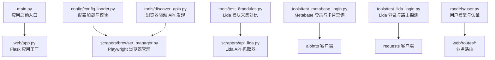
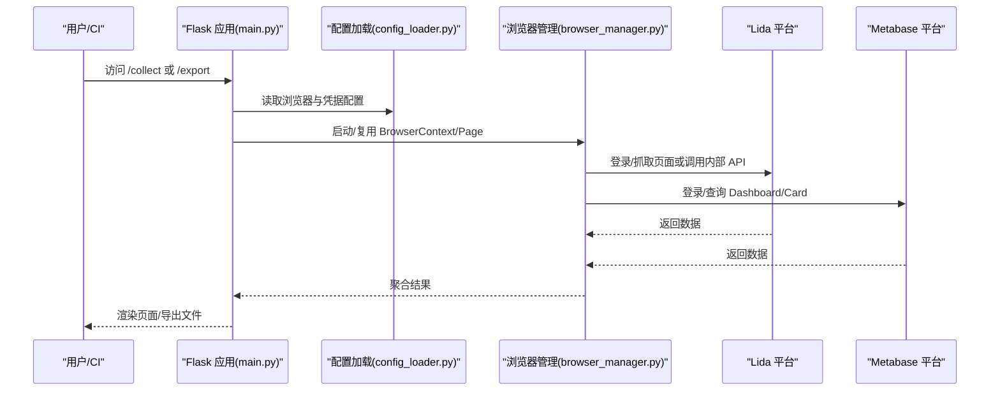
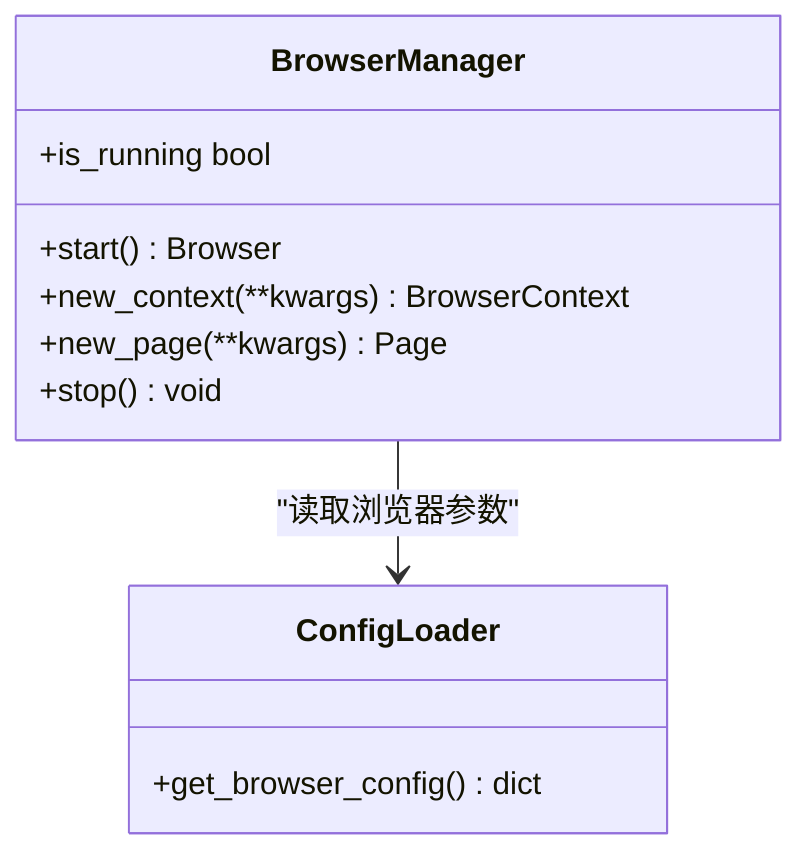
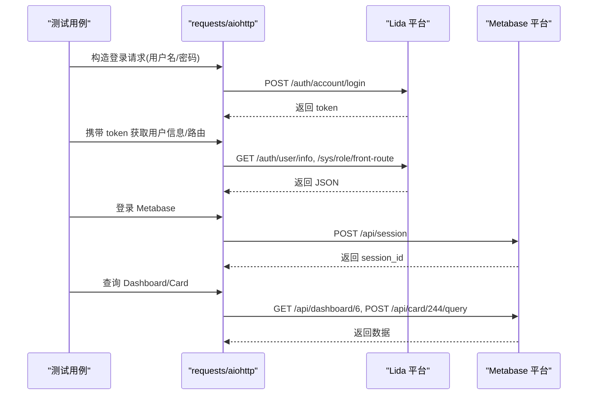
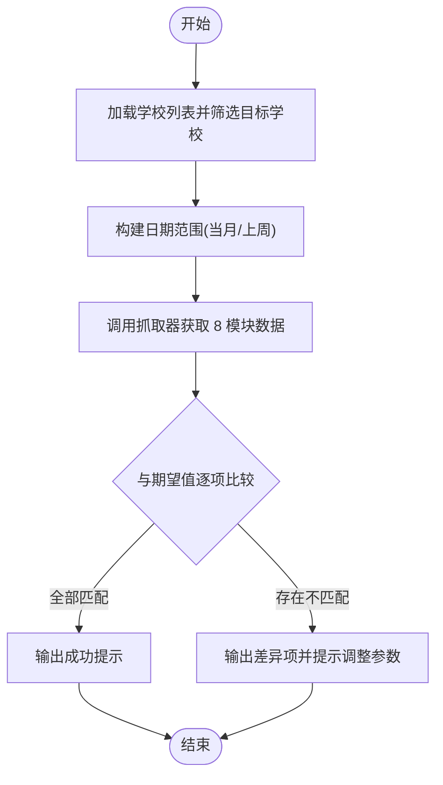
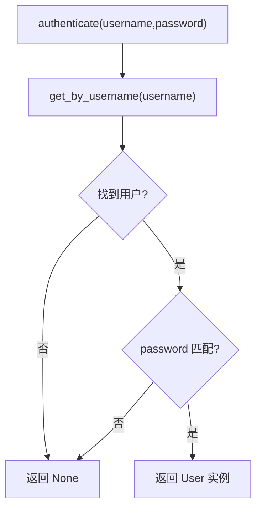
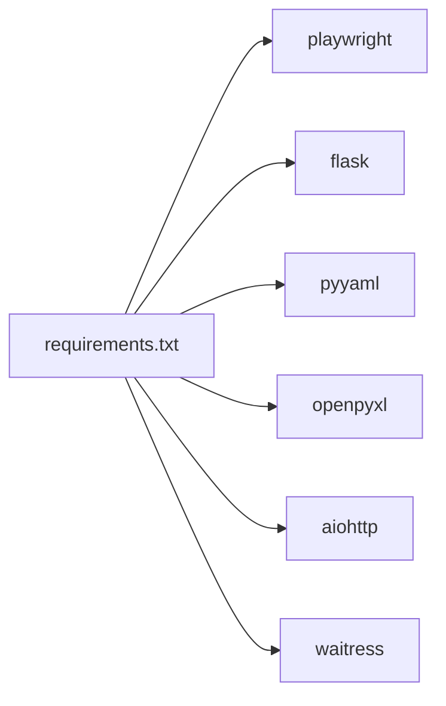

# 测试指南

<cite>
**本文引用的文件**   
- [main.py](file://main.py)
- [requirements.txt](file://requirements.txt)
- [config_loader.py](file://config/config_loader.py)
- [browser_manager.py](file://scrapers/browser_manager.py)
- [test_8modules.py](file://tools/test_8modules.py)
- [test_lida_login.py](file://tools/test_lida_login.py)
- [test_metabase_login.py](file://tools/test_metabase_login.py)
- [discover_apis.py](file://tools/discover_apis.py)
- [user.py](file://models/user.py)
</cite>

## 目录
1. [简介](#简介)
2. [项目结构](#项目结构)
3. [核心组件](#核心组件)
4. [架构总览](#架构总览)
5. [详细组件分析](#详细组件分析)
6. [依赖分析](#依赖分析)
7. [性能考虑](#性能考虑)
8. [故障排查指南](#故障排查指南)
9. [结论](#结论)
10. [附录](#附录)

## 简介
本指南面向“教育平台数据自动采集系统”的测试策略与框架使用，覆盖单元测试、集成测试、浏览器自动化（Playwright）、API 接口测试、数据库操作测试、性能与压力测试、内存泄漏检测、测试数据与环境隔离、持续集成、覆盖率与报告、失败排查等。文档基于仓库现有脚本与模块进行系统化梳理，并提供可落地的实践建议与图示说明。

## 项目结构
仓库采用分层组织：配置、模型、爬虫、服务、Web 路由与工具脚本。测试相关资产主要位于 tools 目录，包含登录验证、数据采集对比、API 发现等脚本；浏览器生命周期管理集中在 scrapers 层；Web 入口在 main.py。

图表来源
- [main.py:1-42](file://main.py#L1-L42)
- [config_loader.py:1-50](file://config/config_loader.py#L1-L50)
- [browser_manager.py:1-75](file://scrapers/browser_manager.py#L1-L75)
- [test_8modules.py:1-101](file://tools/test_8modules.py#L1-L101)
- [test_metabase_login.py:1-86](file://tools/test_metabase_login.py#L1-L86)
- [test_lida_login.py:1-93](file://tools/test_lida_login.py#L1-L93)
- [discover_apis.py:238-451](file://tools/discover_apis.py#L238-L451)
- [user.py:50-77](file://models/user.py#L50-L77)

章节来源
- [main.py:1-42](file://main.py#L1-L42)
- [requirements.txt:1-7](file://requirements.txt#L1-L7)

## 核心组件
- 配置加载与校验：提供浏览器参数、凭据读取与必填字段校验，为测试环境提供稳定配置源。
- Playwright 浏览器管理：封装异步浏览器生命周期，支持 headless/有头模式、上下文隔离、超时设置与清理。
- 工具脚本：
  - Lida 登录与路由探测：通过 HTTP 请求获取 token、用户信息、菜单路由，辅助定位统计接口。
  - Metabase 登录与卡片查询：使用 aiohttp 完成会话建立与 Dashboard/Card 查询。
  - 8 模块采集对比：按日期范围拉取指标并与期望值比对，用于回归验证。
  - API 发现：基于浏览器事件捕获并分类记录 API 响应，辅助接口回归与变更追踪。
- Web 应用与模型：Flask 应用工厂与用户认证逻辑，为集成测试提供被测对象。

章节来源
- [config_loader.py:1-50](file://config/config_loader.py#L1-L50)
- [browser_manager.py:1-75](file://scrapers/browser_manager.py#L1-L75)
- [test_lida_login.py:1-93](file://tools/test_lida_login.py#L1-L93)
- [test_metabase_login.py:1-86](file://tools/test_metabase_login.py#L1-L86)
- [test_8modules.py:1-101](file://tools/test_8modules.py#L1-L101)
- [discover_apis.py:238-451](file://tools/discover_apis.py#L238-L451)
- [user.py:50-77](file://models/user.py#L50-L77)

## 架构总览
下图展示从 Web 入口到外部系统的调用链，以及测试脚本如何介入验证关键路径。

图表来源
- [main.py:1-42](file://main.py#L1-L42)
- [config_loader.py:1-50](file://config/config_loader.py#L1-L50)
- [browser_manager.py:1-75](file://scrapers/browser_manager.py#L1-L75)

## 详细组件分析

### 浏览器自动化与 Playwright 测试
- 能力要点
  - 异步启动 Chromium，支持 headless/有头模式切换。
  - 创建独立 BrowserContext，默认清除 Cookie，设置默认超时。
  - 提供 new_page/new_context/start/stop 等方法，便于用例级资源管理。
- 测试建议
  - 使用 pytest 的 fixture 管理 BrowserManager 生命周期，每个用例新建 Context/Page，避免状态污染。
  - 针对登录流程编写端到端用例：打开登录页 -> 输入凭据 -> 提交 -> 断言跳转或关键元素存在。
  - 对 Grafana/Lida/Metabase 等第三方页面，结合 discover_apis 捕获的 API 列表做回归断言。
- 参考实现位置
  - 浏览器生命周期管理：[browser_manager.py:1-75](file://scrapers/browser_manager.py#L1-L75)
  - API 发现与响应捕获：[discover_apis.py:238-451](file://tools/discover_apis.py#L238-L451)

图表来源
- [browser_manager.py:1-75](file://scrapers/browser_manager.py#L1-L75)
- [config_loader.py:1-50](file://config/config_loader.py#L1-L50)

章节来源
- [browser_manager.py:1-75](file://scrapers/browser_manager.py#L1-L75)
- [discover_apis.py:238-451](file://tools/discover_apis.py#L238-L451)

### API 接口测试（Lida 与 Metabase）
- Lida 登录与路由探测
  - 通过 POST 登录获取 token，随后 GET 用户信息与前端路由树，辅助定位统计接口。
  - 适合用 requests 发起同步请求，断言状态码与关键字段存在。
- Metabase 登录与卡片查询
  - 使用 aiohttp 异步会话登录，获取 session_id，再查询 Dashboard 与 Card 数据。
  - 适合用 pytest-asyncio 组织异步用例，断言列名、行数与首行数据。
- 参考实现位置
  - Lida 登录与路由探测：[test_lida_login.py:1-93](file://tools/test_lida_login.py#L1-L93)
  - Metabase 登录与卡片查询：[test_metabase_login.py:1-86](file://tools/test_metabase_login.py#L1-L86)

图表来源
- [test_lida_login.py:1-93](file://tools/test_lida_login.py#L1-L93)
- [test_metabase_login.py:1-86](file://tools/test_metabase_login.py#L1-L86)

章节来源
- [test_lida_login.py:1-93](file://tools/test_lida_login.py#L1-L93)
- [test_metabase_login.py:1-86](file://tools/test_metabase_login.py#L1-L86)

### 数据采集与回归对比（8 模块）
- 目标：按日期范围采集 8 个模块指标，与期望值逐项比对，快速发现回归问题。
- 关键点：学校筛选、日期范围对齐、模块映射与匹配输出。
- 参考实现位置：[test_8modules.py:1-101](file://tools/test_8modules.py#L1-L101)

图表来源
- [test_8modules.py:1-101](file://tools/test_8modules.py#L1-L101)

章节来源
- [test_8modules.py:1-101](file://tools/test_8modules.py#L1-L101)

### 数据库操作测试（用户模型）
- 关注点：CRUD 方法、唯一性约束、认证逻辑。
- 建议用例：
  - 新增用户后查询、更新、删除链路验证。
  - 重复用户名插入应失败或返回已有记录。
  - 认证函数对正确/错误凭据的分支覆盖。
- 参考实现位置：[user.py:50-77](file://models/user.py#L50-L77)

图表来源
- [user.py:50-77](file://models/user.py#L50-L77)

章节来源
- [user.py:50-77](file://models/user.py#L50-L77)

### 单元测试编写方法与 Mock 使用
- 组织方式
  - 将纯函数/无副作用逻辑抽取为可测单元，按功能目录放置 test 文件。
  - 使用 pytest 的 fixtures 管理共享资源（如临时目录、Mock 配置）。
- Mock 策略
  - 对外部网络请求（requests/aiohttp）使用 unittest.mock.patch 或 httpx/pytest-aiohttp 的 mock 插件。
  - 对浏览器交互使用 playwright 的 page.route 拦截或替换 BrowserManager 的 start/new_context。
  - 对数据库访问使用内存 SQLite 或 SQLAlchemy 的 in-memory 引擎。
- 断言建议
  - 优先断言返回值结构与关键字段，其次断言副作用（如写入文件、DB 记录）。
  - 对时间敏感逻辑使用固定时间源或 time 模块补丁。

[本节为通用方法论，不直接分析具体文件]

### 集成测试策略
- Web 应用集成
  - 使用 Flask 的 test_client 发起请求，断言状态码、模板变量或导出文件内容。
  - 通过配置文件注入测试凭据与 URL，避免硬编码。
- 外部系统集成
  - 使用轻量代理或本地回放服务器模拟 Lida/Metabase 响应，确保离线可运行。
  - 对真实环境的集成用例需隔离账号与数据域，避免影响生产。
- 参考入口
  - 应用启动与 WSGI 选择：[main.py:1-42](file://main.py#L1-L42)

章节来源
- [main.py:1-42](file://main.py#L1-L42)

### 测试数据管理与环境隔离
- 数据管理
  - 使用 YAML/JSON 静态数据作为基准期望值，配合随机种子生成边界用例。
  - 对动态数据（如时间窗口）提供夹具统一生成，保证跨用例一致。
- 环境隔离
  - 通过环境变量或配置文件区分 dev/staging/prod，测试仅读取只读凭据。
  - 浏览器上下文每次新建并清理 Cookie，避免跨用例污染。
- 参考实现位置
  - 配置加载与校验：[config_loader.py:1-50](file://config/config_loader.py#L1-L50)
  - 浏览器上下文隔离：[browser_manager.py:1-75](file://scrapers/browser_manager.py#L1-L75)

章节来源
- [config_loader.py:1-50](file://config/config_loader.py#L1-L50)
- [browser_manager.py:1-75](file://scrapers/browser_manager.py#L1-L75)

### 持续集成测试配置
- 建议步骤
  - 安装依赖：playwright、flask、pyyaml、openpyxl、aiohttp、waitress。
  - 安装浏览器二进制：执行 playwright install chromium。
  - 并行运行：pytest -n auto --dist=loadfile。
  - 产物归档：测试报告、截图、视频、日志。
- 参考依赖
  - 依赖清单：[requirements.txt:1-7](file://requirements.txt#L1-L7)

章节来源
- [requirements.txt:1-7](file://requirements.txt#L1-L7)

### 覆盖率要求与测试报告
- 覆盖率
  - 建议行覆盖率≥80%，分支覆盖率≥70%；对关键路径（登录、采集、导出）提高阈值。
  - 使用 pytest-cov 生成 HTML/XML 报告，上传至 CI 归档。
- 报告与可视化
  - 结合 allure-pytest 生成可视化报告，附带截图与视频。
  - 对浏览器用例开启截图/视频录制，失败时自动附加。

[本节为通用方法论，不直接分析具体文件]

### 失败排查方法
- 常见问题
  - 浏览器启动失败：检查 headless/no-sandbox 参数与 GPU 禁用。
  - 登录失败：确认凭据、URL、Session/Cookie 传递是否正确。
  - 接口变更：利用 discover_apis 捕获最新 API 列表，对比历史基线。
- 定位手段
  - 增加结构化日志与断点，保存关键请求/响应快照。
  - 对异步代码使用 asyncio 调试工具与超时重试策略。
- 参考实现位置
  - 浏览器参数与清理：[browser_manager.py:1-75](file://scrapers/browser_manager.py#L1-L75)
  - API 捕获与分类：[discover_apis.py:238-451](file://tools/discover_apis.py#L238-L451)

章节来源
- [browser_manager.py:1-75](file://scrapers/browser_manager.py#L1-L75)
- [discover_apis.py:238-451](file://tools/discover_apis.py#L238-L451)

## 依赖分析
- 运行时依赖
  - playwright>=1.40：浏览器自动化与页面交互。
  - flask>=3.0：Web 服务与测试客户端。
  - pyyaml>=6.0：配置文件解析。
  - openpyxl>=3.1：Excel 导出。
  - aiohttp>=3.9：异步 HTTP 客户端。
  - waitress>=3.0：生产 WSGI 服务器。
- 测试依赖建议
  - pytest、pytest-asyncio、pytest-cov、allure-pytest、pytest-xdist、httpx、playwright-test。

图表来源
- [requirements.txt:1-7](file://requirements.txt#L1-L7)

章节来源
- [requirements.txt:1-7](file://requirements.txt#L1-L7)

## 性能考虑
- 并发与吞吐
  - 使用 pytest-xdist 并行执行用例，减少整体时长。
  - 对 IO 密集场景（HTTP/浏览器）合理设置超时与重试，避免阻塞。
- 资源控制
  - 限制浏览器并发数，避免内存暴涨；必要时分批次执行。
  - 对大数据量导出任务启用分页与流式处理。
- 监控与度量
  - 记录关键路径耗时、错误率、GC 次数，结合 CI 趋势图观察退化。

[本节为通用方法论，不直接分析具体文件]

## 故障排查指南
- 浏览器相关问题
  - 现象：页面空白、元素不可见、超时。
  - 排查：确认视口设置、等待策略、CSP 绕过、Cookie 清理。
  - 参考：[browser_manager.py:1-75](file://scrapers/browser_manager.py#L1-L75)
- 登录与会话
  - 现象：401/403、session 失效。
  - 排查：核对凭据、URL、Header 传递；检查服务端会话有效期。
  - 参考：[test_metabase_login.py:1-86](file://tools/test_metabase_login.py#L1-L86)、[test_lida_login.py:1-93](file://tools/test_lida_login.py#L1-L93)
- 接口变更
  - 现象：字段缺失、结构变化。
  - 排查：使用 discover_apis 捕获最新响应，对比基线，更新断言。
  - 参考：[discover_apis.py:238-451](file://tools/discover_apis.py#L238-L451)
- 数据不一致
  - 现象：采集值与期望不符。
  - 排查：核对日期范围、学校维度、过滤条件；逐步缩小范围定位。
  - 参考：[test_8modules.py:1-101](file://tools/test_8modules.py#L1-L101)

章节来源
- [browser_manager.py:1-75](file://scrapers/browser_manager.py#L1-L75)
- [test_metabase_login.py:1-86](file://tools/test_metabase_login.py#L1-L86)
- [test_lida_login.py:1-93](file://tools/test_lida_login.py#L1-L93)
- [discover_apis.py:238-451](file://tools/discover_apis.py#L238-L451)
- [test_8modules.py:1-101](file://tools/test_8modules.py#L1-L101)

## 结论
本指南围绕现有脚本与模块，构建了从单元到集成、从 API 到浏览器自动化、从性能到排障的完整测试体系。建议以 pytest 为核心，结合异步与浏览器自动化能力，形成可维护、可扩展、可观测的测试工程，并通过 CI 持续保障质量。

## 附录
- 常用命令
  - 安装依赖与浏览器：pip install -r requirements.txt && playwright install chromium
  - 运行单测：pytest tests -v --cov=. --cov-report=html
  - 并行运行：pytest -n auto --dist=loadfile
  - 生成报告：pytest --alluredir=allure-results && allure serve allure-results
- 推荐目录结构
  - tests/unit：单元测试
  - tests/integration：集成测试
  - tests/e2e：浏览器自动化
  - tests/fixtures：测试数据与夹具
  - tests/reports：覆盖率与 Allure 报告

[本节为通用方法论，不直接分析具体文件]