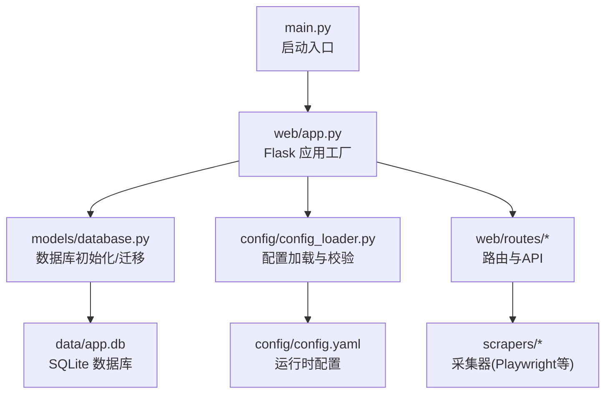
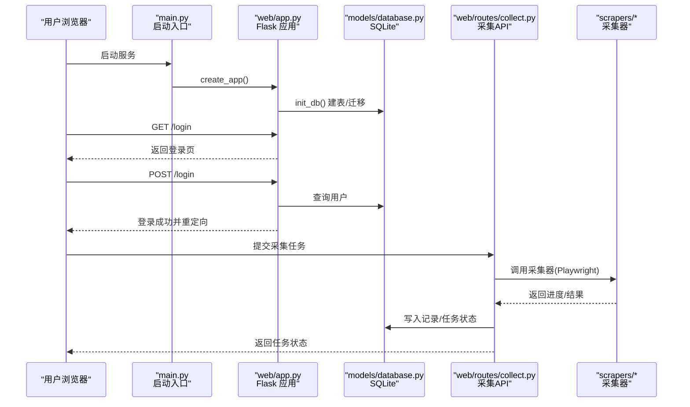
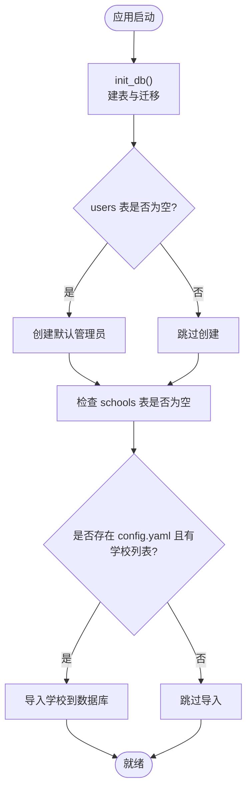
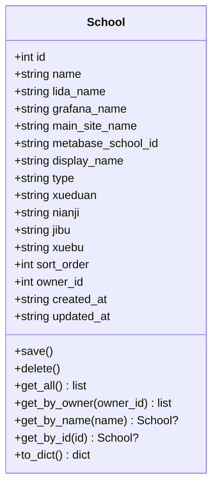
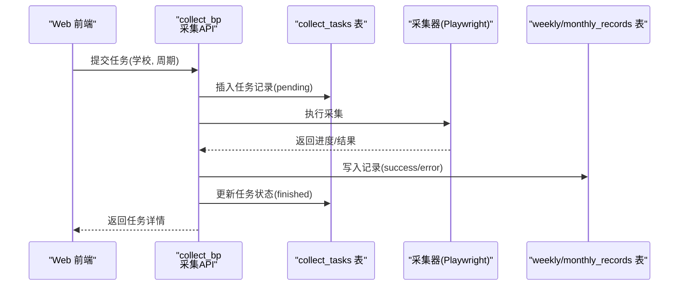
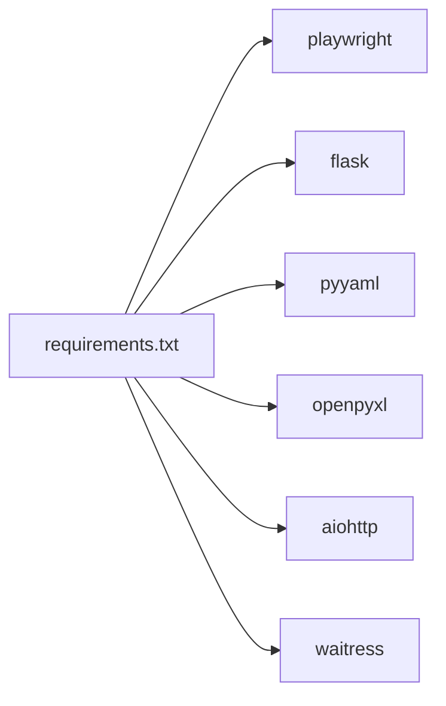

# 快速开始

<cite>
**本文引用的文件**   
- [requirements.txt](file://middle-platform-data-collector-master/requirements.txt)
- [main.py](file://middle-platform-data-collector-master/main.py)
- [run_dev.py](file://middle-platform-data-collector-master/run_dev.py)
- [start.bat](file://middle-platform-data-collector-master/start.bat)
- [start_debug.bat](file://middle-platform-data-collector-master/start_debug.bat)
- [config_loader.py](file://middle-platform-data-collector-master/config/config_loader.py)
- [app.py](file://middle-platform-data-collector-master/web/app.py)
- [database.py](file://middle-platform-data-collector-master/models/database.py)
- [school.py](file://middle-platform-data-collector-master/models/school.py)
- [collect.py](file://middle-platform-data-collector-master/web/routes/collect.py)
</cite>

## 目录
1. [简介](#简介)
2. [项目结构](#项目结构)
3. [核心组件](#核心组件)
4. [架构总览](#架构总览)
5. [详细组件分析](#详细组件分析)
6. [依赖关系分析](#依赖关系分析)
7. [性能考虑](#性能考虑)
8. [故障排除指南](#故障排除指南)
9. [结论](#结论)
10. [附录](#附录)

## 简介
本指南帮助你在5分钟内完成数据采集系统的本地部署与首次运行，涵盖环境准备、依赖安装、配置文件设置、数据库初始化、浏览器驱动安装、开发/生产启动方式，以及第一个采集任务的完整操作流程。系统基于 Python + Flask + Playwright + SQLite，提供 Web 界面进行学校管理、任务调度与结果查看。

## 项目结构
- 应用入口：主程序支持开发与生产两种运行模式；另有独立开发脚本用于避免端口冲突。
- Web 层：Flask 应用工厂负责日志、认证、蓝图注册与模板静态资源加载。
- 数据层：SQLite 自动建表与迁移，首次启动时创建默认管理员并导入学校配置（若存在）。
- 配置层：YAML 配置校验与读取，支持用户级凭证覆盖。
- 采集层：通过 Playwright 控制浏览器访问目标平台，结合重试机制提升稳定性。
- 工具与示例：包含若干测试与辅助脚本，便于调试与探索。

图表来源
- [main.py:1-42](file://middle-platform-data-collector-master/main.py#L1-L42)
- [app.py:306-337](file://middle-platform-data-collector-master/web/app.py#L306-L337)
- [database.py:201-372](file://middle-platform-data-collector-master/models/database.py#L201-L372)
- [config_loader.py:21-96](file://middle-platform-data-collector-master/config/config_loader.py#L21-L96)

章节来源
- [main.py:1-42](file://middle-platform-data-collector-master/main.py#L1-L42)
- [run_dev.py:1-15](file://middle-platform-data-collector-master/run_dev.py#L1-L15)
- [app.py:306-337](file://middle-platform-data-collector-master/web/app.py#L306-L337)
- [database.py:201-372](file://middle-platform-data-collector-master/models/database.py#L201-L372)
- [config_loader.py:21-96](file://middle-platform-data-collector-master/config/config_loader.py#L21-L96)

## 核心组件
- 启动入口
  - 开发模式：使用 Flask 内置服务器，支持热重载。
  - 生产模式：优先使用 waitress WSGI 服务器，具备多线程与稳定特性；未安装则回退到 Flask 非调试模式。
- Web 应用工厂
  - 初始化日志、注册蓝图、建立数据库连接与表结构、注入当前用户上下文。
  - 内置登录页面与鉴权中间件，保护 /api/* 接口。
- 数据库与模型
  - 自动建表与增量迁移，确保字段一致性。
  - 首次启动创建默认管理员账户，并从 YAML 导入学校（若数据库为空且存在配置）。
- 配置加载
  - 校验必填项（如各平台 URL、用户名密码），支持用户级凭证覆盖。
  - 提供浏览器配置与 Metabase 数据库路径解析。

章节来源
- [main.py:10-41](file://middle-platform-data-collector-master/main.py#L10-L41)
- [app.py:14-337](file://middle-platform-data-collector-master/web/app.py#L14-L337)
- [database.py:201-372](file://middle-platform-data-collector-master/models/database.py#L201-L372)
- [config_loader.py:21-96](file://middle-platform-data-collector-master/config/config_loader.py#L21-L96)

## 架构总览
下图展示了从浏览器访问到后端处理、数据库读写与采集执行的总体流程。

图表来源
- [main.py:10-41](file://middle-platform-data-collector-master/main.py#L10-L41)
- [app.py:306-337](file://middle-platform-data-collector-master/web/app.py#L306-L337)
- [database.py:201-372](file://middle-platform-data-collector-master/models/database.py#L201-L372)
- [collect.py](file://middle-platform-data-collector-master/web/routes/collect.py)

## 详细组件分析

### 启动与服务模式
- 开发模式
  - 直接运行主程序并传入 --debug 参数，或使用专用开发脚本以不同端口启动，避免与其他服务冲突。
- 生产模式
  - 主程序优先使用 waitress 作为 WSGI 服务器，提供稳定的多线程处理能力；未安装时自动回退到 Flask 非调试模式。

章节来源
- [main.py:10-41](file://middle-platform-data-collector-master/main.py#L10-L41)
- [run_dev.py:1-15](file://middle-platform-data-collector-master/run_dev.py#L1-L15)
- [start.bat:1-11](file://middle-platform-data-collector-master/start.bat#L1-L11)
- [start_debug.bat:1-8](file://middle-platform-data-collector-master/start_debug.bat#L1-L8)

### 数据库初始化与迁移
- 自动建表：包括周度记录、月度记录、采集任务、学校、用户等表。
- 增量迁移：为已有表添加缺失列，兼容历史数据。
- 默认管理员：首次启动时创建 admin/admin123 管理员账户。
- 学校导入：若数据库为空且存在 config.yaml 的学校列表，将自动导入。

图表来源
- [database.py:201-372](file://middle-platform-data-collector-master/models/database.py#L201-L372)

章节来源
- [database.py:201-372](file://middle-platform-data-collector-master/models/database.py#L201-L372)

### 配置加载与校验
- 必填校验：credentials 下必须包含 lida、grafana、main_site 三个平台；每个平台需有 url，非 grafana 平台还需 username 和 password。
- 用户级覆盖：可通过 set_user_creds_override 在运行时覆盖特定平台的用户名与密码。
- 浏览器配置：headless、slow_mo、default_timeout 等参数由配置提供。
- Metabase 数据库路径：环境变量 > 配置文件 > 默认 data/metabase.db。

章节来源
- [config_loader.py:21-96](file://middle-platform-data-collector-master/config/config_loader.py#L21-L96)
- [config_loader.py:99-147](file://middle-platform-data-collector-master/config/config_loader.py#L99-L147)

### 学校数据模型
- 字段：名称、多平台别名、显示名、类型、学段/年级/学部/校区、排序、创建者、时间戳等。
- 操作：保存（插入或更新）、删除、按条件查询、转换为字典（兼容旧 YAML 格式）。

图表来源
- [school.py:1-165](file://middle-platform-data-collector-master/models/school.py#L1-L165)

章节来源
- [school.py:1-165](file://middle-platform-data-collector-master/models/school.py#L1-L165)

### 采集任务执行流程
- 前端触发：在“采集”页面选择学校、周期并提交任务。
- 后端处理：路由接收请求，持久化任务状态，调用采集器执行。
- 采集器：使用 Playwright 控制浏览器访问目标平台，抓取数据并落库。
- 进度反馈：任务状态与进度实时更新，支持查看历史记录。

图表来源
- [collect.py](file://middle-platform-data-collector-master/web/routes/collect.py)
- [database.py:75-87](file://middle-platform-data-collector-master/models/database.py#L75-L87)

章节来源
- [collect.py](file://middle-platform-data-collector-master/web/routes/collect.py)
- [database.py:75-87](file://middle-platform-data-collector-master/models/database.py#L75-L87)

## 依赖关系分析
- 运行时依赖
  - playwright：浏览器自动化
  - flask：Web 框架
  - pyyaml：配置文件解析
  - openpyxl：Excel 导出
  - aiohttp：异步 HTTP 客户端
  - waitress：生产 WSGI 服务器
- 启动与脚本
  - Windows 批处理脚本用于激活虚拟环境与启动服务。
  - 开发脚本提供独立端口以避免冲突。

图表来源
- [requirements.txt:1-7](file://middle-platform-data-collector-master/requirements.txt#L1-L7)

章节来源
- [requirements.txt:1-7](file://middle-platform-data-collector-master/requirements.txt#L1-L7)

## 性能考虑
- 生产模式建议使用 waitress 以获得更好的并发能力与稳定性。
- 浏览器采集可调整 headless、slow_mo、default_timeout 等参数平衡速度与稳定性。
- 数据库采用 WAL 模式，提高并发读性能。

[本节为通用指导，不直接分析具体文件]

## 故障排除指南
- 配置文件不存在或校验失败
  - 现象：启动时报错提示缺少配置文件或 credentials 不完整。
  - 解决：复制示例配置为实际配置文件，填写各平台 URL、用户名与密码。
- 端口占用
  - 现象：启动后无法访问或报错端口被占用。
  - 解决：使用开发脚本切换到其他端口，或停止占用端口的进程。
- 浏览器驱动问题
  - 现象：采集任务执行时报浏览器相关错误。
  - 解决：确保已正确安装 playwright 及其浏览器驱动；必要时重新安装。
- 登录失败
  - 现象：登录后仍被重定向至登录页。
  - 解决：确认数据库中用户存在且会话正常；检查 SECRET_KEY 与 session 配置。
- 任务无进度或卡住
  - 现象：任务状态长时间 pending。
  - 解决：检查网络连通性与目标平台可用性；查看应用日志定位错误。

章节来源
- [config_loader.py:21-96](file://middle-platform-data-collector-master/config/config_loader.py#L21-L96)
- [app.py:253-304](file://middle-platform-data-collector-master/web/app.py#L253-L304)
- [main.py:10-41](file://middle-platform-data-collector-master/main.py#L10-L41)

## 结论
通过以上步骤，你可以在短时间内完成系统部署、配置与首次采集任务执行。建议在生产环境中使用 waitress 并提供稳定的网络与浏览器环境，同时定期备份 SQLite 数据库以确保数据安全。

[本节为总结性内容，不直接分析具体文件]

## 附录

### 环境准备与安装命令
- Python 版本要求
  - 建议使用 Python 3.9+（根据依赖包最低版本要求）。
- 安装依赖
  - 在项目根目录执行：pip install -r requirements.txt
- 浏览器驱动安装
  - 安装完成后，执行 playwright install 以下载所需浏览器驱动。
- 配置文件设置
  - 复制示例配置为实际配置：cp config/config.yaml.example config/config.yaml
  - 编辑 config/config.yaml，填写 credentials 下的 lida、grafana、main_site 的 url、username、password。
- 数据库初始化
  - 首次启动会自动建表与迁移，并在 users 表为空时创建默认管理员账户。

章节来源
- [requirements.txt:1-7](file://middle-platform-data-collector-master/requirements.txt#L1-L7)
- [database.py:363-372](file://middle-platform-data-collector-master/models/database.py#L363-L372)
- [config_loader.py:21-96](file://middle-platform-data-collector-master/config/config_loader.py#L21-L96)

### 启动开发服务器与生产环境
- 开发模式
  - 方式一：python run_dev.py（端口 5001）
  - 方式二：python main.py --debug（端口 5000）
- 生产环境
  - 方式一：python main.py（优先使用 waitress，未安装则回退到 Flask）
  - 方式二：Windows 双击 start.bat 或 start_debug.bat（自动激活虚拟环境并启动）

章节来源
- [run_dev.py:1-15](file://middle-platform-data-collector-master/run_dev.py#L1-L15)
- [main.py:10-41](file://middle-platform-data-collector-master/main.py#L10-L41)
- [start.bat:1-11](file://middle-platform-data-collector-master/start.bat#L1-L11)
- [start_debug.bat:1-8](file://middle-platform-data-collector-master/start_debug.bat#L1-L8)

### 第一个数据采集任务示例
- 登录系统
  - 打开浏览器访问 http://localhost:5000 或 http://localhost:5001
  - 使用默认管理员账户登录（admin/admin123）
- 配置学校信息
  - 进入“学校管理”，新增学校并填写各平台别名与显示名
  - 或通过 config.yaml 导入（首次启动时自动导入）
- 启动采集任务
  - 进入“采集”页面，选择学校与周期（周/月）
  - 点击“开始采集”，观察任务状态与实时进度
- 查看结果
  - 在“历史记录”中查看采集结果与错误信息
  - 如需导出，可使用“导出”功能生成 Excel 报表

章节来源
- [database.py:363-372](file://middle-platform-data-collector-master/models/database.py#L363-L372)
- [collect.py](file://middle-platform-data-collector-master/web/routes/collect.py)