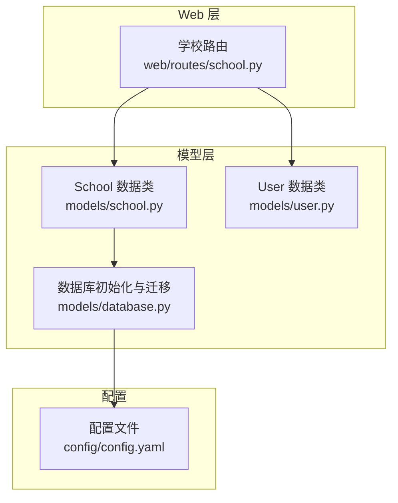
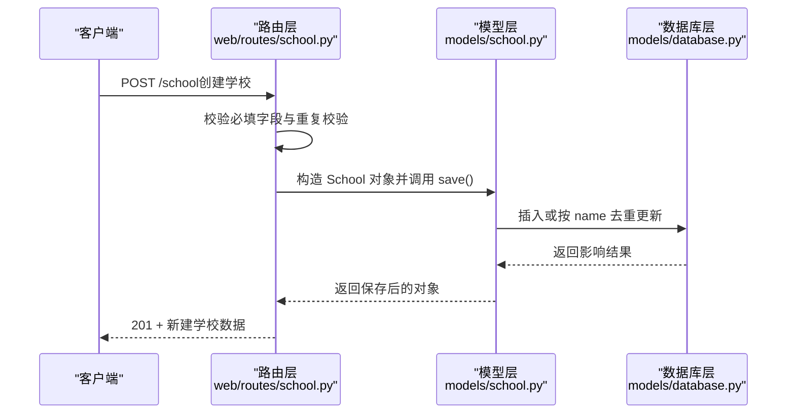
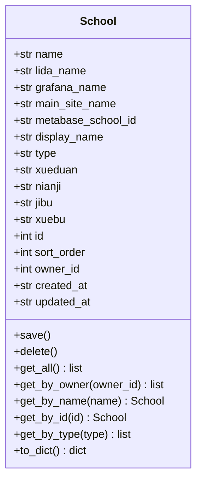
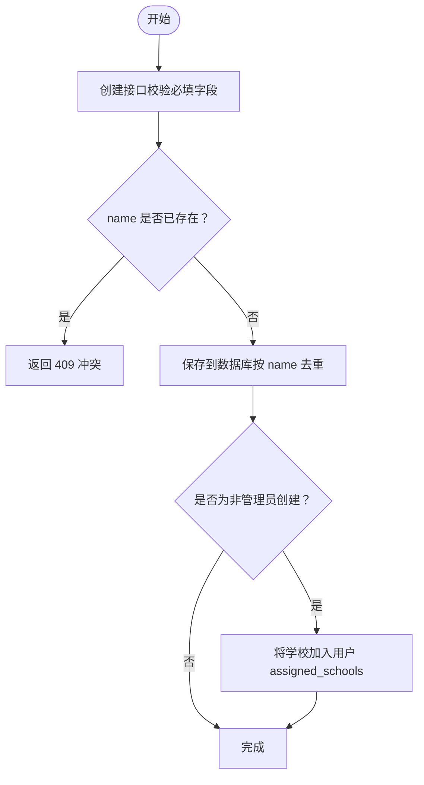
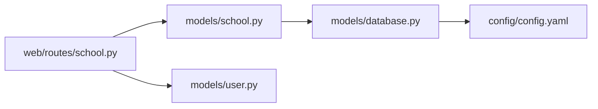

# 学校模型

<cite>
**本文引用的文件**
- [models/school.py](file://models/school.py)
- [web/routes/school.py](file://web/routes/school.py)
- [models/database.py](file://models/database.py)
- [models/user.py](file://models/user.py)
- [config/config.yaml](file://config/config.yaml)
</cite>

## 目录
1. [简介](#简介)
2. [项目结构](#项目结构)
3. [核心组件](#核心组件)
4. [架构总览](#架构总览)
5. [详细组件分析](#详细组件分析)
6. [依赖分析](#依赖分析)
7. [性能考虑](#性能考虑)
8. [故障排查指南](#故障排查指南)
9. [结论](#结论)
10. [附录](#附录)

## 简介
本文件面向“学校模型”的全面数据模型文档，聚焦于 School 类的实体设计与业务语义，涵盖字段定义、数据类型、约束条件、业务含义与使用场景；深入解析多平台名称映射机制（lida_name、grafana_name、main_site_name）的设计目的与实现方式；说明排序字段 sort_order 的作用与管理策略；阐述 owner_id 归属关系、display_name 展示名称、type 类型分类等业务逻辑；并提供 CRUD 操作实现细节、数据验证规则与业务规则检查，最后给出最佳实践与常见操作示例。

## 项目结构
围绕学校模型的关键文件与职责如下：
- models/school.py：定义 School 数据类及 CRUD 方法，负责与 SQLite 表 schools 的映射与持久化。
- web/routes/school.py：提供学校配置的 REST API，包含创建、更新、删除、查询等接口，以及基于会话的权限控制与可见性过滤。
- models/database.py：数据库连接管理、表结构初始化与迁移、默认管理员创建、首次导入学校配置等。
- models/user.py：用户模型，用于解析用户可访问的学校集合，支撑学校资源的可见性控制。
- config/config.yaml：示例配置文件，展示多平台名称映射与学段/年级/级部/学部等字段的典型取值。

图表来源
- [models/school.py:1-165](file://models/school.py#L1-L165)
- [web/routes/school.py:1-155](file://web/routes/school.py#L1-L155)
- [models/database.py:201-372](file://models/database.py#L201-L372)
- [models/user.py:1-113](file://models/user.py#L1-L113)
- [config/config.yaml:10-29](file://config/config.yaml#L10-L29)

章节来源
- [models/school.py:1-165](file://models/school.py#L1-L165)
- [web/routes/school.py:1-155](file://web/routes/school.py#L1-L155)
- [models/database.py:201-372](file://models/database.py#L201-L372)
- [models/user.py:1-113](file://models/user.py#L1-L113)
- [config/config.yaml:10-29](file://config/config.yaml#L10-L29)

## 核心组件
本节对 School 类进行逐字段解析，明确其数据类型、默认值、约束与业务含义，并结合数据库表结构与 API 规则说明其在系统中的作用。

- 字段清单与定义
  - name: str（主键唯一约束，数据库层通过 UNIQUE 实现）
  - lida_name: str（LIDA 平台中的学校名称）
  - grafana_name: str（Grafana 筛选框中的学校名称）
  - main_site_name: str（主站运维中的学校名称）
  - metabase_school_id: str（Metabase 学校数字 ID，用于跨平台关联）
  - display_name: str（前端展示用简称，默认与 name 同值）
  - type: str（学校类型，如“直营校”、“托管校”）
  - xueduan: str（学段，如“高中”、“初中”）
  - nianji: str（年级，如“高一”、“初一”）
  - jibu: str（级部，用于集备统计维度）
  - xuebu: str（学部，用于集备统计维度）
  - id: int | None（自增主键）
  - sort_order: int（排序字段，用于界面与查询排序）
  - owner_id: int | None（归属关系，记录创建者）
  - created_at: str（ISO 时间字符串）
  - updated_at: str（ISO 时间字符串）

- 约束与默认值
  - 数据库表 schools 的 name 字段唯一且非空；其他字段默认值见下述表结构。
  - owner_id 在迁移脚本中被增量添加，若为空则默认为 1。
  - display_name 在迁移脚本中被增量添加，若为空则回退为 name。
  - sort_order 默认为 0，数据库层为整数类型且非空。

- 业务含义与使用场景
  - 多平台名称映射：用于在不同平台（LIDA、Grafana、主站、Metabase）之间建立一致的学校标识与筛选关系。
  - 展示名称：当需要在前端显示更短或更易读的名称时使用 display_name。
  - 类型分类：区分“直营校”与“托管校”，便于后续权限与报表策略差异化。
  - 学段/年级/级部/学部：用于在 LIDA 平台进行学段与年级筛选，以及在集备统计中按级部/学部聚合。
  - 排序字段：统一管理学校在列表中的顺序，便于人工调整与稳定排序。
  - 归属关系：owner_id 与用户模型配合，实现“仅能编辑/删除分配给自己的学校”的权限控制。

章节来源
- [models/school.py:10-26](file://models/school.py#L10-L26)
- [models/database.py:240-253](file://models/database.py#L240-L253)
- [models/database.py:317-347](file://models/database.py#L317-L347)
- [config/config.yaml:10-29](file://config/config.yaml#L10-L29)

## 架构总览
School 模型在系统中的位置与交互如下：
- Web 层通过蓝图暴露学校 CRUD 接口，请求经由路由层进行参数校验与权限控制后，调用模型层方法。
- 模型层通过数据库连接管理器执行 SQL 操作，支持插入、更新（按 name 去重）、查询与删除。
- 数据库层负责表结构初始化与迁移，确保字段演进与默认值一致性。
- 用户模型提供“可访问学校集合”的能力，路由层据此限制可见范围。

图表来源
- [web/routes/school.py:53-96](file://web/routes/school.py#L53-L96)
- [models/school.py:28-76](file://models/school.py#L28-L76)
- [models/database.py:240-253](file://models/database.py#L240-L253)

## 详细组件分析

### School 类与数据模型
- 设计模式：采用数据类（dataclass）承载字段与默认值，配合类方法实现 CRUD 与查询。
- 关系映射：School 对象与数据库表 schools 的字段一一对应，部分字段在迁移脚本中新增或回填默认值。
- 查询策略：提供按 name、id、owner、type 等多种查询方法，并统一按 sort_order 与 name 排序。

图表来源
- [models/school.py:9-165](file://models/school.py#L9-L165)

章节来源
- [models/school.py:9-165](file://models/school.py#L9-L165)

### 多平台名称映射机制
- 设计目的
  - 不同平台对同一学校的命名存在差异，需通过统一的映射字段在各平台间建立稳定关联。
  - 便于在采集、报表与筛选中使用一致的学校标识，避免硬编码平台名称带来的维护成本。
- 字段与实现
  - lida_name、grafana_name、main_site_name 分别对应 LIDA、Grafana、主站中的学校名称。
  - API 创建时，若未显式提供 lida_name，则回退为 name；其余必填字段必须提供。
  - Metabase 关联字段 metabase_school_id 在迁移脚本中新增，用于跨平台关联。
- 使用建议
  - 建议在配置文件中为每个学校提供三个平台的名称映射，确保采集与报表的一致性。
  - 若某平台名称未知，可在创建时使用 name 回退，但应在后续补齐。

章节来源
- [web/routes/school.py:8](file://web/routes/school.py#L8)
- [web/routes/school.py:68-79](file://web/routes/school.py#L68-L79)
- [models/database.py:325-333](file://models/database.py#L325-L333)
- [config/config.yaml:10-29](file://config/config.yaml#L10-L29)

### 排序字段 sort_order 的作用与管理策略
- 作用
  - 控制学校在列表页与查询结果中的排序，支持人工调整优先级。
  - 查询接口统一按 sort_order 与 name 排序，保证结果稳定。
- 管理策略
  - 创建时可直接传入 sort_order；若未提供，默认为 0。
  - 更新接口允许单独更新 sort_order 字段，便于批量调整顺序。
  - 建议为不同区域或重要度设定分组区间，避免冲突。
- 性能提示
  - 排序字段参与 ORDER BY，建议在大量数据场景下保持合理区间与增量步长，减少频繁重排。

章节来源
- [models/school.py:23](file://models/school.py#L23)
- [models/school.py:87](file://models/school.py#L87)
- [models/school.py:161](file://models/school.py#L161)
- [web/routes/school.py:134-136](file://web/routes/school.py#L134-L136)

### 归属关系 owner_id、展示名称 display_name、类型分类 type
- 归属关系 owner_id
  - 记录创建者的用户 ID；迁移脚本中若为空则默认为 1。
  - 路由层在更新与删除时，非管理员仅允许操作“分配给自己的学校”，通过用户模型提供的可访问学校集合进行校验。
- 展示名称 display_name
  - 用于前端展示的简称；迁移脚本中若为空则回退为 name。
  - API 返回时，若未显式设置 display_name，则默认使用 name。
- 类型分类 type
  - 支持“直营校”、“托管校”等分类；迁移脚本中新增该字段，默认为空。
  - 路由层提供按类型查询的接口，便于按类型筛选与报表分组。

章节来源
- [models/database.py:317-347](file://models/database.py#L317-L347)
- [web/routes/school.py:26-44](file://web/routes/school.py#L26-L44)
- [models/user.py:25-30](file://models/user.py#L25-L30)
- [models/school.py:16](file://models/school.py#L16)
- [models/school.py:156-164](file://models/school.py#L156-L164)

### CRUD 操作实现细节
- 创建（POST /school）
  - 必填字段：name、grafana_name、main_site_name。
  - 去重策略：按 name 唯一键冲突时，执行按列去重更新（ON CONFLICT(name) DO UPDATE）。
  - 自动分配：非管理员创建时，自动将新建学校加入当前用户的 assigned_schools。
  - 返回：返回新建的完整学校对象。
- 更新（PUT /school/<id>）
  - 权限：非管理员仅能更新分配给自己的学校。
  - 校验：必填字段校验与名称重复校验。
  - 排序：可选择性更新 sort_order。
  - 返回：返回更新后的完整对象。
- 删除（DELETE /school/<id>）
  - 权限：非管理员仅能删除分配给自己的学校。
  - 返回：204 No Content。
- 查询
  - 列表：支持按可见性过滤（管理员返回全部，普通用户仅返回分配的学校）。
  - 按名称/ID/所有/按 owner/按类型：提供多种查询方法，统一按 sort_order 与 name 排序。

图表来源
- [web/routes/school.py:53-96](file://web/routes/school.py#L53-L96)
- [models/school.py:28-76](file://models/school.py#L28-L76)

章节来源
- [web/routes/school.py:53-155](file://web/routes/school.py#L53-L155)
- [models/school.py:28-165](file://models/school.py#L28-L165)

### 数据验证规则与业务规则检查
- 必填字段
  - 创建与更新均要求 name、grafana_name、main_site_name 三字段非空。
- 唯一性
  - name 在数据库层唯一；创建时若重复返回 409。
- 可见性与权限
  - 非管理员仅能操作分配给自己的学校；否则返回 403。
- 显示回退
  - display_name 为空时回退为 name；API 返回时亦遵循此规则。
- 类型与筛选
  - type 支持“直营校/托管校”等分类；xueduan/nianji/jibu/xuebu 用于 LIDA 平台筛选与集备统计维度。

章节来源
- [web/routes/school.py:8](file://web/routes/school.py#L8)
- [web/routes/school.py:63-66](file://web/routes/school.py#L63-L66)
- [web/routes/school.py:114-117](file://web/routes/school.py#L114-L117)
- [web/routes/school.py:105-108](file://web/routes/school.py#L105-L108)
- [models/school.py:16](file://models/school.py#L16)
- [models/school.py:130-137](file://models/school.py#L130-L137)

### 最佳实践与常见操作示例
- 最佳实践
  - 在配置文件中为每所学校提供三个平台的名称映射，确保采集与报表一致。
  - 为不同区域或重要度设定 sort_order 区间，避免频繁重排。
  - 使用 type 字段进行分类管理，便于后续权限与报表策略差异化。
  - 为 display_name 提供简短易读的展示名称，提升前端体验。
  - 非管理员用户仅能管理分配给自己的学校，避免越权操作。
- 常见操作示例
  - 创建学校：提供 name、grafana_name、main_site_name 三字段，必要时补充 xueduan/nianji/jibu/xuebu。
  - 更新学校：可选择性更新 sort_order、display_name、type 等字段。
  - 按类型筛选：调用按类型查询接口，获取“直营校”或“托管校”列表。
  - 导入初始数据：首次启动时可从配置文件导入学校数据，自动填充排序与时间戳。

章节来源
- [config/config.yaml:10-29](file://config/config.yaml#L10-L29)
- [models/database.py:143-199](file://models/database.py#L143-L199)
- [models/school.py:156-164](file://models/school.py#L156-L164)

## 依赖分析
- 组件耦合
  - 路由层依赖模型层的 School 与 User；模型层依赖数据库层的连接管理器。
  - 数据库层负责表结构初始化与迁移，确保字段演进与默认值一致性。
- 外部依赖
  - SQLite 作为本地存储；Flask 作为 Web 框架。
- 潜在循环依赖
  - 当前结构清晰，无明显循环依赖风险。

图表来源
- [web/routes/school.py:1-155](file://web/routes/school.py#L1-L155)
- [models/school.py:1-165](file://models/school.py#L1-L165)
- [models/user.py:1-113](file://models/user.py#L1-L113)
- [models/database.py:201-372](file://models/database.py#L201-L372)
- [config/config.yaml:10-29](file://config/config.yaml#L10-L29)

章节来源
- [web/routes/school.py:1-155](file://web/routes/school.py#L1-L155)
- [models/school.py:1-165](file://models/school.py#L1-L165)
- [models/user.py:1-113](file://models/user.py#L1-L113)
- [models/database.py:201-372](file://models/database.py#L201-L372)
- [config/config.yaml:10-29](file://config/config.yaml#L10-L29)

## 性能考虑
- 排序与索引
  - 查询统一按 sort_order 与 name 排序；建议在大量数据场景下保持合理的排序区间与步长，减少频繁重排。
- 去重更新
  - 创建时按 name 去重更新，避免重复插入；注意在高并发场景下对 name 的竞争条件进行控制。
- 连接管理
  - 数据库连接使用上下文管理器，确保事务提交与异常回滚；建议在批量导入时合并事务以提升性能。

## 故障排查指南
- 创建失败（400）
  - 必填字段缺失：确认 name、grafana_name、main_site_name 是否填写。
  - 名称重复（409）：检查是否存在同名学校，必要时修改名称。
- 更新失败（403）
  - 权限不足：确认当前用户是否被分配到该学校；非管理员无法更新未分配的学校。
- 删除失败（403）
  - 权限不足：确认当前用户是否被分配到该学校；非管理员无法删除未分配的学校。
- 展示名称为空
  - display_name 为空时会回退为 name；可在创建或更新时显式设置 display_name。
- 排序异常
  - 检查 sort_order 是否为整数且符合预期；可通过更新接口调整排序值。

章节来源
- [web/routes/school.py:57-61](file://web/routes/school.py#L57-L61)
- [web/routes/school.py:65-66](file://web/routes/school.py#L65-L66)
- [web/routes/school.py:105-108](file://web/routes/school.py#L105-L108)
- [web/routes/school.py:148-151](file://web/routes/school.py#L148-L151)
- [models/school.py:16](file://models/school.py#L16)
- [models/school.py:130-137](file://models/school.py#L130-L137)

## 结论
School 模型通过清晰的字段定义、严格的验证规则与完善的权限控制，实现了多平台名称映射、展示名称回退、类型分类与排序管理等关键业务能力。结合数据库层的迁移与初始化机制，系统能够在演进过程中平滑地增加字段并维持数据一致性。建议在实际使用中遵循最佳实践，确保配置准确、权限可控、排序合理，从而获得稳定可靠的学校数据管理体验。

## 附录
- 数据库表结构要点
  - schools 表包含 name（UNIQUE）、lida_name、grafana_name、main_site_name、xueduan、nianji、jibu、xuebu、sort_order、owner_id、display_name、type、metabase_school_id、created_at、updated_at 等字段。
- 配置文件示例
  - schools 数组中包含 name 与三个平台名称映射，以及学段/年级/级部/学部等字段示例。

章节来源
- [models/database.py:240-253](file://models/database.py#L240-L253)
- [config/config.yaml:10-29](file://config/config.yaml#L10-L29)