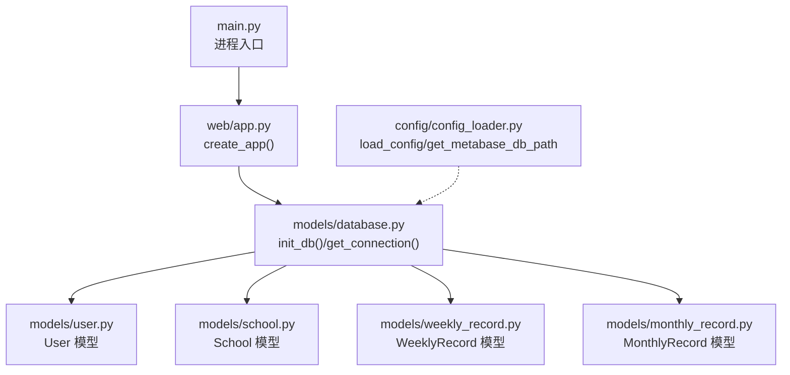
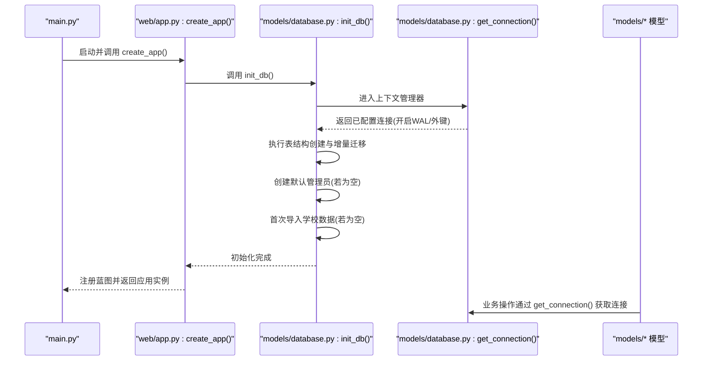
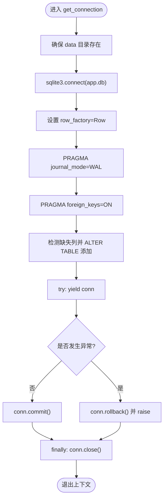
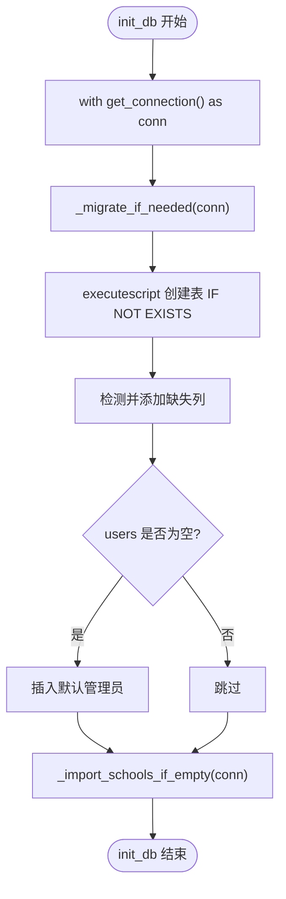
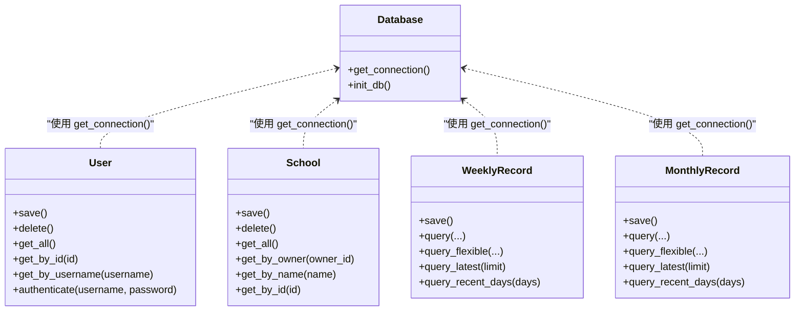
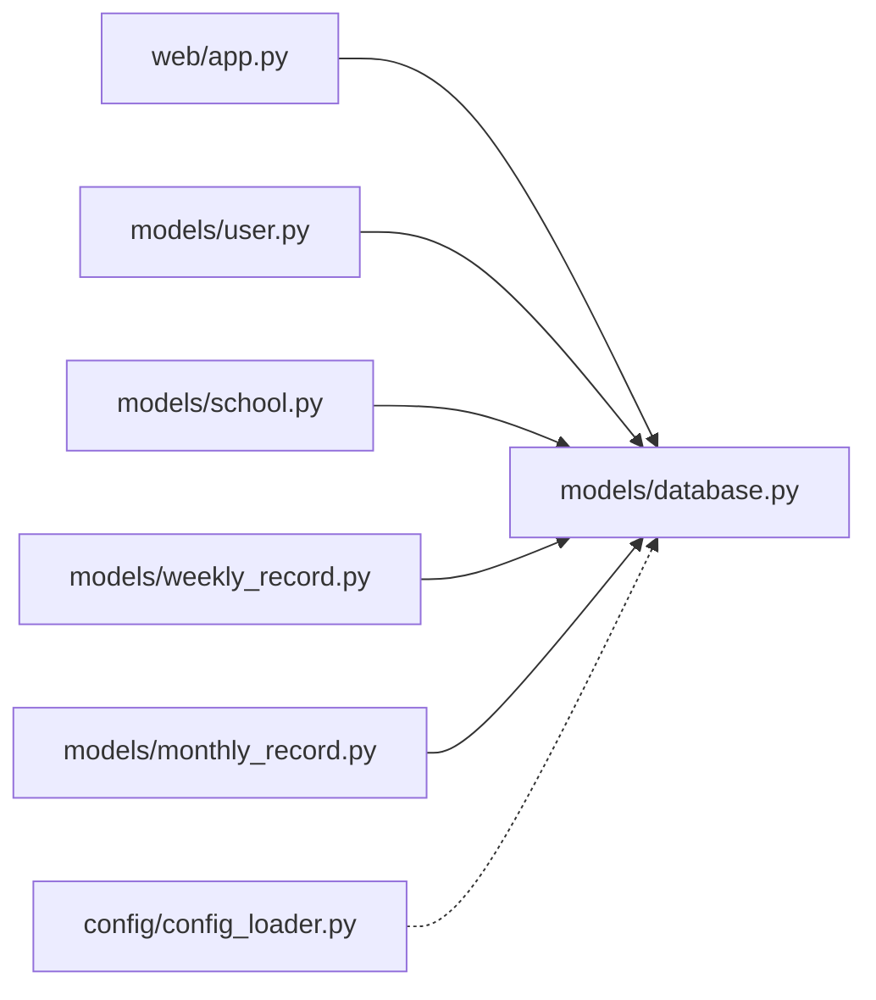

# 数据库连接管理

<cite>
**本文引用的文件**
- [models/database.py](file://middle-platform-data-collector-master/models/database.py)
- [web/app.py](file://middle-platform-data-collector-master/web/app.py)
- [main.py](file://middle-platform-data-collector-master/main.py)
- [models/user.py](file://middle-platform-data-collector-master/models/user.py)
- [models/school.py](file://middle-platform-data-collector-master/models/school.py)
- [models/weekly_record.py](file://middle-platform-data-collector-master/models/weekly_record.py)
- [models/monthly_record.py](file://middle-platform-data-collector-master/models/monthly_record.py)
- [config/config_loader.py](file://middle-platform-data-collector-master/config/config_loader.py)
</cite>

## 目录
1. [简介](#简介)
2. [项目结构](#项目结构)
3. [核心组件](#核心组件)
4. [架构总览](#架构总览)
5. [详细组件分析](#详细组件分析)
6. [依赖关系分析](#依赖关系分析)
7. [性能考虑](#性能考虑)
8. [故障排查指南](#故障排查指南)
9. [结论](#结论)
10. [附录](#附录)

## 简介
本技术文档聚焦于数据收集平台的 SQLite 数据库连接管理模块，系统性阐述以下主题：
- 连接池设计与 get_connection 上下文管理器实现原理、连接生命周期与事务处理机制
- WAL 模式配置与优势、外键约束启用策略
- 数据库文件路径管理与 data 目录自动创建逻辑
- 增量迁移机制：表结构检测、字段类型转换、数据迁移脚本
- 默认管理员账户初始化流程与学校数据导入机制
- 数据库性能优化配置、错误处理与回滚策略的最佳实践

## 项目结构
与数据库连接管理直接相关的代码主要位于 models 与 web 层：
- models/database.py：SQLite 连接管理、WAL 与外键设置、表结构初始化、增量迁移、默认管理员与学校数据导入
- web/app.py：应用工厂，启动时调用 init_db 完成数据库初始化
- main.py：进程入口，选择开发或生产服务器
- models/*.py：各业务模型通过 get_connection 访问数据库
- config/config_loader.py：配置文件加载（含 Metabase 数据库路径解析）

图表来源
- [main.py:10-42](file://middle-platform-data-collector-master/main.py#L10-L42)
- [web/app.py:306-337](file://middle-platform-data-collector-master/web/app.py#L306-L337)
- [models/database.py:204-372](file://middle-platform-data-collector-master/models/database.py#L204-L372)
- [models/user.py:1-113](file://middle-platform-data-collector-master/models/user.py#L1-L113)
- [models/school.py:1-165](file://middle-platform-data-collector-master/models/school.py#L1-L165)
- [models/weekly_record.py:1-163](file://middle-platform-data-collector-master/models/weekly_record.py#L1-L163)
- [models/monthly_record.py:1-200](file://middle-platform-data-collector-master/models/monthly_record.py#L1-L200)
- [config/config_loader.py:1-147](file://middle-platform-data-collector-master/config/config_loader.py#L1-L147)

章节来源
- [main.py:10-42](file://middle-platform-data-collector-master/main.py#L10-L42)
- [web/app.py:306-337](file://middle-platform-data-collector-master/web/app.py#L306-L337)
- [models/database.py:16-48](file://middle-platform-data-collector-master/models/database.py#L16-L48)

## 核心组件
- 连接上下文管理器 get_connection：负责确保 data 目录存在、建立 sqlite3 连接、开启 WAL 与外键、执行轻量级增量迁移、提供事务边界（提交/回滚）、关闭连接。
- 初始化函数 init_db：在应用启动时调用，负责建表、增量迁移、默认管理员创建、首次学校数据导入。
- 模型层 User/School/WeeklyRecord/MonthlyRecord：统一通过 get_connection 获取连接进行读写。

章节来源
- [models/database.py:24-48](file://middle-platform-data-collector-master/models/database.py#L24-L48)
- [models/database.py:201-372](file://middle-platform-data-collector-master/models/database.py#L201-L372)
- [models/user.py:41-77](file://middle-platform-data-collector-master/models/user.py#L41-L77)
- [models/school.py:28-117](file://middle-platform-data-collector-master/models/school.py#L28-L117)
- [models/weekly_record.py:32-68](file://middle-platform-data-collector-master/models/weekly_record.py#L32-L68)
- [models/monthly_record.py:47-100](file://middle-platform-data-collector-master/models/monthly_record.py#L47-L100)

## 架构总览
下图展示了从进程启动到数据库初始化的关键流程，以及模型层对连接的统一使用方式。

图表来源
- [main.py:10-42](file://middle-platform-data-collector-master/main.py#L10-L42)
- [web/app.py:306-337](file://middle-platform-data-collector-master/web/app.py#L306-L337)
- [models/database.py:201-372](file://middle-platform-data-collector-master/models/database.py#L201-L372)
- [models/database.py:24-48](file://middle-platform-data-collector-master/models/database.py#L24-L48)

## 详细组件分析

### 连接上下文管理器 get_connection
- 目录与路径
  - 数据目录 _DATA_DIR 为项目根 data 子目录；数据库文件 _DB_PATH 为 data/app.db。
  - 每次获取连接前会确保 data 目录存在。
- 连接参数
  - row_factory=sqlite3.Row：以字典风格访问列。
  - PRAGMA journal_mode=WAL：开启写时复制日志模式，提升并发读性能与减少锁竞争。
  - PRAGMA foreign_keys=ON：强制外键约束检查。
- 事务与异常
  - 成功路径：yield 连接后执行 conn.commit()。
  - 异常路径：捕获异常后执行 conn.rollback() 并重新抛出。
  - finally：确保 conn.close() 被调用，避免连接泄漏。
- 轻量级增量迁移
  - 针对 weekly_records 与 monthly_records 表，若存在且缺少 platform_elapsed 列则添加。

图表来源
- [models/database.py:16-48](file://middle-platform-data-collector-master/models/database.py#L16-L48)

章节来源
- [models/database.py:12-22](file://middle-platform-data-collector-master/models/database.py#L12-L22)
- [models/database.py:24-48](file://middle-platform-data-collector-master/models/database.py#L24-L48)

### 数据库初始化与增量迁移 init_db
- 表结构创建
  - 使用 executescript 批量创建 weekly_records、collect_tasks、schools、monthly_records、users 等表（IF NOT EXISTS）。
- 增量迁移
  - 检测已有表并动态添加缺失列，如 collect_tasks.record_type、weekly_records.weekly_overall_activity、schools.owner_id/metabase_school_id/display_name/type、weekly_records.data_source、monthly_records.data_source 等。
  - 针对旧版本 week_number 为 INTEGER 的情况，执行 _migrate_if_needed 将表重命名、重建新表、迁移并格式化周次文本。
- 默认管理员
  - 若 users 表为空，插入默认管理员账号（用户名 admin，密码 admin123），并记录时间戳。
- 学校数据导入
  - 若 schools 表为空，尝试从 config/config.yaml 读取 schools 列表并 INSERT OR IGNORE 导入。

图表来源
- [models/database.py:90-137](file://middle-platform-data-collector-master/models/database.py#L90-L137)
- [models/database.py:201-372](file://middle-platform-data-collector-master/models/database.py#L201-L372)

章节来源
- [models/database.py:201-372](file://middle-platform-data-collector-master/models/database.py#L201-L372)
- [models/database.py:90-137](file://middle-platform-data-collector-master/models/database.py#L90-L137)

### 模型层与连接使用
- User 模型：保存、删除、查询均通过 get_connection 获取连接，使用参数化语句避免注入风险。
- School 模型：支持按 owner 筛选、按名称/ID 查找、UPSERT 写入。
- WeeklyRecord/MonthlyRecord 模型：提供灵活查询、最近记录、去重标签等常用方法，均基于 get_connection。

图表来源
- [models/database.py:24-48](file://middle-platform-data-collector-master/models/database.py#L24-L48)
- [models/user.py:41-77](file://middle-platform-data-collector-master/models/user.py#L41-L77)
- [models/school.py:28-117](file://middle-platform-data-collector-master/models/school.py#L28-L117)
- [models/weekly_record.py:32-68](file://middle-platform-data-collector-master/models/weekly_record.py#L32-L68)
- [models/monthly_record.py:47-100](file://middle-platform-data-collector-master/models/monthly_record.py#L47-L100)

章节来源
- [models/user.py:1-113](file://middle-platform-data-collector-master/models/user.py#L1-L113)
- [models/school.py:1-165](file://middle-platform-data-collector-master/models/school.py#L1-L165)
- [models/weekly_record.py:1-163](file://middle-platform-data-collector-master/models/weekly_record.py#L1-L163)
- [models/monthly_record.py:1-200](file://middle-platform-data-collector-master/models/monthly_record.py#L1-L200)

### 应用启动与初始化触发点
- web/app.py 的 create_app 中显式调用 models.database.init_db()，确保在注册路由之前完成数据库初始化。
- main.py 作为进程入口，根据命令行参数选择 Flask 开发服务器或 Waitress 生产服务器。

章节来源
- [web/app.py:306-337](file://middle-platform-data-collector-master/web/app.py#L306-L337)
- [main.py:10-42](file://middle-platform-data-collector-master/main.py#L10-L42)

## 依赖关系分析
- 模块耦合
  - web/app.py 依赖 models.database.init_db 完成初始化。
  - 所有模型模块依赖 models.database.get_connection 获取连接。
  - config/config_loader.py 提供配置加载与 Metabase 数据库路径解析，供其他模块按需使用。
- 外部依赖
  - sqlite3：标准库，提供连接与 SQL 执行能力。
  - yaml：用于读取 config.yaml。
  - flask/waitress：Web 服务运行环境。

图表来源
- [web/app.py:306-337](file://middle-platform-data-collector-master/web/app.py#L306-L337)
- [models/database.py:24-48](file://middle-platform-data-collector-master/models/database.py#L24-L48)
- [models/user.py:1-113](file://middle-platform-data-collector-master/models/user.py#L1-L113)
- [models/school.py:1-165](file://middle-platform-data-collector-master/models/school.py#L1-L165)
- [models/weekly_record.py:1-163](file://middle-platform-data-collector-master/models/weekly_record.py#L1-L163)
- [models/monthly_record.py:1-200](file://middle-platform-data-collector-master/models/monthly_record.py#L1-L200)
- [config/config_loader.py:1-147](file://middle-platform-data-collector-master/config/config_loader.py#L1-L147)

章节来源
- [models/database.py:24-48](file://middle-platform-data-collector-master/models/database.py#L24-L48)
- [web/app.py:306-337](file://middle-platform-data-collector-master/web/app.py#L306-L337)
- [config/config_loader.py:1-147](file://middle-platform-data-collector-master/config/config_loader.py#L1-L147)

## 性能考虑
- WAL 模式
  - 通过 PRAGMA journal_mode=WAL 开启写时复制日志，显著降低写锁冲突，提高并发读性能。
- 外键约束
  - PRAGMA foreign_keys=ON 保证引用完整性，避免脏数据。
- 连接生命周期
  - 使用上下文管理器确保每个请求/任务持有独立连接，避免共享状态导致的锁竞争。
- UPSERT 与唯一约束
  - 周/月记录表采用 ON CONFLICT DO UPDATE 实现幂等写入，减少重复写入开销。
- 索引建议（可选扩展）
  - 可按 (school_name, year, week_number)/(school_name, year, month_number) 等高频查询条件建立索引以提升查询性能。
- 批量写入
  - 对于大批量采集场景，可在单次事务内分批提交，平衡内存占用与持久化频率。

[本节为通用性能指导，不直接分析具体文件]

## 故障排查指南
- 常见错误与定位
  - 未登录访问 API：web 层 before_request 拦截并返回 401 或未登录提示。
  - 数据库文件权限问题：确认 data 目录可写，get_connection 会在连接前自动创建目录。
  - 外键约束失败：检查关联表是否存在对应记录，或调整写入顺序。
  - 迁移失败：查看日志输出，确认表结构与列名是否符合预期。
- 日志与调试
  - 应用日志写入 logs/app.log，包含初始化与导入过程的关键信息。
  - 可通过 Python logging 级别调整输出详细程度。
- 回滚与一致性
  - get_connection 在异常时执行 rollback，确保事务原子性。
  - 建议在复杂写入流程中拆分小事务，便于定位问题。

章节来源
- [web/app.py:253-293](file://middle-platform-data-collector-master/web/app.py#L253-L293)
- [models/database.py:24-48](file://middle-platform-data-collector-master/models/database.py#L24-L48)
- [models/database.py:201-372](file://middle-platform-data-collector-master/models/database.py#L201-L372)

## 结论
该数据库连接管理模块以简洁可靠的上下文管理器为核心，结合 WAL 模式与外键约束，提供了高可用、易维护的 SQLite 访问层。通过 init_db 的增量迁移与种子数据初始化，系统具备良好的可演进性与开箱即用体验。模型层统一封装了连接使用方式，保证了事务一致性与安全性。建议在生产环境中关注日志监控与备份策略，并根据实际负载评估是否需要引入索引优化与连接复用策略。

[本节为总结性内容，不直接分析具体文件]

## 附录

### 配置与环境变量
- 配置文件路径
  - config/config.yaml：存放浏览器、平台凭证、数据库路径等配置项。
- Metabase 数据库路径解析优先级
  - 环境变量 METABASE_DB_PATH > config.yaml 中的 database.metabase_db_path > 默认 data/metabase.db。

章节来源
- [config/config_loader.py:122-147](file://middle-platform-data-collector-master/config/config_loader.py#L122-L147)

### 默认管理员与学校数据导入流程
- 默认管理员
  - 当 users 表为空时，自动插入默认管理员账号。
- 学校数据导入
  - 当 schools 表为空时，从 config/config.yaml 的 schools 列表导入，忽略重复项。

章节来源
- [models/database.py:363-372](file://middle-platform-data-collector-master/models/database.py#L363-L372)
- [models/database.py:143-199](file://middle-platform-data-collector-master/models/database.py#L143-L199)