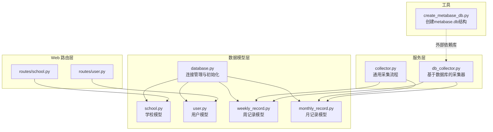
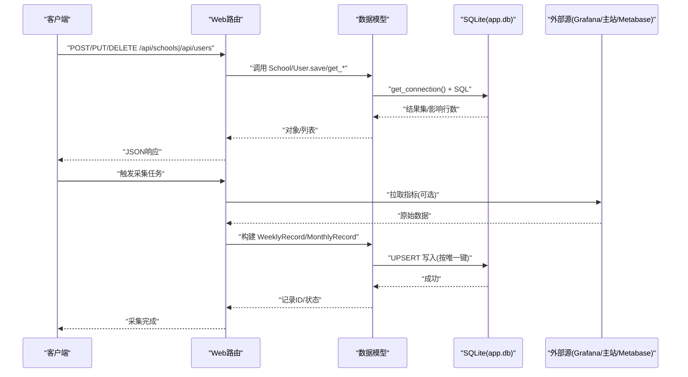
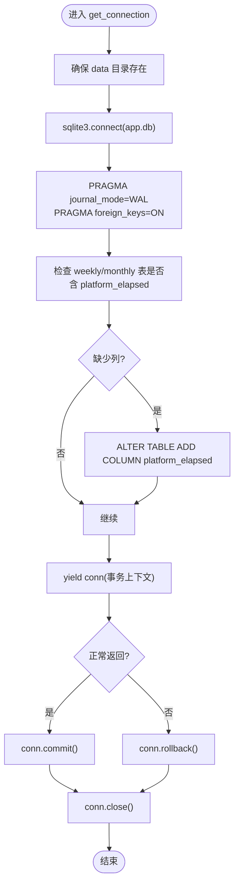
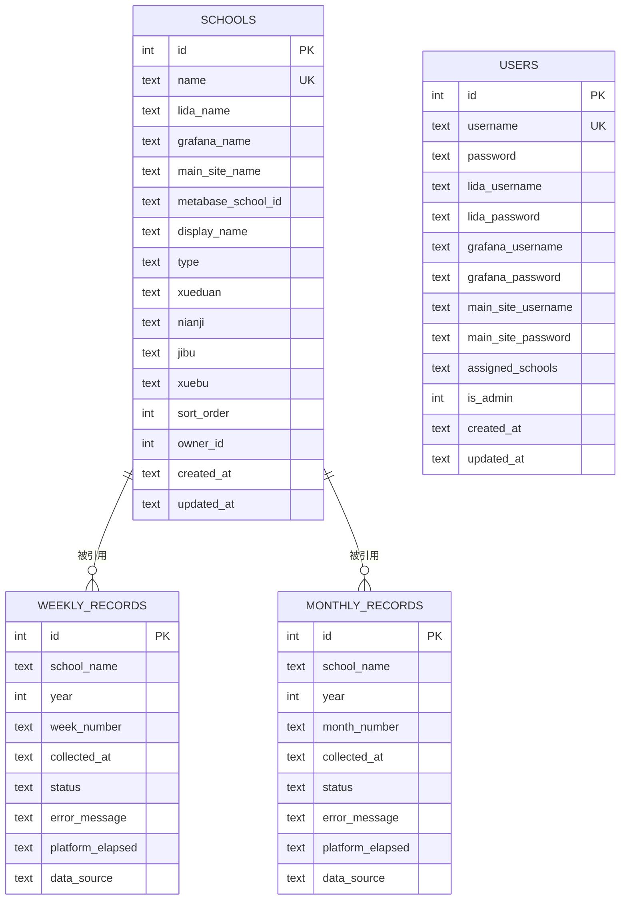
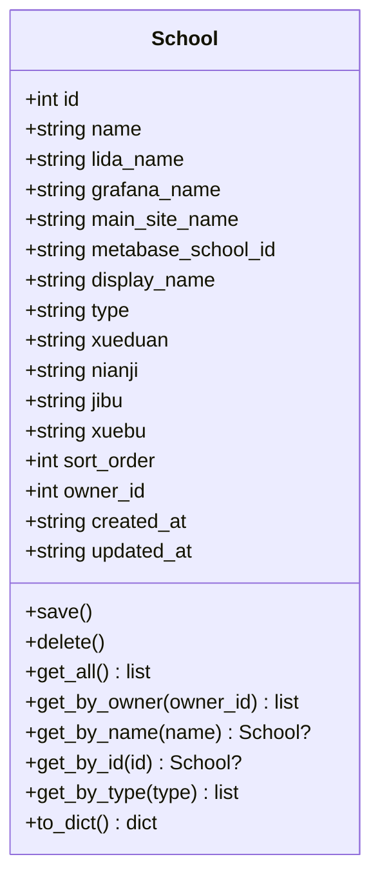
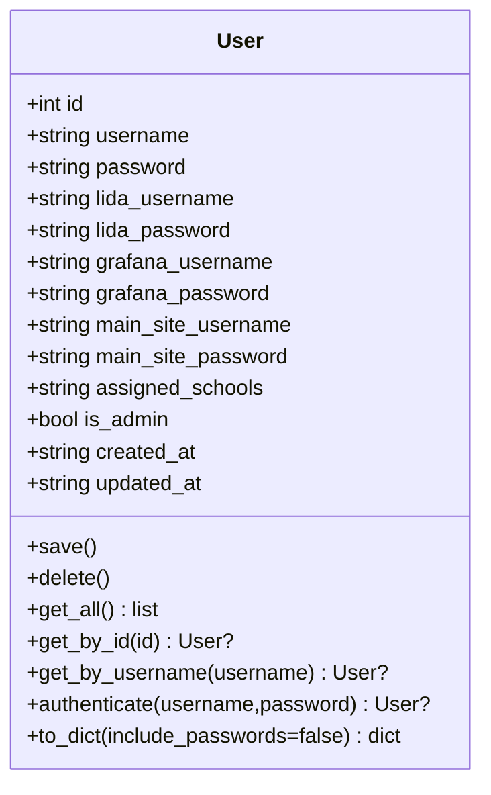
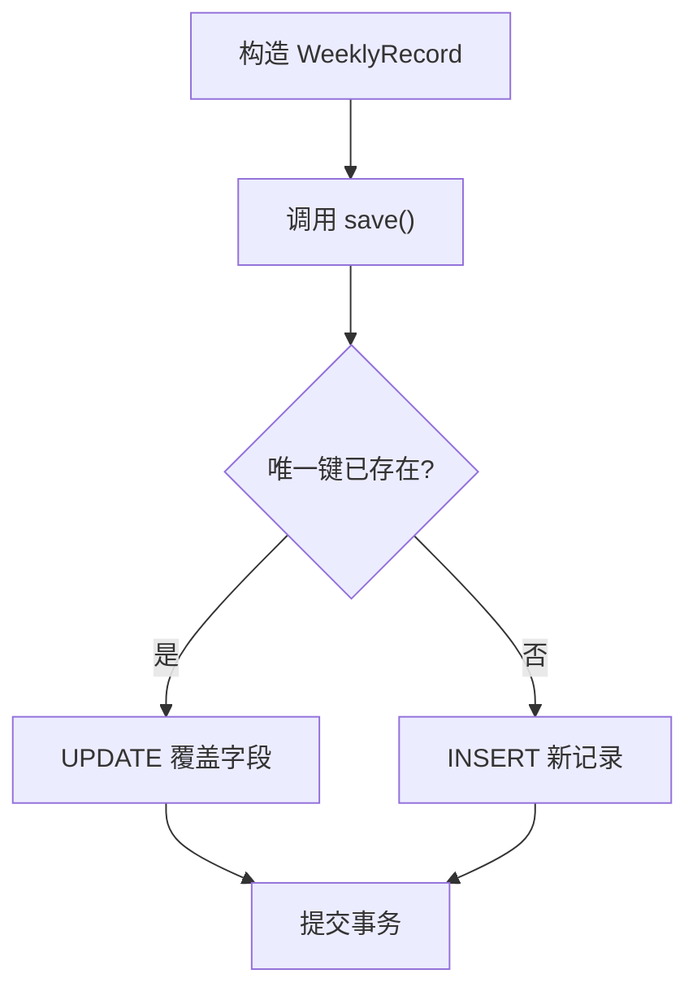
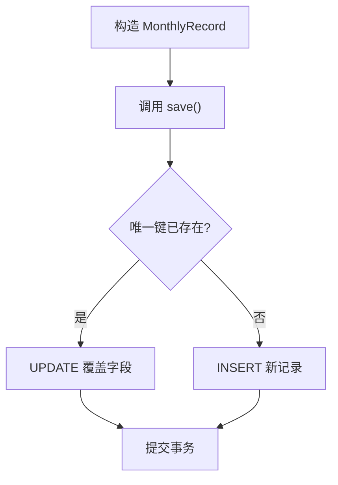
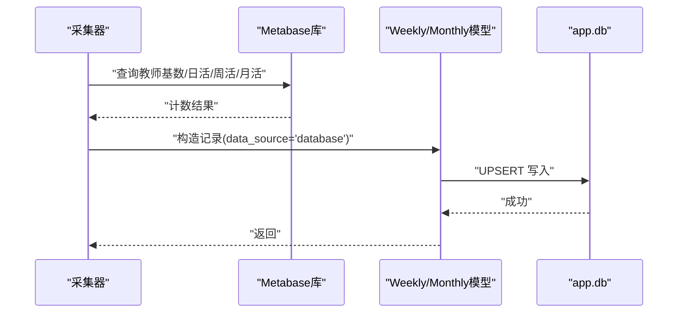
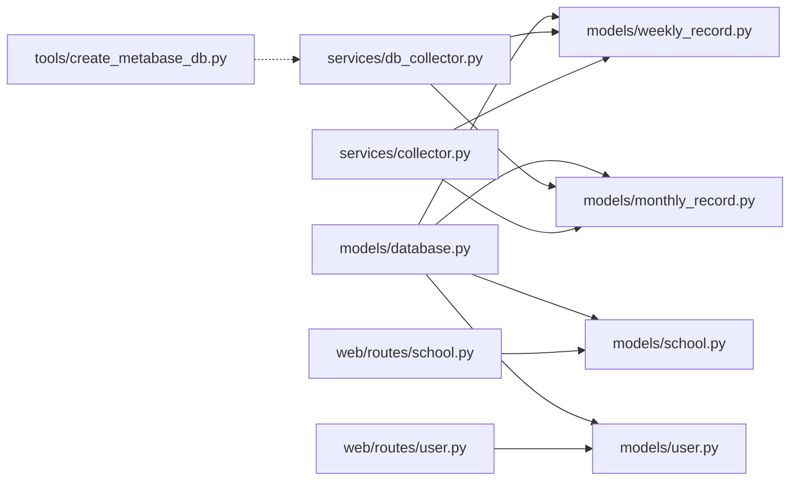

# 数据模型

<cite>
**本文引用的文件**   
- [models/database.py](file://models/database.py)
- [models/school.py](file://models/school.py)
- [models/user.py](file://models/user.py)
- [models/weekly_record.py](file://models/weekly_record.py)
- [models/monthly_record.py](file://models/monthly_record.py)
- [services/db_collector.py](file://services/db_collector.py)
- [services/collector.py](file://services/collector.py)
- [web/routes/school.py](file://web/routes/school.py)
- [web/routes/user.py](file://web/routes/user.py)
- [tools/create_metabase_db.py](file://tools/create_metabase_db.py)
</cite>

## 目录
1. [简介](#简介)
2. [项目结构](#项目结构)
3. [核心组件](#核心组件)
4. [架构总览](#架构总览)
5. [详细组件分析](#详细组件分析)
6. [依赖关系分析](#依赖关系分析)
7. [性能与优化](#性能与优化)
8. [故障排查指南](#故障排查指南)
9. [结论](#结论)
10. [附录：数据库维护与备份恢复](#附录数据库维护与备份恢复)

## 简介
本文件聚焦于数据模型层，系统性阐述 SQLite 的连接管理、迁移机制、表结构与索引策略；深入解析学校（School）、用户（User）、周记录（WeeklyRecord）、月记录（MonthlyRecord）等实体的字段约束、业务规则与查询模式；说明实体间关系映射与完整性保证；并提供数据访问最佳实践、缓存策略、批量操作优化建议以及数据库维护与备份恢复的操作指南。

## 项目结构
数据模型位于 models 目录下，包含连接与初始化、各实体模型；采集服务通过 services 调用模型进行读写；Web 路由在 web/routes 下对模型进行封装暴露 API；工具脚本 tools 提供辅助能力（如创建 Metabase 空库）。

图表来源
- [models/database.py:202-372](file://models/database.py#L202-L372)
- [models/school.py:1-165](file://models/school.py#L1-L165)
- [models/user.py:1-113](file://models/user.py#L1-L113)
- [models/weekly_record.py:1-163](file://models/weekly_record.py#L1-L163)
- [models/monthly_record.py:1-200](file://models/monthly_record.py#L1-L200)
- [services/db_collector.py:253-331](file://services/db_collector.py#L253-L331)
- [services/collector.py:781-803](file://services/collector.py#L781-L803)
- [web/routes/school.py:125-154](file://web/routes/school.py#L125-L154)
- [web/routes/user.py:47-114](file://web/routes/user.py#L47-L114)
- [tools/create_metabase_db.py:1-43](file://tools/create_metabase_db.py#L1-L43)

章节来源
- [models/database.py:202-372](file://models/database.py#L202-L372)
- [models/school.py:1-165](file://models/school.py#L1-L165)
- [models/user.py:1-113](file://models/user.py#L1-L113)
- [models/weekly_record.py:1-163](file://models/weekly_record.py#L1-L163)
- [models/monthly_record.py:1-200](file://models/monthly_record.py#L1-L200)
- [services/db_collector.py:253-331](file://services/db_collector.py#L253-L331)
- [services/collector.py:781-803](file://services/collector.py#L781-L803)
- [web/routes/school.py:125-154](file://web/routes/school.py#L125-L154)
- [web/routes/user.py:47-114](file://web/routes/user.py#L47-L114)
- [tools/create_metabase_db.py:1-43](file://tools/create_metabase_db.py#L1-L43)

## 核心组件
- 连接与迁移：统一通过上下文管理器获取连接，启用 WAL 与外键约束，并在每次连接时执行增量迁移与列添加逻辑，确保版本演进兼容。
- 实体模型：使用 dataclass 定义轻量对象，封装保存、删除、查询等方法，内部直接调用 get_connection 执行 SQL。
- 时间序列记录：周/月记录以“学校+年份+周期标识”为唯一键，采用 UPSERT 语义避免重复写入并支持幂等更新。
- 数据来源标记：记录包含 data_source 字段，区分 grafana 与 database 两种采集路径。

章节来源
- [models/database.py:24-48](file://models/database.py#L24-L48)
- [models/database.py:90-137](file://models/database.py#L90-L137)
- [models/database.py:301-362](file://models/database.py#L301-L362)
- [models/weekly_record.py:32-68](file://models/weekly_record.py#L32-L68)
- [models/monthly_record.py:47-100](file://models/monthly_record.py#L47-L100)

## 架构总览
下图展示从 Web 请求到数据落库的关键路径，包括学校与用户的增删改查，以及周/月记录的采集与持久化。

图表来源
- [web/routes/school.py:125-154](file://web/routes/school.py#L125-L154)
- [web/routes/user.py:47-114](file://web/routes/user.py#L47-L114)
- [models/school.py:28-75](file://models/school.py#L28-L75)
- [models/user.py:41-48](file://models/user.py#L41-L48)
- [models/weekly_record.py:32-68](file://models/weekly_record.py#L32-L68)
- [models/monthly_record.py:47-100](file://models/monthly_record.py#L47-L100)
- [services/collector.py:781-803](file://services/collector.py#L781-L803)
- [services/db_collector.py:253-331](file://services/db_collector.py#L253-L331)

## 详细组件分析

### 连接管理与迁移机制
- 连接上下文：统一通过 get_connection 获取连接，设置 row_factory 为 Row，启用 WAL 日志模式与外键约束，自动提交或回滚，确保异常安全。
- 增量迁移：
  - 首次启动时 init_db 会创建所有表（若不存在），并对已有表执行“缺失列添加”的增量迁移，例如为 weekly_records、monthly_records 添加 platform_elapsed、data_source；为 schools 添加 owner_id、metabase_school_id、display_name、type 等。
  - _migrate_if_needed 处理历史类型变更：将 week_number 由 INTEGER 迁移为 TEXT，并对 collect_tasks 做同构迁移。
  - 连接建立后还会检查并补齐 platform_elapsed 列，保障旧库平滑升级。
- 默认数据：
  - 若 users 为空，则创建默认管理员账户。
  - 若 schools 为空，尝试从 config.yaml 导入初始学校配置。

图表来源
- [models/database.py:24-48](file://models/database.py#L24-L48)
- [models/database.py:90-137](file://models/database.py#L90-L137)
- [models/database.py:301-362](file://models/database.py#L301-L362)

章节来源
- [models/database.py:24-48](file://models/database.py#L24-L48)
- [models/database.py:90-137](file://models/database.py#L90-L137)
- [models/database.py:202-372](file://models/database.py#L202-L372)

### 表结构与字段约束
- weekly_records：唯一键 (school_name, year, week_number)，用于去重与 UPSERT；包含采集时间、状态、错误信息、平台耗时、数据来源等。
- monthly_records：唯一键 (school_name, year, month_number)；涵盖多平台指标与活跃度统计。
- schools：name 唯一；包含多平台名称映射、学段/年级/学部/校区、排序、创建者、显示名、类型等。
- users：username 唯一；包含密码与各平台凭证、分配学校、管理员标志、时间戳。
- collect_tasks：任务调度与汇总信息（非本次重点）。

图表来源
- [models/database.py:202-372](file://models/database.py#L202-L372)

章节来源
- [models/database.py:202-372](file://models/database.py#L202-L372)

### 学校（School）模型：CRUD、约束与校验
- 字段与约束：name 唯一；display_name 可缺省但保存时回退为 name；type 用于区分直营/托管校；owner_id 记录创建者；sort_order 控制排序。
- CRUD 行为：
  - save：根据是否存在 id 决定 UPDATE 或 INSERT；INSERT 时使用 ON CONFLICT(name) DO UPDATE 实现幂等更新。
  - delete：按 id 删除。
  - get_all/get_by_owner/get_by_name/get_by_id/get_by_type：多种查询入口，均按 sort_order、name 排序以保证稳定输出。
- 业务规则：
  - 前端表单强制要求 name、grafana_name、main_site_name 必填（见模板校验）。
  - 删除权限受路由层限制：仅管理员或拥有该学校的用户可删除。

图表来源
- [models/school.py:1-165](file://models/school.py#L1-L165)
- [web/routes/school.py:125-154](file://web/routes/school.py#L125-L154)

章节来源
- [models/school.py:28-75](file://models/school.py#L28-L75)
- [models/school.py:82-165](file://models/school.py#L82-L165)
- [web/routes/school.py:125-154](file://web/routes/school.py#L125-L154)

### 用户（User）模型：安全设计与权限
- 字段与约束：username 唯一；password 明文存储（当前实现未哈希）；is_admin 布尔型；assigned_schools 文本，逗号/中文分隔。
- 认证与权限：
  - authenticate：按用户名查找并比对明文密码。
  - to_dict：默认不返回敏感字段，可按需包含。
  - 路由层对用户修改接口实施鉴权：普通用户只能修改自身凭证，管理员可修改任意用户。
- 安全建议（改进方向）：
  - 引入密码哈希（如 bcrypt/scrypt）与加盐存储。
  - 对敏感字段（密码、第三方平台账号）加密存储。
  - 增加登录会话令牌与过期策略，避免仅凭内存 session 维持状态。

图表来源
- [models/user.py:1-113](file://models/user.py#L1-L113)
- [web/routes/user.py:47-114](file://web/routes/user.py#L47-L114)

章节来源
- [models/user.py:41-77](file://models/user.py#L41-L77)
- [models/user.py:95-113](file://models/user.py#L95-L113)
- [web/routes/user.py:47-114](file://web/routes/user.py#L47-L114)

### 周记录（WeeklyRecord）：数据结构与时间序列策略
- 唯一键：(school_name, year, week_number)。
- 关键字段：week_start_date/week_end_date、整体使用率、集备指标、作业次数、活跃教师数、总体活跃度、采集时间、状态、错误信息、平台耗时、数据来源。
- 写入策略：UPSERT，冲突时覆盖指标与元数据，保持幂等。
- 查询模式：精确查询、灵活条件（支持月份前缀模糊匹配）、最近 N 条、最近 N 天、去重周标签。

图表来源
- [models/weekly_record.py:32-68](file://models/weekly_record.py#L32-L68)
- [models/weekly_record.py:70-134](file://models/weekly_record.py#L70-L134)

章节来源
- [models/weekly_record.py:1-163](file://models/weekly_record.py#L1-L163)

### 月记录（MonthlyRecord）：数据结构与时间序列策略
- 唯一键：(school_name, year, month_number)。
- 关键字段：平台使用率分段、集备模块分段、组卷模块分段、作业次数、日/周/月活跃度、采集时间、状态、错误信息、平台耗时、数据来源。
- 写入策略：UPSERT，与周记录一致。
- 查询模式：精确查询、灵活条件、最近 N 条、最近 N 天、去重月标签。

图表来源
- [models/monthly_record.py:47-100](file://models/monthly_record.py#L47-L100)
- [models/monthly_record.py:102-163](file://models/monthly_record.py#L102-L163)

章节来源
- [models/monthly_record.py:1-200](file://models/monthly_record.py#L1-L200)

### 数据采集与落库流程（数据库模式）
- db_collector 从 Metabase 库读取聚合后的指标，计算活跃度，构造 WeeklyRecord/MonthlyRecord 并调用 save 落库，同时标记 data_source="database"。
- collector 在 Grafana/主站模式下也会填充 platform_elapsed 与 data_source，再调用 save。

图表来源
- [services/db_collector.py:253-331](file://services/db_collector.py#L253-L331)
- [services/collector.py:781-803](file://services/collector.py#L781-L803)

章节来源
- [services/db_collector.py:253-331](file://services/db_collector.py#L253-L331)
- [services/collector.py:781-803](file://services/collector.py#L781-L803)

## 依赖关系分析
- 模型层依赖 database.get_connection 作为唯一数据访问入口，保证连接参数与迁移逻辑集中管理。
- 服务层依赖模型层进行数据持久化，屏蔽底层 SQL 细节。
- Web 路由层对模型进行薄封装，负责鉴权与输入校验。
- 工具脚本 create_metabase_db.py 独立创建外部 Metabase 库结构，供 db_collector 读取。

图表来源
- [models/database.py:24-48](file://models/database.py#L24-L48)
- [models/school.py:1-165](file://models/school.py#L1-L165)
- [models/user.py:1-113](file://models/user.py#L1-L113)
- [models/weekly_record.py:1-163](file://models/weekly_record.py#L1-L163)
- [models/monthly_record.py:1-200](file://models/monthly_record.py#L1-L200)
- [services/db_collector.py:253-331](file://services/db_collector.py#L253-L331)
- [services/collector.py:781-803](file://services/collector.py#L781-L803)
- [web/routes/school.py:125-154](file://web/routes/school.py#L125-L154)
- [web/routes/user.py:47-114](file://web/routes/user.py#L47-L114)
- [tools/create_metabase_db.py:1-43](file://tools/create_metabase_db.py#L1-L43)

章节来源
- [models/database.py:24-48](file://models/database.py#L24-L48)
- [models/school.py:1-165](file://models/school.py#L1-L165)
- [models/user.py:1-113](file://models/user.py#L1-L113)
- [models/weekly_record.py:1-163](file://models/weekly_record.py#L1-L163)
- [models/monthly_record.py:1-200](file://models/monthly_record.py#L1-L200)
- [services/db_collector.py:253-331](file://services/db_collector.py#L253-L331)
- [services/collector.py:781-803](file://services/collector.py#L781-L803)
- [web/routes/school.py:125-154](file://web/routes/school.py#L125-L154)
- [web/routes/user.py:47-114](file://web/routes/user.py#L47-L114)
- [tools/create_metabase_db.py:1-43](file://tools/create_metabase_db.py#L1-L43)

## 性能与优化
- 连接与事务
  - 使用上下文管理器包裹单次业务事务，减少长事务与锁竞争。
  - 批量写入建议合并多条 SQL 或使用 executemany，降低往返开销。
- 索引与查询
  - 现有唯一键已提供基础索引；针对高频查询可考虑：
    - weekly_records(collected_at)、monthly_records(collected_at) 以加速“最近N条/最近N天”查询。
    - weekly_records(school_name, year, week_number) 已存在，无需额外索引。
    - monthly_records(school_name, year, month_number) 已存在，无需额外索引。
    - schools(sort_order, name) 已在查询中显式 ORDER BY，可考虑复合索引提升排序性能。
- 并发与一致性
  - WAL 模式提升读并发；写并发仍受限于 SQLite 单写者特性，应避免长时间独占写锁。
- 数据体积与归档
  - 定期归档历史周/月记录至冷存储，保留热数据窗口（如近一年）。
- 外部库查询
  - Metabase 库查询尽量利用其已有索引（见工具脚本中的索引定义），避免全表扫描。

[本节为通用性能建议，不直接分析具体代码文件]

## 故障排查指南
- 常见异常
  - 唯一键冲突：UPSERT 已处理，但若业务逻辑误用可能导致覆盖预期外的字段，请核对 save 的冲突更新字段清单。
  - 迁移失败：init_db 的增量迁移会在异常时回滚，检查日志定位 ALTER TABLE 失败原因（如列已存在、类型不兼容）。
  - 外键约束：当前未对外键进行物理约束（schools 与记录表之间无 FK），数据一致性依赖应用层保证。
- 诊断步骤
  - 确认 app.db 所在目录存在且可写。
  - 检查 PRAGMA foreign_keys=ON 是否生效。
  - 查看最近一次迁移是否成功（关注新增列是否补齐）。
  - 对于采集失败，检查 data_source 与 platform_elapsed 字段是否正确填充。

章节来源
- [models/database.py:24-48](file://models/database.py#L24-L48)
- [models/database.py:301-362](file://models/database.py#L301-L362)
- [models/weekly_record.py:32-68](file://models/weekly_record.py#L32-L68)
- [models/monthly_record.py:47-100](file://models/monthly_record.py#L47-L100)

## 结论
数据模型层以统一的连接与迁移机制为基础，围绕学校、用户、周/月记录等核心实体构建了清晰的 CRUD 与查询能力。通过唯一键与 UPSERT 实现幂等写入，结合数据来源标记与平台耗时记录，便于追踪与排障。建议在安全性（密码哈希、凭证加密）、索引优化、批量写入与数据归档方面持续改进，以提升系统稳定性与性能。

[本节为总结性内容，不直接分析具体代码文件]

## 附录：数据库维护与备份恢复
- 备份
  - 直接复制 data/app.db 文件进行冷备；WAL 模式下建议同时备份 app.db-wal 与 app.db-shm（如有）。
  - 可使用 sqlite3 .backup 命令在线备份（需最小化写负载）。
- 恢复
  - 停止服务后替换 app.db，重启应用；确保 data 目录权限正确。
- 清理与归档
  - 对历史周/月记录按年份/月份导出 CSV 后删除旧数据，释放空间。
  - 定期 VACUUM 整理碎片（低峰期执行）。
- 外部库维护
  - 使用 tools/create_metabase_db.py 重建空的 Metabase 库结构，确保索引齐全后再导入数据。

章节来源
- [tools/create_metabase_db.py:1-43](file://tools/create_metabase_db.py#L1-L43)