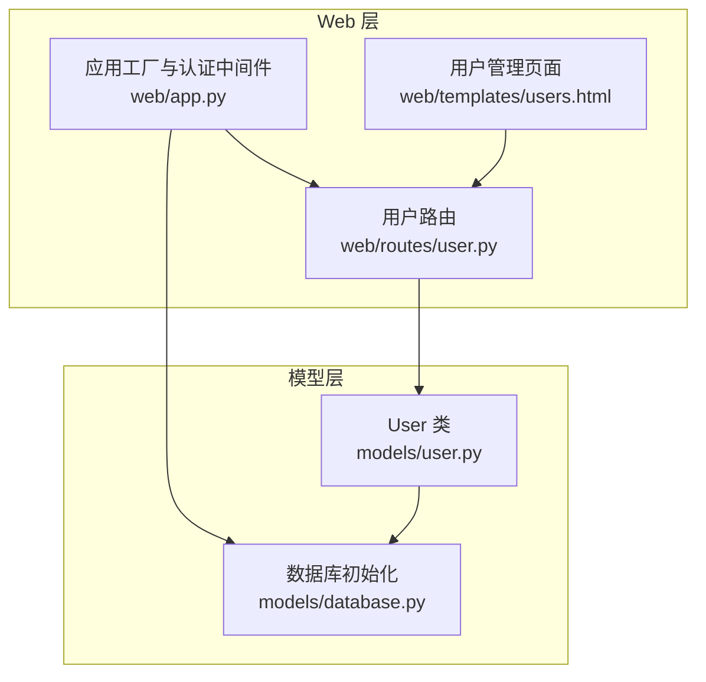
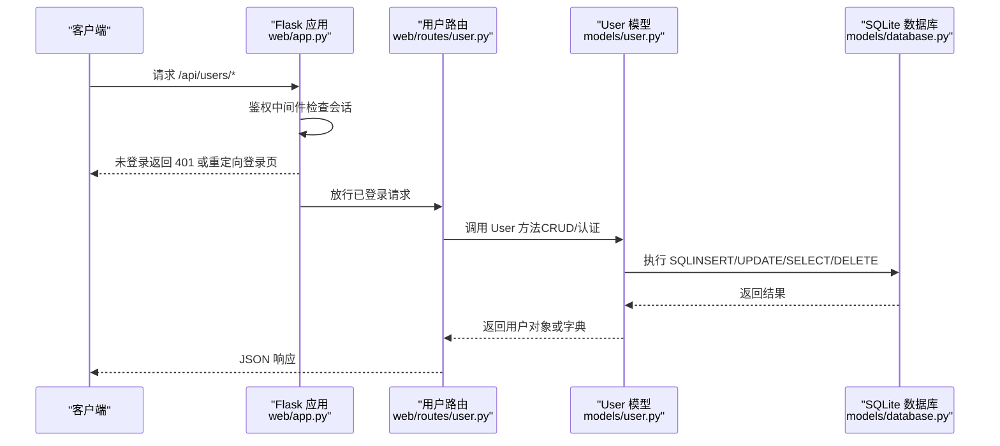
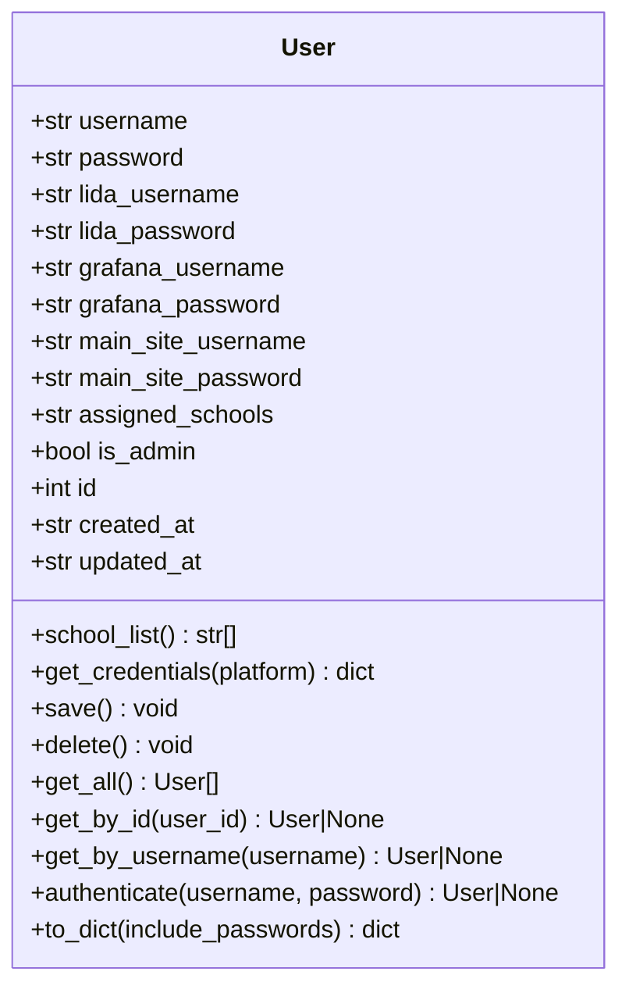
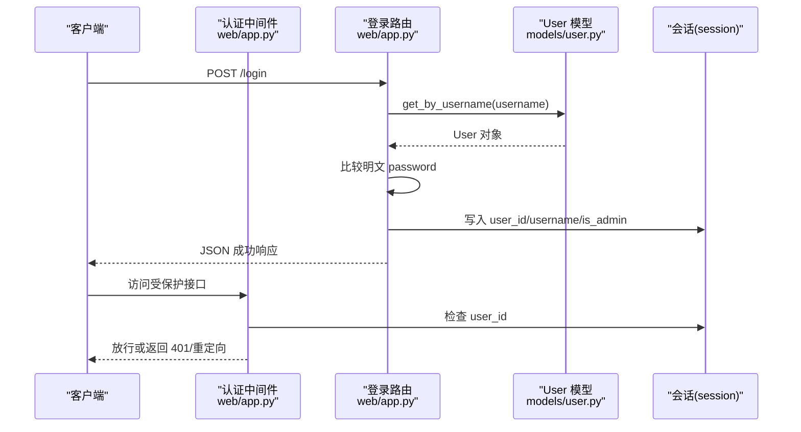
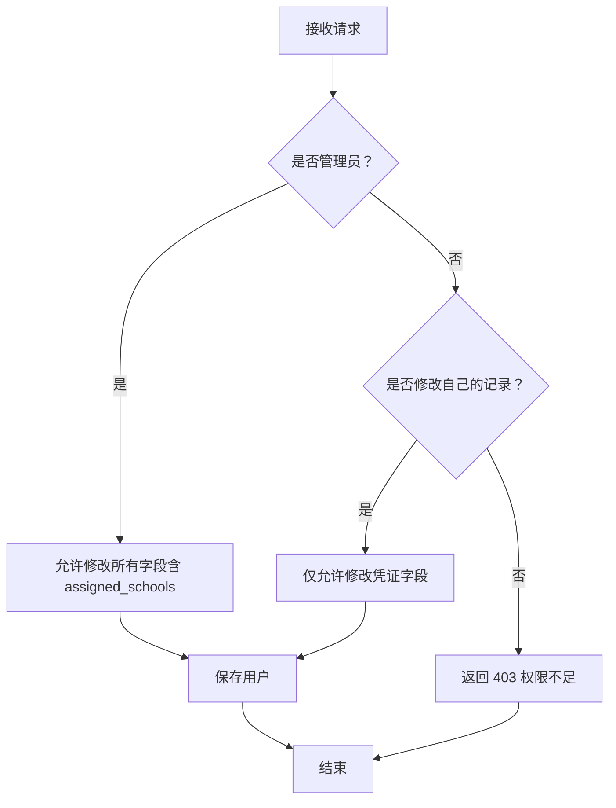
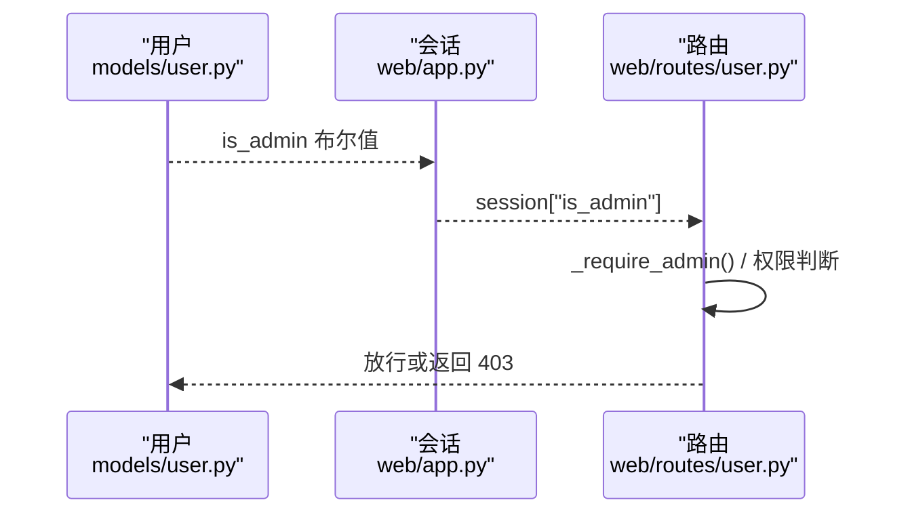
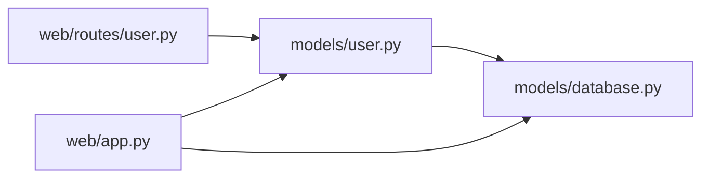

# 用户模型

<cite>
**本文引用的文件**
- [models/user.py](file://models/user.py)
- [models/database.py](file://models/database.py)
- [web/app.py](file://web/app.py)
- [web/routes/user.py](file://web/routes/user.py)
- [web/templates/users.html](file://web/templates/users.html)
</cite>

## 目录
1. [简介](#简介)
2. [项目结构](#项目结构)
3. [核心组件](#核心组件)
4. [架构总览](#架构总览)
5. [详细组件分析](#详细组件分析)
6. [依赖关系分析](#依赖关系分析)
7. [性能考量](#性能考量)
8. [故障排查指南](#故障排查指南)
9. [结论](#结论)
10. [附录](#附录)

## 简介
本文件面向“用户模型”的安全数据模型进行系统化文档化，重点覆盖以下方面：
- User 类的安全设计架构：密码明文存储、权限级别控制、会话管理机制
- 认证字段（username、password）的安全处理流程
- 多平台凭证管理设计（lida/grafana/main_site 的用户名/密码）的存储策略与安全考虑
- assigned_schools 字段的用户资源分配机制与访问控制逻辑
- is_admin 管理员权限的判断与执行流程
- 用户 CRUD 操作的安全验证、密码更新机制、权限继承规则
- 用户管理与安全配置的最佳实践建议

## 项目结构
围绕用户模型的关键文件组织如下：
- models/user.py：定义 User 数据类与数据库持久化方法
- models/database.py：数据库初始化、表结构与默认管理员创建
- web/app.py：Flask 应用工厂、认证中间件与会话管理
- web/routes/user.py：用户管理 API（CRUD、批量导入等）
- web/templates/users.html：前端用户管理界面（含密码可见性切换）

图表来源
- [models/user.py:1-113](file://models/user.py#L1-L113)
- [models/database.py:201-372](file://models/database.py#L201-L372)
- [web/app.py:253-337](file://web/app.py#L253-L337)
- [web/routes/user.py:1-356](file://web/routes/user.py#L1-L356)
- [web/templates/users.html:198-229](file://web/templates/users.html#L198-L229)

章节来源
- [models/user.py:1-113](file://models/user.py#L1-L113)
- [models/database.py:201-372](file://models/database.py#L201-L372)
- [web/app.py:253-337](file://web/app.py#L253-L337)
- [web/routes/user.py:1-356](file://web/routes/user.py#L1-L356)
- [web/templates/users.html:198-229](file://web/templates/users.html#L198-L229)

## 核心组件
- User 类：封装用户实体、认证、凭证获取、持久化与查询
- 数据库初始化：创建 users 表、默认管理员、增量迁移
- 认证中间件：统一鉴权拦截、会话注入
- 用户路由：用户 CRUD、批量导入、权限校验
- 前端模板：密码可见性切换、用户管理界面

章节来源
- [models/user.py:9-113](file://models/user.py#L9-L113)
- [models/database.py:284-372](file://models/database.py#L284-L372)
- [web/app.py:253-337](file://web/app.py#L253-L337)
- [web/routes/user.py:15-135](file://web/routes/user.py#L15-L135)

## 架构总览
用户模型的整体安全架构由“认证中间件 + 用户模型 + 路由权限 + 数据库约束”构成，形成从入口到持久化的闭环。

图表来源
- [web/app.py:256-293](file://web/app.py#L256-L293)
- [web/routes/user.py:21-135](file://web/routes/user.py#L21-L135)
- [models/user.py:41-93](file://models/user.py#L41-L93)
- [models/database.py:24-48](file://models/database.py#L24-L48)

## 详细组件分析

### User 类安全设计与实现
- 字段设计
  - 认证字段：username、password（均为字符串）
  - 多平台凭证：lida_username/lida_password、grafana_username/grafana_password、main_site_username/main_site_password
  - 资源分配：assigned_schools（逗号/中文顿号/顿号分隔的字符串）
  - 权限标识：is_admin（布尔值）
  - 时间戳：created_at、updated_at
- 认证流程
  - authenticate(username, password)：按用户名查询用户，比较明文密码后返回用户对象
- 凭证获取
  - get_credentials(platform)：根据平台返回对应凭证字典
- 资源解析
  - school_list：将 assigned_schools 解析为列表（支持多种分隔符）
- 持久化
  - save()/delete()：基于 SQLite 的插入/更新/删除
  - 查询：get_all()/get_by_id()/get_by_username()

图表来源
- [models/user.py:9-113](file://models/user.py#L9-L113)

章节来源
- [models/user.py:9-113](file://models/user.py#L9-L113)

### 认证字段（username、password）的安全处理流程
- 登录流程
  - 客户端提交用户名，服务端通过 User.get_by_username() 查找用户
  - 若用户存在，直接比较明文 password，成功则写入 session（user_id、username、is_admin）
- 认证流程
  - 全局 before_request 中对非静态/非登录接口进行会话检查
  - API 接口未登录返回 401，HTML 页面重定向至登录页
- 重要安全现状
  - 明文存储 password，未见任何哈希算法（bcrypt/argon2 等）实现
  - 建议：立即引入密码哈希方案，并在 authenticate 中改为哈希比对

图表来源
- [web/app.py:256-293](file://web/app.py#L256-L293)
- [web/app.py:271-287](file://web/app.py#L271-L287)
- [models/user.py:67-77](file://models/user.py#L67-L77)

章节来源
- [web/app.py:256-293](file://web/app.py#L256-L293)
- [web/app.py:271-287](file://web/app.py#L271-L287)
- [models/user.py:67-77](file://models/user.py#L67-L77)

### 多平台凭证管理设计（lida/grafana/main_site）
- 存储策略
  - 每个平台一组用户名/密码字段，均以明文存储于 users 表
  - get_credentials(platform) 提供按平台获取凭证的统一接口
- 安全考虑
  - 明文存储敏感凭据，风险极高
  - 建议：采用加密存储（如 Fernet/密钥库），并在运行时解密使用；或引入外部密钥管理系统（如 HashiCorp Vault）
  - 建议：最小暴露原则，仅在必要时返回凭证；前端可保留“密码可见性切换”，但后台仍需加密存储

图表来源
- [models/user.py:32-39](file://models/user.py#L32-L39)

章节来源
- [models/user.py:13-18](file://models/user.py#L13-L18)
- [models/user.py:32-39](file://models/user.py#L32-L39)

### assigned_schools 字段的用户资源分配机制与访问控制逻辑
- 存储与解析
  - assigned_schools 为逗号/中文顿号/顿号分隔的字符串
  - school_list 属性将其解析为去空格后的列表
- 访问控制
  - 路由层通过 session 中的 is_admin 判断是否为管理员
  - 管理员可修改任意用户的 assigned_schools；普通用户仅能修改自身凭证
- 建议
  - 可考虑将 assigned_schools 改为外键关联（如 users_schools 关联表），便于更精细的权限与审计
  - 在批量导入场景中，按用户名聚合学校并保存为字符串，需确保输入清洗与唯一性约束

图表来源
- [web/routes/user.py:102-134](file://web/routes/user.py#L102-L134)
- [models/user.py:26-30](file://models/user.py#L26-L30)

章节来源
- [models/user.py:19](file://models/user.py#L19)
- [models/user.py:26-30](file://models/user.py#L26-L30)
- [web/routes/user.py:102-134](file://web/routes/user.py#L102-L134)

### is_admin 管理员权限的判断与执行流程
- 设置来源
  - 登录成功后，session["is_admin"] 由用户对象的 is_admin 字段设置
  - 默认管理员在数据库初始化时创建，is_admin=1
- 使用场景
  - 批量导入模板下载、用户创建/更新/删除均要求管理员权限
  - 普通用户仅能修改自身凭证与密码
- 安全现状
  - 明文存储 password 与凭证，is_admin 为布尔值，未见额外权限矩阵
  - 建议：引入细粒度权限模型（角色+动作+资源），并配合审计日志

图表来源
- [models/database.py:363-372](file://models/database.py#L363-L372)
- [web/app.py:284-287](file://web/app.py#L284-L287)
- [web/routes/user.py:15-18](file://web/routes/user.py#L15-L18)

章节来源
- [models/database.py:363-372](file://models/database.py#L363-L372)
- [web/app.py:284-287](file://web/app.py#L284-L287)
- [web/routes/user.py:15-18](file://web/routes/user.py#L15-L18)

### 用户 CRUD 操作的安全验证与密码更新机制
- 创建用户
  - 需管理员权限；用户名唯一；可选设置 is_admin 与 assigned_schools
- 更新用户
  - 管理员可改所有字段；普通用户仅可改凭证与密码
  - 密码更新为明文替换，建议改为哈希更新
- 删除用户
  - 需管理员权限；禁止删除默认管理员
- 密码更新机制
  - 当前为明文替换；建议引入哈希算法与旧密码校验流程

章节来源
- [web/routes/user.py:71-135](file://web/routes/user.py#L71-L135)
- [models/user.py:41-48](file://models/user.py#L41-L48)

### 权限继承规则与最佳实践
- 角色继承
  - is_admin 为最高权限；普通用户仅能修改自身凭证与密码
- 最佳实践
  - 引入密码哈希与旧密码校验
  - 加密存储所有敏感凭据
  - 细粒度权限模型（RBAC）
  - 审计日志（创建/更新/删除/登录）
  - 会话安全（HTTPS、Secure/SameSite Cookie、超时与自动登出）

章节来源
- [web/routes/user.py:15-18](file://web/routes/user.py#L15-L18)
- [models/user.py:105-112](file://models/user.py#L105-L112)

## 依赖关系分析
- 组件耦合
  - web/routes/user.py 依赖 models/user.py
  - web/app.py 依赖 models/user.py 进行认证与会话注入
  - models/user.py 依赖 models/database.py 获取数据库连接
- 外部依赖
  - Flask（路由、蓝图、会话）
  - SQLite（本地存储）
  - openpyxl（Excel 导入导出）
- 潜在问题
  - 明文存储 password 与凭证
  - 缺少密码复杂度与历史校验
  - 缺少审计与异常回滚的完整日志

图表来源
- [web/routes/user.py:9](file://web/routes/user.py#L9)
- [models/user.py:6](file://models/user.py#L6)
- [web/app.py:313](file://web/app.py#L313)

章节来源
- [web/routes/user.py:9](file://web/routes/user.py#L9)
- [models/user.py:6](file://models/user.py#L6)
- [web/app.py:313](file://web/app.py#L313)

## 性能考量
- 数据库
  - WAL 模式与外键开启提升并发与一致性
  - 增量迁移避免全量重建
- 查询
  - 用户列表按 is_admin 降序排序，有利于管理员优先展示
- 建议
  - 为 username 建唯一索引（已存在）
  - 为频繁查询字段建立索引（如 created_at/updated_at）
  - 批量导入时减少多次 round-trip，合并事务

章节来源
- [models/database.py:24-48](file://models/database.py#L24-L48)
- [models/database.py:284-298](file://models/database.py#L284-L298)
- [models/user.py:55-58](file://models/user.py#L55-L58)

## 故障排查指南
- 登录失败
  - 检查用户名是否存在；确认 password 是否正确（当前为明文匹配）
- 权限不足
  - 确认 session["is_admin"] 是否为真；检查路由权限判断
- 无法访问受保护接口
  - 确认会话是否过期；检查 before_request 鉴权逻辑
- 导入模板下载失败
  - 确认调用 /api/users/import-template 是否为管理员
- 密码可见性切换
  - 前端模板 users.html 提供密码输入框切换功能

章节来源
- [web/app.py:256-293](file://web/app.py#L256-L293)
- [web/routes/user.py:15-18](file://web/routes/user.py#L15-L18)
- [web/templates/users.html:198-229](file://web/templates/users.html#L198-L229)

## 结论
当前用户模型在认证与权限上具备基础能力，但在安全性方面存在显著风险点：
- 明文存储 password 与多平台凭证
- 缺少密码哈希与强口令策略
- 缺少细粒度权限与审计日志
建议尽快引入密码哈希、加密存储、RBAC 权限模型与审计体系，以满足生产环境的安全要求。

## 附录
- 安全配置清单
  - 启用 HTTPS 与安全 Cookie
  - 限制会话超时与自动登出
  - 引入密码哈希与旧密码校验
  - 加密存储敏感凭据
  - 实施 RBAC 权限模型
  - 记录审计日志（登录/操作/变更）
  - 输入校验与最小暴露原则