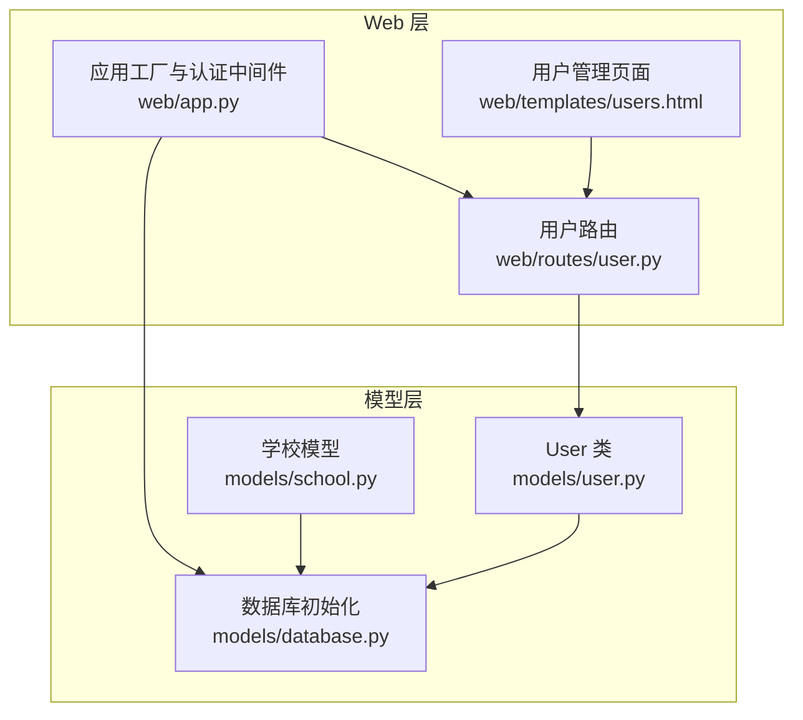
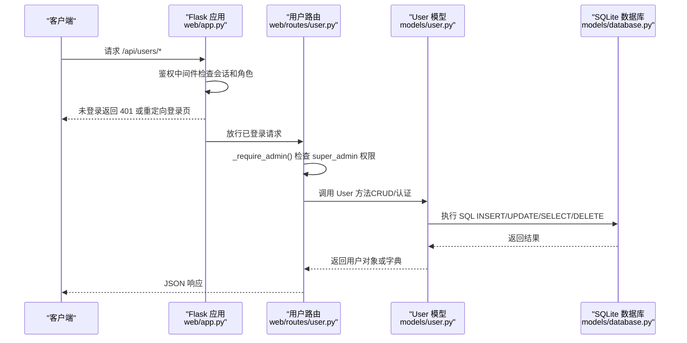
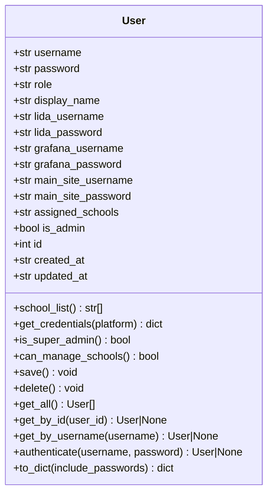
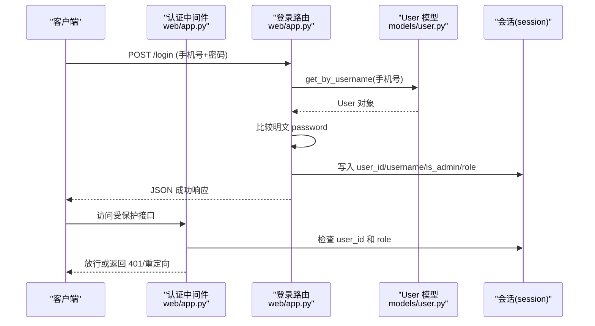
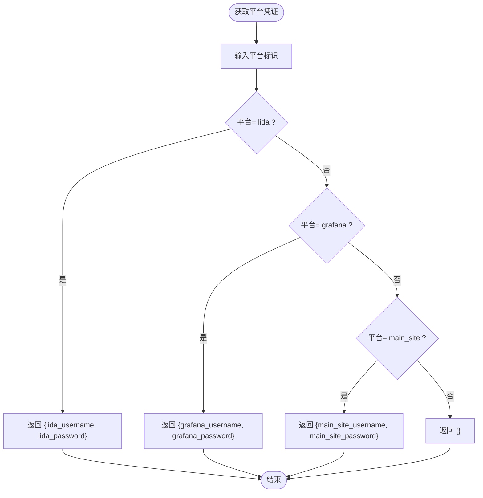
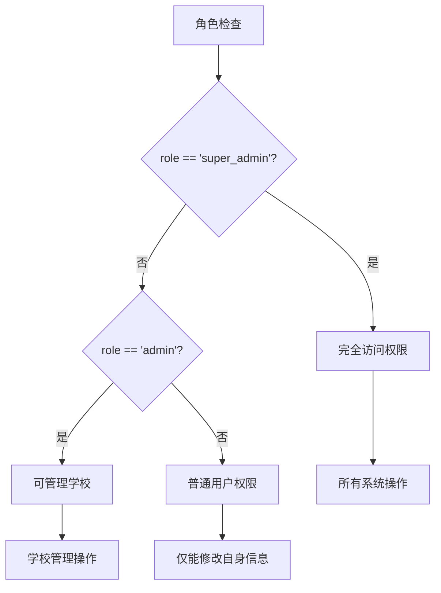
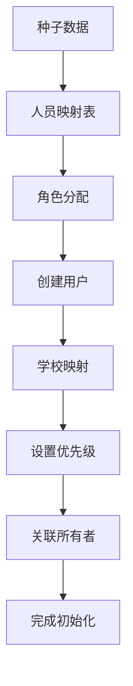
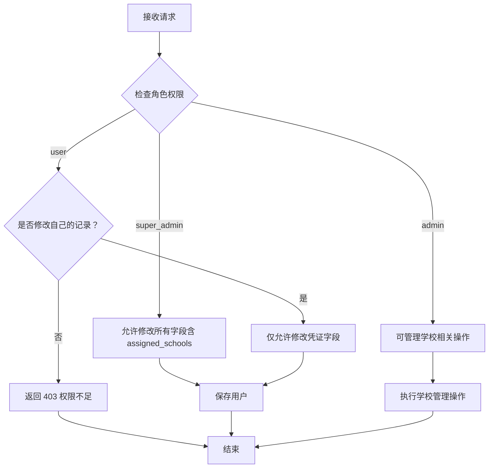
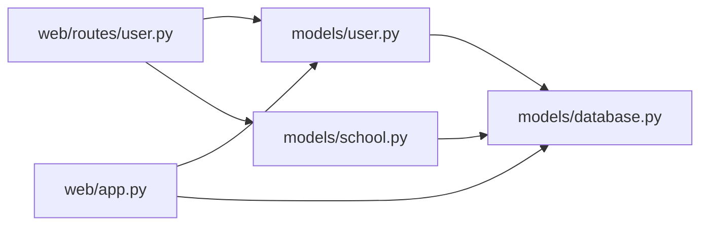

# 用户模型

<cite>
**本文引用的文件**
- [models/user.py](file://models/user.py)
- [models/database.py](file://models/database.py)
- [models/school.py](file://models/school.py)
- [web/app.py](file://web/app.py)
- [web/routes/user.py](file://web/routes/user.py)
- [web/templates/users.html](file://web/templates/users.html)
</cite>

## 更新摘要
**所做更改**
- 新增角色权限系统（super_admin、admin、user）替代简单的布尔管理员标志
- 添加显示名称字段支持，提升用户体验
- 实现学校优先级管理（高/中/低）和自动种子数据导入
- 增强用户资源分配机制，支持更精细的访问控制
- 改进认证中间件以支持新的角色系统

## 目录
1. [简介](#简介)
2. [项目结构](#项目结构)
3. [核心组件](#核心组件)
4. [架构总览](#架构总览)
5. [详细组件分析](#详细组件分析)
6. [依赖关系分析](#依赖关系分析)
7. [性能考量](#性能考量)
8. [故障排查指南](#故障排查指南)
9. [结论](#结论)
10. [附录](#附录)

## 简介
本文件面向"用户模型"的安全数据模型进行系统化文档化，重点覆盖以下方面：
- User 类的安全设计架构：密码明文存储、**三级角色权限控制**、会话管理机制
- 认证字段（username、password）的安全处理流程
- 多平台凭证管理设计（lida/grafana/main_site 的用户名/密码）的存储策略与安全考虑
- assigned_schools 字段的用户资源分配机制与访问控制逻辑
- **新增角色系统**：super_admin、admin、user 三级权限判断与执行流程
- **显示名称支持**：display_name 字段的用户友好展示机制
- **学校优先级管理**：高/中/低优先级的资源分配策略
- **自动种子数据导入**：首次启动时的用户和学校初始化流程
- 用户 CRUD 操作的安全验证、密码更新机制、权限继承规则
- 用户管理与安全配置的最佳实践建议

## 项目结构
围绕用户模型的关键文件组织如下：
- models/user.py：定义 User 数据类与数据库持久化方法，**新增角色和显示名称支持**
- models/database.py：数据库初始化、表结构与**自动种子用户创建**
- models/school.py：学校模型，**新增优先级和管理员关联**
- web/app.py：Flask 应用工厂、认证中间件与会话管理，**支持角色权限检查**
- web/routes/user.py：用户管理 API（CRUD、批量导入等），**增强权限控制**
- web/templates/users.html：前端用户管理界面，**显示角色信息和优化界面**

**图表来源**
- [models/user.py:1-126](file://models/user.py#L1-L126)
- [models/database.py:284-479](file://models/database.py#L284-L479)
- [models/school.py:1-170](file://models/school.py#L1-L170)
- [web/app.py:265-346](file://web/app.py#L265-L346)
- [web/routes/user.py:1-356](file://web/routes/user.py#L1-L356)
- [web/templates/users.html:1-400](file://web/templates/users.html#L1-L400)

## 核心组件
- **增强的 User 类**：封装用户实体、认证、凭证获取、持久化与查询，**支持三级角色权限**
- **数据库初始化**：创建 users 表、**自动种子用户创建**、增量迁移
- **认证中间件**：统一鉴权拦截、**角色权限检查**、会话注入
- **用户路由**：用户 CRUD、批量导入、**基于角色的权限校验**
- **学校模型**：**支持优先级管理和所有者关联**
- **前端模板**：密码可见性切换、**角色信息显示**、用户管理界面

**章节来源**
- [models/user.py:9-126](file://models/user.py#L9-L126)
- [models/database.py:284-479](file://models/database.py#L284-L479)
- [models/school.py:9-170](file://models/school.py#L9-L170)
- [web/app.py:265-346](file://web/app.py#L265-L346)
- [web/routes/user.py:15-356](file://web/routes/user.py#L15-L356)

## 架构总览
用户模型的整体安全架构由"认证中间件 + 用户模型 + 路由权限 + 数据库约束"构成，形成从入口到持久化的闭环。**新增的角色系统提供了更细粒度的权限控制**。

**图表来源**
- [web/app.py:268-306](file://web/app.py#L268-L306)
- [web/routes/user.py:15-18](file://web/routes/user.py#L15-L18)
- [models/user.py:83-87](file://models/user.py#L83-L87)
- [models/database.py:284-383](file://models/database.py#L284-L383)

## 详细组件分析

### User 类安全设计与实现
- **字段设计**
  - 认证字段：username、password（均为字符串）
  - **新增字段**：role（super_admin/admin/user）、display_name（真实姓名）
  - 多平台凭证：lida_username/lida_password、grafana_username/grafana_password、main_site_username/main_site_password
  - 资源分配：assigned_schools（逗号/中文顿号/顿号分隔的字符串）
  - 权限标识：is_admin（布尔值，向后兼容）
  - 时间戳：created_at、updated_at
- **认证流程**
  - authenticate(username, password)：按用户名查询用户，比较明文密码后返回用户对象
- **凭证获取**
  - get_credentials(platform)：根据平台返回对应凭证字典
- **资源解析**
  - school_list：将 assigned_schools 解析为列表（支持多种分隔符）
- **权限属性**
  - is_super_admin：检查是否为超级管理员
  - can_manage_schools：检查是否有权管理学校（super_admin 或 admin）
- **持久化**
  - save()/delete()：基于 SQLite 的插入/更新/删除，**支持新字段**
  - 查询：get_all()/get_by_id()/get_by_username()

**图表来源**
- [models/user.py:9-126](file://models/user.py#L9-L126)

**章节来源**
- [models/user.py:9-126](file://models/user.py#L9-L126)

### 认证字段（username、password）的安全处理流程
- **登录流程**
  - 客户端提交手机号和密码，服务端通过 User.get_by_username() 查找用户
  - 若用户存在，直接比较明文 password，成功则写入 session（user_id、username、is_admin、**role**）
- **认证流程**
  - 全局 before_request 中对非静态/非登录接口进行会话检查
  - API 接口未登录返回 401，HTML 页面重定向至登录页
- **重要安全现状**
  - 明文存储 password，未见任何哈希算法（bcrypt/argon2 等）实现
  - 建议：立即引入密码哈希方案，并在 authenticate 中改为哈希比对

**图表来源**
- [web/app.py:283-306](file://web/app.py#L283-L306)
- [models/user.py:83-87](file://models/user.py#L83-L87)

**章节来源**
- [web/app.py:283-306](file://web/app.py#L283-L306)
- [models/user.py:83-87](file://models/user.py#L83-L87)

### 多平台凭证管理设计（lida/grafana/main_site）
- **存储策略**
  - 每个平台一组用户名/密码字段，均以明文存储于 users 表
  - get_credentials(platform) 提供按平台获取凭证的统一接口
- **安全考虑**
  - 明文存储敏感凭据，风险极高
  - 建议：采用加密存储（如 Fernet/密钥库），并在运行时解密使用；或引入外部密钥管理系统（如 HashiCorp Vault）
  - 建议：最小暴露原则，仅在必要时返回凭证；前端可保留"密码可见性切换"，但后台仍需加密存储

**图表来源**
- [models/user.py:34-41](file://models/user.py#L34-L41)

**章节来源**
- [models/user.py:13-18](file://models/user.py#L13-L18)
- [models/user.py:34-41](file://models/user.py#L34-L41)

### 新增角色权限系统与显示名称支持
- **角色系统设计**
  - **super_admin**：超级管理员，拥有最高权限
  - **admin**：普通管理员，可以管理学校和用户
  - **user**：普通用户，仅能修改自身凭证
- **显示名称支持**
  - display_name 字段存储用户的真实姓名
  - 在 to_dict() 方法中返回显示名称用于前端展示
  - 改善用户体验，避免直接使用技术性的用户名
- **权限属性**
  - is_super_admin：检查是否为超级管理员
  - can_manage_schools：检查是否有权管理学校

**图表来源**
- [models/user.py:21-22](file://models/user.py#L21-22)
- [models/user.py:44-49](file://models/user.py#L44-L49)

**章节来源**
- [models/user.py:21-22](file://models/user.py#L21-22)
- [models/user.py:44-49](file://models/user.py#L44-L49)
- [models/user.py:107-125](file://models/user.py#L107-L125)

### 学校优先级管理与自动种子数据导入
- **学校优先级系统**
  - priority 字段支持高/中/低三个级别
  - 默认优先级为"中"
  - 支持按优先级排序和筛选
- **自动种子数据导入**
  - 首次启动时从预定义数据创建种子用户
  - 根据负责人姓名映射手机号和角色
  - 自动关联用户与学校，设置优先级
- **用户-学校关联**
  - 通过 owner_id 字段关联学校创建者
  - 支持按所有者查询学校列表
  - 结合 assigned_schools 字段实现灵活的资源分配

**图表来源**
- [models/database.py:201-281](file://models/database.py#L201-L281)
- [models/school.py:24-25](file://models/school.py#L24-L25)

**章节来源**
- [models/database.py:201-281](file://models/database.py#L201-L281)
- [models/school.py:24-25](file://models/school.py#L24-L25)
- [models/school.py:95-102](file://models/school.py#L95-L102)

### assigned_schools 字段的用户资源分配机制与访问控制逻辑
- **存储与解析**
  - assigned_schools 为逗号/中文顿号/顿号分隔的字符串
  - school_list 属性将其解析为去空格后的列表
- **访问控制**
  - 路由层通过 session 中的 role 和 is_admin 判断权限
  - **super_admin**：可修改任意用户的 assigned_schools
  - **admin**：可管理学校相关操作
  - **user**：仅能修改自身凭证
- **建议**
  - 可考虑将 assigned_schools 改为外键关联（如 users_schools 关联表），便于更精细的权限与审计
  - 在批量导入场景中，按用户名聚合学校并保存为字符串，需确保输入清洗与唯一性约束

**图表来源**
- [web/routes/user.py:15-18](file://web/routes/user.py#L15-L18)
- [models/user.py:26-32](file://models/user.py#L26-L32)

**章节来源**
- [models/user.py:19](file://models/user.py#L19)
- [models/user.py:26-32](file://models/user.py#L26-L32)
- [web/routes/user.py:15-18](file://web/routes/user.py#L15-L18)

### 用户 CRUD 操作的安全验证与密码更新机制
- **创建用户**
  - 需 super_admin 权限；用户名唯一；可选设置 role 与 assigned_schools
  - **新增**：支持设置 display_name 和 role 字段
- **更新用户**
  - super_admin 可改所有字段；admin 可管理学校相关；普通用户仅可改凭证与密码
  - 密码更新为明文替换，建议改为哈希更新
- **删除用户**
  - 需 super_admin 权限；禁止删除默认管理员
- **密码更新机制**
  - 当前为明文替换；建议引入哈希算法与旧密码校验流程

**章节来源**
- [web/routes/user.py:71-135](file://web/routes/user.py#L71-L135)
- [models/user.py:51-58](file://models/user.py#L51-L58)

### 权限继承规则与最佳实践
- **角色继承**
  - **super_admin**：最高权限，可执行所有操作
  - **admin**：中等权限，可管理学校和用户
  - **user**：基础权限，仅能修改自身信息
- **最佳实践**
  - 引入密码哈希与旧密码校验
  - 加密存储所有敏感凭据
  - 细粒度权限模型（RBAC）
  - 审计日志（创建/更新/删除/登录）
  - 会话安全（HTTPS、Secure/SameSite Cookie、超时与自动登出）

**章节来源**
- [web/routes/user.py:15-18](file://web/routes/user.py#L15-L18)
- [models/user.py:44-49](file://models/user.py#L44-L49)

## 依赖关系分析
- **组件耦合**
  - web/routes/user.py 依赖 models/user.py
  - web/app.py 依赖 models/user.py 进行认证与会话注入
  - models/user.py 依赖 models/database.py 获取数据库连接
  - **新增**：models/school.py 支持学校优先级和所有者管理
- **外部依赖**
  - Flask（路由、蓝图、会话）
  - SQLite（本地存储）
  - openpyxl（Excel 导入导出）
- **潜在问题**
  - 明文存储 password 与凭证
  - 缺少密码复杂度与历史校验
  - 缺少审计与异常回滚的完整日志

**图表来源**
- [web/routes/user.py:9-10](file://web/routes/user.py#L9-L10)
- [models/user.py:6](file://models/user.py#L6)
- [models/school.py:6](file://models/school.py#L6)
- [web/app.py:358-377](file://web/app.py#L358-L377)

**章节来源**
- [web/routes/user.py:9-10](file://web/routes/user.py#L9-L10)
- [models/user.py:6](file://models/user.py#L6)
- [models/school.py:6](file://models/school.py#L6)
- [web/app.py:358-377](file://web/app.py#L358-L377)

## 性能考量
- **数据库**
  - WAL 模式与外键开启提升并发与一致性
  - 增量迁移避免全量重建
- **查询**
  - 用户列表按 is_admin 降序排序，有利于管理员优先展示
  - **新增**：学校查询支持按优先级和所有者过滤
- **建议**
  - 为 username 建唯一索引（已存在）
  - 为频繁查询字段建立索引（如 created_at/updated_at、role、priority）
  - 批量导入时减少多次 round-trip，合并事务

**章节来源**
- [models/database.py:24-48](file://models/database.py#L24-L48)
- [models/database.py:284-298](file://models/database.py#L284-L298)
- [models/user.py:65-68](file://models/user.py#L65-L68)
- [models/school.py:86-92](file://models/school.py#L86-L92)

## 故障排查指南
- **登录失败**
  - 检查用户名是否存在；确认 password 是否正确（当前为明文匹配）
  - **新增**：检查 role 字段是否正确设置
- **权限不足**
  - 确认 session["role"] 和 session["is_admin"] 是否正确；检查路由权限判断
  - **新增**：验证 _require_admin() 函数是否正确检查 super_admin 权限
- **无法访问受保护接口**
  - 确认会话是否过期；检查 before_request 鉴权逻辑
- **导入模板下载失败**
  - 确认调用 /api/users/import-template 是否为 super_admin
- **学校优先级不生效**
  - 检查 schools 表的 priority 字段是否正确设置
  - 验证 _seed_users_from_excel 函数是否正确关联用户和学校
- **密码可见性切换**
  - 前端模板 users.html 提供密码输入框切换功能

**章节来源**
- [web/app.py:268-306](file://web/app.py#L268-L306)
- [web/routes/user.py:15-18](file://web/routes/user.py#L15-L18)
- [models/database.py:201-281](file://models/database.py#L201-L281)
- [web/templates/users.html:220-229](file://web/templates/users.html#L220-L229)

## 结论
当前用户模型在认证与权限上具备显著增强的能力，特别是在**角色权限系统**和**用户体验改进**方面：
- **新增三级角色系统**：super_admin、admin、user 提供更细粒度的权限控制
- **显示名称支持**：提升用户界面的友好性和可读性
- **学校优先级管理**：支持高/中/低优先级的资源分配策略
- **自动种子数据导入**：简化系统初始化和部署流程
- **增强的访问控制**：基于角色的权限检查和资源分配

但在安全性方面仍存在显著风险点：
- 明文存储 password 与多平台凭证
- 缺少密码哈希与强口令策略
- 缺少细粒度权限与审计日志

建议尽快引入密码哈希、加密存储、RBAC 权限模型与审计体系，以满足生产环境的安全要求。

## 附录
- **安全配置清单**
  - 启用 HTTPS 与安全 Cookie
  - 限制会话超时与自动登出
  - 引入密码哈希与旧密码校验
  - 加密存储敏感凭据
  - 实施 RBAC 权限模型
  - 记录审计日志（登录/操作/变更）
  - 输入校验与最小暴露原则
- **角色权限矩阵**
  - **super_admin**：完全系统访问权限
  - **admin**：学校管理、用户管理（受限）
  - **user**：仅个人凭证管理
- **学校优先级说明**
  - **高优先级**：核心业务学校，优先处理和监控
  - **中优先级**：常规运营学校，标准处理流程
  - **低优先级**：测试或次要学校，延迟处理