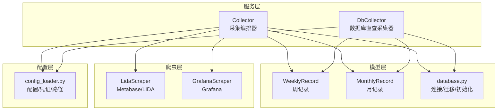
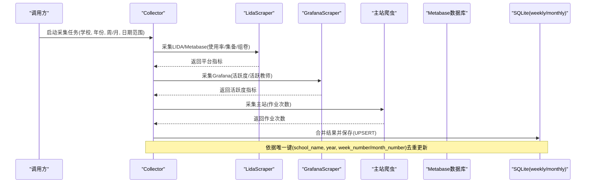
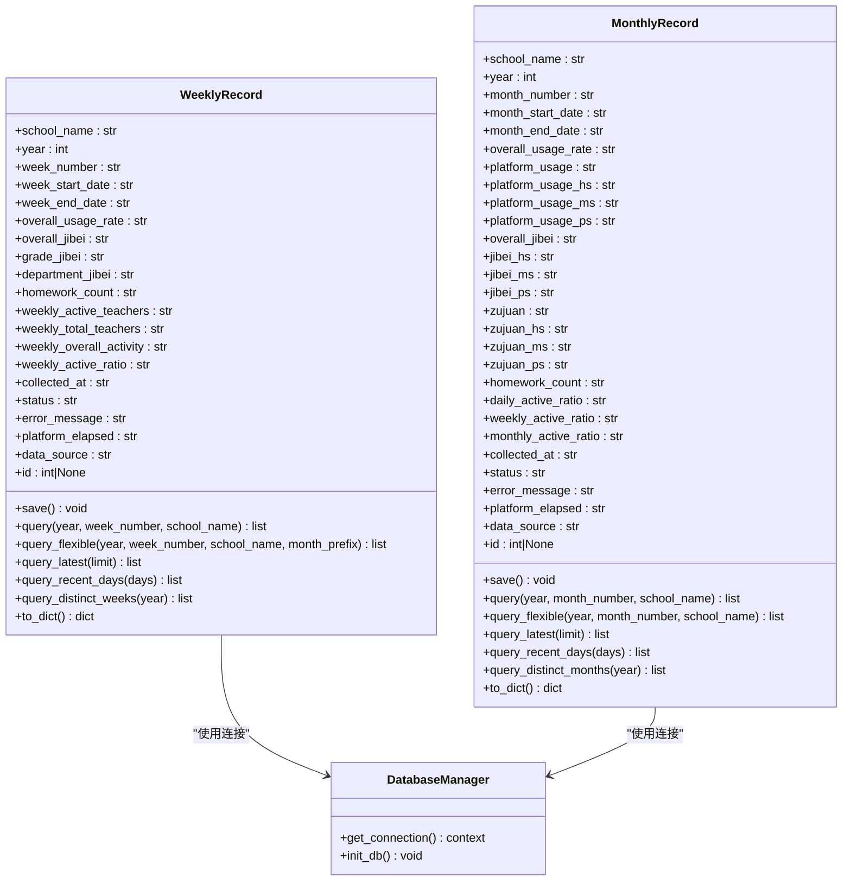
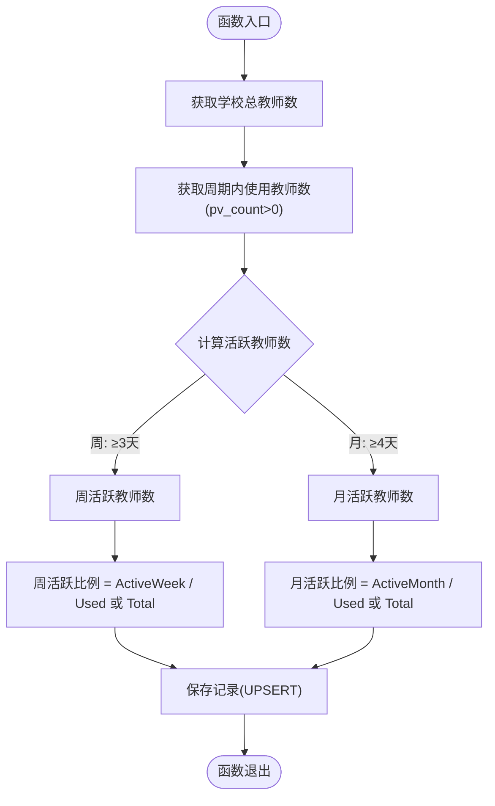
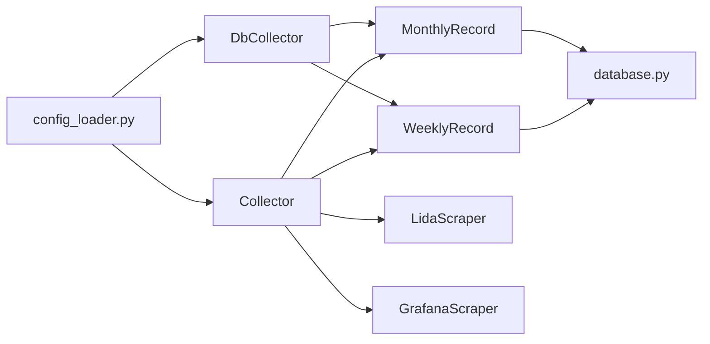

# 记录模型

<cite>
**本文引用的文件**
- [models/weekly_record.py](file://middle-platform-data-collector-master/models/weekly_record.py)
- [models/monthly_record.py](file://middle-platform-data-collector-master/models/monthly_record.py)
- [models/database.py](file://middle-platform-data-collector-master/models/database.py)
- [services/collector.py](file://middle-platform-data-collector-master/services/collector.py)
- [services/db_collector.py](file://middle-platform-data-collector-master/services/db_collector.py)
- [scrapers/lida_scraper.py](file://middle-platform-data-collector-master/scrapers/lida_scraper.py)
- [scrapers/grafana_scraper.py](file://middle-platform-data-collector-master/scrapers/grafana_scraper.py)
- [config/config_loader.py](file://middle-platform-data-collector-master/config/config_loader.py)
</cite>

## 目录
1. [引言](#引言)
2. [项目结构](#项目结构)
3. [核心组件](#核心组件)
4. [架构总览](#架构总览)
5. [详细组件分析](#详细组件分析)
6. [依赖关系分析](#依赖关系分析)
7. [性能考虑](#性能考虑)
8. [故障排查指南](#故障排查指南)
9. [结论](#结论)
10. [附录](#附录)

## 引言
本文件围绕时间序列记录模型，系统性阐述 WeeklyRecord（周记录）与 MonthlyRecord（月记录）的实体设计差异与共性，深入解释数据采集指标字段的设计与计算逻辑，包括使用率、积极性（集备）、活跃度等；说明多平台数据（hs/ms/ps）的聚合策略；定义作业数量、活跃教师数等业务指标的计算口径；详述时间维度字段的管理方式；解释数据来源标识与采集状态管理机制；并给出批量处理、一致性保证、查询优化方案以及数据分析最佳实践与性能调优建议。

## 项目结构
本项目采用“模型-服务-爬虫-配置”的分层组织：
- 模型层：定义周/月记录的数据结构与持久化方法
- 服务层：编排跨平台采集流程，合并结果并落库
- 爬虫层：对接 LIDA/Metabase、Grafana、主站等平台
- 配置层：加载系统配置与凭证

图表来源
- [models/weekly_record.py:1-163](file://middle-platform-data-collector-master/models/weekly_record.py#L1-L163)
- [models/monthly_record.py:1-200](file://middle-platform-data-collector-master/models/monthly_record.py#L1-L200)
- [models/database.py:201-372](file://middle-platform-data-collector-master/models/database.py#L201-L372)
- [services/collector.py:133-862](file://middle-platform-data-collector-master/services/collector.py#L133-L862)
- [services/db_collector.py:91-332](file://middle-platform-data-collector-master/services/db_collector.py#L91-L332)
- [scrapers/lida_scraper.py:1-800](file://middle-platform-data-collector-master/scrapers/lida_scraper.py#L1-L800)
- [scrapers/grafana_scraper.py:1-800](file://middle-platform-data-collector-master/scrapers/grafana_scraper.py#L1-L800)
- [config/config_loader.py:1-147](file://middle-platform-data-collector-master/config/config_loader.py#L1-L147)

章节来源
- [models/weekly_record.py:1-163](file://middle-platform-data-collector-master/models/weekly_record.py#L1-L163)
- [models/monthly_record.py:1-200](file://middle-platform-data-collector-master/models/monthly_record.py#L1-L200)
- [models/database.py:201-372](file://middle-platform-data-collector-master/models/database.py#L201-L372)
- [services/collector.py:133-862](file://middle-platform-data-collector-master/services/collector.py#L133-L862)
- [services/db_collector.py:91-332](file://middle-platform-data-collector-master/services/db_collector.py#L91-L332)
- [scrapers/lida_scraper.py:1-800](file://middle-platform-data-collector-master/scrapers/lida_scraper.py#L1-L800)
- [scrapers/grafana_scraper.py:1-800](file://middle-platform-data-collector-master/scrapers/grafana_scraper.py#L1-L800)
- [config/config_loader.py:1-147](file://middle-platform-data-collector-master/config/config_loader.py#L1-L147)

## 核心组件
- WeeklyRecord：周粒度记录，包含整体使用率、整体集备、级部/学部集备、作业次数、本周活跃教师数、本周总教师数、本周整体活跃度、周活跃比例等。
- MonthlyRecord：月粒度记录，包含整体使用率、平台使用率（含 hs/ms/ps 三段）、整体集备、集备模块（hs/ms/ps）、组卷模块（hs/ms/ps）、作业次数、日/周/月活跃比例等。
- database.py：SQLite 连接管理、表结构初始化、增量迁移、默认管理员创建、学校数据导入等。
- Collector：跨平台采集编排器，支持 API 直连与浏览器模式，按平台优先策略并行采集，合并后写入模型。
- DbCollector：轻量采集模式，直接查询 Metabase 数据库计算活跃度指标，不启动浏览器。

章节来源
- [models/weekly_record.py:1-163](file://middle-platform-data-collector-master/models/weekly_record.py#L1-L163)
- [models/monthly_record.py:1-200](file://middle-platform-data-collector-master/models/monthly_record.py#L1-L200)
- [models/database.py:201-372](file://middle-platform-data-collector-master/models/database.py#L201-L372)
- [services/collector.py:133-862](file://middle-platform-data-collector-master/services/collector.py#L133-L862)
- [services/db_collector.py:91-332](file://middle-platform-data-collector-master/services/db_collector.py#L91-L332)

## 架构总览
下图展示从配置到采集、再到落库的整体流程，体现多平台数据汇聚与模型落库的一致性保障。

图表来源
- [services/collector.py:133-862](file://middle-platform-data-collector-master/services/collector.py#L133-L862)
- [scrapers/lida_scraper.py:1-800](file://middle-platform-data-collector-master/scrapers/lida_scraper.py#L1-L800)
- [scrapers/grafana_scraper.py:1-800](file://middle-platform-data-collector-master/scrapers/grafana_scraper.py#L1-L800)
- [models/weekly_record.py:32-68](file://middle-platform-data-collector-master/models/weekly_record.py#L32-L68)
- [models/monthly_record.py:47-100](file://middle-platform-data-collector-master/models/monthly_record.py#L47-L100)

## 详细组件分析

### 实体设计与字段对比
- 共同特征
  - 时间维度：year、week_number/month_number、start_date/end_date（周为 week_start_date/week_end_date，月为 month_start_date/month_end_date）
  - 采集元信息：collected_at、status、error_message、platform_elapsed、data_source
  - 业务指标：overall_usage_rate、overall_jibei、homework_count
- 差异点
  - 周记录特有：grade_jibei、department_jibei、weekly_active_teachers、weekly_total_teachers、weekly_overall_activity、weekly_active_ratio
  - 月记录特有：platform_usage、platform_usage_hs/ms/ps、jibei_hs/ms/ps、zujuan_hs/ms/ps、daily_active_ratio、weekly_active_ratio、monthly_active_ratio

章节来源
- [models/weekly_record.py:10-31](file://middle-platform-data-collector-master/models/weekly_record.py#L10-L31)
- [models/monthly_record.py:10-45](file://middle-platform-data-collector-master/models/monthly_record.py#L10-L45)
- [models/database.py:206-282](file://middle-platform-data-collector-master/models/database.py#L206-L282)

### 数据采集指标字段设计
- 使用率(overall_usage_rate)
  - 来源：LIDA/Metabase 或 Grafana 替代路径
  - 语义：平台总体使用率（百分比形式），用于衡量整体平台使用情况
- 积极性(jibei)统计
  - 整体集备：overall_jibei（周/月均存在）
  - 分级/分部门集备：grade_jibei、department_jibei（周记录）
  - 平台拆分集备：jibei_hs、jibei_ms、jibei_ps（月记录）
- 活跃度(active_ratio)计算逻辑
  - 周活跃比例：weekly_active_ratio = 周活跃教师数 / 本周使用总教师数（或基于总教师数的比例，依具体实现）
  - 月活跃比例：daily/weekly/monthly_active_ratio 分别对应日活、周活、月活教师占比
  - 周/月活跃教师阈值：周≥3天、月≥4天（在数据库直查模式下明确）

章节来源
- [services/collector.py:337-406](file://middle-platform-data-collector-master/services/collector.py#L337-L406)
- [services/db_collector.py:217-269](file://middle-platform-data-collector-master/services/db_collector.py#L217-L269)
- [services/db_collector.py:271-332](file://middle-platform-data-collector-master/services/db_collector.py#L271-L332)

### 多平台数据统计字段聚合策略（hs/ms/ps）
- 平台使用率：platform_usage_hs、platform_usage_ms、platform_usage_ps（月记录）
- 集备模块：jibei_hs、jibei_ms、jibei_ps（月记录）
- 组卷模块：zujuan_hs、zujuan_ms、zujuan_ps（月记录）
- 聚合策略
  - 由 LIDA/Metabase 侧提供各平台分段指标，Collector 将三段值映射至月度记录字段
  - 若某平台缺失，保留空字符串，最终状态根据是否至少部分成功判定为 partial/success/failed

章节来源
- [services/collector.py:307-329](file://middle-platform-data-collector-master/services/collector.py#L307-L329)
- [models/monthly_record.py:18-35](file://middle-platform-data-collector-master/models/monthly_record.py#L18-L35)

### 关键业务指标定义与计算方法
- 作业数量(homework_count)
  - 来源：主站采集（班级累加）
  - 用途：反映教学作业产出量
- 活跃教师数
  - 周活跃教师数：weekly_active_teachers（周记录）
  - 周总教师数：weekly_total_teachers（周记录）
  - 周整体活跃度：weekly_overall_activity（周记录）
  - 周活跃比例：weekly_active_ratio（周记录）
  - 月活跃比例：daily/weekly/monthly_active_ratio（月记录）
- 计算口径（数据库直查模式）
  - 总教师数：teacher_base 中该校 state=1 的教师总数
  - 使用教师数：dws_ingress_teacher_day 中指定时间段内 pv_count>0 的去重用户数
  - 周活跃教师：同一用户在周期内登录天数≥3
  - 月活跃教师：同一用户在周期内登录天数≥4
  - 比例：活跃教师数 / 使用教师数 或 总教师数（依具体字段）

章节来源
- [services/collector.py:551-629](file://middle-platform-data-collector-master/services/collector.py#L551-L629)
- [services/db_collector.py:217-269](file://middle-platform-data-collector-master/services/db_collector.py#L217-L269)
- [services/db_collector.py:271-332](file://middle-platform-data-collector-master/services/db_collector.py#L271-L332)

### 时间维度字段的时间序列管理
- 年：year（整数）
- 周：week_number（文本，如“第X周”），week_start_date/week_end_date 表示起止日期
- 月：month_number（文本，如“五月”），month_start_date/month_end_date 表示起止日期
- 采集时间：collected_at（ISO 格式）
- 查询支持：按年+周/月+学校灵活查询、最近N天、最近N条、不重复周/月标签

章节来源
- [models/weekly_record.py:70-134](file://middle-platform-data-collector-master/models/weekly_record.py#L70-L134)
- [models/monthly_record.py:102-163](file://middle-platform-data-collector-master/models/monthly_record.py#L102-L163)
- [models/database.py:206-282](file://middle-platform-data-collector-master/models/database.py#L206-L282)

### 数据源标识(data_source)与采集状态(status)管理
- data_source
  - grafana：通过 Grafana 或浏览器采集
  - database：通过 Metabase 数据库直查
  - 默认值为 grafana，可在采集过程中覆盖
- status
  - success：全部指标采集成功
  - partial：部分指标成功（存在错误但已有部分数据）
  - failed：全部失败
- 错误信息：error_message 记录各平台错误详情
- 平台耗时：platform_elapsed 以 JSON 存储各平台耗时

章节来源
- [models/weekly_record.py:29-30](file://middle-platform-data-collector-master/models/weekly_record.py#L29-L30)
- [models/monthly_record.py:44-45](file://middle-platform-data-collector-master/models/monthly_record.py#L44-L45)
- [services/collector.py:772-785](file://middle-platform-data-collector-master/services/collector.py#L772-L785)
- [models/database.py:349-361](file://middle-platform-data-collector-master/models/database.py#L349-L361)

### 批量数据处理与一致性保证
- 批量采集
  - Collector 按平台顺序执行，支持暂停/继续，事件广播进度
  - DbCollector 轻量模式，逐校查询并保存
- 一致性
  - UPSERT：基于唯一键 (school_name, year, week_number/month_number) 插入或更新
  - 事务：get_connection 上下文管理器自动提交/回滚
  - 幂等：重复运行不会导致重复记录
- 任务跟踪
  - collect_tasks 表记录任务状态、开始/结束时间、结果摘要

章节来源
- [models/weekly_record.py:32-68](file://middle-platform-data-collector-master/models/weekly_record.py#L32-L68)
- [models/monthly_record.py:47-100](file://middle-platform-data-collector-master/models/monthly_record.py#L47-L100)
- [models/database.py:24-48](file://middle-platform-data-collector-master/models/database.py#L24-L48)
- [models/database.py:228-238](file://middle-platform-data-collector-master/models/database.py#L228-L238)
- [services/collector.py:178-194](file://middle-platform-data-collector-master/services/collector.py#L178-L194)
- [services/db_collector.py:118-133](file://middle-platform-data-collector-master/services/db_collector.py#L118-L133)

### 查询优化与索引建议
- 现有约束
  - weekly_records UNIQUE(school_name, year, week_number)
  - monthly_records UNIQUE(school_name, year, month_number)
- 建议索引
  - collected_at：加速最近N天/最近N条查询
  - school_name + year + week_number/month_number：复合索引提升条件查询效率
  - data_source：便于按来源筛选
- 查询模式
  - 精确匹配：year + week_number/month_number + school_name
  - 模糊匹配：week_number LIKE '月份前缀%'
  - 排序：ORDER BY collected_at DESC

章节来源
- [models/database.py:206-282](file://middle-platform-data-collector-master/models/database.py#L206-L282)
- [models/weekly_record.py:70-134](file://middle-platform-data-collector-master/models/weekly_record.py#L70-L134)
- [models/monthly_record.py:102-163](file://middle-platform-data-collector-master/models/monthly_record.py#L102-L163)

### 类图（代码级关系）

图表来源
- [models/weekly_record.py:1-163](file://middle-platform-data-collector-master/models/weekly_record.py#L1-L163)
- [models/monthly_record.py:1-200](file://middle-platform-data-collector-master/models/monthly_record.py#L1-L200)
- [models/database.py:24-48](file://middle-platform-data-collector-master/models/database.py#L24-L48)
- [models/database.py:201-372](file://middle-platform-data-collector-master/models/database.py#L201-L372)

### 流程图（活跃度计算示例）

图表来源
- [services/db_collector.py:217-269](file://middle-platform-data-collector-master/services/db_collector.py#L217-L269)
- [services/db_collector.py:271-332](file://middle-platform-data-collector-master/services/db_collector.py#L271-L332)

## 依赖关系分析
- 模型依赖数据库连接与表结构初始化
- 服务层依赖爬虫与配置加载
- 爬虫依赖浏览器管理与平台接口
- 配置层提供凭证、路径与校验

图表来源
- [config/config_loader.py:1-147](file://middle-platform-data-collector-master/config/config_loader.py#L1-L147)
- [services/collector.py:133-862](file://middle-platform-data-collector-master/services/collector.py#L133-L862)
- [services/db_collector.py:91-332](file://middle-platform-data-collector-master/services/db_collector.py#L91-L332)
- [models/weekly_record.py:1-163](file://middle-platform-data-collector-master/models/weekly_record.py#L1-L163)
- [models/monthly_record.py:1-200](file://middle-platform-data-collector-master/models/monthly_record.py#L1-L200)
- [models/database.py:201-372](file://middle-platform-data-collector-master/models/database.py#L201-L372)

## 性能考虑
- 并发与降级
  - 支持 API 直连优先，失败自动降级到浏览器模式
  - 平台间串行、同平台内可并行（Lida+主站并行）
- 浏览器复用
  - 共享 context 避免重复登录，减少开销
- 数据库直查
  - 轻量模式无需浏览器，适合大规模批量采集
- 查询优化
  - 合理索引与 WHERE 条件组合，避免全表扫描
  - 使用 LIMIT 与 ORDER BY 控制返回规模

[本节为通用指导，不直接分析具体文件]

## 故障排查指南
- 常见问题
  - 登录失败：检查凭证与平台 URL，确认登录成功检测逻辑
  - 数据为空：查看 error_message 与各平台日志，确认 API/UI 提取策略
  - 状态异常：partial 表示部分成功，需定位失败平台
- 诊断要点
  - platform_elapsed 记录各平台耗时，帮助定位瓶颈
  - collected_at 与 status 结合判断采集时间与结果
  - 使用 query_recent_days 快速查看近期采集情况

章节来源
- [services/collector.py:337-406](file://middle-platform-data-collector-master/services/collector.py#L337-L406)
- [services/collector.py:772-785](file://middle-platform-data-collector-master/services/collector.py#L772-L785)
- [models/weekly_record.py:70-134](file://middle-platform-data-collector-master/models/weekly_record.py#L70-L134)
- [models/monthly_record.py:102-163](file://middle-platform-data-collector-master/models/monthly_record.py#L102-L163)

## 结论
WeeklyRecord 与 MonthlyRecord 在时间粒度与指标维度上各有侧重：周记录聚焦短期活跃度与集备分层，月记录强调平台细分与长期活跃度趋势。通过 Collector 与 DbCollector 的双通道采集策略，系统在稳定性与性能之间取得平衡；UPSERT 与事务机制确保数据一致性与幂等性。合理的索引与查询策略可进一步提升分析效率。

[本节为总结，不直接分析具体文件]

## 附录
- 最佳实践
  - 统一时间维度命名与格式，避免歧义
  - 指标字段保持字符串存储，便于兼容不同来源格式
  - 对高频查询字段建立复合索引
  - 定期清理历史任务与日志，控制数据库体积
- 性能调优建议
  - 启用 WAL 模式提升并发读写性能
  - 限制单次查询返回行数，分页拉取
  - 对大表进行分区或归档（视数据量而定）

[本节为通用指导，不直接分析具体文件]