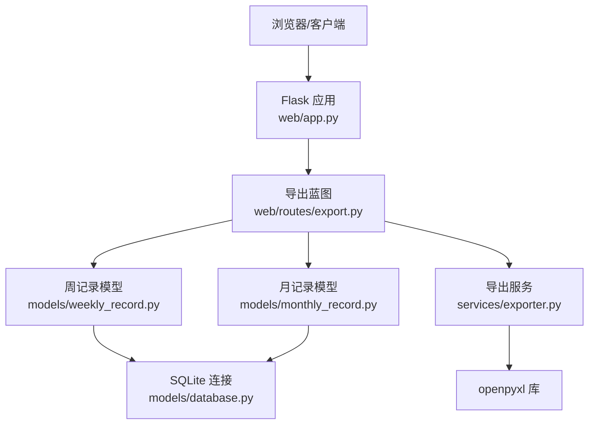
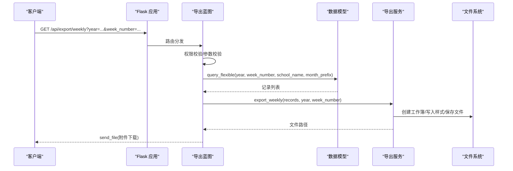
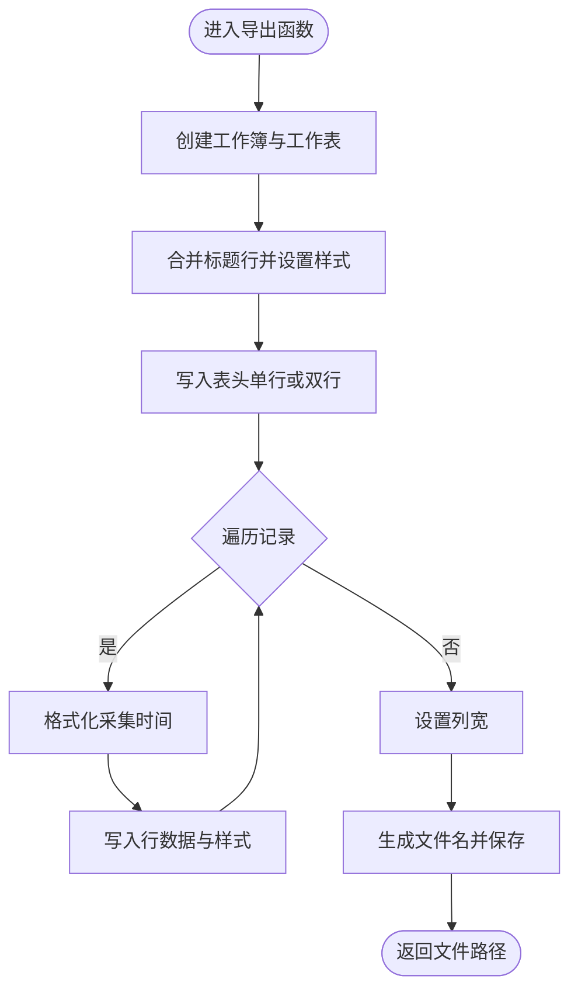
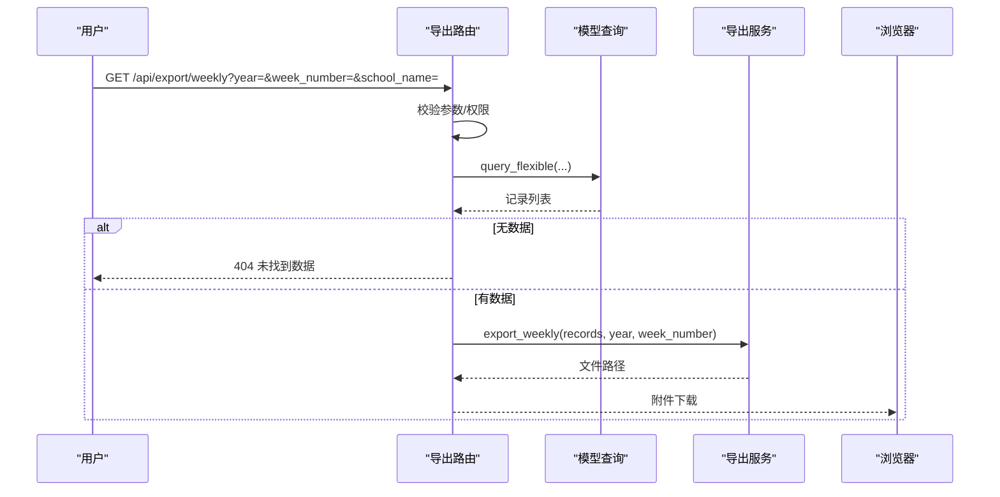
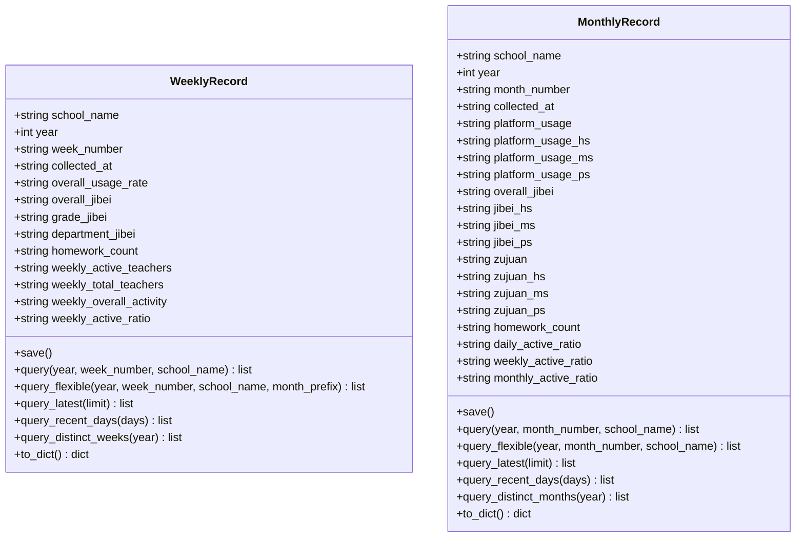
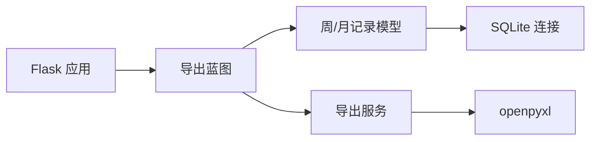

# 数据导出服务

<cite>
**本文引用的文件**
- [services/exporter.py](file://middle-platform-data-collector-master/middle-platform-data-collector-master/services/exporter.py)
- [web/routes/export.py](file://middle-platform-data-collector-master/middle-platform-data-collector-master/web/routes/export.py)
- [models/weekly_record.py](file://middle-platform-data-collector-master/middle-platform-data-collector-master/models/weekly_record.py)
- [models/monthly_record.py](file://middle-platform-data-collector-master/middle-platform-data-collector-master/models/monthly_record.py)
- [models/database.py](file://middle-platform-data-collector-master/middle-platform-data-collector-master/models/database.py)
- [web/app.py](file://middle-platform-data-collector-master/middle-platform-data-collector-master/web/app.py)
- [main.py](file://middle-platform-data-collector-master/middle-platform-data-collector-master/main.py)
- [requirements.txt](file://middle-platform-data-collector-master/middle-platform-data-collector-master/requirements.txt)
</cite>

## 目录
1. [简介](#简介)
2. [项目结构](#项目结构)
3. [核心组件](#核心组件)
4. [架构总览](#架构总览)
5. [详细组件分析](#详细组件分析)
6. [依赖关系分析](#依赖关系分析)
7. [性能与内存优化](#性能与内存优化)
8. [错误处理与健壮性](#错误处理与健壮性)
9. [多格式支持与扩展](#多格式支持与扩展)
10. [模板定制与示例](#模板定制与示例)
11. [故障排查指南](#故障排查指南)
12. [结论](#结论)

## 简介
本技术文档聚焦于数据导出服务 Exporter，围绕 Excel 工作簿创建、单元格格式化与样式设置、数据模板渲染机制（动态列、条件格式、图表嵌入）、批量数据处理优化（内存管理、流式写入、大文件处理）、多种导出格式支持（Excel、CSV、PDF）等主题展开。同时提供自定义导出模板、添加数据验证、生成统计报表的实践路径与最佳实践建议，帮助开发者快速理解并扩展导出能力。

## 项目结构
导出功能位于 Web 层与服务层的协作中：
- Web 路由负责参数校验、权限控制、查询数据并调用导出服务。
- 导出服务基于 openpyxl 构建 Excel 工作簿，完成表头合并、样式应用、数据写入与保存。
- 模型层提供灵活查询接口，按年份、周次/月次、学校维度筛选数据。
- 数据库层维护 SQLite 连接、表结构与增量迁移。

图示来源
- [web/app.py:306-337](file://middle-platform-data-collector-master/middle-platform-data-collector-master/web/app.py#L306-L337)
- [web/routes/export.py:1-124](file://middle-platform-data-collector-master/middle-platform-data-collector-master/web/routes/export.py#L1-L124)
- [services/exporter.py:1-362](file://middle-platform-data-collector-master/middle-platform-data-collector-master/services/exporter.py#L1-L362)
- [models/weekly_record.py:1-163](file://middle-platform-data-collector-master/middle-platform-data-collector-master/models/weekly_record.py#L1-L163)
- [models/monthly_record.py:1-200](file://middle-platform-data-collector-master/middle-platform-data-collector-master/models/monthly_record.py#L1-L200)
- [models/database.py:1-372](file://middle-platform-data-collector-master/middle-platform-data-collector-master/models/database.py#L1-L372)

章节来源
- [web/app.py:306-337](file://middle-platform-data-collector-master/middle-platform-data-collector-master/web/app.py#L306-L337)
- [web/routes/export.py:1-124](file://middle-platform-data-collector-master/middle-platform-data-collector-master/web/routes/export.py#L1-L124)
- [services/exporter.py:1-362](file://middle-platform-data-collector-master/middle-platform-data-collector-master/services/exporter.py#L1-L362)
- [models/weekly_record.py:1-163](file://middle-platform-data-collector-master/middle-platform-data-collector-master/models/weekly_record.py#L1-L163)
- [models/monthly_record.py:1-200](file://middle-platform-data-collector-master/middle-platform-data-collector-master/models/monthly_record.py#L1-L200)
- [models/database.py:1-372](file://middle-platform-data-collector-master/middle-platform-data-collector-master/models/database.py#L1-L372)

## 核心组件
- 导出服务（Exporter）
  - 提供周度与月度数据的 Excel 导出函数，包含标题行合并、双行表头、列宽调整、样式统一、文件名安全化与时间戳命名。
- Web 导出路由（Export Blueprint）
  - 暴露 /api/export/weekly、/api/export/monthly、/api/export/preview、/api/export/distinct_weeks 等接口，进行权限校验、参数校验、数据过滤与文件下载。
- 数据模型（WeeklyRecord、MonthlyRecord）
  - 封装查询方法（含灵活查询），将数据库行映射为对象，供导出服务使用。
- 数据库连接与初始化（Database）
  - 提供上下文管理器获取连接、执行 DDL/DML、自动迁移缺失列、导入初始数据。

章节来源
- [services/exporter.py:1-362](file://middle-platform-data-collector-master/middle-platform-data-collector-master/services/exporter.py#L1-L362)
- [web/routes/export.py:1-124](file://middle-platform-data-collector-master/middle-platform-data-collector-master/web/routes/export.py#L1-L124)
- [models/weekly_record.py:1-163](file://middle-platform-data-collector-master/middle-platform-data-collector-master/models/weekly_record.py#L1-L163)
- [models/monthly_record.py:1-200](file://middle-platform-data-collector-master/middle-platform-data-collector-master/models/monthly_record.py#L1-L200)
- [models/database.py:1-372](file://middle-platform-data-collector-master/middle-platform-data-collector-master/models/database.py#L1-L372)

## 架构总览
导出流程从前端发起请求开始，经过认证与权限检查，查询数据后由导出服务生成 Excel 文件并返回下载链接。

图示来源
- [web/app.py:306-337](file://middle-platform-data-collector-master/middle-platform-data-collector-master/web/app.py#L306-L337)
- [web/routes/export.py:31-62](file://middle-platform-data-collector-master/middle-platform-data-collector-master/web/routes/export.py#L31-L62)
- [services/exporter.py:64-140](file://middle-platform-data-collector-master/middle-platform-data-collector-master/services/exporter.py#L64-L140)
- [models/weekly_record.py:86-103](file://middle-platform-data-collector-master/middle-platform-data-collector-master/models/weekly_record.py#L86-L103)

## 详细组件分析

### 导出服务（Exporter）
- 工作簿与工作表
  - 使用 openpyxl.Workbook 创建新工作簿；周导出默认单 sheet，月导出单 sheet；另有按周分 sheet 的批量导出函数。
- 标题与表头
  - 周导出：单行表头，合并第一行为标题行，统一字体、填充色、对齐与边框。
  - 月导出：双行表头，通过合并单元格实现多级分类（平台使用率、集备、组卷、活跃度占比等），子列采用不同填充色以区分层级。
- 数据写入
  - 遍历记录列表，逐行写入字段值，统一字体与对齐，设置细边框。
  - 日期字段兼容 ISO 字符串（含 T）与本地格式，截取到分钟显示。
- 列宽与文件名
  - 根据列数配置列宽数组，确保内容可读。
  - 文件名使用“年+周期+数据统计”组合，并通过正则清理非法字符，附加时间戳避免覆盖。
- 批量按周导出
  - 将记录按周次分组，每个周次创建一个 sheet，重复表头与样式逻辑，最后统一保存。

图示来源
- [services/exporter.py:64-140](file://middle-platform-data-collector-master/middle-platform-data-collector-master/services/exporter.py#L64-L140)
- [services/exporter.py:236-362](file://middle-platform-data-collector-master/middle-platform-data-collector-master/services/exporter.py#L236-L362)
- [services/exporter.py:143-212](file://middle-platform-data-collector-master/middle-platform-data-collector-master/services/exporter.py#L143-L212)

章节来源
- [services/exporter.py:1-362](file://middle-platform-data-collector-master/middle-platform-data-collector-master/services/exporter.py#L1-L362)

### Web 导出路由（Export Blueprint）
- 权限控制
  - 从会话读取用户信息，非管理员仅允许访问其被分配的学校范围；越权返回 403。
- 参数校验
  - 强制要求 year 参数；其他可选参数包括 week_number、school_name、month_prefix、month_number。
- 数据查询
  - 调用模型的灵活查询接口，支持按周次精确匹配或月份前缀模糊匹配，并按采集时间倒序排列。
- 文件下载
  - 调用导出服务生成文件后，使用 send_file 作为附件返回，文件名遵循导出服务的命名规则。
- 预览接口
  - 返回 JSON 格式的 records 列表，便于前端预览。
- 周标签枚举
  - 返回指定年份已有的不重复周标签，用于前端下拉选择。

图示来源
- [web/routes/export.py:31-62](file://middle-platform-data-collector-master/middle-platform-data-collector-master/web/routes/export.py#L31-L62)
- [web/routes/export.py:65-84](file://middle-platform-data-collector-master/middle-platform-data-collector-master/web/routes/export.py#L65-L84)
- [web/routes/export.py:87-114](file://middle-platform-data-collector-master/middle-platform-data-collector-master/web/routes/export.py#L87-L114)
- [web/routes/export.py:116-124](file://middle-platform-data-collector-master/middle-platform-data-collector-master/web/routes/export.py#L116-L124)

章节来源
- [web/routes/export.py:1-124](file://middle-platform-data-collector-master/middle-platform-data-collector-master/web/routes/export.py#L1-L124)

### 数据模型（WeeklyRecord、MonthlyRecord）
- 数据结构
  - 使用 dataclass 定义字段，包含基础元数据、指标字段、采集时间与状态等。
- 查询方法
  - 提供精确查询与灵活查询；灵活查询支持可选的周次/月次、学校名称与月份前缀，排序策略为采集时间倒序。
- 最近记录与去重
  - 提供最近 N 条记录与最近 N 天记录的查询；支持按年份查询不重复的周标签或月标签。
- 序列化
  - to_dict 方法用于 API 预览返回。

图示来源
- [models/weekly_record.py:9-163](file://middle-platform-data-collector-master/middle-platform-data-collector-master/models/weekly_record.py#L9-L163)
- [models/monthly_record.py:9-200](file://middle-platform-data-collector-master/middle-platform-data-collector-master/models/monthly_record.py#L9-L200)

章节来源
- [models/weekly_record.py:1-163](file://middle-platform-data-collector-master/middle-platform-data-collector-master/models/weekly_record.py#L1-L163)
- [models/monthly_record.py:1-200](file://middle-platform-data-collector-master/middle-platform-data-collector-master/models/monthly_record.py#L1-L200)

### 数据库连接与初始化（Database）
- 连接管理
  - 使用上下文管理器获取连接，启用 WAL 模式与外键约束，保证并发读写与一致性。
- 表结构
  - 定义周记录、月记录、任务、学校、用户等表结构，包含唯一约束与默认值。
- 增量迁移
  - 启动时检测并添加缺失列（如 platform_elapsed、weekly_overall_activity、data_source 等），保障版本演进兼容性。
- 初始数据
  - 首次启动时从配置文件导入学校数据，创建默认管理员账户。

章节来源
- [models/database.py:1-372](file://middle-platform-data-collector-master/middle-platform-data-collector-master/models/database.py#L1-L372)

## 依赖关系分析
- 外部依赖
  - openpyxl：Excel 工作簿与样式操作。
  - flask：Web 框架与蓝图路由。
  - sqlite3：内置数据库驱动。
  - waitress：生产环境 WSGI 服务器。
- 模块耦合
  - 导出服务依赖模型层的数据查询结果，不直接访问数据库。
  - Web 路由依赖模型层与导出服务，承担鉴权与 I/O 职责。
  - 数据库层为模型层提供连接与迁移能力。

图示来源
- [web/app.py:306-337](file://middle-platform-data-collector-master/middle-platform-data-collector-master/web/app.py#L306-L337)
- [web/routes/export.py:1-124](file://middle-platform-data-collector-master/middle-platform-data-collector-master/web/routes/export.py#L1-L124)
- [services/exporter.py:1-362](file://middle-platform-data-collector-master/middle-platform-data-collector-master/services/exporter.py#L1-L362)
- [models/weekly_record.py:1-163](file://middle-platform-data-collector-master/middle-platform-data-collector-master/models/weekly_record.py#L1-L163)
- [models/monthly_record.py:1-200](file://middle-platform-data-collector-master/middle-platform-data-collector-master/models/monthly_record.py#L1-L200)
- [models/database.py:1-372](file://middle-platform-data-collector-master/middle-platform-data-collector-master/models/database.py#L1-L372)

章节来源
- [requirements.txt:1-7](file://middle-platform-data-collector-master/middle-platform-data-collector-master/requirements.txt#L1-L7)
- [main.py:1-42](file://middle-platform-data-collector-master/middle-platform-data-collector-master/main.py#L1-L42)

## 性能与内存优化
当前实现特点与建议：
- 内存占用
  - 导出服务一次性加载所有记录到内存，适合中小规模数据。对于大规模数据，建议分页查询与分批写入，降低峰值内存。
- 流式写入
  - openpyxl 原生不支持真正的流式写入。可考虑改用 xlwt/xlswriter 的流式模式或第三方库（如 pandas.ExcelWriter 配合 chunked 写入）以降低内存占用。
- 大文件处理
  - 减少不必要的样式复制与合并操作；按需计算列宽；对超大文件可拆分为多个工作簿或分 Sheet 存储。
- 并发与线程
  - 生产环境使用 waitress 多线程，注意导出任务的串行化或队列化，避免并发写同一目录导致竞争。
- 缓存与复用
  - 样式对象可复用；列宽配置集中管理；避免在循环内重复创建样式实例。

[本节为通用指导，无需具体文件引用]

## 错误处理与健壮性
- 参数校验
  - 缺少必要参数（如 year）返回 400；无数据返回 404；越权访问返回 403。
- 权限控制
  - 非管理员仅能访问其被分配的学校范围；前端预览接口对越权返回空列表而非报错，提升用户体验。
- 异常回滚
  - 数据库连接上下文在异常时执行回滚，确保事务一致性。
- 日志记录
  - 应用启动时配置日志输出至文件与控制台，便于问题定位。

章节来源
- [web/routes/export.py:31-62](file://middle-platform-data-collector-master/middle-platform-data-collector-master/web/routes/export.py#L31-L62)
- [web/routes/export.py:65-84](file://middle-platform-data-collector-master/middle-platform-data-collector-master/web/routes/export.py#L65-L84)
- [models/database.py:24-48](file://middle-platform-data-collector-master/middle-platform-data-collector-master/models/database.py#L24-L48)
- [web/app.py:14-24](file://middle-platform-data-collector-master/middle-platform-data-collector-master/web/app.py#L14-L24)

## 多格式支持与扩展
- 当前支持
  - Excel（xlsx）：通过 openpyxl 实现。
- CSV 支持（建议实现）
  - 新增导出函数，使用 Python 标准库 csv 模块，按行写入 UTF-8 with BOM 以便 Excel 正确识别中文。
  - 支持动态列与表头合并的简化版（CSV 不支持合并，需扁平化）。
- PDF 支持（建议实现）
  - 使用 reportlab 或 weasyprint 将表格数据渲染为 PDF；可复用 Excel 的表头与样式概念，转换为 PDF 布局。
- 图表嵌入（建议实现）
  - 使用 matplotlib 或 plotly 生成图表图片，再插入到 Excel 工作表中（openpyxl 支持插入图片）。
  - 针对月度报表，可按学校或指标生成趋势图并嵌入对应 Sheet。

[本节为扩展建议，无需具体文件引用]

## 模板定制与示例
- 自定义导出模板
  - 修改表头常量与列宽数组，适配新的业务字段。
  - 增加条件格式：例如对使用率低于阈值标红，可通过 openpyxl 的 ConditionalFormatting 实现。
- 添加数据验证
  - 使用 openpyxl.data_validation.DataValidation 为数值列添加范围限制或下拉选项。
- 生成统计报表
  - 在导出服务中新增汇总行或独立 Sheet，计算平均值、最大值、最小值等统计指标，并应用突出样式。
- 国际化支持
  - 将表头文本抽取为配置项，根据用户语言切换；导出服务接收 locale 参数，动态选择文案。

[本节为实践建议，无需具体文件引用]

## 故障排查指南
- 常见问题
  - 导出失败：检查导出目录是否存在且可写；确认 openpyxl 已安装。
  - 中文乱码：确保 CSV 导出使用 UTF-8 with BOM；Excel 默认支持 UTF-8 中文。
  - 权限错误：确认用户会话有效且具备访问目标学校数据的权限。
  - 大文件卡顿：评估数据量，考虑分页与分批写入；减少样式复杂度。
- 定位手段
  - 查看应用日志（logs/app.log）；检查数据库连接是否正常；核对模型查询 SQL 是否正确。
  - 使用预览接口先验证数据完整性与数量。

章节来源
- [web/app.py:14-24](file://middle-platform-data-collector-master/middle-platform-data-collector-master/web/app.py#L14-L24)
- [web/routes/export.py:31-62](file://middle-platform-data-collector-master/middle-platform-data-collector-master/web/routes/export.py#L31-L62)
- [models/database.py:24-48](file://middle-platform-data-collector-master/middle-platform-data-collector-master/models/database.py#L24-L48)

## 结论
导出服务以清晰的职责划分与模块化设计实现了周度与月度数据的 Excel 导出，具备良好的可扩展性与可维护性。通过引入流式写入、条件格式、数据验证与图表嵌入，可进一步提升用户体验与报表价值。在生产环境中，应关注并发控制、内存管理与错误恢复，确保稳定高效的服务表现。