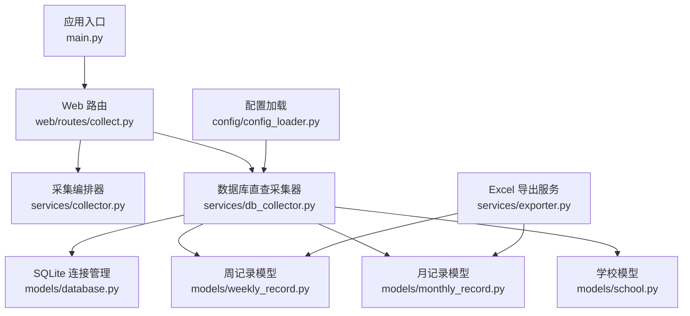
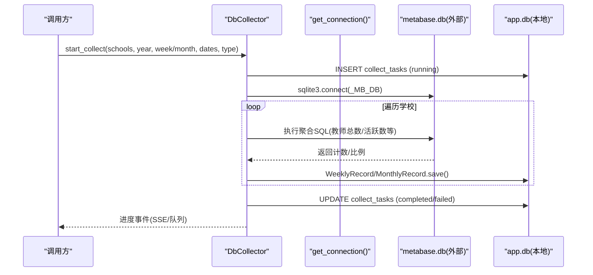
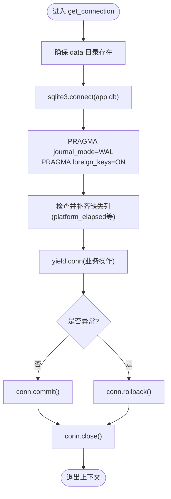
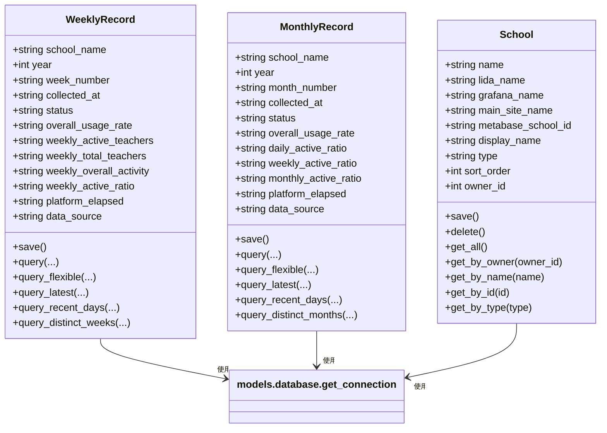
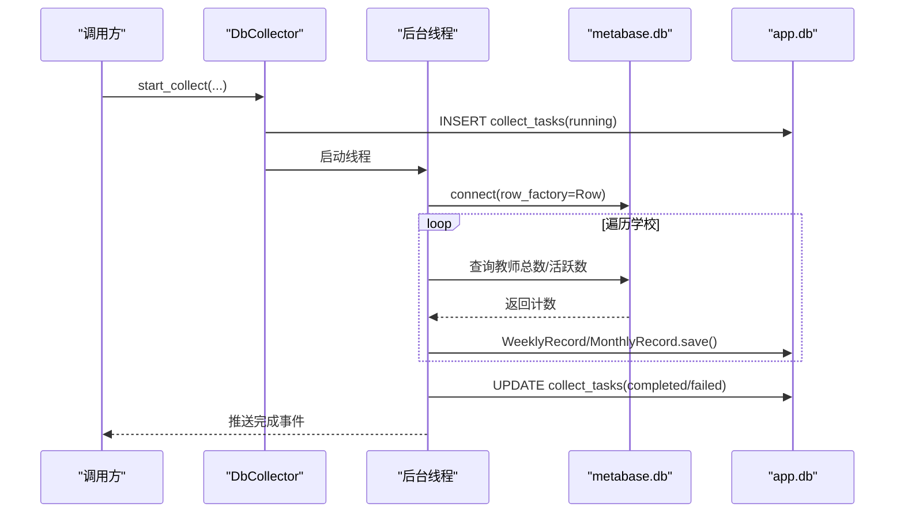
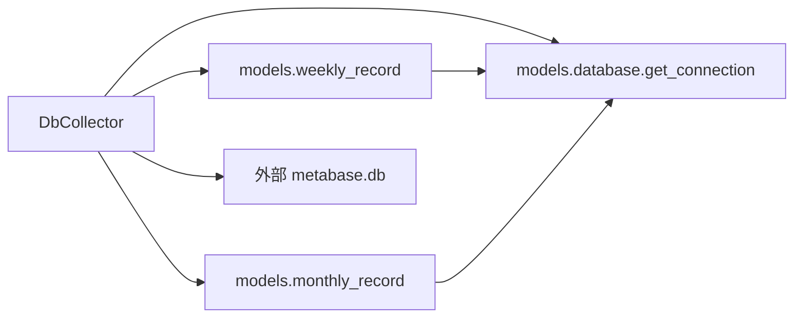

# 数据库服务

<cite>
**本文引用的文件**   
- [services/db_collector.py](file://middle-platform-data-collector-master/services/db_collector.py)
- [models/database.py](file://middle-platform-data-collector-master/models/database.py)
- [models/weekly_record.py](file://middle-platform-data-collector-master/models/weekly_record.py)
- [models/monthly_record.py](file://middle-platform-data-collector-master/models/monthly_record.py)
- [models/school.py](file://middle-platform-data-collector-master/models/school.py)
- [config/config_loader.py](file://middle-platform-data-collector-master/config/config_loader.py)
- [web/routes/collect.py](file://middle-platform-data-collector-master/web/routes/collect.py)
- [services/exporter.py](file://middle-platform-data-collector-master/services/exporter.py)
- [main.py](file://middle-platform-data-collector-master/main.py)
</cite>

## 目录
1. [简介](#简介)
2. [项目结构](#项目结构)
3. [核心组件](#核心组件)
4. [架构总览](#架构总览)
5. [详细组件分析](#详细组件分析)
6. [依赖关系分析](#依赖关系分析)
7. [性能与优化](#性能与优化)
8. [故障排查指南](#故障排查指南)
9. [结论](#结论)
10. [附录：使用示例路径](#附录使用示例路径)

## 简介
本技术文档围绕“数据库直查采集器”（DbCollector）及其相关数据持久化、导出能力展开，重点说明：
- 数据库连接管理与事务处理机制
- 与 SQLite 的交互模式、查询策略与索引建议
- 数据导入导出流程（含 CSV/Excel 解析与格式转换）
- 数据迁移与版本管理策略（表结构变更、兼容性处理）
- 错误处理策略、日志记录规范与安全考虑
- 面向 CRUD、批量处理与复杂查询的使用指引

## 项目结构
与数据库服务相关的代码主要分布在以下模块：
- 数据库连接与初始化：models/database.py
- 数据模型（周/月记录、学校）：models/weekly_record.py、models/monthly_record.py、models/school.py
- 数据库直查采集器：services/db_collector.py
- 配置加载与 Metabase DB 路径解析：config/config_loader.py
- Web 路由与任务编排（参考）：web/routes/collect.py
- Excel 导出服务（参考）：services/exporter.py
- 应用启动入口（参考）：main.py

图表来源
- [services/db_collector.py:1-332](file://middle-platform-data-collector-master/services/db_collector.py#L1-L332)
- [models/database.py:1-372](file://middle-platform-data-collector-master/models/database.py#L1-L372)
- [models/weekly_record.py:1-163](file://middle-platform-data-collector-master/models/weekly_record.py#L1-L163)
- [models/monthly_record.py:1-200](file://middle-platform-data-collector-master/models/monthly_record.py#L1-L200)
- [models/school.py:1-165](file://middle-platform-data-collector-master/models/school.py#L1-L165)
- [config/config_loader.py:1-147](file://middle-platform-data-collector-master/config/config_loader.py#L1-L147)
- [web/routes/collect.py:1-170](file://middle-platform-data-collector-master/web/routes/collect.py#L1-L170)
- [services/exporter.py:1-362](file://middle-platform-data-collector-master/services/exporter.py#L1-L362)
- [main.py:1-42](file://middle-platform-data-collector-master/main.py#L1-L42)

章节来源
- [main.py:1-42](file://middle-platform-data-collector-master/main.py#L1-L42)

## 核心组件
- 数据库连接管理（get_connection）
  - 提供上下文管理器，自动创建连接、设置 PRAGMA（WAL、外键）、DDL 初始化、增量迁移、提交/回滚、关闭。
- 数据模型（WeeklyRecord / MonthlyRecord / School）
  - 以 dataclass 封装字段，统一 save() UPSERT 语义，并提供常用查询方法。
- 数据库直查采集器（DbCollector）
  - 直接读取外部 metabase.db，计算活跃度指标并写入本地 weekly_records / monthly_records。
- 配置加载（config_loader）
  - 提供 get_metabase_db_path 等工具，支持环境变量、配置文件与默认值优先级。
- Excel 导出服务（exporter）
  - 将周/月记录导出为带样式的 Excel 文件，便于离线分析与汇报。

章节来源
- [models/database.py:24-48](file://middle-platform-data-collector-master/models/database.py#L24-L48)
- [models/weekly_record.py:32-68](file://middle-platform-data-collector-master/models/weekly_record.py#L32-L68)
- [models/monthly_record.py:47-100](file://middle-platform-data-collector-master/models/monthly_record.py#L47-L100)
- [services/db_collector.py:51-116](file://middle-platform-data-collector-master/services/db_collector.py#L51-L116)
- [config/config_loader.py:122-147](file://middle-platform-data-collector-master/config/config_loader.py#L122-L147)
- [services/exporter.py:64-141](file://middle-platform-data-collector-master/services/exporter.py#L64-L141)

## 架构总览
DbCollector 作为轻量级采集模式，不启动浏览器，直接查询外部 metabase.db，并将结果落盘到本地 app.db 的周/月记录表中。其关键流程如下：

图表来源
- [services/db_collector.py:91-216](file://middle-platform-data-collector-master/services/db_collector.py#L91-L216)
- [models/database.py:24-48](file://middle-platform-data-collector-master/models/database.py#L24-L48)

## 详细组件分析

### 数据库连接与事务管理（get_connection）
- 连接生命周期
  - 通过 contextmanager 获取连接，确保异常时回滚、正常时提交，finally 中关闭连接。
- 运行时参数
  - WAL 模式提升并发读性能；开启外键约束保证引用完整性。
- 表结构与迁移
  - init_db 负责建表与增量迁移（新增列、类型迁移、默认值填充）。
  - _migrate_if_needed 对历史 INTEGER 类型的 week_number 进行 TEXT 迁移。
  - 首次启动可从 config.yaml 导入学校数据到 schools 表。

图表来源
- [models/database.py:24-48](file://middle-platform-data-collector-master/models/database.py#L24-L48)
- [models/database.py:90-137](file://middle-platform-data-collector-master/models/database.py#L90-L137)
- [models/database.py:201-372](file://middle-platform-data-collector-master/models/database.py#L201-L372)

章节来源
- [models/database.py:24-48](file://middle-platform-data-collector-master/models/database.py#L24-L48)
- [models/database.py:90-137](file://middle-platform-data-collector-master/models/database.py#L90-L137)
- [models/database.py:201-372](file://middle-platform-data-collector-master/models/database.py#L201-L372)

### 数据模型与CRUD
- WeeklyRecord
  - 字段覆盖周维度指标；save() 基于唯一键 (school_name, year, week_number) 实现 UPSERT。
  - 提供按年/周/学校过滤、最近N天、最近N条、去重周标签等查询。
- MonthlyRecord
  - 字段覆盖月维度指标；save() 基于唯一键 (school_name, year, month_number) 实现 UPSERT。
  - 提供按年/月/学校过滤、最近N天、最近N条、去重月标签等查询。
- School
  - 维护多平台名称映射、排序、归属等元信息；支持按 owner/type/name/id 查询。

图表来源
- [models/weekly_record.py:1-163](file://middle-platform-data-collector-master/models/weekly_record.py#L1-L163)
- [models/monthly_record.py:1-200](file://middle-platform-data-collector-master/models/monthly_record.py#L1-L200)
- [models/school.py:1-165](file://middle-platform-data-collector-master/models/school.py#L1-L165)

章节来源
- [models/weekly_record.py:32-163](file://middle-platform-data-collector-master/models/weekly_record.py#L32-L163)
- [models/monthly_record.py:47-200](file://middle-platform-data-collector-master/models/monthly_record.py#L47-L200)
- [models/school.py:28-165](file://middle-platform-data-collector-master/models/school.py#L28-L165)

### 数据库直查采集器（DbCollector）
- 任务生命周期
  - start_collect 创建任务记录、启动后台线程、异步执行采集逻辑。
  - 每个学校依次执行周/月采集，完成后更新任务状态并推送完成事件。
- 数据源
  - 直接 sqlite3.connect 外部 metabase.db，使用 Row 工厂访问列名。
- 指标计算
  - 周：教师总数、使用教师数、活跃教师数（>=3天），计算整体活跃度与活跃比例。
  - 月：日活/周活/月活教师数（分别 >=1/3/4 天），保存绝对数值。
- 进度事件
  - 通过订阅者队列推送系统/平台级进度，供前端 SSE 消费。

图表来源
- [services/db_collector.py:91-216](file://middle-platform-data-collector-master/services/db_collector.py#L91-L216)
- [services/db_collector.py:217-332](file://middle-platform-data-collector-master/services/db_collector.py#L217-L332)

章节来源
- [services/db_collector.py:51-116](file://middle-platform-data-collector-master/services/db_collector.py#L51-L116)
- [services/db_collector.py:135-216](file://middle-platform-data-collector-master/services/db_collector.py#L135-L216)
- [services/db_collector.py:217-332](file://middle-platform-data-collector-master/services/db_collector.py#L217-L332)

### 配置与外部数据库路径
- get_metabase_db_path 优先级：
  1) 环境变量 METABASE_DB_PATH
  2) config.yaml 中的 database.metabase_db_path
  3) 默认 data/metabase.db
- 注意：DbCollector 当前硬编码了外部 DB 路径，建议后续统一改为通过配置加载。

章节来源
- [config/config_loader.py:122-147](file://middle-platform-data-collector-master/config/config_loader.py#L122-L147)
- [services/db_collector.py:21-22](file://middle-platform-data-collector-master/services/db_collector.py#L21-L22)

### 数据导入导出流程
- 导入
  - 首次启动时若 schools 为空，则从 config.yaml 导入学校列表至本地数据库。
- 导出
  - exporter 提供 export_weekly/export_monthly 等方法，生成带样式与合并表头的 Excel 文件。
  - 文件名包含年份与周期标签，时间戳后缀避免覆盖。

章节来源
- [models/database.py:143-199](file://middle-platform-data-collector-master/models/database.py#L143-L199)
- [services/exporter.py:64-141](file://middle-platform-data-collector-master/services/exporter.py#L64-L141)
- [services/exporter.py:236-362](file://middle-platform-data-collector-master/services/exporter.py#L236-L362)

## 依赖关系分析
- 低耦合设计
  - DbCollector 仅依赖 models 层与 sqlite3，不直接耦合爬虫或浏览器。
- 关键依赖链
  - DbCollector -> models.database.get_connection -> app.db
  - DbCollector -> models.weekly_record / models.monthly_record -> app.db
  - DbCollector -> 外部 metabase.db（sqlite3）
  - Web 路由 collect.py 可触发采集任务（参考 Collector，DbCollector 与之类似）

图表来源
- [services/db_collector.py:1-332](file://middle-platform-data-collector-master/services/db_collector.py#L1-L332)
- [models/database.py:1-372](file://middle-platform-data-collector-master/models/database.py#L1-L372)
- [models/weekly_record.py:1-163](file://middle-platform-data-collector-master/models/weekly_record.py#L1-L163)
- [models/monthly_record.py:1-200](file://middle-platform-data-collector-master/models/monthly_record.py#L1-L200)

章节来源
- [services/db_collector.py:1-332](file://middle-platform-data-collector-master/services/db_collector.py#L1-L332)
- [models/database.py:1-372](file://middle-platform-data-collector-master/models/database.py#L1-L372)

## 性能与优化
- 连接与事务
  - 使用 WAL 模式提升并发读性能；每次请求在上下文内提交/回滚，避免长事务。
- 查询优化建议
  - 针对频繁过滤条件建立索引（示例）：
    - teacher_base(school_name, state)
    - dws_ingress_teacher_day(school_name, stat_date)
    - dws_ingress_teacher_day(host, tianli_school_id, stat_date)
  - 使用 substr(stat_date,1,10) 比较日期范围时，建议在统计库侧提供规范化日期列或物化视图以减少函数开销。
- 批量写入
  - 当前采用逐条 save()，适合中小规模；若数据量增大，可在模型层增加批量插入接口（如 executemany）。
- 资源释放
  - 外部 metabase.db 连接在每个任务结束后显式 close，避免句柄泄漏。

[本节为通用性能建议，无需特定文件来源]

## 故障排查指南
- 常见问题定位
  - 任务未结束：检查 collect_tasks 状态与 finished_at 字段。
  - 数据不一致：核对 weekly_records/monthly_records 的 UNIQUE 约束冲突与 error_message。
  - 外部 DB 不可用：确认 METABASE_DB_PATH 或硬编码路径指向正确且可读。
- 日志与事件
  - 采集过程会记录错误日志并推送失败事件，可通过 SSE 或订阅队列查看。
- 迁移问题
  - 若出现列缺失或类型不匹配，init_db 的增量迁移应自动修复；必要时手动检查 PRAGMA table_info。

章节来源
- [services/db_collector.py:189-216](file://middle-platform-data-collector-master/services/db_collector.py#L189-L216)
- [models/database.py:90-137](file://middle-platform-data-collector-master/models/database.py#L90-L137)
- [models/database.py:301-372](file://middle-platform-data-collector-master/models/database.py#L301-L372)

## 结论
DbCollector 提供了轻量、稳定的数据库直查采集方案，结合完善的连接管理、迁移机制与导出能力，可满足教育平台活跃度指标的自动化采集与报表输出需求。建议后续完善外部 DB 路径配置化、引入批量写入与更细粒度的索引策略，进一步提升吞吐与稳定性。

[本节为总结性内容，无需特定文件来源]

## 附录：使用示例路径
以下为常见操作的代码片段路径（不包含具体代码内容）：
- 启动数据库直查采集任务
  - [start_collect 定义:91-116](file://middle-platform-data-collector-master/services/db_collector.py#L91-L116)
  - [异步主循环:143-216](file://middle-platform-data-collector-master/services/db_collector.py#L143-L216)
- 周/月记录保存（UPSERT）
  - [WeeklyRecord.save:32-68](file://middle-platform-data-collector-master/models/weekly_record.py#L32-L68)
  - [MonthlyRecord.save:47-100](file://middle-platform-data-collector-master/models/monthly_record.py#L47-L100)
- 灵活查询
  - [WeeklyRecord.query_flexible:87-103](file://middle-platform-data-collector-master/models/weekly_record.py#L87-L103)
  - [MonthlyRecord.query_flexible:118-132](file://middle-platform-data-collector-master/models/monthly_record.py#L118-L132)
- 导出 Excel
  - [export_weekly:64-141](file://middle-platform-data-collector-master/services/exporter.py#L64-L141)
  - [export_monthly:236-362](file://middle-platform-data-collector-master/services/exporter.py#L236-L362)
- 配置与路径
  - [get_metabase_db_path:122-147](file://middle-platform-data-collector-master/config/config_loader.py#L122-L147)