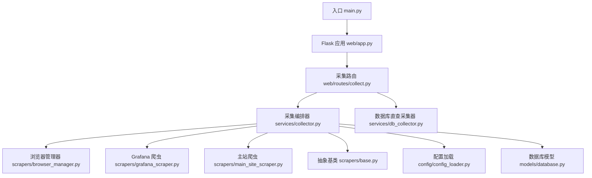
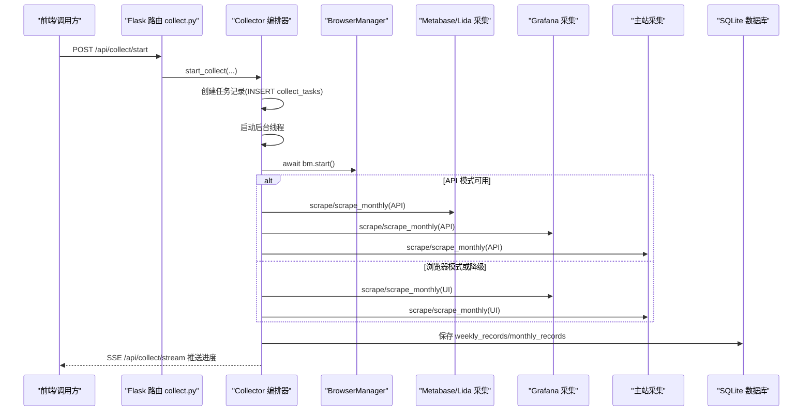
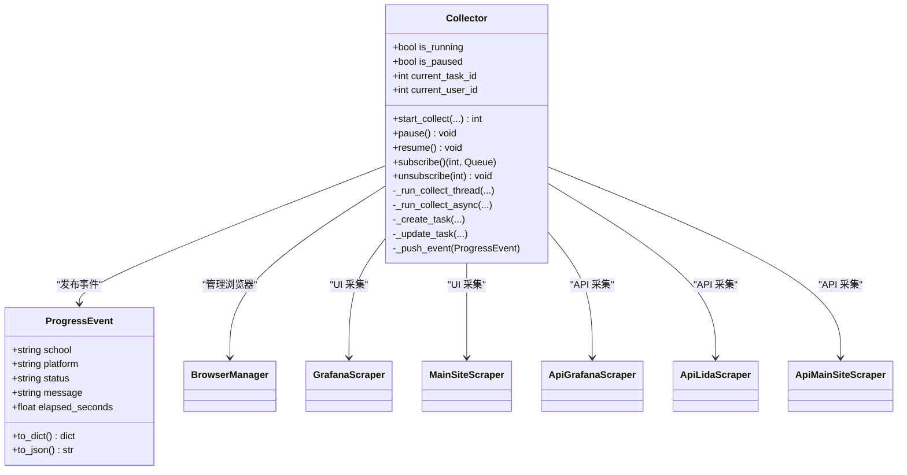
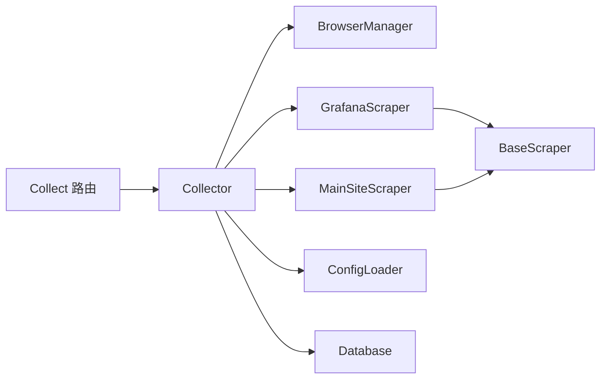

# 数据采集服务

<cite>
**本文引用的文件**
- [main.py](file://main.py)
- [web/app.py](file://web/app.py)
- [web/routes/collect.py](file://web/routes/collect.py)
- [services/collector.py](file://services/collector.py)
- [services/db_collector.py](file://services/db_collector.py)
- [scrapers/base.py](file://scrapers/base.py)
- [scrapers/browser_manager.py](file://scrapers/browser_manager.py)
- [scrapers/grafana_scraper.py](file://scrapers/grafana_scraper.py)
- [scrapers/main_site_scraper.py](file://scrapers/main_site_scraper.py)
- [config/config_loader.py](file://config/config_loader.py)
- [models/database.py](file://models/database.py)
</cite>

## 目录
1. [简介](#简介)
2. [项目结构](#项目结构)
3. [核心组件](#核心组件)
4. [架构总览](#架构总览)
5. [详细组件分析](#详细组件分析)
6. [依赖关系分析](#依赖关系分析)
7. [性能与资源管理](#性能与资源管理)
8. [故障排查指南](#故障排查指南)
9. [结论](#结论)
10. [附录：使用示例与最佳实践](#附录使用示例与最佳实践)

## 简介
本技术文档面向“数据采集服务”的 Collector 采集编排器，系统性阐述其并发控制、任务调度、进度管理、异步架构（事件循环与线程协调）、多平台采集流程（Grafana、Metabase/Lida、主站）及降级策略；并说明 API 直连模式与浏览器模式的切换逻辑、自动降级机制。同时提供启动采集任务、监控进度、处理错误的操作指引，以及性能优化建议、资源管理最佳实践和扩展开发指导。

## 项目结构
系统采用分层组织：Web 层暴露 REST/SSE 接口；服务层包含采集编排器与数据库直查采集器；爬虫层按平台拆分实现；配置与模型分别负责配置加载与数据持久化。

图表来源
- [main.py:1-42](file://main.py#L1-L42)
- [web/app.py:306-337](file://web/app.py#L306-L337)
- [web/routes/collect.py:1-170](file://web/routes/collect.py#L1-L170)
- [services/collector.py:1-862](file://services/collector.py#L1-L862)
- [services/db_collector.py:1-332](file://services/db_collector.py#L1-L332)
- [scrapers/browser_manager.py:1-76](file://scrapers/browser_manager.py#L1-L76)
- [scrapers/grafana_scraper.py:1-800](file://scrapers/grafana_scraper.py#L1-L800)
- [scrapers/main_site_scraper.py:1-800](file://scrapers/main_site_scraper.py#L1-L800)
- [scrapers/base.py:1-104](file://scrapers/base.py#L1-L104)
- [config/config_loader.py:1-147](file://config/config_loader.py#L1-L147)
- [models/database.py:1-372](file://models/database.py#L1-L372)

章节来源
- [main.py:1-42](file://main.py#L1-L42)
- [web/app.py:306-337](file://web/app.py#L306-L337)

## 核心组件
- 采集编排器 Collector：串联 Grafana/Metabase/Lida/主站等平台的采集流程，支持周表/月表两种记录类型，支持 API 直连与浏览器双模式，具备暂停/恢复、SSE 进度推送、任务状态持久化。
- 数据库直查采集器 DbCollector：轻量模式，直接查询 Metabase 本地 SQLite 数据库计算活跃度指标，不启动浏览器。
- 浏览器管理器 BrowserManager：封装 Playwright 生命周期，统一创建上下文与页面，清理缓存，设置超时与视口。
- 平台爬虫：BaseScraper 抽象基类；GrafanaScraper 与 MainSiteScraper 具体实现，均继承自 BaseScraper。
- 配置加载器 ConfigLoader：加载 YAML 配置，校验必填字段，提供用户级凭证覆盖能力。
- 数据库模型 Database：SQLite 连接管理、表结构初始化与增量迁移、默认管理员与学校导入。

章节来源
- [services/collector.py:1-862](file://services/collector.py#L1-L862)
- [services/db_collector.py:1-332](file://services/db_collector.py#L1-L332)
- [scrapers/browser_manager.py:1-76](file://scrapers/browser_manager.py#L1-L76)
- [scrapers/base.py:1-104](file://scrapers/base.py#L1-L104)
- [scrapers/grafana_scraper.py:1-800](file://scrapers/grafana_scraper.py#L1-L800)
- [scrapers/main_site_scraper.py:1-800](file://scrapers/main_site_scraper.py#L1-L800)
- [config/config_loader.py:1-147](file://config/config_loader.py#L1-L147)
- [models/database.py:1-372](file://models/database.py#L1-L372)

## 架构总览
整体采用“Web 请求 → 后台线程 → 事件循环 → 平台爬虫”的异步架构。Web 层通过 Flask 暴露 REST 与 SSE 接口；Collector 在独立线程中运行 asyncio 事件循环，按平台顺序与并行策略执行各平台采集；结果合并后写入数据库，并通过 SSE 向客户端推送进度事件。

图表来源
- [web/routes/collect.py:22-102](file://web/routes/collect.py#L22-L102)
- [services/collector.py:133-212](file://services/collector.py#L133-L212)
- [scrapers/browser_manager.py:18-56](file://scrapers/browser_manager.py#L18-L56)
- [scrapers/grafana_scraper.py:327-598](file://scrapers/grafana_scraper.py#L327-L598)
- [scrapers/main_site_scraper.py:568-638](file://scrapers/main_site_scraper.py#L568-L638)
- [models/database.py:201-372](file://models/database.py#L201-L372)

## 详细组件分析

### 采集编排器 Collector
- 并发与调度
  - 单实例全局唯一，防止重复启动；内部维护 _running 标志与线程引用，异常退出时自动重置。
  - 后台线程入口 _run_collect_thread 调用 asyncio.run 启动新事件循环，避免与 Web 事件循环冲突。
  - 平台内学校串行执行，平台间可并行（Lida 与主站并行），Grafana 阶段串行。
- 暂停/恢复
  - 使用 threading.Event 作为暂停信号，在各平台采集前检查 _pause_event.wait()，并在恢复后继续。
- 进度管理
  - 基于 pub/sub 的队列广播：subscribe/unsubscribe 为每个 SSE 客户端分配独立 queue.Queue，_push_event 将 ProgressEvent 推送到所有订阅者。
  - 事件包含学校、平台、状态、消息与耗时，便于前端渲染实时进度。
- 模式选择与降级
  - 根据配置 api_mode 与可选依赖可用性决定启用 API 模式；若 API 失败或返回空数据，自动降级到浏览器模式。
  - 主站共享浏览器 context，API 与浏览器共用登录态，避免 Cloud 重复登录导致会话被杀。
- 数据落库
  - 根据 record_type 选择 WeeklyRecord 或 MonthlyRecord，合并各平台结果后保存，并记录 platform_elapsed 统计。

图表来源
- [services/collector.py:39-132](file://services/collector.py#L39-L132)
- [services/collector.py:133-212](file://services/collector.py#L133-L212)
- [services/collector.py:214-862](file://services/collector.py#L214-L862)
- [scrapers/browser_manager.py:11-76](file://scrapers/browser_manager.py#L11-L76)
- [scrapers/grafana_scraper.py:48-598](file://scrapers/grafana_scraper.py#L48-L598)
- [scrapers/main_site_scraper.py:21-638](file://scrapers/main_site_scraper.py#L21-L638)

章节来源
- [services/collector.py:1-862](file://services/collector.py#L1-L862)

### 数据库直查采集器 DbCollector
- 目标：在不启动浏览器的情况下，直接查询 Metabase 本地 SQLite 数据库，计算活跃度指标并写入 weekly_records/monthly_records。
- 特点：轻量、快速；与 Collector 互斥（各自维护 _running 标志），同一时间只能有一个采集器运行。
- 进度：同样通过 subscribe/unsubscribe 与 _push_event 推送进度事件，供前端 SSE 消费。

章节来源
- [services/db_collector.py:1-332](file://services/db_collector.py#L1-L332)

### 浏览器管理器 BrowserManager
- 职责：封装 Playwright 生命周期，提供 start/new_context/new_page/stop 方法；在无头模式下设置标准视口，有头模式跟随窗口大小；清除缓存避免旧数据干扰；设置默认超时。
- 与爬虫协作：BaseScraper 通过 _get_page 复用或创建 Context/Page，close 时区分是否共享 Context。

章节来源
- [scrapers/browser_manager.py:1-76](file://scrapers/browser_manager.py#L1-L76)
- [scrapers/base.py:12-73](file://scrapers/base.py#L12-L73)

### Grafana 爬虫 GrafanaScraper
- 模式：优先尝试 API 直连（若配置了 token），失败或无数据则回退 UI 方式。
- UI 流程：登录 → 导航到 dashboards → 进入“中台周报表” → 设置时间范围与学校筛选 → 提取面板数值（KPI 与比例面板差异化处理）→ 必要时从 API 响应或 canvas tooltip 二次提取。
- 健壮性：多重登录成功检测、网络空闲等待、多次兜底提取策略。

章节来源
- [scrapers/grafana_scraper.py:48-598](file://scrapers/grafana_scraper.py#L48-L598)

### 主站爬虫 MainSiteScraper
- 流程：登录 → 导航到学校运维 → 搜索学校 → 一键登录 → 考试阅卷系统 → 考试管理 → 设置筛选（日期、场景=作业、分类=手阅作业）→ 提取作业次数。
- 分页处理：尝试修改每页条数至最大值，否则翻页累加；支持多种提取方式（正则、Vue 属性、表格行数）。
- 状态保持：每校完成后轻量清理，保留运维页面，减少重复登录开销。

章节来源
- [scrapers/main_site_scraper.py:21-800](file://scrapers/main_site_scraper.py#L21-L800)

### 配置加载器 ConfigLoader
- 功能：加载 YAML 配置，校验 credentials 必填项；提供 get_schools/get_school 从数据库读取学校信息；支持用户级凭证覆盖 set_user_creds_override/get_credentials。
- 路径解析：get_metabase_db_path 支持环境变量、配置文件与默认路径优先级。

章节来源
- [config/config_loader.py:1-147](file://config/config_loader.py#L1-L147)

### 数据库模型 Database
- 功能：SQLite 连接上下文管理、表结构初始化、增量迁移（添加缺失列、类型迁移）、默认管理员账户创建、首次从 config.yaml 导入学校数据。
- 关键表：weekly_records、monthly_records、collect_tasks、schools、users。

章节来源
- [models/database.py:1-372](file://models/database.py#L1-L372)

## 依赖关系分析
- 模块耦合
  - Collector 强依赖 BrowserManager、GrafanaScraper、MainSiteScraper 与配置加载器；弱依赖可选 API 爬虫（ApiGrafanaScraper、ApiLidaScraper、ApiMainSiteScraper）。
  - Web 路由仅依赖 Collector 与配置加载器，保持薄控制器。
- 外部依赖
  - Playwright 用于浏览器自动化；aiohttp 用于 API 直连（可选）；Flask 提供 Web 服务；SQLite 作为本地存储。
- 潜在环依赖
  - 当前未发现循环导入；Collector 通过条件 import 引入 API 爬虫，避免未安装时报错。

图表来源
- [services/collector.py:1-862](file://services/collector.py#L1-L862)
- [web/routes/collect.py:1-170](file://web/routes/collect.py#L1-L170)
- [scrapers/base.py:1-104](file://scrapers/base.py#L1-L104)

章节来源
- [services/collector.py:1-862](file://services/collector.py#L1-L862)
- [web/routes/collect.py:1-170](file://web/routes/collect.py#L1-L170)

## 性能与资源管理
- 并发策略
  - 平台内串行、平台间并行：Grafana 阶段串行，Lida 与主站并行，最大化吞吐。
  - 共享浏览器 Context：主站 API 与浏览器共用登录态，避免重复登录导致的会话冲突。
- 资源释放
  - 每校完成后关闭多余标签页，保留运维页面；Context 关闭由 BaseScraper 判断是否共享。
  - 数据库连接使用上下文管理器，确保事务提交与回滚。
- 超时与重试
  - 浏览器默认超时、网络空闲等待；登录与导航过程内置重试与延时，降低瞬时失败概率。
- 建议
  - 合理设置 headless/slow_mo/default_timeout 以平衡稳定性与速度。
  - 对大数量学校采集，考虑分批次执行，避免长时间占用浏览器进程。
  - 定期清理 logs 与 data 目录，避免磁盘增长。

[本节为通用指导，无需源码引用]

## 故障排查指南
- 常见问题
  - 登录失败：检查 credentials 配置与用户覆盖是否正确；确认 Grafana 是否允许 lida 账号登录。
  - 数据为空：API 模式返回空数据会触发降级到浏览器模式；查看日志中的降级提示。
  - 进度不更新：确认 SSE 连接是否正常建立；检查 _collector.subscribe 与 unsubscribe 是否成对调用。
  - 任务卡住：检查 _pause_event 状态；确认是否有未释放的浏览器上下文或页面。
- 定位手段
  - 查看 app.log 日志输出；关注“降级”、“失败”、“超时”等关键字。
  - 使用 /api/collect/status 获取当前任务状态与用户 ID。
  - 使用 /api/collect/stream 订阅进度事件，观察 system 事件完成信号。

章节来源
- [web/routes/collect.py:104-170](file://web/routes/collect.py#L104-L170)
- [services/collector.py:119-132](file://services/collector.py#L119-L132)
- [scrapers/grafana_scraper.py:56-143](file://scrapers/grafana_scraper.py#L56-L143)
- [scrapers/main_site_scraper.py:96-128](file://scrapers/main_site_scraper.py#L96-L128)

## 结论
Collector 采集编排器通过“后台线程 + 事件循环 + 平台并行”的架构实现了高可用的多平台数据采集；结合 API 直连与浏览器双模式与自动降级策略，提升了成功率与鲁棒性；SSE 进度推送与完善的错误处理使运维与排障更加便捷。配合合理的资源管理与性能调优，可在大规模学校场景下稳定运行。

[本节为总结，无需源码引用]

## 附录：使用示例与最佳实践

### 启动采集任务
- 调用接口
  - POST /api/collect/start
  - 参数：schools、year、week_number、start_date、end_date、platforms（可选）、record_type（weekly/monthly）、month_number（月度模式）、data_source（grafana/database）
- 返回
  - task_id、message、record_type、data_source

章节来源
- [web/routes/collect.py:22-102](file://web/routes/collect.py#L22-L102)

### 监控进度
- 查询状态
  - GET /api/collect/status
  - 返回 running、paused、task_id、user_id
- 订阅 SSE
  - GET /api/collect/stream
  - 返回 text/event-stream，包含学校、平台、状态、消息与耗时；system 完成事件表示结束

章节来源
- [web/routes/collect.py:104-170](file://web/routes/collect.py#L104-L170)

### 暂停与恢复
- 暂停
  - POST /api/collect/pause
- 继续
  - POST /api/collect/resume

章节来源
- [web/routes/collect.py:115-134](file://web/routes/collect.py#L115-L134)

### 错误处理
- 常见错误码
  - 400：参数校验失败（学校不存在、日期格式错误、月次格式无效）
  - 409：已有任务在执行或已处于暂停/非暂停状态
- 建议
  - 前端捕获错误并提示用户；对于 409 错误，轮询 /status 直到任务完成后再发起新任务。

章节来源
- [web/routes/collect.py:22-102](file://web/routes/collect.py#L22-L102)

### 扩展开发指导
- 新增平台爬虫
  - 继承 BaseScraper，实现 login 与 scrape/scrape_monthly；在 Collector 中添加对应采集函数与并行阶段。
  - 如需 API 模式，实现对应的 ApiXxxScraper，并在 Collector 中集成降级逻辑。
- 配置与凭证
  - 在 config.yaml 中补充 credentials；如需用户级覆盖，使用 set_user_creds_override。
- 数据库模型
  - 如需新增字段，参考 models/database.py 的增量迁移模式，在 init_db 中添加 ALTER TABLE 逻辑。

章节来源
- [scrapers/base.py:12-73](file://scrapers/base.py#L12-L73)
- [config/config_loader.py:99-119](file://config/config_loader.py#L99-L119)
- [models/database.py:301-372](file://models/database.py#L301-L372)