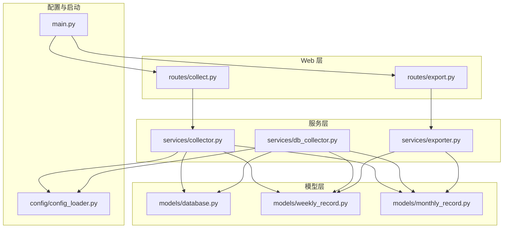
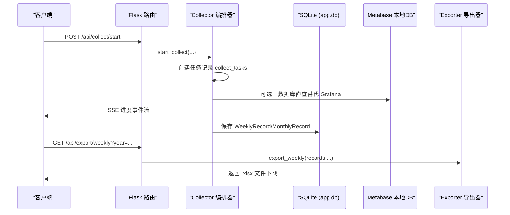
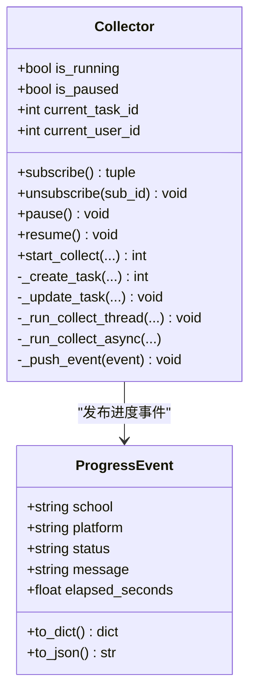
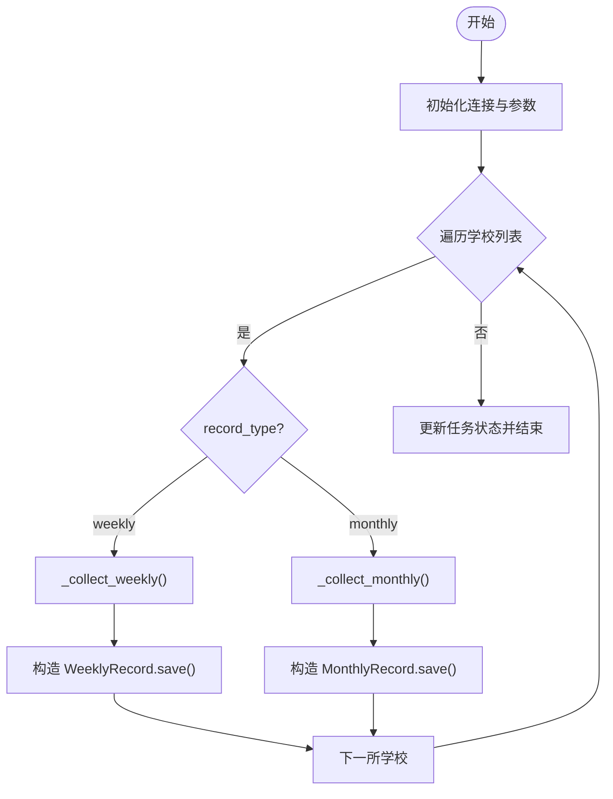
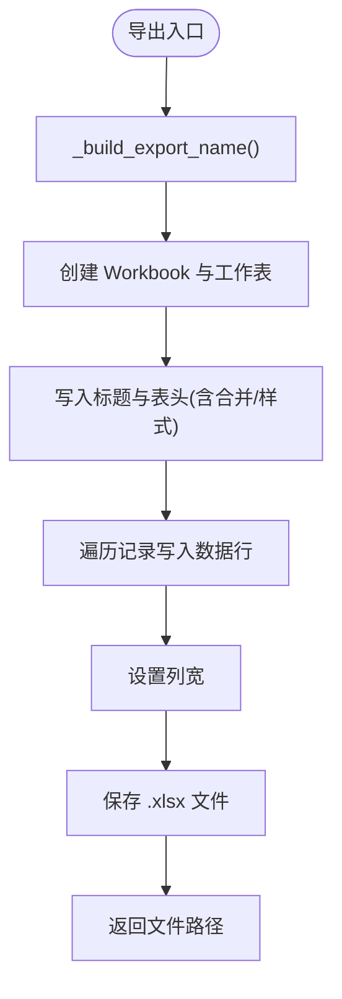
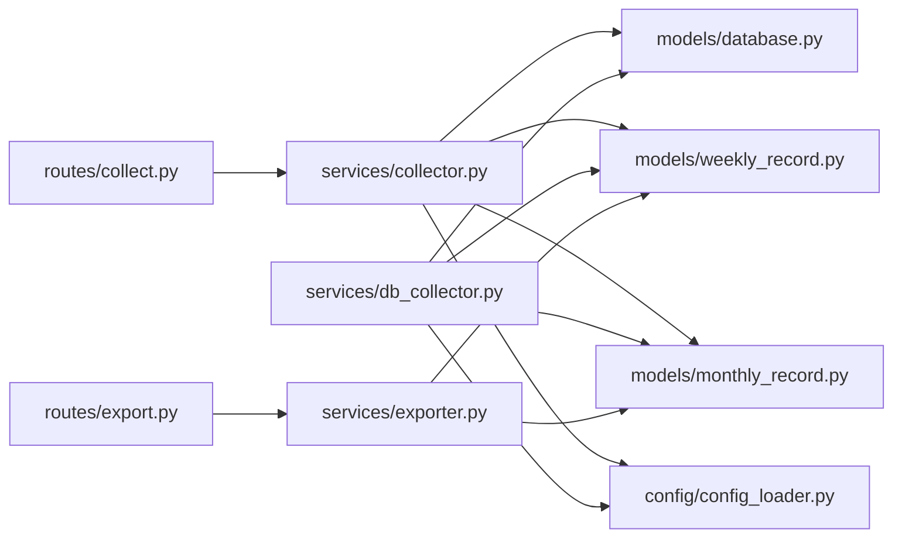

# 核心模块

<cite>
**本文引用的文件**   
- [services/collector.py](file://services/collector.py)
- [services/db_collector.py](file://services/db_collector.py)
- [services/exporter.py](file://services/exporter.py)
- [models/database.py](file://models/database.py)
- [models/weekly_record.py](file://models/weekly_record.py)
- [models/monthly_record.py](file://models/monthly_record.py)
- [web/routes/collect.py](file://web/routes/collect.py)
- [web/routes/export.py](file://web/routes/export.py)
- [config/config_loader.py](file://config/config_loader.py)
- [main.py](file://main.py)
</cite>

## 目录
1. [简介](#简介)
2. [项目结构](#项目结构)
3. [核心组件](#核心组件)
4. [架构总览](#架构总览)
5. [详细组件分析](#详细组件分析)
6. [依赖关系分析](#依赖关系分析)
7. [性能考量](#性能考量)
8. [故障排查指南](#故障排查指南)
9. [结论](#结论)
10. [附录：扩展与自定义指南](#附录扩展与自定义指南)

## 简介
本技术文档聚焦教育平台数据自动采集系统的核心模块，围绕以下目标展开：
- 深入解析 Collector 采集器编排器的设计原理，包括并发控制、任务调度策略、进度管理接口。
- 详细说明 DatabaseCollector 数据库采集器的实现，涵盖连接管理、事务处理、批量操作优化。
- 描述 Exporter 导出器的 Excel 生成逻辑，包括数据格式化、模板渲染、性能优化。
- 解释各模块间的依赖关系和调用流程，提供具体代码示例和使用模式（以源码路径引用形式）。
- 总结错误处理策略、日志记录规范、性能监控指标，并为开发者提供扩展与自定义指导。

## 项目结构
系统采用分层组织方式：
- services：核心业务服务层（采集编排、数据库直查、导出）
- models：数据模型与持久化封装（周表、月表、数据库初始化）
- web：Web API 路由（采集任务、导出、活动看板等）
- config：配置加载与校验
- main：应用启动入口

图表来源
- [web/routes/collect.py:1-170](file://web/routes/collect.py#L1-L170)
- [web/routes/export.py:1-124](file://web/routes/export.py#L1-L124)
- [services/collector.py:1-862](file://services/collector.py#L1-L862)
- [services/db_collector.py:1-332](file://services/db_collector.py#L1-L332)
- [services/exporter.py:1-362](file://services/exporter.py#L1-L362)
- [models/database.py:1-372](file://models/database.py#L1-L372)
- [models/weekly_record.py:1-163](file://models/weekly_record.py#L1-L163)
- [models/monthly_record.py:1-200](file://models/monthly_record.py#L1-L200)
- [config/config_loader.py:1-147](file://config/config_loader.py#L1-L147)
- [main.py:1-42](file://main.py#L1-L42)

章节来源
- [main.py:1-42](file://main.py#L1-L42)
- [web/routes/collect.py:1-170](file://web/routes/collect.py#L1-L170)
- [web/routes/export.py:1-124](file://web/routes/export.py#L1-L124)

## 核心组件
本节概述三大核心组件的职责与交互要点：
- Collector 采集器编排器：负责多平台（Grafana、Metabase/Lida、主站）的采集编排、API 直连优先与浏览器降级、并行执行、暂停/继续、SSE 进度推送、结果合并与落库。
- DbCollector 数据库采集器：轻量级采集模式，直接查询 Metabase 本地 SQLite 数据库计算活跃度指标，避免浏览器开销。
- Exporter 导出器：将周表/月表记录导出为 Excel，支持单周导出、按周次分组导出、月度双行合并表头导出，并包含样式与列宽优化。

章节来源
- [services/collector.py:1-862](file://services/collector.py#L1-L862)
- [services/db_collector.py:1-332](file://services/db_collector.py#L1-L332)
- [services/exporter.py:1-362](file://services/exporter.py#L1-L362)

## 架构总览
整体调用链从 Web 路由到服务层再到模型层，最终写入 SQLite 或读取 Metabase 本地数据库；导出器基于 openpyxl 生成 Excel。

图表来源
- [web/routes/collect.py:22-102](file://web/routes/collect.py#L22-L102)
- [services/collector.py:133-212](file://services/collector.py#L133-L212)
- [services/collector.py:407-550](file://services/collector.py#L407-L550)
- [models/weekly_record.py:32-68](file://models/weekly_record.py#L32-L68)
- [models/monthly_record.py:47-100](file://models/monthly_record.py#L47-L100)
- [web/routes/export.py:31-62](file://web/routes/export.py#L31-L62)
- [services/exporter.py:64-140](file://services/exporter.py#L64-L140)

## 详细组件分析

### Collector 采集器编排器
- 并发控制机制
  - 使用后台线程 + asyncio 事件循环运行异步采集逻辑，避免阻塞 Web 请求。
  - 通过 Event 对象实现暂停/继续控制，在每所学校、每个平台阶段检查暂停状态。
  - 同一时间仅允许一个采集任务运行（is_running 标志），防止重复启动。
- 任务调度策略
  - 平台优先顺序：Phase 1 为 Grafana 或数据库直查（所有学校顺序执行），Phase 2+3 为 Lida（Metabase API）与主站并行执行。
  - 支持 record_type='weekly' 与 'monthly'，动态选择爬虫方法。
  - API 直连优先：若启用 api_mode 且可用，则优先尝试 API 采集；失败或空数据时自动降级到浏览器模式。
- 进度管理接口
  - 内部 ProgressEvent 统一事件格式，支持 to_dict/to_json。
  - subscribe/unsubscribe 为每个 SSE 客户端分配独立队列，_push_event 广播事件。
  - Web 层 /stream 端点以 text/event-stream 推送事件，心跳兜底退出。
- 结果合并与落库
  - 维护 results_cache/errors_cache/elapsed_cache，按学校聚合各平台结果与耗时。
  - 根据 record_type 构建 MonthlyRecord 或 WeeklyRecord，设置 status/error_message/data_source/platform_elapsed 后 save()。
- 错误处理与日志
  - 捕获异常并记录错误信息，更新 errors_cache 与事件消息。
  - 使用 logger 输出关键节点日志，便于追踪与排障。

图表来源
- [services/collector.py:39-132](file://services/collector.py#L39-L132)
- [services/collector.py:133-212](file://services/collector.py#L133-L212)
- [services/collector.py:214-730](file://services/collector.py#L214-L730)

章节来源
- [services/collector.py:1-862](file://services/collector.py#L1-L862)
- [web/routes/collect.py:137-170](file://web/routes/collect.py#L137-L170)

### DatabaseCollector 数据库采集器
- 连接管理
  - 直接连接 Metabase 本地 SQLite 数据库（路径可通过环境变量或配置获取），使用 sqlite3.Row 提升可读性。
  - 单次任务内复用连接，逐校顺序执行，减少连接开销。
- 事务处理
  - 使用上下文管理器 get_connection 确保 app.db 的事务提交与回滚。
  - 对 Metabase 本地库使用原生 sqlite3 连接，不纳入事务上下文。
- 批量操作优化
  - 针对周表/月表分别定义 _collect_weekly/_collect_monthly，SQL 聚合查询一次性计算活跃人数与比例。
  - 结果直接构造 WeeklyRecord/MonthlyRecord 并 save()，利用 UPSERT 去重更新。
- 进度与任务跟踪
  - 与 Collector 一致的 ProgressEvent 格式，支持 SSE 订阅。
  - 创建 collect_tasks 记录，完成后更新状态与汇总结果。

图表来源
- [services/db_collector.py:143-216](file://services/db_collector.py#L143-L216)
- [services/db_collector.py:217-332](file://services/db_collector.py#L217-L332)
- [models/weekly_record.py:32-68](file://models/weekly_record.py#L32-L68)
- [models/monthly_record.py:47-100](file://models/monthly_record.py#L47-L100)

章节来源
- [services/db_collector.py:1-332](file://services/db_collector.py#L1-L332)
- [models/database.py:24-48](file://models/database.py#L24-L48)

### Exporter 导出器
- Excel 生成逻辑
  - 使用 openpyxl 创建 Workbook，定义标题行、表头、数据行，统一字体、对齐、边框样式。
  - 周表导出：export_weekly 单工作表；export_weekly_range 按周次分组多工作表。
  - 月表导出：export_monthly 双行合并表头，子列样式区分。
- 数据格式化
  - 时间字段规范化（去除 T 分隔符，截取至分钟）。
  - 列宽预设以提升可读性。
- 性能优化
  - 预定义样式常量，减少重复创建开销。
  - 批量写入单元格值与样式，避免频繁 I/O。
  - 文件名安全化处理，避免非法字符。

图表来源
- [services/exporter.py:48-57](file://services/exporter.py#L48-L57)
- [services/exporter.py:64-140](file://services/exporter.py#L64-L140)
- [services/exporter.py:143-212](file://services/exporter.py#L143-L212)
- [services/exporter.py:236-362](file://services/exporter.py#L236-L362)

章节来源
- [services/exporter.py:1-362](file://services/exporter.py#L1-L362)
- [web/routes/export.py:31-62](file://web/routes/export.py#L31-L62)

## 依赖关系分析
- Web 路由依赖服务层：
  - collect.py 依赖 Collector 与用户凭证覆盖机制。
  - export.py 依赖 WeeklyRecord/MonthlyRecord 与 Exporter。
- 服务层依赖模型层：
  - Collector 与 DbCollector 均依赖 database 连接上下文与记录模型。
  - Exporter 依赖记录模型进行数据序列化与导出。
- 配置加载：
  - config_loader 提供学校配置、凭证覆盖、Metabase 数据库路径解析。

图表来源
- [web/routes/collect.py:1-170](file://web/routes/collect.py#L1-L170)
- [web/routes/export.py:1-124](file://web/routes/export.py#L1-L124)
- [services/collector.py:1-862](file://services/collector.py#L1-L862)
- [services/db_collector.py:1-332](file://services/db_collector.py#L1-L332)
- [services/exporter.py:1-362](file://services/exporter.py#L1-L362)
- [models/database.py:1-372](file://models/database.py#L1-L372)
- [models/weekly_record.py:1-163](file://models/weekly_record.py#L1-L163)
- [models/monthly_record.py:1-200](file://models/monthly_record.py#L1-L200)
- [config/config_loader.py:1-147](file://config/config_loader.py#L1-L147)

章节来源
- [web/routes/collect.py:1-170](file://web/routes/collect.py#L1-L170)
- [web/routes/export.py:1-124](file://web/routes/export.py#L1-L124)
- [services/collector.py:1-862](file://services/collector.py#L1-L862)
- [services/db_collector.py:1-332](file://services/db_collector.py#L1-L332)
- [services/exporter.py:1-362](file://services/exporter.py#L1-L362)
- [models/database.py:1-372](file://models/database.py#L1-L372)
- [models/weekly_record.py:1-163](file://models/weekly_record.py#L1-L163)
- [models/monthly_record.py:1-200](file://models/monthly_record.py#L1-L200)
- [config/config_loader.py:1-147](file://config/config_loader.py#L1-L147)

## 性能考量
- 并发与并行
  - Collector 使用 asyncio.gather 并行执行 Lida 与主站两个平台，提升吞吐。
  - 平台内学校顺序执行，避免资源竞争与登录态冲突。
- 浏览器与 API 混合
  - API 直连优先，失败或空数据时降级浏览器，兼顾速度与稳定性。
  - 主站共享浏览器 context，避免重复登录导致会话被杀。
- 数据库访问
  - DbCollector 直接查询 Metabase 本地 SQLite，避免网络与浏览器开销。
  - 使用 PRAGMA journal_mode=WAL 提升并发读性能。
- 导出性能
  - 预定义样式与列宽，减少内存与 CPU 消耗。
  - 批量写入单元格，避免频繁 I/O。

[本节为通用性能讨论，无需特定文件分析]

## 故障排查指南
- 常见问题定位
  - 任务重复启动：检查 is_running 标志与线程存活状态。
  - 进度无响应：确认 SSE 订阅是否建立，查看心跳与完成事件。
  - 浏览器登录失败：检查共享 context 复用与页面清理逻辑。
  - 数据库直查失败：验证 Metabase 本地库路径与权限。
- 日志与错误信息
  - 使用 logger 输出关键节点与异常堆栈，结合 result_summary 与 error_message 定位问题。
  - 关注 collect_tasks 的状态与 finished_at 字段。
- 恢复策略
  - 暂停/继续：通过 pause/resume 控制采集流程。
  - 重试机制：API 失败自动降级浏览器，必要时可手动重启任务。

章节来源
- [services/collector.py:635-730](file://services/collector.py#L635-L730)
- [services/db_collector.py:190-216](file://services/db_collector.py#L190-L216)
- [web/routes/collect.py:115-134](file://web/routes/collect.py#L115-L134)

## 结论
本系统通过 Collector 编排器实现多平台数据采集的统一编排与高可用保障，DbCollector 提供轻量高效的数据库直查模式，Exporter 则完成标准化的 Excel 导出。三者协同形成从采集、存储到导出的完整链路，具备良好的可扩展性与运维友好性。

[本节为总结性内容，无需特定文件分析]

## 附录：扩展与自定义指南
- 新增平台采集器
  - 在 Collector 中定义新的 _collect_xxx_for_school 异步函数，遵循 ProgressEvent 事件格式与 results_cache 合并规则。
  - 在并行阶段注册新平台协程，参与 asyncio.gather。
  - 参考路径：[services/collector.py:273-336](file://services/collector.py#L273-L336)、[services/collector.py:662-729](file://services/collector.py#L662-L729)
- 自定义进度事件
  - 扩展 ProgressEvent 字段或增加平台类型，确保前端 SSE 消费兼容。
  - 参考路径：[services/collector.py:39-63](file://services/collector.py#L39-L63)
- 调整数据库直查逻辑
  - 修改 DbCollector 的 SQL 聚合查询与字段映射，保持与模型字段一致。
  - 参考路径：[services/db_collector.py:217-332](file://services/db_collector.py#L217-L332)
- 扩展导出模板
  - 在 Exporter 中新增导出函数，复用样式常量与列宽配置，保证一致性。
  - 参考路径：[services/exporter.py:64-140](file://services/exporter.py#L64-L140)、[services/exporter.py:236-362](file://services/exporter.py#L236-L362)
- 配置与凭证覆盖
  - 通过 set_user_creds_override 实现用户级别凭证覆盖，适配多租户场景。
  - 参考路径：[config/config_loader.py:99-119](file://config/config_loader.py#L99-L119)

章节来源
- [services/collector.py:273-336](file://services/collector.py#L273-L336)
- [services/collector.py:662-729](file://services/collector.py#L662-L729)
- [services/db_collector.py:217-332](file://services/db_collector.py#L217-L332)
- [services/exporter.py:64-140](file://services/exporter.py#L64-L140)
- [services/exporter.py:236-362](file://services/exporter.py#L236-L362)
- [config/config_loader.py:99-119](file://config/config_loader.py#L99-L119)