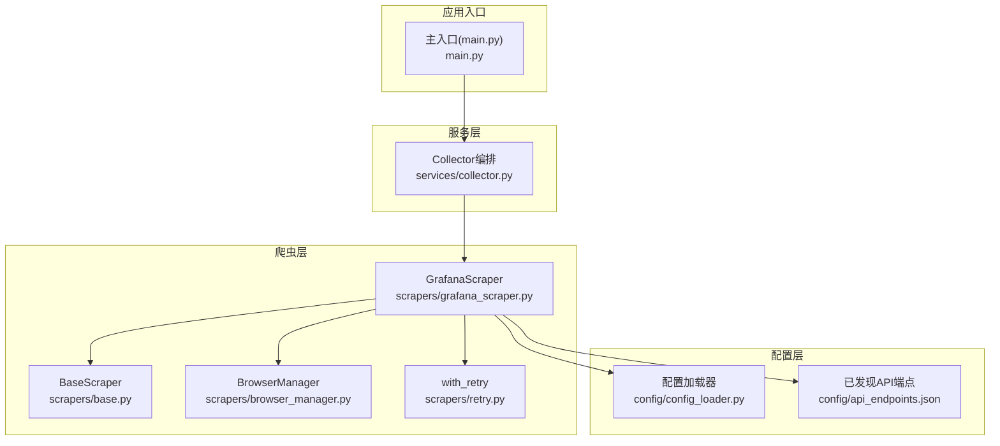
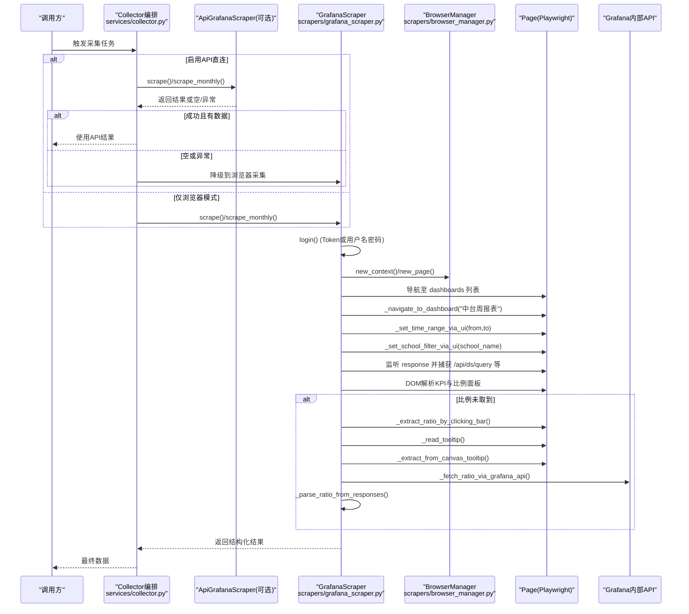
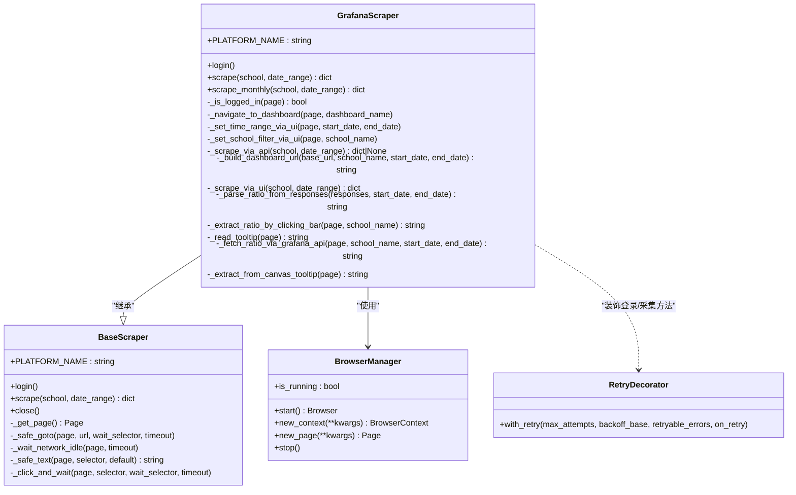
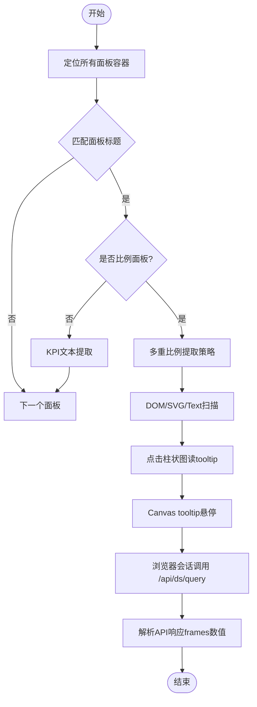
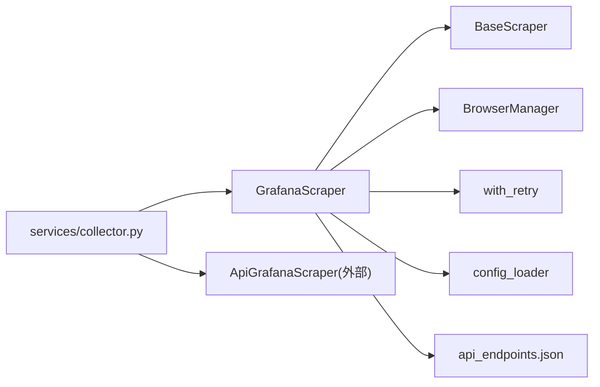

# Grafana爬虫实现

<cite>
**本文引用的文件**
- [scrapers/grafana_scraper.py](file://middle-platform-data-collector-master/scrapers/grafana_scraper.py)
- [scrapers/base.py](file://middle-platform-data-collector-master/scrapers/base.py)
- [scrapers/browser_manager.py](file://middle-platform-data-collector-master/scrapers/browser_manager.py)
- [scrapers/retry.py](file://middle-platform-data-collector-master/scrapers/retry.py)
- [config/config_loader.py](file://middle-platform-data-collector-master/config/config_loader.py)
- [config/api_endpoints.json](file://middle-platform-data-collector-master/config/api_endpoints.json)
- [services/collector.py](file://middle-platform-data-collector-master/services/collector.py)
- [main.py](file://middle-platform-data-collector-master/main.py)
</cite>

## 目录
1. [简介](#简介)
2. [项目结构](#项目结构)
3. [核心组件](#核心组件)
4. [架构总览](#架构总览)
5. [详细组件分析](#详细组件分析)
6. [依赖关系分析](#依赖关系分析)
7. [性能与稳定性优化](#性能与稳定性优化)
8. [故障排查指南](#故障排查指南)
9. [结论](#结论)
10. [附录：配置示例与常见问题](#附录配置示例与常见问题)

## 简介
本技术文档聚焦于 Grafana 爬虫的实现，围绕 GrafanaScraper 类展开，系统性说明其双模式数据采集策略（API优先+UI回退）、登录认证机制（支持 API Token 和用户名密码）、仪表板导航、时间范围与学校筛选参数处理、面板数据解析算法，以及 KPI 面板与图表面板的差异化提取策略。同时覆盖百分比值的多重提取方法（DOM解析、Canvas tooltip、API响应分析）、错误重试机制、网络请求拦截、性能优化技巧，并提供配置示例与常见问题解决方案。

## 项目结构
本项目采用分层组织方式：
- scrapers：各平台爬虫实现，包含 Grafana 爬虫、浏览器管理、重试装饰器等
- config：配置加载与已发现的 API 端点信息
- services：采集编排与服务层逻辑
- web：Web 服务入口与路由
- models：数据模型定义
- tools：辅助工具脚本

图表来源
- [scrapers/grafana_scraper.py:1-120](file://middle-platform-data-collector-master/scrapers/grafana_scraper.py#L1-L120)
- [scrapers/base.py:12-104](file://middle-platform-data-collector-master/scrapers/base.py#L12-L104)
- [scrapers/browser_manager.py:11-76](file://middle-platform-data-collector-master/scrapers/browser_manager.py#L11-L76)
- [scrapers/retry.py:13-82](file://middle-platform-data-collector-master/scrapers/retry.py#L13-L82)
- [config/config_loader.py:21-147](file://middle-platform-data-collector-master/config/config_loader.py#L21-L147)
- [config/api_endpoints.json:1-120](file://middle-platform-data-collector-master/config/api_endpoints.json#L1-L120)
- [services/collector.py:349-381](file://middle-platform-data-collector-master/services/collector.py#L349-L381)
- [main.py:10-42](file://middle-platform-data-collector-master/main.py#L10-L42)

章节来源
- [main.py:10-42](file://middle-platform-data-collector-master/main.py#L10-L42)
- [services/collector.py:349-381](file://middle-platform-data-collector-master/services/collector.py#L349-L381)

## 核心组件
- GrafanaScraper：核心爬虫类，负责登录、导航、设置时间与学校筛选、KPI与图表数据提取、多重百分比提取策略、API直调兜底等
- BaseScraper：异步爬虫抽象基类，提供页面生命周期管理与通用辅助方法
- BrowserManager：Playwright 浏览器实例与上下文管理
- with_retry：指数退避重试装饰器，适用于同步/异步函数
- config_loader：统一配置加载与凭证获取
- api_endpoints.json：已发现的 Grafana dashboard UID 与面板元数据

章节来源
- [scrapers/grafana_scraper.py:48-1251](file://middle-platform-data-collector-master/scrapers/grafana_scraper.py#L48-L1251)
- [scrapers/base.py:12-104](file://middle-platform-data-collector-master/scrapers/base.py#L12-L104)
- [scrapers/browser_manager.py:11-76](file://middle-platform-data-collector-master/scrapers/browser_manager.py#L11-L76)
- [scrapers/retry.py:13-82](file://middle-platform-data-collector-master/scrapers/retry.py#L13-L82)
- [config/config_loader.py:21-147](file://middle-platform-data-collector-master/config/config_loader.py#L21-L147)
- [config/api_endpoints.json:1-120](file://middle-platform-data-collector-master/config/api_endpoints.json#L1-L120)

## 架构总览
GrafanaScraper 在采集流程中遵循“API优先 + UI回退”的双模式策略：
- 若具备 API Token，尝试通过 HTTP API 直接获取数据；失败或无 Token 时，进入 UI 模式
- UI 模式下，使用 Playwright 控制浏览器完成登录、导航、设置时间与学校筛选、捕获网络响应、DOM 解析、Canvas tooltip 读取、以及通过浏览器会话调用 Grafana 内部 API 进行二次验证

图表来源
- [services/collector.py:349-381](file://middle-platform-data-collector-master/services/collector.py#L349-L381)
- [scrapers/grafana_scraper.py:1230-1251](file://middle-platform-data-collector-master/scrapers/grafana_scraper.py#L1230-L1251)
- [scrapers/grafana_scraper.py:56-143](file://middle-platform-data-collector-master/scrapers/grafana_scraper.py#L56-L143)
- [scrapers/grafana_scraper.py:159-226](file://middle-platform-data-collector-master/scrapers/grafana_scraper.py#L159-L226)
- [scrapers/grafana_scraper.py:227-282](file://middle-platform-data-collector-master/scrapers/grafana_scraper.py#L227-L282)
- [scrapers/grafana_scraper.py:327-598](file://middle-platform-data-collector-master/scrapers/grafana_scraper.py#L327-L598)
- [scrapers/grafana_scraper.py:928-1109](file://middle-platform-data-collector-master/scrapers/grafana_scraper.py#L928-L1109)
- [scrapers/grafana_scraper.py:1111-1228](file://middle-platform-data-collector-master/scrapers/grafana_scraper.py#L1111-L1228)
- [scrapers/grafana_scraper.py:600-733](file://middle-platform-data-collector-master/scrapers/grafana_scraper.py#L600-L733)

## 详细组件分析

### GrafanaScraper 类设计
- 继承自 BaseScraper，复用页面生命周期与通用辅助方法
- 支持两种认证方式：
  - API Token：跳过浏览器登录，直接进入 API 模式
  - 用户名密码：通过 Playwright 自动填写表单并提交，多重检测登录成功
- 仪表板导航：从 dashboards 列表页查找目标 dashboard，支持点击匹配与搜索框输入
- 时间范围与学校筛选：通过修改 URL 参数 from/to 与 var-school/var-school_name 等变量生效
- 数据提取：
  - KPI 面板：标准 panel-content 文本提取
  - 比例面板：SVG text、data-label/value、全页面文本扫描、点击柱状图详情、Canvas tooltip、Grafana API 直调、API 响应解析等多重策略
- 错误重试：关键方法使用 with_retry 装饰器，指数退避

图表来源
- [scrapers/base.py:12-104](file://middle-platform-data-collector-master/scrapers/base.py#L12-L104)
- [scrapers/grafana_scraper.py:48-1251](file://middle-platform-data-collector-master/scrapers/grafana_scraper.py#L48-L1251)
- [scrapers/browser_manager.py:11-76](file://middle-platform-data-collector-master/scrapers/browser_manager.py#L11-L76)
- [scrapers/retry.py:13-82](file://middle-platform-data-collector-master/scrapers/retry.py#L13-L82)

章节来源
- [scrapers/grafana_scraper.py:48-1251](file://middle-platform-data-collector-master/scrapers/grafana_scraper.py#L48-L1251)
- [scrapers/base.py:12-104](file://middle-platform-data-collector-master/scrapers/base.py#L12-L104)
- [scrapers/browser_manager.py:11-76](file://middle-platform-data-collector-master/scrapers/browser_manager.py#L11-L76)
- [scrapers/retry.py:13-82](file://middle-platform-data-collector-master/scrapers/retry.py#L13-L82)

### 登录认证机制
- 若配置中存在 api_token，则标记为已登录并跳过浏览器登录流程
- 否则打开 dashboards 列表页，自动跳转登录页，填充用户名与密码并提交
- 登录成功检测采用三重策略：CSS选择器匹配、URL变化检测、登录表单消失检测
- 登录后清理 localStorage/sessionStorage，避免缓存干扰

章节来源
- [scrapers/grafana_scraper.py:56-143](file://middle-platform-data-collector-master/scrapers/grafana_scraper.py#L56-L143)
- [config/config_loader.py:109-119](file://middle-platform-data-collector-master/config/config_loader.py#L109-L119)

### 仪表板导航与参数设置
- 导航：从 dashboards 列表页查找目标 dashboard，支持文本匹配与搜索框输入
- 时间范围：通过 JS 修改 URL 的 from/to 参数（本地时区毫秒时间戳），刷新页面
- 学校筛选：设置 var-school_name 与 var-school 变量，必要时重置 var-school_id 与 exclude_tianli_user_id 为 $__all

章节来源
- [scrapers/grafana_scraper.py:159-226](file://middle-platform-data-collector-master/scrapers/grafana_scraper.py#L159-L226)
- [scrapers/grafana_scraper.py:227-282](file://middle-platform-data-collector-master/scrapers/grafana_scraper.py#L227-L282)
- [scrapers/grafana_scraper.py:297-326](file://middle-platform-data-collector-master/scrapers/grafana_scraper.py#L297-L326)

### 面板数据解析算法
- KPI 面板：定位 panel-container 与 panel-title h2，提取 panel-content 文本节点或首元素文本
- 比例面板：
  - SVG text 与 data-label/value 元素扫描
  - 全页面文本树遍历，排除标题文本
  - 点击柱状图后读取 tooltip 中的百分比
  - Canvas tooltip 模拟鼠标悬停，解析 uPlot 相关元素
  - 通过浏览器会话调用 /api/ds/query 获取面板 targets 数据，解析 frames 数值
  - 从捕获的 API 响应中抽取最后一个 0~100 范围内的数值，格式化百分比

图表来源
- [scrapers/grafana_scraper.py:327-598](file://middle-platform-data-collector-master/scrapers/grafana_scraper.py#L327-L598)
- [scrapers/grafana_scraper.py:600-733](file://middle-platform-data-collector-master/scrapers/grafana_scraper.py#L600-L733)
- [scrapers/grafana_scraper.py:734-853](file://middle-platform-data-collector-master/scrapers/grafana_scraper.py#L734-L853)
- [scrapers/grafana_scraper.py:855-926](file://middle-platform-data-collector-master/scrapers/grafana_scraper.py#L855-L926)
- [scrapers/grafana_scraper.py:928-1109](file://middle-platform-data-collector-master/scrapers/grafana_scraper.py#L928-L1109)
- [scrapers/grafana_scraper.py:1111-1228](file://middle-platform-data-collector-master/scrapers/grafana_scraper.py#L1111-L1228)

章节来源
- [scrapers/grafana_scraper.py:327-598](file://middle-platform-data-collector-master/scrapers/grafana_scraper.py#L327-L598)
- [scrapers/grafana_scraper.py:600-733](file://middle-platform-data-collector-master/scrapers/grafana_scraper.py#L600-L733)
- [scrapers/grafana_scraper.py:734-853](file://middle-platform-data-collector-master/scrapers/grafana_scraper.py#L734-L853)
- [scrapers/grafana_scraper.py:855-926](file://middle-platform-data-collector-master/scrapers/grafana_scraper.py#L855-L926)
- [scrapers/grafana_scraper.py:928-1109](file://middle-platform-data-collector-master/scrapers/grafana_scraper.py#L928-L1109)
- [scrapers/grafana_scraper.py:1111-1228](file://middle-platform-data-collector-master/scrapers/grafana_scraper.py#L1111-L1228)

### 双模式数据采集策略（API优先+UI回退）
- API优先：若存在 api_token，尝试通过 HTTP API 获取数据；当前实现中 _scrape_via_api 预留接口，实际由上层 collector 协调 ApiGrafanaScraper 执行
- UI回退：若无 API 数据或失败，进入 UI 模式，通过浏览器完成全流程采集
- 上层编排：services/collector.py 先尝试 ApiGrafanaScraper，失败或空数据则降级到 GrafanaScraper

章节来源
- [scrapers/grafana_scraper.py:284-296](file://middle-platform-data-collector-master/scrapers/grafana_scraper.py#L284-L296)
- [services/collector.py:349-381](file://middle-platform-data-collector-master/services/collector.py#L349-L381)

### 月度活跃度采集
- 针对“中台使用统计”dashboard，按月度维度提取日活、周活、月活教师占比
- 采用滚动懒加载策略逐步下滑页面以加载面板，再提取 stat 面板与表格数据
- 对“学校教师总数”字段进行多路径解析（role=row 表格、cell扫描、正则匹配）

章节来源
- [scrapers/grafana_scraper.py:1265-1600](file://middle-platform-data-collector-master/scrapers/grafana_scraper.py#L1265-L1600)

## 依赖关系分析
- GrafanaScraper 依赖：
  - BaseScraper：页面生命周期与通用方法
  - BrowserManager：Playwright 浏览器与上下文管理
  - with_retry：重试装饰器
  - config_loader：凭证与浏览器配置
  - api_endpoints.json：dashboard UID 与面板元数据（用于诊断与API直调）
- services/collector.py 作为编排层，协调 ApiGrafanaScraper 与 GrafanaScraper 的调用顺序与降级策略

图表来源
- [scrapers/grafana_scraper.py:48-1251](file://middle-platform-data-collector-master/scrapers/grafana_scraper.py#L48-L1251)
- [scrapers/base.py:12-104](file://middle-platform-data-collector-master/scrapers/base.py#L12-L104)
- [scrapers/browser_manager.py:11-76](file://middle-platform-data-collector-master/scrapers/browser_manager.py#L11-L76)
- [scrapers/retry.py:13-82](file://middle-platform-data-collector-master/scrapers/retry.py#L13-L82)
- [config/config_loader.py:21-147](file://middle-platform-data-collector-master/config/config_loader.py#L21-L147)
- [config/api_endpoints.json:1-120](file://middle-platform-data-collector-master/config/api_endpoints.json#L1-L120)
- [services/collector.py:349-381](file://middle-platform-data-collector-master/services/collector.py#L349-L381)

章节来源
- [services/collector.py:349-381](file://middle-platform-data-collector-master/services/collector.py#L349-L381)

## 性能与稳定性优化
- 网络空闲等待：使用 networkidle 等待 SPA 数据加载完成，避免过早解析导致缺失数据
- 存储清理：登录后清除 localStorage/sessionStorage，避免旧数据影响
- 视口设置：无头模式下固定视口尺寸，确保渲染一致性
- 超时与重试：默认超时与指数退避重试，提升容错能力
- 懒加载处理：月度采集中逐步滚动页面，确保面板被加载到 DOM
- 最小化交互：优先通过 URL 参数设置时间与筛选，减少不必要的 UI 操作

章节来源
- [scrapers/base.py:82-88](file://middle-platform-data-collector-master/scrapers/base.py#L82-L88)
- [scrapers/grafana_scraper.py:134-143](file://middle-platform-data-collector-master/scrapers/grafana_scraper.py#L134-L143)
- [scrapers/browser_manager.py:37-56](file://middle-platform-data-collector-master/scrapers/browser_manager.py#L37-L56)
- [scrapers/retry.py:13-82](file://middle-platform-data-collector-master/scrapers/retry.py#L13-L82)
- [scrapers/grafana_scraper.py:1480-1513](file://middle-platform-data-collector-master/scrapers/grafana_scraper.py#L1480-L1513)

## 故障排查指南
- 登录失败：检查 CSS 选择器与 URL 变化检测日志；确认用户名密码或 lida 凭证是否正确
- 面板未找到：查看面板标题诊断输出，确认 dashboard 名称与标题映射
- 比例值缺失：依次检查 DOM/SVG 扫描、点击 tooltip、Canvas tooltip、API 直调与响应解析日志
- API 响应为空：确认 captured_responses 数量与内容，检查 frames 结构与数值范围
- 懒加载问题：增加滚动次数与等待时间，确保面板出现在 DOM 中

章节来源
- [scrapers/grafana_scraper.py:56-143](file://middle-platform-data-collector-master/scrapers/grafana_scraper.py#L56-L143)
- [scrapers/grafana_scraper.py:389-406](file://middle-platform-data-collector-master/scrapers/grafana_scraper.py#L389-L406)
- [scrapers/grafana_scraper.py:496-598](file://middle-platform-data-collector-master/scrapers/grafana_scraper.py#L496-L598)
- [scrapers/grafana_scraper.py:600-733](file://middle-platform-data-collector-master/scrapers/grafana_scraper.py#L600-L733)
- [scrapers/grafana_scraper.py:1480-1513](file://middle-platform-data-collector-master/scrapers/grafana_scraper.py#L1480-L1513)

## 结论
GrafanaScraper 实现了稳健且可扩展的 Grafana 数据采集方案，通过 API 优先与 UI 回退的双模式策略，结合多重百分比提取方法与完善的错误重试机制，有效应对复杂动态页面的数据抓取挑战。配合 services/collector.py 的编排与 BrowserManager 的生命周期管理，整体架构具备良好的可维护性与扩展性。

## 附录：配置示例与常见问题

### 配置示例
- credentials.grafana：
  - api_token：可选，若存在则优先使用 API 模式
  - username/password：用户名密码登录所需
- browser：
  - headless：是否无头模式
  - slow_mo：操作延迟（调试用）
  - default_timeout：默认超时

章节来源
- [config/config_loader.py:39-74](file://middle-platform-data-collector-master/config/config_loader.py#L39-L74)
- [config/config_loader.py:94-96](file://middle-platform-data-collector-master/config/config_loader.py#L94-L96)

### 常见问题
- 无法登录：确认凭据正确，检查登录成功检测逻辑与日志
- 比例值始终为空：检查面板标题映射、DOM/SVG 扫描、tooltip 与 Canvas tooltip 策略、API 直调与响应解析
- 数据不完整：调整网络空闲等待与懒加载滚动策略，确保面板完全渲染
- API 模式不可用：确保 api_token 配置正确，或允许降级到浏览器模式

章节来源
- [scrapers/grafana_scraper.py:56-143](file://middle-platform-data-collector-master/scrapers/grafana_scraper.py#L56-L143)
- [scrapers/grafana_scraper.py:327-598](file://middle-platform-data-collector-master/scrapers/grafana_scraper.py#L327-L598)
- [scrapers/grafana_scraper.py:600-733](file://middle-platform-data-collector-master/scrapers/grafana_scraper.py#L600-L733)
- [services/collector.py:349-381](file://middle-platform-data-collector-master/services/collector.py#L349-L381)