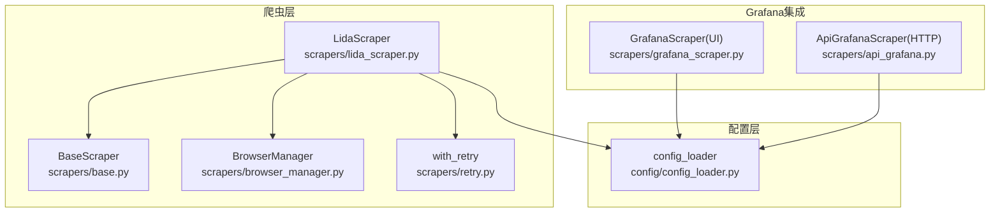
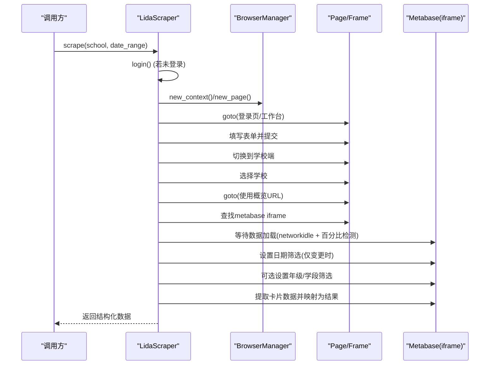
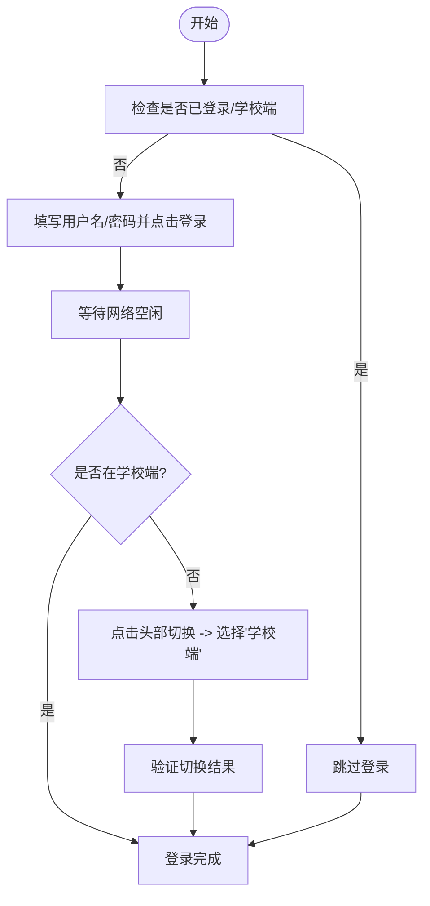
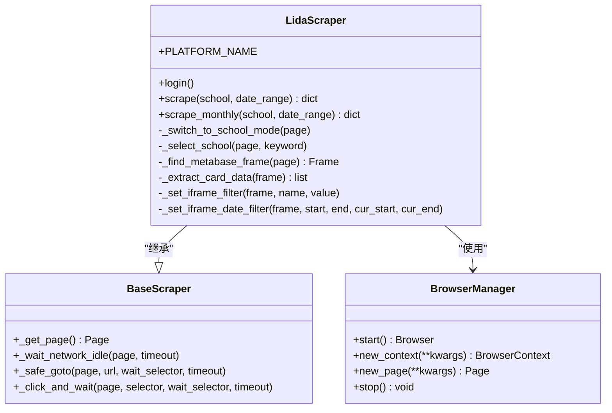
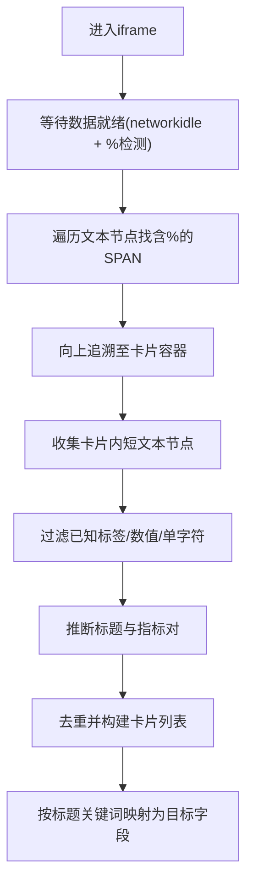
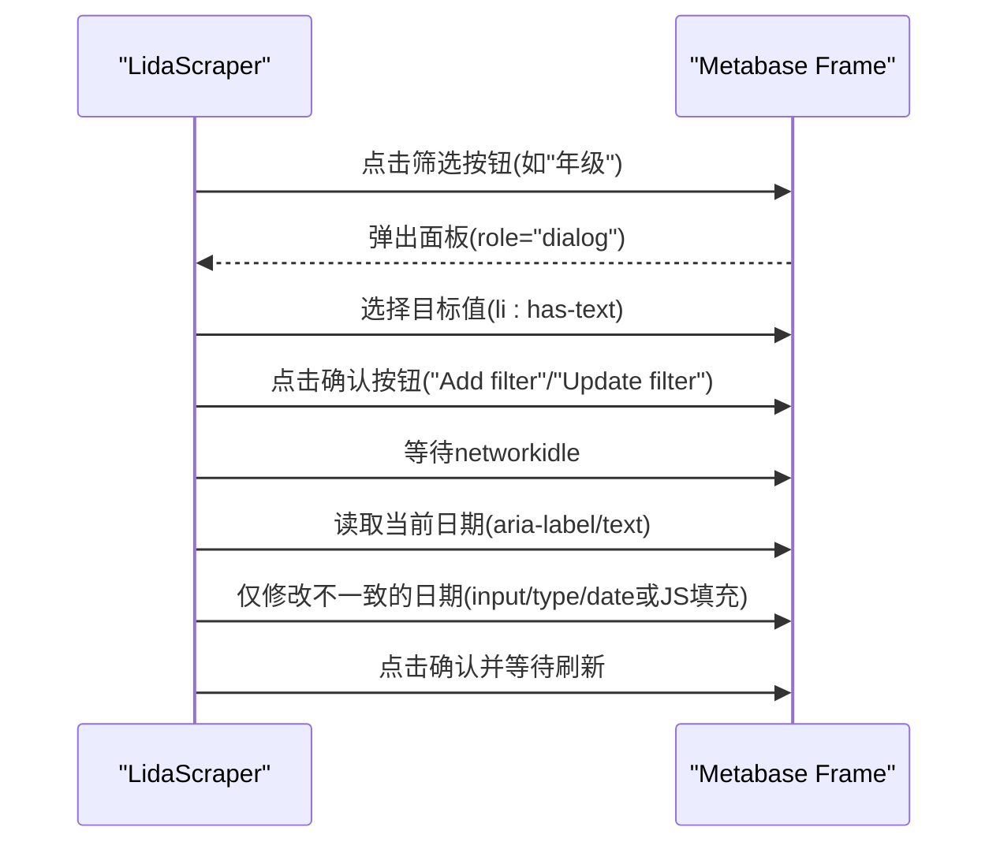
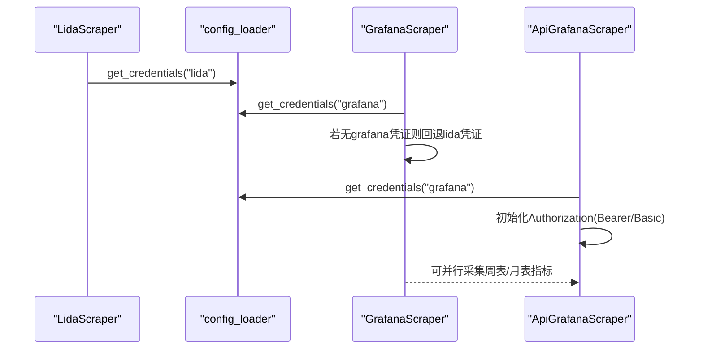
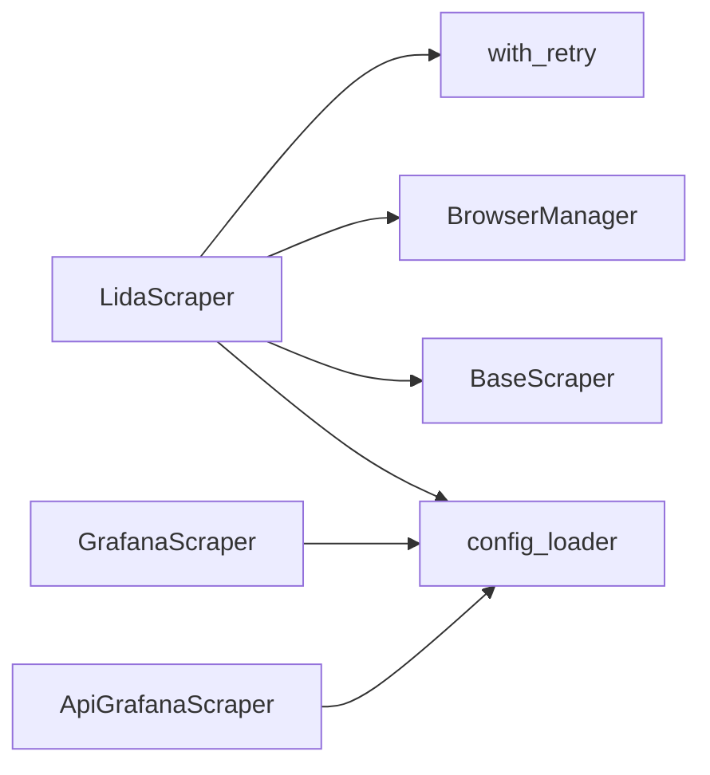

# Lida爬虫实现

<cite>
**本文引用的文件**   
- [lida_scraper.py](file://scrapers/lida_scraper.py)
- [base.py](file://scrapers/base.py)
- [browser_manager.py](file://scrapers/browser_manager.py)
- [retry.py](file://scrapers/retry.py)
- [config_loader.py](file://config/config_loader.py)
- [grafana_scraper.py](file://scrapers/grafana_scraper.py)
- [api_grafana.py](file://scrapers/api_grafana.py)
- [test_lida_login.py](file://tools/test_lida_login.py)
</cite>

## 目录
1. [简介](#简介)
2. [项目结构](#项目结构)
3. [核心组件](#核心组件)
4. [架构总览](#架构总览)
5. [详细组件分析](#详细组件分析)
6. [依赖关系分析](#依赖关系分析)
7. [性能与并发](#性能与并发)
8. [故障排查指南](#故障排查指南)
9. [结论](#结论)
10. [附录：配置与调试](#附录配置与调试)

## 简介
本技术文档聚焦于Lida平台爬虫（LidaScraper）的实现，系统性说明其登录认证流程、表单提交、Cookie与会话保持机制；页面结构分析与数据选择器定位；表格/卡片数据提取逻辑；验证码处理策略与反爬绕过思路；异常状态检测；以及与Grafana平台的凭证共享与统一接口适配方法。同时涵盖网络请求优化、并发控制、错误恢复策略，并提供配置参数与调试技巧。

## 项目结构
围绕Lida采集的核心代码位于 scrapers 目录，配合浏览器生命周期管理、重试装饰器与配置加载模块协同工作。关键文件职责如下：
- scrapers/lida_scraper.py：Lida平台异步爬虫主实现，负责登录、切换学校端、选择学校、导航到使用概览、操作Metabase iframe筛选与数据提取。
- scrapers/base.py：所有平台爬虫的抽象基类，提供上下文/页面生命周期、通用等待与点击辅助方法。
- scrapers/browser_manager.py：Playwright浏览器实例与上下文管理，支持无头/有头模式、默认超时、CSP绕过等。
- scrapers/retry.py：通用重试装饰器，指数退避，自动区分同步/异步函数。
- config/config_loader.py：配置文件加载与校验，提供 get_credentials、get_browser_config 等工具。
- scrapers/grafana_scraper.py 与 scrapers/api_grafana.py：Grafana UI与HTTP API双通道采集器，用于与Lida数据对比或补充指标。
- tools/test_lida_login.py：Lida登录与路由探测脚本，辅助发现API与前端路由。

**图表来源**
- [lida_scraper.py:1-120](file://scrapers/lida_scraper.py#L1-L120)
- [base.py:12-104](file://scrapers/base.py#L12-L104)
- [browser_manager.py:11-76](file://scrapers/browser_manager.py#L11-L76)
- [retry.py:1-82](file://scrapers/retry.py#L1-L82)
- [config_loader.py:89-147](file://config/config_loader.py#L89-L147)
- [grafana_scraper.py:48-143](file://scrapers/grafana_scraper.py#L48-L143)
- [api_grafana.py:43-82](file://scrapers/api_grafana.py#L43-L82)

**章节来源**
- [lida_scraper.py:1-120](file://scrapers/lida_scraper.py#L1-L120)
- [base.py:12-104](file://scrapers/base.py#L12-L104)
- [browser_manager.py:11-76](file://scrapers/browser_manager.py#L11-L76)
- [retry.py:1-82](file://scrapers/retry.py#L1-L82)
- [config_loader.py:89-147](file://config/config_loader.py#L89-L147)
- [grafana_scraper.py:48-143](file://scrapers/grafana_scraper.py#L48-L143)
- [api_grafana.py:43-82](file://scrapers/api_grafana.py#L43-L82)

## 核心组件
- LidaScraper：继承自 BaseScraper，封装Lida平台登录、模式切换、学校选择、iframe筛选与数据提取。
- BaseScraper：提供 _get_page、_wait_network_idle、_safe_goto、_click_and_wait 等通用能力。
- BrowserManager：启动Chromium、创建Context/Page、设置默认超时与视口、清理缓存。
- with_retry：对登录与采集方法进行指数退避重试，提升稳定性。
- config_loader：集中读取 credentials 与 browser 配置，支持用户级覆盖。

**章节来源**
- [lida_scraper.py:35-120](file://scrapers/lida_scraper.py#L35-L120)
- [base.py:12-104](file://scrapers/base.py#L12-L104)
- [browser_manager.py:11-76](file://scrapers/browser_manager.py#L11-L76)
- [retry.py:13-82](file://scrapers/retry.py#L13-L82)
- [config_loader.py:89-147](file://config/config_loader.py#L89-L147)

## 架构总览
LidaScraper通过Playwright驱动Chromium访问Lida前端SPA，完成登录与模式切换后进入“使用概览”页面，该页面内嵌Metabase仪表板（iframe）。爬虫在iframe中执行日期与维度筛选，并通过DOM遍历与文本匹配提取卡片数值。整体流程强调智能等待、多策略选择器与健壮的错误恢复。

**图表来源**
- [lida_scraper.py:44-133](file://scrapers/lida_scraper.py#L44-L133)
- [lida_scraper.py:816-920](file://scrapers/lida_scraper.py#L816-L920)
- [lida_scraper.py:235-273](file://scrapers/lida_scraper.py#L235-L273)
- [lida_scraper.py:434-502](file://scrapers/lida_scraper.py#L434-L502)
- [lida_scraper.py:578-610](file://scrapers/lida_scraper.py#L578-L610)
- [lida_scraper.py:274-396](file://scrapers/lida_scraper.py#L274-L396)

## 详细组件分析

### LidaScraper 登录认证流程
- 登录入口：login 方法使用 with_retry 装饰，确保在网络波动或临时不可用时自动重试。
- 表单提交：通过Element UI选择器定位用户名、密码输入框与登录按钮，依次 fill 与 click。
- 会话保持：基于 BrowserManager 创建的 BrowserContext 维持 Cookie 与存储；登录后检查是否处于“学校端”，否则执行切换。
- 模式切换：优先通过 header_switch 文本判断当前模式；必要时触发UI点击并等待网络空闲；附带cookie探测日志便于分析模式相关Cookie键名。
- 登录成功判定：若已在学校端且无需再次登录，直接标记 _logged_in = True。

**图表来源**
- [lida_scraper.py:44-76](file://scrapers/lida_scraper.py#L44-L76)
- [lida_scraper.py:77-133](file://scrapers/lida_scraper.py#L77-L133)

**章节来源**
- [lida_scraper.py:44-133](file://scrapers/lida_scraper.py#L44-L133)
- [retry.py:13-82](file://scrapers/retry.py#L13-L82)
- [browser_manager.py:37-56](file://scrapers/browser_manager.py#L37-L56)

### 页面结构分析与数据选择器定位
- 登录页选择器：Element UI 输入框与按钮可见性选择器。
- 模式切换：header-switch 元素文本包含“学校”即表示学校端。
- 学校选择器：右上角下拉菜单（el-dropdown），通过JS触发mouseenter打开菜单，再精确匹配/子串匹配选项文本。
- Metabase iframe：按URL关键字“metabase”定位frame；等待networkidle并结合TreeWalker扫描包含“%”的短文本作为数据就绪信号。

**图表来源**
- [lida_scraper.py:35-120](file://scrapers/lida_scraper.py#L35-L120)
- [base.py:12-104](file://scrapers/base.py#L12-L104)
- [browser_manager.py:11-76](file://scrapers/browser_manager.py#L11-L76)

**章节来源**
- [lida_scraper.py:17-33](file://scrapers/lida_scraper.py#L17-L33)
- [lida_scraper.py:152-233](file://scrapers/lida_scraper.py#L152-L233)
- [lida_scraper.py:235-273](file://scrapers/lida_scraper.py#L235-L273)

### 表格/卡片数据提取逻辑
- 卡片解析：在iframe中使用TreeWalker遍历文本节点，识别包含“%”的SPAN，向上追溯至react-grid-layout的直接子元素（卡片容器），收集短文本节点，过滤已知标签与纯数字，推断标题与指标值。
- 字段映射：将“总体/平台总”卡片映射为整体使用率；“集备”卡片映射为集备使用率/访问次数。
- 月度扩展：支持按学段（高中/初中/小学）切换筛选，分别提取平台使用率与集备、组卷数据。

**图表来源**
- [lida_scraper.py:274-396](file://scrapers/lida_scraper.py#L274-L396)
- [lida_scraper.py:398-432](file://scrapers/lida_scraper.py#L398-L432)
- [lida_scraper.py:967-998](file://scrapers/lida_scraper.py#L967-L998)

**章节来源**
- [lida_scraper.py:274-396](file://scrapers/lida_scraper.py#L274-L396)
- [lida_scraper.py:398-432](file://scrapers/lida_scraper.py#L398-L432)
- [lida_scraper.py:967-998](file://scrapers/lida_scraper.py#L967-L998)

### 筛选器与日期设置策略
- 维度筛选（学段/年级）：点击对应按钮，等待弹出面板（role="dialog"），选择目标值后点击“Add filter/Update filter”确认，随后等待networkidle刷新。
- 日期筛选：先读取当前起始/结束日期，仅当不一致时才修改；每个日期按钮点击后通过多种策略定位输入框（input[type=date]、JS注入value+事件、遍历visible input），最后点击确认按钮并等待刷新。

**图表来源**
- [lida_scraper.py:434-502](file://scrapers/lida_scraper.py#L434-L502)
- [lida_scraper.py:503-577](file://scrapers/lida_scraper.py#L503-L577)
- [lida_scraper.py:578-610](file://scrapers/lida_scraper.py#L578-L610)
- [lida_scraper.py:611-814](file://scrapers/lida_scraper.py#L611-L814)

**章节来源**
- [lida_scraper.py:434-502](file://scrapers/lida_scraper.py#L434-L502)
- [lida_scraper.py:503-577](file://scrapers/lida_scraper.py#L503-L577)
- [lida_scraper.py:578-610](file://scrapers/lida_scraper.py#L578-L610)
- [lida_scraper.py:611-814](file://scrapers/lida_scraper.py#L611-L814)

### 验证码处理与反爬虫绕过
- 验证码：当前实现未显式处理验证码。若出现验证码，建议引入OCR服务或第三方打码平台，并在登录失败分支中插入验证码识别与重试逻辑。
- 反爬绕过：
  - 启用CSP绕过（BrowserManager新context时设置bypass_csp=True）。
  - 使用稳定的选择器与多策略回退（JS触发事件、文本匹配、属性匹配）。
  - 合理等待（networkidle + 内容就绪检测），避免过早抓取导致空数据。
  - 记录Cookie键名与页面诊断信息，便于快速定位问题。

**章节来源**
- [browser_manager.py:37-56](file://scrapers/browser_manager.py#L37-L56)
- [lida_scraper.py:89-133](file://scrapers/lida_scraper.py#L89-L133)

### 异常状态检测与错误恢复
- 登录失败：通过CSS选择器、URL变化、表单消失等多重方式检测登录成功；任一失败则抛出异常并由with_retry重试。
- 数据加载失败：等待networkidle与百分比检测双重保障；若仍失败，记录警告并继续执行，保证后续流程不中断。
- 筛选失败：捕获异常并记录警告，尝试兜底策略（JS点击、遍历input等）。
- 采集失败：scrape/scrape_monthly均被with_retry包裹，发生TimeoutError/ConnectionError/OSError时指数退避重试。

**章节来源**
- [grafana_scraper.py:56-143](file://scrapers/grafana_scraper.py#L56-L143)
- [lida_scraper.py:242-273](file://scrapers/lida_scraper.py#L242-L273)
- [lida_scraper.py:434-502](file://scrapers/lida_scraper.py#L434-L502)
- [lida_scraper.py:815-920](file://scrapers/lida_scraper.py#L815-L920)
- [retry.py:13-82](file://scrapers/retry.py#L13-L82)

### 与Grafana平台的凭证共享与统一接口适配
- 凭证共享：
  - config_loader.get_credentials(platform) 支持用户级覆盖，允许运行时传入不同平台的username/password。
  - GrafanaScraper在登录时若未配置自身凭证，可回退使用Lida凭证进行登录（便于统一账号体系）。
- 统一接口：
  - GrafanaScraper提供UI方式采集（模拟时间范围与学校变量设置，从面板提取KPI）。
  - ApiGrafanaScraper提供HTTP API直连方式（/api/ds/query），通过替换SQL中的${school_id:csv}/${__to}等变量获取数据，并计算活跃比例。
  - 两者均通过统一的credentials接口获取认证信息，便于集中管理与环境隔离。

**图表来源**
- [config_loader.py:109-119](file://config/config_loader.py#L109-L119)
- [grafana_scraper.py:56-84](file://scrapers/grafana_scraper.py#L56-L84)
- [api_grafana.py:43-82](file://scrapers/api_grafana.py#L43-L82)

**章节来源**
- [config_loader.py:109-119](file://config/config_loader.py#L109-L119)
- [grafana_scraper.py:56-84](file://scrapers/grafana_scraper.py#L56-L84)
- [api_grafana.py:43-82](file://scrapers/api_grafana.py#L43-L82)

## 依赖关系分析
- LidaScraper依赖BaseScraper提供的页面与上下文管理能力，依赖BrowserManager管理浏览器实例，依赖config_loader获取凭证与浏览器配置，依赖with_retry增强鲁棒性。
- GrafanaScraper与ApiGrafanaScraper同样依赖config_loader获取凭证，前者通过UI交互，后者通过HTTP API直连。

**图表来源**
- [lida_scraper.py:12-15](file://scrapers/lida_scraper.py#L12-L15)
- [base.py:12-104](file://scrapers/base.py#L12-L104)
- [browser_manager.py:11-76](file://scrapers/browser_manager.py#L11-L76)
- [retry.py:1-82](file://scrapers/retry.py#L1-L82)
- [config_loader.py:89-147](file://config/config_loader.py#L89-L147)
- [grafana_scraper.py:14-16](file://scrapers/grafana_scraper.py#L14-L16)
- [api_grafana.py:21-22](file://scrapers/api_grafana.py#L21-L22)

**章节来源**
- [lida_scraper.py:12-15](file://scrapers/lida_scraper.py#L12-L15)
- [base.py:12-104](file://scrapers/base.py#L12-L104)
- [browser_manager.py:11-76](file://scrapers/browser_manager.py#L11-L76)
- [retry.py:1-82](file://scrapers/retry.py#L1-L82)
- [config_loader.py:89-147](file://config/config_loader.py#L89-L147)
- [grafana_scraper.py:14-16](file://scrapers/grafana_scraper.py#L14-L16)
- [api_grafana.py:21-22](file://scrapers/api_grafana.py#L21-L22)

## 性能与并发
- 网络请求优化：
  - 使用networkidle等待，减少固定sleep带来的延迟。
  - 仅在日期不一致时修改筛选，避免不必要的刷新。
  - 在iframe中采用TreeWalker与正则过滤，降低DOM查询开销。
- 并发控制：
  - 通过多个BrowserContext并行运行不同学校的采集任务（由上层调度器控制）。
  - Grafana HTTP API可通过aiohttp并发请求，结合with_retry提升吞吐。
- 错误恢复：
  - with_retry指数退避适用于登录与采集主流程。
  - 针对特定步骤（如筛选设置）增加局部重试与兜底策略。

[本节为通用指导，不直接分析具体文件]

## 故障排查指南
- 登录失败：
  - 检查CSS选择器是否匹配（用户名/密码/按钮）。
  - 查看URL是否从/login跳转；确认登录表单是否消失。
  - 启用with_retry观察重试日志。
- 学校选择失败：
  - 打印下拉菜单项文本，核对lida_name是否完全匹配。
  - 使用兜底locator子串匹配与force点击。
- iframe数据为空：
  - 确认metabase frame是否存在；等待networkidle与百分比检测。
  - 检查日期筛选是否正确设置，必要时手动调整。
- Grafana数据不一致：
  - 对比UI与API两种方式的结果，定位差异来源。
  - 检查变量替换（var-school_name/var-school）与时间戳格式。

**章节来源**
- [lida_scraper.py:152-233](file://scrapers/lida_scraper.py#L152-L233)
- [lida_scraper.py:235-273](file://scrapers/lida_scraper.py#L235-L273)
- [lida_scraper.py:434-502](file://scrapers/lida_scraper.py#L434-L502)
- [grafana_scraper.py:327-598](file://scrapers/grafana_scraper.py#L327-L598)
- [api_grafana.py:320-523](file://scrapers/api_grafana.py#L320-L523)

## 结论
LidaScraper以Playwright为核心，结合多策略选择器、智能等待与稳健的重试机制，实现了Lida平台的高效数据采集。通过与Grafana的双通道采集（UI与HTTP API）以及统一的凭证管理，系统具备良好的可扩展性与容错能力。建议在出现验证码场景下引入OCR打码方案，并持续优化选择器与等待策略以提升稳定性。

[本节为总结性内容，不直接分析具体文件]

## 附录：配置与调试
- 配置参数（来自config_loader）：
  - browser.headless：是否无头模式。
  - browser.slow_mo：慢动作毫秒数，便于调试。
  - browser.default_timeout：默认超时（ms）。
  - credentials.lida.url/username/password：Lida平台登录信息。
  - credentials.grafana.username/password/api_token：Grafana认证（token优先）。
- 调试技巧：
  - 开启slow_mo与有头模式，观察页面交互过程。
  - 利用日志输出Cookie键名、下拉菜单项文本、iframe诊断信息。
  - 使用tools/test_lida_login.py探测Lida登录与路由，辅助定位API与前端路径。

**章节来源**
- [config_loader.py:39-74](file://config/config_loader.py#L39-L74)
- [config_loader.py:94-96](file://config/config_loader.py#L94-L96)
- [config_loader.py:109-119](file://config/config_loader.py#L109-L119)
- [test_lida_login.py:1-93](file://tools/test_lida_login.py#L1-L93)