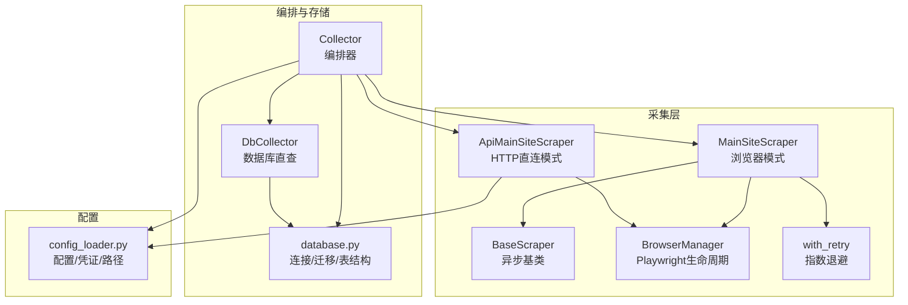
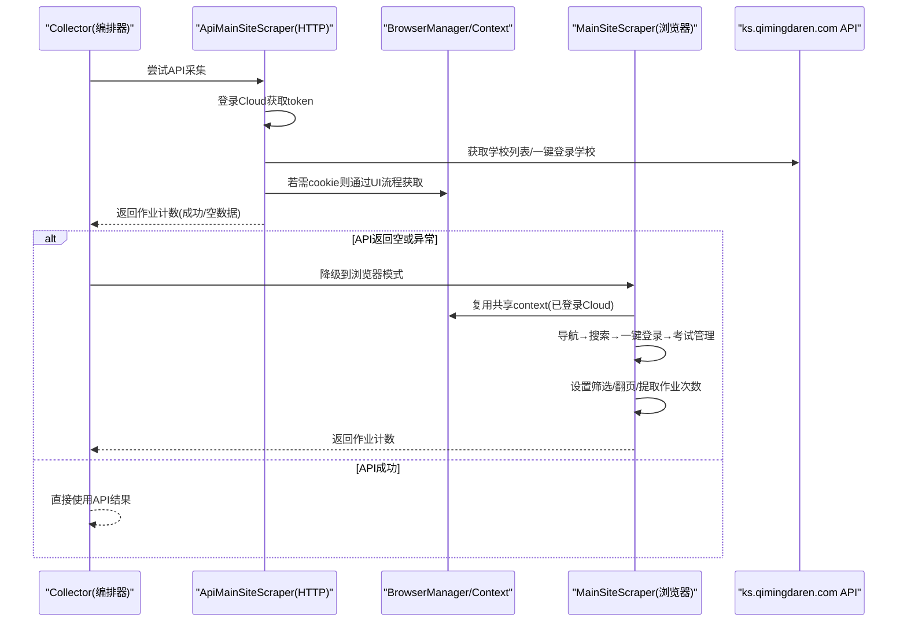
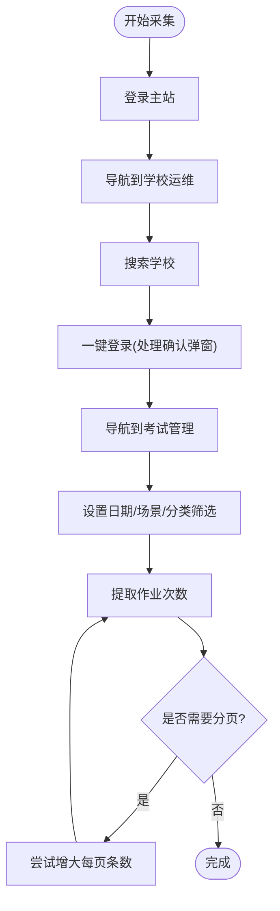
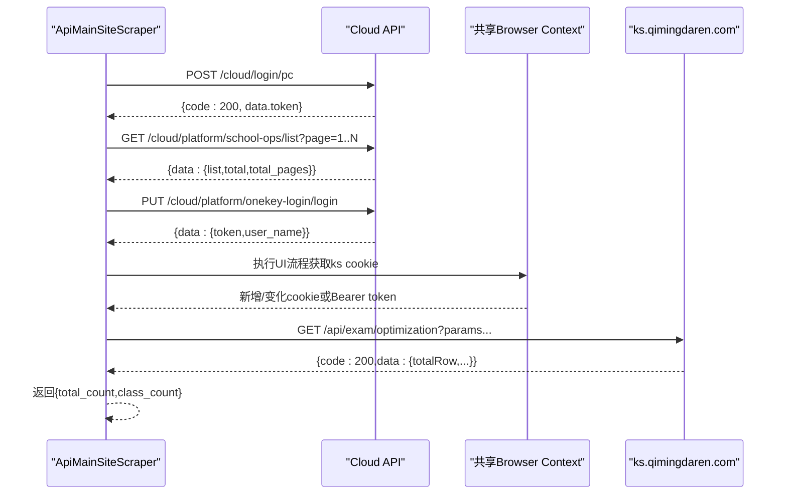
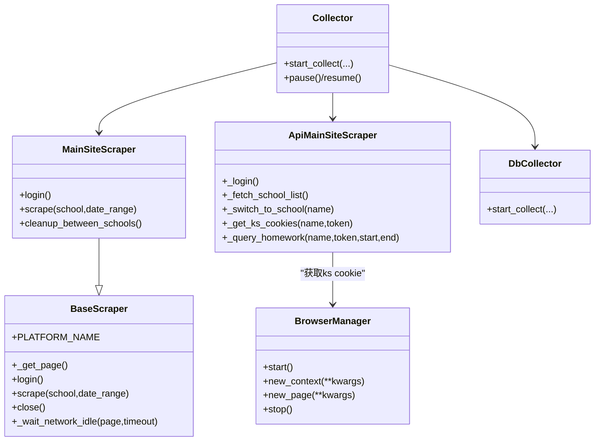

# 主站爬虫实现

<cite>
**本文引用的文件**   
- [scrapers/main_site_scraper.py](file://middle-platform-data-collector-master/scrapers/main_site_scraper.py)
- [scrapers/api_main_site.py](file://middle-platform-data-collector-master/scrapers/api_main_site.py)
- [scrapers/base.py](file://middle-platform-data-collector-master/scrapers/base.py)
- [scrapers/browser_manager.py](file://middle-platform-data-collector-master/scrapers/browser_manager.py)
- [scrapers/retry.py](file://middle-platform-data-collector-master/scrapers/retry.py)
- [services/collector.py](file://middle-platform-data-collector-master/services/collector.py)
- [services/db_collector.py](file://middle-platform-data-collector-master/services/db_collector.py)
- [config/config_loader.py](file://middle-platform-data-collector-master/config/config_loader.py)
- [models/database.py](file://middle-platform-data-collector-master/models/database.py)
</cite>

## 目录
1. [简介](#简介)
2. [项目结构](#项目结构)
3. [核心组件](#核心组件)
4. [架构总览](#架构总览)
5. [详细组件分析](#详细组件分析)
6. [依赖关系分析](#依赖关系分析)
7. [性能与稳定性](#性能与稳定性)
8. [故障排查指南](#故障排查指南)
9. [结论](#结论)
10. [附录：API端点与配置](#附录api端点与配置)

## 简介
本技术文档聚焦“主站爬虫”的实现，围绕 MainSiteScraper 的主站数据采集策略展开，涵盖多页面导航、动态内容加载、分页数据处理；同时说明 API 接口封装与 RESTful 集成、数据格式转换逻辑、页面结构变化适应机制（CSS/XPath 选择器与 JS 注入）、与数据库采集器的协作关系、数据一致性与增量更新策略，以及请求频率控制与资源使用监控。文末提供 API 端点配置与性能调优建议。

## 项目结构
与主站爬虫相关的代码主要分布在 scrapers、services、config、models 四个层次：
- scrapers：浏览器与 HTTP 两种采集实现（MainSiteScraper、ApiMainSiteScraper）及通用基类与重试装饰器
- services：采集编排器（Collector）与数据库直查采集器（DbCollector）
- config：配置加载与凭证覆盖
- models：SQLite 表结构与迁移、学校数据导入

图表来源
- [scrapers/main_site_scraper.py:1-120](file://middle-platform-data-collector-master/scrapers/main_site_scraper.py#L1-L120)
- [scrapers/api_main_site.py:1-120](file://middle-platform-data-collector-master/scrapers/api_main_site.py#L1-L120)
- [scrapers/base.py:1-104](file://middle-platform-data-collector-master/scrapers/base.py#L1-L104)
- [scrapers/browser_manager.py:1-76](file://middle-platform-data-collector-master/scrapers/browser_manager.py#L1-L76)
- [scrapers/retry.py:1-82](file://middle-platform-data-collector-master/scrapers/retry.py#L1-L82)
- [services/collector.py:1-120](file://middle-platform-data-collector-master/services/collector.py#L1-L120)
- [services/db_collector.py:1-120](file://middle-platform-data-collector-master/services/db_collector.py#L1-L120)
- [config/config_loader.py:1-147](file://middle-platform-data-collector-master/config/config_loader.py#L1-L147)
- [models/database.py:1-120](file://middle-platform-data-collector-master/models/database.py#L1-L120)

章节来源
- [scrapers/main_site_scraper.py:1-120](file://middle-platform-data-collector-master/scrapers/main_site_scraper.py#L1-L120)
- [scrapers/api_main_site.py:1-120](file://middle-platform-data-collector-master/scrapers/api_main_site.py#L1-L120)
- [scrapers/base.py:1-104](file://middle-platform-data-collector-master/scrapers/base.py#L1-L104)
- [scrapers/browser_manager.py:1-76](file://middle-platform-data-collector-master/scrapers/browser_manager.py#L1-L76)
- [scrapers/retry.py:1-82](file://middle-platform-data-collector-master/scrapers/retry.py#L1-L82)
- [services/collector.py:1-120](file://middle-platform-data-collector-master/services/collector.py#L1-L120)
- [services/db_collector.py:1-120](file://middle-platform-data-collector-master/services/db_collector.py#L1-L120)
- [config/config_loader.py:1-147](file://middle-platform-data-collector-master/config/config_loader.py#L1-L147)
- [models/database.py:1-120](file://middle-platform-data-collector-master/models/database.py#L1-L120)

## 核心组件
- MainSiteScraper：基于 Playwright 的浏览器自动化采集，负责登录、导航到运维平台、搜索学校、一键登录进入考试阅卷系统、设置筛选条件并提取作业次数，支持轻量清理与多标签页管理。
- ApiMainSiteScraper：纯 HTTP 直连采集，通过 Cloud 平台登录获取 token，拉取学校列表、一键登录学校、获取 ks cookie 或 Bearer token，调用 ks.qimingdaren.com 的作业优化查询接口，具备自动降级与重试能力。
- BaseScraper：异步爬虫抽象基类，提供上下文/页面生命周期管理、网络空闲等待、安全点击与文本读取等通用方法。
- BrowserManager：Playwright 浏览器实例与上下文创建、默认超时与视口策略、无头/有头模式切换。
- with_retry：通用重试装饰器，指数退避，兼容同步/异步函数。
- Collector：跨平台编排器，按平台顺序执行，支持 API 优先+浏览器降级，合并结果写入数据库，支持暂停/继续与进度事件。
- DbCollector：直接查询 metabase.db 计算活跃度指标，作为 Grafana 替代方案。

章节来源
- [scrapers/main_site_scraper.py:1-120](file://middle-platform-data-collector-master/scrapers/main_site_scraper.py#L1-L120)
- [scrapers/api_main_site.py:1-120](file://middle-platform-data-collector-master/scrapers/api_main_site.py#L1-L120)
- [scrapers/base.py:1-104](file://middle-platform-data-collector-master/scrapers/base.py#L1-L104)
- [scrapers/browser_manager.py:1-76](file://middle-platform-data-collector-master/scrapers/browser_manager.py#L1-L76)
- [scrapers/retry.py:1-82](file://middle-platform-data-collector-master/scrapers/retry.py#L1-L82)
- [services/collector.py:1-120](file://middle-platform-data-collector-master/services/collector.py#L1-L120)
- [services/db_collector.py:1-120](file://middle-platform-data-collector-master/services/db_collector.py#L1-L120)

## 架构总览
主站采集采用“双通道”策略：优先走 API 直连（速度快），失败时自动降级到浏览器模式（兼容性好）。API 模式下，Cloud 登录与会话在共享浏览器上下文中建立一次，后续浏览器复用该上下文进行 UI 操作，避免重复登录导致会话失效。

图表来源
- [services/collector.py:550-730](file://middle-platform-data-collector-master/services/collector.py#L550-L730)
- [scrapers/api_main_site.py:68-120](file://middle-platform-data-collector-master/scrapers/api_main_site.py#L68-L120)
- [scrapers/api_main_site.py:220-290](file://middle-platform-data-collector-master/scrapers/api_main_site.py#L220-L290)
- [scrapers/api_main_site.py:350-674](file://middle-platform-data-collector-master/scrapers/api_main_site.py#L350-L674)
- [scrapers/main_site_scraper.py:568-638](file://middle-platform-data-collector-master/scrapers/main_site_scraper.py#L568-L638)

## 详细组件分析

### MainSiteScraper（浏览器模式）
- 登录与导航
  - 登录主站：检查是否已在登录态，否则填写用户名密码并点击登录按钮，等待 URL 不再包含 /login。
  - 导航到学校运维：先尝试直接跳转，若被重定向到登录页或首页，则通过 UI 点击“我的工作台→账户管理→学校运维”，必要时回退直接导航。
- 学校搜索与一键登录
  - 搜索框定位：使用可见输入选择器，等待出现后填充关键词，点击“搜索”或回车。
  - 一键登录：点击“一键登录”，处理 Element UI MessageBox 确认弹窗，可能打开新标签页或同页面导航，返回活动页面。
- 考试管理与筛选
  - 导航到“考试阅卷系统→考试管理”，处理新标签页或同页面情况。
  - 设置日期筛选：通过 JavaScript 设置 Vue 模型值并触发 input/change 事件，确保响应式更新；兜底直接设置 DOM 值。
  - 场景与分类筛选：点击“作业”和“手阅作业”，点击“搜索”或通过 JS 触发 vmApp.searchExam。
- 数据提取与分页
  - 提取作业次数：优先正则匹配“共计xx场/共xx条”，其次从分页组件文本或 data-total 属性读取，再次尝试从 Vue 实例读取 total/count，最后回退为表格行数统计。
  - 分页处理：检测分页组件，尝试将每页条数改为最大值；无法修改则标记需要翻页并在后续提取中累加。
- 轻量清理与状态维护
  - 学校间清理：关闭非运维页面，保留运维页面；找不到则导航回运维页面；全部不可用时完全重置。
  - 采集完成后统一清理多余标签页，确保下次采集状态干净。

图表来源
- [scrapers/main_site_scraper.py:96-128](file://middle-platform-data-collector-master/scrapers/main_site_scraper.py#L96-L128)
- [scrapers/main_site_scraper.py:129-198](file://middle-platform-data-collector-master/scrapers/main_site_scraper.py#L129-L198)
- [scrapers/main_site_scraper.py:199-227](file://middle-platform-data-collector-master/scrapers/main_site_scraper.py#L199-L227)
- [scrapers/main_site_scraper.py:228-276](file://middle-platform-data-collector-master/scrapers/main_site_scraper.py#L228-L276)
- [scrapers/main_site_scraper.py:277-306](file://middle-platform-data-collector-master/scrapers/main_site_scraper.py#L277-L306)
- [scrapers/main_site_scraper.py:308-428](file://middle-platform-data-collector-master/scrapers/main_site_scraper.py#L308-L428)
- [scrapers/main_site_scraper.py:429-566](file://middle-platform-data-collector-master/scrapers/main_site_scraper.py#L429-L566)
- [scrapers/main_site_scraper.py:568-638](file://middle-platform-data-collector-master/scrapers/main_site_scraper.py#L568-L638)
- [scrapers/main_site_scraper.py:674-800](file://middle-platform-data-collector-master/scrapers/main_site_scraper.py#L674-L800)

章节来源
- [scrapers/main_site_scraper.py:96-128](file://middle-platform-data-collector-master/scrapers/main_site_scraper.py#L96-L128)
- [scrapers/main_site_scraper.py:129-198](file://middle-platform-data-collector-master/scrapers/main_site_scraper.py#L129-L198)
- [scrapers/main_site_scraper.py:199-227](file://middle-platform-data-collector-master/scrapers/main_site_scraper.py#L199-L227)
- [scrapers/main_site_scraper.py:228-276](file://middle-platform-data-collector-master/scrapers/main_site_scraper.py#L228-L276)
- [scrapers/main_site_scraper.py:277-306](file://middle-platform-data-collector-master/scrapers/main_site_scraper.py#L277-L306)
- [scrapers/main_site_scraper.py:308-428](file://middle-platform-data-collector-master/scrapers/main_site_scraper.py#L308-L428)
- [scrapers/main_site_scraper.py:429-566](file://middle-platform-data-collector-master/scrapers/main_site_scraper.py#L429-L566)
- [scrapers/main_site_scraper.py:568-638](file://middle-platform-data-collector-master/scrapers/main_site_scraper.py#L568-L638)
- [scrapers/main_site_scraper.py:674-800](file://middle-platform-data-collector-master/scrapers/main_site_scraper.py#L674-L800)

### ApiMainSiteScraper（HTTP直连模式）
- Cloud 登录与 Token 管理
  - POST /cloud/login/pc 获取 cloud token，缓存并在请求头中使用 Authorization/token。
- 学校列表与一键登录
  - GET /cloud/platform/school-ops/list 分页获取学校列表（page参数，固定每页20条，total_pages判断总页数）。
  - PUT /cloud/platform/onekey-login/login 一键登录学校，返回 school token；遇到 400004 过期错误时重新登录并重试。
- ks Cookie/Bearer Token 获取
  - 通过共享浏览器 context 执行 UI 流程（搜索学校→一键登录→确认弹窗→导航至 ks 域名），提取新增/变化的 cookie；若差异为空则回退全部 cookie。
  - 在浏览器内验证 ks API 认证，必要时使用 Bearer token 兜底。
- 作业查询与降级
  - GET /api/exam/optimization 查询作业数据，支持 Cookie 或 Bearer token 认证；401 时清除缓存并重新获取 cookie，再重试；最终兜底使用 Bearer token。
  - 返回 total_count 与 class_count（班级累加），供周/月表记录使用。

图表来源
- [scrapers/api_main_site.py:68-120](file://middle-platform-data-collector-master/scrapers/api_main_site.py#L68-L120)
- [scrapers/api_main_site.py:121-173](file://middle-platform-data-collector-master/scrapers/api_main_site.py#L121-L173)
- [scrapers/api_main_site.py:220-290](file://middle-platform-data-collector-master/scrapers/api_main_site.py#L220-L290)
- [scrapers/api_main_site.py:350-674](file://middle-platform-data-collector-master/scrapers/api_main_site.py#L350-L674)
- [scrapers/api_main_site.py:680-800](file://middle-platform-data-collector-master/scrapers/api_main_site.py#L680-L800)

章节来源
- [scrapers/api_main_site.py:68-120](file://middle-platform-data-collector-master/scrapers/api_main_site.py#L68-L120)
- [scrapers/api_main_site.py:121-173](file://middle-platform-data-collector-master/scrapers/api_main_site.py#L121-L173)
- [scrapers/api_main_site.py:220-290](file://middle-platform-data-collector-master/scrapers/api_main_site.py#L220-L290)
- [scrapers/api_main_site.py:350-674](file://middle-platform-data-collector-master/scrapers/api_main_site.py#L350-L674)
- [scrapers/api_main_site.py:680-800](file://middle-platform-data-collector-master/scrapers/api_main_site.py#L680-L800)

### BaseScraper 与 BrowserManager
- BaseScraper
  - _get_page：懒创建 Page，复用已有 BrowserContext；close：根据是否共享 context 决定是否关闭 context。
  - 通用辅助：_safe_goto、_wait_network_idle、_safe_text、_click_and_wait。
- BrowserManager
  - start/new_context/new_page：启动 Chromium，设置 headless/no_viewport、bypass_csp、default_timeout。
  - stop：关闭浏览器与 Playwright 实例。

章节来源
- [scrapers/base.py:1-104](file://middle-platform-data-collector-master/scrapers/base.py#L1-L104)
- [scrapers/browser_manager.py:1-76](file://middle-platform-data-collector-master/scrapers/browser_manager.py#L1-L76)

### 重试与幂等
- with_retry：指数退避，支持同步/异步函数，可配置最大尝试次数与退避基数，捕获 TimeoutError/ConnectionError/OSError 等可重试异常。
- 在 MainSiteScraper.login 与 scrape 上使用装饰器，提升网络不稳定时的鲁棒性。

章节来源
- [scrapers/retry.py:1-82](file://middle-platform-data-collector-master/scrapers/retry.py#L1-L82)
- [scrapers/main_site_scraper.py:96-128](file://middle-platform-data-collector-master/scrapers/main_site_scraper.py#L96-L128)
- [scrapers/main_site_scraper.py:568-638](file://middle-platform-data-collector-master/scrapers/main_site_scraper.py#L568-L638)

### 编排器与数据库直查协作
- Collector
  - 按平台顺序执行：Grafana（或数据库直查）→ Metabase → 主站。
  - 主站阶段：优先 API，失败降级到浏览器；API 与浏览器共享同一 BrowserContext，避免 Cloud 重复登录导致会话失效。
  - 结果合并：将各平台字段写入 WeeklyRecord/MonthlyRecord，记录数据来源与耗时。
- DbCollector
  - 直接查询 metabase.db，计算活跃度指标，作为 Grafana 替代方案，输出周/月表记录。

章节来源
- [services/collector.py:214-730](file://middle-platform-data-collector-master/services/collector.py#L214-L730)
- [services/db_collector.py:120-332](file://middle-platform-data-collector-master/services/db_collector.py#L120-L332)

## 依赖关系分析
- 组件耦合
  - MainSiteScraper 依赖 BaseScraper 与 BrowserManager，使用 with_retry 增强健壮性。
  - ApiMainSiteScraper 依赖 aiohttp 与 BrowserManager（用于获取 ks cookie），与 Collector 共享上下文。
  - Collector 聚合多个采集器，协调并行与降级策略，持久化到 models.database。
- 外部依赖
  - Playwright（浏览器自动化）、aiohttp（HTTP 客户端）、sqlite3（本地数据库）。
- 潜在循环依赖
  - 当前设计通过 Collector 集中编排，避免模块间循环引用。

图表来源
- [scrapers/base.py:12-104](file://middle-platform-data-collector-master/scrapers/base.py#L12-L104)
- [scrapers/main_site_scraper.py:21-120](file://middle-platform-data-collector-master/scrapers/main_site_scraper.py#L21-L120)
- [scrapers/api_main_site.py:35-120](file://middle-platform-data-collector-master/scrapers/api_main_site.py#L35-L120)
- [scrapers/browser_manager.py:11-76](file://middle-platform-data-collector-master/scrapers/browser_manager.py#L11-L76)
- [services/collector.py:65-120](file://middle-platform-data-collector-master/services/collector.py#L65-L120)
- [services/db_collector.py:51-120](file://middle-platform-data-collector-master/services/db_collector.py#L51-L120)

章节来源
- [scrapers/base.py:12-104](file://middle-platform-data-collector-master/scrapers/base.py#L12-L104)
- [scrapers/main_site_scraper.py:21-120](file://middle-platform-data-collector-master/scrapers/main_site_scraper.py#L21-L120)
- [scrapers/api_main_site.py:35-120](file://middle-platform-data-collector-master/scrapers/api_main_site.py#L35-L120)
- [scrapers/browser_manager.py:11-76](file://middle-platform-data-collector-master/scrapers/browser_manager.py#L11-L76)
- [services/collector.py:65-120](file://middle-platform-data-collector-master/services/collector.py#L65-L120)
- [services/db_collector.py:51-120](file://middle-platform-data-collector-master/services/db_collector.py#L51-L120)

## 性能与稳定性
- 请求频率控制
  - 学校间短暂延迟（约2秒），降低触发 Cloud 安全验证的概率。
  - 网络空闲等待：_wait_network_idle 使用 networkidle 状态，减少 SPA 未渲染完成的误判。
- 资源使用监控
  - 共享 BrowserContext 复用 Cloud 登录会话，避免重复登录开销。
  - 轻量清理：每校结束后关闭多余标签页，仅保留运维页面，降低内存占用。
- 稳定性保障
  - with_retry 指数退避，应对网络抖动。
  - 多重降级：API 失败→浏览器模式；Cookie 认证失败→Bearer token 兜底。
- 代理IP轮换
  - 当前实现未内置代理 IP 轮换；如需扩展，可在 BrowserManager.new_context 或 aiohttp ClientSession 初始化时注入代理配置。
- 并发与并行
  - Lida 与主站并行采集，主站内部按学校顺序执行，避免上下文竞争。

[本节为通用指导，不直接分析具体文件]

## 故障排查指南
- 登录失败
  - 检查 credentials.main_site.url/username/password 是否正确；查看日志中登录页重定向与表单元素定位信息。
- 导航异常
  - 若被重定向到登录页或首页，确认 UI 导航链路（我的工作台→账户管理→学校运维）是否可用；必要时回退直接导航 SCHOOL_OPS_URL。
- 筛选无效
  - 日期设置依赖 Vue 响应式更新，若 JS 设置失败，检查 DOM 输入框 name 属性是否存在；场景与分类筛选失败时使用 JS 点击兜底。
- 提取失败
  - 检查 body 文本与分页组件文本，确认正则表达式是否匹配；若分页组件结构变化，调整选择器或增加新的解析方式。
- API 401/400004
  - 清除缓存 cookie/token，重新登录 Cloud 并获取新的 ks cookie；若仍失败，尝试 Bearer token 兜底。
- 安全验证触发
  - 检测到 HxxAI_Captcha_Key 时，清空 context cookies 并重新执行 Cloud 浏览器登录流程。

章节来源
- [scrapers/main_site_scraper.py:129-198](file://middle-platform-data-collector-master/scrapers/main_site_scraper.py#L129-L198)
- [scrapers/main_site_scraper.py:308-428](file://middle-platform-data-collector-master/scrapers/main_site_scraper.py#L308-L428)
- [scrapers/main_site_scraper.py:429-566](file://middle-platform-data-collector-master/scrapers/main_site_scraper.py#L429-L566)
- [scrapers/api_main_site.py:220-290](file://middle-platform-data-collector-master/scrapers/api_main_site.py#L220-L290)
- [scrapers/api_main_site.py:350-674](file://middle-platform-data-collector-master/scrapers/api_main_site.py#L350-L674)

## 结论
主站爬虫通过“API 优先 + 浏览器降级”的双通道策略，在保证稳定性的同时提升了采集效率。MainSiteScraper 在多页面导航、动态内容加载与分页处理方面具备完善的容错与兜底机制；ApiMainSiteScraper 实现了 Cloud 登录、学校列表拉取、一键登录与 ks 认证的全链路封装。Collector 编排器统一管理并发与降级，DbCollector 提供数据库直查替代方案，整体架构清晰、可扩展性强。

[本节为总结，不直接分析具体文件]

## 附录：API端点与配置
- Cloud 平台
  - POST https://api-cloud.qimingdaren.com/cloud/login/pc
    - 用途：大账号登录，获取 cloud token
    - 请求体：account、password、type
    - 响应：code=200 时 data 中包含 token
  - GET https://api-cloud.qimingdaren.com/cloud/platform/school-ops/list
    - 用途：获取学校列表（分页，page 参数，每页20条，total_pages 判断总页数）
    - 响应：data.list、data.total、data.total_pages
  - PUT https://api-cloud.qimingdaren.com/cloud/platform/onekey-login/login
    - 用途：一键登录学校，返回 school token
    - 请求体：accountId
    - 响应：data.token、data.user_name
- ks 平台
  - GET https://ks.qimingdaren.com/api/exam/optimization
    - 用途：查询作业数据
    - 认证：Cookie（jzt_token 或其他）或 Authorization: Bearer <school_token>
    - 参数：type、pageNumber、pageSize、examTypeId、startDate、endDate、classType、sysGradeId、sysCourseIds、examStatus、examName、h
    - 响应：code=200 时 data 包含 totalRow 等字段

- 配置项（config.yaml）
  - browser.headless：是否无头模式
  - browser.slow_mo：慢动作延迟（毫秒）
  - browser.default_timeout：默认超时（毫秒）
  - credentials.main_site.url/username/password：主站登录凭据
  - api_mode：是否启用 API 直连模式（可选）

- 数据库与迁移
  - SQLite 路径：data/app.db
  - 表结构：weekly_records、monthly_records、collect_tasks、schools、users
  - 迁移：自动添加缺失列（如 platform_elapsed、data_source、record_type 等）

章节来源
- [scrapers/api_main_site.py:68-120](file://middle-platform-data-collector-master/scrapers/api_main_site.py#L68-L120)
- [scrapers/api_main_site.py:121-173](file://middle-platform-data-collector-master/scrapers/api_main_site.py#L121-L173)
- [scrapers/api_main_site.py:220-290](file://middle-platform-data-collector-master/scrapers/api_main_site.py#L220-L290)
- [scrapers/api_main_site.py:680-800](file://middle-platform-data-collector-master/scrapers/api_main_site.py#L680-L800)
- [config/config_loader.py:39-96](file://middle-platform-data-collector-master/config/config_loader.py#L39-L96)
- [models/database.py:201-372](file://middle-platform-data-collector-master/models/database.py#L201-L372)