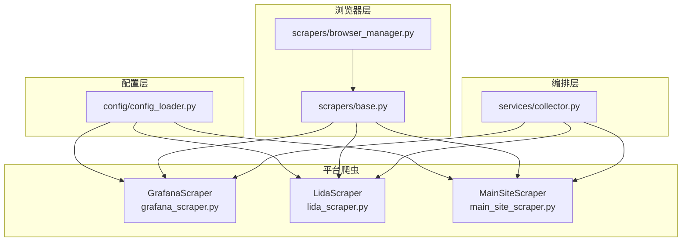
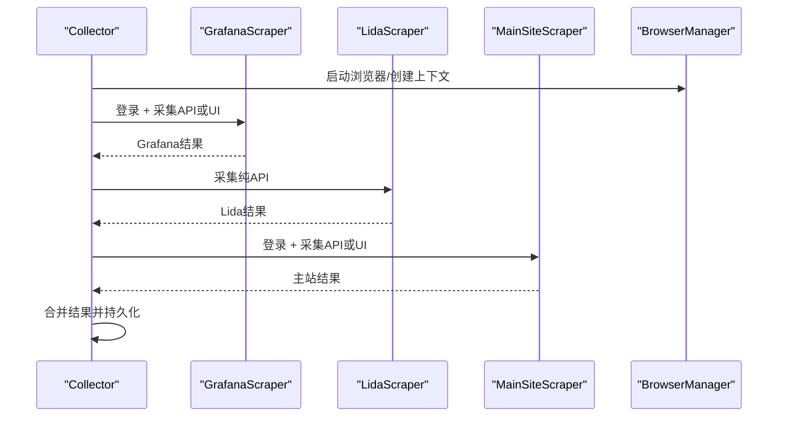
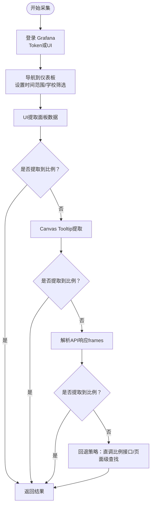
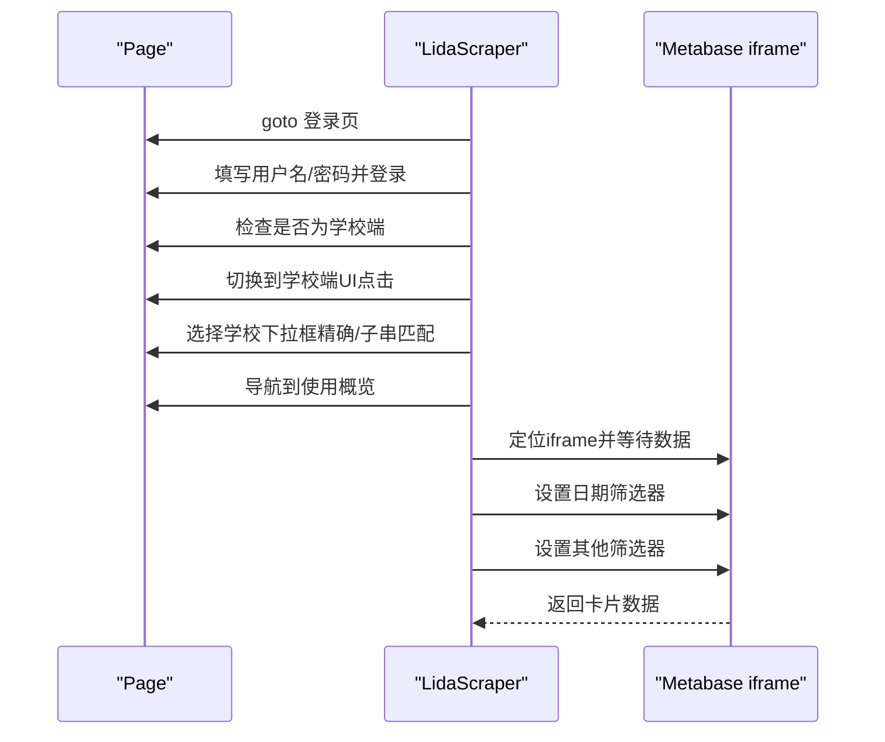
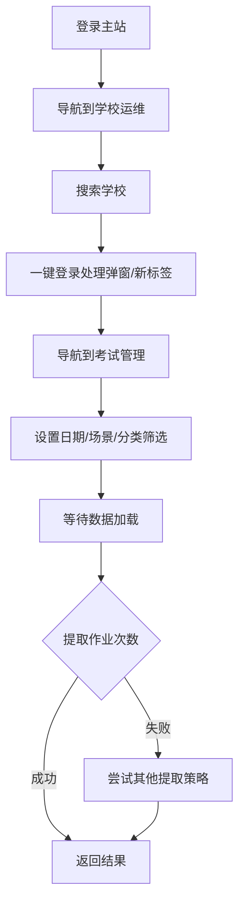
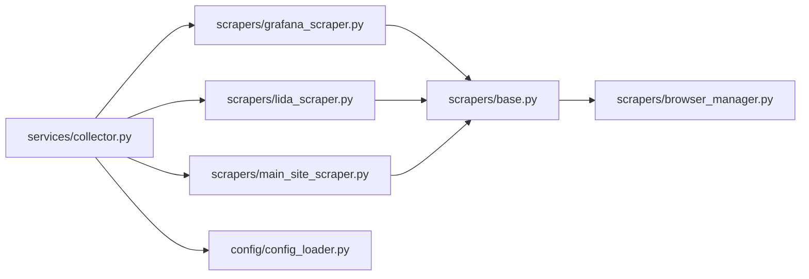

# 平台爬虫实现

<cite>
**本文档引用的文件**
- [grafana_scraper.py](file://scrapers/grafana_scraper.py)
- [lida_scraper.py](file://scrapers/lida_scraper.py)
- [main_site_scraper.py](file://scrapers/main_site_scraper.py)
- [base.py](file://scrapers/base.py)
- [browser_manager.py](file://scrapers/browser_manager.py)
- [config_loader.py](file://config/config_loader.py)
- [collector.py](file://services/collector.py)
- [test_lida_login.py](file://tools/test_lida_login.py)
- [requirements.txt](file://requirements.txt)
</cite>

## 目录
1. [简介](#简介)
2. [项目结构](#项目结构)
3. [核心组件](#核心组件)
4. [架构总览](#架构总览)
5. [详细组件分析](#详细组件分析)
6. [依赖关系分析](#依赖关系分析)
7. [性能考量](#性能考量)
8. [故障排查指南](#故障排查指南)
9. [结论](#结论)
10. [附录](#附录)

## 简介
本项目为“教育平台数据自动采集系统”，提供三个平台的爬虫实现与采集编排能力：
- GrafanaScraper：采集教师活跃度相关指标（周/日活跃比例、教师人数等），支持 API 直连与 UI 自动化双通道。
- LidaScraper：采集平台使用率、集备使用情况等，基于 Metabase 嵌入式仪表板（iframe）提取。
- MainSiteScraper：采集主站作业次数，通过“一键登录”进入考试阅卷系统进行筛选与提取。

系统采用异步 Playwright 架构，支持 API 模式与浏览器模式，并在 API 失败时自动降级；通过编排器按平台优先策略并行/串行执行，合并结果写入数据库。

## 项目结构
- scrapers：爬虫实现与浏览器管理
  - base.py：抽象基类，定义统一接口与通用辅助方法
  - browser_manager.py：Playwright 生命周期管理
  - grafana_scraper.py、lida_scraper.py、main_site_scraper.py：各平台具体实现
- config：配置加载与校验
  - config_loader.py：加载 YAML 配置、凭证覆盖、浏览器配置
- services：采集编排与导出
  - collector.py：按平台调度、并发控制、结果合并与持久化
- tools：辅助脚本（如 Lida 登录测试）
- web：Web 应用入口（WSGI 启动）
- requirements.txt：依赖清单

**图表来源**
- [config_loader.py:109-119](file://config/config_loader.py#L109-L119)
- [browser_manager.py:37-56](file://scrapers/browser_manager.py#L37-L56)
- [base.py:12-54](file://scrapers/base.py#L12-L54)
- [grafana_scraper.py:48-54](file://scrapers/grafana_scraper.py#L48-L54)
- [lida_scraper.py:35-41](file://scrapers/lida_scraper.py#L35-L41)
- [main_site_scraper.py:21-27](file://scrapers/main_site_scraper.py#L21-L27)
- [collector.py:24-34](file://services/collector.py#L24-L34)

**章节来源**
- [requirements.txt:1-7](file://requirements.txt#L1-L7)
- [config_loader.py:21-36](file://config/config_loader.py#L21-L36)

## 核心组件
- 抽象基类 BaseScraper：统一登录、采集接口，提供页面获取、网络等待、安全文本读取等通用方法。
- BrowserManager：负责 Playwright 启动、上下文创建、视口与超时配置、Cookie 清理。
- GrafanaScraper：支持 API 直连与 UI 自动化，多策略提取面板数据，包含时间范围与学校筛选注入、Canvas Tooltip 提取、API 响应解析等。
- LidaScraper：Metabase 嵌入式仪表板提取，包含 iframe 定位、日期筛选、筛选器设置、卡片数据提取。
- MainSiteScraper：主站作业次数采集，包含一键登录、考试管理导航、筛选设置、结果提取与分页处理。
- Collector：编排器，按平台优先策略调度，支持 API 模式与浏览器模式自动降级，SSE 进度广播。

**章节来源**
- [base.py:12-104](file://scrapers/base.py#L12-L104)
- [browser_manager.py:11-76](file://scrapers/browser_manager.py#L11-L76)
- [grafana_scraper.py:48-143](file://scrapers/grafana_scraper.py#L48-L143)
- [lida_scraper.py:35-502](file://scrapers/lida_scraper.py#L35-L502)
- [main_site_scraper.py:21-638](file://scrapers/main_site_scraper.py#L21-L638)
- [collector.py:65-132](file://services/collector.py#L65-L132)

## 架构总览
系统采用“配置驱动 + 抽象基类 + 平台实现 + 编排器”的分层架构。编排器根据配置决定是否启用 API 模式，并在 API 失败时自动降级到浏览器模式；平台间通过统一接口适配，保证采集流程一致性。

**图表来源**
- [collector.py:254-263](file://services/collector.py#L254-L263)
- [collector.py:337-406](file://services/collector.py#L337-L406)
- [collector.py:662-729](file://services/collector.py#L662-L729)

## 详细组件分析

### GrafanaScraper 数据抓取逻辑
- 登录流程
  - 优先使用 API Token（若配置存在）；否则通过 UI 登录，支持多重登录成功检测（CSS、URL、登录表单消失）。
  - 登录后确保在 dashboards 列表页并清理浏览器存储，避免缓存干扰。
- 仪表板导航与筛选
  - 通过 UI 导航至“中台周报表”，设置时间范围与学校筛选（通过 URL 参数注入）。
  - 支持通过 UI 设置 school_name 与 school 变量，确保月表/周表变量一致。
- 数据提取策略
  - UI 提取：遍历面板容器，区分比例面板与 KPI 面板，采用不同提取策略；当 DOM 无法提取时，尝试 Canvas Tooltip 悬停提取。
  - API 响应解析：捕获 /api/ds/query 等响应，解析 frames/schema/data.values，按字段类型与数值范围识别比例值。
  - 多源回退：DOM → Canvas Tooltip → API 响应 → 比例面板直调接口，确保高成功率。
- 时间序列与异常处理
  - 通过 JS 注入 from/to 时间戳并刷新页面，等待网络空闲；对面板渲染延迟进行容错等待。
  - 对比例值进行范围过滤（0~100）、兜底取最小值等策略，提升稳定性。

**图表来源**
- [grafana_scraper.py:56-143](file://scrapers/grafana_scraper.py#L56-L143)
- [grafana_scraper.py:327-598](file://scrapers/grafana_scraper.py#L327-L598)
- [grafana_scraper.py:600-733](file://scrapers/grafana_scraper.py#L600-L733)

**章节来源**
- [grafana_scraper.py:48-143](file://scrapers/grafana_scraper.py#L48-L143)
- [grafana_scraper.py:159-282](file://scrapers/grafana_scraper.py#L159-L282)
- [grafana_scraper.py:284-296](file://scrapers/grafana_scraper.py#L284-L296)
- [grafana_scraper.py:327-598](file://scrapers/grafana_scraper.py#L327-L598)
- [grafana_scraper.py:600-733](file://scrapers/grafana_scraper.py#L600-L733)

### LidaScraper 登录认证与 Cookie 管理
- 登录与模式切换
  - 登录后检查是否处于学校端，若非学校端则通过 UI 切换；支持 cookie 探测，便于分析模式相关 Cookie。
- 学校选择与会话保持
  - 通过右上角下拉框选择学校，支持精确匹配与子串匹配；切换学校无需重新登录，利用现有会话。
- Metabase 嵌入式仪表板提取
  - 定位 Metabase iframe，等待数据加载（智能检测百分比数值）；从卡片结构中提取指标值。
- 日期与筛选器设置
  - 通过按钮 aria-label 或文本定位日期筛选器，支持多种策略填充日期与确认；支持筛选器弹窗的多种确认按钮文本。

**图表来源**
- [lida_scraper.py:43-75](file://scrapers/lida_scraper.py#L43-L75)
- [lida_scraper.py:88-133](file://scrapers/lida_scraper.py#L88-L133)
- [lida_scraper.py:152-234](file://scrapers/lida_scraper.py#L152-L234)
- [lida_scraper.py:235-273](file://scrapers/lida_scraper.py#L235-L273)
- [lida_scraper.py:398-432](file://scrapers/lida_scraper.py#L398-L432)
- [lida_scraper.py:434-502](file://scrapers/lida_scraper.py#L434-L502)
- [lida_scraper.py:503-577](file://scrapers/lida_scraper.py#L503-L577)
- [lida_scraper.py:578-800](file://scrapers/lida_scraper.py#L578-L800)

**章节来源**
- [lida_scraper.py:43-133](file://scrapers/lida_scraper.py#L43-L133)
- [lida_scraper.py:152-234](file://scrapers/lida_scraper.py#L152-L234)
- [lida_scraper.py:235-273](file://scrapers/lida_scraper.py#L235-L273)
- [lida_scraper.py:398-502](file://scrapers/lida_scraper.py#L398-L502)
- [lida_scraper.py:503-800](file://scrapers/lida_scraper.py#L503-L800)

### MainSiteScraper 主站数据采集策略
- 登录与会话保持
  - 登录后检查 URL，支持重试与 UI 导航回退；通过清理上下文中的多余标签页，保留运维页面。
- 学校搜索与一键登录
  - 在学校运维中搜索学校，点击“一键登录”；处理确认弹窗与新标签页打开场景。
- 考试管理导航与筛选
  - 导航到“考试阅卷系统”→“考试管理”，设置日期范围与场景/分类筛选；通过 JS 设置 Vue 模型值并触发响应式更新。
- 结果提取与分页处理
  - 通过多种策略提取作业次数（总计场次、分页总数、Vue 实例属性、表格行数）；支持分页处理，尽量一次性展示所有数据。

**图表来源**
- [main_site_scraper.py:96-128](file://scrapers/main_site_scraper.py#L96-L128)
- [main_site_scraper.py:129-198](file://scrapers/main_site_scraper.py#L129-L198)
- [main_site_scraper.py:199-276](file://scrapers/main_site_scraper.py#L199-L276)
- [main_site_scraper.py:277-306](file://scrapers/main_site_scraper.py#L277-L306)
- [main_site_scraper.py:308-428](file://scrapers/main_site_scraper.py#L308-L428)
- [main_site_scraper.py:429-567](file://scrapers/main_site_scraper.py#L429-L567)

**章节来源**
- [main_site_scraper.py:96-198](file://scrapers/main_site_scraper.py#L96-L198)
- [main_site_scraper.py:199-306](file://scrapers/main_site_scraper.py#L199-L306)
- [main_site_scraper.py:308-428](file://scrapers/main_site_scraper.py#L308-L428)
- [main_site_scraper.py:429-567](file://scrapers/main_site_scraper.py#L429-L567)

### 统一接口与适配方法
- 抽象基类 BaseScraper
  - 统一定义 login 与 scrape 接口；提供页面获取、网络等待、安全文本读取等通用方法，降低平台差异带来的复杂度。
- 编排器 Collector
  - 通过配置决定是否启用 API 模式；API 失败时自动降级到浏览器；按平台优先策略调度，支持并行与串行组合。
- Cookie 管理与上下文复用
  - BrowserManager 清理 Cookie 与 CSP，避免缓存干扰；主站 API 与浏览器可共享上下文，减少重复登录。

**章节来源**
- [base.py:12-104](file://scrapers/base.py#L12-L104)
- [collector.py:237-244](file://services/collector.py#L237-L244)
- [collector.py:682-715](file://services/collector.py#L682-L715)
- [browser_manager.py:37-56](file://scrapers/browser_manager.py#L37-L56)

## 依赖关系分析
- 组件耦合
  - 平台爬虫依赖 BaseScraper 与 BrowserManager；编排器依赖各平台爬虫与配置加载模块。
- 外部依赖
  - Playwright 用于浏览器自动化；aiohttp 用于 API 模式；Flask/Waitress 提供 Web 服务。
- 潜在循环依赖
  - 无直接循环依赖；编排器对平台爬虫为单向依赖。

**图表来源**
- [collector.py:24-34](file://services/collector.py#L24-L34)
- [grafana_scraper.py:14-16](file://scrapers/grafana_scraper.py#L14-L16)
- [lida_scraper.py:12-14](file://scrapers/lida_scraper.py#L12-L14)
- [main_site_scraper.py:11-13](file://scrapers/main_site_scraper.py#L11-L13)
- [base.py:17-22](file://scrapers/base.py#L17-L22)
- [browser_manager.py:14-16](file://scrapers/browser_manager.py#L14-L16)
- [config_loader.py:94-96](file://config/config_loader.py#L94-L96)

**章节来源**
- [requirements.txt:1-7](file://requirements.txt#L1-L7)
- [collector.py:24-34](file://services/collector.py#L24-L34)

## 性能考量
- 浏览器模式
  - 无头模式下设置标准视口，提高渲染稳定性；网络空闲等待与超时控制平衡稳定性与性能。
- API 模式
  - API 直连更快，适合大规模数据采集；API 失败自动降级到浏览器，保障成功率。
- 并发与复用
  - 主站 API 与浏览器共享上下文，避免重复登录；编排器按平台分阶段执行，减少资源竞争。
- 数据提取优化
  - Grafana 多策略回退（DOM/Canvas/API）与 API 响应解析，提升提取鲁棒性；主站分页处理尽量一次性展示数据。

[本节为通用指导，无需列出具体文件来源]

## 故障排查指南
- 登录失败
  - Grafana：检查 Token 配置与 UI 登录流程，确认多重登录检测是否通过。
  - Lida：确认学校端切换成功与 Cookie 探测结果；检查下拉框选择策略。
  - 主站：检查一键登录弹窗与新标签页处理，必要时回退到 UI 导航。
- 数据提取失败
  - Grafana：面板渲染延迟导致 DOM 未就绪，增加等待；Canvas Tooltip 与 API 响应作为回退。
  - Lida：iframe 加载超时，使用智能等待检测百分比数值；筛选器设置失败时尝试多种确认按钮文本。
  - 主站：分页处理失败时回退到逐页累加；Vue 模型更新失败时尝试 JS 直接设置。
- 配置与凭证
  - 确认 credentials 中各平台 url、username、password 完整；必要时使用用户凭证覆盖机制。

**章节来源**
- [grafana_scraper.py:56-143](file://scrapers/grafana_scraper.py#L56-L143)
- [lida_scraper.py:88-133](file://scrapers/lida_scraper.py#L88-L133)
- [main_site_scraper.py:129-198](file://scrapers/main_site_scraper.py#L129-L198)
- [config_loader.py:39-74](file://config/config_loader.py#L39-L74)

## 结论
本系统通过统一抽象与编排器设计，实现了跨平台数据采集的一致性与高可靠性。Grafana 侧重多源回退与 API 响应解析，Lida 专注 Metabase 嵌入式仪表板提取，主站强调一键登录与筛选链路的健壮性。配合 API/浏览器双模式与自动降级策略，能够在复杂前端环境下稳定采集所需指标。

[本节为总结性内容，无需列出具体文件来源]

## 附录
- 配置文件示例与校验
  - config_loader 提供配置加载与校验，确保浏览器与各平台凭证完整。
- 工具脚本
  - tools/test_lida_login.py 提供 Lida 登录与路由探索示例，便于接口调试与验证。

**章节来源**
- [config_loader.py:21-36](file://config/config_loader.py#L21-L36)
- [test_lida_login.py:1-93](file://tools/test_lida_login.py#L1-L93)