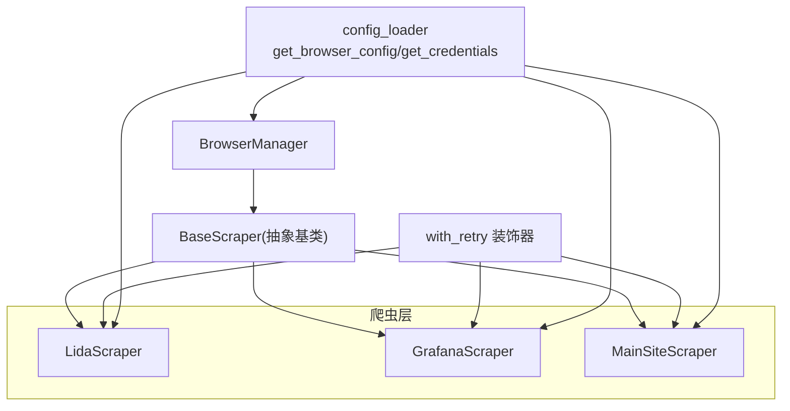
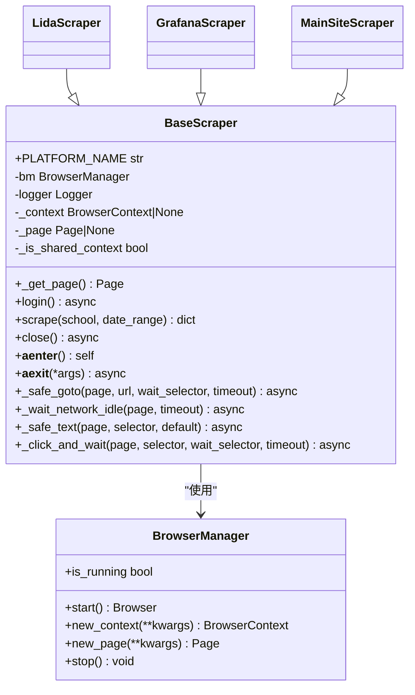
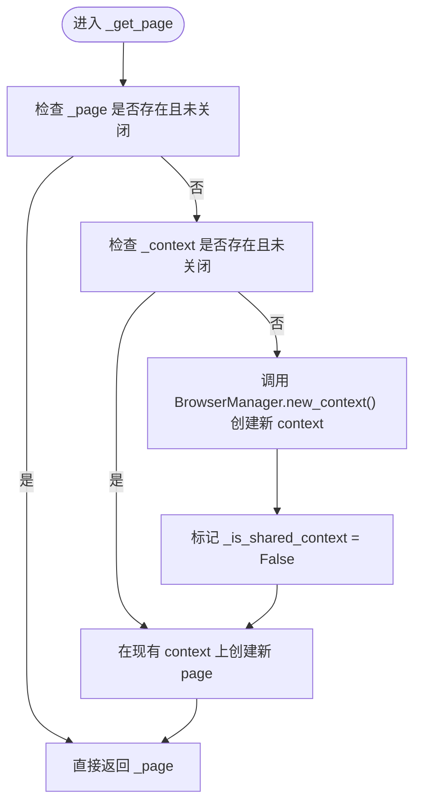
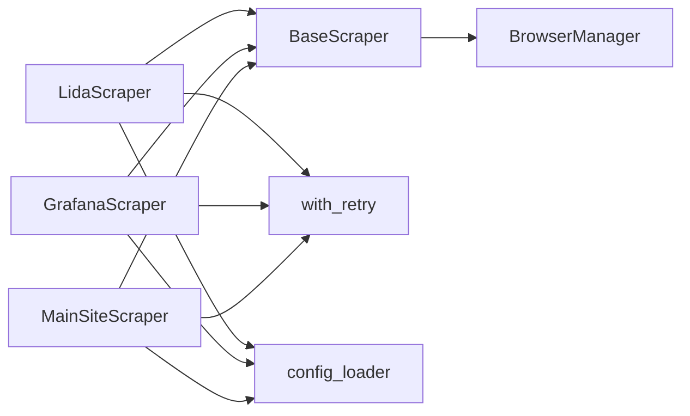
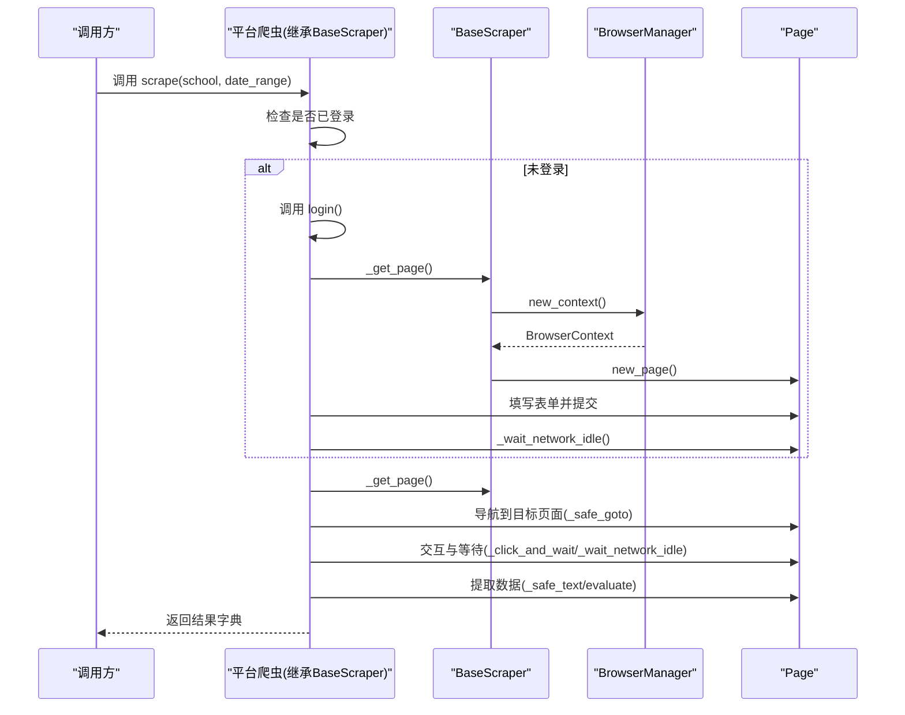

# 抽象基类设计

<cite>
**本文引用的文件**   
- [scrapers/base.py](file://middle-platform-data-collector-master/middle-platform-data-collector-master/scrapers/base.py)
- [scrapers/browser_manager.py](file://middle-platform-data-collector-master/middle-platform-data-collector-master/scrapers/browser_manager.py)
- [scrapers/retry.py](file://middle-platform-data-collector-master/middle-platform-data-collector-master/scrapers/retry.py)
- [scrapers/lida_scraper.py](file://middle-platform-data-collector-master/middle-platform-data-collector-master/scrapers/lida_scraper.py)
- [scrapers/grafana_scraper.py](file://middle-platform-data-collector-master/middle-platform-data-collector-master/scrapers/grafana_scraper.py)
- [scrapers/main_site_scraper.py](file://middle-platform-data-collector-master/middle-platform-data-collector-master/scrapers/main_site_scraper.py)
- [config/config_loader.py](file://middle-platform-data-collector-master/middle-platform-data-collector-master/config/config_loader.py)
</cite>

## 目录
1. [简介](#简介)
2. [项目结构](#项目结构)
3. [核心组件](#核心组件)
4. [架构总览](#架构总览)
5. [详细组件分析](#详细组件分析)
6. [依赖关系分析](#依赖关系分析)
7. [性能考量](#性能考量)
8. [故障排查指南](#故障排查指南)
9. [结论](#结论)
10. [附录：新平台爬虫开发规范与示例](#附录新平台爬虫开发规范与示例)

## 简介
本文件围绕异步爬虫框架的抽象基类 BaseScraper，系统性阐述其设计模式、生命周期管理、资源清理策略、上下文共享机制，以及通用辅助方法的使用场景与最佳实践。同时给出错误处理思路、上下文管理器模式的实现要点，并提供新平台爬虫开发的接口规范与参考路径，帮助开发者快速扩展新的数据源平台。

## 项目结构
本项目采用“抽象基类 + 具体平台实现”的分层组织方式：
- scrapers/base.py：定义异步爬虫抽象基类，提供页面获取、上下文管理、通用辅助方法与生命周期钩子。
- scrapers/browser_manager.py：封装 Playwright 浏览器实例的生命周期（启动/关闭）、上下文与页面创建、默认超时等配置。
- scrapers/retry.py：提供同步/异步通用的重试装饰器，支持指数退避与可重试异常类型定制。
- scrapers/*_scraper.py：各平台的具体实现，继承 BaseScraper，实现登录与采集流程。
- config/config_loader.py：统一加载配置（浏览器参数、平台凭证），并支持用户级覆盖。

图表来源
- [scrapers/base.py:12-104](file://middle-platform-data-collector-master/middle-platform-data-collector-master/scrapers/base.py#L12-L104)
- [scrapers/browser_manager.py:11-76](file://middle-platform-data-collector-master/middle-platform-data-collector-master/scrapers/browser_manager.py#L11-L76)
- [scrapers/retry.py:13-82](file://middle-platform-data-collector-master/middle-platform-data-collector-master/scrapers/retry.py#L13-L82)
- [scrapers/lida_scraper.py:35-76](file://middle-platform-data-collector-master/middle-platform-data-collector-master/scrapers/lida_scraper.py#L35-L76)
- [scrapers/grafana_scraper.py:48-143](file://middle-platform-data-collector-master/middle-platform-data-collector-master/scrapers/grafana_scraper.py#L48-L143)
- [scrapers/main_site_scraper.py:21-128](file://middle-platform-data-collector-master/middle-platform-data-collector-master/scrapers/main_site_scraper.py#L21-L128)
- [config/config_loader.py:94-119](file://middle-platform-data-collector-master/middle-platform-data-collector-master/config/config_loader.py#L94-L119)

章节来源
- [scrapers/base.py:12-104](file://middle-platform-data-collector-master/middle-platform-data-collector-master/scrapers/base.py#L12-L104)
- [scrapers/browser_manager.py:11-76](file://middle-platform-data-collector-master/middle-platform-data-collector-master/scrapers/browser_manager.py#L11-L76)
- [scrapers/retry.py:13-82](file://middle-platform-data-collector-master/middle-platform-data-collector-master/scrapers/retry.py#L13-L82)
- [config/config_loader.py:94-119](file://middle-platform-data-collector-master/middle-platform-data-collector-master/config/config_loader.py#L94-L119)

## 核心组件
- BaseScraper：所有平台爬虫的抽象基类，负责：
  - 页面与上下文获取与复用（_get_page）
  - 抽象方法定义（login、scrape）
  - 资源清理（close）
  - 上下文管理器协议（__aenter__/__aexit__）
  - 通用辅助方法（_safe_goto、_wait_network_idle、_safe_text、_click_and_wait）
- BrowserManager：Playwright 浏览器实例的统一管理，包括启动、上下文创建、默认超时设置、缓存清理等。
- with_retry：通用重试装饰器，自动识别同步/异步函数，支持指数退避与自定义可重试异常。

章节来源
- [scrapers/base.py:12-104](file://middle-platform-data-collector-master/middle-platform-data-collector-master/scrapers/base.py#L12-L104)
- [scrapers/browser_manager.py:11-76](file://middle-platform-data-collector-master/middle-platform-data-collector-master/scrapers/browser_manager.py#L11-L76)
- [scrapers/retry.py:13-82](file://middle-platform-data-collector-master/middle-platform-data-collector-master/scrapers/retry.py#L13-L82)

## 架构总览
下图展示了 BaseScraper 与其依赖 BrowserManager 的关系，以及具体平台爬虫如何复用基类的能力。

图表来源
- [scrapers/base.py:12-104](file://middle-platform-data-collector-master/middle-platform-data-collector-master/scrapers/base.py#L12-L104)
- [scrapers/browser_manager.py:11-76](file://middle-platform-data-collector-master/middle-platform-data-collector-master/scrapers/browser_manager.py#L11-L76)
- [scrapers/lida_scraper.py:35-76](file://middle-platform-data-collector-master/middle-platform-data-collector-master/scrapers/lida_scraper.py#L35-L76)
- [scrapers/grafana_scraper.py:48-143](file://middle-platform-data-collector-master/middle-platform-data-collector-master/scrapers/grafana_scraper.py#L48-L143)
- [scrapers/main_site_scraper.py:21-128](file://middle-platform-data-collector-master/middle-platform-data-collector-master/scrapers/main_site_scraper.py#L21-L128)

## 详细组件分析

### BaseScraper 抽象基类
- 抽象方法
  - login：平台登录流程，由子类实现；通常结合 _get_page 获取页面后执行登录逻辑。
  - scrape：数据采集主流程，接收学校配置与日期范围，返回结构化结果字典。
- 生命周期与资源管理
  - __init__：初始化日志、上下文与页面引用，标记是否共享上下文。
  - close：若 context 非外部共享则关闭；重置内部状态，避免泄漏。
  - __aenter__/__aexit__：支持 async with 上下文管理器模式，确保异常时也能正确释放资源。
- 上下文共享机制
  - _get_page：优先复用已有 context 和 page；若不存在或已关闭，通过 BrowserManager.new_context 创建新 context，并在其中创建新 page。
  - _is_shared_context：用于区分当前 context 是否为外部传入的共享上下文，从而在 close 中决定是否关闭 context。
- 通用辅助方法
  - _safe_goto：导航到 URL 并可选等待选择器出现，适合 SPA 首屏加载。
  - _wait_network_idle：等待网络空闲，适用于动态渲染的数据加载完成。
  - _safe_text：安全获取元素文本，失败时记录警告并返回默认值。
  - _click_and_wait：点击元素并可选等待后续选择器出现，常用于交互触发后的稳定等待。

图表来源
- [scrapers/base.py:24-35](file://middle-platform-data-collector-master/middle-platform-data-collector-master/scrapers/base.py#L24-L35)
- [scrapers/browser_manager.py:37-56](file://middle-platform-data-collector-master/middle-platform-data-collector-master/scrapers/browser_manager.py#L37-L56)

章节来源
- [scrapers/base.py:12-104](file://middle-platform-data-collector-master/middle-platform-data-collector-master/scrapers/base.py#L12-L104)

### BrowserManager 浏览器生命周期管理
- start：首次启动 Chromium 浏览器，读取 headless/slow_mo 等配置，返回浏览器实例。
- new_context：创建新的 BrowserContext，根据 headless 模式设置视口，清除 cookies，设置默认超时。
- new_page：便捷方法，自动创建 context 并返回 page。
- stop：关闭浏览器与 Playwright 实例，释放系统资源。
- is_running：判断浏览器是否处于连接状态。

章节来源
- [scrapers/browser_manager.py:11-76](file://middle-platform-data-collector-master/middle-platform-data-collector-master/scrapers/browser_manager.py#L11-L76)

### with_retry 重试装饰器
- 特性
  - 自动检测同步/异步函数，分别包装为对应 wrapper。
  - 指数退避：等待时间 = backoff_base^(attempt-1)。
  - 可配置最大尝试次数、可重试异常类型、重试回调。
- 适用场景
  - 登录、导航、网络请求等易受瞬时网络波动影响的步骤。
  - 作为装饰器应用于平台的 login、scrape 等方法，提升鲁棒性。

章节来源
- [scrapers/retry.py:13-82](file://middle-platform-data-collector-master/middle-platform-data-collector-master/scrapers/retry.py#L13-L82)

### 具体平台实现概览
- LidaScraper
  - 登录流程：访问登录页，填写用户名密码，切换到学校端，等待网络空闲。
  - 使用 _get_page、_wait_network_idle 等基类方法，结合 with_retry 增强稳定性。
- GrafanaScraper
  - 登录流程：优先 API Token 认证，否则 UI 登录；多重成功检测（CSS 选择器、URL 变化、表单消失）。
  - 登录后清理存储，确保仪表板数据不受缓存影响。
- MainSiteScraper
  - 登录流程：访问登录页，填写表单，轮询等待登录完成。
  - 包含轻量清理 cleanup_between_schools，尽量保留运维页面以提升多学校采集效率。

章节来源
- [scrapers/lida_scraper.py:35-76](file://middle-platform-data-collector-master/middle-platform-data-collector-master/scrapers/lida_scraper.py#L35-L76)
- [scrapers/grafana_scraper.py:48-143](file://middle-platform-data-collector-master/middle-platform-data-collector-master/scrapers/grafana_scraper.py#L48-L143)
- [scrapers/main_site_scraper.py:21-128](file://middle-platform-data-collector-master/middle-platform-data-collector-master/scrapers/main_site_scraper.py#L21-L128)

## 依赖关系分析
- BaseScraper 依赖 BrowserManager 以创建和管理上下文与页面。
- 具体平台爬虫依赖 BaseScraper 提供的通用能力，并通过 config_loader 获取浏览器与平台凭证配置。
- with_retry 作为横切关注点，被多个平台方法使用，降低重复代码。

图表来源
- [scrapers/base.py:12-104](file://middle-platform-data-collector-master/middle-platform-data-collector-master/scrapers/base.py#L12-L104)
- [scrapers/browser_manager.py:11-76](file://middle-platform-data-collector-master/middle-platform-data-collector-master/scrapers/browser_manager.py#L11-L76)
- [scrapers/retry.py:13-82](file://middle-platform-data-collector-master/middle-platform-data-collector-master/scrapers/retry.py#L13-L82)
- [config/config_loader.py:94-119](file://middle-platform-data-collector-master/middle-platform-data-collector-master/config/config_loader.py#L94-L119)

章节来源
- [scrapers/base.py:12-104](file://middle-platform-data-collector-master/middle-platform-data-collector-master/scrapers/base.py#L12-L104)
- [scrapers/browser_manager.py:11-76](file://middle-platform-data-collector-master/middle-platform-data-collector-master/scrapers/browser_manager.py#L11-L76)
- [scrapers/retry.py:13-82](file://middle-platform-data-collector-master/middle-platform-data-collector-master/scrapers/retry.py#L13-L82)
- [config/config_loader.py:94-119](file://middle-platform-data-collector-master/middle-platform-data-collector-master/config/config_loader.py#L94-L119)

## 性能考量
- 上下文复用：_get_page 会复用已有 context/page，减少频繁创建销毁带来的开销。
- 网络空闲等待：_wait_network_idle 有助于在 SPA 场景中等待数据加载完成，避免过早提取导致空数据。
- 重试策略：with_retry 通过指数退避降低瞬时失败的抖动，提高整体成功率。
- 视口与无头模式：BrowserManager 在无头模式下设置固定视口，保证渲染一致性；有头模式跟随窗口大小便于调试。

[本节为通用指导，不直接分析具体文件]

## 故障排查指南
- 登录失败
  - 检查凭证配置是否正确（username/password/url），必要时启用用户级覆盖进行调试。
  - 观察登录成功检测条件（CSS 选择器、URL 变化、表单消失），确认目标站点结构变更。
- 页面未就绪
  - 使用 _wait_network_idle 延长等待时间，或在关键步骤后增加 wait_for_timeout。
  - 对网络超时问题，可在相关方法上使用 with_retry 进行重试。
- 上下文泄漏
  - 确保在异常路径也调用 close，或使用 async with 上下文管理器模式。
  - 若使用外部共享 context，注意 _is_shared_context 标记，避免误关闭。

章节来源
- [config/config_loader.py:94-119](file://middle-platform-data-collector-master/middle-platform-data-collector-master/config/config_loader.py#L94-L119)
- [scrapers/base.py:56-72](file://middle-platform-data-collector-master/middle-platform-data-collector-master/scrapers/base.py#L56-L72)

## 结论
BaseScraper 通过抽象方法、上下文管理与通用辅助方法，为多平台爬虫提供了统一的异步框架。配合 BrowserManager 与 with_retry，实现了稳定的浏览器生命周期管理与容错能力。具体平台只需聚焦登录与数据采集流程，即可快速扩展新的数据源。

[本节为总结，不直接分析具体文件]

## 附录：新平台爬虫开发规范与示例

### 接口规范
- 必须实现的方法
  - login：完成平台登录，可使用 _get_page、_wait_network_idle 等基类方法。
  - scrape：按学校配置与日期范围采集数据，返回结构化字典。
- 推荐使用的基类能力
  - _safe_goto：导航到目标 URL 并等待选择器出现。
  - _click_and_wait：点击按钮并等待后续内容加载。
  - _safe_text：安全获取元素文本，避免选择器缺失导致的异常。
  - with_retry：对不稳定操作（登录、导航）添加重试。
- 上下文管理
  - 推荐使用 async with 模式，确保异常时也能正确释放资源。
  - 如需共享上下文，请在构造时传入外部 context 并设置 _is_shared_context 标记。

### 开发步骤建议
- 新建爬虫类，继承 BaseScraper，设置 PLATFORM_NAME。
- 在 __init__ 中通过 get_credentials 获取平台凭证。
- 实现 login：
  - 使用 _get_page 获取页面。
  - 填充表单并提交，使用 _wait_network_idle 等待登录完成。
  - 使用 with_retry 装饰 login 方法，增强稳定性。
- 实现 scrape：
  - 先确保已登录。
  - 使用 _safe_goto/_click_and_wait 导航与交互。
  - 使用 _safe_text 提取必要字段。
  - 返回标准化结果字典。
- 测试与调试：
  - 使用 BrowserManager 的 is_running 判断浏览器状态。
  - 在关键步骤输出日志，便于定位问题。

### 参考路径（不包含代码片段）
- 基类定义与通用方法
  - [scrapers/base.py:12-104](file://middle-platform-data-collector-master/middle-platform-data-collector-master/scrapers/base.py#L12-L104)
- 浏览器生命周期管理
  - [scrapers/browser_manager.py:11-76](file://middle-platform-data-collector-master/middle-platform-data-collector-master/scrapers/browser_manager.py#L11-L76)
- 重试装饰器
  - [scrapers/retry.py:13-82](file://middle-platform-data-collector-master/middle-platform-data-collector-master/scrapers/retry.py#L13-L82)
- 平台实现示例（登录与采集流程）
  - [scrapers/lida_scraper.py:35-76](file://middle-platform-data-collector-master/middle-platform-data-collector-master/scrapers/lida_scraper.py#L35-L76)
  - [scrapers/grafana_scraper.py:48-143](file://middle-platform-data-collector-master/middle-platform-data-collector-master/scrapers/grafana_scraper.py#L48-L143)
  - [scrapers/main_site_scraper.py:21-128](file://middle-platform-data-collector-master/middle-platform-data-collector-master/scrapers/main_site_scraper.py#L21-L128)
- 配置加载与凭证覆盖
  - [config/config_loader.py:94-119](file://middle-platform-data-collector-master/middle-platform-data-collector-master/config/config_loader.py#L94-L119)

### 典型流程图（登录+采集）

图表来源
- [scrapers/base.py:24-35](file://middle-platform-data-collector-master/middle-platform-data-collector-master/scrapers/base.py#L24-L35)
- [scrapers/browser_manager.py:37-56](file://middle-platform-data-collector-master/middle-platform-data-collector-master/scrapers/browser_manager.py#L37-L56)
- [scrapers/lida_scraper.py:43-76](file://middle-platform-data-collector-master/middle-platform-data-collector-master/scrapers/lida_scraper.py#L43-L76)
- [scrapers/grafana_scraper.py:56-143](file://middle-platform-data-collector-master/middle-platform-data-collector-master/scrapers/grafana_scraper.py#L56-L143)
- [scrapers/main_site_scraper.py:96-128](file://middle-platform-data-collector-master/middle-platform-data-collector-master/scrapers/main_site_scraper.py#L96-L128)