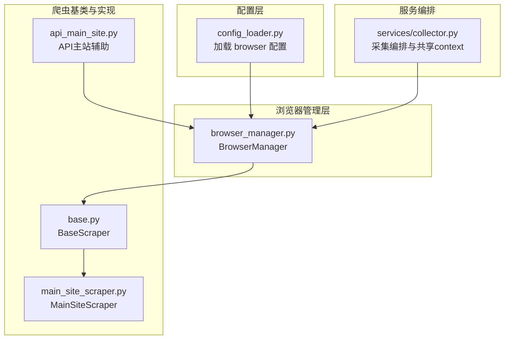
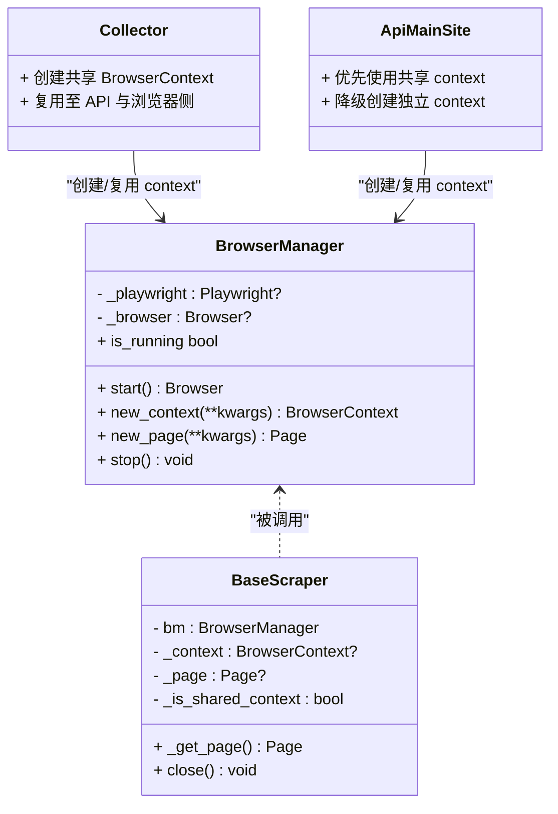
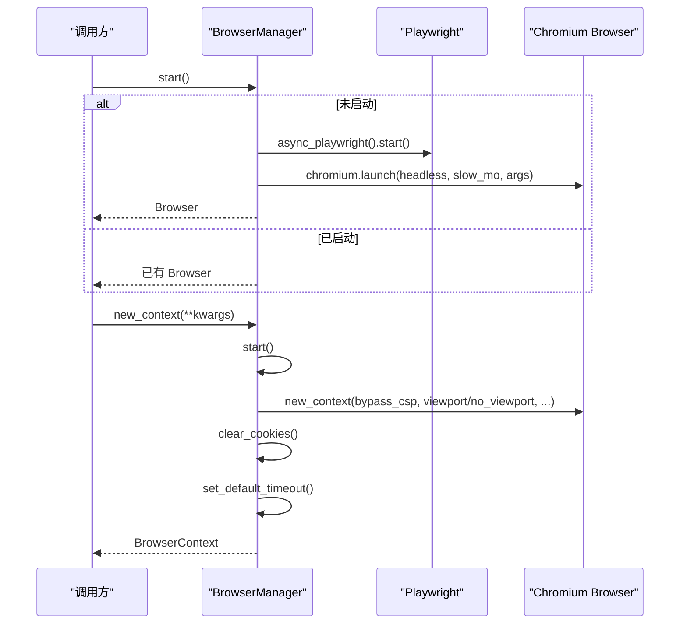
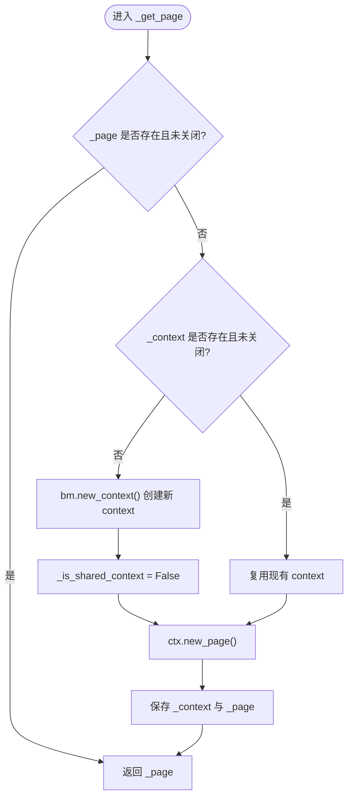
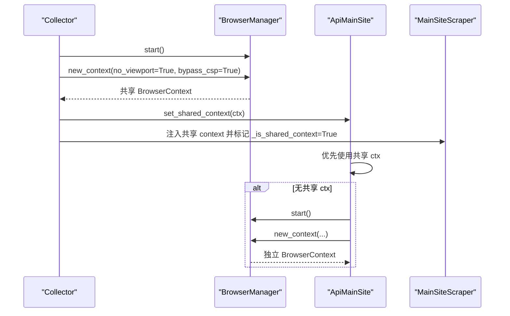
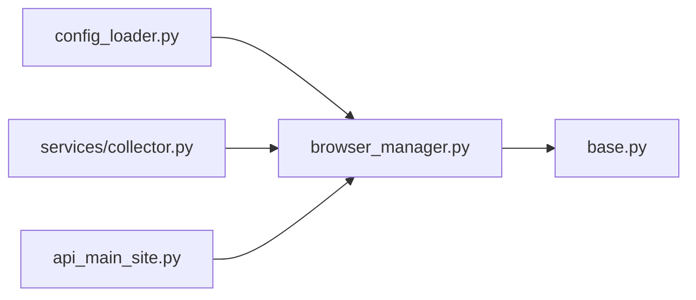
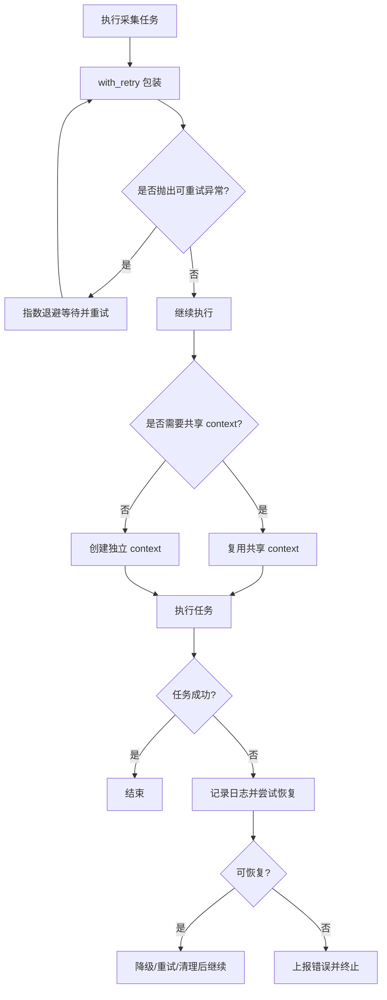

# 浏览器管理器

<cite>
**本文引用的文件**   
- [browser_manager.py](file://scrapers/browser_manager.py)
- [config_loader.py](file://config/config_loader.py)
- [base.py](file://scrapers/base.py)
- [collector.py](file://services/collector.py)
- [api_main_site.py](file://scrapers/api_main_site.py)
- [retry.py](file://scrapers/retry.py)
</cite>

## 目录
1. [简介](#简介)
2. [项目结构](#项目结构)
3. [核心组件](#核心组件)
4. [架构总览](#架构总览)
5. [详细组件分析](#详细组件分析)
6. [依赖关系分析](#依赖关系分析)
7. [性能与内存优化](#性能与内存优化)
8. [并发控制策略](#并发控制策略)
9. [错误恢复与自动重启](#错误恢复与自动重启)
10. [配置项说明](#配置项说明)
11. [故障排查指南](#故障排查指南)
12. [结论](#结论)

## 简介
本技术文档围绕 BrowserManager 浏览器管理器，系统阐述其与 Playwright 的集成架构、浏览器实例生命周期管理、上下文创建与复用策略、会话状态维护、并发控制、错误恢复机制以及性能调优建议。目标是帮助读者在不深入源码细节的前提下，理解并高效使用浏览器资源，避免资源耗尽与崩溃风险，提升采集稳定性与吞吐。

## 项目结构
BrowserManager 位于爬虫层，负责启动 Chromium 进程、创建和管理 BrowserContext/Page，并通过配置模块加载浏览器参数。上层服务（如 collector）和具体爬虫（如 main_site_scraper、api_main_site）通过共享或独立的 context 进行页面操作与数据采集。

图表来源
- [browser_manager.py:1-76](file://scrapers/browser_manager.py#L1-L76)
- [config_loader.py:94-96](file://config/config_loader.py#L94-L96)
- [base.py:12-35](file://scrapers/base.py#L12-L35)
- [collector.py:584-704](file://services/collector.py#L584-L704)
- [api_main_site.py:362-391](file://scrapers/api_main_site.py#L362-L391)

章节来源
- [browser_manager.py:1-76](file://scrapers/browser_manager.py#L1-L76)
- [config_loader.py:94-96](file://config/config_loader.py#L94-L96)
- [base.py:12-35](file://scrapers/base.py#L12-L35)
- [collector.py:584-704](file://services/collector.py#L584-L704)
- [api_main_site.py:362-391](file://scrapers/api_main_site.py#L362-L391)

## 核心组件
- BrowserManager：封装 Playwright 异步 API，提供 start/new_context/new_page/stop/is_running 等能力，统一浏览器生命周期与上下文创建策略。
- BaseScraper：抽象爬虫基类，持有 BrowserManager 引用，按需创建/复用 context 与 page，并提供通用导航、等待、点击等工具方法。
- Collector（服务层）：在大规模采集时创建共享 BrowserContext，供 API 与浏览器侧复用，减少重复登录与上下文开销。
- api_main_site：在需要获取特定站点 cookie 时，优先复用共享 context，必要时降级到独立 context。

章节来源
- [browser_manager.py:11-76](file://scrapers/browser_manager.py#L11-L76)
- [base.py:12-35](file://scrapers/base.py#L12-L35)
- [collector.py:682-704](file://services/collector.py#L682-L704)
- [api_main_site.py:362-391](file://scrapers/api_main_site.py#L362-L391)

## 架构总览
BrowserManager 作为浏览器资源的唯一入口，向上暴露稳定的上下文创建接口；下层由多个爬虫与服务共享同一 Browser 实例，通过不同 BrowserContext 隔离会话与存储，结合清理策略避免数据污染。

图表来源
- [browser_manager.py:11-76](file://scrapers/browser_manager.py#L11-L76)
- [base.py:12-35](file://scrapers/base.py#L12-L35)
- [collector.py:682-704](file://services/collector.py#L682-L704)
- [api_main_site.py:362-391](file://scrapers/api_main_site.py#L362-L391)

## 详细组件分析

### BrowserManager 组件分析
- 启动流程：首次调用 start 时初始化 Playwright 并启动 Chromium，后续调用直接返回已有实例，避免重复启动。
- 上下文创建：new_context 根据 headless 模式设置视口策略，默认开启 bypass_csp，并在无头模式下固定视口尺寸；每次创建后清除 cookies，设置默认超时。
- 页面创建：new_page 基于 new_context 自动创建新页面。
- 关闭流程：stop 顺序关闭 Browser 与 Playwright，释放底层进程。
- 运行态检测：is_running 判断当前 Browser 是否仍连接。

图表来源
- [browser_manager.py:18-56](file://scrapers/browser_manager.py#L18-L56)

章节来源
- [browser_manager.py:18-76](file://scrapers/browser_manager.py#L18-L76)

### BaseScraper 上下文与页面管理
- 懒加载策略：_get_page 确保存在可用的 context 与 page，若缺失则通过 BrowserManager 创建新的 context 与 page。
- 共享上下文标记：_is_shared_context 用于区分外部传入的共享 context，close 时仅关闭自身页面而不关闭共享 context。
- 通用交互：提供 _safe_goto、_wait_network_idle、_safe_text、_click_and_wait 等工具方法，简化页面交互与等待逻辑。

图表来源
- [base.py:24-35](file://scrapers/base.py#L24-L35)

章节来源
- [base.py:12-35](file://scrapers/base.py#L12-L35)

### 共享上下文与跨组件复用
- 服务层（collector）在批量采集时创建共享 BrowserContext，并将其注入 API 与浏览器侧，避免重复登录与 Cookie 同步问题。
- API 侧（api_main_site）在需要获取特定站点 cookie 时，优先复用共享 context；若无共享 context 则降级为独立 context，保证功能可用性与健壮性。

图表来源
- [collector.py:682-704](file://services/collector.py#L682-L704)
- [api_main_site.py:362-391](file://scrapers/api_main_site.py#L362-L391)
- [base.py:24-35](file://scrapers/base.py#L24-L35)

章节来源
- [collector.py:682-704](file://services/collector.py#L682-L704)
- [api_main_site.py:362-391](file://scrapers/api_main_site.py#L362-L391)
- [base.py:24-35](file://scrapers/base.py#L24-L35)

## 依赖关系分析
- BrowserManager 依赖配置模块获取浏览器参数（headless、slow_mo、default_timeout）。
- BaseScraper 依赖 BrowserManager 以获取上下文与页面。
- 服务层与 API 辅助模块在需要时直接与 BrowserManager 交互，创建或复用上下文。

图表来源
- [config_loader.py:94-96](file://config/config_loader.py#L94-L96)
- [browser_manager.py:1-76](file://scrapers/browser_manager.py#L1-76)
- [base.py:12-35](file://scrapers/base.py#L12-L35)
- [collector.py:682-704](file://services/collector.py#L682-L704)
- [api_main_site.py:362-391](file://scrapers/api_main_site.py#L362-L391)

章节来源
- [config_loader.py:94-96](file://config/config_loader.py#L94-L96)
- [browser_manager.py:1-76](file://scrapers/browser_manager.py#L1-76)
- [base.py:12-35](file://scrapers/base.py#L12-L35)
- [collector.py:682-704](file://services/collector.py#L682-L704)
- [api_main_site.py:362-391](file://scrapers/api_main_site.py#L362-L391)

## 性能与内存优化
- 视口策略：在无头模式下固定视口尺寸，有助于稳定渲染与降低重排成本；有头模式采用 no_viewport 跟随窗口大小，便于调试。
- 缓存清理：每次创建上下文后清除 cookies，避免旧数据干扰，提高可重复性与一致性。
- 默认超时：通过 default_timeout 统一设置上下文级超时，减少因网络波动导致的长时间阻塞。
- 共享上下文：在服务层创建共享 context，减少重复登录与上下文创建开销，提升吞吐。
- 轻量清理：在主站爬虫中提供学校间轻量清理，保留运维页面，减少重新登录与导航成本。

章节来源
- [browser_manager.py:37-56](file://scrapers/browser_manager.py#L37-L56)
- [base.py:34-35](file://scrapers/base.py#L34-L35)
- [collector.py:682-704](file://services/collector.py#L682-L704)
- [main_site_scraper.py:34-95](file://scrapers/main_site_scraper.py#L34-L95)

## 并发控制策略
- 单进程单浏览器：BrowserManager 内部维护单一 Browser 实例，避免多进程竞争导致资源争用。
- 上下文隔离：每个采集任务使用独立 BrowserContext，隔离 Cookie、Storage 与页面状态，防止相互污染。
- 共享上下文复用：在批量采集场景下，服务层创建共享 context 并注入到 API 与浏览器侧，减少重复登录与上下文创建。
- 页面级清理：在主站爬虫中提供轻量清理，关闭非关键标签页，保留必要页面，降低上下文压力。

章节来源
- [browser_manager.py:18-35](file://scrapers/browser_manager.py#L18-L35)
- [base.py:24-35](file://scrapers/base.py#L24-L35)
- [collector.py:682-704](file://services/collector.py#L682-L704)
- [main_site_scraper.py:34-95](file://scrapers/main_site_scraper.py#L34-L95)

## 错误恢复与自动重启
- 重试装饰器：通用 with_retry 支持指数退避，适用于网络超时、连接异常等可重试错误，增强采集鲁棒性。
- 导航容错：主站爬虫在导航失败时进行多次重试与 UI 回退，应对临时网络问题与页面重定向。
- 上下文降级：API 侧在无法复用共享 context 时自动降级为独立 context，保障功能可用性。
- 自动重启：BrowserManager.start 具备幂等性，若检测到已有 Browser 实例则直接返回，避免重复启动；stop 后再次调用 start 可重建实例。

图表来源
- [retry.py:13-82](file://scrapers/retry.py#L13-L82)
- [api_main_site.py:362-391](file://scrapers/api_main_site.py#L362-L391)
- [main_site_scraper.py:96-127](file://scrapers/main_site_scraper.py#L96-L127)

章节来源
- [retry.py:13-82](file://scrapers/retry.py#L13-L82)
- [api_main_site.py:362-391](file://scrapers/api_main_site.py#L362-L391)
- [main_site_scraper.py:96-127](file://scrapers/main_site_scraper.py#L96-L127)

## 配置项说明
- browser.headless：是否以无头模式运行，影响视口策略与渲染行为。
- browser.slow_mo：模拟延迟毫秒数，便于调试与观察页面行为。
- browser.default_timeout：上下文默认超时时间，统一控制导航、等待等操作超时。

章节来源
- [config_loader.py:43-47](file://config/config_loader.py#L43-L47)
- [config_loader.py:94-96](file://config/config_loader.py#L94-L96)
- [browser_manager.py:23-34](file://scrapers/browser_manager.py#L23-L34)
- [browser_manager.py:55-56](file://scrapers/browser_manager.py#L55-L56)

## 故障排查指南
- 浏览器未启动或连接断开：检查 is_running 状态，必要时调用 stop 后再 start 重建实例。
- 上下文创建失败：确认配置文件存在且有效，核对 headless/slow_mo/default_timeout 值；查看日志中的启动信息。
- 页面导航超时：启用 with_retry 装饰器，调整 default_timeout 与网络空闲等待策略；参考主站爬虫的导航重试逻辑。
- Cookie 污染或登录状态异常：确认 new_context 是否清除了 cookies；在共享 context 场景下，确保登录状态正确传递与标记。
- 资源占用过高：评估上下文数量与页面数量，及时关闭不再使用的页面与上下文；利用轻量清理策略减少多余标签页。

章节来源
- [browser_manager.py:73-76](file://scrapers/browser_manager.py#L73-L76)
- [browser_manager.py:37-56](file://scrapers/browser_manager.py#L37-L56)
- [retry.py:13-82](file://scrapers/retry.py#L13-L82)
- [main_site_scraper.py:34-95](file://scrapers/main_site_scraper.py#L34-L95)

## 结论
BrowserManager 提供了稳定、简洁的 Playwright 集成入口，配合 BaseScraper 的上下文管理与服务层的共享上下文策略，实现了高效的浏览器资源复用与隔离。通过合理的配置、重试与清理机制，系统在复杂网络与页面环境下具备较强的鲁棒性。建议在大规模采集场景中优先使用共享上下文，并结合轻量清理与超时策略，平衡性能与稳定性。