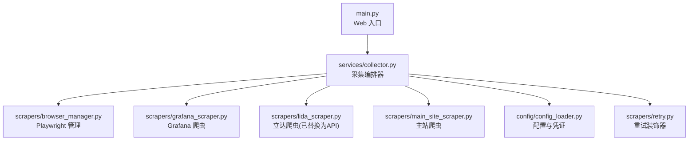
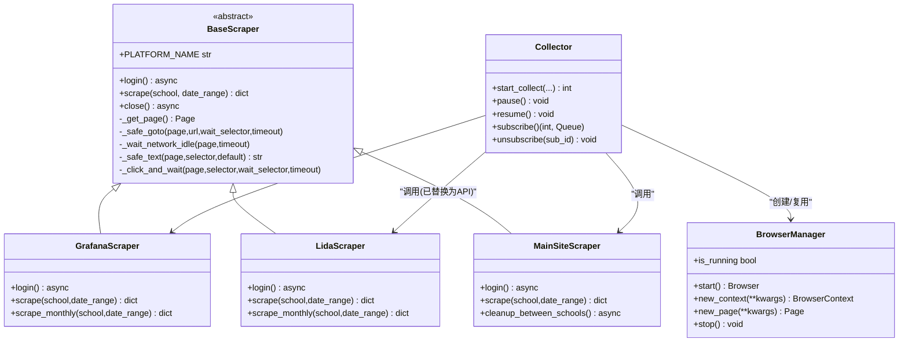
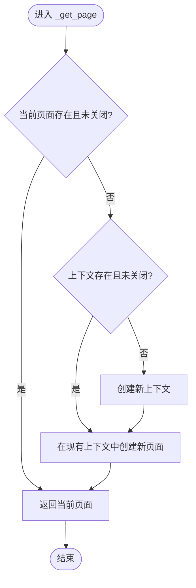
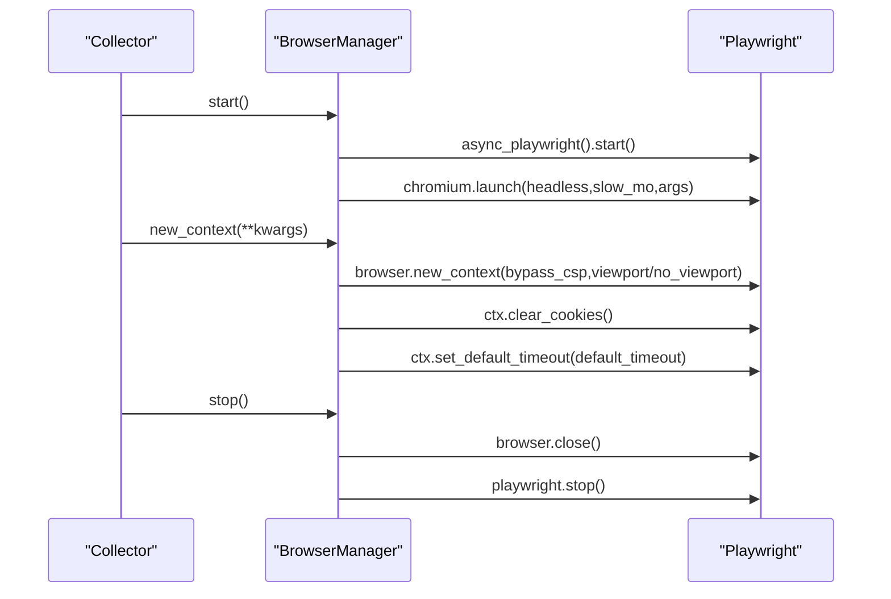
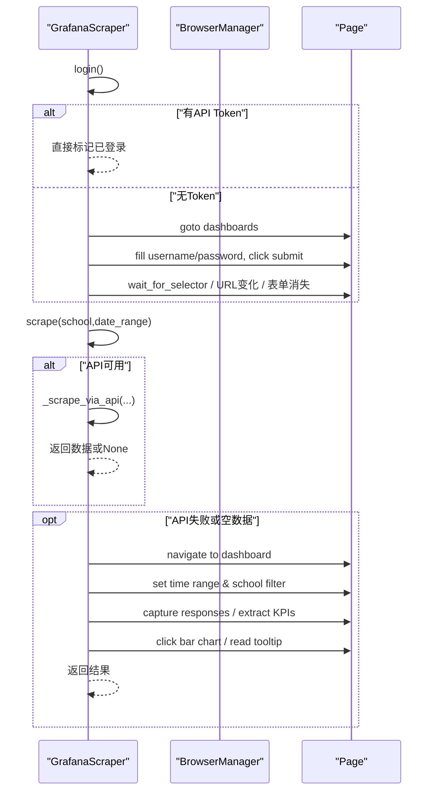
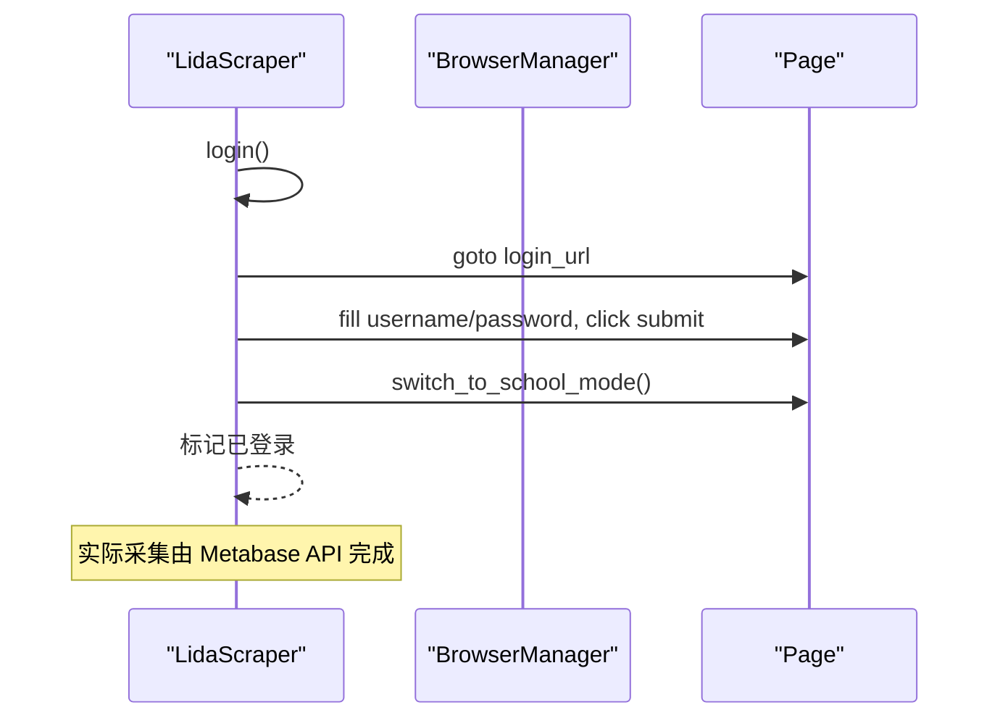
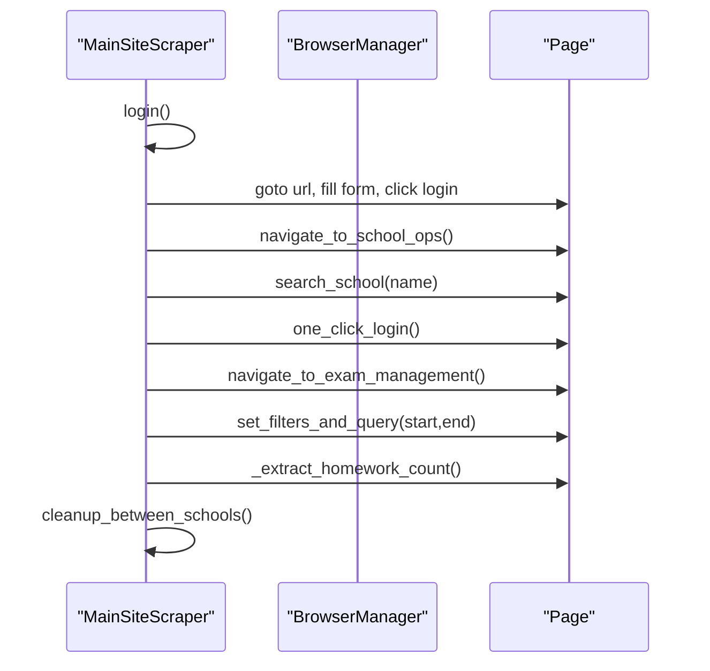
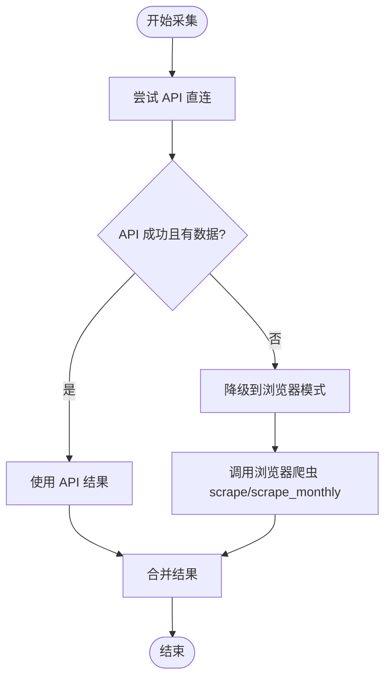
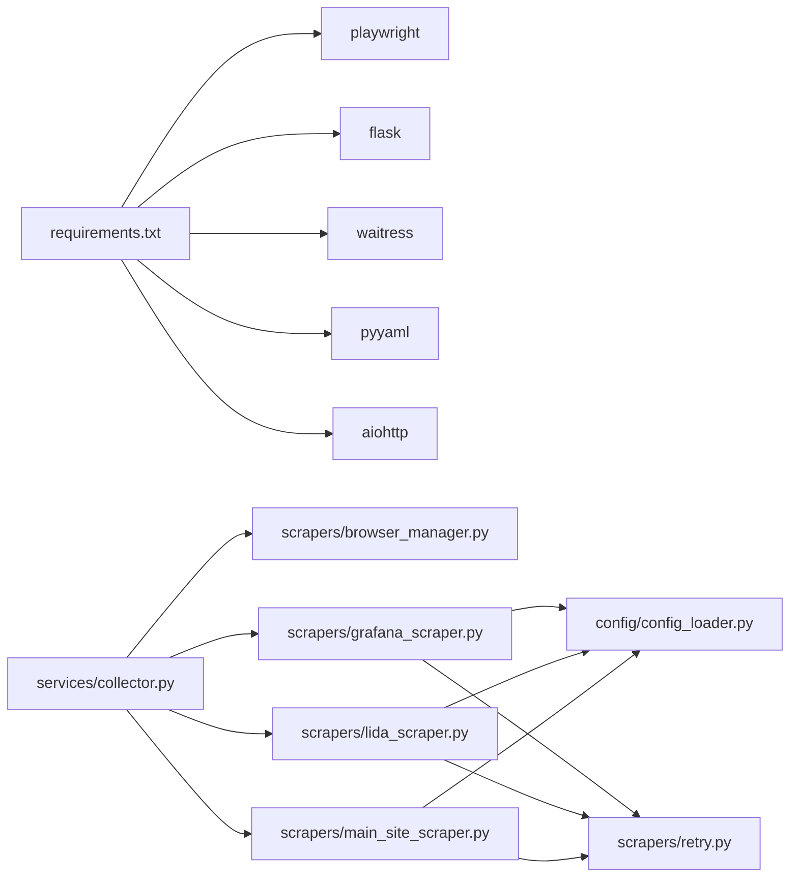

# 爬虫框架

<cite>
**本文引用的文件**   
- [main.py](file://main.py)
- [scrapers/base.py](file://scrapers/base.py)
- [scrapers/browser_manager.py](file://scrapers/browser_manager.py)
- [scrapers/grafana_scraper.py](file://scrapers/grafana_scraper.py)
- [scrapers/lida_scraper.py](file://scrapers/lida_scraper.py)
- [scrapers/main_site_scraper.py](file://scrapers/main_site_scraper.py)
- [scrapers/retry.py](file://scrapers/retry.py)
- [config/config_loader.py](file://config/config_loader.py)
- [services/collector.py](file://services/collector.py)
- [requirements.txt](file://requirements.txt)
</cite>

## 目录
1. [简介](#简介)
2. [项目结构](#项目结构)
3. [核心组件](#核心组件)
4. [架构总览](#架构总览)
5. [详细组件分析](#详细组件分析)
6. [依赖关系分析](#依赖关系分析)
7. [性能与稳定性](#性能与稳定性)
8. [故障排查指南](#故障排查指南)
9. [结论](#结论)
10. [附录：新平台接入指南](#附录新平台接入指南)

## 简介
本仓库实现了一个多平台数据自动采集系统，围绕“统一抽象 + 浏览器管理器 + 具体平台爬虫 + 编排器”的架构设计，支持 Grafana、Lida（通过 Metabase API）、主站等多个数据源。框架提供：
- 统一的爬虫接口与生命周期管理（BaseScraper）
- Playwright 浏览器实例与上下文管理（BrowserManager）
- 智能降级策略：优先 API 直连，失败自动回退到浏览器模式
- 重试机制与错误处理
- 并行采集与进度事件推送

## 项目结构
- 入口与 Web 服务：main.py 启动 Flask/waitress 服务
- 配置加载：config/config_loader.py 负责 YAML 配置校验与凭证读取
- 采集编排：services/collector.py 串联各平台爬虫，执行并行与降级逻辑
- 爬虫层：
  - scrapers/base.py：抽象基类，定义登录、采集、资源清理等通用能力
  - scrapers/browser_manager.py：Playwright 异步浏览器生命周期管理
  - scrapers/grafana_scraper.py：Grafana 数据采集（API/UI 双通道）
  - scrapers/lida_scraper.py：立达平台登录与 iframe 数据提取（当前由 Metabase API 替代）
  - scrapers/main_site_scraper.py：主站运维平台作业次数采集
  - scrapers/retry.py：通用重试装饰器（指数退避）
- 依赖声明：requirements.txt

**图示来源**
- [main.py:1-42](file://main.py#L1-L42)
- [services/collector.py:1-120](file://services/collector.py#L1-L120)
- [scrapers/browser_manager.py:1-76](file://scrapers/browser_manager.py#L1-L76)
- [scrapers/grafana_scraper.py:1-120](file://scrapers/grafana_scraper.py#L1-L120)
- [scrapers/lida_scraper.py:1-120](file://scrapers/lida_scraper.py#L1-L120)
- [scrapers/main_site_scraper.py:1-120](file://scrapers/main_site_scraper.py#L1-L120)
- [config/config_loader.py:1-147](file://config/config_loader.py#L1-L147)
- [scrapers/retry.py:1-82](file://scrapers/retry.py#L1-L82)

**章节来源**
- [main.py:1-42](file://main.py#L1-L42)
- [requirements.txt:1-7](file://requirements.txt#L1-L7)

## 核心组件
- BaseScraper：定义所有平台爬虫的统一接口（login、scrape、close），并提供页面获取、网络空闲等待、安全文本提取、点击等待等通用辅助方法；支持共享 BrowserContext 与上下文关闭策略。
- BrowserManager：封装 Playwright 异步 API，负责浏览器启动、上下文创建、默认超时设置、缓存清理、停止与连接状态检查。
- Collector（编排器）：按平台顺序与并行策略组织采集流程，支持 API 直连与浏览器模式，具备自动降级、暂停/继续、进度事件广播、结果合并与持久化。
- Retry 装饰器：对同步/异步函数提供指数退避重试，可配置最大尝试次数、退避基数与可重试异常类型。

**章节来源**
- [scrapers/base.py:12-104](file://scrapers/base.py#L12-L104)
- [scrapers/browser_manager.py:11-76](file://scrapers/browser_manager.py#L11-L76)
- [services/collector.py:65-120](file://services/collector.py#L65-L120)
- [scrapers/retry.py:13-82](file://scrapers/retry.py#L13-L82)

## 架构总览
整体采用“编排器驱动 + 插件式爬虫”的架构。Collector 根据配置与运行时条件选择 API 或浏览器模式，并在失败时自动降级。BrowserManager 作为底层资源池被多个爬虫复用，减少重复登录与上下文开销。

**图示来源**
- [scrapers/base.py:12-104](file://scrapers/base.py#L12-L104)
- [scrapers/browser_manager.py:11-76](file://scrapers/browser_manager.py#L11-L76)
- [scrapers/grafana_scraper.py:48-120](file://scrapers/grafana_scraper.py#L48-L120)
- [scrapers/lida_scraper.py:35-120](file://scrapers/lida_scraper.py#L35-L120)
- [scrapers/main_site_scraper.py:21-120](file://scrapers/main_site_scraper.py#L21-L120)
- [services/collector.py:65-120](file://services/collector.py#L65-L120)

## 详细组件分析

### BaseScraper 抽象基类
- 职责：统一爬虫接口、页面与上下文管理、通用导航与交互工具方法。
- 关键设计：
  - _get_page：若当前页无效则从上下文创建新页；若上下文不存在则新建；标记是否共享上下文以控制关闭策略。
  - close：非共享上下文才关闭 context；避免外部共享上下文被误关。
  - 辅助方法：_safe_goto、_wait_network_idle、_safe_text、_click_and_wait，提升鲁棒性。
- 复杂度：页面/上下文操作均为 O(1)，等待时间受网络与目标站点影响。

**图示来源**
- [scrapers/base.py:24-35](file://scrapers/base.py#L24-L35)

**章节来源**
- [scrapers/base.py:12-104](file://scrapers/base.py#L12-L104)

### BrowserManager 浏览器管理器
- 职责：Playwright 异步 API 封装，管理浏览器进程、上下文与页面生命周期。
- 关键点：
  - start：懒启动 Chromium，读取 headless/slow_mo 等配置。
  - new_context：设置视口、CSP 绕过、清除 cookies、默认超时。
  - stop：关闭浏览器与 Playwright 实例。
  - is_running：检测连接状态。
- 性能与资源：
  - 单例浏览器进程，多次 new_context 复用，降低启动成本。
  - 无头模式下固定视口，确保渲染一致性。

**图示来源**
- [scrapers/browser_manager.py:18-76](file://scrapers/browser_manager.py#L18-L76)
- [config/config_loader.py:94-96](file://config/config_loader.py#L94-L96)

**章节来源**
- [scrapers/browser_manager.py:11-76](file://scrapers/browser_manager.py#L11-L76)
- [config/config_loader.py:39-96](file://config/config_loader.py#L39-L96)

### GrafanaScraper 数据抓取逻辑
- 认证：
  - 优先使用 API Token；若无则走 UI 登录（用户名/密码或回退 lida 凭证）。
  - 多重登录成功检测：CSS 选择器、URL 变化、表单消失。
- 数据采集：
  - 优先 API 直连（若可用）；失败回退 UI。
  - UI 方式：从 dashboards 列表定位仪表板，设置时间与学校变量，监听响应并解析比例值，必要时点击柱状图 tooltip 或通过 canvas 悬停取值。
- 健壮性：
  - 多处兜底策略：JS 修改 URL 参数、DOM 遍历、API 响应解析、canvas tooltip。
  - 日志诊断：面板标题、响应 keys、数值候选等。

**图示来源**
- [scrapers/grafana_scraper.py:56-143](file://scrapers/grafana_scraper.py#L56-L143)
- [scrapers/grafana_scraper.py:284-326](file://scrapers/grafana_scraper.py#L284-L326)
- [scrapers/grafana_scraper.py:327-598](file://scrapers/grafana_scraper.py#L327-L598)

**章节来源**
- [scrapers/grafana_scraper.py:48-143](file://scrapers/grafana_scraper.py#L48-L143)
- [scrapers/grafana_scraper.py:284-326](file://scrapers/grafana_scraper.py#L284-L326)
- [scrapers/grafana_scraper.py:327-598](file://scrapers/grafana_scraper.py#L327-L598)

### LidaScraper 登录认证流程
- 登录：访问登录页，填写凭据，切换至“学校端”。
- 学校选择：通过下拉菜单精确匹配或子串匹配选择学校。
- 数据提取：当前由 Metabase API 替代浏览器方式；原 UI 流程包含 iframe 内数据卡片解析、筛选器设置与日期范围调整。
- 健壮性：多种选择器与 JS 兜底，弹窗确认按钮的多策略点击。

**图示来源**
- [scrapers/lida_scraper.py:43-76](file://scrapers/lida_scraper.py#L43-L76)
- [scrapers/lida_scraper.py:88-133](file://scrapers/lida_scraper.py#L88-L133)

**章节来源**
- [scrapers/lida_scraper.py:35-133](file://scrapers/lida_scraper.py#L35-L133)

### MainSiteScraper 主站数据采集
- 登录：Element UI 表单登录，URL 变化判断登录成功。
- 导航：学校运维 → 搜索学校 → 一键登录 → 考试阅卷系统 → 考试管理。
- 筛选与查询：通过 Vue 模型设置日期，选择场景“作业”，分类“手阅作业”，触发搜索。
- 提取：多种方式匹配作业场次（正则、分页组件、Vue total、表格行数）。
- 轻量清理：每校完成后关闭多余标签页，保留运维页面，避免重复登录。

**图示来源**
- [scrapers/main_site_scraper.py:96-128](file://scrapers/main_site_scraper.py#L96-L128)
- [scrapers/main_site_scraper.py:129-226](file://scrapers/main_site_scraper.py#L129-L226)
- [scrapers/main_site_scraper.py:228-306](file://scrapers/main_site_scraper.py#L228-L306)
- [scrapers/main_site_scraper.py:308-428](file://scrapers/main_site_scraper.py#L308-L428)
- [scrapers/main_site_scraper.py:429-566](file://scrapers/main_site_scraper.py#L429-L566)
- [scrapers/main_site_scraper.py:34-95](file://scrapers/main_site_scraper.py#L34-L95)

**章节来源**
- [scrapers/main_site_scraper.py:21-128](file://scrapers/main_site_scraper.py#L21-L128)
- [scrapers/main_site_scraper.py:129-306](file://scrapers/main_site_scraper.py#L129-L306)
- [scrapers/main_site_scraper.py:308-566](file://scrapers/main_site_scraper.py#L308-L566)
- [scrapers/main_site_scraper.py:34-95](file://scrapers/main_site_scraper.py#L34-L95)

### 智能降级策略与重试机制
- 降级策略：
  - Collector 中先尝试 API 直连（如 ApiGrafanaScraper、ApiMainSiteScraper），若返回空或抛出异常，则自动切换到浏览器模式（GrafanaScraper/MainSiteScraper）。
  - 主站支持 API 与浏览器共享同一 BrowserContext，避免 Cloud 平台重复登录导致会话冲突。
- 重试机制：
  - with_retry 装饰器用于登录与关键步骤，指数退避，支持自定义可重试异常与回调。
  - 主站导航到学校运维时内置网络超时重试。

**图示来源**
- [services/collector.py:337-406](file://services/collector.py#L337-L406)
- [services/collector.py:551-630](file://services/collector.py#L551-L630)
- [scrapers/retry.py:13-82](file://scrapers/retry.py#L13-L82)
- [scrapers/main_site_scraper.py:137-161](file://scrapers/main_site_scraper.py#L137-L161)

**章节来源**
- [services/collector.py:237-264](file://services/collector.py#L237-L264)
- [services/collector.py:337-406](file://services/collector.py#L337-L406)
- [services/collector.py:551-630](file://services/collector.py#L551-L630)
- [scrapers/retry.py:13-82](file://scrapers/retry.py#L13-L82)
- [scrapers/main_site_scraper.py:137-161](file://scrapers/main_site_scraper.py#L137-L161)

## 依赖关系分析
- 外部依赖：
  - playwright：浏览器自动化
  - flask、waitress：Web 服务
  - pyyaml：配置文件解析
  - aiohttp：可选 API 直连（当 api_mode=true 且安装时启用）
- 内部依赖：
  - Collector 依赖 BrowserManager 与各平台爬虫
  - 各爬虫依赖 config_loader 获取凭证与浏览器配置
  - retry 装饰器被登录与关键步骤使用

**图示来源**
- [requirements.txt:1-7](file://requirements.txt#L1-L7)
- [services/collector.py:1-120](file://services/collector.py#L1-L120)
- [scrapers/browser_manager.py:1-76](file://scrapers/browser_manager.py#L1-L76)
- [scrapers/grafana_scraper.py:1-120](file://scrapers/grafana_scraper.py#L1-L120)
- [scrapers/lida_scraper.py:1-120](file://scrapers/lida_scraper.py#L1-L120)
- [scrapers/main_site_scraper.py:1-120](file://scrapers/main_site_scraper.py#L1-L120)
- [config/config_loader.py:1-147](file://config/config_loader.py#L1-L147)
- [scrapers/retry.py:1-82](file://scrapers/retry.py#L1-L82)

**章节来源**
- [requirements.txt:1-7](file://requirements.txt#L1-L7)
- [services/collector.py:1-120](file://services/collector.py#L1-L120)

## 性能与稳定性
- 浏览器复用：BrowserManager 单例启动 Chromium，多次 new_context 复用，减少进程开销。
- 上下文共享：主站 API 与浏览器共享同一 context，避免 Cloud 平台重复登录导致的会话冲突。
- 等待策略：networkidle 与 DOM 就绪结合，兼顾 SPA 动态加载与稳定性。
- 重试与退避：with_retry 指数退避，降低瞬时失败的影响。
- 建议优化：
  - 合理设置 default_timeout 与 slow_mo，生产环境建议 headless=True、slow_mo=0。
  - 对大流量采集增加并发度与限流，避免触发目标站点风控。
  - 针对 Grafana 图表解析，优先使用 API 响应解析，减少 DOM 操作与 JS 执行。

[本节为通用指导，不直接分析具体文件]

## 故障排查指南
- 登录失败：
  - 检查凭证配置（credentials.lida/grafana/main_site），确认 username/password/url 正确。
  - 查看登录成功检测逻辑（CSS 选择器、URL 变化、表单消失）相关日志。
- 导航超时：
  - 主站导航到学校运维内置超时重试，关注 TIMED_OUT/CONNECTION 错误日志。
- 数据为空：
  - Grafana：检查 API 响应解析与面板标题映射；必要时启用 UI 降级。
  - 主站：检查分页信息与 Vue total 读取逻辑。
- 上下文问题：
  - 确认共享 context 是否正确传递与关闭；非共享 context 应在 close 时释放。

**章节来源**
- [scrapers/grafana_scraper.py:56-143](file://scrapers/grafana_scraper.py#L56-L143)
- [scrapers/main_site_scraper.py:137-161](file://scrapers/main_site_scraper.py#L137-L161)
- [scrapers/main_site_scraper.py:429-566](file://scrapers/main_site_scraper.py#L429-L566)
- [scrapers/base.py:56-66](file://scrapers/base.py#L56-L66)

## 结论
该框架通过统一的抽象基类与浏览器管理器，实现了多平台爬虫的可扩展性与高可用性。编排器提供的智能降级与重试机制显著提升了采集成功率。建议在新增平台时遵循 BaseScraper 规范，并充分利用 BrowserManager 的资源管理能力。

[本节为总结，不直接分析具体文件]

## 附录：新平台接入指南
- 步骤概览：
  1. 新建爬虫类继承 BaseScraper，实现 login 与 scrape（或 scrape_monthly）。
  2. 在 Collector 中注册新平台采集函数，支持 API 直连与浏览器降级。
  3. 在 config/config_loader.py 中添加凭证校验与读取。
  4. 如需浏览器模式，复用 BrowserManager 的 new_context/new_page。
  5. 使用 with_retry 装饰器保护登录与关键步骤。
- 代码示例路径（不含具体代码内容）：
  - 基类参考：[scrapers/base.py:12-104](file://scrapers/base.py#L12-L104)
  - 浏览器管理参考：[scrapers/browser_manager.py:18-76](file://scrapers/browser_manager.py#L18-L76)
  - 重试装饰器参考：[scrapers/retry.py:13-82](file://scrapers/retry.py#L13-L82)
  - 编排器集成参考：[services/collector.py:237-264](file://services/collector.py#L237-L264)、[services/collector.py:337-406](file://services/collector.py#L337-L406)、[services/collector.py:551-630](file://services/collector.py#L551-L630)
  - 凭证配置参考：[config/config_loader.py:89-119](file://config/config_loader.py#L89-L119)

**章节来源**
- [scrapers/base.py:12-104](file://scrapers/base.py#L12-L104)
- [scrapers/browser_manager.py:18-76](file://scrapers/browser_manager.py#L18-L76)
- [scrapers/retry.py:13-82](file://scrapers/retry.py#L13-L82)
- [services/collector.py:237-264](file://services/collector.py#L237-L264)
- [services/collector.py:337-406](file://services/collector.py#L337-L406)
- [services/collector.py:551-630](file://services/collector.py#L551-L630)
- [config/config_loader.py:89-119](file://config/config_loader.py#L89-L119)