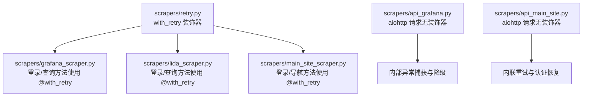
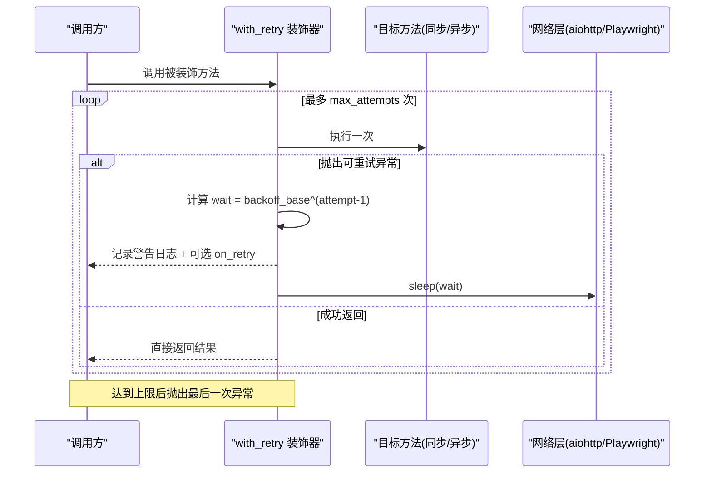
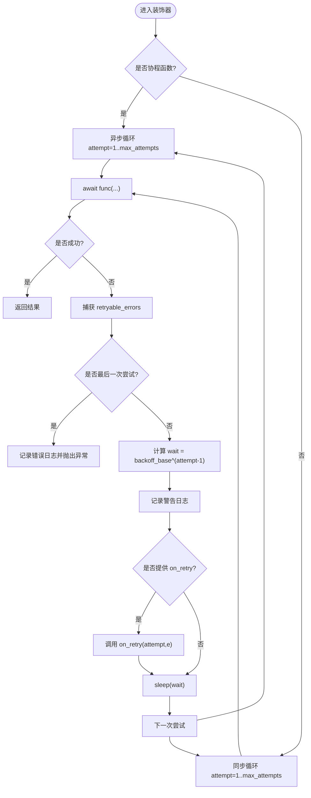
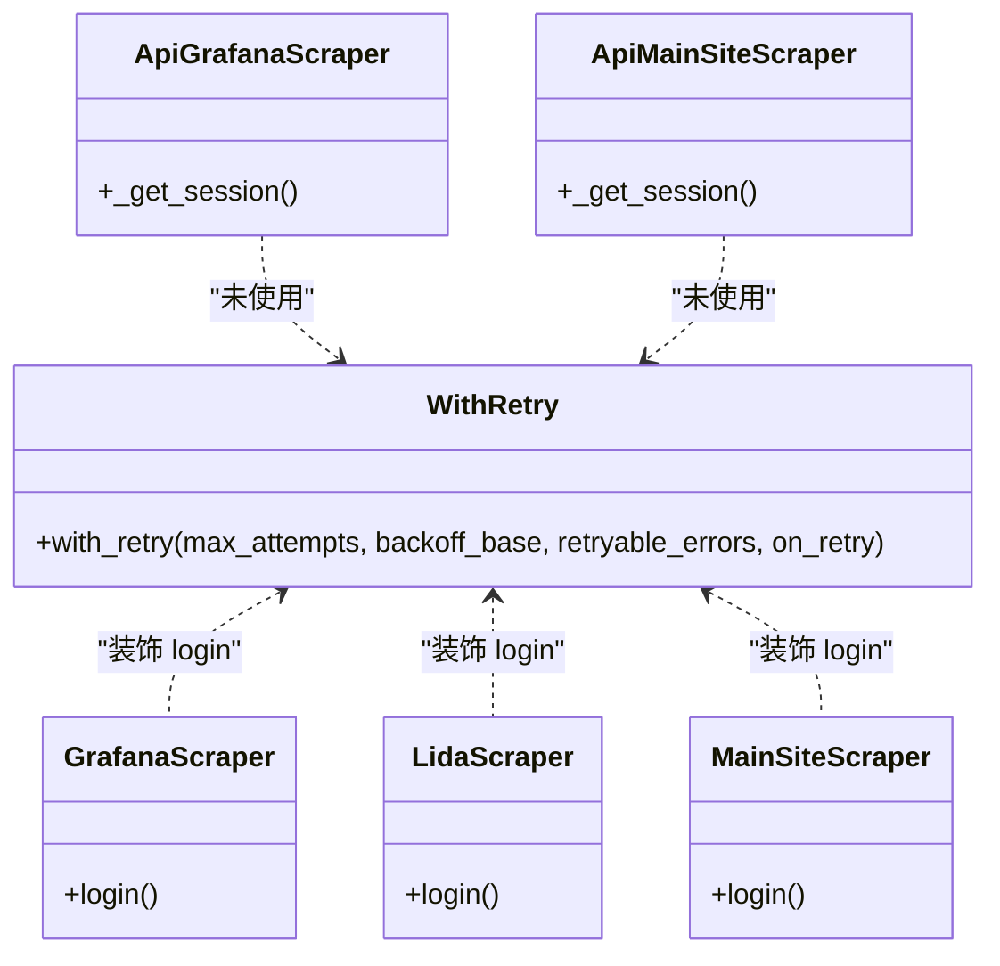

# 重试机制

<cite>
**本文引用的文件**   
- [scrapers/retry.py](file://middle-platform-data-collector-master/scrapers/retry.py)
- [scrapers/grafana_scraper.py](file://middle-platform-data-collector-master/scrapers/grafana_scraper.py)
- [scrapers/lida_scraper.py](file://middle-platform-data-collector-master/scrapers/lida_scraper.py)
- [scrapers/main_site_scraper.py](file://middle-platform-data-collector-master/scrapers/main_site_scraper.py)
- [scrapers/api_grafana.py](file://middle-platform-data-collector-master/scrapers/api_grafana.py)
- [scrapers/api_main_site.py](file://middle-platform-data-collector-master/scrapers/api_main_site.py)
</cite>

## 目录
1. [简介](#简介)
2. [项目结构](#项目结构)
3. [核心组件](#核心组件)
4. [架构总览](#架构总览)
5. [详细组件分析](#详细组件分析)
6. [依赖关系分析](#依赖关系分析)
7. [性能与超时管理](#性能与超时管理)
8. [错误分类与处理策略](#错误分类与处理策略)
9. [日志与监控指标](#日志与监控指标)
10. [降级与失败上报](#降级与失败上报)
11. [配置最佳实践](#配置最佳实践)
12. [故障排查指南](#故障排查指南)
13. [结论](#结论)

## 简介
本技术文档聚焦于“重试机制模块”，围绕装饰器模式在重试逻辑中的应用，系统阐述指数退避算法、最大重试次数控制、超时时间管理；说明网络错误的识别与分类处理（连接超时、HTTP 错误码、SSL 证书错误等）；解释如何自定义重试条件与基于响应内容的智能重试决策；并给出重试日志记录、监控指标收集、失败后的降级策略与错误上报机制，以及配置最佳实践与性能考虑。

## 项目结构
重试机制的核心实现位于 scrapers/retry.py，提供通用重试装饰器 with_retry，支持同步/异步函数，内置指数退避与可配置的可重试异常集合。多个爬虫与 HTTP 采集器通过装饰器或内联循环对关键路径进行重试保护。

图表来源
- [scrapers/retry.py:1-82](file://middle-platform-data-collector-master/scrapers/retry.py#L1-L82)
- [scrapers/grafana_scraper.py:50-143](file://middle-platform-data-collector-master/scrapers/grafana_scraper.py#L50-L143)
- [scrapers/lida_scraper.py:40-76](file://middle-platform-data-collector-master/scrapers/lida_scraper.py#L40-L76)
- [scrapers/main_site_scraper.py:90-127](file://middle-platform-data-collector-master/scrapers/main_site_scraper.py#L90-L127)
- [scrapers/api_grafana.py:64-75](file://middle-platform-data-collector-master/scrapers/api_grafana.py#L64-L75)
- [scrapers/api_main_site.py:49-54](file://middle-platform-data-collector-master/scrapers/api_main_site.py#L49-L54)

章节来源
- [scrapers/retry.py:1-82](file://middle-platform-data-collector-master/scrapers/retry.py#L1-L82)
- [scrapers/grafana_scraper.py:50-143](file://middle-platform-data-collector-master/scrapers/grafana_scraper.py#L50-L143)
- [scrapers/lida_scraper.py:40-76](file://middle-platform-data-collector-master/scrapers/lida_scraper.py#L40-L76)
- [scrapers/main_site_scraper.py:90-127](file://middle-platform-data-collector-master/scrapers/main_site_scraper.py#L90-L127)
- [scrapers/api_grafana.py:64-75](file://middle-platform-data-collector-master/scrapers/api_grafana.py#L64-L75)
- [scrapers/api_main_site.py:49-54](file://middle-platform-data-collector-master/scrapers/api_main_site.py#L49-L54)

## 核心组件
- 通用重试装饰器 with_retry
  - 自动检测同步/异步函数，分别包装执行
  - 指数退避：等待时间 = backoff_base ^ (attempt-1)
  - 最大尝试次数 max_attempts（含首次）
  - 可配置 retryable_errors 元组，默认包含 TimeoutError、ConnectionError、OSError
  - 可选 on_retry(attempt, exception) 回调用于扩展行为（如埋点）
  - 每次失败记录警告日志，最后一次失败记录错误日志并抛出异常

章节来源
- [scrapers/retry.py:10-82](file://middle-platform-data-collector-master/scrapers/retry.py#L10-L82)

## 架构总览
重试机制以装饰器为中心，被上层业务方法透明包裹。浏览器端爬虫（Grafana/Lida/MainSite）将登录与关键 UI 操作标记为可重试；HTTP 直连采集器（api_grafana/api_main_site）未使用装饰器，而是采用 aiohttp 的 ClientTimeout 与内联异常处理/重试逻辑。

图表来源
- [scrapers/retry.py:29-82](file://middle-platform-data-collector-master/scrapers/retry.py#L29-L82)

## 详细组件分析

### 装饰器 with_retry 的实现要点
- 同步/异步双分支：通过 inspect.iscoroutinefunction 判断，分别使用 time.sleep 与 asyncio.sleep
- 指数退避：wait = backoff_base ** (attempt - 1)，避免固定间隔导致的雪崩
- 可重试异常集：retryable_errors 参数允许按场景定制（例如加入特定 HTTP 异常类型）
- 回调钩子：on_retry(attempt, e) 可用于上报指标、触发告警或清理状态
- 日志输出：每次失败记录警告日志，最终失败记录错误日志并向上抛出

图表来源
- [scrapers/retry.py:29-82](file://middle-platform-data-collector-master/scrapers/retry.py#L29-L82)

章节来源
- [scrapers/retry.py:10-82](file://middle-platform-data-collector-master/scrapers/retry.py#L10-L82)

### 浏览器端爬虫的重试应用
- GrafanaScraper.login 使用 @with_retry(max_attempts=2, backoff_base=3.0)
- LidaScraper.login 使用 @with_retry(max_attempts=2, backoff_base=3.0)
- MainSiteScraper.login 使用 @with_retry(max_attempts=2, backoff_base=3.0)

这些方法在网络不稳定或页面加载延迟时具备基础自愈能力。

章节来源
- [scrapers/grafana_scraper.py:55-57](file://middle-platform-data-collector-master/scrapers/grafana_scraper.py#L55-L57)
- [scrapers/lida_scraper.py:42-44](file://middle-platform-data-collector-master/scrapers/lida_scraper.py#L42-L44)
- [scrapers/main_site_scraper.py:95-97](file://middle-platform-data-collector-master/scrapers/main_site_scraper.py#L95-L97)

### HTTP 直连采集器的重试与超时
- api_grafana.ApiGrafanaScraper._get_session 设置 aiohttp.ClientTimeout(total=30)
- api_main_site.ApiMainSiteScraper._get_session 设置 aiohttp.ClientTimeout(total=30)
- 两者均通过 try/except 捕获异常并记录日志，部分流程内联实现有限重试与认证恢复（如主站一键登录 token 过期时的重新登录）

章节来源
- [scrapers/api_grafana.py:64-75](file://middle-platform-data-collector-master/scrapers/api_grafana.py#L64-L75)
- [scrapers/api_main_site.py:49-54](file://middle-platform-data-collector-master/scrapers/api_main_site.py#L49-L54)
- [scrapers/api_main_site.py:247-288](file://middle-platform-data-collector-master/scrapers/api_main_site.py#L247-L288)

## 依赖关系分析
- with_retry 仅依赖标准库（asyncio、inspect、logging、time、functools），无第三方耦合，便于复用
- 浏览器端爬虫依赖 Playwright 异步 API，HTTP 直连采集器依赖 aiohttp
- 装饰器不感知具体网络栈，属于横切关注点，符合装饰器模式职责单一原则

图表来源
- [scrapers/retry.py:13-82](file://middle-platform-data-collector-master/scrapers/retry.py#L13-L82)
- [scrapers/grafana_scraper.py:55-57](file://middle-platform-data-collector-master/scrapers/grafana_scraper.py#L55-L57)
- [scrapers/lida_scraper.py:42-44](file://middle-platform-data-collector-master/scrapers/lida_scraper.py#L42-L44)
- [scrapers/main_site_scraper.py:95-97](file://middle-platform-data-collector-master/scrapers/main_site_scraper.py#L95-L97)
- [scrapers/api_grafana.py:64-75](file://middle-platform-data-collector-master/scrapers/api_grafana.py#L64-L75)
- [scrapers/api_main_site.py:49-54](file://middle-platform-data-collector-master/scrapers/api_main_site.py#L49-L54)

章节来源
- [scrapers/retry.py:13-82](file://middle-platform-data-collector-master/scrapers/retry.py#L13-L82)

## 性能与超时管理
- 指数退避降低瞬时拥塞压力，backoff_base 越大重试间隔越长，适合高抖动网络
- 最大尝试次数需结合业务 SLA 与下游服务限流策略设定，避免放大负载
- aiohttp 全局超时 total=30s，适用于大多数 REST 接口；对于大报表或批量导出可适当提高
- 浏览器端等待策略（networkidle、DOMContentLoaded）与重试配合，减少因资源未就绪导致的误判

建议
- 对幂等 GET 请求可采用较小 backoff_base 与较多 attempts
- 对写操作或易受限流的接口，增大 backoff_base 并限制 attempts
- 合理设置 ClientTimeout，避免长时间占用连接池

[本节为通用指导，无需代码引用]

## 错误分类与处理策略
当前 with_retry 默认可重试异常为 TimeoutError、ConnectionError、OSError。针对常见网络错误，建议如下分类与策略：

- 连接超时/网络抖动
  - 现象：TimeoutError、ConnectionError、OSError
  - 策略：使用 with_retry 指数退避重试
- HTTP 错误码
  - 4xx（客户端错误）：通常不应重试（如 400、403、404），除非业务语义明确可重试（如 429 限流）
  - 5xx（服务端错误）：可重试，建议结合指数退避
  - 建议：在调用处捕获 aiohttp 响应状态码，必要时抛出自定义异常纳入 retryable_errors
- SSL 证书错误
  - 现象：ssl.SSLCertVerificationError
  - 策略：仅在可信环境且确认为证书问题时可重试；否则应快速失败并上报
- 会话失效/认证失败
  - 现象：401/403 或业务 code 表示 token 过期
  - 策略：先刷新凭证（重新登录/获取 token），再重试；参考主站一键登录的 token 过期处理流程

注意
- 若需基于响应内容做智能重试（如 code==429 或 msg 包含“限流”），应在业务层捕获响应并抛出自定义异常，使 with_retry 能识别并重试

章节来源
- [scrapers/retry.py:10-11](file://middle-platform-data-collector-master/scrapers/retry.py#L10-L11)
- [scrapers/api_main_site.py:247-288](file://middle-platform-data-collector-master/scrapers/api_main_site.py#L247-L288)

## 日志与监控指标
- 日志
  - 每次失败记录警告日志，包含函数名、尝试次数、异常信息、下次重试等待时间
  - 最后一次失败记录错误日志并抛出异常
- 指标（建议通过 on_retry 回调上报）
  - 重试次数分布（attempt 计数）
  - 失败原因分类（异常类型、HTTP 状态码、错误消息关键字）
  - 重试耗时（sleep 时长累计）
  - 成功率/失败率（装饰器外层统计）
  - 超时与连接错误占比

章节来源
- [scrapers/retry.py:40-77](file://middle-platform-data-collector-master/scrapers/retry.py#L40-L77)

## 降级与失败上报
- 浏览器端
  - 登录失败：装饰器抛出异常，上层可捕获并切换备用登录方式或跳过该站点
  - 页面元素不可用：结合 _wait_network_idle 与选择器兜底，必要时回退到 URL 直跳
- HTTP 直连
  - api_grafana：请求失败返回空字典或降级值，保证后续流程继续
  - api_main_site：token 过期时重新登录并缓存，必要时回退到 Bearer token 方案
- 上报
  - 通过 on_retry 回调将关键事件推送至监控系统（如 Prometheus、APM）
  - 失败后统一写入错误日志并附带上下文（URL、参数、用户代理、时间戳）

章节来源
- [scrapers/api_grafana.py:205-219](file://middle-platform-data-collector-master/scrapers/api_grafana.py#L205-L219)
- [scrapers/api_main_site.py:247-288](file://middle-platform-data-collector-master/scrapers/api_main_site.py#L247-L288)

## 配置最佳实践
- max_attempts
  - 读多写少、幂等接口：2~3 次
  - 强一致写操作：1~2 次，优先快速失败
- backoff_base
  - 低抖动网络：1.5~2.0
  - 高抖动/跨地域：2.0~4.0
- retryable_errors
  - 默认包含 TimeoutError、ConnectionError、OSError
  - 可按需增加 aiohttp 相关异常或业务自定义异常
- on_retry
  - 接入指标上报、告警、熔断开关
- 超时
  - aiohttp ClientTimeout(total=30) 作为基线，根据接口特性调整
  - 浏览器端 wait_for_load_state/networkidle 与 goto timeout 配合

章节来源
- [scrapers/retry.py:13-27](file://middle-platform-data-collector-master/scrapers/retry.py#L13-L27)
- [scrapers/api_grafana.py:64-75](file://middle-platform-data-collector-master/scrapers/api_grafana.py#L64-L75)
- [scrapers/api_main_site.py:49-54](file://middle-platform-data-collector-master/scrapers/api_main_site.py#L49-L54)

## 故障排查指南
- 症状：频繁重试且最终失败
  - 检查 backoff_base 是否过小导致雪崩
  - 确认 retryable_errors 是否过宽导致非可重试错误被重试
- 症状：HTTP 401 反复出现
  - 检查凭证刷新逻辑是否生效（参考主站一键登录的 token 过期处理）
  - 确认 Cookie/JWT 作用域与域名是否正确
- 症状：浏览器登录偶发失败
  - 观察 networkidle 等待是否足够
  - 检查是否存在验证码或安全校验（如 Cloud 安全验证 cookie）
- 症状：SSL 证书错误
  - 确认证书链是否完整，是否在可信环境中运行
  - 临时关闭证书校验仅限调试，生产环境不建议

章节来源
- [scrapers/api_main_site.py:247-288](file://middle-platform-data-collector-master/scrapers/api_main_site.py#L247-L288)
- [scrapers/main_site_scraper.py:137-161](file://middle-platform-data-collector-master/scrapers/main_site_scraper.py#L137-L161)

## 结论
with_retry 装饰器以最小侵入的方式为同步/异步方法提供指数退避重试能力，配合合理的最大尝试次数与超时配置，能有效提升系统在弱网与服务抖动下的可用性。对于 HTTP 直连场景，建议结合 aiohttp 超时与业务层的响应码/内容判断，实现更精细的智能重试与降级策略。通过 on_retry 回调完善日志与指标上报，有助于持续优化重试参数与定位根因。