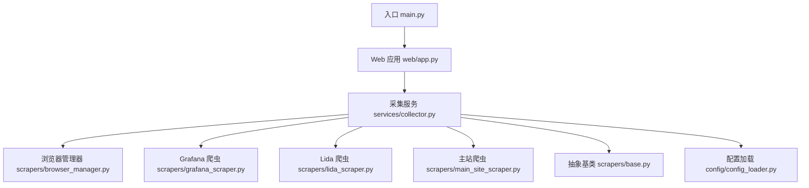
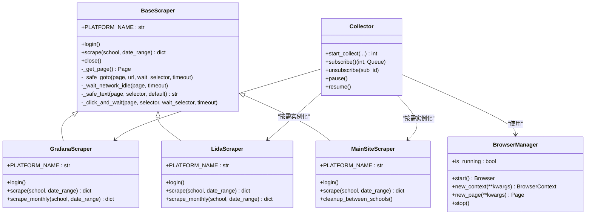
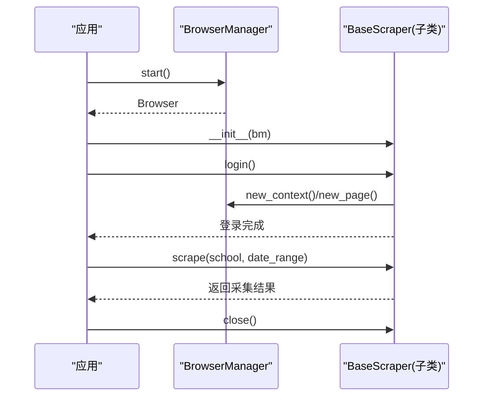
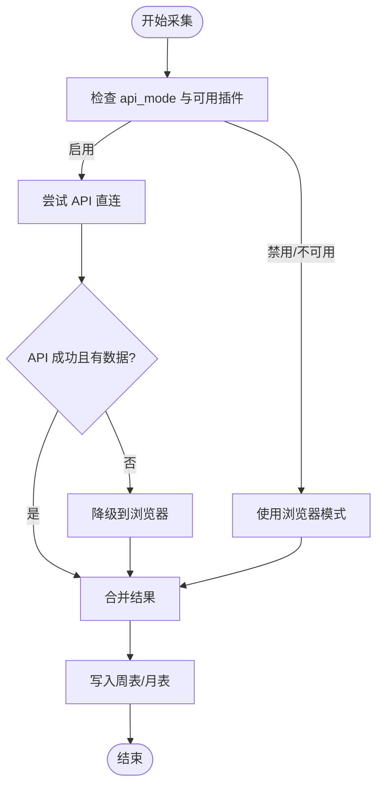
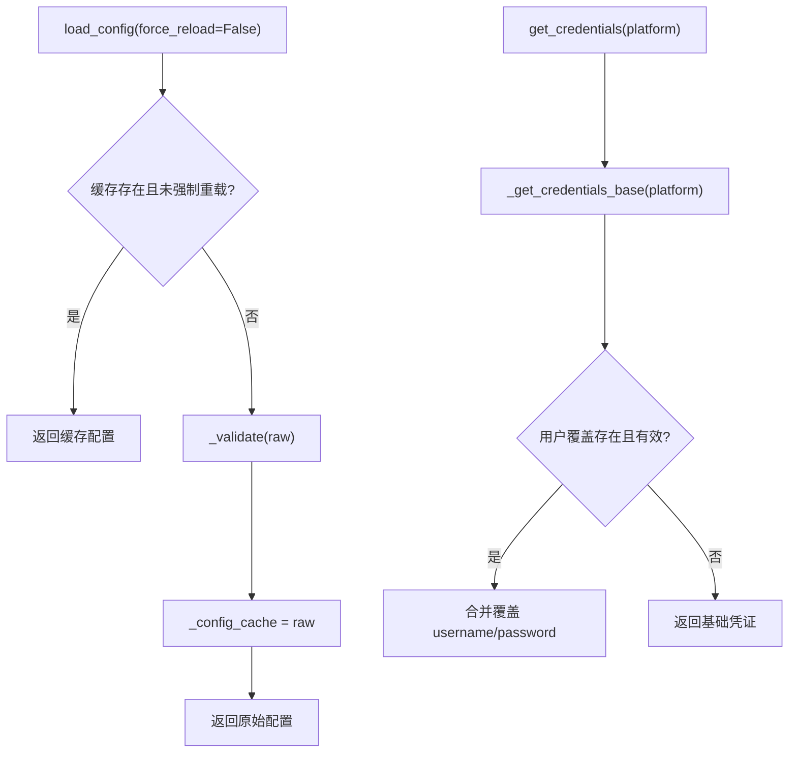
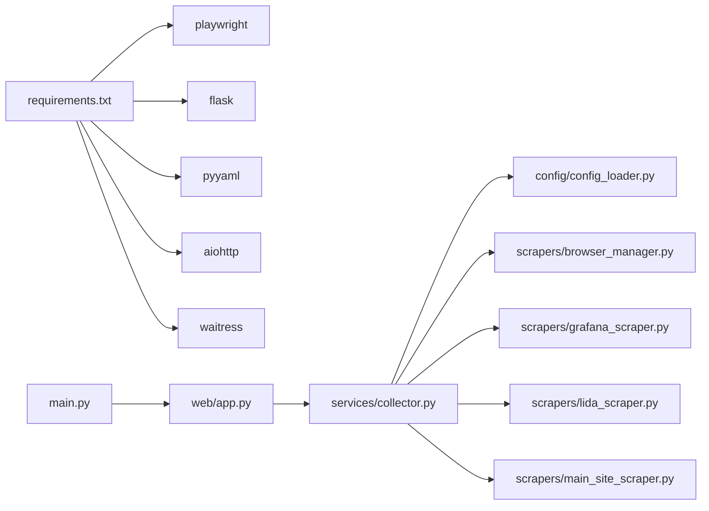

# 扩展架构设计

<cite>
**本文引用的文件**   
- [main.py](file://main.py)
- [web/app.py](file://web/app.py)
- [config/config_loader.py](file://config/config_loader.py)
- [scrapers/base.py](file://scrapers/base.py)
- [scrapers/browser_manager.py](file://scrapers/browser_manager.py)
- [scrapers/grafana_scraper.py](file://scrapers/grafana_scraper.py)
- [scrapers/lida_scraper.py](file://scrapers/lida_scraper.py)
- [scrapers/main_site_scraper.py](file://scrapers/main_site_scraper.py)
- [services/collector.py](file://services/collector.py)
- [requirements.txt](file://requirements.txt)
</cite>

## 目录
1. [引言](#引言)
2. [项目结构](#项目结构)
3. [核心组件](#核心组件)
4. [架构总览](#架构总览)
5. [详细组件分析](#详细组件分析)
6. [依赖关系分析](#依赖关系分析)
7. [性能与可扩展性考量](#性能与可扩展性考量)
8. [故障排查指南](#故障排查指南)
9. [结论](#结论)
10. [附录：新平台接入完整指南](#附录新平台接入完整指南)

## 引言
本设计文档面向教育平台数据自动采集系统的“扩展架构”，聚焦以下目标：
- 插件化架构：以抽象基类为核心，通过继承快速新增数据源。
- 配置驱动：通过统一配置加载器管理凭证、浏览器参数与可选能力开关。
- 多平台适配策略：支持 API 直连优先、浏览器自动化兜底，并具备降级与并行编排能力。
- 认证机制扩展：提供可插拔的认证流程与用户级凭证覆盖。
- 向后兼容与版本管理：在不破坏既有行为的前提下演进系统。

## 项目结构
系统采用分层组织方式：
- Web 层：Flask 应用工厂、路由蓝图、认证中间件
- 服务层：采集编排器（Collector），负责任务调度、进度广播、结果落库
- 爬虫层：基于异步 Playwright 的抽象基类与各平台实现
- 配置层：YAML 配置加载、校验、凭证覆盖、数据库路径解析
- 模型层：数据库模型与记录实体（周表/月表）
- 工具层：辅助脚本与测试用例

图表来源
- [main.py:1-42](file://main.py#L1-L42)
- [web/app.py:306-337](file://web/app.py#L306-L337)
- [services/collector.py:65-176](file://services/collector.py#L65-L176)
- [scrapers/base.py:12-104](file://scrapers/base.py#L12-L104)
- [scrapers/browser_manager.py:11-76](file://scrapers/browser_manager.py#L11-L76)
- [config/config_loader.py:21-96](file://config/config_loader.py#L21-L96)

章节来源
- [main.py:1-42](file://main.py#L1-L42)
- [web/app.py:306-337](file://web/app.py#L306-L337)

## 核心组件
- 抽象基类 BaseScraper：定义所有平台爬虫的统一接口（登录、采集、资源清理、通用页面操作）。
- 浏览器管理器 BrowserManager：封装 Playwright 生命周期，提供上下文与页面创建、超时与视口策略。
- 采集编排器 Collector：按平台优先级编排采集任务，支持 API 直连优先与浏览器降级，并行执行 Lida 与主站，SSE 进度事件广播。
- 配置加载器 ConfigLoader：集中管理 YAML 配置、必填字段校验、用户级凭证覆盖、Metabase DB 路径解析。
- 平台爬虫实现：GrafanaScraper、LidaScraper、MainSiteScraper，分别实现各自平台的登录与数据采集逻辑。

章节来源
- [scrapers/base.py:12-104](file://scrapers/base.py#L12-L104)
- [scrapers/browser_manager.py:11-76](file://scrapers/browser_manager.py#L11-L76)
- [services/collector.py:65-176](file://services/collector.py#L65-L176)
- [config/config_loader.py:21-96](file://config/config_loader.py#L21-L96)

## 架构总览
系统采用“编排器 + 插件式爬虫”的架构。Collector 作为中心协调者，根据配置与运行时条件选择具体实现（API 或浏览器），并通过统一的 BaseScraper 接口进行调用。

图表来源
- [scrapers/base.py:12-104](file://scrapers/base.py#L12-L104)
- [scrapers/grafana_scraper.py:48-55](file://scrapers/grafana_scraper.py#L48-L55)
- [scrapers/lida_scraper.py:35-42](file://scrapers/lida_scraper.py#L35-L42)
- [scrapers/main_site_scraper.py:21-33](file://scrapers/main_site_scraper.py#L21-L33)
- [scrapers/browser_manager.py:11-76](file://scrapers/browser_manager.py#L11-L76)
- [services/collector.py:65-176](file://services/collector.py#L65-L176)

## 详细组件分析

### 抽象基类与浏览器管理
- BaseScraper 定义了跨平台的统一契约：登录、采集、关闭；并提供通用的页面导航、等待网络空闲、文本提取、点击等待等辅助方法。
- BrowserManager 负责 Playwright 启动、上下文与页面创建、默认超时设置、无头模式视口策略，以及资源回收。

图表来源
- [scrapers/browser_manager.py:18-56](file://scrapers/browser_manager.py#L18-L56)
- [scrapers/base.py:17-73](file://scrapers/base.py#L17-L73)

章节来源
- [scrapers/base.py:12-104](file://scrapers/base.py#L12-L104)
- [scrapers/browser_manager.py:11-76](file://scrapers/browser_manager.py#L11-L76)

### 采集编排器（Collector）
- 支持 API 直连优先与浏览器降级；在 API 不可用或返回空数据时自动回退到浏览器模式。
- 按平台顺序执行：先 Grafana（或数据库直查替代），再并行执行 Lida 与主站。
- 提供 SSE 进度事件订阅，支持暂停/继续控制。
- 将各平台结果合并后写入周表/月表记录。

图表来源
- [services/collector.py:214-246](file://services/collector.py#L214-L246)
- [services/collector.py:337-406](file://services/collector.py#L337-L406)
- [services/collector.py:551-630](file://services/collector.py#L551-L630)
- [services/collector.py:732-800](file://services/collector.py#L732-L800)

章节来源
- [services/collector.py:65-176](file://services/collector.py#L65-L176)
- [services/collector.py:214-246](file://services/collector.py#L214-L246)
- [services/collector.py:337-406](file://services/collector.py#L337-L406)
- [services/collector.py:551-630](file://services/collector.py#L551-L630)
- [services/collector.py:732-800](file://services/collector.py#L732-L800)

### 配置系统与凭证覆盖
- 统一从 YAML 加载配置，校验必填字段（browser、credentials、metabase 可选）。
- 支持用户级凭证覆盖：set_user_creds_override 后可在 get_credentials 中优先使用。
- Metabase DB 路径解析优先级：环境变量 > 配置文件 > 默认值。

图表来源
- [config/config_loader.py:21-36](file://config/config_loader.py#L21-L36)
- [config/config_loader.py:39-74](file://config/config_loader.py#L39-L74)
- [config/config_loader.py:109-119](file://config/config_loader.py#L109-L119)
- [config/config_loader.py:122-147](file://config/config_loader.py#L122-L147)

章节来源
- [config/config_loader.py:21-96](file://config/config_loader.py#L21-L96)
- [config/config_loader.py:109-119](file://config/config_loader.py#L109-L119)
- [config/config_loader.py:122-147](file://config/config_loader.py#L122-L147)

### 平台爬虫实现要点
- GrafanaScraper：支持 API Token 认证与 UI 登录双重策略；面板标题映射到字段键；比例值通过多种策略提取（DOM、API 响应、canvas tooltip）。
- LidaScraper：进入 iframe 的 Metabase 仪表板，智能等待百分比数值出现，精确匹配学校下拉项，日期筛选器交互。
- MainSiteScraper：运维平台一键登录后进入考试管理，Vue 响应式设置日期，场景与分类筛选，作业次数多策略提取与分页处理。

章节来源
- [scrapers/grafana_scraper.py:48-55](file://scrapers/grafana_scraper.py#L48-L55)
- [scrapers/lida_scraper.py:35-42](file://scrapers/lida_scraper.py#L35-L42)
- [scrapers/main_site_scraper.py:21-33](file://scrapers/main_site_scraper.py#L21-L33)

## 依赖关系分析
- Web 层通过 Flask 应用工厂注册蓝图，并在请求前注入认证中间件。
- Collector 依赖配置加载器获取学校列表与凭证，依赖浏览器管理器与具体爬虫实现。
- 依赖安装由 requirements.txt 管理，包含 Playwright、Flask、PyYAML、aiohttp、Waitress 等。

图表来源
- [requirements.txt:1-7](file://requirements.txt#L1-L7)
- [main.py:1-42](file://main.py#L1-L42)
- [web/app.py:306-337](file://web/app.py#L306-L337)
- [services/collector.py:19-35](file://services/collector.py#L19-L35)

章节来源
- [requirements.txt:1-7](file://requirements.txt#L1-L7)
- [main.py:1-42](file://main.py#L1-L42)
- [web/app.py:306-337](file://web/app.py#L306-L337)
- [services/collector.py:19-35](file://services/collector.py#L19-L35)

## 性能与可扩展性考量
- 并发与降级：Collector 对 Lida 与主站并行执行，Grafana 优先 API 直连，失败自动降级到浏览器，提升整体吞吐与鲁棒性。
- 浏览器复用：主站 API 与浏览器共享同一 context，避免重复登录导致会话冲突；Lida 独立平台不受影响。
- 资源管理：BrowserManager 统一管理浏览器生命周期，减少频繁启动开销；BaseScraper 确保页面与上下文正确关闭。
- 配置热更新：通过 force_reload 参数可重新加载配置；用户级凭证覆盖便于动态切换账号。
- 可扩展点：新增平台仅需实现 BaseScraper 接口，并在 Collector 中按需实例化与编排。

[本节为通用指导，不直接分析具体文件]

## 故障排查指南
- 登录失败：检查 credentials 是否齐全，必要时启用用户级覆盖；确认 URL 与选择器是否正确。
- 数据为空：优先查看 API 模式是否启用且可用；若为空则自动降级浏览器模式，关注日志中的降级提示。
- 页面元素变化：调整选择器或增加 JS 兜底策略；利用 _safe_text/_click_and_wait 等通用方法增强稳定性。
- 并发异常：检查共享 context 的使用与关闭时机；确保每校之间轻量清理以避免状态污染。

章节来源
- [config/config_loader.py:39-74](file://config/config_loader.py#L39-L74)
- [services/collector.py:337-406](file://services/collector.py#L337-L406)
- [scrapers/base.py:76-104](file://scrapers/base.py#L76-L104)

## 结论
本扩展架构以 BaseScraper 为统一契约，结合 Collector 的编排与 BrowserManager 的资源管理，实现了高内聚、低耦合的可扩展体系。通过配置驱动的凭证管理与用户级覆盖，系统在保持向后兼容的同时具备良好的演进能力。新增平台只需遵循约定接口与配置规范，即可快速接入。

[本节为总结，不直接分析具体文件]

## 附录：新平台接入完整指南

### 一、继承 BaseScraper 添加新数据源
- 新建爬虫类，继承 BaseScraper，设置 PLATFORM_NAME。
- 实现 login 与 scrape（如需月度模式，实现 scrape_monthly）。
- 使用 _get_page 获取当前页面，使用通用辅助方法进行导航、等待与文本提取。
- 在 close 中释放资源；如需要学校间清理，实现 cleanup_between_schools。

章节来源
- [scrapers/base.py:12-104](file://scrapers/base.py#L12-L104)

### 二、扩展配置系统支持新平台
- 在 credentials 中添加新平台条目，至少包含 url；如需用户名密码，补充 username/password。
- 如需用户级覆盖，调用 set_user_creds_override 传入对应平台凭证。
- 若涉及外部数据库路径，可通过 METABASE_DB_PATH 环境变量或 database.metabase_db_path 配置。

章节来源
- [config/config_loader.py:39-74](file://config/config_loader.py#L39-L74)
- [config/config_loader.py:109-119](file://config/config_loader.py#L109-L119)
- [config/config_loader.py:122-147](file://config/config_loader.py#L122-L147)

### 三、实现自定义认证机制
- 在 login 中实现平台特定的认证流程（表单填写、Token 认证、Cookie 探测等）。
- 使用 with_retry 装饰器增强重试能力，提高稳定性。
- 登录成功后设置内部标记（如 _logged_in），避免重复登录。

章节来源
- [scrapers/grafana_scraper.py:56-143](file://scrapers/grafana_scraper.py#L56-L143)
- [scrapers/lida_scraper.py:43-76](file://scrapers/lida_scraper.py#L43-L76)
- [scrapers/main_site_scraper.py:96-128](file://scrapers/main_site_scraper.py#L96-L128)

### 四、集成到采集编排器
- 在 Collector 中按需导入新爬虫类，并根据 platforms 参数决定是否实例化。
- 在并行阶段加入新平台的采集函数，与其他平台协同执行。
- 将新平台结果合并到 results_cache，并在保存记录时写入相应字段。

章节来源
- [services/collector.py:247-264](file://services/collector.py#L247-L264)
- [services/collector.py:631-729](file://services/collector.py#L631-L729)
- [services/collector.py:732-800](file://services/collector.py#L732-L800)

### 五、插件加载机制说明
- 当前采用显式导入与条件实例化的方式，而非动态发现。新增平台需在 Collector 中注册。
- 建议未来引入插件注册表（如字典映射 platform_name -> 类引用），实现更灵活的加载与配置驱动。

[本节为概念性说明，不直接分析具体文件]

### 六、向后兼容性与版本管理策略
- 新增字段与功能应保持默认值与兼容性，避免破坏现有记录结构与前端展示。
- 配置变更需保留旧字段兼容读取，并在 _validate 中进行默认填充。
- 通过版本号或特性开关（如 api_mode）控制新功能启用，逐步灰度发布。

[本节为通用指导，不直接分析具体文件]