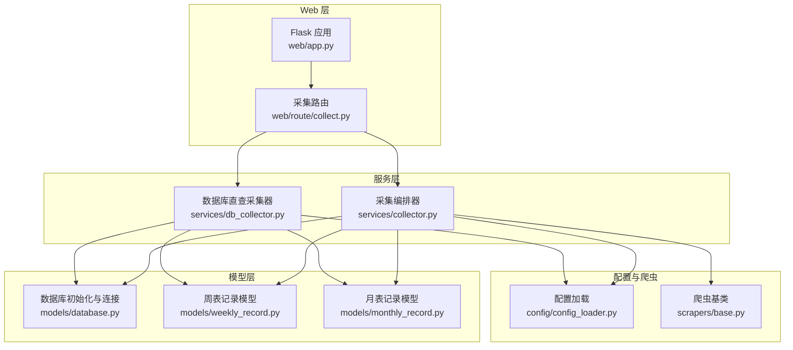
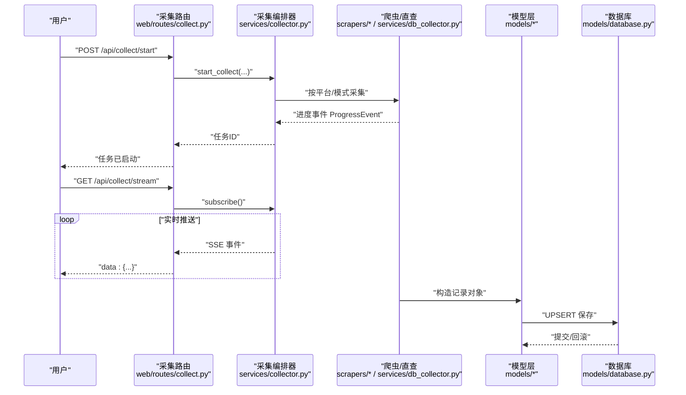
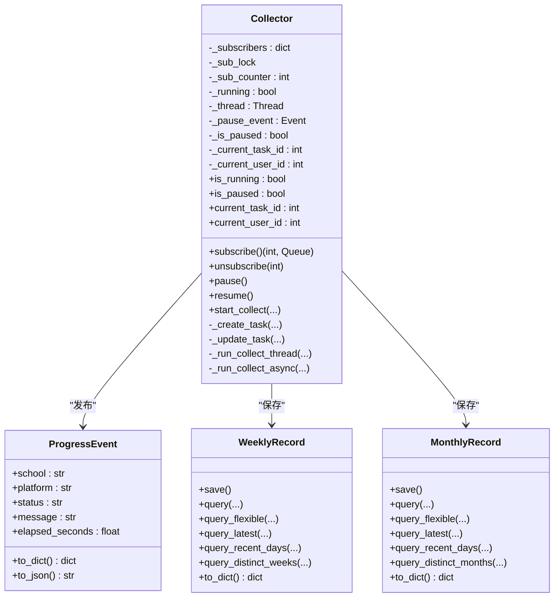
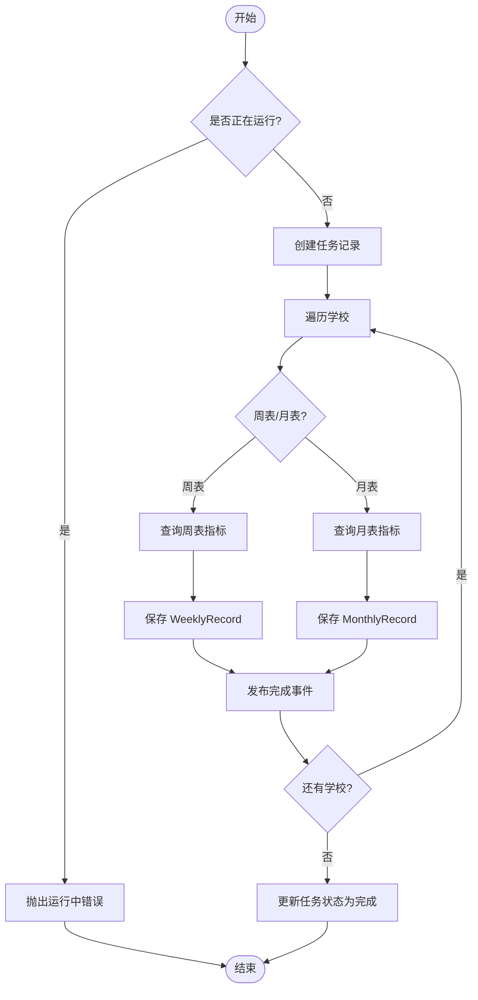
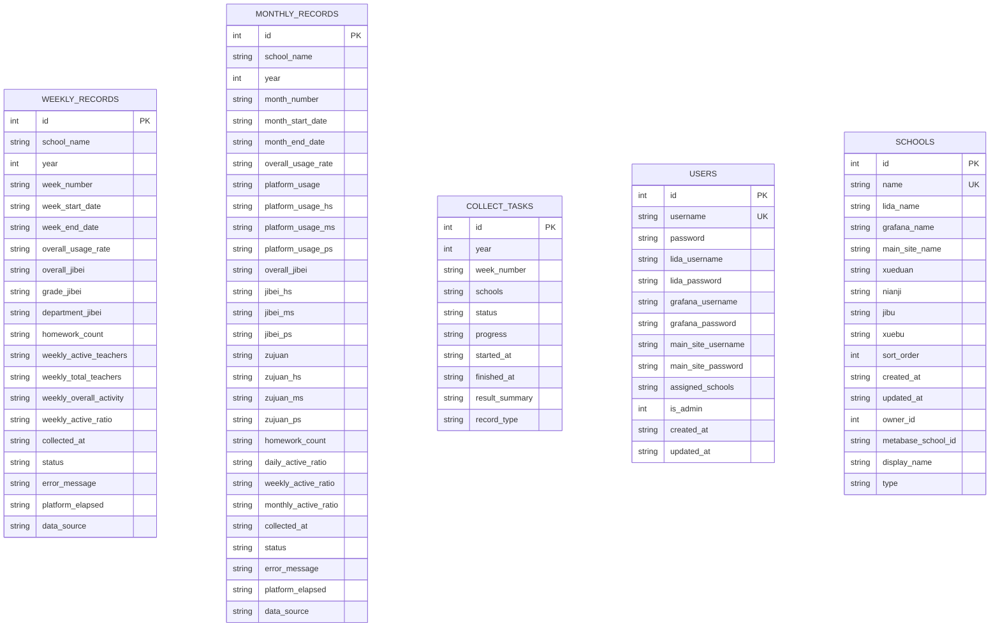
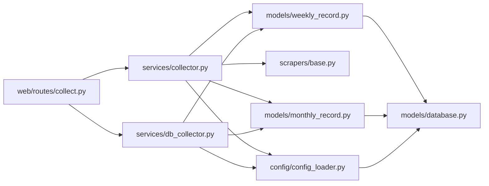

# 数据流设计

<cite>
**本文档引用的文件**
- [main.py](file://main.py)
- [web/app.py](file://web/app.py)
- [web/routes/collect.py](file://web/route/collect.py)
- [services/collector.py](file://services/collector.py)
- [services/db_collector.py](file://services/db_collector.py)
- [models/database.py](file://models/database.py)
- [models/weekly_record.py](file://models/weekly_record.py)
- [models/monthly_record.py](file://models/monthly_record.py)
- [config/config_loader.py](file://config/config_loader.py)
- [scrapers/base.py](file://scrapers/base.py)
</cite>

## 目录
1. [引言](#引言)
2. [项目结构](#项目结构)
3. [核心组件](#核心组件)
4. [架构总览](#架构总览)
5. [详细组件分析](#详细组件分析)
6. [依赖关系分析](#依赖关系分析)
7. [性能考虑](#性能考虑)
8. [故障排查指南](#故障排查指南)
9. [结论](#结论)
10. [附录](#附录)

## 引言
本设计文档面向“教育平台数据自动采集系统”，围绕从用户请求到数据入库的完整数据流进行系统化梳理，重点覆盖以下方面：
- 用户请求处理与鉴权
- 采集任务调度与并发控制
- 数据清洗与转换规则
- 数据库持久化与一致性
- 异步数据流与 SSE 实时进度推送
- 数据模型关系与转换映射
- 缓存策略与性能优化
- 数据一致性保障与错误恢复

## 项目结构
系统采用分层架构：Web 层负责路由与会话鉴权；服务层负责采集编排与进度事件发布；模型层负责数据库建模与持久化；配置层负责全局配置与凭证覆盖；爬虫层负责具体平台的数据采集。

**图表来源**
- [web/app.py:306-336](file://web/app.py#L306-L336)
- [web/routes/collect.py:1-170](file://web/routes/collect.py#L1-L170)
- [services/collector.py:65-176](file://services/collector.py#L65-L176)
- [services/db_collector.py:51-116](file://services/db_collector.py#L51-L116)
- [models/database.py:201-372](file://models/database.py#L201-L372)
- [models/weekly_record.py:9-31](file://models/weekly_record.py#L9-L31)
- [models/monthly_record.py:9-46](file://models/monthly_record.py#L9-L46)
- [config/config_loader.py:21-36](file://config/config_loader.py#L21-L36)
- [scrapers/base.py:12-23](file://scrapers/base.py#L12-L23)

**章节来源**
- [web/app.py:306-336](file://web/app.py#L306-L336)
- [web/routes/collect.py:1-170](file://web/routes/collect.py#L1-L170)
- [services/collector.py:65-176](file://services/collector.py#L65-L176)
- [services/db_collector.py:51-116](file://services/db_collector.py#L51-L116)
- [models/database.py:201-372](file://models/database.py#L201-L372)
- [models/weekly_record.py:9-31](file://models/weekly_record.py#L9-L31)
- [models/monthly_record.py:9-46](file://models/monthly_record.py#L9-L46)
- [config/config_loader.py:21-36](file://config/config_loader.py#L21-L36)
- [scrapers/base.py:12-23](file://scrapers/base.py#L12-L23)

## 核心组件
- Web 应用与路由
  - 应用工厂创建 Flask 应用，注册蓝图，初始化数据库，并注入认证中间件。
  - 采集路由提供启动、暂停/恢复、状态查询与 SSE 进度流接口。
- 采集编排器
  - 支持 API 直连与浏览器两种采集模式，具备自动降级能力。
  - 提供订阅/退订机制，通过队列向多个 SSE 客户端广播进度事件。
  - 支持周表/月表两种记录类型，支持暂停/继续。
- 数据库直查采集器
  - 直接查询 metabase.db 计算活跃度指标，不启动浏览器。
  - 与采集编排器共享互斥控制，避免并发冲突。
- 数据模型
  - weekly_records 与 monthly_records 表结构定义与迁移策略。
  - 记录模型提供 UPSERT 保存、灵活查询与字段映射。
- 配置与凭证
  - 加载 YAML 配置，校验必填字段，支持用户级别凭证覆盖。
- 爬虫基类
  - 抽象出统一的页面获取、等待、点击与清理流程，支持共享上下文。

**章节来源**
- [web/app.py:253-336](file://web/app.py#L253-L336)
- [web/routes/collect.py:22-170](file://web/routes/collect.py#L22-L170)
- [services/collector.py:65-176](file://services/collector.py#L65-L176)
- [services/db_collector.py:51-116](file://services/db_collector.py#L51-L116)
- [models/database.py:201-372](file://models/database.py#L201-L372)
- [models/weekly_record.py:9-31](file://models/weekly_record.py#L9-L31)
- [models/monthly_record.py:9-46](file://models/monthly_record.py#L9-L46)
- [config/config_loader.py:21-36](file://config/config_loader.py#L21-L36)
- [scrapers/base.py:12-23](file://scrapers/base.py#L12-L23)

## 架构总览
系统采用“请求-编排-采集-持久化”的流水线式架构，结合 SSE 实现实时进度推送。采集器根据配置选择 API 直连或浏览器模式，并在必要时进行降级。数据库层通过 WAL 模式与外键约束提升可靠性与一致性。

**图表来源**
- [web/routes/collect.py:22-170](file://web/routes/collect.py#L22-L170)
- [services/collector.py:133-176](file://services/collector.py#L133-L176)
- [services/db_collector.py:91-116](file://services/db_collector.py#L91-L116)
- [models/weekly_record.py:32-68](file://models/weekly_record.py#L32-L68)
- [models/monthly_record.py:47-100](file://models/monthly_record.py#L47-L100)
- [models/database.py:24-48](file://models/database.py#L24-L48)

## 详细组件分析

### 采集编排器（Collector）
- 角色与职责
  - 负责任务生命周期管理（创建、运行、暂停/继续、结束）、平台优先级调度、API/浏览器双模式与降级策略、结果合并与持久化。
- 异步与并发
  - 后台线程启动事件循环，内部使用 asyncio 并行执行各平台采集任务。
  - 平台间串行、平台内学校顺序执行，Lida 与主站并行执行，最大化吞吐。
- 进度事件与 SSE
  - 通过队列实现多客户端订阅，心跳与兜底完成信号确保前端可靠收尾。
- 数据转换与落库
  - 根据 record_type 生成 WeeklyRecord/MonthlyRecord，填充字段并执行 UPSERT。
  - 月表聚合字段来自各平台采集结果，周表字段来自 Grafana/Lida/主站。
- 错误处理与恢复
  - 单学校失败不影响整体，记录错误并标记部分成功/失败。
  - 异常退出线程时重置状态，避免僵尸状态。

**图表来源**
- [services/collector.py:65-176](file://services/collector.py#L65-L176)
- [services/collector.py:39-63](file://services/collector.py#L39-L63)
- [models/weekly_record.py:32-68](file://models/weekly_record.py#L32-L68)
- [models/monthly_record.py:47-100](file://models/monthly_record.py#L47-L100)

**章节来源**
- [services/collector.py:65-176](file://services/collector.py#L65-L176)
- [services/collector.py:195-213](file://services/collector.py#L195-L213)
- [services/collector.py:214-730](file://services/collector.py#L214-L730)
- [services/collector.py:732-800](file://services/collector.py#L732-L800)

### 数据库直查采集器（DbCollector）
- 角色与职责
  - 直接查询 metabase.db 计算活跃度指标，不启动浏览器，适合快速批量计算。
- 互斥与一致性
  - 与采集编排器共享互斥控制，避免同时运行导致资源竞争。
- 进度事件与落库
  - 发布 ProgressEvent，保存 WeeklyRecord/MonthlyRecord，标记 data_source 为 database。

**图表来源**
- [services/db_collector.py:91-116](file://services/db_collector.py#L91-L116)
- [services/db_collector.py:135-216](file://services/db_collector.py#L135-L216)
- [services/db_collector.py:217-332](file://services/db_collector.py#L217-L332)

**章节来源**
- [services/db_collector.py:51-116](file://services/db_collector.py#L51-L116)
- [services/db_collector.py:135-216](file://services/db_collector.py#L135-L216)
- [services/db_collector.py:217-332](file://services/db_collector.py#L217-L332)

### 数据模型与转换规则
- 表结构与迁移
  - weekly_records 与 monthly_records 初始化与增量迁移，确保字段兼容与历史数据平滑升级。
  - schools 与 users 表初始化，含默认管理员账户。
- 记录模型
  - WeeklyRecord/MonthlyRecord 提供 save() 的 UPSERT 语句，query_* 系列方法支持灵活检索。
  - 字段映射遵循 record_type 与数据源差异（如 data_source）。
- 转换规则
  - 月表：聚合平台使用率、集备、组卷等字段；周表：聚合活跃度、作业数等字段。
  - Grafana 数据异常时记录告警并标记部分失败。

**图表来源**
- [models/database.py:201-372](file://models/database.py#L201-L372)
- [models/weekly_record.py:32-68](file://models/weekly_record.py#L32-L68)
- [models/monthly_record.py:47-100](file://models/monthly_record.py#L47-L100)

**章节来源**
- [models/database.py:201-372](file://models/database.py#L201-L372)
- [models/weekly_record.py:32-68](file://models/weekly_record.py#L32-L68)
- [models/monthly_record.py:47-100](file://models/monthly_record.py#L47-L100)

### 配置与凭证覆盖
- 配置加载
  - 读取 config.yaml，校验浏览器、凭证、可选 Metabase 字段。
  - 缓存配置，支持强制重载。
- 凭证覆盖
  - 用户登录后可将用户凭证覆盖到平台级别，优先于全局配置。
- Metabase DB 路径
  - 支持环境变量、配置文件与默认路径三级优先级。

**章节来源**
- [config/config_loader.py:21-36](file://config/config_loader.py#L21-L36)
- [config/config_loader.py:39-74](file://config/config_loader.py#L39-L74)
- [config/config_loader.py:109-120](file://config/config_loader.py#L109-L120)
- [config/config_loader.py:122-147](file://config/config_loader.py#L122-L147)

### 爬虫基类与平台适配
- 基类能力
  - 统一的页面获取、等待网络空闲、安全文本提取、点击等待等工具方法。
  - 支持共享上下文，避免重复登录与会话失效。
- 平台策略
  - Grafana：优先 API 直连，失败自动降级浏览器。
  - Lida：已替换为 Metabase API，纯 API 采集。
  - 主站：API 与浏览器共享上下文，Cloud 登录一次即可。

**章节来源**
- [scrapers/base.py:12-23](file://scrapers/base.py#L12-L23)
- [scrapers/base.py:76-104](file://scrapers/base.py#L76-L104)
- [services/collector.py:254-264](file://services/collector.py#L254-L264)
- [services/collector.py:350-382](file://services/collector.py#L350-L382)
- [services/collector.py:564-617](file://services/collector.py#L564-L617)

## 依赖关系分析
- 组件耦合
  - 路由依赖采集编排器与数据库初始化；采集器依赖配置、爬虫与模型层；模型层依赖数据库连接。
- 外部依赖
  - Playwright（浏览器自动化）、SQLite（本地存储）、YAML（配置解析）。
- 循环依赖
  - 未发现直接循环依赖；通过蓝图注册与模块导入避免循环。

**图表来源**
- [web/routes/collect.py:8-11](file://web/routes/collect.py#L8-L11)
- [services/collector.py:19-26](file://services/collector.py#L19-L26)
- [services/db_collector.py:15-18](file://services/db_collector.py#L15-L18)
- [models/weekly_record.py:6](file://models/weekly_record.py#L6)
- [models/monthly_record.py:6](file://models/monthly_record.py#L6)
- [models/database.py:24-48](file://models/database.py#L24-L48)
- [config/config_loader.py:21-36](file://config/config_loader.py#L21-L36)

**章节来源**
- [web/routes/collect.py:8-11](file://web/routes/collect.py#L8-L11)
- [services/collector.py:19-26](file://services/collector.py#L19-L26)
- [services/db_collector.py:15-18](file://services/db_collector.py#L15-L18)
- [models/weekly_record.py:6](file://models/weekly_record.py#L6)
- [models/monthly_record.py:6](file://models/monthly_record.py#L6)
- [models/database.py:24-48](file://models/database.py#L24-L48)
- [config/config_loader.py:21-36](file://config/config_loader.py#L21-L36)

## 性能考虑
- 异步与并发
  - 采集器使用 asyncio 并行执行平台任务，最大化 IO 吞吐。
  - 主站 API 与浏览器共享上下文，减少登录成本。
- 数据库优化
  - SQLite WAL 模式提升并发写入性能；外键约束保障参照完整性。
  - UPSERT 语句减少重复查询与事务开销。
- 网络与等待
  - 爬虫基类提供网络空闲等待与超时容错，避免过早读取。
- SSE 心跳
  - SSE 通道发送心跳消息，防止代理/网关超时断开。

**章节来源**
- [services/collector.py:717-729](file://services/collector.py#L717-L729)
- [services/collector.py:682-716](file://services/collector.py#L682-L716)
- [models/database.py:30-48](file://models/database.py#L30-L48)
- [scrapers/base.py:82-88](file://scrapers/base.py#L82-L88)
- [web/routes/collect.py:150-158](file://web/routes/collect.py#L150-L158)

## 故障排查指南
- 常见问题定位
  - 采集任务无法启动：检查是否已有任务运行、日期格式、学校名称合法性。
  - SSE 无进度：确认前端已连接 /api/collect/stream，检查后端日志与队列状态。
  - Grafana API 失败：查看降级日志，确认凭证与网络；必要时切换浏览器模式。
  - 数据库直查失败：确认 metabase.db 路径与权限，检查查询 SQL 与表结构。
- 错误恢复
  - 采集器检测到异常退出线程时会重置状态，允许再次启动。
  - 任务状态与结果摘要持久化，便于后续审计与重跑。
- 日志与监控
  - 应用日志输出至 logs/app.log，采集过程中的异常与警告均有记录。

**章节来源**
- [web/routes/collect.py:22-102](file://web/routes/collect.py#L22-L102)
- [services/collector.py:154-162](file://services/collector.py#L154-L162)
- [services/db_collector.py:200-205](file://services/db_collector.py#L200-L205)
- [web/app.py:14-24](file://web/app.py#L14-L24)

## 结论
本系统通过清晰的分层与异步编排，实现了从用户请求到数据入库的高效闭环。SSE 实时进度推送提升了可观测性，数据库直查与 API/浏览器双模式满足不同场景需求。通过 WAL、UPSER、凭证覆盖与共享上下文等手段，在性能与可靠性之间取得平衡。

## 附录
- 启动入口
  - 生产模式使用 waitress，开发模式使用 Flask 内置服务器。
- 关键路径参考
  - 启动入口：[main.py:10-42](file://main.py#L10-L42)
  - 应用工厂与认证：[web/app.py:306-336](file://web/app.py#L306-L336)
  - 采集路由与 SSE：[web/routes/collect.py:22-170](file://web/routes/collect.py#L22-L170)
  - 采集编排与落库：[services/collector.py:133-800](file://services/collector.py#L133-L800)
  - 数据库初始化与迁移：[models/database.py:201-372](file://models/database.py#L201-L372)
  - 配置加载与凭证覆盖：[config/config_loader.py:21-147](file://config/config_loader.py#L21-L147)
  - 爬虫基类与平台策略：[scrapers/base.py:12-104](file://scrapers/base.py#L12-L104)